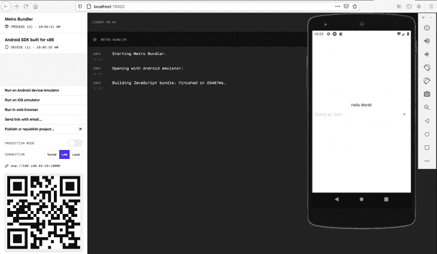
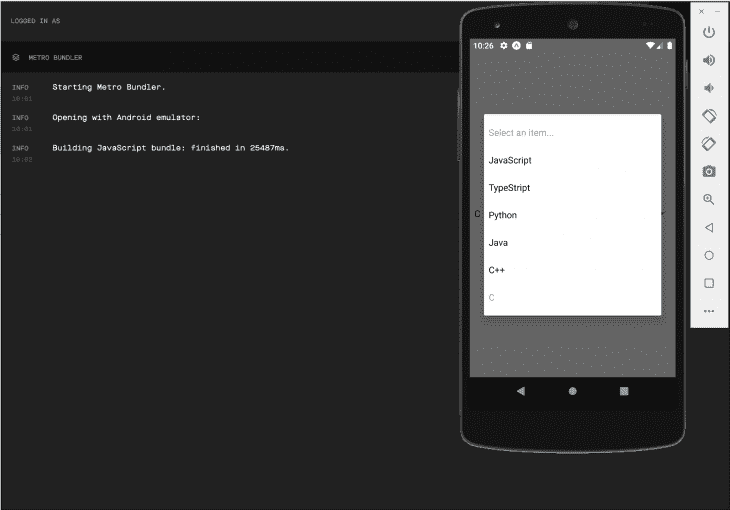
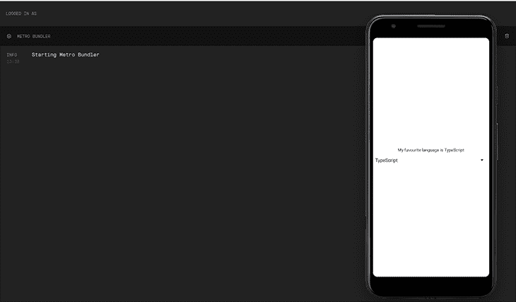
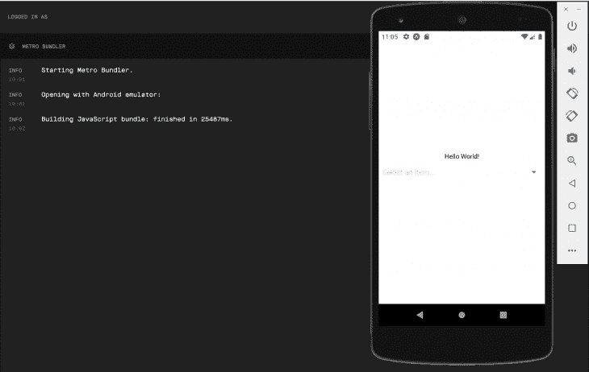
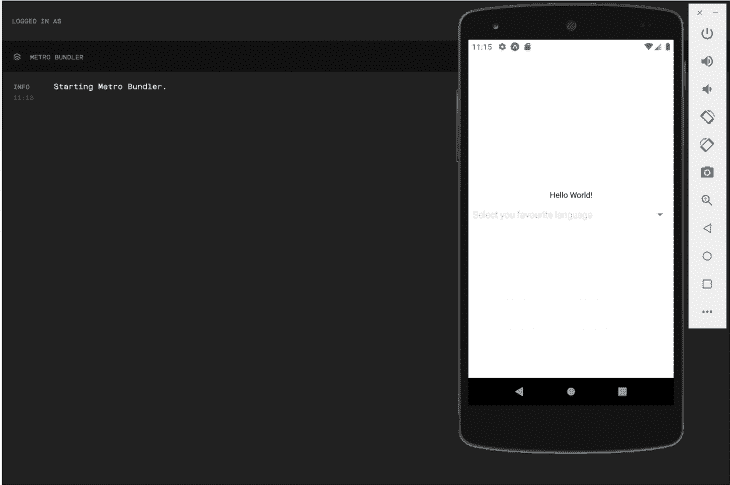
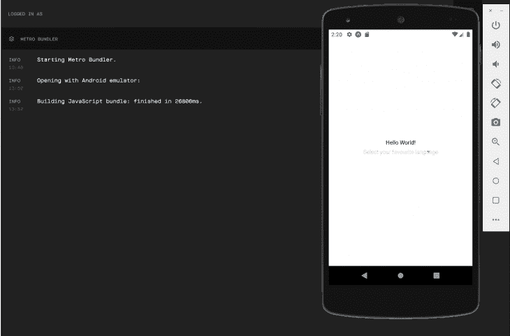

# 如何使用 react-native-picker-select-log rocket 博客

> 原文：<https://blog.logrocket.com/how-to-use-react-native-picker-select/>

***编者按*** *:本帖更新于 2022 年 1 月 27 日，旨在改进额外 Android 道具的实现，并整体更新教程。*

一个`picker`是一个`select`元素或组件的移动等价物，用于提供一个下拉或多项选择选项。

React 原生内核曾经支持[一个内置的`Picker`组件](https://reactnative.dev/docs/picker)，但是这已经被弃用，不再推荐使用。但是，建议使用任何一个[社区包](https://reactnative.directory/?search=picker)，而`react-native-picker-select`就是这些包中的一个。

## 什么是`react-native-picker-select`？

[`react-native-picker-select`](https://github.com/lawnstarter/react-native-picker-select) 是一个 React 原生选取器组件，模仿 Android 和 iOS 的原生`select`界面。尽管它模仿了原生的`select`界面，但它允许开发者按照他们认为合适的方式定制界面。

对于 iOS，默认情况下，`react-native-picker-select`组件只是包装了一个无样式的`TextInput`组件。开发者可以传递样式来定制它的外观和感觉。但是，对于 Android，默认使用默认选取器。

Android 用户可以通过将`false`传递给`useNativeAndroidPickerStyle`道具来强制它使用无样式的`TextInput`。现在可以通过传递样式来进行进一步的定制。

功能齐全，并配有许多道具，这使得它非常灵活和强大。让我们在下一节开始使用它。

## 入门指南

与所有 npm 软件包一样，安装应该很简单。然而，`react-native-picker-select`带有一个陷阱，尤其是当你使用`expo`的时候。

要安装它，只需运行:

```
npm i react-native-picker-select

```

这应该可以，但有时会出现下面的错误:

```
requireNativeComponent "RNCPicker" was not found in the UIManager error

```

您可以通过运行以下命令来解决此错误:

```
// React Native CLI
npm install @react-native-community/picker
npx pod-install

// Expo users
expo install @react-native-community/picker

```

根据您的环境，运行这些命令中的任何一个都可以解决问题。
安装后，`cd`进入 app 目录并运行:

```
npm install or yarn install

```

这将安装所有需要的依赖项。然后运行:

```
npm start or yarn start

```

这将为您的应用程序启动一个开发服务器，完成我们的开发环境设置。

现在我们已经设置好了我们的环境，我们可以直接进入如何详细使用`react-native-picker-select`库。

## 使用`react-native-picker-select`组件

如果您不想经历设置开发环境的麻烦，我已经为您创建了一个初学者应用程序。只需运行以下命令来克隆它:

```
git clone https://github.com/lawrenceagles/react-native-picker-demo

```

`cd`进入应用程序文件夹，按照之前的说明启动应用程序。迎接我们的是一个`hello world`和一个`select`组件，如下所示。



上面的 app 展示了`react-native-picker-select`包最基本的用法。请考虑下面的代码:

```
 import React from "react";
 import RNPickerSelect from "react-native-picker-select";
 import { StyleSheet, Text, View } from "react-native";
 export default function App () {
     return (
         <View style={styles.container}>
             <Text>Hello World!</Text>
             <RNPickerSelect
                 onValueChange={(value) => console.log(value)}
                 items={[
                     { label: "JavaScript", value: "JavaScript" },
                     { label: "TypeScript", value: "TypeScript" },
                     { label: "Python", value: "Python" },
                     { label: "Java", value: "Java" },
                     { label: "C++", value: "C++" },
                     { label: "C", value: "C" },
                 ]}
             />
         </View>
     );
 }
 const styles = StyleSheet.create({
     container : {
         flex            : 1,
         backgroundColor : "#fff",
         alignItems      : "center",
         justifyContent  : "center",
     },
 });

```

要使用`react-native-picker-select`，我们必须导入`RNPickerSelect`组件:

```
import RNPickerSelect from "react-native-picker-select";

```

然后在我们的代码中重用这个组件来呈现`select`视图。它有无数的道具，其中两个是必需的:

*   `items`道具
*   `onValueChange`道具

我们现在将逐一介绍。

### `items`道具

```
[
    { label: "JavaScript", value: "JavaScript" },
    { label: "TypeScript", value: "TypeScript" },
    { label: "Python", value: "Python" },
    { label: "Java", value: "Java" },
    { label: "C++", value: "C++" },
    { label: "C", value: "C" },
]

```

这是一个对象数组。每个项目都是一个具有`label`和`value`属性的对象。当用户点击`select`组件时，这些项目作为选项呈现给用户。

考虑下图:



### `onValueChange`道具

```
onValueChange={(value) => console.log(value)}

```

这是一个回调函数，返回选中的`value`和它的`index`，这很有用，因为我们可以用这个回调返回的数据做很多工作。

现在，我们只是将选择的值记录到控制台。但是我们可以用这些数据做一些非常有趣的事情，比如更新组件的状态。

## 用`useState`和`items`和`onValueChange`道具更新状态

我们可以用选定的数据设置组件的状态，如下面的代码所示:

```
onValueChange={(value) => setState(value)}

```

因此，我们可以使用这些数据进行进一步的计算。考虑下面的代码:

```
import React, { useState } from "react";
import RNPickerSelect from "react-native-picker-select";
import { StyleSheet, Text, View } from "react-native";

export default function App () {
    const [ language, setLanguage ] = useState("");
    return (
        <View style={styles.container}>
            <Text>
                {language ?
                  `My favourite language is ${language}` :
                    "Please select a language"
                }
            </Text>
            <RNPickerSelect
                onValueChange={(language) => setLanguage(language)}
                items={[
                    { label: "JavaScript", value: "JavaScript" },
                    { label: "TypeScript", value: "TypeScript" },
                    { label: "Python", value: "Python" },
                    { label: "Java", value: "Java" },
                    { label: "C++", value: "C++" },
                    { label: "C", value: "C" },
                ]}
              style={pickerSelectStyles}
            />
        </View>
    );
}

const styles = StyleSheet.create({
    container: {
        flex: 1,
        backgroundColor: '#fff',
        alignItems: 'center',
        justifyContent: 'center'
    }
});

const pickerSelectStyles = StyleSheet.create({
    inputIOS: {
        fontSize: 16,
        paddingVertical: 12,
        paddingHorizontal: 10,
        borderWidth: 1,
        borderColor: 'gray',
        borderRadius: 4,
        color: 'black',
        paddingRight: 30 // to ensure the text is never behind the icon
    },
    inputAndroid: {
        fontSize: 16,
        paddingHorizontal: 10,
        paddingVertical: 8,
        borderWidth: 0.5,
        borderColor: 'purple',
        borderRadius: 8,
        color: 'black',
        paddingRight: 30 // to ensure the text is never behind the icon
    }
});

```

在上面的代码中，当用户从`select`组件中选择一个值时，我们从`onValueChange`回调函数中检索该值，并更新`language`状态，如下所示:

```
onValueChange={(language) => setLanguage(language)}

```

这将触发重新渲染，并使用所选语言更新视图。但是，如果没有选择语言，将向用户呈现默认文本:

```
<Text>
  {language ? `My favourite language is ${language}` : "Please select a language"}
</Text>

```

值得注意的是，这只是一个用来演示`react-native-picker-select`用法的小应用程序。在复杂的情况下，状态中的数据可以用于更有用的目的，比如改变应用程序的显示语言。

考虑下图:



## Optional `react-native-picker-select` props

还有其他可选道具，但对于基本用法，以上两个是必需的。让我们来看看一些值得注意的可选道具:

*   `placeholder`道具
*   `useNativeAndroidPickerStyle`道具

### `placeholder`道具

考虑下图。在选择任何项目之前，我们看到在`select component`中显示的`select an item…`默认值。



这是正在使用的`placeholder`道具。它是一个同时具有`label`和`value`属性的对象。但是，这个对象的值是`null`，标签的值是`"select an item..."`，如下所示:

```
{label: "select an item...", value: null } // the placeholder prop

```

我们可以通过传递一个自定义的`placeholder`对象使我们的应用程序更具交互性，就像这样:

```
<View style={styles.container}>
  <Text>Hello World!</Text>
  <RNPickerSelect
      placeholder={{ label: "Select you favourite language", value: null }}
      onValueChange={(value) => console.log(value)}
      items={[
          { label: "JavaScript", value: "JavaScript" },
          { label: "TypeScript", value: "TypeScript" },
          { label: "Python", value: "Python" },
          { label: "Java", value: "Java" },
          { label: "C++", value: "C++" },
          { label: "C", value: "C" },
      ]}
  />
</View>

```

这向我们的用户显示了更恰当的信息。



您也可以完全禁用占位符。如果您想这样做，只需传递一个空对象:

```
placeholder={{}} // disables the placeholder message

```

### `useNativeAndroidPickerStyle`道具

这是一个专门针对 Android 设备的 Android 专用道具。它需要一个`boolean`值，就像我们之前讨论的那样。

默认情况下，`react-native-picker-select`模拟原生 Android `select`。为了防止这种情况，我们可以通过`false`，强制呈现的`select`组件使用非样式化的`TextInput`，使其在默认情况下表现得更像其对应的`iOS`。

考虑下面的代码和图像:

```
<View style={styles.container}>
  <Text>Hello World!</Text>
  <RNPickerSelect
      onValueChange={(value) => console.log(value)}
      useNativeAndroidPickerStyle={false}
      placeholder={{ label: "Select your favourite language", value: null }}
      items={[
          { label: "JavaScript", value: "JavaScript" },
          { label: "TypeScript", value: "TypeScript" },
          { label: "Python", value: "Python" },
          { label: "Java", value: "Java" },
          { label: "C++", value: "C++" },
          { label: "C", value: "C" },
      ]}
  />
</View>

```



你可以在这里获得所有道具[的更多细节。](https://www.npmjs.com/package/react-native-picker-select#props)

## 使用`react-native-picker-select`进行造型

`react-native-picker-select`具有各种各样的属性，可以作为设计的目标。所有这些都必须嵌套在`style` prop 下。其中一些属性是特定于平台的。

您可以通过分别定位`inputIOS`和`inputAndroid`属性来为 iOS 和 Android 设备设计`select`组件的样式。

考虑代码:

```
const customPickerStyles = StyleSheet.create({
  inputIOS: {
    fontSize: 14,
    paddingVertical: 10,
    paddingHorizontal: 12,
    borderWidth: 1,
    borderColor: 'green',
    borderRadius: 8,
    color: 'black',
    paddingRight: 30, // to ensure the text is never behind the icon
  },
  inputAndroid: {
    fontSize: 14,
    paddingHorizontal: 10,
    paddingVertical: 8,
    borderWidth: 1,
    borderColor: 'blue',
    borderRadius: 8,
    color: 'black',
    paddingRight: 30, // to ensure the text is never behind the icon
  },
});

```

这是可行的，但是因为默认情况下`iOS select`组件包装了非样式化的`TextInput`，所以它提供了比 Android `select`组件更多的样式对象。

Android 平台默认不提供`inputAndroidContainer`、`inputAndroid`和`placeholder`等样式对象。然而，您可以通过将`false`传递给`useNativeAndroidPickerStyle`来启用它们。

您可以在`react-native-picker-select`文档中获得[更多关于样式](https://www.npmjs.com/package/react-native-picker-select#styling)的细节，并查看更多[样式实现。](https://github.com/lawnstarter/react-native-picker-select#styling)

## 最后的想法

`react-naive-picker-select`是一个非常强大且易于使用的 React 本地组件。
虽然它不是一个成熟的表单处理组件，但是它做得很好。它可以使在 React 本地应用程序中实现`select`字段成为一项简单而有趣的任务。

如果你需要更多关于这个令人敬畏的组件的信息，请访问他们的[文档](https://www.npmjs.com/package/react-native-picker-select)。

## [LogRocket](https://lp.logrocket.com/blg/react-native-signup) :即时重现 React 原生应用中的问题。

[](https://lp.logrocket.com/blg/react-native-signup)

[LogRocket](https://lp.logrocket.com/blg/react-native-signup) 是一款 React 原生监控解决方案，可帮助您即时重现问题、确定 bug 的优先级并了解 React 原生应用的性能。

LogRocket 还可以向你展示用户是如何与你的应用程序互动的，从而帮助你提高转化率和产品使用率。LogRocket 的产品分析功能揭示了用户不完成特定流程或不采用新功能的原因。

开始主动监控您的 React 原生应用— [免费试用 LogRocket】。](https://lp.logrocket.com/blg/react-native-signup)