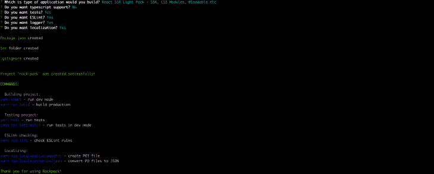

# 如何使用 Rockpack 

> 原文：<https://blog.logrocket.com/how-to-use-rockpack/>

简单地说， [Rockpack](https://www.rockpack.io/) 是[创造的 React App (CRA)](https://reactjs.org/docs/create-a-new-react-app.html) 的兴奋剂。这是一个 React 引导工具，旨在完成繁重的工作，并简化 React 应用程序的设置过程。

Rockpack 使开发人员能够引导 React 应用程序，支持服务器端渲染、捆绑、林挺、测试、日志、本地化等。

想到 Rockpack 最简单的方式是，它是 CRA，有许多有用的、经过深思熟虑的、通常是必需的附加功能。

在本帖中，我们将了解 Rockpack，它的架构，模块，以及为什么需要它。

## Rockpack 模块

Rockpack 最大的优点之一是它有一个模块化的架构，因此您可以只使用您想要的 Rockpack 模块。

在本节中，我们将详细了解每个 Rockpack 模块。

这是一个基于`Webpack`的反应捆绑器。它预先配置了必要的加载程序和插件，并使用开箱即用的最佳实践。

#### 用法:

要使用此模块，请执行以下步骤。

1.  安装模块:

    ```
    #NPM npm install  @rockpack/compiler --save-dev #YARN yarn add @rockpack/compiler --dev
    ```

2.  用下面的代码在根目录下创建一个`build.js`文件:

    ```
    const { frontendCompiler } = require('@rockpack/compiler');   frontendCompiler();
    ```

3.  运行`build.js` :

    ```
    #DEVELOPMENT cross-env NODE_ENV=development node build #PRODUCTION cross-env NODE_ENV=production node build
    ```

当您运行生产版本时，它会创建一个带有生产优化的应用程序的缩小版本。

Rockpack 编译器附带了许多令人惊叹的特性。以下是其中的一些:

*   类型脚本支持
*   支持使用 nodemon、livereload、source maps 构建 nodejs 脚本
*   反应优化
*   seo 优化
*   图像缩小
*   GraphQL 支持(web package graph QL loader)

这个清单还在继续。你可以在这里获得完整的列表[。](https://github.com/AlexSergey/rockpack/blob/master/packages/compiler/README.md#features)

这个重要的库为 Rockpack 项目提供了通用的服务器端渲染(`SSR`)支持。据说它提供了通用的`SSR`支持，因为它可以与 Redux (thunk，sagas)、Apollo、Mobx 和其他解决方案一起工作。

React 支持开箱即用的`SSR`，但是它不考虑异步操作。`@rockpack/ussr`增加了对异步操作的支持，以在`SSR`期间做出反应。

它提供了一些类似于 React 的 API(定制钩子)。其中一些是`useUssrState`和`useUssrEffect`。这些类似于`useState`和`useEffect`吊钩。然而，`useUssrState`和`useUssrEffect`支持异步操作和`SSR`。

#### 用法:

要使用`@rockpack/ussr`，请遵循以下步骤。

1.  安装模块:

    ```
    # NPM  npm install @rockpack/ussr --save  npm install @rockpack/compiler --save-dev   # YARN  yarn add @rockpack/ussr  yarn add @rockpack/compiler --dev
    ```

2.  像这样导入并使用带有`SSR`支持的钩子:

    ```
    import React from 'react';  import { useUssrState, useUssrEffect } from '@rockpack/ussr';   const getUsers = async () => {   // performs some async operation }   export const App = () => {    const [users, setUsers] = useUssrState({ users: [] });    useUssrEffect(async () => {          const allUsers = await getUsers();          setUsers(allUsers);    });    return {     // performs some operations to render the list of users   };  };
    ```

3.  配置`client.jsx` :

    ```
    import React from 'react';  import { hydrate } from 'react-dom';  import createUssr from '@rockpack/ussr';  import { App } from './App';   const [Ussr] = createUssr(window.USSR_DATA);  hydrate(      <Ussr>          <App />      </Ussr>,      document.getElementById('root')  );
    ```

该行:

```
const [Ussr] = createUssr(window.USSR_DATA); 

```

通过将服务器上执行的状态与客户端相关联，确保`useUssrState`正常工作。

另外，一旦我们选择引导一个`SSR`应用程序，`build.js`和一个`server.jsx`(它使用一个`Koa`)文件是默认设置的。这些文件经过预先配置，可以相互配合使用，无需进一步编辑。

你可以在这里获得更多关于使用`@rockpack/ussr`模块[的细节。](https://github.com/AlexSergey/rockpack/blob/master/packages/ussr/README.md#using)

这使用了 Jest 和一些推荐的模块和插件。它具有一个健壮的测试套件，配置了最佳实践。并且完全支持 TypeScript 和 babel。

#### 用法:

要使用此模块，请遵循以下步骤。

1.  安装:

    ```
    # NPM  npm install @rockpack/tester --save-dev   # YARN  yarn add @rockpack/tester --dev
    ```

2.  在您的项目根目录中创建`test.js`，并添加以下代码:

    ```
    const tests = require('@rockpack/tester');  tests();
    ```

3.  使用以下命令运行测试:

    ```
    node tests.js  #Development node tests.js --watch
    ```

这是使用最佳实践配置的 [Eslint](https://eslint.org/) 。

#### 用法:

要使用此模块，请遵循以下步骤。

* * *

### 更多来自 LogRocket 的精彩文章:

* * *

1.  安装:

    ```
    # NPM npm install @rockpack/codestyle --save-dev  # YARN yarn add @rockpack/codestyle --dev
    ```

2.  用下面的代码创建一个`eslintrc.js`文件:

    ```
    const { rockConfig } = require('@rockpack/codestyle');  module.exports = rockConfig({   'no-plusplus': 'error' });
    ```

3.  要覆盖所有的配置，你可以传递一秒给如下所示的`rockConfig()`函数:

    ```
    module.exports = rockConfig({}, {   plugins: [     'some new plugin'   ] });
    ```

您可以在此了解更多关于本模块[的信息。](https://github.com/AlexSergey/rockpack/blob/master/packages/codestyle/README.md#rockpackcodestyle)

这是事情变得真正有趣的地方，也是 Rockpack 大放异彩的地方。`@rockpack/logger`模块是一个高级记录系统，记录所有用户操作(按下的按钮、操作系统信息、显示等)。).然后可以在调试部分分析这些动作。

#### 用法:

要使用此模块，请遵循以下步骤。

1.  安装:

    ```
    # NPM  npm install @rockpack/logger --save  # YARN  yarn add @rockpack/logger
    ```

2.  将`App.js`组件包在`LoggerContainer`组件中，如下图:

    ```
    ...   <LoggerContainer     sessionID={window.sessionID}     limit={75}      getCurrentDate={() => dayjs().format('YYYY-MM-DD HH:mm:ss')}     stdout={showMessage}     onError={stackData => sendToServer(stack)}     onPrepareStack={stack => stack.language = window.navigator.language}   >     <App/>   </LoggerContainer> ...
    ```

上面的代码片段应该是一个`exported`匿名函数的返回值。`@rockpack/logger`模块的完整设置和使用要求有点高。

这是一个高级定位器模块，使用 [gettext](https://en.wikipedia.org/wiki/Gettext#:~:text=In%20computing%2C%20gettext%20is%20an,it%20separates%20programming%20from%20translating.) 。它提供了一种简单的方法来使我们的应用程序适应不同的语言和地区。

#### 使用

1.  安装:

    ```
    # NPM npm install @rockpack/localaser --save npm install @rockpack/compiler --save-dev  # YARN yarn add @rockpack/localaser yarn add @rockpack/compiler --dev
    ```

2.  接下来你必须将`App.js`包装在`LocalizationObserver`组件中，如下所示:

    ```
    import { LocalizationObserver } from '@rockpack/localaser';  const Root = () => {     return (       <LocalizationObserver          currentLanguage={this.state.currentLanguage}          languages={this.state.languages}       >         <App/>       </LocalizationObserver>     ) }
    ```

`@rockpack/localaser`模块的设置和使用要求有点高。

## 为什么选择 Rockpack？

一些著名的 Rockpack 替代品是`Next.js`和`Create React App`。然而，Rockpack 在许多方面都超过了它的竞争对手。

首先，所有 Rockpack 应用程序都支持以下开箱即用功能:

*   不同文件格式的导入([格式列表](https://github.com/AlexSergey/rockpack/blob/master/packages/compiler/README.md)
*   图像优化，SVG 优化
*   将 SVG 文件作为 React 组件加载
*   CSS/SCSS/less 模块
*   巴别塔或 TS，TS 支持 CSS/SCSS/less 模块
*   PostCSS autoprefixer
*   SEO 优化，React 优化
*   束分析器
*   GraphQL 支持

完整的列表可以在[这里](https://github.com/AlexSergey/rockpack/blob/master/packages/compiler/README.md)找到(这些都是使用最佳实践整理的)。通过提供所有这些现成的东西，Rockpack 旨在减少应用程序的安装时间。这与应用程序的大小和开发者的技能无关。

使用 Rockpack 的其他原因包括:

1.  它是模块化的，可以选择性地导入到遗留应用程序中
2.  它提供了一个易于使用且对初学者非常友好的 API(只需一行代码就可以引导一个具有上述特性的应用程序)
3.  它有一个非常灵活的架构，因此你可以使用你喜欢的库进行状态管理
4.  它为日志和本地化提供了强大的工具

Rockpack 的优点是令人兴奋和伟大的，任何开发人员都会对使用这个令人敬畏的库感兴趣。我们将在下一节研究如何使用 Rockpack 引导 React 应用程序。

## 如何开始使用 Rockpack

开始使用 Rockpack 最简单的方法是使用`[@rockpack/starter](https://www.rockpack.io/fast-setup)`模块。这是 Rockpack 项目的一部分。

它支持三种不同类型的应用程序:

1.  1.  **React 客户端渲染**(`React CSR`)——这给出了类似于创建 React 应用程序的样板代码
    2.  **React 服务器端呈现** ( `React SSR Light Pack` ) —这给出了如下样板代码:
        *   服务器端渲染(`SSR`)
        *   它使用`Koa`作为它的`Node.js`服务器
        *   `@loadable/components`
    3.  **React 服务器端呈现** ( `React SSR Full Pack` ) —这给出了包含以下内容的样板代码:
        *   我们所有的一切都在`React SSR Light Pack`
        *   反应路由器
        *   Redux
        *   还原传奇
        *   反应头盔异步
    4.  **库或 React 组件** **—** 这为 it 部门提供了开发 React 库或组件所需的高效配置的 Webpack，支持 esm/cjs 版本以及精简版本。

要引导任何应用程序，请遵循以下步骤。

1.  安装:

    ```
    #NPM npm install @rockpack/starter -g 
    ```

2.  创建您的应用:

    ```
    rockpack < your project name>
    ```

3.  回答终端问题，其余的由 Rockpack 处理。当一切完成后，你应该得到这个:
    
4.  开始你的项目:

    ```
    cd < your project name> # and run npm start
    ```

## 结论

Rockpack 是一个经过深思熟虑的库。我已经对使用它感到兴奋了。Rockpack 的一个优点是没有真正的学习曲线，因为您仍然可以编写 React 代码。它还为您提供了使用首选库进行状态管理的灵活性。

## [LogRocket](https://lp.logrocket.com/blg/react-signup-general) :全面了解您的生产 React 应用

调试 React 应用程序可能很困难，尤其是当用户遇到难以重现的问题时。如果您对监视和跟踪 Redux 状态、自动显示 JavaScript 错误以及跟踪缓慢的网络请求和组件加载时间感兴趣，

[try LogRocket](https://lp.logrocket.com/blg/react-signup-general)

.

[ ](https://lp.logrocket.com/blg/react-signup-general) [](https://lp.logrocket.com/blg/react-signup-general) 

LogRocket 结合了会话回放、产品分析和错误跟踪，使软件团队能够创建理想的 web 和移动产品体验。这对你来说意味着什么？

LogRocket 不是猜测错误发生的原因，也不是要求用户提供截图和日志转储，而是让您回放问题，就像它们发生在您自己的浏览器中一样，以快速了解哪里出错了。

不再有嘈杂的警报。智能错误跟踪允许您对问题进行分类，然后从中学习。获得有影响的用户问题的通知，而不是误报。警报越少，有用的信号越多。

LogRocket Redux 中间件包为您的用户会话增加了一层额外的可见性。LogRocket 记录 Redux 存储中的所有操作和状态。

现代化您调试 React 应用的方式— [开始免费监控](https://lp.logrocket.com/blg/react-signup-general)。