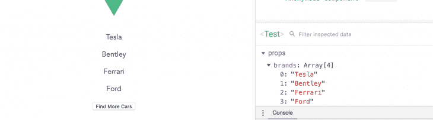

# 如何在 Vue.js 中使用无状态组件

> 原文：<https://blog.logrocket.com/how-to-use-stateless-components-in-vue-js/>

在这篇文章中，您将了解功能组件，并了解如何在 Vue 的工作流程中使用无状态组件。

## 开始之前

您需要在您的电脑中安装以下设备:

*   [Node.js 版本 10.x](https://nodejs.org/en/) 及以上安装。您可以通过在终端/命令提示符下运行以下命令来验证您是否拥有此版本的 Node.js:

```
node -v
```

为此，请先卸载旧版本的 CLI:

```
npm uninstall -g vue-cli
```

接下来，安装新的:

```
npm install -g @vue/cli
```

*   在这里下载一个 Vue starter 项目
*   解压缩下载的项目
*   导航到解压缩后的文件，并运行命令以保持所有依赖项最新:

```
npm install
```

## 简介:什么是状态和实例？

Vue 应用程序状态是决定组件行为的对象。Vue 应用程序状态决定了组件的呈现方式或动态性。

同时，Vue 实例是一个 ViewModel，它包含的选项包括表示元素的模板、要挂载的元素、方法和初始化时的生命周期挂钩。

## Vue 组件

Vue.js 中的组件通常是反应式的:在 Vue.js 中，数据对象可以有很多可以使用的概念、计算属性、方法和观察器的选项。此外，数据对象会在数据值发生变化时重新呈现。

相比之下，功能组件不保持状态。

## 功能组件

本质上，[功能组件](https://blog.logrocket.com/pure-functional-components-in-react-16-6/)是拥有自己组件的功能。功能组件没有状态或实例，因为它们不保存或跟踪状态。此外，您不能访问功能组件中的构造。

功能组件是为演示而创建的。Vue.js 中的功能组件类似于 React.js 中的功能组件。在 Vue 中，开发人员可以通过传递上下文，使用功能组件轻松地构建直接、简洁的组件。

## 功能组件语法

从[官方文档](https://vuejs.org/v2/guide/render-function.html#Functional-Components)来看，一个功能组件是这样的:

```
Vue.component('my-component', {
  functional: true,
  // Props are optional
  props: {
    // ...
  },
  // To compensate for the lack of an instance,
  // we are now provided a 2nd context argument.
  render: function (createElement, context) {
    // ...
  }
})
```

## 创建功能组件

创建功能组件时要记住的一个关键准则是功能属性。functional 属性是在组件的模板部分或脚本部分指定的。模板部分的语法如下所示:

```
<template functional>
  <div> <h1> hello world</h1>
  </div>
</template>
```

您可以将脚本指定为属性，如下所示:

```
export default {
  functional: true,
  render(createElement) {
    return createElement(
      "button", 'Click me'
    );
  }
};
```

## 为什么功能组件很重要？

功能组件可以快速执行，因为它们没有状态，并且在数据值改变时不会经历与模板的组件或部分相同的初始化和重新呈现过程。

大多数情况下，功能组件对于表示或显示项目循环非常有用。

## 演示

在这个介绍性演示中，您将看到带有 Vue 模板的单页面组件类型演示和功能组件的 render function 类型。

### 单页功能组件

打开您的`Test.vue`文件，并将下面的代码块复制到文件中:

```
<template functional>
  <div>
    <p v-for="brand in props.brands" :key="brand">{{brand}} </p>
  </div>
</template>
<script> 
export default {
  functional: true,
  name: 'Test',
  props: {
    brands: Array
  }
}
</script>
```

脚本和模板中的功能指示器显示这是一个功能组件。请注意，props 仍然可以被传递——它们是功能组件中唯一可以被传递的数据值。

时态数据 props hold 也可以循环使用。

打开您的`app.vue`文件，并将下面的代码块复制到其中:

```
<template>
  <div id="app">
    
    <Test 
     :brands ="['Tesla', 'Bentley', 'Ferrari', 'Ford']">
    </Test>
  </div>
</template>
<script>
import Test from './components/Test.vue'
export default {
  name: 'app',
  components: {
    Test
  }
}
</script>
<style>
#app {
  font-family: 'Avenir', Helvetica, Arial, sans-serif;
  -webkit-font-smoothing: antialiased;
  -moz-osx-font-smoothing: grayscale;
  text-align: center;
  color: #2c3e50;
  margin-top: 60px;
}
</style>
```

在这里，您将看到 props 引用与冒号一起使用。

使用以下命令在 dev 服务器中运行应用程序:

```
npm run serve
```

浏览器中的结果应该如下所示:


### 渲染函数方法

功能组件也可以包含渲染功能。

开发人员使用渲染函数创建自己的虚拟 DOM，而不使用 Vue 模板。

使用渲染函数在**汽车**列表下创建一个新按钮。在名为`example.js`的项目文件夹中创建一个新文件，并将下面的代码块复制到该文件中:

```
export default {
    functional: true,
    render(createElement, { children }) {
      return createElement("button", children);
    }
  };
```

这将在功能组件中创建一个呈现函数来显示按钮，并将元素上的子节点用作按钮文本。

打开您的`app.vue`文件，并将下面的代码块复制到文件中:

```
<template>
  <div id="app">
    
    <Test 
     :brands ="['Tesla', 'Bentley', 'Ferrari', 'Ford']">
    </Test>
    <Example>
     Find More Cars
    </Example>
  </div>
</template>
<script>
import Test from './components/Test.vue'
import Example from './Example'
export default {
  name: 'app',
  components: {
    Test, Example
  }
}
</script>
<style>
#app {
  font-family: 'Avenir', Helvetica, Arial, sans-serif;
  -webkit-font-smoothing: antialiased;
  -moz-osx-font-smoothing: grayscale;
  text-align: center;
  color: #2c3e50;
  margin-top: 60px;
}
</style>
```

如果您再次运行该应用程序，您会看到**Find More Cars**——子节点——现在是按钮的文本。示例组件在检查时显示为功能组件。



### 添加点击事件

您可以在组件上添加单击事件，并在根组件中包含该方法。但是，您需要 render 函数中的数据对象参数来访问它。

将此内容复制到您的`example.js`文件中:

```
export default {
    functional: true,
    render(createElement, { data, children }) {
      return createElement("button", data, children);
    }
  };
```

现在 ， 将 中的点击事件添加到 中，根组件 和 Vue 将识别 ze 它。

Copy the以下进入 your`app.vue`文件:

```
<template>
  <div id="app">
    
    <Test 
     :brands ="['Tesla', 'Bentley', 'Ferrari', 'Ford']">
    </Test>
    <Example @click="callingFunction">
     Find More Cars
    </Example>
  </div>
</template>
<script>
import Test from './components/Test.vue'
import Example from './Example'
export default {
  name: 'app',
  components: {
    Test, Example
  },
  methods: {
    callingFunction() {
      console.log("clicked");
    }
  }
}
</script>
```

除了上面的例子，在[官方文档](https://vuejs.org/v2/guide/render-function.html#Functional-Components)中列出的功能组件中还可以使用其他参数。

## 结论

这个功能组件的初学者指南可以帮助你实现快速演示，显示项目的循环，或者显示不需要状态的工作流的简单部分。

## 像用户一样体验您的 Vue 应用

调试 Vue.js 应用程序可能会很困难，尤其是当用户会话期间有几十个(如果不是几百个)突变时。如果您对监视和跟踪生产中所有用户的 Vue 突变感兴趣，

[try LogRocket](https://lp.logrocket.com/blg/vue-signup)

.

[](https://lp.logrocket.com/blg/vue-signup)[https://logrocket.com/signup/](https://lp.logrocket.com/blg/vue-signup)

LogRocket 就像是网络和移动应用程序的 DVR，记录你的 Vue 应用程序中发生的一切，包括网络请求、JavaScript 错误、性能问题等等。您可以汇总并报告问题发生时应用程序的状态，而不是猜测问题发生的原因。

LogRocket Vuex 插件将 Vuex 突变记录到 LogRocket 控制台，为您提供导致错误的环境，以及出现问题时应用程序的状态。

现代化您调试 Vue 应用的方式- [开始免费监控](https://lp.logrocket.com/blg/vue-signup)。