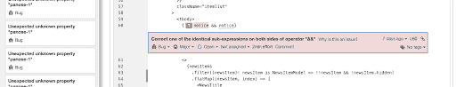
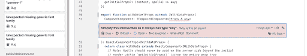
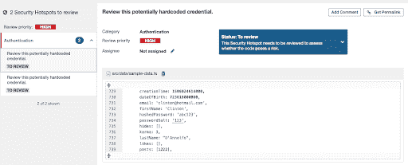
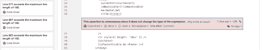
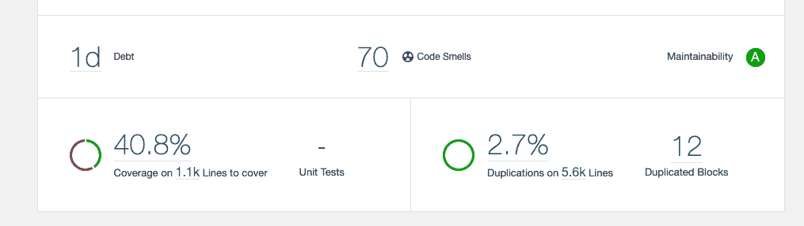

# 如何利用静态代码分析写出高质量的 JavaScript/TypeScript-log rocket 博客

> 原文：<https://blog.logrocket.com/how-to-use-static-code-analysis-to-write-quality-javascript-typescript/>

静态代码分析是一个检查源代码的过程，目的是在不实际运行它的情况下获得一些见解。这就是为什么我们称这个过程为静态的。静态分析输出的范围包括指标、漏洞报告、潜在错误警报、代码风格提示等。您可以在开发过程中使用它，或者将其作为代码审查自动化的一部分。

在这篇博文的第一部分，我将展示如何利用静态代码分析来发现代码中的问题并重构它。问题是，如果我们只是不断地重构，我们并不总是提供商业价值(稍后会有更多)。

无论好坏，我都不会谈论 ESLint。ESLint 是一个优秀且广受欢迎的工具，但是我想重点介绍几个补充工具，它们在 JavaScript 社区中并不是主流。在这篇博文的第二部分，我想更多地强调度量标准。

对于这篇博文，我需要一个示例项目。理想情况下，在 TypeScript 和 React 中，开源的，不仅仅是几个 GitHub 启动的东西。我已经选定了[克林顿·吴](https://github.com/clintonwoo/hackernews-react-graphql)/[hackernews-react-graph QL](https://github.com/clintonwoo/hackernews-react-graphql)，写作时有 3.8k+颗星。我想要一个受欢迎的项目，因为如果我们发现一个问题，这将是一个使用静态代码分析的更好的例子。我认为阅读代码的人越多，就越有可能有人会发布带有补丁的公关。我克隆了它，并创建了这个[示例回购](https://github.com/MichalZalecki/static-code-analysis-example)。

## 从属巡洋舰

随着项目的不断增长，您必须跟踪复杂性。依赖 cruiser 将让你深入了解代码库中模块之间的依赖关系。我说的依赖关系不是指 node_modules 中有什么，而是指代码是如何构造的。它可以与 JavaScript、TypeScript 甚至 CoffeeScript 一起工作。让我们来看一下设置:

1.  `npm install -D dependency-cruiser`
2.  使用 npx depcruise–init 设置 dep cruise 并选择自包含配置

现在，您可以在新创建的中探索这些规则。dependency-cruiser.js 配置文件。我还修改了我的示例 repo，添加了一个循环依赖，以展示依赖 cruiser 检测它的能力。ESLint 也可以通过它的 [import/no-cycle](https://github.com/benmosher/eslint-plugin-import/blob/master/docs/rules/no-cycle.md) 规则来识别循环依赖，所以没什么了不起的。无论如何，您的项目中很有可能已经有了它！

dependency-cruiser 的亮点是帮助您删除代码。当我重构或开发新功能时，我特别乐意删除旧代码。它的维护更少，包的大小更小，而且您不必担心被删除代码中的潜在 bug。当我删除一个模块时，我可能会忘记删除一些其他模块不使用的导入。Dependency cruiser 有一个检测孤立模块的标准规则。最重要的是，让我们添加一个自定义规则来识别从我们的应用程序的根不可到达的模块。无法访问，或者说，导入链中没有一个起点文件正在使用这些模块:

```
{
  "name": "no-unreachable-from-root",
  "severity": "error",
  "comment":
    "This dependency is unreachable from the root of your project. You might want to remove it",
  "from": {
    "path": "^(pages/[a-z]+\\.tsx|server/server.ts)"
  },
  "to": {
    "path": "src",
    "pathNot": "node_modules|\\.(spec)\\.(js|jsx|ts|tsx)",
    "reachable": false
  }
}
```

我们的黑客新闻克隆是一个 Next.js 项目，所以我们想检查我们是否可以从任何页面或我们的应用服务器访问每个模块。通常，您可以从索引文件中选择一个路径。我们不会考虑测试或 node_modules。设置严重性，我们确定该规则应该报告为错误。

在我们运行 dependency cruiser 之前，让我们模拟一下`header.tsx.`的变化，假设我们不再需要`header-nav.tsx`，并删除这个组件和 import 语句的用法。尝试运行依赖巡洋舰:

```
npx depcruise --validate .dependency-cruiser.js src pages server
```

输出如下。除了我的改动，看起来黑客新闻克隆根本不需要`global.ts`。

```
info no-orphans: src/@types/global.ts
  warn no-circular: src/data/validation/user.ts →
      src/data/validation/isValidUser.ts →
      src/data/validation/user.ts
  warn no-circular: src/data/validation/isValidUser.ts →
      src/data/validation/user.ts →
      src/data/validation/isValidUser.ts
  error no-unreachable-from-root: src/components/header-nav.tsx
  error no-unreachable-from-root: src/@types/global.ts

✖ 5 dependency violations (2 errors, 2 warnings). 161 modules, 482 dependencies cruised.
```

我发现验证规则对我的工作特别有帮助，但是 dependency cruiser 也可以生成依赖关系图。我不认为它在大型代码库中有用，为了可视化整个项目，生成的图像将会非常大和复杂，你将很难试图理解它。微服务和独立模块的图表可以成为新人入职的绝佳资源。您可以使用以下命令跳过所有规范文件，从 src、server 和 pages 目录中的模块生成图形。

```
npx depcruise --include-only "^(src|server|pages)" -x "\\.spec\\." --output-type dot . | dot -T svg > dependencygraph.svg
```

要生成一个图形，你还需要一个点，一个 [Graphviz](https://www.graphviz.org/download/) 命令行程序。

## ts-未使用-出口

dependency cruiser 的缺点是它处理整个模块。在更改或重构之后，您可能会发现自己有未使用的导出，因为来自同一个模块的其他导出正在使用中，所以 dependency cruiser 不会抱怨。这就是为什么用一个可以检测未使用的导出的工具来补充静态代码分析工具箱是有好处的。对于我们的 TypeScript 项目，我使用 [ts-unused-exports](https://www.npmjs.com/package/ts-unused-exports) ，但是对于普通 JavaScript，您可以使用类似的 [no-unused-export](https://www.npmjs.com/package/no-unused-export) 包。安装并运行`ts-unused-exports`:

```
npm install -D ts-unused-exports
npx ts-unused-exports tsconfig.json pages/*.tsx src/**/*.ts server/**/*.ts --showLineNumber --excludePathsFromReport=/pages/
```

我们必须告诉`ts-unused-exports`到`tscondig.json`文件的路径，并再次指定我们想要分析的所有文件模式。在 Next.js 中，页面的默认导出是由 Next.js 路由器使用的页面组件。我们不在代码中显式导入页面，我们希望从报告中排除“未使用的”页面。在示例存储库上运行`ts-unused-exports`，会得到以下结果:

```
4 modules with unused exports
/src/config.ts[2,0]: IS_SERVER
/src/config.ts[6,0]: graphiQLPath
/src/config.ts[9,0]: appPath
/src/config.ts[15,0]: HOST_NAME
/src/config.ts[17,0]: HOST
/src/config.ts[21,0]: GRAPHIQL_URL
/src/data/mutations/hide-news-item-mutation.ts[3,0]: HIDE_NEWS_ITEM_MUTATION
/src/data/mutations/submit-news-item-mutation.ts[5,0]: ISubmitNewsItemGraphQL
/src/data/mutations/upvote-news-item-mutation.ts[3,0]: UPVOTE_NEWS_ITEM_MUTATION
```

如您所见，我们在整个项目中发现了相当多未使用的导出。要彻底清理代码库，需要几个重构周期并重新运行，寻找剩余的未使用的模块和导出。在删除了一批未使用的导出/模块之后，您可能会得到更多未使用的依赖项，这些依赖项只被现在已被删除的代码所消耗。

## sonar cube(bug、安全性、代码气味)

SonarQube 是一个更加强大的工具集。SonarQube 支持多种编程语言，包括 JavaScript/TypeScript。很有可能你的整个团队都可以在你的[技术栈](https://www.sonarqube.org/features/multi-languages/)中使用它。SonarQube 专注于代码质量和安全性，可以随时跟踪不同的代码指标，并增强代码审查过程。通常，您将 SonarQube 部署为一个独立的自托管 web 服务，并带有一个数据库连接。然后将它与您的 CI/CD 和源代码管理(例如 GitHub)集成在一起。出于评估目的，我们将使用免费的社区版，并使用 Docker 容器在本地运行它。

使用端口 9000 上运行的 SonarQube 实例启动容器。

```
docker run -it --rm --name sonarqube -p 9000:9000 sonarqube:8.3-community
```

前往 [localhost:9000](http://localhost:9000/) 上的仪表板，使用 admin/admin 登录。点击“创建新项目”，然后在项目键和显示名称中键入一些内容(名称并不太重要)。给你的令牌取一个名字(也不太重要)。你不需要复制令牌。只需点击“继续”，选择语言和运行的系统。你需要`sonar-scanner`在你的道路上。你可以从[这里](https://docs.sonarqube.org/latest/analysis/scan/sonarscanner/)下载。接下来，复制 sonar-scanner 命令，如下所示:

```
sonar-scanner \
  -Dsonar.projectKey=test \
  -Dsonar.sources=. \
  -Dsonar.host.url=http://localhost:9000 \
  -Dsonar.login=3f8f0f47acbe3a3676178fb41902744bfa2248f3
```

在项目的根目录下运行它。它很聪明，能想出其他的办法。大约 30 秒后，您可以在仪表板上找到一份新报告。就这么简单。在我们深入研究之前，请转到项目设置->质量概要->将 JavaScript/TypeScript 更改为“Sonar way recommended”这将让我们更加仔细地审视这个项目。使用与本段上面所示相同的命令重新运行扫描仪。

生成的报告包含潜在的 11 个错误。让我们过一遍。它在 CSS 文件中发现了 9 个问题。大部分是未知属性和缺少通用字体。

在第 60 行的`new-feed.tsx`中，它在& &运算符的两边发现了相同的表达式。接得好。


Another is a TypeScript-specific problem, over permissive intersection type combines with any in `with-data.tsx` on line 51.



Those last 2 bugs are what I would imagine can be caught by a careful engineer during the code review. The difference is instead of wasting time on being a hero linter/types-man, you can focus on reviewing business logic instead.

报告的另一部分是安全热点。这些通常是看起来像硬编码的密码和令牌的字符串，看起来像你正在推出你的加密技术而不是使用经过良好测试的加密库的代码部分。在我们的示例存储库中，我们有两个误报。我们在`sample-data.ts`中有硬编码的密码 salt。您可以在*安全热点*标签中将它们标记为“安全”。它表明，有时用交互式图形环境代替命令行工具是很好的。



接下来是[码闻](https://martinfowler.com/bliki/CodeSmell.html)。这里有几个问题。在我们的示例存储库中，大多数都被分配了未使用的变量和重复的 CSS 选择器。最后一个是另一个不错的选择。在第 56 行的`main-layout.tsx`中，有一个不必要的非空断言。



如果你启用了“声纳方式推荐”质量配置文件，你会看到更多的报告代码气味。我鼓励你自己去探索它们。在下一部分中，我将更多地关注度量。

## SonarQube(技术债务、覆盖范围、重复)

当涉及到代码质量时，你可能想要依靠你的直觉，但是这对于更大的团队来说是不可持续的。不同背景的工程师(例如，OOP vs. FP)对质量意味着什么、复杂性在哪里以及对于给定的问题什么是更好的设计模式有不同的理解。这都是正常的，通常是有意义的软件设计讨论的基础，但是它不能很好地传达给业务人员。

业务需求迫使开发团队发布特性，而不是从用户的角度重复已经在工作的东西，这种情况并不少见。对于维护一个健康的代码库来说，这不是一个很好的策略。在你这边有度量标准来赢得维护和重构所需要的时间是很好的。关键是，企业理解指标，而不是为什么“我们需要重写这个”mambo jambo。

虽然不是很精确，但一个很好的度量是技术债务。您可以打开一个 SonarQube 报告，查看以重构代码到无债务点所需时间的形式表示的技术债务。我们的示例存储库有 1 天的低技术债务，但是一个实质性的项目将有更高的价值。您还需要保持一种健康的观点，即技术债务并不都是邪恶的。像任何部门一样，这是你可以利用的东西。你增加它是为了快速发布一个特性，以后再慢慢付清。问题是，为什么要还清技术债，合适的额度是多少？

如果你的核心服务或关键功能有 7 天的技术债务，那么就有可能这是修复一个 bug 所需要的时间。你的企业愿意为一个给定的特性冒一周用户体验下降的风险吗？如果是，你继续前进，如果不是，你只是为你的团队赢得了重构的时间。

另一个度量是代码覆盖率。首先，你必须指示 SonarQube 去哪里找 LCOV 的档案。使用以下内容创建 sonar-project.properties 文件:

```
// sonar-project.properties
sonar.javascript.lcov.reportPaths=coverage/lcov.info
```

运行您的测试:

```
npm run test -- --coverage
```

下一个 SonarQube 报告现在应该显示大约 40%的测试覆盖率。然后，您可以探索每个文件的覆盖率，并查看您可能需要加倍努力以确保代码按预期工作。要么通过手工测试，要么仅仅提高覆盖率。



SonarQube 报告的另一个组成部分是代码复制。用它来寻找一段潜在的代码，你可以把它变成一个可重用的组件或函数。类似于代码覆盖率，为了改进统计，我不会在这里追逐数字。实事求是地对待它，记住复制比错误的抽象要便宜得多。

另一个可以帮助你提高代码简单性(和质量)的指标是圈复杂度和认知复杂度。第一个度量代码执行流中可能路径的数量。认知复杂性随着线性代码执行和嵌套结构的中断而增加。switch 语句很容易理解(认知复杂度低)，但是事例越多，圈复杂度越高。

另一方面，循环具有较低的圈复杂度。从“认知”上来说，理解循环比理解一组接一组的指令更难。这两者之间的区别并不重要，只需要知道很难对具有高圈复杂度和认知复杂度的代码进行推理。在 SonarQube 中，您可以在 measures 选项卡中探索每个文件的复杂性。

## 摘要

在日趋成熟的 JavaScript/TypeScript 社区中，我们可以享受越来越多的工具来帮助我们开发更好的软件。我认为不利用静态代码分析工具是一种耻辱。它们还不完美，有时我们不得不跳过比我们希望的更多的关卡，但在我看来，自动化工作流的力量是值得的。

我希望这篇博文对您有所帮助，并且您将尝试一些新工具。你使用静态代码分析的经验是什么？你对什么工具特别满意吗？欢迎在评论中分享！

## [LogRocket](https://lp.logrocket.com/blg/typescript-signup) :全面了解您的网络和移动应用

[](https://lp.logrocket.com/blg/typescript-signup)

LogRocket 是一个前端应用程序监控解决方案，可以让您回放问题，就像问题发生在您自己的浏览器中一样。LogRocket 不需要猜测错误发生的原因，也不需要向用户询问截图和日志转储，而是让您重放会话以快速了解哪里出错了。它可以与任何应用程序完美配合，不管是什么框架，并且有插件可以记录来自 Redux、Vuex 和@ngrx/store 的额外上下文。

除了记录 Redux 操作和状态，LogRocket 还记录控制台日志、JavaScript 错误、堆栈跟踪、带有头+正文的网络请求/响应、浏览器元数据和自定义日志。它还使用 DOM 来记录页面上的 HTML 和 CSS，甚至为最复杂的单页面和移动应用程序重新创建像素级完美视频。

[Try it for free](https://lp.logrocket.com/blg/typescript-signup)

.