# 如何在 Unity 中使用流资产

> 原文：<https://blog.logrocket.com/how-to-use-streaming-assets-unity/>

资产可以是 Unity 中的任何资源；这些资源可以是图像、音频、视频、脚本、文本等。

在任何平台上构建 Unity 项目时，游戏中的所有资源都将被“打包”到一个文件中(或者更多，这取决于您的平台)，构建的最终大小将取决于您决定在游戏中打包的资源的大小。

创建一个有多个高清纹理的游戏而不是使用地图图册，或者使用 240p 的视频而不是使用 1080p，这是不一样的。预计您的资产规模越大，您的最终构建规模就越大。

一般来说，让你的构建尽可能的轻量级是一个很好的实践，这样玩家就不会因为游戏的大小而不愿意下载你的游戏，你的场景也会运行得更快。

有多种技巧和窍门可以实现这一点，在本文中，我们将讨论其中的一些，从流式资产开始。

## 什么是流资产？

假设你在游戏中有一个很好的场景，所有的动作都发生在那里。玩家是敌人的基地，在一个特定的房间里，你决定把一个在电脑上播放的视频作为复活节彩蛋。

视频非常大，超过 300MB，玩家可能会也可能不会进入特定的房间实际观看。在你的场景中默认加载它可以吗？这可能会导致你的伟大场景不必要的缓慢。所以在我们真正需要的时候加载它会很棒。

一个流资产就是:一个放置在特定文件夹中的资产，当需要的时候 Unity 播放器会加载它。该资产将被放置在目标平台中一个容易找到的地址。

请注意，任何放置在流资产文件夹(Unity 中的 StreamingAssets)中的资产都将被复制到目标平台，如果用户在项目文件夹中搜索，将能够看到它们。

一些游戏的一些 mod 就是这么做的。

改变角色的质感？进入数据文件夹，找到使用的纹理，然后修改它。改变强硬老板的声线？只需转到数据文件夹，找到音轨，并用另一个同名的音轨替换它。

流式资产让游戏运行流畅，无需从内存中加载所有资产，并以易于访问的方式为较大的资产提供服务。

## 让我们构建一个简单的流式资产示例

我们将通过一个简单的例子展示流式资产是如何工作的，方法是在你的游戏中播放一个视频。

对于这个例子，我从 iStockPhoto 下载了一个视频的[预览。](https://www.istockphoto.com/se/video/stream-in-spring-forest-dolly-shot-gm173348974-20348476)

请确保您要使用的视频具有以下扩展名之一:。mov，。mpeg，. mp4，.avi，. asf。

对于我们的初始示例，我们将创建一个名为 **Video** 的新文件夹，并将我们的视频放在该文件夹中:

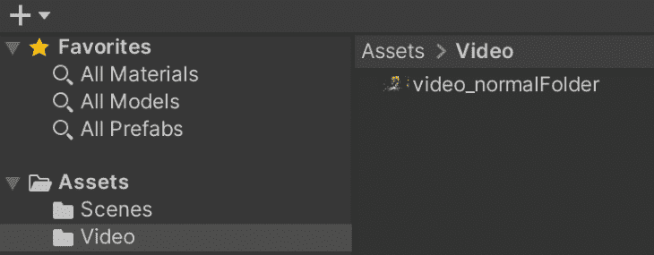

然后，在我们的**层级**面板上，我们将设置我们的视频播放器。

右键点击你的层级，添加一个**空游戏对象**。我把我的视频对象叫做**。**

 **在里面，我创建了一个立方体，我们将在那里播放视频；它可以是你想要的任何形状，但为了方便起见，我选择了立方体。我称之为 **Video_Canvas** 。

并且在 **Video_Canvas** 的同一层级，在 **VideoObject** 内部，我通过右击 **VideoObject** 并选择 **Video** ，然后选择 **Video Player** ，添加了一个新的 **Video Player** 对象。

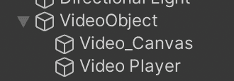

下面是我如何设置我们的**视频播放器**对象:

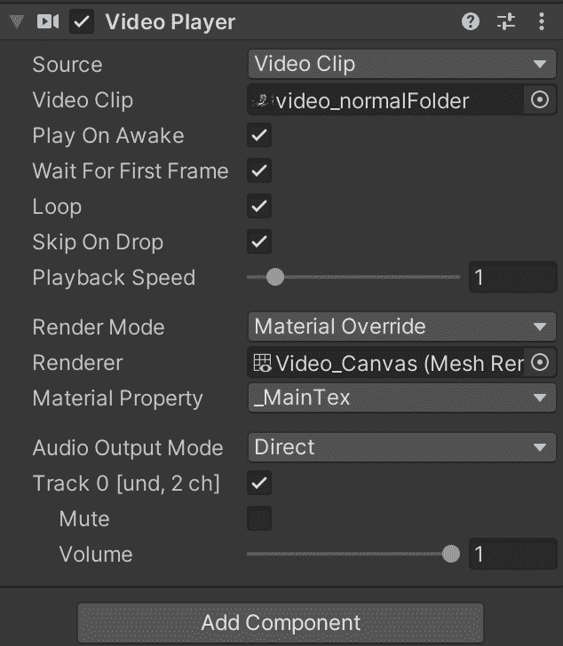

我们将**源**设置为**视频剪辑**，然后我们从我们创建的**视频**文件夹中选择该视频剪辑，然后我们选择**循环**，这样视频将无限播放。

然后，选择**渲染模式**作为**材质覆盖**，拖放你想要播放视频的对象——在我们的例子中，是 **Video_Canvas** 立方体。设**材质属性**为 **_MainTex** 。

如果你在 Unity 编辑器中点击 **Play** ，你会看到这样的东西:一个视频正在立方体的每一边播放。

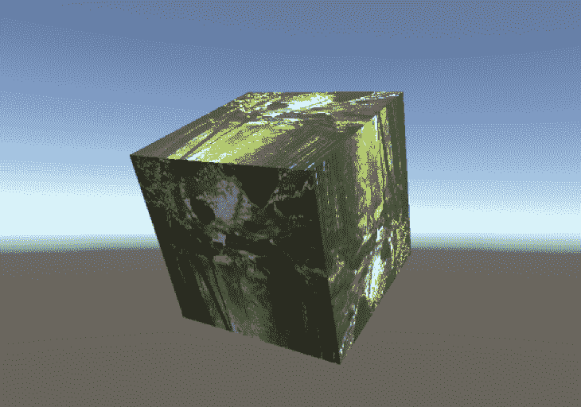

如果你想要一个更平的表面，比如屏幕，你也可以创建一个平面或者将立方体的比例缩小到你想要的形状。

这个演示视频有 3.5MB。

如果我们为一个独立的平台(Windows、Linux、MacOs)构建这个项目，我们将会看到一个包含 87.6MB 视频的空白项目

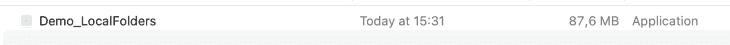

现在，让我们看看使用相同的视频作为流媒体资源会是什么样子。

为此，我们将在**资产**文件夹中创建一个名为 **StreamingAssets** 的新文件夹；这是一个特殊命名的文件夹，它将我们的视频文件 **video_streamingAssets** 视为一个常规文件，在编辑器的属性窗口中没有选项。

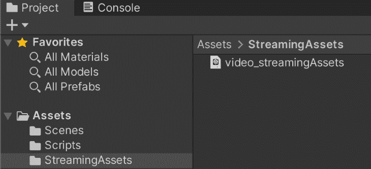

然后在我们的**视频播放器**对象中，我们可以将**视频播放器游戏组件**的**源**更改为 **URL** ，并保留实际的 URL。我们将创建一个名为 **LoadVideo** 的新脚本，并将其附加到我们的**视频播放器游戏对象**上，如图所示。

这个脚本将一个**视频播放器**作为参数，所以我们将拖放这个脚本所连接的同一个**视频播放器**。

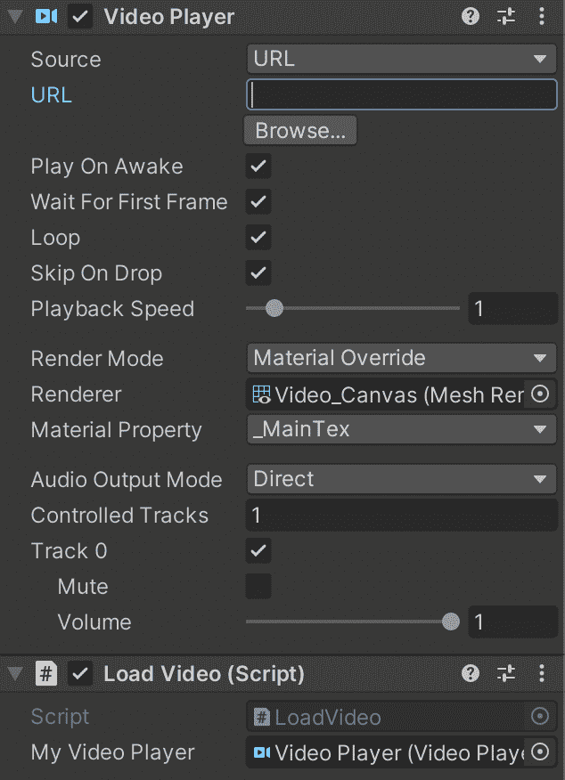

下面是 **LoadVideo 的脚本:**

```
using UnityEngine;
using UnityEngine.Video;

public class LoadVideo : MonoBehaviour
{
   public VideoPlayer myVideoPlayer;
   void Start()
   {
       string videoUrl= Application.streamingAssetsPath +"/"+ "video_streamingAssets" + ".mp4";
       myVideoPlayer.url = videoUrl;
   }
}

```

基本上，在应用程序开始时，它将使用**application . streaming assets path**来获取任何已构建到的目标平台中的 **StreamingAssets** 文件夹的路径。然后，它将引用该文件夹中我们的视频的名称及其扩展名。

然后，它将使用 **myVideoPlayer** (它已经有了我们的场景视频播放器的引用),并用我们视频的路径写入它的 **url** 属性。

这将导致与播放视频相同的立方体。


现在，如果我们构建这个项目，我们将会看到它与我们之前的示例具有相同的大小，但是有一个主要的区别。

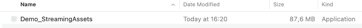

如果我们看到这个构建的**包内容，**我们可以看到在**内容/资源/数据**上有我们的**流资产**文件夹和我们的视频。

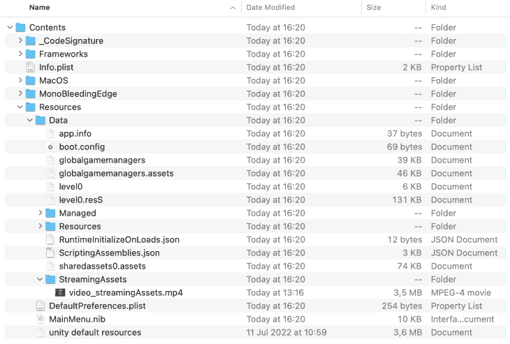

如果我们用另一个同名的替换**流资产**文件夹中的视频，我们就不需要重新构建我们的项目来查看游戏中的变化。

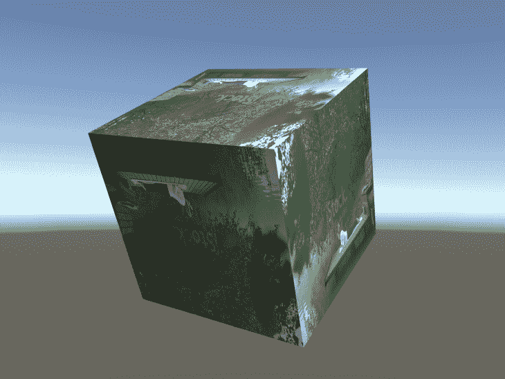

既然我们知道了如何将资产/内容从构建中分离出来。我们也可以从视频播放器上的 URL 调用远程文件。为此，我们将使用[这段视频作为示例](https://commondatastorage.googleapis.com/gtv-videos-bucket/sample/BigBuckBunny.mp4)。差不多 10 分钟长，151MB 左右。

如果我们将代码改为:

```
using UnityEngine;
using UnityEngine.Video;

public class LoadVideo : MonoBehaviour
{
   public VideoPlayer myVideoPlayer;
   void Start()
   {
       string videoUrl= "http://commondatastorage.googleapis.com/gtv-videos-bucket/sample/BigBuckBunny.mp4";
       myVideoPlayer.url = videoUrl;
   }
}

```

…并删除我们在 **StreamingAssets** 文件夹中的原始视频，我们最终会得到这样的结果:

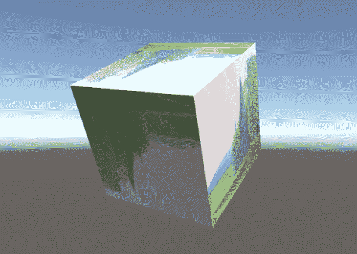

相同的功能，但是现在视频资产来自外部来源。

现在，如果我们在 **StreamingAssets** 文件夹中构建没有本地视频的项目，我们会看到构建的规模减小了。

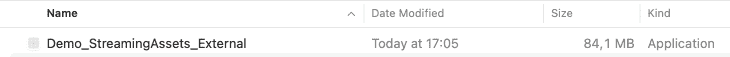

请记住，这也可以通过异步调用或`UnityWebRequest`调用和协程来完成，但为了简单起见，我们只是添加了视频的确切 URL 来演示流媒体的强大功能。

### 使用协程从外部来源获取视频

我们可以像这样修改我们的`LoadingScript`,以便使用协程，而不是将直接链接传递给我们的视频播放器:

```
using UnityEngine;
using UnityEngine.Video;
using UnityEngine.Networking;
using System.Collections;

public class LoadVideo : MonoBehaviour
{
   public VideoPlayer myVideoPlayer;
   void Start()
   {
       StartCoroutine(LoadExternalVideo("http://commondatastorage.googleapis.com/gtv-videos-bucket/sample/ElephantsDream.mp4"));
   }

     IEnumerator LoadExternalVideo(string url){
      using (UnityWebRequest request = UnityWebRequest.Get(url))
      {
          //Fetches a page and displays the number of characters of the response.
          yield return request.SendWebRequest();
          myVideoPlayer.url = request.url;
      }
  }
}

```

在这个例子中，我们可以使用一个协程来使用一个 API 端点并检索视频的 URL，但是为了简单起见，这是一个关于如何使用外部链接来做这件事的简单例子。

结果会非常相似；我们只需要确保我们的`UnityWebRequest`结果是从消费的端点获取的，并确保在将它设置为视频播放器的 URL 属性之前，视频的 URL 是存在的。

## 最后的想法

流式资产只是 Unity 为你的游戏处理资产的不同方式之一。当你试图让你的玩家群参与进来，允许他们修改你的游戏时，或者如果你想有一个轻量级的游戏最终版本，然后在第一次启动时，在玩家注意到之前下载游戏的其余资源时，这种方法非常有用。

有很多网络游戏都是这样做的:他们的游戏很轻，你可以完成一个第一级的教程，然后你会得到一个下载其余资源的加载屏幕。

你必须记住最适合你游戏的方法。你不能把所有的资产都放在远程服务器上，因为如果玩家第一次玩你的游戏时，他们的设备没有良好的互联网连接，会发生什么？如果没有资产，你的游戏会是什么样子？

最好的方法之一是将你的资源的一个非常轻的版本作为默认(如材料、纹理、图像)作为占位符，并且当你确定你的播放器将喜欢该内容并且设备准备好下载该信息时，尽可能无缝地这样做。

希望你喜欢这篇文章，觉得有用！gamedev 快乐！

## 使用 [LogRocket](https://lp.logrocket.com/blg/signup) 消除传统错误报告的干扰

[](https://lp.logrocket.com/blg/signup)

[LogRocket](https://lp.logrocket.com/blg/signup) 是一个数字体验分析解决方案，它可以保护您免受数百个假阳性错误警报的影响，只针对几个真正重要的项目。LogRocket 会告诉您应用程序中实际影响用户的最具影响力的 bug 和 UX 问题。

然后，使用具有深层技术遥测的会话重放来确切地查看用户看到了什么以及是什么导致了问题，就像你在他们身后看一样。

LogRocket 自动聚合客户端错误、JS 异常、前端性能指标和用户交互。然后 LogRocket 使用机器学习来告诉你哪些问题正在影响大多数用户，并提供你需要修复它的上下文。

关注重要的 bug—[今天就试试 LogRocket】。](https://lp.logrocket.com/blg/signup-issue-free)**