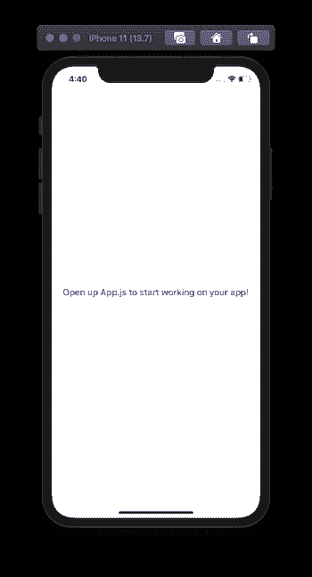
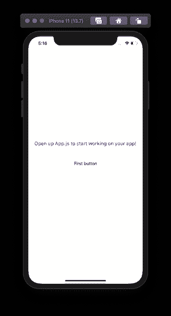
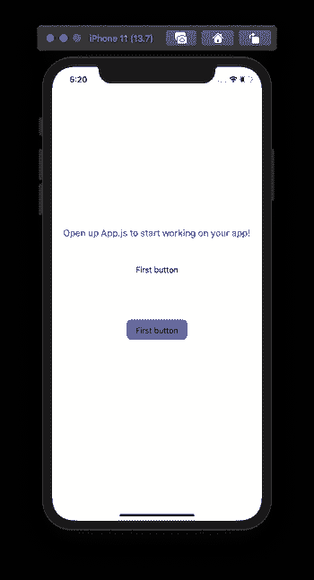
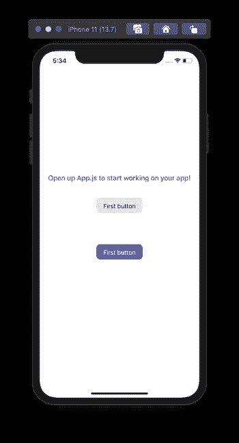
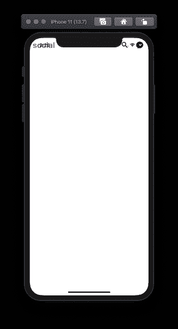
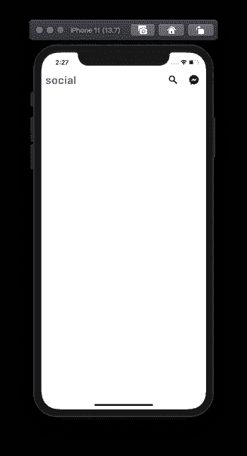
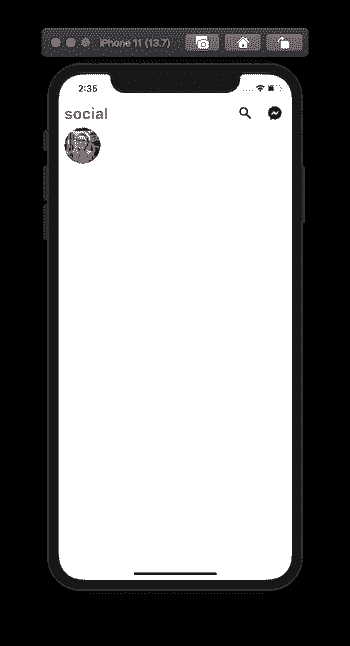
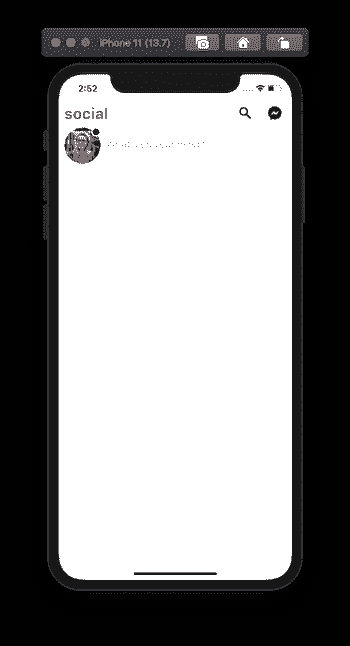
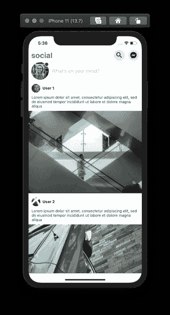

# 如何在 React Native 中使用样式化组件

> 原文：<https://blog.logrocket.com/how-to-use-styled-components-with-react-native/>

设计应用程序的样式是开发的一个重要方面。管理样式可以提高代码的可读性。在 React Native apps 中，组件的样式化是用默认的`StyleSheet` API 方法来完成的。然而，使用[样式组件](https://styled-components.com/)的 CSS-in-JS 方法是在 React 原生应用中创建和样式化 UI 组件的另一种方式。

在本教程中，让我们讨论像 styled-components 这样的库相对于 React Native 中的一般`StyleSheet`管理器有什么优势。

## `StyleSheet`和样式组件库有什么区别？

styled-components 是一个 CSS-in-JS 库，它是开源的，允许您作为 React 本地开发人员在单个文件位置定义 UI 组件和样式。将样式与其合适的组件相结合变得很容易，这可能会在处理大型应用程序时带来优化的开发人员体验。

与 React Native 定义样式的默认方式相比，它的一个优势是它允许我们使用普通的 CSS 来定义使用 JavaScript 对象定义的样式。对于有网络背景经验的开发者来说更好。

例如，React Native 在定义 CSS 属性名时遵循一种样式约定。它使用基于`camelCase`的属性名。React Native app 中使用`StyleSheet` API 的一个背景色属性写为:

```
backgroundColor: 'tomato';
```

使用样式组件库时，可以使用 CSS 命名约定。因此，`backgroundColor`被写成`background-color`，就像在普通 CSS 中一样。

React Native 允许我们定义诸如边距、填充、阴影、字体大小等属性的值，而不用像`px` ( *像素*)这样的单元。例如，使用`StyleSheet` API 时的字体大小定义为:

```
fontSize: 20;
```

由于特定屏幕的像素密度不同，这些无单位值在不同的屏幕尺寸上呈现不同的效果。然而，使用样式化组件，在定义像`font-size`这样的属性值时，必须使用后缀`px`。但这确实意味着有这个库造成的劣势。在幕后，styled-components 使用一个名为 [css-to-react-native](https://github.com/styled-components/css-to-react-native) 的包将普通 CSS 属性转换为 React Native 样式表对象。

## 安装样式组件

首先创建一个新的 React 本地项目。对于快速开发过程，我将使用 [expo-cli](https://docs.expo.io/workflow/expo-cli/) 。创建项目目录后，确保安装样式组件库。打开终端窗口并执行以下命令:

```
npx expo-cli init [Your Project Name]
# after the project is created
cd [Your Project Name]
# then install the library
yarn add [email protected]
# also install the icons library
expo install @expo/vector-icons
```

## 使用样式组件

在这一节中，让我们编写第一个样式化的组件，在`App.js`文件中显示应用程序的标题。要开始，请导入库:

```
import styled from 'styled-components/native';
```

要在 React Native 应用程序中使用`styled-components`库，您必须导入`/native`来访问原始组件，而不是直接从 React Native 导入它们。

然后，让我们替换`react-native`库中的`View`和`Text`组件。这些新组件将遵循来自`styled-components`的定制语义。

下面是一个使用样式化组件库中的`styled`对象对`View`和`Text`组件进行样式化的例子:

```
const Container = styled.View`
  flex: 1;
  background-color: white;
  align-items: center;
  justify-content: center;
`;
const Text = styled.Text`
  font-size: 18px;
  color: blue;
  font-weight: 500;
`;
```

这些自定义样式的组件使用与任何 React 本机应用程序相同的 CSS 逻辑来样式化组件。这里的区别在于，编写属性名和它们的值严格遵循普通的 CSS 约定，而不是本地反应。

修改后的`App`组件将是:

```
export default function App() {
  return (
    <Container>
      <Text>Open up App.js to start working on your app!</Text>
    </Container>
  );
}
```

现在，返回到终端窗口，并查看运行中的代码，执行命令`yarn start`。你现在可以在任何 iOS 或 Android 模拟器或装有 [Expo 客户端应用](https://expo.io/tools#client)的真实设备中查看以下结果。



## 在样式化组件中使用道具

在任何 React 或 React 原生应用中创建定制组件都需要使用 props。这样做的好处是应用程序的代码尽可能保持干燥。styled-components 库确实允许在定制组件中使用属性(当使用样式表对象时，*React Native 中没有这些属性)。*

我们举一个微不足道的例子。在`components/`目录下创建一个名为`PressableButton.js`的新组件文件。这个组件将在后面的`App`组件中使用，以显示一个定制按钮组件。

在这个文件中，让我们使用`TouchableOpacity`和`Text`创建一个定制组件。这个自定义按钮组件将有一些属性，比如自定义按钮`title`和`bgColor`，用于将按钮组件的背景颜色设置为来自父组件的任何有效值:

```
import React from 'react';
import styled from 'styled-components/native';
const ButtonContainer = styled.TouchableOpacity`
  margin-vertical: 40px;
  width: 120px;
  height: 40px;
  padding: 12px;
  border-radius: 10px;
  background-color: ${props => props.bgColor};
`;
const ButtonText = styled.Text`
  font-size: 16px;
  text-align: center;
`;
const PressableButton = ({ onPress, bgColor, title }) => (
  <ButtonContainer onPress={onPress} bgColor={bgColor}>
    <ButtonText>{title}</ButtonText>
  </ButtonContainer>
);
export default PressableButton;
```

要动态设置这个定制组件的背景颜色，可以传递一个插值函数，比如`${props => props ...}`。

这个插值函数相当于下面的代码片段:

```
background-color: ${(props) => {
  return (props.bgColor)
}}
```

为了测试这一点，转到`App.js`组件文件，在其他语句之后导入`PressableButton`组件:

```
import PressableButton from './components/PressableButton';
```

然后，修改其内容:

```
export default function App() {
  return (
    <Container>
      <Text>Open up App.js to start working on your app!</Text>
      <PressableButton
        onPress={() => true}
        title='First button'
        bgColor='papayawhip'
      />
    </Container>
  );
}
```

这是这个步骤之后你将要得到的输出:


Let’s add another button with a different background color:

```
<PressableButton onPress={() => true} title='First button' bgColor='#4267B2' />
```

显示在第一个按钮之后:


样式组件库中的插值函数也可用于扩展特定属性的样式。比如第二个按钮上的文字颜色就不好看。为了改变这一点，我们希望有两个`PressableButton`组件的变体。

第一个是`primary`，文本的颜色是`white`。第二个变体将有一个文本颜色`black`，但将像默认的变体。这意味着不必明确定义第二种变体。

通过给`ButtonText`样式的对象添加一个`color`属性来修改`PressableButton.js`文件:

```
const ButtonText = styled.Text`
  font-size: 16px;
  text-align: center;
  color: ${props => (props.primary ? 'white' : '#010101')};
`;
```

然后将道具`primary`添加到`PressableButton`组件中:

```
const PressableButton = ({ onPress, primary, bgColor, title }) => (
  <ButtonContainer onPress={onPress} bgColor={bgColor}>
    <ButtonText primary={primary}>{title}</ButtonText>
  </ButtonContainer>
);
```

现在，回到`App.js`文件，将道具变量`primary`添加到第二个按钮:

```
<PressableButton
  onPress={() => true}
  title='First button'
  bgColor='#4267B2'
  primary
/>
```

这些变化在世博客户端 app 上即时体现:


## 从头开始构建应用程序屏幕

让我们构建一个应用程序屏幕，看看如何使用样式组件库中的`styled`对象定义不同的原始 React 本地组件。

为了让您大致了解我们将要构建的内容，下面是最终结果:


如果您想跟进，请从[这里](https://github.com/amandeepmittal/react-native-examples/tree/master/rnStyledComponents/assets/images)下载以下资产。

## 添加一个`SafeAreaView`组件

让我们从构建应用程序的标题部分开始。创建一个名为`components/Header.js`的新组件文件。该组件将显示应用程序`Title`以及一排两个图标。这两个图标可用于创建进一步的操作。为了显示图标，让我们使用`@expo/vector-icons`中的`MaterialCommunityIcons`。

这个`Header`组件将从父组件`App`接收道具`headerTitle`。`Title`是由`Text`定义的，每个图标都被一个叫做`IconButton`的`TouchableOpacity`按钮包裹着。

添加以下代码片段:

```
import React from 'react';
import styled from 'styled-components/native';
import { MaterialCommunityIcons } from '@expo/vector-icons';
const Container = styled.View`
  width: 100%;
  height: 50px;
  padding-horizontal: 10px;
  flex-direction: row;
  align-items: center;
  justify-content: space-between;
`;
const Title = styled.Text`
  font-size: 28px;
  font-weight: 700;
  letter-spacing: 0.25px;
  color: #4267b2;
`;
const IconButtonsRow = styled.View`
  flex-direction: row;
`;
const IconButton = styled.TouchableOpacity`
  width: 40px;
  height: 40px;
  border-radius: 20px;
  background: #e6e6e6;
  align-items: center;
  justify-content: center;
  margin-left: 12px;
`;
const Header = ({ headerTitle }) => {
  return (
    <Container>
      <Title>{headerTitle}</Title>
      <IconButtonsRow>
        <IconButton activeOpacity={0.7} onPress={() => true}>
          <MaterialCommunityIcons name='magnify' size={28} color='#010101' />
        </IconButton>
        <IconButton activeOpacity={0.7} onPress={() => true}>
          <MaterialCommunityIcons
            name='facebook-messenger'
            size={28}
            color='#010101'
          />
        </IconButton>
      </IconButtonsRow>
    </Container>
  );
};
export default Header;
```

注意，在上面的代码片段中，你可以像在一个`TouchableOpacity`组件上一样使用可用的道具，比如`activeOpacity`。styled-components 仍然使用 React 本地组件上可用的属性。

接下来，将该组件导入到`App.js`文件中，并对其进行修改:

```
import React from 'react';
import styled from 'styled-components/native';
import Header from './components/Header';
const Container = styled.View`
  flex: 1;
  background-color: white;
`;
export default function App() {
  return (
    <Container>
      <Header headerTitle='social' />
    </Container>
  );
}
```

下面是您将在 iOS 模拟器上得到的输出:


`Header`组件占用了 iOS 设备安全区域边界后面的空间。幸运的是，为了解决这个问题，styled-components 库提供了一个名为`SafeAreaView`的组件，它的工作方式与 React Native 的[safea review 相同。](https://reactnative.dev/docs/safeareaview)

修改以下代码片段:

```
const Container = styled.SafeAreaView;
```

现在输出的是期望的结果:


## 使用`Image`组件显示头像

要显示头像图像，可以使用`Image`组件。创建一个名为`components/Avatar.js`的新组件文件。它将接收一个 prop，这是要显示的图像的源。你可以使用`source`道具来参考图片。

`Avatar`图像的样式从一个`width`和一个`64`像素的`height`开始。拥有一个恰好等于宽度和高度的一半的`border-radius`属性，使得图像是一个圆。`border-radius`属性用于创建圆角。

添加以下代码片段:

```
import React from 'react';
import styled from 'styled-components/native';
const Container = styled.View`
  width: 64px;
  height: 64px;
`;
const Image = styled.Image`
  width: 64px;
  height: 64px;
  border-radius: 32px;
`;
const Avatar = ({ imageSource }) => {
  return (
    <Container>
      <Image source={imageSource} />
    </Container>
  );
};
export default Avatar;
```

现在，打开`App.js`文件并导入`Avatar`组件。用另一个名为`RowContainer`的组件包装它，该组件具有以下样式:

```
// after other import statements
import Avatar from './components/Avatar';
const RowContainer = styled.View`
  width: 100%;
  padding-horizontal: 10px;
  flex-direction: row;
`;
```

修改由`App`组件渲染的 JSX:

```
<Container>
  <Header headerTitle='social' />
  <RowContainer>
    <Avatar imageSource={require('./assets/images/avatar1.png')} />
  </RowContainer>
</Container>
```

头像形象长这样:


## 使用`position: absolute`属性创建一个在线指示器

CSS 属性如`margin`和`padding`可以用来增加不同 UI 元素之间的间距。间距是相互关联的。有些情况下，这种关系与应用程序状态的设计并不完全一致。对于这些场景，我们经常使用`position: absolute`属性。

默认情况下，React Native 依赖于`position: relative`属性。这就是为什么我们不必在每次设计 UI 组件时都明确定义它。`absolute`值仅用于适合精确设计模式的场景。它具有下列经常组合使用的属性:

让我们通过在头像图像的右上角显示一个在线状态指示器来增强`Avatar`组件。

定义一个名为`OnlineIndicator`的新定制组件。它将有一个固定的宽度和高度值以及一个`border`。使用样式化组件的好处是，你可以像在普通 CSS 中一样定义`border`属性的值。

`position`被设置为`absolute`，这意味着`OnlineIndicator`组件将与其父组件相关。因为它必须显示在右上角，所以我们将这两个属性的值设置为`0`。

您可以通过增加或减少每个像素值来修改这些值，以满足您所遵循的设计模式:

```
const OnlineIndicator = styled.View`
  background-color: green;
  position: absolute;
  width: 16px;
  height: 16px;
  border-radius: 8px;
  top: 0;
  right: 0;
  border: 2px solid white;
`;
const Avatar = ({ imageSource }) => {
  return (
    <Container>
      <Image source={imageSource} />
      <OnlineIndicator />
    </Container>
  );
};
```

下面是这个步骤之后的输出:


## 添加一个`TextInput`

为了添加文本输入组件，`styled`对象使用了`TextInput`。创建一个名为`components/InputContainer.js`的新文件，并添加以下代码片段:

```
import React from 'react';
import styled from 'styled-components/native';
const Container = styled.View`
  width: 100%;
`;
const TextInput = styled.TextInput`
  width: 100%;
  height: 60px;
  font-size: 18px;
  flex: 1;
  color: #010101;
  margin-left: 10px;
`;
const InputContainer = () => {
  return (
    <Container>
      <TextInput placeholder="What's on your mind?" />
    </Container>
  );
};
export default InputContainer;
```

因为我们想在头像旁边显示这个组件，所以让我们将它导入到`App.js`文件中:

```
<RowContainer>
  <Avatar imageSource={require('./assets/images/avatar1.png')} />
  <InputContainer />
</RowContainer>
```

下面是输出:


## 使用`ScrollView`映射菜单项列表

使用一个`ScrollView`组件，让我们显示一个帖子列表。每个帖子都将有一个用户的头像图像，用户名，帖子描述和帖子图像。为了显示数据，我将使用一个包含四个不同对象的模拟数组。将该数组添加到`App.js`文件中:

```
const DATA = [
  {
    id: '1',
    userAvatar: require('./assets/images/avatar2.png'),
    userName: 'User 1',
    postText:
      'Lorem ipsum dolor sit amet, consectetur adipiscing elit, sed do eiusmod tempor incididunt ut labore et dolore magna aliqua',
    postImage: require('./assets/images/post1.png')
  },
  {
    id: '2',
    userAvatar: require('./assets/images/avatar4.png'),
    userName: 'User 2',
    postText:
      'Lorem ipsum dolor sit amet, consectetur adipiscing elit, sed do eiusmod tempor incididunt ut labore et dolore magna aliqua',
    postImage: require('./assets/images/post2.png')
  },
  {
    id: '3',
    userAvatar: require('./assets/images/avatar3.png'),
    userName: 'User 3',
    postText:
      'Lorem ipsum dolor sit amet, consectetur adipiscing elit, sed do eiusmod tempor incididunt ut labore et dolore magna aliqua',
    postImage: require('./assets/images/post3.png')
  },
  {
    id: '4',
    userAvatar: require('./assets/images/avatar4.png'),
    userName: 'User 4',
    postText:
      'Lorem ipsum dolor sit amet, consectetur adipiscing elit, sed do eiusmod tempor incididunt ut labore et dolore magna aliqua',
    postImage: require('./assets/images/post4.png')
  }
];
```

接下来，创建一个名为`components/Card.js`的新组件文件。它将接受数组`data`作为唯一的道具。为了遍历`data`数组，使用了 JavaScript 的`map`函数。我们已经知道所表示的数据的结构。

从创建从`ScrollView`定义的`VerticalList`开始。然后创建一个空的`ListContainer`组件，它是一个`View`组件的代表。

为了显示用户名和头像，创建一个`Row`容器组件，它的`flex-direction`属性被设置为`row`的值。`SmallAvatar`将显示用户的头像，`UserName`用于显示用户名。类似地，`PostDescription`和`PostImage`用于显示帖子的内容。

添加以下代码片段:

```
import React from 'react';
import styled from 'styled-components/native';
const VerticalList = styled.ScrollView`
  flex: 1;
`;
const ListContainer = styled.View``;
const Header = styled.View`
  height: 50px;
  flex-direction: row;
  align-items: center;
  justify-content: space-between;
  margin-top: 6px;
  padding: 0 11px;
`;
const Row = styled.View`
  align-items: center;
  flex-direction: row;
`;
const SmallAvatar = styled.Image`
  width: 32px;
  height: 32px;
  border-radius: 16px;
`;
const UserName = styled.Text`
  padding-left: 8px;
  font-size: 14px;
  font-weight: bold;
  color: #010101;
`;
const PostDescription = styled.Text`
  font-size: 14px;
  color: #222121;
  line-height: 16px;
  padding: 0 11px;
`;
const PostImage = styled.Image`
  margin-top: 9px;
  width: 100%;
  height: 300px;
`;
const Card = ({ data }) => {
  return (
    <VerticalList showsVerticalScrollIndicator={false}>
      {data.map(item => (
        <ListContainer key={item.id}>
          <Header>
            <Row>
              <SmallAvatar source={item.userAvatar} />
              <UserName>{item.userName}</UserName>
            </Row>
          </Header>
          <PostDescription>{item.postText}</PostDescription>
          <PostImage source={item.postImage} />
        </ListContainer>
      ))}
    </VerticalList>
  );
};
export default Card;
```

React 本地组件上的任何可用属性在使用`styled`对象创建的组件上都有效。例如，要隐藏垂直滚动指示器，将`showsVerticalScrollIndicator`的值设置为 false，就像上面的代码片段一样。

要查看`ScrollView`的工作情况，在`App.js`文件中添加`Card`组件，如下所示:

```
// import the Card component
import Card from './components/Card';
return (
  <Container>
    {/* rest remains same */}
    <Card data={DATA} />
  </Container>
);
```

下面是输出:


You can also extend the styled object with `ScrollView` by using a chainable method called `attrs`. It attaches the props to a styled component.

我们创建的`VerticalList`组件不需要定制道具，但是通过使用可链接的方法，它可以将`ScrollView`的`contentContainerStyle`对象的样式应用到滚动视图内容容器。让我们添加一些`20`的垂直填充和一些背景色:

```
const VerticalList = styled.ScrollView.attrs(props => ({
  contentContainerStyle: {
    backgroundColor: '#e7e7e7',
    paddingVertical: 20
  }
}))`
  flex: 1;
`;
```

## 
结论

我希望你在阅读本教程时感到愉快。正如我们在本文中所讨论的，在 React Native 中使用样式组件库确实有其优势。

你以前用过 React Native 的样式化组件吗？如果没有，你会在下一个项目中尝试吗？请在下面评论。

源代码可从本 [GitHub repo](https://github.com/amandeepmittal/react-native-examples/tree/master/rnStyledComponents) 获得。

## [LogRocket](https://lp.logrocket.com/blg/react-native-signup) :即时重现 React 原生应用中的问题。

[](https://lp.logrocket.com/blg/react-native-signup)

[LogRocket](https://lp.logrocket.com/blg/react-native-signup) 是一款 React 原生监控解决方案，可帮助您即时重现问题、确定 bug 的优先级并了解 React 原生应用的性能。

LogRocket 还可以向你展示用户是如何与你的应用程序互动的，从而帮助你提高转化率和产品使用率。LogRocket 的产品分析功能揭示了用户不完成特定流程或不采用新功能的原因。

开始主动监控您的 React 原生应用— [免费试用 LogRocket】。](https://lp.logrocket.com/blg/react-native-signup)