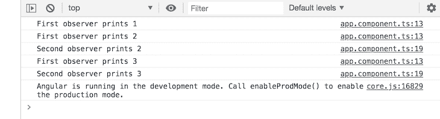
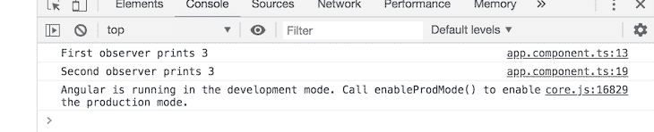

# 如何在 RxJS - LogRocket 博客中使用主题多播观察者

> 原文：<https://blog.logrocket.com/how-to-use-subjects-to-multicast-observers-in-rxjs/>

RxJS 是一个反应式编程的框架，它利用了 observables，这使得编写异步代码变得非常容易。

[根据官方文档](https://rxjs-dev.firebaseapp.com/)，该项目是 JavaScript 的一种反应式扩展，具有“更好的性能、更好的模块化、更好的可调试调用堆栈，同时保持大部分向后兼容，并有一些减少 API 面的突破性变化。”

这是官方库，由 [Angular](https://blog.logrocket.com/how-to-make-your-angular-8-forms-reactive/) 用来处理反应，将回调的拉操作转换成可观察的。

## 先决条件

为了能够理解本文的演示，您应该具备:

*   计算机上安装的节点版本 11.0
*   节点程序包管理器版本 6.7(通常随节点安装一起提供)
*   角度控制器版本 7.0
*   Angular 的最新版本(版本 7)

使用下面的命令确认您使用的是版本 7，如果不是，请更新到 7。

```
// run the command in a terminal
ng version
```

点击这里下载本教程的起始项目[来完成演示。解压缩项目，并使用以下命令初始化终端中的](https://github.com/viclotana/ng_canvas)[节点](https://blog.logrocket.com/use-cases-for-node-workers/)模块:

```
npm install
```

## RxJS 科目是什么？

RxJS 主题是可观察对象，它也充当观察者，并为将数据值多播给多个观察者提供平台。可观察性可以简单地定义为一个函数，它随着时间的推移向一个观察者返回一系列数据值。

主体是一种高级的可观察对象，它将值返回给多个观察者，这允许它充当一种事件发射器。

## RxJS 科目为什么重要？

首先，它是一个可观察对象，所以所有可观察对象使用的方法都自动适用于对象。额外的事实是，您可以多播，这意味着可以为一个主题设置多个观察者，这真是太棒了。

可观察对象纯粹充当生产者，但主体可以既是生产者又是消费者，将可观察对象的范围从单播转移到多播。当您的订阅必须接收不同的数据值时，应该使用 Subjects 来代替 observables。对于多播，它将每个订阅与其各自的观察者相匹配。

## RxJS 主题语法

在 Angular 项目中，定义 rjs 主题的语法如下:

```
import { Subject } from "rxjs";
ngOnInit(){
const subject = new Subject();
}
```

## 演示

为了说明 RxJS 主题，让我们看几个多播的例子。如果您从一开始就阅读这篇文章，那么您将在 VS 代码应用程序中打开 starter 项目。打开您的`app.component.ts`文件，将下面的代码复制到其中:

```
import { Component, OnInit } from '@angular/core';
import { Subject } from "rxjs";
@Component({
  selector: 'app-root',
  templateUrl: './app.component.html',
  styleUrls: ['./app.component.css']
})
export class AppComponent implements OnInit{
  ngOnInit(){
   const subject = new Subject();

   subject.subscribe({
    next: (data) => console.log('First observer prints '+ data)
   });

   subject.next(1);
   subject.next(2);
   }
}
```

您将会看到，与需要传递一种助手模块来创建它的 observable 不同，subject 只需要一个新的 subject 构造，有了它，您就可以像使用任何 observable 一样使用它。如果使用 dev 命令运行开发中的应用程序:

```
ng serve
```

您将会看到，正如我们所期望的那样，它记录了数据值，模拟了一个全功能的可观察对象。这意味着误差和完整的值都可以传递给观察者。

## 与多个观察者一起工作

记住，主体的一个主要特征是他们有一个以上的观察者集合来引用它的能力。您将看到与上面相同的逻辑在起作用。将下面的代码块复制到`app.component.ts`文件中:

```
import { Component, OnInit } from '@angular/core';
import { Subject } from "rxjs";
@Component({
  selector: 'app-root',
  templateUrl: './app.component.html',
  styleUrls: ['./app.component.css']
})
export class AppComponent implements OnInit{
  ngOnInit(){
   const subject = new Subject();
   subject.subscribe({
    next: (data) => console.log('First observer prints '+ data)
   });
   subject.next(1);
   subject.subscribe({
    next: (data) => console.log('Second observer prints '+ data)
   });
   subject.next(2);
   subject.next(3);
   }
}
```

如果您保存文件并重新编译它，您会注意到尽管主题有两个观察者，但是不同的观察者仍然会像预期的那样返回数据值。

如果你注意到，第二个观察者没有收到第一个`next`值，因为主体同时持有并根据范围和定义有效地分配这些值。这就是 RxJS 中使用主语的妙处。

## 主题变体

RxJS 科目官方有三种变体。它们是:

*   行为主体
*   重播主题
*   异步主题

### 行为主体

behavior 主题是一种非常特殊的主题类型，它临时存储在它之前声明的任何观察者的当前数据值。下面是一个清晰的示例—将下面的代码复制到您的应用程序组件文件中:

```
import { Component, OnInit } from '@angular/core';
import { BehaviorSubject } from "rxjs";
@Component({
  selector: 'app-root',
  templateUrl: './app.component.html',
  styleUrls: ['./app.component.css']
})
export class AppComponent implements OnInit{
  ngOnInit(){
   const subject = new BehaviorSubject(0);
   subject.subscribe({
    next: (data) => console.log('First observer prints '+ data)
   });
   subject.next(1);
   subject.next(2);
   subject.subscribe({
    next: (data) => console.log('Second observer prints '+ data)
   });
   subject.next(3);
   }
}
```

在这里，您可以看到 behavior subject 是从 RxJS 导入的，新的构造必须接受一个初始值(在我们的例子中是零)。此外，与前面的示例不同，您会看到在调用新观察器之前的最后一个数据值(当前值`2`)被存储，然后由新观察器报告，即使它是在引用它之后定义的。


这正是行为主体所要实现的:存储当前数据值，然后将其传递给新的观察者。

### 重播主题

在查看了行为主体变体带来的可能性之后，任何好奇的人都可能会问为什么他们不能存储比当前值更多的内容。好消息是，有了重播主题，你可以。所以 replay 主体基本上是行为主体，可以选择你想从最后一个观察者发出多少值。这里有一个简单的例子:

```
import { Component, OnInit } from '@angular/core';
import { ReplaySubject } from "rxjs";
@Component({
  selector: 'app-root',
  templateUrl: './app.component.html',
  styleUrls: ['./app.component.css']
})
export class AppComponent implements OnInit{
  ngOnInit(){
   const subject = new ReplaySubject(2);
   subject.subscribe({
    next: (data) => console.log('First observer prints '+ data)
   });
subject.next(1);
   subject.next(2);
   subject.subscribe({
    next: (data) => console.log('Second observer prints '+ data)
   });
subject.next(3);
   }
}
```

这里指定了从最后一个观察器只发出最后一个值，所以浏览器控制台中的输出应该与初始日志行完全相同。



此外，这个 replay 主题可以接受一个可选的第二个参数，名为 window time，以毫秒为单位记录。它只是允许你确定返回的时间。

### 异步主题

这是最后一个变化。它的行为与行为主体完全相同，但只能在调用完整的方法后执行。记住，一个可观察对象可以调用三种方法:next、error 和 complete。所以这个特殊的变体只有在看到完整的方法调用时才会发出当前值。

```
import { Component, OnInit } from '@angular/core';
import { AsyncSubject } from "rxjs";
@Component({
  selector: 'app-root',
  templateUrl: './app.component.html',
  styleUrls: ['./app.component.css']
})
export class AppComponent implements OnInit{
  ngOnInit(){
   const subject = new AsyncSubject();
   subject.subscribe({
    next: (data) => console.log('First observer prints '+ data)
   });
subject.next(1);
   subject.next(2);
   subject.subscribe({
    next: (data) => console.log('Second observer prints '+ data)
   });
subject.next(3);
   subject.complete();
   }
}
```

如果您在开发服务器中运行此程序，您的浏览器控制台将如下所示:



## 结论

这是 RxJS 中主题的介绍性概述，以及它们在您的工作流程中的重要性。也有插图，甚至是对主题的三种变化的解释。现在你可以开始在你的 Angular 项目中使用它们了——快乐的黑客！

## 像用户一样体验 Angular 应用程序

调试 Angular 应用程序可能很困难，尤其是当用户遇到难以重现的问题时。如果您对监视和跟踪生产中所有用户的角度状态和动作感兴趣，[请尝试 LogRocket](https://www2.logrocket.com/angular-performance-monitoring) 。[](https://www2.logrocket.com/angular-performance-monitoring)[https://logrocket.com/signup/](https://www2.logrocket.com/angular-performance-monitoring)

LogRocket 就像是网络应用程序的 DVR，记录你网站上发生的一切，包括网络请求、JavaScript 错误等等。您可以汇总并报告问题发生时应用程序的状态，而不是猜测问题发生的原因。

LogRocket NgRx 插件将角度状态和动作记录到 LogRocket 控制台，为您提供导致错误的环境，以及出现问题时应用程序的状态。

现代化调试 Angular 应用的方式–[开始免费监控](https://www2.logrocket.com/angular-performance-monitoring)。