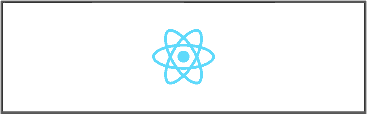

# 如何在 React - LogRocket 博客中使用 SVGs

> 原文：<https://blog.logrocket.com/how-to-use-svgs-react/>

***编者按**:这篇文章最后一次更新是在 2022 年 12 月 12 日，增加了一节关于如何使用 react-svg 组件将 svg 注入 DOM，以及确保与 react-svg 最新版本(撰写本文时为 12.1.13)兼容的内容。*

SVG 是基于 [XML](https://en.wikipedia.org/wiki/XML) 的矢量图形图像格式。SVG 代表可缩放矢量图形。它是在 20 世纪 90 年代末开发的，[直到 2016 年左右才得到支持](https://www.sitepoint.com/svg-101-what-is-svg/)。

今天，图标库的巨大比例，如 Flaticon，字体真棒，材料图标等。，完全支持 SVG。Twitter、YouTube、Udacity、网飞等品牌在它们的一些图像和图标中使用 SVG。

我们将讨论以下内容:

## 为什么要使用 SVG 而不是其他图像格式？

与 SVG 相比，您可能更熟悉 JPEG、gif 和 PNG 等图像格式。然而，有很多原因可以解释为什么你想使用 SVG 而不是其他格式。让我们看看 SVG 相对于其他图像格式的一些优势:

*   **可伸缩性和分辨率**:这是 SVG 相对于其他格式的最大优势。SVG 使用形状、数字和坐标，而不是像其他图像格式那样使用像素网格。这使得在不损失质量的情况下放大和缩小 SVG 图像成为可能，并赋予 SVG 无限缩放的能力
*   **小文件大小** : SVG 文件与其他文件格式相比通常较小，并且易于压缩，这使得它们的大小甚至更小
*   **高性能和高速度**:由于 SVG 图像的尺寸很小，所以浏览器渲染起来非常容易和快速。与渲染其他图像格式的像素和颜色相比，这就像渲染文本一样。此外，如果在代码中使用内联 SVG，浏览器就不必请求获取图像，并像文件中的所有其他代码一样呈现图像。在这种情况下，没有提出任何请求。但是如果你有一个复杂的图像 SVG 文件，比如[蒙娜丽莎](https://upload.wikimedia.org/wikipedia/commons/thumb/e/ec/Mona_Lisa%2C_by_Leonardo_da_Vinci%2C_from_C2RMF_retouched.jpg/687px-Mona_Lisa%2C_by_Leonardo_da_Vinci%2C_from_C2RMF_retouched.jpg)的照片，我建议使用 PNGs 或 JPEGs，因为 SVG 的加载时间和性能会大幅下降
*   **类似 DOM，可样式化，可编辑** : SVG 图像就像代码，所以这意味着它们可以像 DOM 元素一样被导航，也可以被样式化。有些属性会有不同的名称。然而，举例来说，你可能想要使用`fill`而不是`color`。也可以用 CSS 来设计 SVG 的样式。同样，因为 SVG 类似于 DOM，所以可以用任何文本编辑器来创建、编辑和制作 SVG 动画
*   **可制作动画**:SVG 可以制作动画。这可以通过 Web 动画 API、WebGL、CSS 动画等工具来完成。在这篇详细的文章中阅读更多关于用 CSS 制作 SVG 动画的
*   易于集成:SVG 可以以多种方式使用:它们可以显示徽标图像和图标、图形、动画、效果等等
*   **可访问性和 SEO**:SVG 包含文本，这提高了可访问性。这也意味着它们可以被搜索、索引、编写脚本等。

## 如何在 React 中使用 SVG



下面我们将介绍在网页上使用或渲染 React SVG 徽标的各种方法。
值得注意的是，Create React App 内置了处理 SVG 的配置。本文中需要修改 webpack 设置的一些示例只适用于使用 webpack 作为捆绑器的自定义 React 项目。

如果您的自定义 React 项目不使用 webpack，您可能需要不同的插件。

对静态 SVG 使用``标签

### 为了在``标签中使用 SVGs 或任何其他图像格式，我们必须在我们使用的任何模块捆绑器中设置一个文件加载器系统。在这里，如果你已经使用 webpack 作为捆绑器，我将向你展示如何通过几个步骤来设置它。

如果您使用的是 webpack 4，首先用命令`$ npm install file-loader --save-dev`安装文件加载器库。这将安装它作为一个开发依赖。

您可以使用以下代码更新 webpack 配置文件规则:

然而，如果您使用 webpack 5，文件加载器库[已被弃用](https://v4.webpack.js.org/loaders/file-loader/)。使用[资产模块](https://webpack.js.org/guides/asset-modules/)代替。使用资产模块，您可以在项目设置中使用资产文件，而无需安装额外的加载程序。更新 webpack 配置文件的规则字段，以包括以下内容:

```
const webpack = require('webpack');

module.exports = {
  entry: './src/index.js',
  module: {
    rules: [
      //...
      {
        test: /\.(png|jp(e*)g|svg|gif)$/,
        use: [
          {
            loader: 'file-loader',
            options: {
              name: 'images/[hash]-[name].[ext]',
            },
          },
        ],
      },
    ],
  },
  //...
};

```

现在，您可以导入您的 SVG 并将其用作变量，如下所示:

```
module.exports = {
  entry: "./src/index.js",
  module: {
    rules: [
      //...
      {
        test: /\.(png|jp(e*)g|svg|gif)$/,
        type: "asset/resource",
      },
    ],
  },
  //...
};

```

使用`<svg>`元素

```
import React from 'react';
{/*images*/}
import ReactLogo from './logo.svg';

const App = () => {
  return (
    <div className="App">
      
    </div>
  );
}
export default App;

```

### 使用上面相同的 webpack 设置，我们可以通过将`.svg`文件的内容复制并粘贴到我们的代码中来使用`<svg>`元素。下面是一个示例用例:

您可能已经看到了使用这种方法的缺点。当图像更复杂时，SVG 文件变得更大，因为 SVG 存储在文本中，这意味着我们的代码中有一大堆文本。

```
import React from 'react';

const App = () => {
  return (
    <div className="App">
      <svg  viewBox="0 0 841.9 595.3">
        <g fill="#61DAFB">
          <path d="M666.3 296.5c0-32.5-40.7-63.3-103.1-82.4 14.4-63.6 8-114.2-20.2-130.4-6.5-3.8-14.1-5.6-22.4-5.6v22.3c4.6 0 8.3.9 11.4 2.6 13.6 7.8 19.5 37.5 14.9 75.7-1.1 9.4-2.9 19.3-5.1 29.4-19.6-4.8-41-8.5-63.5-10.9-13.5-18.5-27.5-35.3-41.6-50 32.6-30.3 63.2-46.9 84-46.9V78c-27.5 0-63.5 19.6-99.9 53.6-36.4-33.8-72.4-53.2-99.9-53.2v22.3c20.7 0 51.4 16.5 84 46.6-14 14.7-28 31.4-41.3 49.9-22.6 2.4-44 6.1-63.6 11-2.3-10-4-19.7-5.2-29-4.7-38.2 1.1-67.9 14.6-75.8 3-1.8 6.9-2.6 11.5-2.6V78.5c-8.4 0-16 1.8-22.6 5.6-28.1 16.2-34.4 66.7-19.9 130.1-62.2 19.2-102.7 49.9-102.7 82.3 0 32.5 40.7 63.3 103.1 82.4-14.4 63.6-8 114.2 20.2 130.4 6.5 3.8 14.1 5.6 22.5 5.6 27.5 0 63.5-19.6 99.9-53.6 36.4 33.8 72.4 53.2 99.9 53.2 8.4 0 16-1.8 22.6-5.6 28.1-16.2 34.4-66.7 19.9-130.1 62-19.1 102.5-49.9 102.5-82.3zm-130.2-66.7c-3.7 12.9-8.3 26.2-13.5 39.5-4.1-8-8.4-16-13.1-24-4.6-8-9.5-15.8-14.4-23.4 14.2 2.1 27.9 4.7 41 7.9zm-45.8 106.5c-7.8 13.5-15.8 26.3-24.1 38.2-14.9 1.3-30 2-45.2 2-15.1 0-30.2-.7-45-1.9-8.3-11.9-16.4-24.6-24.2-38-7.6-13.1-14.5-26.4-20.8-39.8 6.2-13.4 13.2-26.8 20.7-39.9 7.8-13.5 15.8-26.3 24.1-38.2 14.9-1.3 30-2 45.2-2 15.1 0 30.2.7 45 1.9 8.3 11.9 16.4 24.6 24.2 38 7.6 13.1 14.5 26.4 20.8 39.8-6.3 13.4-13.2 26.8-20.7 39.9zm32.3-13c5.4 13.4 10 26.8 13.8 39.8-13.1 3.2-26.9 5.9-41.2 8 4.9-7.7 9.8-15.6 14.4-23.7 4.6-8 8.9-16.1 13-24.1zM421.2 430c-9.3-9.6-18.6-20.3-27.8-32 9 .4 18.2.7 27.5.7 9.4 0 18.7-.2 27.8-.7-9 11.7-18.3 22.4-27.5 32zm-74.4-58.9c-14.2-2.1-27.9-4.7-41-7.9 3.7-12.9 8.3-26.2 13.5-39.5 4.1 8 8.4 16 13.1 24 4.7 8 9.5 15.8 14.4 23.4zM420.7 163c9.3 9.6 18.6 20.3 27.8 32-9-.4-18.2-.7-27.5-.7-9.4 0-18.7.2-27.8.7 9-11.7 18.3-22.4 27.5-32zm-74 58.9c-4.9 7.7-9.8 15.6-14.4 23.7-4.6 8-8.9 16-13 24-5.4-13.4-10-26.8-13.8-39.8 13.1-3.1 26.9-5.8 41.2-7.9zm-90.5 125.2c-35.4-15.1-58.3-34.9-58.3-50.6 0-15.7 22.9-35.6 58.3-50.6 8.6-3.7 18-7 27.7-10.1 5.7 19.6 13.2 40 22.5 60.9-9.2 20.8-16.6 41.1-22.2 60.6-9.9-3.1-19.3-6.5-28-10.2zM310 490c-13.6-7.8-19.5-37.5-14.9-75.7 1.1-9.4 2.9-19.3 5.1-29.4 19.6 4.8 41 8.5 63.5 10.9 13.5 18.5 27.5 35.3 41.6 50-32.6 30.3-63.2 46.9-84 46.9-4.5-.1-8.3-1-11.3-2.7zm237.2-76.2c4.7 38.2-1.1 67.9-14.6 75.8-3 1.8-6.9 2.6-11.5 2.6-20.7 0-51.4-16.5-84-46.6 14-14.7 28-31.4 41.3-49.9 22.6-2.4 44-6.1 63.6-11 2.3 10.1 4.1 19.8 5.2 29.1zm38.5-66.7c-8.6 3.7-18 7-27.7 10.1-5.7-19.6-13.2-40-22.5-60.9 9.2-20.8 16.6-41.1 22.2-60.6 9.9 3.1 19.3 6.5 28.1 10.2 35.4 15.1 58.3 34.9 58.3 50.6-.1 15.7-23 35.6-58.4 50.6zM320.8 78.4z"/>
          <circle cx="420.9" cy="296.5" r="45.7"/>
          <path d="M520.5 78.1z"/>
        </g>
      </svg>
    </div>
  );
}
export default App;

```

使用 SVG 作为组件

### SVG 可以被导入，并在 React 代码中直接用作 React 组件。图像不是作为单独的文件加载的；相反，它是和 HTML 一起呈现的。一个示例用例如下所示:

请注意，这种方法仅适用于 Create React App。CRA 在幕后使用 SVGR，使得将 SVG 作为 React 组件进行转换和导入成为可能。如果你没有使用 Create React App，我建议你使用其他方法。

```
import React from 'react';
import {ReactComponent as ReactLogo} from './logo.svg';

const App = () => {
  return (
    <div className="App">
      <ReactLogo />
    </div>
  );
}
export default App;

```

使用 SVGR

### SVGR 是一个很棒的工具，可以将 SVG 转换成 React 组件。那么我们如何设置它呢？

首先，通过运行命令`$ npm install @svgr/webpack --save-dev`安装软件包。然后，更新您的 webpack 配置规则，以便将 SVGR 用于 SVG:

现在，您可以导入 SVG 图像作为 React 组件，并在我们的代码中使用它们，如下所示:

```
const webpack = require('webpack');

module.exports = {
  entry: './src/index.js',
  module: {
    rules: [
      //...
      {
        test: /\.svg$/,
        use: ['@svgr/webpack'],
      },
    ],
  },
  //...
};

```

使用 SVG 作为数据 URL

```
import React from 'react';
import ReactLogo from './logo.svg';

const App = () => {
  return (
    <div className="App">
      <ReactLogo />
    </div>
  );
}
export default App;

```

### 数据 URL 是以`data:`方案为前缀的 URL，它允许内容创建者在文档中内嵌小文件。您可以在 [MDN 网络文档](https://developer.mozilla.org/en-US/docs/Web/HTTP/Basics_of_HTTP/Data_URLs)中了解更多信息。这种方法允许我们像使用内嵌元素一样使用 SVG 图像。

你如何实现这一点？首先，如果你使用 webpack，你需要一个合适的加载器。对于这个用例，我将使用`svg-url-loader`。您可以通过运行命令`$ npm install svg-url-loader --save-dev`将其添加到您的项目中。

然后，用以下内容更新 webpack 配置文件规则部分:

现在，您可以导入 SVG 文件，并在 React 组件中使用它，如下所示:

```
const webpack = require('webpack');

module.exports = {
  entry: './src/index.js',
  module: {
    rules: [
      //...
      {
        test: /\.svg$/,
        use: [
          {
            loader: 'svg-url-loader',
            options: {
              limit: 10000,
            },
          },
        ],
      },
    ],
  },
  //...
};

```

这通常会在 DOM 中产生类似这样的结果:

```
import ReactLogo from './logo.svg';

const App = () => {
  return (
    <div className="App">
      
    </div>
  );
}


```

使用`react-svg`将 SVG 注入 DOM

```


```

### 直接在 React 组件中添加 SVG 标记会增加其文件大小，使其难以维护。尽管有这个限制，使用内联 SVG 也有它的优点。与使用`img`标签相比，内嵌嵌入时可以很容易地将 CSS 样式应用于 SVG 标记。

为了充分利用内嵌 SVG 的好处而不用担心组件的可维护性，可以使用`react-svg`包。它异步获取 SVG 并内嵌它。

您可以从 NPM 软件包注册表中安装它，如下所示:

然后，您可以导入`ReactSVG`组件，并在 React 应用程序中呈现它。`ReactSVG`组件将 SVG 的 URL 作为`src`属性的值。它还需要几个可选的属性，您可以在文档中查找:

```
npm install react-svg

```

如何在 React 中制作 SVG 动画

```
import { ReactSVG } from "react-svg";

<ReactSVG src="icon.svg" />

```

### 正如介绍中提到的，使用 SVG 优于其他图像格式的一个好处是 SVG 可以动画化。你可以使用 [CSS](https://blog.logrocket.com/how-to-animate-svg-css-tutorial-examples/) 或者像[成帧器动作](https://blog.logrocket.com/framer-motion-tutorial/)和[反应弹簧](https://blog.logrocket.com/animations-with-react-spring/)这样的反应动画库来[制作](https://blog.logrocket.com/build-svg-circular-progress-component-react-hooks/)SVG 动画。

需要注意的事项:

**复杂的图像**:图像越复杂，SVG 文件就越大——我们在尝试使用`<svg>`元素时看到了这一点。在这里，我会推荐你使用 PNG 或 JPEG 图像

*   web 上的向后支持 : SVG 没有向后浏览器支持，这意味着大多数旧版本的浏览器都不支持 SVG。因此，对于仍在使用这些版本的用户来说，SVG 可能无法正确显示。如果您的目标是旧版本的浏览器，SVG 可能不是您的首选图像格式
*   结论

## SVG 在今天的网络图像中占据了相当大的比例。如上所述，SVG 比其他图像格式的文件更小。您可以在不损失图像质量的情况下调整它们的大小，并且它们是可动画化的。

虽然在 HTML 中它的用法很简单，但是在 React 这样的前端框架中使用 SVG 还需要额外的工具和配置。大多数流行的 React project starter 工具集，如 Create React App、Vite 和 Astro，都带有现成的配置来处理静态资产，如图像，包括 SVG。

正如文章中所暗示的，Create React App 在幕后使用了 SVGR webpack loader，`@svgr/webpack`。因此，您可以用一个`import`语句导入一个 SVG，并在您的应用程序中呈现它。您也可以内嵌 SVG 标记。然而，内联呈现 SVG 会使组件难以维护。

对于使用 webpack 作为捆绑器的自定义 React 项目，可以配置`@svgr/webpack`加载器来加载 SVG，类似于 Create React App。

当您使用 SVG 时，值得一提的是复杂的图像可能有很大的 SVG 文件，特别是当您想要内联 SVG 时。尽管大多数流行的现代浏览器完全支持 SVG，但是有些浏览器，尤其是移动浏览器，并不完全支持某些 SVG 特性。

As you use SVGs, it is worth mentioning that complex images can have large SVG files, especially if you want to inline the SVG. Though most popular modern browsers fully support SVGs, some browsers, especially mobile browsers, do not have full support for certain SVG features.