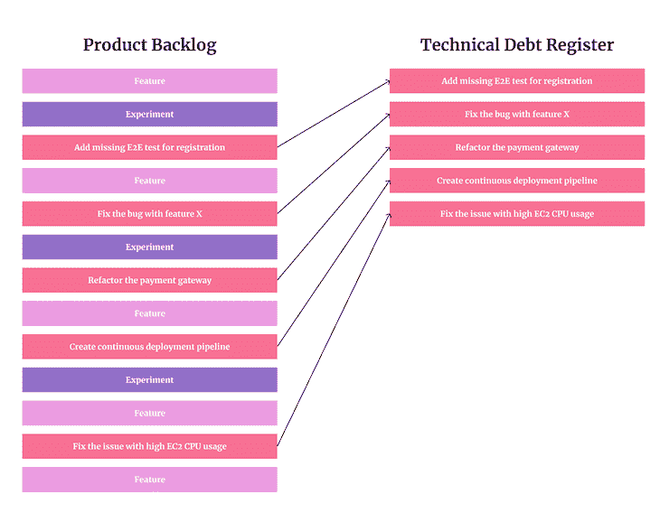

# 如何使用技术债务登记簿

> 原文：<https://blog.logrocket.com/product-management/how-to-use-technical-debt-register/>

技术债务是一个常用的短语，尤其是当被引用作为“事情需要这么长时间”的原因时

举债也是加快发展进程和更快交付的一个好方法。

归根结底，科技股债务既不好也不好。这一切都归结于适当的债务管理。然而，大多数谈论科技债务的人并不关注它。

缺乏讨论的主要原因是围绕这个概念的模糊和恐惧。很难管理你无法清楚看到和评估的东西，但有一些方法可以让科技债务及其管理更加有形。

其中一个是科技债务登记簿。

* * *

## 目录

* * *

## 什么是技术债务登记簿？

简单地说，技术性债务登记册是所有已知债务的积压。

它不一定是一个单独的吉拉待办事项或电子表格(虽然，如果这对你有用，为什么不呢)。技术债务登记簿是[产品积压](https://blog.logrocket.com/product-management/product-vs-sprint-vs-release-backlog/#what-is-a-product-backlog)的一个组成部分。

看看你的产品积压，过滤掉所有的技术问题，瞧，你有一个所有债务的登记簿。

以下是一个技术性债务登记簿的示例:

科技债务登记册带来了额外的透明度和清晰度，你有什么类型和多少债务。这种清晰会帮助你在未来做出更好的决定。

## 如何建立技术债务登记册

创建技术债务积压有两个主要步骤

1.  [定义你认为的科技债务](#define-what-you-consider-tech-debt)
2.  [估算技术债务](#estimate-tech-debt)

### 1.定义你认为什么是科技债务

定义技术债务接近于定义生命的意义。把两个产品经理放在一个房间里，我打赌他们不会得出同样的答案。

对于什么是债务，什么不是债务，没有正式的定义。以前没有，将来也不会有。不过，这并不重要。对你的团队来说，最重要的是对债务有一个一致的定义。

bug 是技术债吗？缺乏 E2E 测试是一种债务吗？绩效问题是债务吗？

这些都是每个团队要自己回答的问题。我们都有一些不同的概念，比如[敏捷](https://blog.logrocket.com/product-management/agile-product-management-what-does-it-mean/)和[产品开发](https://blog.logrocket.com/product-management/what-is-product-development-lifecycle-stages-examples/)。使用最适合您的一般环境的定义。

传统定义[技术债](https://blog.logrocket.com/product-management/5-delivery-metrics-you-should-track/#technical-debt)是产品当前技术状态与理想技术状态之差。

这意味着，如果我正在构建一个我认为应该包含自动化 E2E 测试的应用程序，我会把缺乏这些测试视为一种负债。另一方面，如果它是一个我们不打算用自动化测试覆盖的小应用程序，我不认为缺乏自动化是债务。

换句话说，一家公司定义为债务的东西，另一家公司可能不会。这完全取决于你的定义和目标。

我试着回答这个问题，“这个产品的理想技术状态是什么？”然后，我列出了理想状态和当前状态之间的所有差异。它可以包括:

*   疯狂的
*   缺乏自动化测试
*   表现不佳的建筑
*   遗留代码或意大利面条代码
*   数据安全问题
*   破裂的开发管道

### 2.估计技术债务

为了使技术债务登记册具有可操作性，您需要对其进行评估。毕竟，30 个技术债头寸可能意味着一天的工作或两年的开发冻结。

我建议你用评估其他产品作品的方式来评估它。如果你用小时来描述你的用户故事，那么用小时来估算债务。如果你使用[故事点](https://blog.logrocket.com/product-management/story-points-velocity-estimation-does-this-really-work/#what-story-points)或 [t 恤](https://blog.logrocket.com/product-management/story-points-velocity-estimation-does-this-really-work/#types-story-point-sizing)，那么对债务也这样做。

科技债务项目通常非常模糊，很难给出精确的估计，但这没关系。一天结束时，你需要的只是科技债务登记册的总体规模；它不需要在单个债务项目层面进行衡量。

## 如何管理技术债务登记簿

你花了这么多时间来定义、捕捉和估算债务。太好了。现在怎么办？

科技债务登记簿只有在用于获取洞察力时才有用。我最喜欢的使用注册表的方法是:

### 监控技术负债率

科技债务比率回答了你需要多少次冲刺来偿还所有已知债务。

> 技术负债率=技术债务/ [速度](https://blog.logrocket.com/product-management/what-is-capacity-planning-4-step-framework/#why-traditional-capacity-planning-wont-work-with-agile)

例如，假设你的技术债务登记册估计有 400 个故事点，你的平均速度是 70。在这种情况下，你的科技负债率为 5.7，这意味着你需要大约 6 次冲刺来还清所有已知债务。

* * *

订阅我们的产品管理简讯
将此类文章发送到您的收件箱

* * *

由于缺乏精确性，它可能与事实相差甚远。但它确实给了我们一些规模感。

#### 什么是好的技术债务登记规模/比率？

现在，你可能会问自己，“嗯，5.7 分是高还是低？是好事还是坏事？”

你会恨我这么说，但是——这要看情况。

每个产品都应该有一些最佳债务范围的护栏，这些取决于:

*   [产品的到期日](https://blog.logrocket.com/product-management/what-is-a-product-plan-how-to-create/#product-lifecycle)
*   当前的优先事项
*   产品类型
*   偿还未来债务的成本
*   错过机会的代价(如果你注重技术优势而不是速度)

对于速度是最重要因素的 MVP 来说，5 可能是低负债。对于既需要可靠性又需要快速升级的关键军事软件来说，3 可能已经太高了。

定义你认为在你的具体情况下最理想的比率(如 3-7)，并监控登记簿以控制你的债务。

#### 高/低比率是什么意思？

过高的科技负债率是一个信号，表明或许是时候放慢脚步，在一些问题变成问题之前解决它们了。另一方面，低科技负债率也不一定是件好事。这可能意味着你为了过多的技术优势而牺牲了速度和灵活性。

说到底，与其说它是一门科学，不如说它是一门艺术。这需要几个月的实验和有意识的债务管理来发现最佳比例。但是，不要拘泥于具体的数字，尽量不要太精确。

归根结底，这与具体的科技债务数字无关，而是与这些数字带来的对话有关。

### 定期进行债务审查

科技债务登记簿是一个很好的话题开端。

与团队坐下来，看看你的债务登记簿，问自己几个问题:

*   你对自己目前的债务状况有什么感觉？
*   那里有什么大的风险或危险信号吗？
*   你最近有没有借新债？
*   你最近还清债务了吗？
*   你的科技负债率是怎么变化的？还在可取的范围内吗？
*   你的技术债务范围仍然适合你产品的当前阶段吗？它们应该被调整吗？

围绕科技债务登记册的讨论往往比登记册本身更有价值。确保你们的讨论定期进行。

你应该尝试在每次冲刺回顾中抽出 10 分钟来回顾你的债务，或者每个月进行一次完整的回顾。以任何最适合你的方式，定期进行这样的对话。

大多数团队都意识到他们有一些技术债务。但很少有人定期讨论这些问题。就像理财一样。如果你不经常讨论这个问题，并教给你的孩子，你就不能指望他们在以后的生活中善于理财。技术债务和软件团队也是如此。

## 摘要

尽管技术债务是软件产品交付的一个关键概念，但它通常是相当模糊的。你可以使用科技债务登记册，使其更加有形。

通过以下方式将您的技术债务管理提升到另一个水平:

1.  定义技术债务对你意味着什么
2.  获取所有已知的技术债务
3.  估计它以了解它的大小
4.  控制技术负债比率
5.  就登记册和债务本身进行定期讨论

最终，技术债务可能是你最好的朋友，也可能是最坏的敌人，这取决于你如何有意识地管理它。

*精选图片来源:[icon scout](https://iconscout.com/icon/file-3250251)*

## [LogRocket](https://lp.logrocket.com/blg/pm-signup) 产生产品见解，从而导致有意义的行动

[LogRocket](https://lp.logrocket.com/blg/pm-signup) 确定用户体验中的摩擦点，以便您能够做出明智的产品和设计变更决策，从而实现您的目标。

使用 LogRocket，您可以[了解影响您产品的问题的范围](https://logrocket.com/for/analytics-for-web-applications)，并优先考虑需要做出的更改。LogRocket 简化了工作流程，允许工程和设计团队使用与您相同的[数据进行工作](https://logrocket.com/for/web-analytics-solutions)，消除了对需要做什么的困惑。

让你的团队步调一致——今天就试试 [LogRocket](https://lp.logrocket.com/blg/pm-signup) 。

[Bart Krawczyk Follow](https://blog.logrocket.com/author/bartkrawczyk/) Learning how to build beautiful products without burning myself out (again). Writing about what I discovered along the way.