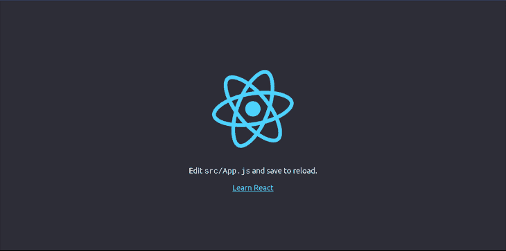

# 如何在 React - LogRocket 博客中使用 GSAP ScrollTrigger 插件

> 原文：<https://blog.logrocket.com/how-to-use-the-gsap-scrolltrigger-plugin-in-react/>

如果不使用滚动驱动的动画库，在网站上实现滚动讲述会很复杂。这些库提供了一个简单的界面，用于在滚动条上创建不同的交互，并改善用户体验。

多年来，滚动驱动的动画库有了显著的改进，它支持 JavaScript 中的滚动播放。从 2013 年[约翰·波拉切克](https://twitter.com/johnpolacek?lang=en)推出[超级卷轴](http://johnpolacek.github.io/scrollorama/)，到 2014 年[简·帕普克](https://twitter.com/janpaepke)推出[卷轴](https://scrollmagic.io/)，再到最近 GSAP 宣布 2020 年推出[卷轴](https://greensock.com/scrolltrigger/)。

ScrollTrigger 是滚动驱动动画的再创造，但以一种更合适和用户友好的方式，让你能够在滚动的同时控制 GSAP 动画或任何其他东西的流动。

在本教程中，我们将学习 GSAP ScrollTrigger 插件，如何使用它来触发滚动动画，以及它的用例。在此过程中，我们将在 React 中构建一个登录页面，该页面将 GSAP 用于动画，并将 ScrollTrigger 用于触发动画。在本教程结束时，你将理解 GSAP ScrollTrigger 插件的基本知识以及如何在 React 中使用它。

## 先决条件

本教程假设读者具备以下条件:

1.  [节点](https://nodejs.org/en/) > = 8.10 安装在他们的本地开发机上
2.  安装在本地开发机器上的 npx 5.2 或更高版本
3.  基本了解如何用 GSAP 制作元素动画
4.  HTML、CSS、JavaScript 和 React 的基础知识

## 介绍 GSAP 滚动触发器插件

GSAP 是绿石动画平台的首字母缩写。它可以说是最好的 web 动画库，因为它可以制作 DOM 元素、canvas、SVG、CSS、WebGL、普通 JavaScript 对象等等。

《GSAP》的创作者坚信它是这个星球上最快的全功能脚本动画工具。

ScrollTrigger 构建于 GSAP 之上，只需几行代码、出色的性能、跨浏览器的兼容性以及 GSAP 社区的支持，就可以用来触发滚动屏幕上那些耐人寻味的 GSAP 动画。

## ScrollTrigger 用例

在这一节中，我们将了解 ScrollTrigger 的重要性，以及何时应该使用它。

下面的演示中有三个圆圈。第三个圆圈用 GSAP 制作了动画，沿着页面的`x-axis`移动了两秒钟。第三个圆圈可能第一眼看不到，所以你需要向下滚动。

> 没有描述

向下滚动时，您会注意到在您到达页面的该部分之前，第三个圆圈已经移向了`x-axis`。是啊，我知道。这可不酷。

好消息是，ScrollTrigger 解决了这个问题，它能够让您在滚动时当用户到达指定的视口时触发动画。

GSAP ScrollTrigger 插件的可能性

## 以下是您可以使用 ScrollTrigger 做的一些事情:

动画滚动上的任何东西(DOM、CSS、SVG、WebGL 和 Canvas)

*   切换播放状态或拖动动画
*   在不同屏幕上自动调整大小
*   支持垂直和水平滚动
*   能够将元素固定到位
*   在 ScrollTrigger 的网站上找到更多关于这些可能性的信息。

滚动触发器基础

## 在我们使用 ScrollTrigger 触发滚动条上的动画之前，让我们先熟悉一下基础知识。

本教程假设读者已经相当了解如何使用 GSAP 制作动画，所以我们将只讨论 ScrollTrigger 的基础知识。在这里找到一个神奇的资源，让你快速了解 GSAP [。](https://ihatetomatoes.net/get-greensock-101)

> 您将在本节中学习的 ScrollTrigger 基础知识将在本教程稍后的项目构建中使用。您可以在他们的[文档](https://greensock.com/docs/v3/Plugins/ScrollTrigger)中查看 ScrollTrigger 属性和方法的完整列表。

如果您已经了解 ScrollTrigger 的基础知识，您可以跳过这一部分，直接跳到项目部分，在这里我们将在 React 中构建一个简单的登录页面，并使用 ScrollTrigger 触发滚动上的动画。

引发

### 属性用来指定我们希望动画开始的点。要添加一个`trigger`属性，请使用下面的语法:

`trigger: "element"`

有了这个属性，我们可以将之前演示中的第三个圆作为动画的触发点。这意味着，当我们到达指定元素的视口(在本例中是第三个圆)时，这个圆只会向 x 轴移动。

让我们将`#thirdCircle`设置为触发点，看看是否有任何变化:

`trigger: "#thirdCircle"`

关键时刻到了。😱

没有描述

> 现在，你可以看到`#thirdCircle`一出现就开始动画。激动人心吧？

标记

`markers`是一个支持开发的特性，允许您查看要被动画化的元素的开始和结束位置以及页面的视窗。

### 让我们使用下面的语法将`markers`添加到我们之前的演示中:

`markers: true`

没有描述

如果我们向下滚动到触发元素(第三个圆圈)，我们会注意到由于`markers`，现在`start`和`end`位置是可见的。

> 更多来自 LogRocket 的精彩文章:

开始

默认情况下，trigger 元素一进入滚动器的视口底部就开始制作动画。

* * *

### 然而，我们可以使用 ScrollTrigger `start`属性来改变默认的`start`位置。
让我们使用下面的代码来更改之前演示中动画的`start`位置:

* * *

### `start: "top center"`

没有描述

这里，`top`是指触发元素的顶部，在这种情况下是`thirdCircle`

`center`表示网页的中心

> 除了使用关键字`top`、`bottom`和`center`来控制动画的位置，我们还可以使用像素或百分比值。

结束

*   正如我们可以改变`start`的位置一样，我们也可以使用 ScrollTrigger 的`end`属性来改变`end`的位置。
*   默认情况下，底部一进入滚动器视口的顶部，触发元素就停止动画。让我们使用下面的代码来改变演示中动画的`end`位置。

`end: "bottom top"`

### 没有描述

这里`bottom`表示触发元件`thirdCircle`的底部

这里表示网页的顶部

矮树

> 属性将滚动位置链接到动画的进度。当您将`scrub`设置为`true`时，当滚动条在`start`和`end`位置属性之间时，它将作为一个擦洗器。

让我们使用语法`scrub:true`添加一个 scrub 到我们的演示中，以便更清楚地理解:

*   没有描述
*   如果您滚动页面并仔细观察，您会注意到当您向下滚动时，触发器元素(`thirdCircle`)沿着 x 轴移动，但是如果您再次向上滚动，它会将它带回到原始位置，从而像一个擦洗器一样工作。

### 到目前为止，我们已经了解到 ScrollTrigger 允许您在页面滚动到特定视口时触发动画。我们还介绍了 ScrollTrigger 的基础知识，现在让我们继续在 React 应用程序中使用 ScrollTrigger。

在 React 应用程序中使用 ScrollTrigger

耶！我们期待已久的时刻到了。在本节中，我们将使用 React 构建一个基本的登录页面，制作登录页面的动画，并使用 ScrollTrigger 触发动画。

> 在 [Co](https://eqkvg.csb.app/) [desandbox](https://eqkvg.csb.app/) 上查看演示，在 [GitHub](https://github.com/didicodes/scrolly) 上查看代码库。

本节已被分解为不同的步骤，以便于理解。

步骤 1:创建一个 React 项目

* * *

首先，让我们使用 [Create React App](https://reactjs.org/docs/create-a-new-react-app.html) 启动 React 应用程序:

## `npx create-react-app scrolly`

上面的命令将为我们创建一个名为`scrolly`的 React 应用程序。成功创建应用程序后，使用`cd scrolly`切换到它的存储库，并运行下面的命令:

`npm start`

如果 React 应用程序已经正确创建，当您导航到`localhost:3000`时，您应该会在浏览器窗口中看到这一点。

### 

步骤 2:向我们的 React 应用程序添加内容

在您最喜欢的集成开发环境(IDE)中打开新创建的 React 应用程序，并将下面的代码粘贴到 App.js 文件中:

上面的代码是一个基本的功能性 React 组件，我们将使用它来制作我们的登录页面动画。

现在，让我一点一点地解释代码:

在这里，我们导入了构建登录页面所需的所有外部文件。

在上面的代码片段中导入的 SVG 图像可以在这里找到。要将这些文件添加到 React 应用程序中，请为每个 svg 图像创建一个文件(workout.svg、greensocklogo.svg 和 happy.svg)，将 SVG 代码[复制到此处](https://codesandbox.io/s/scrolltrigger-example-06rqh?file=/src/App.js:282-435)，并将其粘贴到您创建的文件中:

### 这里，我们有一个父元素`div`和三个子元素`div`。此部分控制我们的登录页面上显示的内容。最后，我们导出了我们的`App`组件，这样我们就可以在 React 应用程序的不同部分重用它。

如果您正确地添加了 SVG 的图像，应该不会有任何错误，现在登录页面应该看起来像[这个](https://n0uft.csb.app/)。

```
import './App.css';
import workout from "./workout.svg";
import greensocklogo from "./greensocklogo.svg";
import happy from "./happy.svg";

function App() {
  return (
   <div className="App">
      <div className="first">
        <h1>ScrollTrigger</h1>
        <p className="first-paragraph">
          is the coolest Greensock plugin.
          <span role="img" aria-label="celebrating">
            🥳
          </span>
        </p>
        <div className="logo-main">
          
        </div>
      </div>
      <div className="second">
        <div className="logo-main">
          
        </div>
      </div>
      <div className="third">
        <p>
          <span className="line" />
        </p>
        <div className="logo-main">
          
        </div>
      </div>
    </div>
  );
}
export default App;

```

步骤 3:定制登录页面

正如你所看到的，我们的登陆页面没有足够的风格，所以用 CSS 使它更有吸引力。为此，将下面的代码粘贴到您的`App.css`文件中:

```
import './App.css';
import workout from "./workout.svg";
import greensocklogo from "./greensocklogo.svg";
import happy from "./happy.svg";

```

使用我们刚刚添加的 CSS，我们的应用程序应该看起来像[这个](https://06rqh.csb.app/)。

步骤 4:使用引用定位元素

```
function App() {
  return (
   <div className="App">
      <div className="first">
        <h1>ScrollTrigger</h1>
        <p className="first-paragraph">
          is the coolest Greensock plugin.
          <span role="img" aria-label="celebrating">
            🥳
          </span>
        </p>
        <div className="logo-main">
          
        </div>
      </div>
      <div className="second">
        <div className="logo-main">
          
        </div>
      </div>
      <div className="third">
        <p>
          <span className="line" />
        </p>
        <div className="logo-main">
          
        </div>
      </div>
    </div>
  );
}

export default App;

```

我们需要使用`[useRef()](https://medium.com/trabe/react-useref-hook-b6c9d39e2022)` [React 钩子](https://medium.com/trabe/react-useref-hook-b6c9d39e2022)来定位我们想要在登陆页面上制作动画的元素。

将下面更新的代码粘贴到您的`App.js`文件中:

### 下面是对代码更改的解释:

我们将`useRef()` React 钩子导入到`App.js`中:

```
*{
  padding: 0%;
  margin: 0%;
  box-sizing: border-box;
}

.first{
  width: auto;
  height:500px;
  background-color:  #fdfffc;
  margin-top: 30px;
}

.second{
  width:auto;
  height: 400px;
  background-color: #e0fbfc;
}

.third{
  width: auto;
  height: 400px;
  background-color: #fdfffc;
}

.line {
  width: 100%;
  max-width: 1400px;
  height: 20px;
  margin-top:20px;
  position: relative;
  display: inline-block;
  background-color:#023047;
}

h1{
  text-align: center;
  padding-top: 90px;
  color: #023047;
  font-size: 60px;
}

.first-paragraph{
  text-align: center;
  color: #023047;
  font-size: 20px;
  font-weight: bold;
}

.logo-main{
  align-items: center;
  display: flex;
  justify-content: center;
}

#workout-logo{
  width: 500px;
  height: 300px;
  margin-top: 10px;
}

#gsap-logo{
  width: 500px;
  height: 300px;
  margin-top: 50px;
  padding-right: 80px;
}

#happy-logo{
  width: 500px;
  height: 300px;
}

.second-paragraph{
  font-size: 30px;
  margin-top: 40px;
}

.third-paragraph{
  font-size: 30px;
  margin-top: 40px;
}

```

然后，我们创建了一个名为`ref`的变量，它将用于存储我们的目标元素的引用(在本例中是父元素`div`)。

### 最后，我们将可变的`ref`对象传递到父`div`元素中。

步骤 5:使用 GSAP 制作反应参考动画

现在我们已经锁定了想要制作动画的元素，让我们用 GSAP 来制作动画。

```
import {useRef} from "react";
import "./App.css";
import workout from "./workout.svg";
import greensocklogo from "./greensocklogo.svg";
import happy from "./happy.svg";

function App() {

  const ref = useRef(null);

  return (
    <div className="App" ref={ref}>
      <div className="first">
        <h1>ScrollTrigger</h1>
        <p className="first-paragraph">
          is the coolest Greensock plugin.
          <span role="img" aria-label="celebrating">
            🥳
          </span>
        </p>
        <div className="logo-main">
          
        </div>
      </div>

      <div className="second">
        <div className="logo-main">
          
        </div>
      </div>

      <div className="third">
        <p>
          <span className="line" />
        </p>
        <div className="logo-main">
          
        </div>
      </div>
    </div>
  );
}

export default App;

```

首先，通过在终端上运行以下命令，将 GSAP 安装到 React 应用程序中:

```
import {useRef} from "react";

```

`npm install gsap`

```
const ref = useRef(null);

```

将 GSAP 成功安装到 React 应用程序后，将下面的更新代码粘贴到您的`App.js`文件中:

```
<div ref={ref} className="App">
    ...
</div>

```

下面是我们对 App.js 文件中现有代码所做更改的解释:

### 我们将`useEffect()` React 钩子和`gsap`导入到`App.js`中:

我们为三个子`div`元素初始化了三个不同的`useEffect()` React 钩子。在每个`useEffect()`钩子中，我们创建了一个名为`element`的常量变量，并使用`useRef()` React 钩子为它分配了一个对父`div`元素的引用:

在三个钩子中，我们添加了 GSAP `tweens`来激活三个子元素`div`；`.first-paragraph`、`#gsap-logo`、`.line`。

有了这个新的更新，我们的登录页面现在看起来像这样。

如果您现在查看登录页面，您会注意到我们已经成功地为`.first-paragraph`、`#gsap-logo`和`.line`子元素制作了动画。

```
import { useRef, useEffect } from "react";
import "./App.css";
import workout from "./workout.svg";
import greensocklogo from "./greensocklogo.svg";
import happy from "./happy.svg";
import { gsap } from "gsap";

function App() {
  const ref = useRef(null);
  useEffect(() => {
    const element = ref.current;
    gsap.fromTo(
      element.querySelector(".first-paragraph"),
      {
        opacity: 0,
        y: -20
      },
      {
        opacity:1,
        y: 0
      }
    );
  }, []);

  useEffect(() => {
    const element = ref.current;
    gsap.fromTo(
      element.querySelector("#gsap-logo"),
      {
        opacity: 0,
        scale: 0.2,
        y: -20
      },
      {
        opacity: 1,
        y: 0,
        scale: 1,
        duration: 1,
        ease: "none"
      }
    );
  }, []);

  useEffect(() => {
    const element = ref.current;
    gsap.from(element.querySelector(".line"), {
      scale: 0,
      ease: "none"
    });
  }, []);

  return (
    <div className="App" ref={ref}>
      <div className="first">
        <h1>ScrollTrigger</h1>
        <p className="first-paragraph">
          is the coolest Greensock plugin.
          <span role="img" aria-label="celebrating">
            🥳
          </span>
        </p>
        <div className="logo-main">
          
        </div>
      </div>

      <div className="second">
        <div className="logo-main">
          
        </div>
      </div>

      <div className="third">
        <p>
          <span className="line" />
        </p>
        <div className="logo-main">
          
        </div>
      </div>
    </div>
  );
}

export default App;

```

然而，一旦页面被加载到浏览器窗口中，这些动画就开始动画化，这使得我们无法看到正在运行的动画。我打赌你没看到登陆页最后的`.line`元素的动画。

```
import { useRef, useEffect } from "react";
import { gsap } from "gsap";

```

让我们通过添加 **ScrollTrigger** **插件**来修复这个问题，以确保动画仅在滚动时被触发。

```
  useEffect(() => {
    const element = ref.current;
    ...
  }, []); 

```

步骤 6:使用 ScrollTrigger 触发滚动动画

```
  useEffect(() => {
    const element = ref.current;
    gsap.fromTo(
      element.querySelector(".first-paragraph"),
      {
        opacity: 0,
        y: -20
      },
      {
        opacity:1,
        y: 0
      }
    );
  }, []);

  useEffect(() => {
    const element = ref.current;
    gsap.fromTo(
      element.querySelector("#gsap-logo"),
      {
        opacity: 0,
        scale: 0.2,
        y: -20
      },
      {
        opacity: 1,
        y: 0,
        scale: 1,
        duration: 1,
        ease: "none"
      }
    );
  }, []);

  useEffect(() => {
    const element = ref.current;
    gsap.from(element.querySelector(".line"), {
      scale: 0,
      ease: "none"
    });
  }, []);

```

耶！是时候看看 ScrollTrigger 插件的运行了。

将下面的代码粘贴到`App().js`文件中:

* * *

以下是我们对代码所做更改的解释:

我们将 ScrollTrigger 插件导入到了`App.js`:

然后我们注册了 ScollTrigger 插件:

### 在我们的每个`useEffect()`钩子中，我们添加了`scrollTrigger`作为我们的`gsap tween`中的一个值。

在本例中，我们添加了我们的`trigger element`，即`.first`元素。然后我们也为动画指定了`start`和`end`的位置。最后，我们将`scrub`设置为`true`，这样当我们滚动登录页面时，我们所有的动画都将作为一个擦洗器。

随着更新的变化，我们的登录页面的动画将只在我们滚动网页时到达指定的视窗时才开始动画。

```
import { useRef, useEffect } from "react";
import "./App.css";
import workout from "./workout.svg";
import greensocklogo from "./greensocklogo.svg";
import happy from "./happy.svg";
import { gsap } from "gsap";
import { ScrollTrigger } from "gsap/ScrollTrigger";
function App() {
  gsap.registerPlugin(ScrollTrigger);
  const ref = useRef(null);
  useEffect(() => {
    const element = ref.current;
    gsap.fromTo(
      element.querySelector(".first-paragraph"),
      {
        opacity: 0,
        y: -20
      },
      {
        opacity: 1,
        y: 0,
        scrollTrigger: {
          trigger: element.querySelector(".first"),
          start: "top top",
          end: "bottom center",
          scrub: true
        }
      }
    );
  }, []);
  useEffect(() => {
    const element = ref.current;
    gsap.fromTo(
      element.querySelector("#gsap-logo"),
      {
        opacity: 0,
        scale: 0.2,
        y: -20
      },
      {
        opacity: 1,
        y: 0,
        scale: 1,
        duration: 1,
        ease: "none",
        scrollTrigger: {
          trigger: element.querySelector(".first"),
          start: "top center",
          end: "bottom top",
          scrub: true
        }
      }
    );
  }, []);
  useEffect(() => {
    const element = ref.current;
    gsap.from(element.querySelector(".line"), {
      scale: 0,
      ease: "none",
      scrollTrigger: {
        trigger: element.querySelector(".third"),
        scrub: true,
        start: "top bottom",
        end: "top top"
      }
    });
  }, []);
  return (
    <div className="App" ref={ref}>
      <div className="first">
        <h1>ScrollTrigger</h1>
        <p className="first-paragraph">
          is the coolest Greensock plugin.
          <span role="img" aria-label="celebrating">
            🥳
          </span>
        </p>
        <div className="logo-main">
          
        </div>
      </div>
      <div className="second">
        <div className="logo-main">
          
        </div>
      </div>
      <div className="third">
        <p>
          <span className="line" />
        </p>
        <div className="logo-main">
          
        </div>
      </div>
    </div>
  );
}
export default App;

```

请点击此处查看演示[。](https://eqkvg.csb.app/)

```
import { ScrollTrigger } from "gsap/ScrollTrigger";

```

结论

```
gsap.registerPlugin(ScrollTrigger); 

```

我希望你能在本教程中了解到 GSAP 滚动触发器插件。尽管本教程涵盖了使用 ScrollTrigger 的基本可能性，但是使用 ScrollTrigger 还可以做更多的事情。你可能会从格林索克的“密码笔”上的演示中受到启发。

```
  useEffect(() => { 
    const element = ref.current;
    gsap.fromTo(
      element.querySelector(".first-paragraph"),
      {
        opacity: 0,
        y: -20
      },
      {
        opacity: 1,
        y: 0
        scrollTrigger: {
          trigger: element.querySelector(".first"),
          start: "top top",
          end: "bottom center",
          scrub: true
        }
      }
    );
  }, []);

```

如果你有任何问题，可以在下面的评论区留言。

```
scrollTrigger: {
    trigger: element.querySelector(".first"),
    start: "top top",
    end: "bottom center",
    scrub: true
}

```

使用 LogRocket 消除传统反应错误报告的噪音

是一款 React analytics 解决方案，可保护您免受数百个误报错误警报的影响，只针对少数真正重要的项目。LogRocket 告诉您 React 应用程序中实际影响用户的最具影响力的 bug 和 UX 问题。

自动聚合客户端错误、反应错误边界、还原状态、缓慢的组件加载时间、JS 异常、前端性能指标和用户交互。然后，LogRocket 使用机器学习来通知您影响大多数用户的最具影响力的问题，并提供您修复它所需的上下文。

## 关注重要的 React bug—[今天就试试 LogRocket】。](https://lp.logrocket.com/blg/react-signup-issue-free)

资源和进一步阅读

If you have any questions, you can leave it in the comments section below.

## Cut through the noise of traditional React error reporting with LogRocket

[LogRocket](https://lp.logrocket.com/blg/react-signup-issue-free)

is a React analytics solution that shields you from the hundreds of false-positive errors alerts to just a few truly important items. LogRocket tells you the most impactful bugs and UX issues actually impacting users in your React applications.

[ ](https://lp.logrocket.com/blg/react-signup-general) [  ](https://lp.logrocket.com/blg/react-signup-general) [LogRocket](https://lp.logrocket.com/blg/react-signup-issue-free)

automatically aggregates client side errors, React error boundaries, Redux state, slow component load times, JS exceptions, frontend performance metrics, and user interactions. Then LogRocket uses machine learning to notify you of the most impactful problems affecting the most users and provides the context you need to fix it.

Focus on the React bugs that matter — [try LogRocket today](https://lp.logrocket.com/blg/react-signup-issue-free).

## Resources and further reading