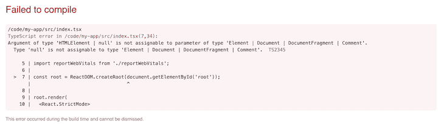
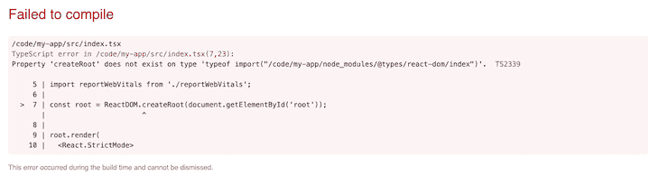

# 如何在 React 18 alpha - LogRocket 博客中使用 TypeScript

> 原文：<https://blog.logrocket.com/how-to-use-typescript-with-react-18-alpha/>

[John Reilly Follow](https://blog.logrocket.com/author/johnreilly/) MacGyver turned Dev 🌻❤️ TypeScript / ts-loader / fork-ts-checker-webpack-plugin / DefinitelyTyped: The Movie

# 如何在 React 18 alpha 中使用 TypeScript

## 

2021 年 6 月 9 日 2 分钟阅读 654

[React 18 alpha 已经发布](https://reactjs.org/blog/2021/06/08/the-plan-for-react-18.html)，非常激动人心！但是我们能把它和 TypeScript 一起使用吗？

答案是“是的”，但是我们需要做一些事情来实现它。这篇文章将告诉你该怎么做。

## 使用 TypeScript 创建 React 应用程序

让我们用 [Create React App](https://blog.logrocket.com/getting-started-with-create-react-app-d93147444a27/) 为自己创建一个普通的 React 类型脚本应用程序:

```
yarn create react-app my-app --template typescript
```

现在我们把 React 的版本升级到`@next`:

```
yarn add [email protected] [email protected]
```

这将在`package.json`中为您留下使用 React 18 的条目。它可能看起来像这样:

```
    "react": "^18.0.0-alpha-e6be2d531",
    "react-dom": "^18.0.0-alpha-e6be2d531",
```

如果我们运行`yarn start`，我们会发现自己在运行一个 React 18 应用。激动人心！

## 使用新的 API

所以让我们尝试使用`[ReactDOM.createRoot](https://github.com/reactwg/react-18/discussions/5)` API。正是这个 API 选择我们的应用程序使用 React 18 的新功能。我们将打开`index.tsx`并进行如下更改:

```
-ReactDOM.render(
-  <React.StrictMode>
-    <App />
-  </React.StrictMode>,
-  document.getElementById('root')
-);
+const root = ReactDOM.createRoot(document.getElementById('root'));
+
+root.render(
+  <React.StrictMode>
+    <App />
+  </React.StrictMode>
+);
```

如果我们单独运行 JavaScript，这是可行的。但是，因为我们也使用了 TypeScript，所以我们现在面临一个错误:

> `Property 'createRoot' does not exist on type 'typeof import("/code/my-app/node_modules/@types/react-dom/index")'. TS2339`



这是 TypeScript 编译器抱怨它对`ReactDOM.createRoot`一无所知。这是因为我们的应用程序中当前的类型定义没有定义 API。

让我们升级我们的类型定义:

```
yarn add @types/react @types/react-dom
```

我们可能有理由希望现在一切都正常运转——唉，事实并非如此。出现了同样的错误。TypeScript 不高兴了。

## 告诉 TypeScript 新的 API

如果我们看一下增加了对 API 支持的 [PR，我们会找到一些提示。如果你看一下](https://github.com/DefinitelyTyped/DefinitelyTyped/pull/53685)`[next.d.ts](https://github.com/DefinitelyTyped/DefinitelyTyped/blob/a07e9cfb005682fb6be0a2e85113eac131c3006f/types/react/next.d.ts)`的，你会发现这个信息，由[塞巴斯蒂安·西尔伯曼](https://twitter.com/sebsilbermann)提供:

```
/**
 * These are types for things that are present in the upcoming React 18 release.
 *
 * Once React 18 is released they can just be moved to the main index file.
 *
 * To load the types declared here in an actual project, there are three ways. The easiest one,
 * if your `tsconfig.json` already has a `"types"` array in the `"compilerOptions"` section,
 * is to add `"react/next"` to the `"types"` array.
 *
 * Alternatively, a specific import syntax can to be used from a typescript file.
 * This module does not exist in reality, which is why the {} is important:
 *
```ts
 * import {} from 'react/next'
```
 *
 * It is also possible to include it through a triple-slash reference:
 *
```ts
 * /// <reference types="react/next" />
```
 *
 * Either the import or the reference only needs to appear once, anywhere in the project.
 */
```

让我们试试单子上的第一项。我们将编辑我们的`tsconfig.json`，并向`"compilerOptions"`部分添加一个新条目:

```
    "types": ["react/next", "react-dom/next"]
```

如果我们用`yarn start`重新开始构建，我们现在会看到一个不同的错误:

> `Argument of type 'HTMLElement | null' is not assignable to parameter of type 'Element | Document | DocumentFragment | Comment'.
> Type 'null' is not assignable to type 'Element | Document | DocumentFragment | Comment'. TS2345`



现在，这实际上与我们新的 React 类型定义的问题无关。他们很好。这是一个打字稿，上面写着，“不能保证`document.getElementById('root')`返回不是`null`的东西。既然我们处于`strictNullChecks`模式，你需要确保`root`不为空。”

我们将通过在调用`ReactDOM.createRoot`之前测试我们是否有一个元素在起作用来处理这个问题:

```
-const root = ReactDOM.createRoot(document.getElementById('root'));
+const rootElement = document.getElementById('root');
+if (!rootElement) throw new Error('Failed to find the root element');
+const root = ReactDOM.createRoot(rootElement);
```

经过这些更改，我们有了一个使用 TypeScript React 18 应用程序。尽情享受吧！

## [LogRocket](https://lp.logrocket.com/blg/typescript-signup) :全面了解您的网络和移动应用

[](https://lp.logrocket.com/blg/typescript-signup)

LogRocket 是一个前端应用程序监控解决方案，可以让您回放问题，就像问题发生在您自己的浏览器中一样。LogRocket 不需要猜测错误发生的原因，也不需要向用户询问截图和日志转储，而是让您重放会话以快速了解哪里出错了。它可以与任何应用程序完美配合，不管是什么框架，并且有插件可以记录来自 Redux、Vuex 和@ngrx/store 的额外上下文。

除了记录 Redux 操作和状态，LogRocket 还记录控制台日志、JavaScript 错误、堆栈跟踪、带有头+正文的网络请求/响应、浏览器元数据和自定义日志。它还使用 DOM 来记录页面上的 HTML 和 CSS，甚至为最复杂的单页面和移动应用程序重新创建像素级完美视频。

[Try it for free](https://lp.logrocket.com/blg/typescript-signup)

.