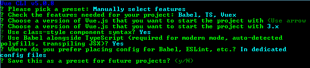

# 如何使用 Vue 3 和 TypeScript - LogRocket 博客

> 原文：<https://blog.logrocket.com/how-to-use-vue-3-typescript/>

***编者按**:这篇文章最后一次更新是在 2022 年 8 月 17 日，加入了 Vue 3 中引入的新特性，包括`defineComponent`。*

Vue 是一个惊人的轻量级、渐进式前端框架。在本教程中，我们将演示如何完全用 TypeScript 构建 Vue 应用程序。我们将通过构建一个带有基于类的组件、用于状态管理的 Vuex、生命周期挂钩等的示例应用程序来强调将 TypeScript 与 Vue 结合使用的一些好处。我们开始吧！

 [https://www.youtube.com/embed/p-RVbyZq5LQ?version=3&rel=1&showsearch=0&showinfo=1&iv_load_policy=1&fs=1&hl=en-US&autohide=2&wmode=transparent](https://www.youtube.com/embed/p-RVbyZq5LQ?version=3&rel=1&showsearch=0&showinfo=1&iv_load_policy=1&fs=1&hl=en-US&autohide=2&wmode=transparent)

视频

## Vue 和 TypeScript 入门

Vue 很灵活，所以用户不会被迫使用 TypeScript。与 Angular 不同，旧版本的 Vue 没有对 TypeScript 的适当支持。由于这个原因，历史上大多数 Vue 应用程序都是用 JavaScript 编写的。

Vue 3 于 2020 年 9 月发布，包括内置复合 API、多个根元素等特性，最重要的是，改进了类型脚本支持。关于如何将你现有的 Vue 项目迁移到 Vue 3 的详细信息，我推荐查看[将你的 Vue 2 应用重构到 Vue 3](https://blog.logrocket.com/refactoring-your-vue-2-apps-to-vue-3/) 。

既然 Vue 正式支持 TypeScript，那么只使用 Vue CLI，不使用任何第三方库，从头开始创建 TypeScript 项目就很容易了。然而，无论是官方的 Vue 文档还是 TypeScript 文档都没有包含您开始使用所需的所有信息。为了更全面地描述，我们将演示如何使用 [Vue CLI](https://cli.vuejs.org/) 构建一个新的 Vue 和 TypeScript 应用程序。

## 如何向 Vue 项目添加 TypeScript

首先，我们将使用下面的代码用 TypeScript 建立一个新的 Vue 项目:

```
npx @vue/cli create typescript-app

```

选择**手动选择功能**，并使用以下设置进行配置:



项目建立后，运行项目进行测试:

```
cd typescript-app
npm run serve

```

启动项目后，打开`localhost:8080`或你的控制台显示的任何 URL，你应该看到你的应用程序成功运行。对于下面的每一项，我将展示 TypeScript 和 JavaScript 等效代码，以便您可以轻松地比较这两者。我们开始吧！

## 使用`defineComponent`

[`defineComponent`](https://vuejs.org/api/general.html#definecomponent) 提供了来自 Vue 库的 decorators，我们可以用它来定义完全支持 TypeScript 的 Vue 组件。要使用`defineComponent`，从`src`文件夹中打开`App.vue`并添加以下代码:

```
//src/App.vue
//Typescript code
<script lang="ts">
import { defineComponent } from 'vue';
import HelloWorld from './components/HelloWorld.vue';

export default defineComponent({
  components:{
    HelloWorld
  }
})
</script>

```

要使用 TypeScript，我们首先需要将`<script>`标签中的`lang`属性设置为`ts`:

```
<script lang="ts">

```

有一个装饰器，允许我们定义组件和每个组件的属性。`components`对象帮助我们将组件添加到模板中:

```
components: {
    HelloWorld,
  }

```

## 使用数据

要使用数据属性，我们可以简单地将它们声明为类变量:

```
export default defineComponent({
  components:{
    HelloWorld,
  },
  data(){
    return{
      title:"welcome to my app",
      list: [
    {
      name: 'popoolatopzy',
      age: '26'
    },
    {
      name: 'Preetish',
      age: '26'
    },
    {
      name: 'John',
      age: '30'
    }
  ]
    }
  }
})

```

JavaScript 等效代码如下所示:

```
export default {
  data() {
    return {
      title: "welcome to my app",
      list: [
        {
          name: 'Preetish',
          age: '26'
        },
        {
          name: 'John',
          age: '30'
        }
      ]
    }
}

```

## 使用道具

为了在 Vue 组件中使用 props，我们可以使用`props`装饰器。在 Vue 中，我们可以给出道具的附加细节，比如`required`、`default`和`type`。然而，由于我们正在使用`defineComponent`，我们不需要导入`Prop`装饰器。相反，我们可以在`defineComponent`中写道具，如下图。我们也可以使用`readonly`来避免操纵道具:

```
export default defineComponent({
  components:{
    HelloWorld
  },
  data(){
    return{
      title:"welcome to my app",
    }
  },
  props: {
    name:{
      readonly:true,
      default: 'John doe',
      type:String
    },
    job:{
      required: false,
      type: String,
      default: 'Developer'
    }
  },
  setup(props) {
    props.name,
    props.age,
    props.job
  },

})

```

等效的 JavaScript 代码如下:

```
export default {
  props: {
    name: {
      default: 'John doe'
    },
    age: {
      required: true,
    },
    job: {
      required: false,
      type: string,
      default: 'Developer'
    }
  }
}

```

## 计算属性

我们可以使用一个`computed`属性来编写简单的模板逻辑，比如操作、追加或连接数据。在 TypeScript 中，普通的计算属性也以关键字`get`为前缀:

```
export default defineComponent({
  components:{
    HelloWorld
  },
  data(){
    return{
      title:"welcome to my app",
      first:'Popoola',
      last:"Temitope"
    }
  },
  computed:{
    fullName(): String{
    return this.first+ ' '+ this.last
    }
   }
})

```

下面是等效的 JavaScript 代码:

```
export default {
  fullName() {
    return this.first + ' ' + this.last
  }
}

```

我们可以编写复杂的计算属性，既有`getter`又有`setter`。默认情况下，计算的属性是 getter 专用的。getter 和 setter 必须在 TypeScript 的 computed 属性中使用，如下所示:

```
export default defineComponent({
  components:{
    HelloWorld
  },
  title:"welcome to my app",
  data(){
    return{
      title:"welcome to my app",
      first:'Popoola',
      last:"Temitope"
    }
  },
  computed:{
    fullname:{

       // getter
       get() : string {
        return this.first+" "+ this.last
      },
      // setter
       set(value : string) {
        let names = value.split(' ');
        this.first = names[0];
        this.last = names[names.length - 1]
      }

    }

    }

})

```

JavaScript 等效代码如下所示:

```
fullName: {
  get: function () {
    return this.first + ' ' + this.last
  },
  set: function (newValue) {
    let names = newValue.split(' ')
    this.first = names[0]
    this.last = names[names.length - 1]
  }
}

```

## 方法

在 TypeScript 中，像普通的类方法一样，有一个可选的访问修饰符:

```
export default defineComponent({
  components:{
    HelloWorld
  },
  data(){
    return{
      title:"welcome to my app",
    }
  },
   methods:{
    clickMe() {
     console.log('clicked')
     console.log(this.addNum(4, 2))
    },  

   addNum(num1: number, num2: number): number {
    return num1 + num2
  }

  }
})

```

相当于 JavaScript 的代码如下:

```
export default {
  methods: {
    clickMe() {
      console.log('clicked')
      console.log(this.addNum(4, 2))
    }
    addNum(num1, num2) {
      return num1 + num2
    }
  }
}

```

## 观察者

在 TypeScript 中，`Watchers`的写法与我们通常在 JavaScript 中的写法不同。JavaScript 中最常用的观察器语法如下:

```
watch: {
  name: function(newval) {
    //do something
  }
}

```

我们不经常使用处理程序语法:

```
watch: {
  name: {
    handler: 'nameChanged'
  }
},
methods: {
  nameChanged (newVal) {
    // do something
  }
}

```

TypeScript 语法类似于第二种方法。在 TypeScript 中，我们使用`Watch` decorator 并跟随我们需要观察的变量的名称:

```
watch: {
  name: function(newValue,oldValue) {
    //do something
  }
}

```

我们还可以设置`immediate`和`deep`观察器:

```
watch: {
    someObject: {
      handler(newValue, oldValue) {
        //do something
      },
      deep: true,
      immediate:true,
    }
  }

```

下面是 JavaScript 等价代码:

```
watch: {
  person: {
      handler: 'projectChanged',
      immediate: true,
      deep: true
    }
}
methods: {
  projectChanged(newVal, oldVal) {
    // do something
  }
}

```

## `emit`

为了将一个方法从子组件转移到父组件，我们将在 TypeScript 中使用`emit`装饰器:

```
 emits: ['increment'],
  setup(props, { emit }) {
    const addToCount=(n: number)=>{
      this.count += n
    }
  },

 emits: ['resetData'],
  setup(props, { emit }) {
    const resetCount=(n: number)=>{
      this.count = 0
    }
  },

```

在第一个例子中，名为`addToCount`的函数被转换为 kebab case，这与`emit`在 Vue 中的工作方式非常相似。

在第二个例子中，我们为这个方法传递了一个显式的名字`resetData`，然后我们使用这个名字来代替。由于`addData`在骆驼盒中，我们将其转换为烤肉串盒:

```
<some-component add-to-count="someMethod" />
<some-component reset-data="someMethod" />

//Javascript Equivalent
 methods: {
    addToCount(n) {
      this.count += n
      this.$emit('add-to-count', n)
    },
    resetCount() {
      this.count = 0
      this.$emit('resetData')
    }
}

```

## 导入组件

在`@components`装饰器中，我们存储代码以在其他组件中注册组件。让我们通过创建一个计数器应用程序来演示这一点。将以下代码添加到`App.vue`:

```
<template>
<div class="app">
    <h1>{{title}}</h1>
  </div>
  <Counter/>
</template>
//Typescript code
<script lang="ts">
import { defineComponent } from 'vue';
import Counter from './components/Counter.vue';

export default defineComponent({
  components:{
    Counter
  },
  data(){
    return{
      title:"welcome to my counter app",
    }
  }

})
</script>

```

要使用计数器组件，在`components`文件夹中创建`Counter.vue`，并向其中添加以下代码:

```
<template>
  <div>
    <button v-on:click="decrement">decrement</button>
    <button v-on:click="increment">increment</button>
    <p>{{ count }}</p>
  </div>
</template>
<script lang="ts">
import { defineComponent} from 'vue';
export default defineComponent({
 components:{},
  data(){
    return{
    count:0
    }
  },
  methods:{
    increment() {
     this.count++;
    },  
    decrement() {
       this.count--;
    }

  }
})
</script>

```

## 将 Vuex 与 TypeScript 一起使用

Vuex 是大多数 Vue 应用程序中使用的官方状态管理库。在 [Vuex 中，将商店分割成模块](https://blog.logrocket.com/managing-multiple-store-modules-vuex/)是一个很好的做法，所以我们将演示如何用 TypeScript 编写。为了存储状态，让我们在`store`文件夹中创建一个名为`types.ts`的文件:

```
// store/types.ts
export interface RootState{
    stateTitle:string;
}

```

在`store`文件夹中，我们需要创建一个`index.ts`文件来初始化 Vuex 并注册模块:

```
// store/index.ts
import Vue from 'vue';
import Vuex, { StoreOptions } from 'vuex';
import { RootState } from './types';

const store:StoreOptions<RootState> = {
  state:{
    stateTitle:"Vue.js and TypeScript: A Complete Tutorial With Examples",
  },
  modules:{

  }
}
export default new Vuex.Store<RootState>(store)

```

在上面的代码中，我们利用 Vuex 库中的`StoreOptions`来处理`State`、`Getter`、`Mutation`和`Action`。我们可以使用`App.vue`文件中的`Getter`和`Setter`来访问和更新`stateTitle`的值，如下所示:

```
// src/App.vue
<template>
<div id="app">
    <h1>{{stateTitle}}</h1>
    <br><br>
    <Counter />
  </div>

</template>

<script lang="ts">
import Counter from './components/Counter.vue';
import store from './store';
import { defineComponent} from 'vue';

export default defineComponent({
    title:"Counter App",
  components: {
    Counter,
  },
  computed:{
    stateTitle:{
      get():string{
        return store.state.stateTitle;
      },

      set(value:string){
        store.state.stateTitle = value
        console.log(store.state.stateTitle)
      }

    }
  }

})
</script>

```

## 生命周期挂钩

一个 [Vue 组件有八个生命周期钩子](https://blog.logrocket.com/introduction-to-vue-lifecycle-hooks/)，包括`created`和`mounted`。我们对每个钩子使用相同的 TypeScript 语法，并将它们声明为普通的类方法。因为生命周期挂钩是自动调用的，它们既不接受参数也不返回任何数据。因此，我们不需要访问修饰符、类型参数或返回类型:

```
export default defineComponent({
  mounted() {
    //do something
  },
  beforeUpdate() {
    // do something
  }
})

```

JavaScript 等效代码如下所示:

```
export default {
  mounted() {
    //do something
  },
  beforeUpdate() {
    // do something
  }
}

```

## 通过 Vue 使用 TypeScript mixins

为了在 TypeScript 中创建 mixin，我们必须首先创建我们的 mixin 文件，它包含我们与其他组件共享的数据。

在 mixins 目录中，创建一个名为`ProjectMixin.ts`的文件，并添加以下 mixin，它共享项目名和一个更新项目名的方法:

```
// src/mixins/ProjectMixin.ts
import { defineComponent } from 'vue';

export default defineComponent({
  data(){
    return{
        projName:"Vue.js and TypeScript: A complete tutorial with examples",
    }
  },
   projName:'My project',
   projectDetail1: {
    set value(v : string) {
    this.projName = v;
   },

    get value() : string {
    return  this.projName
   }
}

})

```

在 JavaScript 中，我们将编写如下代码:

```
export default {
  data() {
    return {
      projName: 'My project'
    }
  },
  methods: {
    setProjectName(newVal) {
      this.projName = newVal
    }
  }
}

```

为了在我们的 Vue 组件中使用上面的类型脚本 mixin，我们需要从 [Vue 属性装饰器](https://github.com/kaorun343/vue-property-decorator)中导入`Mixins`以及我们的 mixin 文件本身，然后编写如下:

```
// src/App.vue
<template>
<div>
  1{{ projectDetail }}
</div>
</template>

//Typescript code
<script lang="ts">
import { defineComponent } from 'vue';
import HelloWorld from './components/HelloWorld.vue';
 import ProjectMixin from '@/mixins/ProjectMixin'
export default defineComponent({
  components:{
    HelloWorld,
    ProjectMixin
  },
  mixins: [ ProjectMixin ],
computed: {
    projectDetail() {
      return this.projName + ' ' + 'Preetish HS'
    }
  }
})
</script>

```

JavaScript 等效代码如下所示:

```
<template>
  <div class="project-detail">
    {{ projectDetail }}
  </div>
</template>
<script>
import ProjectMixin from '@/mixins/ProjectMixin'
export default {
  mixins: [ ProjectMixin ],
  computed: {
    projectDetail() {
      return this.projName + ' ' + 'Preetish HS'
    }
  }
}
</script>

```

## 结论

在本文中，我们已经介绍了在 TypeScript 中创建 Vue 应用程序所需的所有基本信息，这些应用程序具有定制的装饰特性，没有第三方库。现在，您应该能够在 TypeScript 中启动并运行您的 Vue 应用程序，它具有诸如`defineComponent`、数据、属性、计算属性、方法和观察器等特性。

Vue 3.0 包括对现成的 TypeScript 的更好支持，并且整个 Vue 代码都用 TypeScript 重写，以提高可维护性。我希望你喜欢这个教程，如果你有任何问题，一定要留下评论。编码快乐！

## 像用户一样体验您的 Vue 应用

调试 Vue.js 应用程序可能会很困难，尤其是当用户会话期间有几十个(如果不是几百个)突变时。如果您对监视和跟踪生产中所有用户的 Vue 突变感兴趣，

[try LogRocket](https://lp.logrocket.com/blg/vue-signup)

.

[](https://lp.logrocket.com/blg/vue-signup)[https://logrocket.com/signup/](https://lp.logrocket.com/blg/vue-signup)

LogRocket 就像是网络和移动应用程序的 DVR，记录你的 Vue 应用程序中发生的一切，包括网络请求、JavaScript 错误、性能问题等等。您可以汇总并报告问题发生时应用程序的状态，而不是猜测问题发生的原因。

LogRocket Vuex 插件将 Vuex 突变记录到 LogRocket 控制台，为您提供导致错误的环境，以及出现问题时应用程序的状态。

现代化您调试 Vue 应用的方式- [开始免费监控](https://lp.logrocket.com/blg/vue-signup)。

## [LogRocket](https://lp.logrocket.com/blg/typescript-signup) :全面了解您的网络和移动应用

[](https://lp.logrocket.com/blg/typescript-signup)

LogRocket 是一个前端应用程序监控解决方案，可以让您回放问题，就像问题发生在您自己的浏览器中一样。LogRocket 不需要猜测错误发生的原因，也不需要向用户询问截图和日志转储，而是让您重放会话以快速了解哪里出错了。它可以与任何应用程序完美配合，不管是什么框架，并且有插件可以记录来自 Redux、Vuex 和@ngrx/store 的额外上下文。

除了记录 Redux 操作和状态，LogRocket 还记录控制台日志、JavaScript 错误、堆栈跟踪、带有头+正文的网络请求/响应、浏览器元数据和自定义日志。它还使用 DOM 来记录页面上的 HTML 和 CSS，甚至为最复杂的单页面和移动应用程序重新创建像素级完美视频。

[Try it for free](https://lp.logrocket.com/blg/typescript-signup)

.