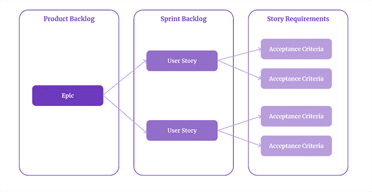
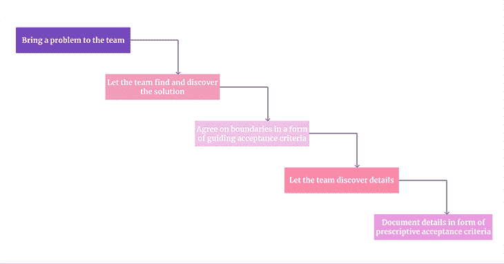
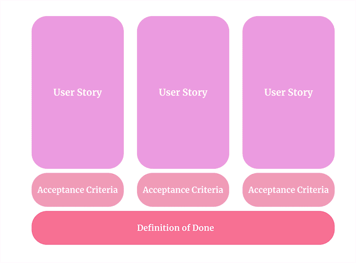

# 如何为你的用户故事编写验收标准

> 原文：<https://blog.logrocket.com/product-management/how-to-write-acceptance-criteria-user-stories/>

几乎每个 PM 和产品待办事项所有者都以这样或那样的方式使用验收标准。他们帮助我们阐明需求，给出方向，并在评审最终工作项目时提供一个清单。

然而，验收标准并不相同。有各种各样的方法可以使用它们。我区分了两种主要的验收标准类型:说明性的和指导性的。

让我们更深入地了解如何使用它们来构建更好的产品。

* * *

## *向前跳转*

* * *

## 说明性验收标准

当有人提到验收标准时，他们通常指的是规定的验收标准。

你可以从两方面考虑它们:

*   它们作为一个详细的需求列表
*   您可以将它们作为分成更小部分的用户故事

## 说明性验收标准示例

让我们看一个说明性验收标准的例子。

**故事:**转移积分

**验收标准:**

*   主 CTA 按钮，在主页上有文字说明**转移点**。
*   当用户点击按钮时，他们会看到一个**积分转移**模式，包括:
    *   朋友下拉列表(必填)
    *   一个**添加好友**按钮。
    *   点数字段(必填)
    *   一个**发送**按钮
    *   一个**取消**按钮
*   用户从下拉列表中选择一个朋友
*   用户可以在字段中输入 100 到 1000 分
*   如果他们没有足够的点，显示一个错误模式
*   如果他们输入太少或太多的点，显示一个错误模式
*   当他们点击**发送**时，验证所有字段是否正确
    *   如果没有，抛出一个标准验证错误
    *   如果是，显示另一个**你确定吗？**莫代尔
    *   点击**是**完成传送。
        *   点击**否**将用户移回积分转移模式
    *   完成转账后，将交易添加到发送方和接收方的历史记录中，标题为:**积分转账:{amount}从{userID}到{userID}**

## 说明性验收标准的目的

在产品开发工作中使用验收标准有很多原因。最常见的包括:

### 管理期望

验收标准有助于管理 PM 和产品团队以及团队和利益相关者之间的期望。

它们精确地定义了给定特性的工作方式。如果你的“我想登录”用户故事在接受标准中有一个“用谷歌登录”选项，那就建立了一个明确的预期，用户将能够用谷歌登录，但也许不一定用脸书。

良好的验收标准不会留下误解的余地。

### 管理范围

谁从来没有为了赶上最后期限而不得不缩小范围？扔块石头。

验收标准有助于项目经理进行范围界定活动，包括从计划中添加和删除范围。毕竟，您可能无法删除“我想登录”的用户故事，但是您可以去掉花哨的接受标准，留下最基本的内容。

验收标准帮助您以更精细的方式管理范围。

### 作为估计的基础

评估对象越模糊，评估就越模糊。验收标准提供了非常需要的细节，使开发评估更加精确。毕竟，根据登录过程的具体细节，人们可能会花一个小时或一周的时间来完成“我想登录”的故事。

### 作为测试计划的输入

当 QA 团队准备测试用例时，验收标准是有价值的输入。有了正确编写的验收标准，他们就确切地知道要测试什么以及给定的功能应该如何工作。否则，他们可能需要问团队，“这是一个 bug 还是一个特性？”一直在问问题。

## 指导性验收标准

在产品团队成熟度的某一水平上，对解决方案的详细描述不仅是不必要的，而且往往非常有限。

在这种情况下，以高层次、一般目标的形式编写验收标准可能更明智。

这一切都是为了给团队一个高层次的方向，让他们解决剩下的问题。

## 指导性验收标准示例

**故事:**转移积分

**验收标准:**

*   一个用户应该能够转移到一个朋友的帐户高达 1000 点
*   这个过程应该很简单，而且对 UX 友好
*   不要过于复杂。让我们试着在一次冲刺中获得 MVP
*   包括防止意外点数转移的机制
*   记录并保存所有转移

这样的描述给出了足够的细节来为计划提供边界，同时给予团队定义确切细节的所有权。最终，产品团队最有能力决定实际的解决方案，产品经理应该尽我们所能授权他们这样做。

## 结合指导性和规范性验收标准

不同类型的验收标准对产品团队有不同的用途。

指导性验收标准作为一种高层次的边界非常有效。将问题带给团队，让他们发现潜在的解决方案，一旦您决定了方向，就根据业务需求和约束为解决方案设定边界。

* * *

订阅我们的产品管理简讯
将此类文章发送到您的收件箱

* * *

然后，当团队定义解决方案的细节时(有时咨询产品经理，有时自主地)，让他们编写更详细的、说明性的验收标准，这将帮助他们[管理期望和范围](https://blog.logrocket.com/product-management/what-is-feature-creep-how-to-avoid/)。

最终，它不是指导性或规范性的验收标准。在解决方案开发的不同阶段，它们都有不同的用途。

## 验收标准与完成的定义

一个常见的困惑是接受标准和完成的定义之间的差异。

虽然它们服务于相似的目的，但是有一个很大的不同。[完成的定义由所有用户故事](https://blog.logrocket.com/product-management/what-is-definition-of-done-agile-examples/)共享，而接受标准是特定于故事的。

> 完成的定义由所有用户故事共享，而接受标准是特定于故事的。

此外，验收标准通常作为开发清单，而完成的定义作为整体过程清单。

换句话说，接受标准包括应该作为功能的一部分构建的东西，例如“用谷歌登录”和“用电子邮件给我发送一个神奇的链接”功能。

同时，done 的定义描述了用户故事的整个旅程(比如开发、测试、编写文档、执行压力测试，以及任何属于 done 定义的部分)。

只有当接受标准和完成的定义都满足时，故事才是完整的。

## 结论

有两种类型的验收标准。

指导性验收标准作为产品团队的高级方向和边界。说明性的验收标准作为一个更详细的检查清单，帮助管理期望和范围，估计票，并计划测试用例。

不太成熟的团队通常会收到带有一组预定义的验收标准的需求。然而，一旦团队成熟，他们会根据他们正在解决的问题和高层次的指导性验收标准来编写他们自己的验收标准。

虽然验收标准在概念上类似于 done 的定义，而前者与特定故事的形状有关，后者定义了每个用户故事作为开发过程的一部分应该经历的旅程。

*精选图片来源:[icon scout](https://iconscout.com/icon/checklist-1627460)*

## [LogRocket](https://lp.logrocket.com/blg/pm-signup) 产生产品见解，从而导致有意义的行动

[LogRocket](https://lp.logrocket.com/blg/pm-signup) 确定用户体验中的摩擦点，以便您能够做出明智的产品和设计变更决策，从而实现您的目标。

使用 LogRocket，您可以[了解影响您产品的问题的范围](https://logrocket.com/for/analytics-for-web-applications)，并优先考虑需要做出的更改。LogRocket 简化了工作流程，允许工程和设计团队使用与您相同的[数据进行工作](https://logrocket.com/for/web-analytics-solutions)，消除了对需要做什么的困惑。

让你的团队步调一致——今天就试试 [LogRocket](https://lp.logrocket.com/blg/pm-signup) 。

[Bart Krawczyk Follow](https://blog.logrocket.com/author/bartkrawczyk/) Learning how to build beautiful products without burning myself out (again). Writing about what I discovered along the way.