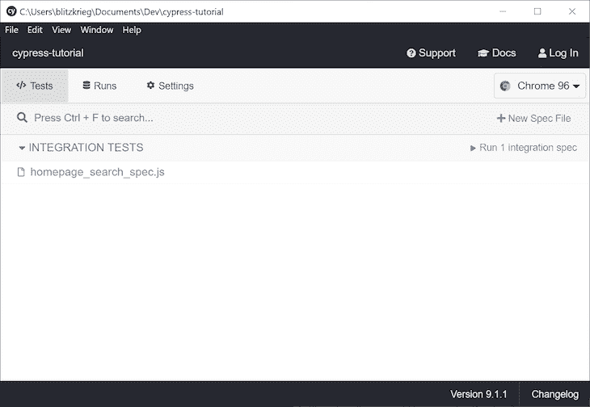
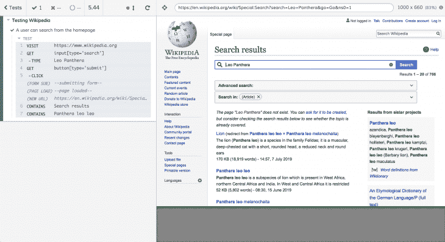
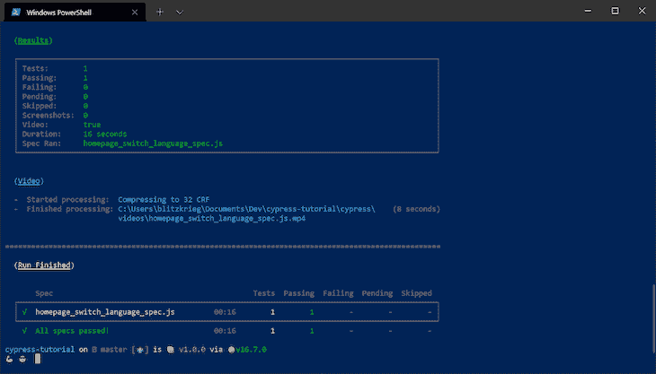
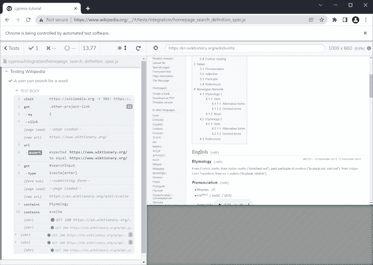

# 如何用 Cypress 和 Node.js 编写端到端的测试

> 原文：<https://blog.logrocket.com/how-to-write-end-to-end-tests-cypress-nodejs/>

***编者按*** :本教程最后一次更新是在 2022 年 3 月 1 日，以反映 Node.js 和 Cypress 的更新版本。

编写大规模的应用程序会很快变得复杂，而且随着团队的成长和更多的人在同一个代码库上工作，这个问题只会变得更加严重。因此，测试是软件工程的一个重要方面，并且在前端开发中更为重要。有了这么多可移动的部分，单独编写单元和功能测试可能不足以验证应用程序的正确性。

例如，对于单元测试，您不能真正验证特定的用户流不会引起问题。在这种情况下，[端到端(E2E)测试](https://blog.logrocket.com/react-native-end-to-end-testing-detox/)就派上了用场，允许您在应用程序上复制用户行为，并验证一切都正常工作。如果您正在编写生产级的 web 应用程序，编写 E2E 测试是显而易见的。

在本文中，我们将看看如何使用 [Cypress](https://www.cypress.io/) 在前端编写有用的 E2E 测试。虽然还有[其他 E2E 测试工具，如 Selenium](https://blog.logrocket.com/cypress-io-the-selenium-killer/) 和 [Nightwatch.js](https://nightwatchjs.org/) ，但我们将重点放在 Cypress 上，因为它有一套功能，包括测试中的时间旅行、记录测试供以后回放等等。

为了跟随本教程，您需要安装 Node.js 和 [npm](https://www.npmjs.com/get-npm) 的[最新版本。你可以在 GitHub](https://nodejs.org/en/) 上获得本教程使用的[全部源代码。我们开始吧！](https://github.com/finallyayo/cypress-tutorial)

### 目录

## 树立柏树

首先，我们将创建一个新项目并设置 Cypress。通过运行以下命令初始化新项目:

```
$ mkdir cypress-tutorial
$ cd cypress-tutorial
$ npm init -y

```

接下来，安装 [Cypress 包](https://www.npmjs.com/package/cypress)作为开发依赖:

```
$ npm install --save-dev cypress

```

打开项目根目录中的`package.json`文件，并将`scripts`属性更新为以下内容:

```
"scripts": {
    "test": "npx cypress run",
    "cypress:open": "npx cypress open"
  },

```

保存并关闭这个文件，然后在你的项目的根文件夹中，创建一个名为`cypress.json`的文件，这是一个[配置文件](https://docs.cypress.io/guides/references/configuration#cypress-json)，在这里你可以为这个特定的项目定制 Cypress 的行为。将以下代码添加到文件中并保存:

```
{ "chromeWebSecurity": false }

```

我们将在教程的后面详细研究上面的命令。

## 编写 Cypress 端到端测试

对于我们这些遵循[敏捷方法](https://blog.logrocket.com/four-agile-manifesto-values-explained/)的人来说，用户故事通常遵循类似如下的格式:

```
"When a user takes a specific action, then the user should see this."

```

为了确定如何为这个特定的故事编写一个 E2E 测试，您将通过测试模拟采取用户应该采取的行动，然后断言最终的应用程序状态符合您的期望。测试前端应用程序时，该过程通常可以分为以下几个步骤:

1.  访问应用程序中的页面
2.  查询该页面上的元素，如按钮、下拉列表等。
3.  与元素交互，即点击按钮、拖动 div 或填充输入等。
4.  确认交互后的新状态是正确的

我们将编写三个测试来断言我们可以通过模仿用户的动作在 [Wikipedia](https://wikipedia.org/) 上执行某些动作。对于每个测试，我们将在编写实际测试之前编写一个用户故事。

虽然为了这个教程，我们在一个公共网站上使用 Cypress，但它并不意味着在你不拥有的网站上使用。

在我们开始编写测试之前，您需要创建一个特殊的文件夹来保存您的 Cypress 测试。在项目的根目录中，运行以下命令:

```
$ mkdir cypress && cd cypress
$ mkdir integration && cd integration

```

我们所有的测试都将被放在`cypress/integration`文件夹中，默认情况下，Cypress 试图在这个文件夹中定位测试。您可以使用 [`integrationFolder`配置选项](https://docs.cypress.io/guides/references/configuration#Folders-Files)来更改测试文件的位置。

## 测试一:用户在主页上进行搜索

当用户访问主页，在搜索框中键入内容，并点击**搜索**图标时，用户应该会看到一个新页面，其中填充了他们的搜索词的结果。

这个例子的用户故事非常简单，简单地断言一个假设的用户在主页上的搜索动作的正确行为。让我们为它编写测试。

在`cypress/integration`文件夹中，创建一个名为`homepage_search_spec.js`的新测试文件，并在您喜欢的文本编辑器中打开它:

```
describe('Testing Wikipedia', () => {
  it('I can search for content', () => {
    cy.visit('https://www.wikipedia.org');
    cy.get("input[type='search']").type('Leo Panthera');
    cy.get("button[type='submit']").click();
    cy.contains('Search results');
    cy.contains('Panthera leo leo');
  });
});

```

让我们检查一下测试，看看它与我们之前定义的用户情景是如何匹配的。

*   第三行:访问你应用程序的一个页面
*   第四行:查询页面上一个元素并与之交互
*   第五行:查询页面上的一个元素并与之交互
*   第六行:确认交互后的新状态是正确的
*   第七行:确认交互后的新状态是正确的

你的大多数 E2E 测试将遵循上述格式。你不需要关心应用程序如何在后台执行这些操作，相反，你真正需要做的是指定应该执行的操作。简单明了的 Cypress 语法使得非程序员也能轻松阅读和理解您的测试。

现在，让我们继续进行测试。回到你的终端，运行`npm test`命令。Cypress 将查看`cypress/integration`文件夹并在那里运行所有的测试:


您的终端不是运行测试的唯一方式。或者，您可以在浏览器中运行它们，当 Cypress 根据您的规范执行测试时，您将获得测试过程的实时视图。

在您的终端中，运行以下命令:

```
npm run cypress:open

```

应该会弹出一个如下图所示的窗口:



要运行您的测试，单击`homepage_search_spec.js`条目，您应该会看到另一个窗口弹出:



在窗口的左上角，您可以快速查看您的测试套件中有多少通过和失败的测试。窗口的右侧显示了如果用户按照您在测试中指定的方式与您的应用程序进行交互，他们会看到什么。

通过这个简单的测试，我们已经能够断言维基百科上的搜索功能已经满足了我们假设的用户故事需求。

## 测试二:用户在主页上切换语言

当用户访问主页，点击语言切换器，并选择一种新的语言时，他们应该被重定向到所选语言的相应域。

在`cypress/integration`文件夹中，创建一个名为`homepage_switch_language_spec.js`的新文件，在文本编辑器中打开它，并将以下代码添加到该文件中:

```
describe('Testing Wikipedia', () => {
  it('A user can switch languages', () => {
    cy.visit('https://wikipedia.org');
    cy.contains('Read Wikipedia in your language');
    cy.get('#js-lang-list-button').click();
    cy.contains('Yorùbá').click();
    cy.url().should(
      'equal',
      'https://yo.wikipedia.org/wiki/Oj%C3%BAew%C3%A9_%C3%80k%E1%BB%8D%CC%81k%E1%BB%8D%CC%81',
    );
    cy.contains('Ẹ kú àbọ̀');
  });
});

```

让我们讨论一些 Cypress 特有的语法。在第三行，我们已经指示 Cypress 访问维基百科的主页。在第四行，我们通过确认页面包含文本`Read Wikipedia in your language`来断言我们在我们想要的页面上。

在第五行，我们通过 ID 查询语言切换器按钮，并在其上模拟一个点击动作。你可以通过在 Chrome 开发者工具中检查来找出元素的 ID。这让我想到了编写 Cypress 测试的一个重要概念；有多种方法可以在 Cypress 上选择 DOM 元素，例如，通过定位它的 ID、类，甚至它的标签类型。

在这个特定的测试中，我们的目标是按钮的 ID，但是在之前的测试中，我们的目标是标签名称和属性。一定要查看官方的 Cypress 文档，探索选择 DOM 元素的不同方法。

在第六行，我们遇到了另一个常见的 Cypress 命令，您会注意到它在测试中出现了很多次。我们断言在 DOM 上有一个文本为`Yorùbá`的元素，然后我们模拟点击它。

此操作将导致 Wikipedia 将您重定向到所选语言的相应域。在我们的例子中，我们选择了西非的 yorbá语言，通过查看当前页面的 URL，我们可以确认我们被重定向到了正确的页面。

在第七行，我们就是这样做的。通过调用`cy.url()`，我们以文本形式获取当前页面的 URL，然后断言它应该等于 Yorù bá语言的适当域。在第八行，我们有一个额外的可选检查来查看页面上是否有 yorbá语言的内容。

> 额外的事实:ẹ·库·àbọ̀在约鲁巴语中的意思是“欢迎”，发音为 eh–koo–ahbuh。

当您使用下面的命令运行测试时，它应该会通过。如前所述，`--spec`选项用于运行一个特定的 Cypress 测试，而不是运行所有的测试:

```
$ npm test -- --spec .\cypress\integration\homepage_switch_language_spec.js

```



## 测试三:用户在维基词典上查看一个词的定义

当用户访问主页并点击维基百科的链接时，用户应该被重定向到[wiktionary.org](https://www.wiktionary.org)。当 wiktionary.org 上的用户通过在搜索栏中键入并点击 **enter** 来搜索一个定义时，用户应该被重定向到一个带有该搜索词定义的页面。

让我们回顾另一个简单的用户故事。例如，假设我们想在 Wiktionary 上检查单词“svelte”的定义。在搜索这个词之前，我们先从维基百科的主页开始，导航到维基词典。

在`cypress/integration`文件夹中，创建一个名为`homepage_search_definition_spec.js`的新文件，打开它，并粘贴以下代码:

```
describe('Testing Wikipedia', () => {
  it('A user can search for a word', () => {
    cy.visit('https://wikipedia.org');
    cy.get('.other-project-link')
      .eq(2)
      .click();
    cy.url().should('equal', 'https://www.wiktionary.org/');
    cy.get('#searchInput').type('Svelte{enter}');
    cy.contains('Etymology');
    cy.contains('svelte');
  });
});

```

让我们像之前一样完成这个测试。在第三行，我们像往常一样访问维基百科的主页。在第四行，我们以一个类名为目标，选择该类的第三个元素，并模拟单击该元素。不要忘记索引从`0`开始。

在我们继续前进之前，你应该小心一点警告；如果您的代码依赖于自动生成的 CSS 类，通过类名定位元素可能会导致不一致的测试结果。在这种情况下，通过 ID 或标签类型和属性来定位将是一种方法。

在第七行，我们通过使用`cy.url()`检查 URL 来断言我们在正确的域上。另一个需要记住的警告是:如果你正在测试你自己的应用，导航到另一个领域的需求可能很少。出于这个原因，如果我们不在我们的`cypress.json`配置中添加`"chromeWebSecurity": false`，这个测试就会失败。

在第八行，我们通过 ID 定位搜索输入。然后，我们通过输入“svelte”并点击由`{enter}`处理的**输入**按钮来模拟一个变更事件。此操作将我们带到一个新页面，显示我们的查询结果。

在第九行和第十行，我们通过断言“词源”和“苗条”可以在页面上找到来确认我们在正确的页面上。使用下面的命令或浏览器运行测试，查看您的新技能:

```
$ npm test -- --spec .\cypress\integration\homepage_search_definition_spec.js

```



## 结论

在本教程中，您已经看到了通过使用 Cypress 编写 E2E 测试来验证 web 应用程序的正确性是多么容易。

请记住，我们对 Cypress 的功能和它提供的一些特性还只是皮毛。例如，您甚至可以通过在`cypress/videos`下查找来查看您的测试截图和观看录制的视频。您可以定义自定义命令来避免代码重复，使用 fixtures 模拟 API 响应数据，等等。

编写良好的端到端测试可以节省您几个小时的开发时间，帮助您在融入生产环境之前发现错误和意外行为。

从浏览 Cypress 文档开始，一直玩到你可以开始编写现场测试为止。我希望你喜欢这篇文章，并快乐编码！

## 使用 [LogRocket](https://lp.logrocket.com/blg/signup) 消除传统错误报告的干扰

[](https://lp.logrocket.com/blg/signup)

[LogRocket](https://lp.logrocket.com/blg/signup) 是一个数字体验分析解决方案，它可以保护您免受数百个假阳性错误警报的影响，只针对几个真正重要的项目。LogRocket 会告诉您应用程序中实际影响用户的最具影响力的 bug 和 UX 问题。

然后，使用具有深层技术遥测的会话重放来确切地查看用户看到了什么以及是什么导致了问题，就像你在他们身后看一样。

LogRocket 自动聚合客户端错误、JS 异常、前端性能指标和用户交互。然后 LogRocket 使用机器学习来告诉你哪些问题正在影响大多数用户，并提供你需要修复它的上下文。

关注重要的 bug—[今天就试试 LogRocket】。](https://lp.logrocket.com/blg/signup-issue-free)

## 200 只显示器出现故障，生产中网络请求缓慢

部署基于节点的 web 应用程序或网站是容易的部分。确保您的节点实例继续为您的应用程序提供资源是事情变得更加困难的地方。如果您对确保对后端或第三方服务的请求成功感兴趣，

[try LogRocket](https://lp.logrocket.com/blg/node-signup)

.

[](https://lp.logrocket.com/blg/node-signup)[https://logrocket.com/signup/](https://lp.logrocket.com/blg/node-signup)

LogRocket 就像是网络和移动应用程序的 DVR，记录下用户与你的应用程序交互时发生的一切。您可以汇总并报告有问题的网络请求，以快速了解根本原因，而不是猜测问题发生的原因。

LogRocket 检测您的应用程序以记录基线性能计时，如页面加载时间、到达第一个字节的时间、慢速网络请求，还记录 Redux、NgRx 和 Vuex 操作/状态。

[Start monitoring for free](https://lp.logrocket.com/blg/node-signup)

.