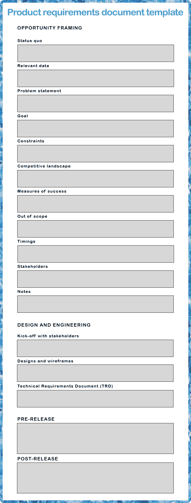

# 如何编写简化的产品需求文档

> 原文：<https://blog.logrocket.com/product-management/how-to-write-product-requirements-documents-prds/>

在本指南中，我们将解释为什么您需要一个产品需求文档(PRD)来使您的团队在问题陈述、KPI 和交付产品或功能的其他标准上保持一致。

我们还将分解典型产品需求文档的内容，并提供一个实际例子，您可以[在概述您自己的产品需求文档](https://blog.logrocket.com/wp-content/uploads/2022/06/product-requirements-document-template-pdf.pdf)时将其用作模板。

* * *

## 目录

* * *

## 什么是产品需求文档(PRD)？

产品需求文档，顾名思义，是概述产品需求的文档。自引用定义不是最有帮助的，所以让我们对它进行一点限定，并在需要的地方给出上下文。

在珠三角地区，我们所说的“产品”通常是指数码产品。通常，我们指的只是数字产品的一部分(一项改进、一个特性或一组特性)。对于“要求”，我们不仅指你通常会在吉拉门票中找到的验收标准，还指其他元素，如问题陈述、成功的衡量标准或走向市场的战略。

## 产品需求文档的用途是什么？

首先，产品需求文档可以作为利益相关者和技术团队的事实来源。事实上，如果做得正确，它们可以在整个产品开发过程中使用，并作为随之而来的项目管理的支柱。

通俗地说，您将使用 PRD 来帮助您围绕产品组织所有信息，使其更易于解释和理解。

拥有一个构建良好的 PRD 的另一个有价值的结果是，[产品经理](https://blog.logrocket.com/what-does-a-product-manager-do-role-responsibilities-best-practices/)作为负责确保团队工作在影响最大的主题上的人，将更容易决定 PRD 中描述的问题是否真正带来最高价值。

## 产品需求文档包含哪些元素？

从广义上讲，产品需求文档有三个部分:

*   **机会框定与评估** —这个问题值得解决吗？
*   **设计、技术发现和规格** —我们如何解决这个问题？
*   **发布和发布后分析** —我们如何发布解决方案，何时以及如何检查它是否按预期工作？

让我们更详细地放大这三个元素。

### 机会框架

在产品发现的第一阶段，您需要与您的团队和利益相关者就一些事情达成一致:

*   你想解决什么问题，针对什么用户？
*   关于那个问题，你的产品的当前状态是什么？
*   你的竞争对手是如何解决这个问题的？
*   你有什么定性和定量的数据来支持这个问题值得解决？
*   如果你很好地解决了问题，你期望移动什么业务度量？

拥有一份明确陈述所有这些问题的答案的文件是从每个相关人员那里获得清晰性和一致性(以及认同)的好方法。作为一种工具，它也将被证明是非常宝贵的，以决定各种计划中哪一个是当前最有价值的。

### 设计和技术规格

一旦您决定问题空间足够有趣(这绝不是一项无足轻重的任务)，您就可以开始进入下一个发现阶段，并在 PRD 中跟踪它们:

*   您想运行哪组测试？
*   您计划测试哪些解决方案(设计)？
*   这些测试的结果如何？
*   你为什么优先考虑一个解决方案？

在设计阶段，当你和你的团队一起工作时，这些问题会逐渐得到解答。这里要包括的具体步骤很大程度上取决于您正在开发的产品的类型。更多的技术产品可能需要更少的可用性测试和更多的技术验证，而依赖 UX 的面向消费者的产品应该包括几组可用性测试，以在被认为可以开发之前验证设计。

作为一条经验法则，我通常建议产品设计师为他们试图解决的问题想出至少两个解决方案，并互相测试这两个解决方案。然后，您可以消除“失败的”设计(在提取了它所具有的任何好的元素之后)，并运行另一系列测试来继续改进。

你应该运行的可用性测试轮数也取决于许多因素:

*   你有多少时间？
*   你有什么资源？
*   您正在尝试的设计解决方案有多复杂和不同？

根据我的经验，最有效的最佳时机是跑三轮。首先，与同事进行快速的内部测试，然后进行两轮后续测试，其间有足够的时间来修复任何表面。这个过程应该记录在产品需求文档中。

团队在进行设计探索的同时，还应该定义技术需求。在某些情况下，这些需求会有一个单独的文档，称为[技术需求文档(TRD)](https://technicalwriterhq.com/technical-requirement-document/) 。

我不会对 TRD 需要什么做太多的详细说明，因为我不是工程师，也因为它会根据你正在工作的产品而有很大的不同。要深入了解，请查看产品管理大师 Josh Fechter 的视频:

[https://www.youtube.com/embed/BuBDAtcJ044](https://www.youtube.com/embed/BuBDAtcJ044)

视频

简而言之，对开发商来说，TRD 应该相当于珠三角。文档应该为开发团队提供背景知识和一个达成一致的方法来构建解决方案的技术部分。这也包括该技术将如何实现设计者一直致力于的解决方案。TRD 应该被包括在内，或者至少与珠江三角洲相联系。

需要强调的是，设计和技术解决方案方面的工作应该与产品设计师和开发人员密切合作，并行进行。你决定测试的每一个解决方案都应该在技术上是可行的，而确定这一点的唯一方法是定期让开发人员参与进来，鼓励他们参与可用性测试。

所使用的技术方法也是如此。不同的方法会有不同的限制，设计师应该知道。因此，虽然设计和技术要求可能出现在 PRD 的不同部分，但它们的定义应该并行进行，而不是按顺序进行。

### 发布和验证

产品需求文档的最后一部分处理应该采取什么措施来确保特性或产品的发布尽可能成功。到目前为止，这是根据您正在开发的产品类型变化最大的部分。

例如，B2B SaaS 企业产品应该更加重视安全措施，以及如何通知和培训他们现有的客户。因此，主要的利益相关者将是客户成功经理。另一方面，B2C 产品往往更关注如何利用新功能来获取或保留用户，这意味着主要的利益相关者将是营销部门。

如果你是一家公司的新员工，或者相对来说是一个产品的新手，我能提供的最好的建议是问你的利益相关者和同事，我们过去是如何管理发布过程的？哪些进展顺利，哪些进展不顺利？产品管理需要边做边学，所以不要害怕犯错。

PRD 的最后一部分应该概述何时以及如何检查发布后特性的成功。您可能会问的问题包括:

*   您将衡量哪些指标？
*   你多久检查一次？
*   预期的影响是什么？
*   有哪些潜在的快速跟进？

这取决于您计划如何管理发布(分阶段发布、一次发布、首先向选定的客户发布等)。)，您将不得不选择不同的检查点，但最常见的方法是在发布后一周、一个月和三个月进行检查。这不是绝对必要的，但是您也可以在 PRD 中记录这些检查点的结果。“完成的”PRD 现在将作为文档，因此直接包括该特性或计划在那里的表现是有意义的。

* * *

订阅我们的产品管理简讯
将此类文章发送到您的收件箱

* * *

## 产品需求文档(PRD)模板

这里描述的 PRD 结构是我自己的风格，我总是根据我工作的产品和公司，以及同事和利益相关者的意见和想法来更新它。您可以使用我的产品需求文档模板作为构建您自己的框架，但是如果对您有意义，请不要犹豫删除或添加部分。

***如需可编辑的 PDF 版本产品需求文档(PRD)模板，[点击此处](https://blog.logrocket.com/wp-content/uploads/2022/06/product-requirements-document-template-pdf.pdf)。***

## 最终注释

产品需求文档的主要目的是简化产品经理的工作。它旨在使挑选最有价值的计划变得更容易，向利益相关者解释它并让每个人都同意，并定义如何解决它并将其记录在案。

把这些结果作为你的北极星，用它们来创造你自己的珠三角风格。

*精选图片来源:[icon scout](https://iconscout.com/icon/file-3250251)*

## [LogRocket](https://lp.logrocket.com/blg/pm-signup) 产生产品见解，从而导致有意义的行动

[LogRocket](https://lp.logrocket.com/blg/pm-signup) 确定用户体验中的摩擦点，以便您能够做出明智的产品和设计变更决策，从而实现您的目标。

使用 LogRocket，您可以[了解影响您产品的问题的范围](https://logrocket.com/for/analytics-for-web-applications)，并优先考虑需要做出的更改。LogRocket 简化了工作流程，允许工程和设计团队使用与您相同的[数据进行工作](https://logrocket.com/for/web-analytics-solutions)，消除了对需要做什么的困惑。

让你的团队步调一致——今天就试试 [LogRocket](https://lp.logrocket.com/blg/pm-signup) 。

[Jorge Rodriguez-Ramos Follow](https://blog.logrocket.com/author/jorgerodriguezramos/) Product manager with a keen interest in both machines and humans. Born and raised in Spain and adopted by Berlin and its startup scene. I appreciate honesty, empathy, and logic when interacting with both colleagues and end users and try my best to return the same back.