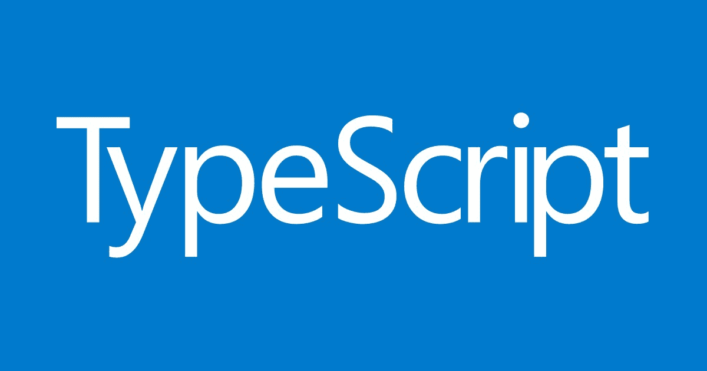
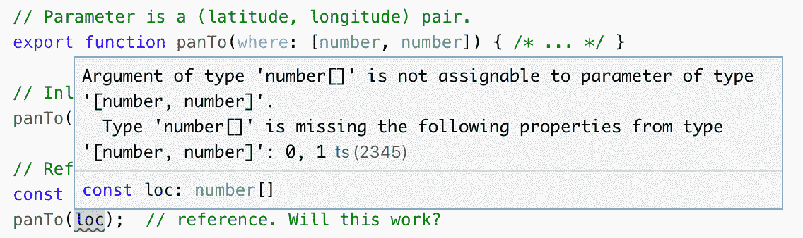
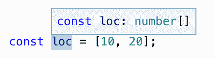
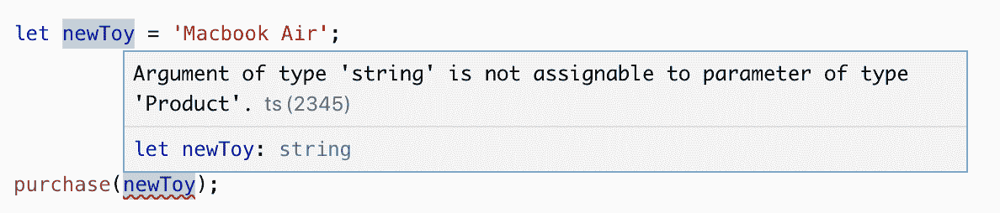
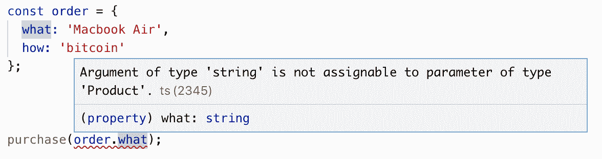
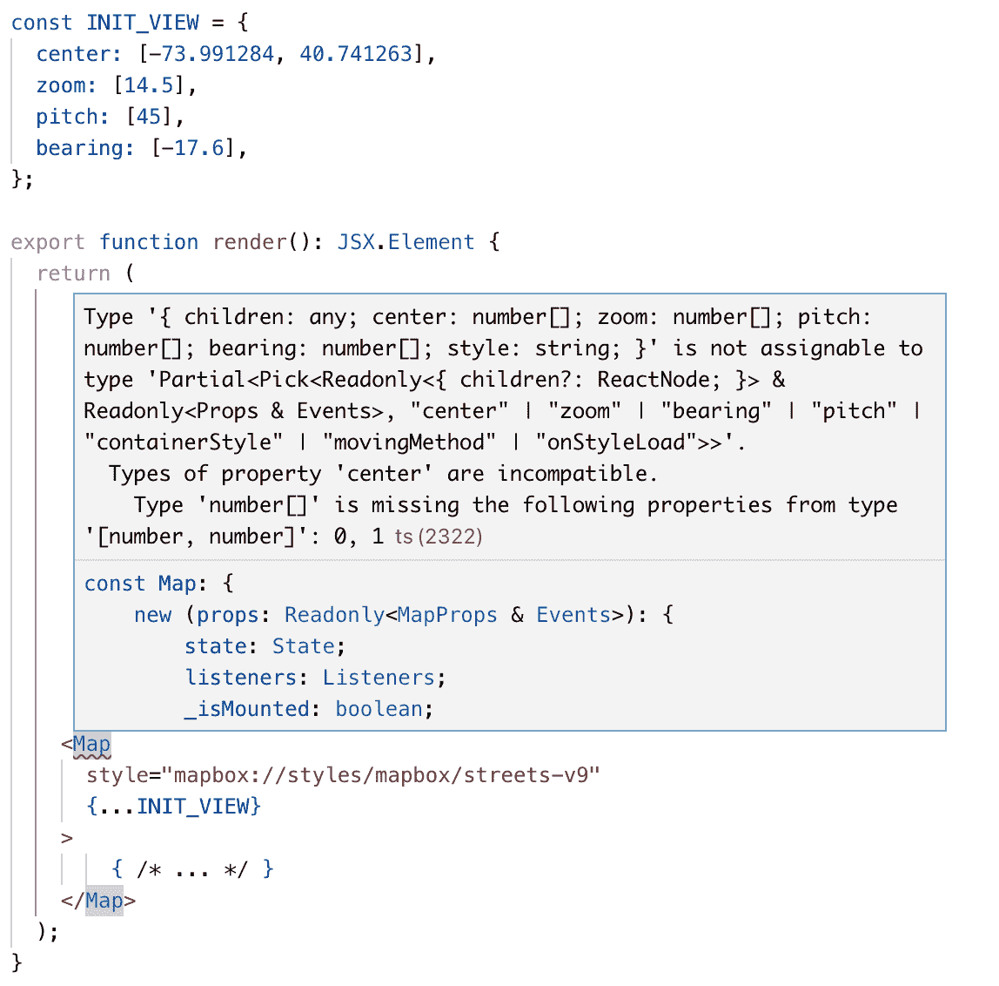

# TypeScript 如何打破引用透明性

> 原文：<https://blog.logrocket.com/how-typescript-breaks-referential-transparency-7a82c0345f2c/>



您是否曾经在 TypeScript 中分解出一个常量，却让类型检查器开始报告一些神秘的错误？这有一个根本原因。在这篇文章中，我将展示这个问题的几个例子，解释它为什么会发生，并提出一些可能的解决方法。

### JavaScript 中的引用透明性

假设我们有一个函数`purchase`，它为我们购买了一件产品:

```
function purchase(product) { /* ... */ }
purchase('Macbook Air');
```

我们称之为“内嵌表单”在 JavaScript 中，您可以将内联参数分解到一个变量中，并传递一个引用，而无需更改代码的行为:

```
const product = 'Macbook Air';
purchase(product);  // reference form
```

这有时被称为参照透明性或替代原则。它指的是你可以用它的值替换一个表达式而不改变行为的思想。这与代码没有副作用密切相关，并且有助于对程序正确性的推理。

只要不改变求值的顺序，在 JavaScript 中以这种方式分解变量应该不会改变表达式的结果。

### 类型脚本中的引用透明性

在 JavaScript 中分解变量是可行的，但是在 TypeScript 中呢？

```
export function purchase(what: string) { /* ... */ }

purchase('Macbook Air');  // Inline

const product = 'Macbook Air';
purchase(product);  // reference
```

到目前为止一切顺利！

现在让我们把它变得更复杂一点，假设我们正在使用地图可视化，它允许我们以编程方式平移地图:

```
// Parameter is a (latitude, longitude) pair.
function panTo(where: [number, number]) { /* ... */ }

// Inline:
panTo([10, 20]);  // inline: ok

// Reference:
const loc = [10, 20];
panTo(loc);  // reference. Will this work?
```

如果你在 [TypeScript playground](http://www.typescriptlang.org/play/#src=export%20function%20panTo%28where%3A%20%5Bnumber%2C%20number%5D%29%20%7B%20%7D%0D%0A%0D%0Aconst%20loc%20%3D%20%5B10%2C%2020%5D%3B%0D%0ApanTo%28loc%29%3B%0D%0A) 中运行这个，你会得到一个错误:



相关部分是这样的:

```
Argument of type ‘number[]’ is not assignable to parameter of type '[number, number]'.
```

你可以将鼠标放在[打字稿游戏场](http://www.typescriptlang.org/play/#src=export%20function%20panTo%28where%3A%20%5Bnumber%2C%20number%5D%29%20%7B%20%7D%0D%0A%0D%0Aconst%20loc%20%3D%20%5B10%2C%2020%5D%3B%0D%0ApanTo%28loc%29%3B%0D%0A)的`loc`符号上，以便更清楚地了解正在发生的事情:



TypeScript 已经将`loc`的类型推断为`number[]`，即长度未知的数字数组。当这被传递给`panTo`时，TypeScript 检查`number[]`(一个数字数组)是否可赋给`[number, number]`(一对数字)。这不是因为有些数组没有两个元素。因此出现了错误。

为什么 TypeScript 推断类型为`number[]`而不是`[number, number]`？因为这是有效的 JavaScript:

```
const loc = [10, 20];
loc.push(30);
```

换句话说，JavaScript 中的`const`并不深奥。您不能重新分配`loc`，但可以修改它。一些语言(例如 C++)允许你对精确的常量深度建模，但是 JavaScript 和 TypeScript [不允许。](https://github.com/Microsoft/TypeScript/issues/26979)

那么如何解决这个问题呢？一种简单的方法是在代码中加入`any`类型，以有效地消除警告:

```
const loc: any = [10, 20];
panTo(loc);
const loc = [10, 20];
panTo(loc as any);
```

如果您打算这样做，后一种形式更可取，因为`any`的作用域是函数调用，不会阻止对代码中其他地方的`loc`使用进行类型检查。

更好的解决方案是准确地告诉 TypeScript 您的意思:

```
const loc: [number, number] = [10, 20];
panTo(loc);
```

这有点冗长，但就类型安全而言，这是最好的解决方案。

### 推理和字符串类型

前面的例子表明，引用透明性可以打破元组类型。但这并不是唯一可能出现的情况。

让我们从帖子的开头重新回顾一下购买示例。让我们使用字符串文字类型的联合来细化允许您购买的产品类型:

```
type Product = 'iPad' | 'Mac Mini' | 'Macbook Air' | 'Macbook Pro';
export function purchase(what: Product) {
 // mine bitcoin…
 // send to apple…
}
```

购买内联表达式和通过引用购买都有效:

```
purchase('Macbook Air');
const newToy = 'Macbook Air';
purchase(newToy);  // ok
```

然而，如果我们使用`let`而不是`const`，TypeScript 会抱怨:



错误在于`Argument of type ‘string’ is not assignable to parameter of type ‘Product’`。使用`let`告诉 TypeScript 我们希望允许`newToy`被重新分配。TypeScript 不知道我们希望为`newToy`允许的可能值的域，所以它猜测`string`。当我们使用`const`时，它不能被重新分配，因此 TypeScript 可以推断出更窄的字符串文字类型`"Macbook Air"`。

和以前一样，解决方案是告诉 TypeScript 我们的意思:

```
let newToy: Product = 'Macbook Air';
purchase(newToy); // ok
```

因为`const`很肤浅，它不是解决这类问题的灵丹妙药。当推断对象中属性的类型时，仍然会出现这种情况。例如:



和之前一样，错误在于`'string' is not assignable to type 'Product'`。这是因为`what`的类型被推断为`string`以允许这种模式:

```
const order = {
  what: 'Macbook Air',
  how: 'bitcoin'
};
order.what = 'Lenovo'; // valid
```

和以前一样，解决方案是告诉 TypeScript 您的意思。一种方法是使用类型转换:

```
const order = {
  what: 'Macbook Air' as Product, // or "as 'MacbookAir'"
  how: 'bitcoin'
};
purchase(order.what); // ok
```

另一种是通过定义一个`Order`接口来指定其属性的精确类型:

```
interface Order {
  what: Product;
  how: 'bitcoin' | 'usd';
}
const order: Order = {
  what: 'Macbook Air',
  how: 'bitcoin'
};
purchase(order.what); // ok
```

如果您遇到这样的错误，涉及到对第三方库的调用，那么您最好的办法是在类型声明中找到相关的类型。让我们看一个真实世界的例子。

### 推理和反应

下面是一些 React 代码，它使用 [react-mapbox-gl](https://github.com/alex3165/react-mapbox-gl/) 包装器呈现了一个 [Mapbox GL](https://docs.mapbox.com/mapbox-gl-js/api/) 地图:

```
import * as React from 'react';
import ReactMapboxGl from 'react-mapbox-gl';

const Map = ReactMapboxGl({
  accessToken: '....',
});

export function render(): JSX.Element {
  return (
    <Map
      style="mapbox://styles/mapbox/streets-v9"
      center={[-73.991284, 40.741263]}
      zoom={[14.5]}
      pitch={[45]}
      bearing={[-17.6]}
    >
        { /* ... */ }
    </Map>
  );
}
```

如果我们将初始视口分解成一个常数，我们会得到一个很长的错误:



相关的一点是:

```
Types of property 'center' are incompatible.
 Type 'number[]' is missing the following properties from type '[number, number]': 0, 1
```

`center` prop 应该是`[number, number]`(一对数字)，但是 TypeScript 已经推断出`INIT_VIEW.center`的类型为`number[]`(一个数组)。所以这真的是和以前一样的问题！和以前一样，最好的解决方案是为`INIT_VIEW`指定一个类型。

但是如果你查看 react-mapbox-gl 的[类型，最接近的是`Props`结构，它包含了`INIT_VIEW`中的所有属性，还有一些:](https://github.com/alex3165/react-mapbox-gl/blob/005a7a1d903dd0f7d64035bfc3d3cd30fdafbe7e/src/map.tsx#L45-L61)

```
export interface Props {
  style: string | MapboxGl.Style;
  center?: [number, number];
  zoom?: [number];
  maxBounds?: MapboxGl.LngLatBounds | FitBounds;
  fitBounds?: FitBounds;
  fitBoundsOptions?: FitBoundsOptions;
  bearing?: [number];
  pitch?: [number];
  containerStyle?: React.CSSProperties;
  className?: string;
  movingMethod?: 'jumpTo' | 'easeTo' | 'flyTo';
  animationOptions?: Partial<AnimationOptions>;
  flyToOptions?: Partial<FlyToOptions>;
  children?: JSX.Element | JSX.Element[] | Array<JSX.Element | undefined>;
}
```

所以我们不能只写`const INIT_VIEW: Props`来解决问题，因为我们的常量没有所需的`style`属性。所以我们需要调整类型。最简单的方法是使用`[Partial](https://netbasal.com/getting-to-know-the-partial-type-in-typescript-ecfcfbc87cb6)`，这使得一个类型中的所有属性都是可选的:

```
const INIT_VIEW: Partial<Props> = {
  center: [-73.991284, 40.741263],
  zoom: [14.5],
  pitch: [45],
  bearing: [-17.6],
};

export function render(): JSX.Element {
  return (
    <Map
      style="mapbox://styles/mapbox/streets-v9"
      {...INIT_VIEW}  // ok
    >
        { /* ... */ }
    </Map>
  );
}
```

只要你想提取的所有属性都是可选的，这个技巧就有效。如果我们还想去掉`style`(这是必需的)，那么我们会得到一个错误:`Property 'style' is optional in type …`。通过使用`Partial`，我们已经告诉 TypeScript 忘记我们已经显式设置了`style`。

一种解决方案是使用`[Pick](https://levelup.gitconnected.com/advanced-typescript-types-with-examples-1d144e4eda9e)`提取感兴趣的属性及其类型。与`Partial`不同，这将跟踪我们设置了哪些属性，哪些属性没有设置:

```
const INIT_VIEW: Pick<MapProps, 'center'|'zoom'|'pitch'|'bearing'|'style'> = {
  center: [-73.991284, 40.741263],
  zoom: [14.5],
  pitch: [45],
  bearing: [-17.6],
  style: "mapbox://styles/mapbox/streets-v9"
};
```

不幸的是，我们不得不重复打字中的键。幸运的是，您可以使用 StackOverflow 中的这个[古怪的技巧](https://stackoverflow.com/a/46101222/388951)来定义一个帮助器来为您推断密钥:

```
const inferPick = <V extends {}>() => <K extends keyof V>(x: Pick<V, K>): Pick<V, K> => x;

const INIT_VIEW = inferPick<MapProps>()({
  center: [-73.991284, 40.741263],
  zoom: [14.5],
  pitch: [45],
  bearing: [-17.6],
  style: "mapbox://styles/mapbox/streets-v9"
});
```

包装器是不幸的，但是缺少重复使得这是一个更好的解决方案。任何缩小器都应该能够删除函数调用。

如果常量(ala[style sheet . create in React Native](https://facebook.github.io/react-native/docs/style))有几种可能，那么情况就有点复杂了。您可以尝试一种索引类型:

```
const views: {[viewName: string]: Partial<Props>} = {
 nyc: …,
 sf: …
};
```

这是可行的，但是它会阻止 TypeScript 标记像`views.london`这样的无效引用。您可以使用与上一个类似的技巧来解决这个问题:

```
const inferKeys = <V extends {}>() => <K extends string>(x: Record<K,V>): Record<K,V> => x;

const INIT_VIEW = inferKeys<Partial<MapProps>>()({
  nyc: {
    center: [-73.991284, 40.741263],
    zoom: [14.5],
    pitch: [45],
    bearing: [-17.6],
  },
  sf: {
    center: [-73.991284, 40.741263],
    zoom: [14.5],
    pitch: [45],
    bearing: [-17.6],
  }
});

export function render(): JSX.Element {
  return (
    <Map
      style="mapbox://styles/mapbox/streets-v9"
      {...INIT_VIEW.nyc}  // ok
    >
        { /* ... */ }
    </Map>
  );
}
```

### 结论

当您提取一个常量并遇到一个令人困惑的 TypeScript 错误时，您可能会遇到一个关于类型推断和引用透明性的[问题](https://github.com/Microsoft/TypeScript/issues/27502)。正如我们在这篇文章中看到的，解决方案通常是找到或创建一个可以在作业中使用的类型。有时这很容易，有时却不容易。

这是学习 TypeScript 的一个难点，因为它会产生复杂的错误，涉及 TypeScript 的类型系统的高级元素，以进行简单、有效的代码转换。TypeScript 团队有着为这类问题提出巧妙解决方案的历史，他们正在积极讨论这个问题。敬请关注！

## 使用 LogRocket 消除传统反应错误报告的噪音

[LogRocket](https://lp.logrocket.com/blg/react-signup-issue-free)

是一款 React analytics 解决方案，可保护您免受数百个误报错误警报的影响，只针对少数真正重要的项目。LogRocket 告诉您 React 应用程序中实际影响用户的最具影响力的 bug 和 UX 问题。

[ ](https://lp.logrocket.com/blg/react-signup-general) [  ](https://lp.logrocket.com/blg/react-signup-general) [LogRocket](https://lp.logrocket.com/blg/react-signup-issue-free)

自动聚合客户端错误、反应错误边界、还原状态、缓慢的组件加载时间、JS 异常、前端性能指标和用户交互。然后，LogRocket 使用机器学习来通知您影响大多数用户的最具影响力的问题，并提供您修复它所需的上下文。

关注重要的 React bug—[今天就试试 LogRocket】。](https://lp.logrocket.com/blg/react-signup-issue-free)

## [LogRocket](https://lp.logrocket.com/blg/typescript-signup) :全面了解您的网络和移动应用

[](https://lp.logrocket.com/blg/typescript-signup)

LogRocket 是一个前端应用程序监控解决方案，可以让您回放问题，就像问题发生在您自己的浏览器中一样。LogRocket 不需要猜测错误发生的原因，也不需要向用户询问截图和日志转储，而是让您重放会话以快速了解哪里出错了。它可以与任何应用程序完美配合，不管是什么框架，并且有插件可以记录来自 Redux、Vuex 和@ngrx/store 的额外上下文。

除了记录 Redux 操作和状态，LogRocket 还记录控制台日志、JavaScript 错误、堆栈跟踪、带有头+正文的网络请求/响应、浏览器元数据和自定义日志。它还使用 DOM 来记录页面上的 HTML 和 CSS，甚至为最复杂的单页面和移动应用程序重新创建像素级完美视频。

[Try it for free](https://lp.logrocket.com/blg/typescript-signup)

.