# 如何使用 Android Debug Bridge 进行高级故障排除

> 原文：<https://blog.logrocket.com/how-use-android-debug-bridge-advanced-troubleshooting/>

当我们有了一个手机应用程序的想法，或者客户要求我们制作一个应用程序来满足某种需求时，我们的第一步通常是开始计划如何解决这个特定的问题。然后，一旦我们完成了应该如何设计应用程序的思考，我们就开始为正在讨论的应用程序草拟一个实现。

随着时间的推移，我们增加了功能，应用程序的复杂性也随之增加。通常，我们很快就会发现应用程序中的错误。有些 bug 是显而易见的，不需要太多的努力就能找到，而其他的 bug 可能比较少见，找到并修复它们几乎是令人望而生畏的。

幸运的是，在 Android 上，我们可以使用 Android 调试桥(ADB)在我们的设备上执行高级故障诊断。只要我们有任何 Android 手机，我们都可以使用 ADB。

在本文中，我们将涵盖:

## 使用 Android 调试桥的好处

Android 调试桥让我们:

*   从我们的 Android 设备发送和接收文件
*   通过`logcat`收听高级调试日志消息
*   安装特定的 apk
*   按软件包名称卸载软件包
*   在我们的设备上使用交互式外壳

这听起来很棒，对吧？现在让我们来看看这一切是如何运作的。

## 设置 Android 调试桥以供使用

因为 Android 调试桥是一个开发者工具，所以它是 Android 平台工具的一部分。根据您运行的是 Windows、Linux 还是 macOS，您可以找到系统所需的正确安装程序:

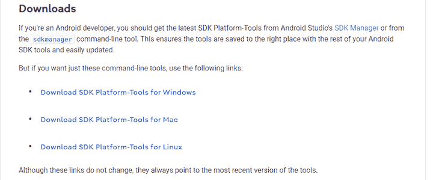

在我们的例子中，我们将检索 Windows 平台工具。一旦你下载了它们，把它们解压到某个地方，比如`c:\tools\platform-tools`，在那里你可以很容易地访问它们。

在解压后的文件夹中，我们将有我们的`adb.exe`文件。

通常，当你使用 Android Debug Bridge 工具时，你会在你正在开发的应用程序的目录中。

为了使用 ADB，必须导航到该文件夹，这很快就会变得过时，因此为了简化这一点，让我们继续将它添加到我们的路径中。这样，无论我们在哪个目录，我们都可以调用 ADB。

为此，将`platform-tools`目录添加到您的系统路径中。根据你使用的 Windows 版本不同，[的操作说明也会有所不同](https://www.computerhope.com/issues/ch000549.htm)。之后，打开一个命令提示符，键入`adb`，然后按回车键。

如果一切按计划进行，您应该会得到相当多的控制台输出，因为 ADB 会告诉您它能做的一切。

## 打开 Android 模拟器

为了给我们一个可以使用的设备，让我们打开 Android 模拟器。为此，打开 Android Studio，点击“设备管理器”，然后启动列表中的模拟器:

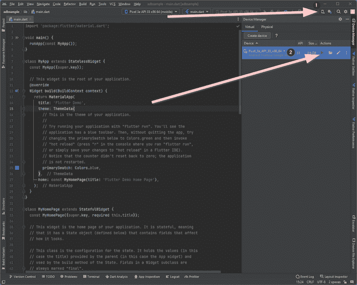

模拟器启动后，键入`adb devices`查看连接的设备列表。正如所料，我们可以看到有一个连接的设备—仿真器:

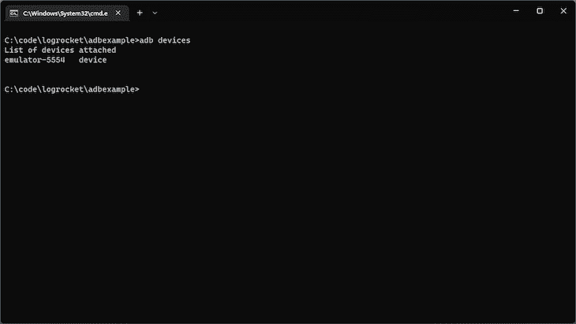

## 使用 Android 调试桥

当谈到它能在 Android 设备上帮助你什么时，ADB 是一把瑞士军刀。让我们看几个它能做什么的实际例子。

### 获取交互式外壳终端

一旦我们知道我们有一个连接的设备，键入`adb shell`并按回车键。这将为我们提供一个交互式终端，我们可以使用它来浏览模拟器图像。

因为 Android 手机是基于 Linux 的，所以大多数标准的 Linux 终端命令都可以在这里工作，比如`ls`获取目录列表:

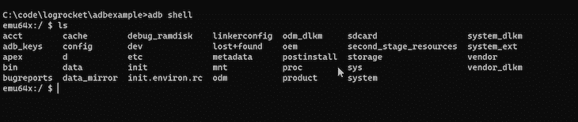

现在我们对此无能为力，但这是我们以后会回头讨论的事情。

### 将文件从本地计算机复制到设备

如果我们在本地设备上有一个文件，我们想把它复制到我们连接的 Android 设备上，Android Debug Bridge 可以帮助我们。对于这个例子，[我们将使用来自 GitHub](https://raw.githubusercontent.com/simplificator/phonegap-helloworld/master/android/bin/Hello%20World.apk) 的测试 APK。

现在就开始下载 APK 吧。一旦完成，您应该在您的“下载”目录中有`Hello World.apk`。

要将该文件复制到我们的设备，我们可以使用以下命令:

```
adb push "Hello World.apk" /sdcard/helloworld.apk

```

运行此命令后，您应该会看到以下内容:

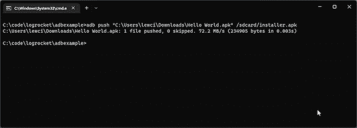

在模拟器上，我们可以看到该文件已被复制到本地手机存储中，这可以在“文件”应用程序中看到:

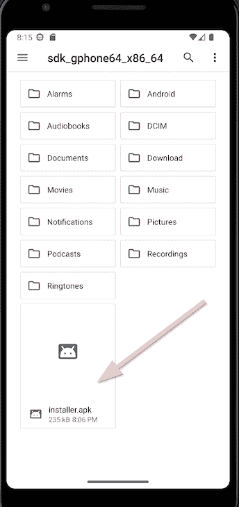

如果你是 Android 新手或者 ADB 新手，你可能会觉得我们写`sdcard`目录很奇怪。这只是手机本身的内部存储，是手机内置 SD 读卡器时代的遗留物。

### 将文件从设备复制到我们的本地机器

我们可以反向运行上述操作，将文件从设备复制回本地计算机。这就像调用`adb pull /sdcard/installer.apk`一样简单。将检索该文件，并且该文件在本地计算机上的名称与在设备上的名称相同:

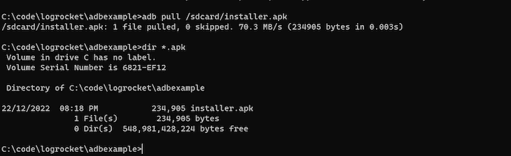

### 在 Android 调试桥上安装 APK

如果我们有一个 APK，我们想安装在设备上，我们不想麻烦复制到设备上安装它，我们可以使用 ADB 直接安装它。为此，只需键入`adb install installer.apk`，您应该会看到以下内容:

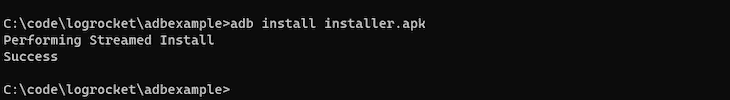

之后，该应用程序将出现在我们的设备上。

### 按包名移除应用程序

现在，让我们删除刚刚安装的那个`Hello` `World`应用程序。我们可以通过首先键入`adb shell`，然后使用`pm list packages -f`来获取所有已安装包的列表，从而获取已安装包的列表。但是，如果我们这样做，我们会看到许多已安装的软件包。

因为我们有一个功能外壳，所以我们可以使用像`grep`这样的工具来轻松过滤结果。在这种情况下，输入`pm list packages -f | grep hello`将给出包含单词“hello”的包的准确列表。

正如我们所看到的，这个列表很短，只包含我们安装的包:

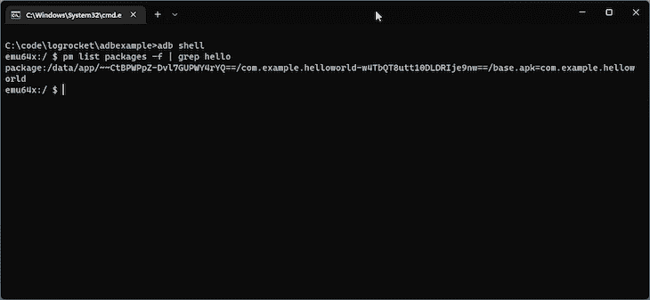

现在我们知道包名是`com.example.helloworld`，我们可以使用`exit`离开交互外壳，然后输入`adb uninstall com.example.helloworld`从手机中删除这个应用程序:

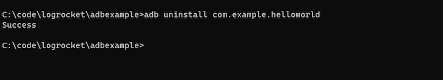

就这样，应用程序将从手机中删除。

### 从设备查看高级日志记录信息

如果我们在终端上键入`adb logcat`并按回车键，我们将看到设备随时间推移正在创建的日志的实时视图:

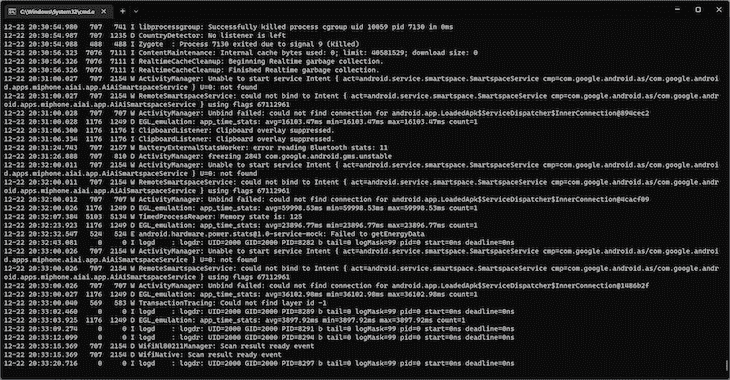

这些日志非常健谈。当你不得不滚动浏览这么多信息时，很难诊断出你要找的问题。幸运的是，你可以做一些事情来减轻这种情况。

你的第一个选择是将`logcat`与`grep`结合使用，而不是`adb shell`。首先用`adb shell`接入手机。然后，使用`logcat | grep *searchterm*`只看到日志消息中有你的关键字。

在我的例子中，输入`logcat | grep phone`只会返回包含短语“phone”的日志消息:

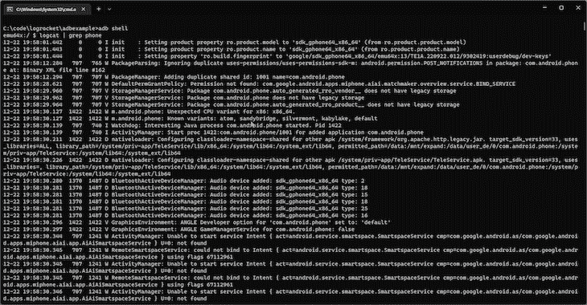

你的第二个选择是使用更漂亮的浏览器。在这个领域有几个选项，但是像 LogCatch 这样的[应用程序让你以一种更容易理解的方式查看`logcat`日志，带有强大的过滤工具。](https://github.com/pikey8706/LogCatch)

请看这个来自 LogCatch repo 的截图，以了解一个示例:

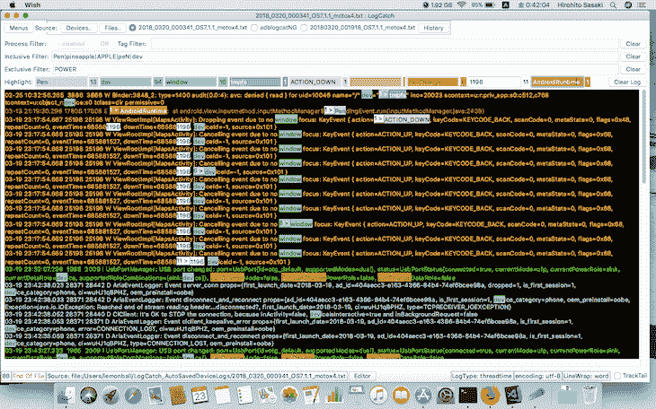

## 把我们所有的 Android 调试桥知识放在一起

在使用应用程序时，您可能需要将特定文件推送到您的应用程序，以将其置于特定状态。

例如，假设您正在发布一个应用程序，[使用一个 SQLite 数据库](https://blog.logrocket.com/speeding-up-development-environment-sqlite/)，并且您计划在用户设备上添加或删除列或模式数据。

您可能希望能够将特定的数据库推送到设备，然后启动应用程序，看看应用程序是否可以处理迁移而不会遇到问题:

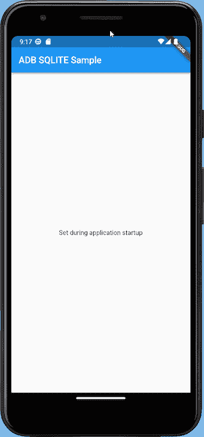

在我们的应用程序启动后，我们可以让它产生一个路径，说明 SQLite 数据库是在哪里创建的。在我的例子中，它位于以下路径:

```
/data/user/0/com.example.adbsample/databases/testappdatabase.db

```

我们希望引入数据库，对其进行修改，然后将其推回模拟器。

由于 Android 上的安全限制，我们必须运行`adb root`来告诉 Android 调试桥我们想要作为根用户运行。这将允许我们访问和修改 Android 系统中受保护的部分:

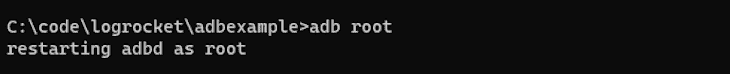

现在，我们应该能够通过简单地执行以下命令来获取我们的数据库:

```
adb pull /data/user/0/com.example.adbsample/databases/testappdatabase.db

```

结果是:

```
C:\code\logrocket\adbexample>adb pull /data/user/0/com.example.adbsample/databases/testappdatabase.db
/data/user/0/com.example.adbsample/databases/testappdatabase.db: 1 file pulled, 0 skipped. 5.3 MB/s (16384 bytes in 0.003s)

```

接下来，我们可以使用任何可用的 SQLite 浏览器来打开这个数据库并查看包含的数据:

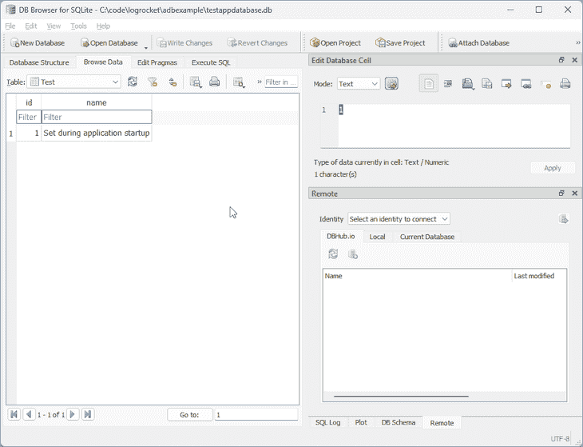

对于我们的测试，我们可以将“在应用程序启动时设置”更改为“在本地计算机上修改”并保存数据库。接下来，我们可以使用以下命令将数据库推回设备:

```
adb push testappdatabase.db /data/user/0/com.example.adbsample/databases/testappdatabase.db

```

结果是:

```
C:\code\logrocket\adbexample>adb push testappdatabase.db /data/user/0/com.example.adbsample/databases/testappdatabase.db
testappdatabase.db: 1 file pushed, 0 skipped. 3.6 MB/s (16384 bytes in 0.004s)

```

如果我们重新运行应用程序，我们可以看到值已经更新为我们在本地设置的值🎉：

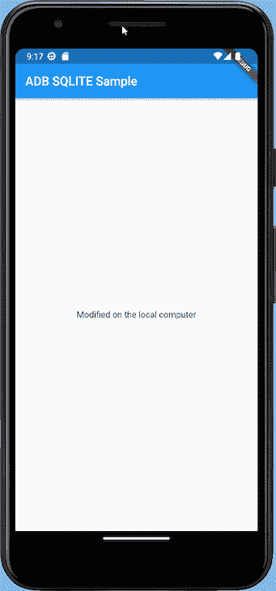

我们的 Android 应用程序现在通过 Android 调试桥读取我们刚刚推入的文件。这个例子是人为设计的，但是当您测试数据库迁移时，或者只想检查应用程序内部使用的文件时，您可以使用这个例子。

## 结论

学习如何使用 Android 调试桥是任何严肃的 Android 开发者的要求。它带来的功能和特性非常值得我们去努力。

为了在使用`adb shell`时获得更好的交互式 shell，您可以参考 Linux 终端中常用的[命令列表。](https://www.digitalocean.com/community/tutorials/linux-commands)

如果你想温习其他 Android 开发技能，请阅读关于[整合机器学习](https://blog.logrocket.com/incorporating-machine-learning-android-app/)或通过[代码收缩](https://blog.logrocket.com/r8-code-shrinking-android-guide/)让你的应用更快更安全的文章。

## LogRocket :即时重现你的安卓应用中的问题。

[](https://lp.logrocket.com/blg/kotlin-signup)

[LogRocket](https://lp.logrocket.com/blg/kotlin-signup) 是一款 Android 监控解决方案，可以帮助您即时重现问题，确定 bug 的优先级，并了解您的 Android 应用程序的性能。

LogRocket 还可以向你展示用户是如何与你的应用程序互动的，从而帮助你提高转化率和产品使用率。LogRocket 的产品分析功能揭示了用户不完成特定流程或不采用新功能的原因。

开始主动监控您的 Android 应用程序— [免费试用 LogRocket】。](hhttps://lp.logrocket.com/blg/kotlin-signup)