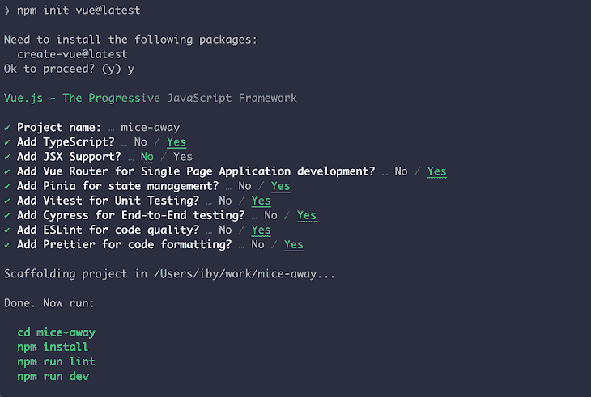
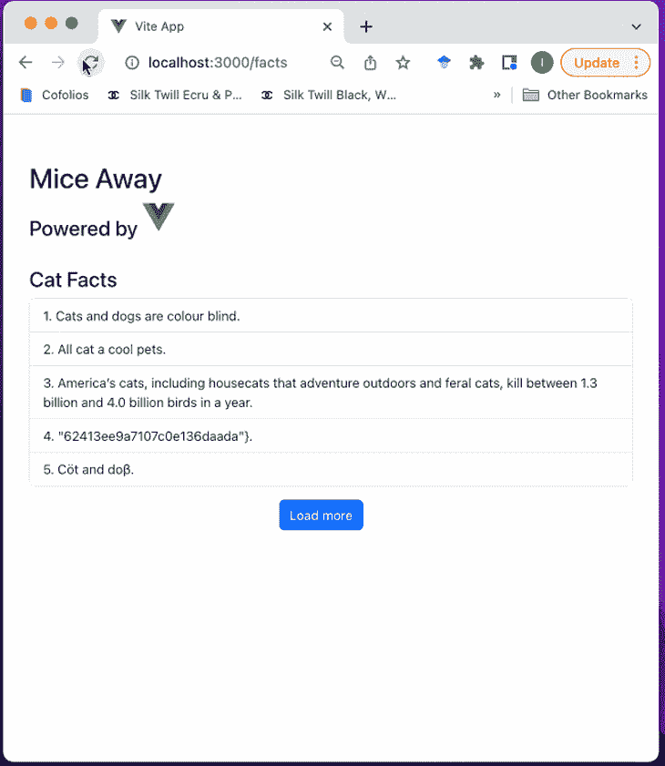
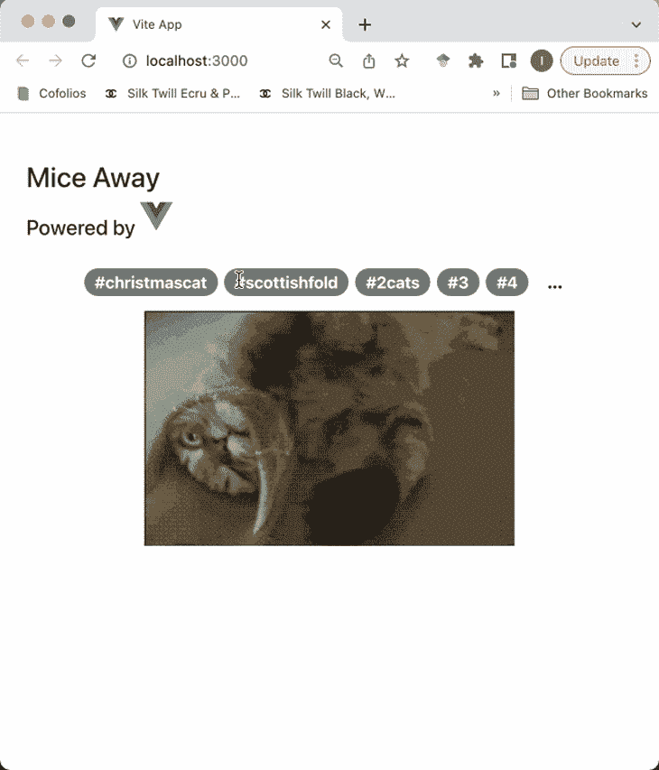

# 如何配合 Vue.js 使用 Axios

> 原文：<https://blog.logrocket.com/how-use-axios-vue-js/>

[Axios](https://github.com/axios/axios) 是一个基于 promise 的 HTTP 客户端库，适用于浏览器和 Node.js 应用程序，这意味着它既可以用于前端 JavaScript 应用程序，也可以用于后端节点服务器。

在本文中，我们将看看如何在一个简单的 [Vue.js](https://vuejs.org/) 应用程序中使用 Axios。Vue 是一个简单的前端 JavaScript 框架，所以这里的 Axios 用例将用于浏览器。

我们将涵盖:

## 本教程使用 Axios 和 Vue.js 的先决条件

要进行后续操作，您需要安装以下软件:

我们将使用 npm 作为我们的 JavaScript 包管理器，它包含在您安装 Node 时。

## 设置我们的 Vue.js 项目

我们将使用 Vue CLI 创建我们的项目，首先运行以下命令:

```
$ npm init [email protected]

```

这个命令提示我们如何设置我们的项目。

我选择将这个项目命名为`mice-away`,因为——你猜对了——我们正在开发一个有趣的与猫相关的应用程序！我们还将设置它使用 TypeScript。

这里有一个观点(我忍不住😅)的我的项目配置；您可以根据自己的喜好随意更改:



Axios 通过相应名称的函数提供对不同 HTTP 方法的访问。例如，您可以[使用](https://blog.logrocket.com/understanding-axios-post-requests/) `[.post(…)](https://blog.logrocket.com/understanding-axios-post-requests/)` [进行 POST 请求](https://blog.logrocket.com/understanding-axios-post-requests/)，或者您可以[使用](https://blog.logrocket.com/understanding-axios-get-requests/) `[.get(…)](https://blog.logrocket.com/understanding-axios-get-requests/)` [进行 GET 请求](https://blog.logrocket.com/understanding-axios-get-requests/)，等等。让我们看看在 Vue 项目中使用 Axios 处理 HTTP 请求的选项。

## 向我们的 Vue.js 应用添加 Axios

我们可以通过运行以下命令来安装 Axios:

```
$ npm i axios

```

现在已经安装了 Axios，我们将看看在我们的项目中使用它的两种方式。

## 在 Vue.js 组件中通过简单的导入来使用 Axios

您可以在 Vue 组件中使用 Axios，只需将它导入到需要发出 HTTP 请求的组件中。这里有一个例子:

```
// AnimalFacts.vue

<template>
    <div class="row">
        <div class="col-md-12">
            <h3>Cat Facts</h3>
        </div>
        <div class="col-md-12">
            <ul class="list-group">
                <li v-for="(fact, index) in catFacts" :key="index" class="list-group-item">{{index + 1}}. {{fact.text}}</li>
            </ul>
        </div>
        <div class="row mt-3">
            <div class="col-md-12 text-center">
                <button @click="loadMoreFacts" class="btn btn-md btn-primary">{{ fetchingFacts ? '...' : 'Load more' }}</button>
            </div>
        </div>
    </div>
</template>
<script lang="ts">
    import { defineComponent } from 'vue'
    import axios from 'axios'
    interface AnimalFacts {
        text: string
    }
    export default defineComponent({
        name: 'AnimalFacts',
        data() {
            return {
                catFacts: [] as AnimalFacts[],
                fetchingFacts: false
            }
        },
        methods: {
            async fetchCatFacts() {
                const catFactsResponse = await axios.get<AnimalFacts[]>('https://cat-fact.herokuapp.com/facts/random?animal_type=cat&amount=5')
                this.catFacts = catFactsResponse.data
            },
            async loadMoreFacts() {
                this.fetchingFacts = true
                const catFactsResponse = await axios.get<AnimalFacts[]>('https://cat-fact.herokuapp.com/facts/random?animal_type=cat&amount=5')
                this.catFacts.push(...(catFactsResponse.data || []))

                this.fetchingFacts = false
            }
        },
        async mounted() {
            await this.fetchCatFacts()
        }
    })
</script>

```

在本例中，我们在组件中导入了 Axios，并在组件方法之一中使用它，通过调用`GET`方法来获取显示在页面上的数据。您可以在下面看到这种方法的结果:



## 通过创建插件在我们的 Vue.js 项目中使用 Axios

在我们的项目中使用 Axios 的另一个选择是创建一个插件，并为我们的项目分配一个全局 Axios 实例。当您构建一个应用程序来使用特定的 API 时，此选项非常有用，API 可以配置为基本 URL。

让我们创建我们的 Axios 插件！

首先，我们将通过在终端中运行以下命令来创建一个目录来存放我们的插件:

```
$ cd src/
$ mkdir plugins

```

接下来，我们将通过在终端中运行以下命令来创建 Axios 插件文件`axios.ts`:

```
$ touch axios.ts

```

然后，在我们新创建的`axios.ts`文件中，我们将创建一个 Axios 实例，并使其成为一个全局属性:

```
// axios.ts

import axios from 'axios'
import type {App} from 'vue'

interface AxiosOptions {
    baseUrl?: string
    token?: string
}

export default {
    install: (app: App, options: AxiosOptions) => {
        app.config.globalProperties.$axios = axios.create({
            baseURL: options.baseUrl,
            headers: {
                Authorization: options.token ? `Bearer ${options.token}` : '',
            }
        })
    }
}

```

现在，我们将在`main.ts`中将插件注册到我们的 Vue 实例中。注册 Axios 插件时，我们将传递实例选项，包括我们的`baseUrl`:

```
// main.ts

import { createApp } from 'vue'
import { createPinia } from 'pinia'

import App from './App.vue'
import router from './router'
import axios from './plugins/axios'

const app = createApp(App)

app.use(createPinia())
app.use(router)
app.use(axios, {
    baseUrl: 'https://cataas.com/',
})

app.mount('#app')

```

现在我们已经注册了 Axios，我们有了一个全局 Axios 对象，可以作为`this.$axios`访问。让我们在组件中使用它:

```
// HomeView.vue

<script setup lang="ts">
</script>
<template>
  <main>
    <div class="row">
      <div class="col-md-12 text-center mb-3">
        <span @click="selectTag(tag)" v-for="(tag, index) in visibileTags" :key="index" 
          class="badge rounded-pill fs-5 me-2" :class="[tag === activeTag ? 'text-bg-primary' : 'text-bg-secondary']">
            #{{tag}}
        </span>
        <span @click="showNext()" class="badge rounded-pill text-bg-light fs-4">...</span>
      </div>
    </div>
    <div v-if="catImage" class="row">
      <div class="col-md-12 text-center">
        
      </div>
    </div>
  </main>
</template>
<script lang="ts">
import { defineComponent } from 'vue'
import type {AxiosInstance} from 'axios'

declare module '@vue/runtime-core' {
  interface ComponentCustomProperties {
    $axios: AxiosInstance
    catTags: string[]
  }
}

interface DogBreed {
  name: string
}

export default defineComponent({
  name: 'HomeView',
  data() {
    return {
      catTags: [] as string[],
      displayStart: 0,
      displayCount: 5,
      activeTag: '',
      catImage: '',
    };
  },
  computed: {
    cleanCatTags() {
      return this.catTags.filter((tag) => tag !== '').map((tag) => tag.replace(/[&\/\\#,+()$~%.'":*?<>{}]/g, ''))
    },
    totalTags() {
      return this.cleanCatTags.length
    },
    displayEnd() {
      const sliceEnd = this.displayCount + this.displayStart
      return this.totalTags > sliceEnd ? sliceEnd : this.totalTags
    },
    visibileTags() {
      return this.cleanCatTags.slice(this.displayStart, this.displayEnd)
    },
    hasNextTags() {
      return this.displayEnd < this.totalTags
    }
  },
  methods: {
    async fetchCatTags() {
      const tagsResponse = await this.$axios.get('/api/tags')
      this.catTags = tagsResponse.data
    },
    showNext() {
      this.displayStart += this.displayCount
      this.selectTag(this.cleanCatTags[this.displayStart])
    },
    selectTag(tag: string) {
      const baseUrl = 'https://cataas.com/'
      this.catImage = `${baseUrl}cat/${tag}`
      this.activeTag = tag
    },
    loadDefaultCatImage() {
      const baseUrl = 'https://cataas.com/'
      this.catImage = `${baseUrl}cat/gif`
    }
  },
  async mounted() {
    await this.fetchCatTags()
    this.loadDefaultCatImage()
  },
});
</script>

```

在我们的组件中，我们必须覆盖`ComponentCustomProperties`类型以包含`$axios`作为属性。否则，我们会得到以下编译器错误:

```
Property $axios does not exist on type ComponentCustomProperties

```

为了注册`$axios`，我们还必须通过运行`npm i @types/axios`并导入 Axios 实例类型`AxiosInstance`来安装 Axios 类型。

在我们的`HomeView`组件的`fetchCatTags`方法中，我们使用`this.$axios`来获取猫标签，用它我们可以显示猫的图像。

使用我们的插件实例和将 Axios 直接导入到我们的组件之间的区别在于，使用插件，我们可以为我们的 Axios 实例配置选项，以避免为每个请求传递某些值。

例如，使用我们的插件，我们不必传入`baseUrl`，我们对`/api/tags`的请求解析为我们配置的`baseUrl`。

您可以通过创建以下插件来查看 Axios 与 Vue 配合使用的结果:



## 结论

在本文中，我们尝试了在 Vue 项目中使用 Axios 的两种方式。

第一个选项是将 Axios 对象直接导入到我们的组件中，我们用它从时尚弄潮儿事实 API 中获取 cat 事实。

我们的第二个选择是创建一个注入全局 Axios 对象的 Axios 插件。我们还将 Axios 实例的基本 URL 配置为一个 [cat as a service API](https://cataas.com/#/) ，这意味着我们不必在请求中指定完整的 URL。

你可以在我的 Github repo 中找到本文使用的[完整代码。](https://github.com/ibywaks/mice-away)

我希望这篇文章对你有用。请在评论区分享你的想法或问题！

## 像用户一样体验您的 Vue 应用

调试 Vue.js 应用程序可能会很困难，尤其是当用户会话期间有几十个(如果不是几百个)突变时。如果您对监视和跟踪生产中所有用户的 Vue 突变感兴趣，

[try LogRocket](https://lp.logrocket.com/blg/vue-signup)

.

[](https://lp.logrocket.com/blg/vue-signup)[https://logrocket.com/signup/](https://lp.logrocket.com/blg/vue-signup)

LogRocket 就像是网络和移动应用程序的 DVR，记录你的 Vue 应用程序中发生的一切，包括网络请求、JavaScript 错误、性能问题等等。您可以汇总并报告问题发生时应用程序的状态，而不是猜测问题发生的原因。

LogRocket Vuex 插件将 Vuex 突变记录到 LogRocket 控制台，为您提供导致错误的环境，以及出现问题时应用程序的状态。

现代化您调试 Vue 应用的方式- [开始免费监控](https://lp.logrocket.com/blg/vue-signup)。