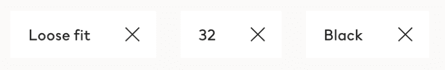
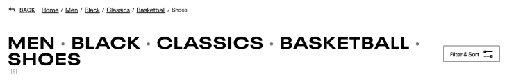
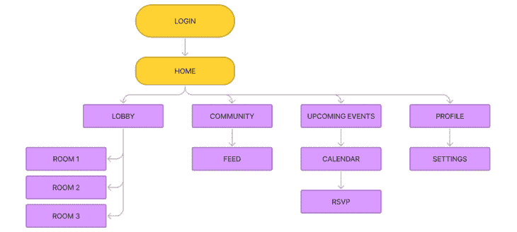
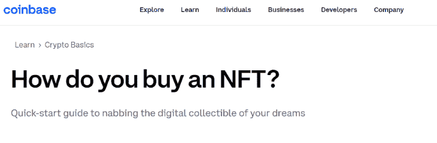
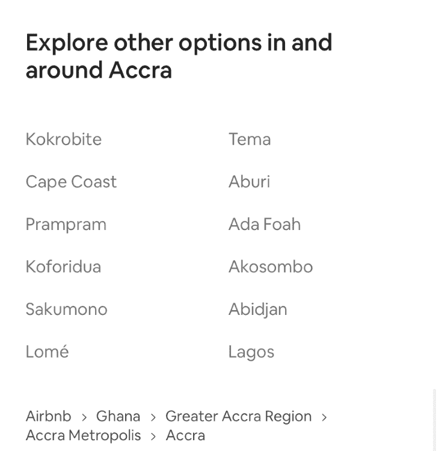
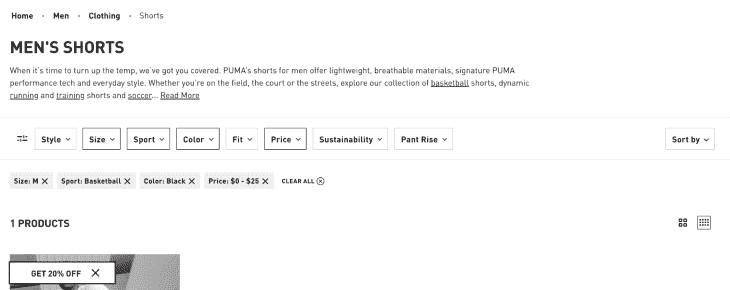

# 如何使用面包屑进行清晰的网站导航

> 原文：<https://blog.logrocket.com/ux-design/how-use-breadcrumbs-clear-website-navigation/>

我怎样才能回到以前的地方？在浏览网站时，我们经常问自己这个问题。就像我们在停车场丢了车一样，用户很容易在网站上迷路。然而，网站设计者早就有了一个值得信赖的、不引人注目的解决导航问题的方案，他们被称为面包屑。

面包屑通常是网站 UI 中被忽视的设计元素，但是它们经受住了时间的考验。这种公认的元素有什么不可爱的呢？它们就在那里——经常藏在屏幕的角落里，不需要的时候被用户忽略。

然而，当我们开始问这个可怕的问题时，“我如何找到回去的路？”面包屑是页面的无名英雄；不管网站有多复杂，它们都可以帮助我们通过网站的层次结构找到方向。

## 面包屑是什么？

面包屑是一种辅助导航，帮助用户在网站的层次结构中找到附近的相关内容。面包屑可以在世界上最受欢迎的网站上找到，尤其是那些有无数页面的网站。

这只能意味着一件事:用户真正使用面包屑，设计师发现面包屑是帮助用户浏览网站层次结构的可靠选择。亚马逊，苹果，IBM 都这么做。最佳实践和研究不会说谎。

面包屑很容易让我们在一个网站层次结构中找到一两个甚至三个或更多的页面。导航对于用户在网站上找到他们的路是必不可少的，并且自从生物开始存在以来，导航在互联网之外的生活中已经变得普遍重要。

当人类向未知领域推进并探索时，我们希望知道安全回家的路。面包屑帮助我们做到了这一点，它实际上是一个巧妙的名字，参考了格林童话“汉瑟尔和葛丽特”中的故事，孩子们丢下面包屑，这样他们就可以找到穿过森林回家的路。角色们承认迷失回家的路会是一件不幸的事，事实也确实如此。

有太多使用路径导航的例子，当我们的网站看起来像一个可怕的森林或层级迷宫，人们很容易迷路。解决方法就像我们小时候听的童话和故事一样简单:留下面包屑痕迹。

## 三种面包屑

在这种情况下，踪迹并不总是指给我们看我们以前在哪里。有几种不同的面包屑:两种是常用的，一种不再常用。

当今设计中使用的两种主要面包屑是:

*   **Attribute-based breadcrumbs**: Shows the user an attribute of the current page

    以基于属性的面包屑为例，注意零售网站如何显示作为面包屑包含的所选样式、颜色和大小。这些属性可以删除并显示不同的页面，或者与内容相关。

第三个未使用的面包屑是许多人误以为的面包屑:用户的会话历史。在最佳实践中，面包屑不应该显示用户的会话历史！想象一下，点击 100 页，你想回到 50 页前的位置…当我们可以使用位置或属性层次结构轻松导航时，这将使任务变得非常不方便。

尽管用户可能会说他们想看到自己的会话历史，但他们并不想。这应该是一个单独的功能，或者留给浏览器，因为它在功能上是一个后退按钮。这种面包屑是一种不好的做法，应该很少使用，但我们还是要定义它。

*   **路径面包屑**:向用户显示他们进入当前页面的独特步骤

## 为什么要用面包屑？

面包屑是一种简单的、被广泛接受的、很棒的用户体验元素，它有助于导航、节省用户时间并减少挫败感。面包屑对于大型或复杂的层次结构网站几乎总是一个好的解决方案，因为我们可以向用户显示他们在网站上的位置，而不会给每个页面增加很多噪音或复杂性。实话实说:大多数时候页面顶部都是普通大小的文本链接。

自从万维网出现以来(直到今天)，设计师们一直在应用这个被普遍接受的概念。面包屑以层次结构向我们显示过去的页面，以及我们已经浏览了多少页，如果我们碰巧迷路了，可以很容易地在旅途中向后点击(尽管用户可能不会像 Hansel 和 Grettel 那样面临饥饿或死亡的威胁)。如果用户找不到回家的路，他们无疑会有糟糕的体验——这对网站来说没有好处。



Example of a location-based breadcrumb on a retail site, hierarchy all the way home.

## 何时使用面包屑

我们了解到面包屑是二级导航，通常用于具有多个页面级别的站点。它们是零售或商业网站中特别重要的元素。

层次结构本身是一个网站的结构，可以显示用户如何浏览网站。它也可以理解为导航层(用户可以从某个页面点击到哪个页面等等)。

因此，当有几个页面和路径时，它是简单的，当有许多路径时，它是复杂的。这就是为什么我们经常在有很多产品的网站上看到面包屑；在多产品站点中，产品分类和关系通常有复杂的层次。



Example of a simple hierarchy. See how some pages can only be accessed through other specific pages, creating paths for the users.

假设我们正在零售网站上寻找露营用品。我们将点击野营灯，然后我们可能会在我们的要求和点击太阳能灯，这是一个子类别更具体。我们可以点击一个产品，并在屏幕的左上角看到我们是如何做到这一点的，如果它不是我们想要的产品，我们可以轻松地点击返回到太阳能灯。

也许我们决定要一盏煤油灯。不需要点击主页按钮，再次浏览层次结构(产品层)，重置一切。我们甚至不必点击两次后退按钮(尽管许多用户会选择这样做)。我们所要做的就是查看面包屑，看看我们之前在哪里，然后点击“野营灯”然后我们可以从那里重定向我们的搜索:用户只需点击一下就可以跳回两个层次。基本上是魔法。

让我们想象一下拥有数百万件商品的大型电子商务网站的层级结构。

**体育&户外** > **户外娱乐** > **露营&徒步** > **灯光&灯笼** > **太阳能灯** > **太阳能灯 X12**


Real-world example of breadcrumbs to find a camp lighting.

或者我们在一个金融网站上试图了解更多关于他们的服务。我们的面包屑可能看起来像这样:

**个人财务** > **退休计划** > **罗斯个人退休帐户**

或者用一个现代的例子:

**学习** > **密码基础知识**



Simple breadcrumb for a crypto website.

请注意，大多数时候我们不需要以 **Home** 作为起始面包屑来开始层级。有时我们只想显示最后三个层次结构，因为否则会出现信息过载。如果有人想一路回家，他们知道在很多情况下只需点击导航中的图标或 **Home** 即可。面包屑永远不会取代主导航；这只是次要的。

用户也知道如何有策略地使用面包屑，所以他们可以点击返回到显示的最远层次，然后它会显示更多的层次。这意味着我们不需要显示所有内容。我们不想通过一次在面包屑中插入太多的链接来使面包屑变得过于复杂——事实上，层次结构本身应该尽可能地被整合。

为了清理面包屑，许多设计师选择合并命名惯例。一种常见的做法是避免层次结构页面的长名称，使它们易于理解。除了写着“现场笔记”的博客面包屑，也许我们可以在面包屑中将其重命名为“现场笔记”，以节省一些空间，而不会失去我们要返回的上下文或意义。

## 何时不使用面包屑

让我们不要对这个概念沾沾自喜——面包屑不是一个放之四海而皆准的解决方案。许多基础网站根本不需要面包屑。例如，没有很多页面的投资组合网站或本地小企业(可能只有一两层层次结构)不需要面包屑。

如果我们可以点击主页按钮，回到一两页前的确切位置，真的有必要额外列出面包屑吗？很多时候答案是否定的。面包屑不需要放在一个层次简单的网站上。

另一个常见的错误是在展示步骤的表单中使用面包屑。在这种情况下，最佳实践是使用步进器或进度条来显示步骤，面包屑是特定于位置、属性或历史的。面包屑并不是到处都可以使用，它们永远不应该取代网站的主导航或页面导航，比如标题或侧边栏。许多基本网站将只需要主导航。

当我们的网站开始有复杂的架构，或者将来会变得复杂，比如过滤或分类的需求——也许我们只是想跳回几个层次——面包屑使任务变得更加方便。我们可以根据需要追踪尽可能少或尽可能远的面包屑。

## 手机面包屑呢？

现在来说说移动端的面包屑。我们真的要将宝贵的屏幕空间用于页面顶部的补充元素吗？很多设计师会告诉你，不行，太浪费空间了。但是用户确实在手机上使用面包屑。

面包屑应该在移动网站上，当它处于原始设计(或桌面设计)时。同样的规则也适用:我们不会因为屏幕变小而抛弃这个概念。那是懒惰的设计。如果用户使用面包屑，并且它对层次结构有意义，我们会找到一种方法，但是我们的解决方案可能会有一点不同。想象一下零售面包屑在手机上显示四五个面包屑。这太占地方了。

那么解决办法是什么呢？只使用一个面包屑。很多人不会意识到这一点，但我们的手机上到处都是奇异的面包屑——经常被误认为是后退按钮。实际上，我们是在跳回一个层次结构，而不是像后退按钮那样在会话历史中。当我们在一行中使用多个面包屑或只有一个面包屑时，我们并没有把主要的不动产推到页面下面。仅使用一个面包屑或一行是苹果、Meta 和其他大公司的常见做法。多行可能会将内容推到不需要的空间。


Here is an example of a breadcrumb on our phones that actually sends you back a hierarchy and not the last page you were on.

例如，如果我转到**文件** > **下载** > **文件夹**，并且我在**文件夹**页面，面包屑将只显示一个面包屑回到**下载**。或者，如果我在一个零售网站上寻找笔记本电脑，并点击一个产品，只有最后一个层次面包屑会显示，这是**笔记本电脑**。


Example of a location-based breadcrumb with a single crumb on mobile.

这里没有一个普遍的解决办法；网页的不同部分可能需要它们自己的碎片，例如属性层次结构。如果我们想在非洲租一个房子，我们想看看我们应用了哪些属性，并从指定城市阿克拉跳回到只指定国家加纳，因为我们想住在其他地方，多行面包屑在这里可能是合适的，也许它不是在移动站点的顶部，而是在位置所在的底部，就像在 Airbnb 中一样。这样，移动用户可以找到他们需要的东西，我们也不会浪费顶部的空间。



Rental booking showing breadcrumbs of booking locations near the bottom of the page.

## 简单元素意味着简单的 HTML

前面我提到了面包屑的简单性，幸运的是，对于开发人员来说，这是真的。有时候，在一个网站上找到自己的路最简单的方法就是使用最简单的元素。面包屑只是嵌套的链接和文本，在使用 HTML/CSS 时通常组织在一个列表中。HTML 列表可以看起来像这样完美无缺:

```
<ul class="breadcrumb">
  <li><a href="#">Home</a></li>
  <li><a href="#">Mens</a></li>
  <li><a href="#">Shoes</a></li>
  <li><a href="#">Athletic</a></li>
  <li>Running Shoe 12</li>
</ul>

```

这只是一个链接列表。面包屑链接通常被称为祖先链接，它像家谱一样显示层次结构，例如父页面和祖父页面。你不需要为了爱链接的家谱而爱家谱。网站地图将定义回答问题的页面的层次结构:什么页面可以去哪里？这个页面上的面包屑显示了什么？

## 如何设计面包屑的样式

虽然面包屑很简单(它们只是链接)，但找到正确的设计方案需要时间。一群高级设计师会花一周或更长时间来决定最佳实践和面包屑在他们设计中的实现，你会感到惊讶吗？

当我们开始设计风格时，对于这样一个基本列表，我们有很多选择。让我抛给你一堆问题:

*   过去的链接是什么颜色？
*   点击链接？
*   你没有点击过的链接？
*   当前页面是链接吗？
*   有悬停状态吗？
*   我们如何分离每个环节，这个层级可以有多长？
*   它在每一页的左上方吗？
*   哪些页面需要面包屑？
*   这种设计如何转化为网站其他部分的设计风格？

许多设计元素经常被忽视。在桌面上，你应该显示当前页面吗？是的。用户应该知道他们在哪里，但是最好不要让当前页面成为链接！过去的页面是链接，当前页面显示内容；我们已经在页面上了，所以不需要链接了！

面包屑链接应该和你在网站上的标准文本链接保持一致。假设我们有默认的带下划线的蓝色链接，我们将保持面包屑不变。然而，如果网站有一个设计系统或品牌，我们需要实现它来匹配网站上其他链接的外观和行为。



Example of location-based breadcrumbs at the top and attribute-based breadcrumbs under the sorting.

最后，我们如何显示页面之间的移动？箭头、线、点或正斜线？

好吧，这里的答案并不清楚。许多面包屑使用一个向前的箭头显示在层次结构中向前移动。页面 A 导致 B 导致 C，等等。这是有意义的，这是一个可以接受的使用箭头。

易访问性实践和著名的设计系统，如 carbon design system 告诉我们，正斜线`/`也是可以接受的，它显示了向前的运动，而没有太多的装饰元素。web 上也可以看到一个`|`或点，但这不太容易接受，因为这些元素没有定义的用例。虽然这是分离，但并不总是有意义的。它也没有显示寻路运动，而是显示为一个分隔线而不是寻路器。因此，当涉及到面包屑时，尽量坚持使用箭头或正斜杠。


Two examples of arrows being used for navigation.

W3School 为我们提供了一个面包屑的基本示例，以及使用 CSS 的元素的通用样式。

## 结论

既然我们已经讨论了外观、功能和用例，我想是时候让我们的用户成功导航我们的网站了。无论我们点击网页的兔子洞有多复杂或多远，面包屑都是我们设计中可信赖的北极星。二级导航从未如此耀眼，只要我们抬头看(页面顶部)。

让我们通过了解我们所处的位置来确保我们安全地导航，并通过在实现最佳设计实践的同时使用面包屑来减少复杂站点中的挫折。祝你航行顺利！

## [LogRocket](https://lp.logrocket.com/blg/signup) :无需采访即可获得 UX 洞察的分析

[](https://lp.logrocket.com/blg/signup)

[LogRocket](https://lp.logrocket.com/blg/signup) 让您可以回放用户的产品体验，以可视化竞争，了解影响采用的问题，并结合定性和定量数据，以便您可以创建令人惊叹的数字体验。

查看设计选择、交互和问题如何影响您的用户— [立即尝试 LogRocket】。](hhttps://lp.logrocket.com/blg/signup)