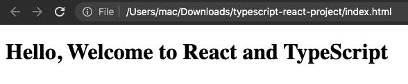
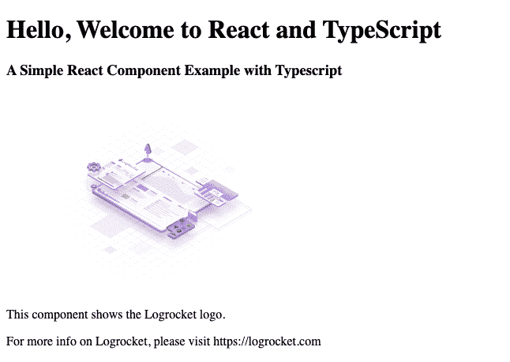
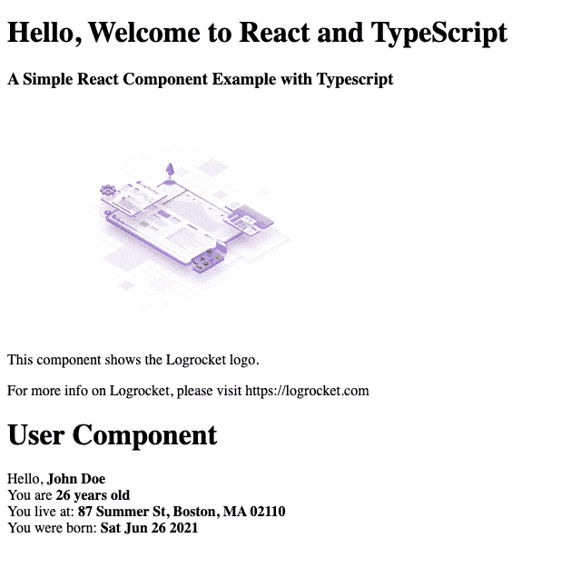

# 如何在 React 中使用 TypeScript:示例教程

> 原文：<https://blog.logrocket.com/how-use-typescript-react-tutorial-examples/>

***编者按*** : *本指南介绍了如何将 TypeScript 与 React 结合使用，最近一次更新是在 2022 年 8 月 2 日，内容包括 TypeScript 与 React 结合使用时的优势概述，以及关于。tsx 文件。*

在本教程中，您将了解在 React 项目中使用 TypeScript 所需的一切。您还将了解为什么应该在 React 中使用 TypeScript，如何安装和配置 TypeScript，以及如何在 React 组件中使用 TypeScript 接口。

我们将举例说明以下内容:

## 什么是反应？

React 由脸书创建，最初于 2013 年开源，现已成为前端世界最受欢迎的库之一。React 很容易扩展，可以通过像 [Redux](https://blog.logrocket.com/why-use-redux-reasons-with-clear-examples-d21bffd5835/) 这样的库包含路由和状态管理模式等特性。React 占用的空间很小，但几乎可以针对任何项目进行定制。

要了解更多关于 React 的高级信息，请查看 React 官方文档。

## 什么是 TypeScript？

TypeScript 是一种由微软开发和维护的免费开源编程语言。它是 JavaScript 的一个严格超集，为该语言添加了可选的静态类型和基于类的面向对象编程。

### JavaScript 的超集

JavaScript 最初是作为客户端语言创建的，但随着时间的推移，开发人员明白 JavaScript 可以在服务器上使用，特别是随着 v8 引擎的发明。

JavaScript 可能很快变得复杂，有时无法发挥面向对象编程语言的全部潜力。TypeScript 的诞生就是为了弥合这一差距，并成为企业级开发的替代方案。

TypeScript 在编译时会发出 JavaScript，是当今 JavaScript 世界中的一个流行名称。甚至纯 JavaScript 应用程序也为 TypeScript 开发人员提供了`type.d.ts`类型定义。

## 用 TypeScript 反应更好吗？

TypeScript 可以在许多方面帮助 React 开发人员。下面是在 React 中使用 TypeScript 的一些好处:

### 变量和错误检查

TypeScript 通过检查分配给静态定义的变量的数据类型来提供变量检查。这总体上降低了给变量分配错误类型的可能性。

TypeScript 还进行编译时检查，帮助标记错误，如错误的参数赋值、语法错误等等。这很好，因为它降低了调用错误函数或意外跳过变量声明的可能性。

### 易读、易懂的代码

TypeScript 的关键在于它是一个静态类型的脚本。编程语言可以是静态类型的，也可以是动态类型的——区别在于何时进行类型检查。静态语言变量是经过类型检查的。

### 接口

TypeScript 允许您以接口的形式定义复杂类型定义。当您有一个要在应用程序中使用的复杂类型(如包含其他属性的对象)时，这很有帮助。这导致了严格的检查，从而减少了没有它可能产生的错误的数量。

### 更好地支持 JSX

JSX 代表 JavaScript XML。它允许我们直接在 React 项目中编写 HTML 代码。将 TypeScript 与 React 一起使用为 JSX 提供了更好的智能感知和代码完成。

### IDE 支持

在使用 Visual Studio、Visual Studio Code、Atom、Webstorm、Eclipse 等 ide 时，TypeScript 也非常有用。这些提供了更好的自动完成和代码片段生成，使得开发速度更快。

### 对现有 React 项目的支持

TypeScript 允许您逐渐调整它在现有项目中的用法。您还可以为这个用例配置 TypeScript 编译器。在官方的 [TypeScript 文档](https://www.typescriptlang.org/docs/handbook/compiler-options.html)中找到一个 TypeScript 编译器的列表。

最后，TypeScript 是微软支持的开源语言。它受到全世界数百万开发人员的广泛喜爱和使用。因为它的应用非常广泛，所以如果您在学习或使用 TypeScript 时遇到困难，很容易找到支持和问题的答案。

## 理解 TypeScript 中的`.tsx`文件

在 TypeScript v1.0 之后的几个版本中引入了 TypeScript 中的`.tsx`。根据引入了`.tsx`扩展的 TypeScript v1.6 的发行说明，新的扩展旨在做两件事:

*   在 TypeScript 文件中启用 JSX
*   将新的`as`操作符作为默认的强制转换方式

`.tsx`的引入还带来了另外三件事:

*   webpack、ESBuild 和其他 JavaScript 捆绑器可以为`.tsx`文件运行不同的插件
*   Jest 之类的测试运行程序只能为`.tsx`文件运行不同的测试环境
*   代码编辑器支持的新语言

### 打字稿中`.ts`和`.tsx`的区别

文件扩展名`.tsx`的引入引起了澄清的需要。许多开发人员想知道新的文件扩展名和已经存在的`.ts`之间的区别。

区别其实很明显！当你创建函数、类、减少器等时，使用文件扩展名`.ts`。不需要使用 JSX 语法和元素，而当您创建 React 组件并使用 JSX 元素和语法时，会使用文件扩展名`.tsx`。

## 安装和配置 TypeScript

既然我们已经进行了概述，让我们开始安装。有两种安装和开始使用 TypeScript 的方法

*   使用`npm`
*   使用`create-react-app`

要使用`npm`安装 TypeScript，请在终端中运行以下命令:

```
npm install -g typescript

```

因为我们全局安装了 TypeScript，所以我们需要链接它，以便`npm`知道位置。

为此，我们运行:

```
npm link typescript

```

npm 完成后，您可以验证 TypeScript 是否安装正确:

```
tsc --v // Version 4.7.4

```

上面将打印出安装的 TypeScript 的版本号。

要在成功安装后开始项目，请创建一个保存应用程序的文件夹。

* * *

### 更多来自 LogRocket 的精彩文章:

* * *

创建新目录:

```
mkdir typescript-react-project

```

将目录更改为新文件夹:

```
>cd typescript-react-project

```

启动项目:

```
npm init

```

要使用`create-react-app`安装 TypeScript，请在您的终端中运行以下一行程序:

```
npx create-react-app .

```

上面的命令将为您的应用程序创建一个简单的文件夹结构，然后安装所有必要的模块，并让您的项目开始运行。

对于本教程，我们将使用`npm init`方法。

## TypeScript 如何编译 React 代码？

TypeScript 总是在项目根文件夹中检查名为`tsconfig.json`的文件以获取指令。当它找到`tsconfig.json`文件时，它加载文件中定义的设置并使用它们来构建项目。

TypeScript 项目以下列方式之一编译:

*   通过在没有输入文件的情况下调用`tsc`，在这种情况下，编译器从当前目录开始搜索`tsconfig.json`文件，并继续向上搜索父目录链
*   通过调用没有输入文件的`tsc`和一个`--project`(或者仅仅是`-p`)命令行选项，指定包含`tsconfig.json`文件的目录的路径，或者包含配置的有效`.json`文件的路径

当在命令行指定输入文件时，`tsconfig.json`文件被忽略。

如果您的根文件夹中没有`tsconfig.json`文件，继续创建它并添加以下代码:

```
{
  "compilerOptions": {
    "outDir": "./dist/",
    "noImplicitAny": true,
    "module": "es6",
    "target": "es5",
    "jsx": "react",
    "allowJs": true,
    "moduleResolution": "node",
  }
}

```

上面的 JSON 配置定义了两个主要部分:`compilerOptions`和`exclude`参数。

在编译器选项中，已经设置了一个目标`es6`。这意味着 JavaScript 引擎目标将被设置为`es6`,但是将向下编译为`es5`作为目标。注意，还有一个名为`jsx`的键，它被设置为`react`。这告诉 TypeScript 将 JSX 文件编译为 React 文件。这个类似于跑`tsc` `--jsx react`。`outDir`是编译后的输出文件夹。

在`exclude`块中，为其定义了`node_modules`。TypeScript 在编译时不会扫描`node_modules`文件夹中的任何 TypeScript 文件。

如果您熟悉 TypeScript 及其配置，您可能会奇怪为什么缺少了`include`部分。这是因为我们将配置`webpack`来接收入口文件，将它们传递给 TypeScript 进行编译，并为浏览器返回一个捆绑的 JavaScript 脚本。

您可以在[类型脚本文档](https://www.typescriptlang.org/tsconfig)中了解更多关于其他配置选项的信息。

## 为 React 和 TypeScript 配置 webpack

webpack 是一个让你编译 JavaScript 模块的工具，也被称为模块捆绑器。

要开始使用 TypeScript 中的 [webpack，我们需要安装 webpack 和一个名为`ts-loader`的 webpack 插件。为此，请在终端中运行以下命令:](https://blog.logrocket.com/webpack-or-esbuild-why-not-both/)

```
npm install webpack webpack-cli ts-loader

```

什么是`ts-loader`？顾名思义，`ts-loader`是 webpack 的 TypeScript 加载器。简单地说，它是一个帮助 webpack 与 TypeScript 很好地协作的插件。

就像 TypeScript 一样，webpack 也会检查一个名为`webpack.config.js`的文件进行配置。

如果它不存在，创建一个名为`webpack.config.js`的新文件，并添加以下代码:

```
const path = require('path');
module.exports = {
  entry: './src/index.tsx',
  module: {
    rules: [
      {
        test: /\.tsx?$/,
        use: 'ts-loader',
        exclude: /node_modules/,
      },
    ],
  },
  resolve: {
    extensions: ['.tsx', '.ts', '.js'],
  },
  output: {
    filename: 'bundle.js',
    path: path.resolve(__dirname, 'dist'),
  },
};

```

上面的代码会引导 webpack 通过`./src/index.ts`文件进入，通过`ts-loader`加载并编译所有的`.ts`和`.tsx`文件，然后在我们的`dist`目录下输出一个`bundle.js`文件。

## 添加`npm`脚本

经过目前为止的所有配置，如果您可以在任何时候想要创建一个包时运行类似于`npm run magic`的命令，难道不是很有意义吗？是的，会的。因此，打开项目根目录中的`package.json`文件，并用以下内容更新`scripts`部分:

```
"scripts": {
   "magic": "webpack"
}

```

## 创建`index.tsx`文件

完成上述所有配置后，是时候创建我们项目的主入口点文件了，但在此之前，我们需要安装以下内容:

```
npm install react react-dom @types/react @types/react-dom

```

接下来，创建一个新文件夹`src`，然后在根目录下的`src`文件夹中创建一个名为`index.tsx`的文件，并添加以下代码:

```
import * as React from "react";
import * as ReactDOM from "react-dom";
ReactDOM.render(
<div>
<h1>Hello, Welcome to React and TypeScript</h1>
</div>,
  document.getElementById("root")
);

```

上面是一个简单的 React 设置，只是它使用了 TypeScript。要编译该文件，请在终端中运行以下命令:

```
npm run magic

```

已经创建了一个名为`bundle.js`的构建文件夹。

这个新创建的包像预期的那样工作吗？创建一个新的引用新构建的`index.html`文件，找出:

```
 <!DOCTYPE html>
<html>
  <head>
    <meta charset="utf-8">
    <title>Getting Started with Typescript and ReactJS</title>
  </head>
  <body>
    <!-- this is where react renders into -->
    <div id="root"></div>
    <script src="dist/bundle.js"></script>
  </body>
</html>

```

如果双击`index.html`文件，在浏览器中打开它，您会看到:



## 在 TypeScript 中创建 React 组件

现在我们已经很好地掌握了用 TypeScript 编写 React 的基础知识，让我们深入研究如何创建 React 组件，因为这是开发我们的应用程序的一个重要部分。

在已经创建的`src`文件夹中，我们将添加一个名为`components`的文件夹。这是保存我们创建的任何 React 组件的文件夹。在`components`文件夹中，创建一个名为`FirstComponent.tsx`的新文件，并添加以下代码:

```
import * as React from "react";
let Logo ="https://logrocket-assets.io/static/home-hero-c97849b227a3d3015730e3371a76a7f0.svg";
export default class FirstComponent extends React.Component <{}> {
  render() {
    return (
      <div>
        <h3>A Simple React Component Example with Typescript</h3>
        <div>
           
        </div>
        <p>This component shows the Logrocket logo.</p>
        <p>For more info on Logrocket, please visit https://logrocket.com </p>
      </div>
    );
  }
}

```

上面的代码块是一个简单的 React 组件，它返回一个徽标和一些文本。

为了让 React 可以访问这个新组件，我们需要在基本的`index.tsx`文件中导入并使用这个组件。将`index.tsx`文件更新为:

```
import * as React from "react";
import * as ReactDOM from "react-dom";
import FirstComponent from './components/FirstComponent'
ReactDOM.render(
    <div>
      <h1>Hello, Welcome to React and TypeScript</h1>
      <FirstComponent/>
    </div>,
    document.getElementById("root")
);

```

查看上面的代码块，您会发现不同之处在第 3 行和第 7 行，您分别在那里导入了新组件并对其进行了渲染。

如果您运行`npm run magic`命令并导航到您的浏览器，您将看到:



## 将 TypeScript 接口与 React 组件一起使用

TypeScript 的核心原则之一是类型检查关注值的形状。这有时被称为“鸭子分型”或“结构分型”

在 TypeScript 中，接口充当命名这些类型的角色，并且是在您的代码内定义协定以及与项目外的代码定义协定的强大方法。

要查看如何将接口用于 react 组件，请在`src`文件夹中创建一个文件`UserInterface.ts`，并添加以下代码:

```
export default interface User{
  name: string;
  age: number;
  address: string;
  dob: Date;
}

```

上面的代码块定义了一个简单的用户界面，它将作为 props 传入一个新的组件。因为这个接口是强类型的，注意你不能为 name 键传递一个整数，因为这个值是一个字符串。

在我们的`components`文件夹中创建一个名为`UserComponent.tsx`的新组件，并添加以下代码:

```
import * as React from "react";
import UserInterface from '../UserInterface'
export default class UserComponent extends React.Component<UserInterface, {}> {
constructor (props: UserInterface){
  super(props);
}
render() {
  return (  
    <div>
      <h1>User Component</h1>
        Hello, <b>{this.props.name}</b>
        <br/>
        You are <b>{this.props.age} years old</b>
        <br/>
        You live at: <b>{this.props.address}</b>
        <br/>
        You were born: <b>{this.props.dob.toDateString()}</b>
    </div>
    );
  }
}

```

上面的代码块非常简单明了。早先创造的`UserInterface`已经作为`UserComponent`的道具被导入并传承下来。在构造函数中，我们检查了传递的属性是用户界面类型，在渲染函数中，数据将显示在我们的页面上。

创建我们的`UserComponent`之后，更新`index.tsx`文件:

```
import * as React from "react";
import * as ReactDOM from "react-dom";
import FirstComponent from './components/FirstComponent'
import UserComponent from './components/UserComponent'
ReactDOM.render(
    <div>
      <h1>Hello, Welcome to React and TypeScript</h1>
      <FirstComponent/>
      <UserComponent name="John Doe" age={26} address="87 Summer St, Boston, MA 02110" dob={new Date()} />
    </div>,
    document.getElementById("root")
);

```

现在运行`npm run magic`，导航到您的浏览器并查看更新的更改。您应该看到:



## 结论

在本教程中，我们演示了如何将 TypeScript 与 React 一起使用。我们还演示了如何用`ts-loader`配置`webpack`来编译 TypeScript 文件并生成最终版本。

本教程的代码库可以在这里找到，你可以在 [GitHub](https://github.com/samuelayo/typescript-react-update) 上试用。

## [LogRocket](https://lp.logrocket.com/blg/react-signup-general) :全面了解您的生产 React 应用

调试 React 应用程序可能很困难，尤其是当用户遇到难以重现的问题时。如果您对监视和跟踪 Redux 状态、自动显示 JavaScript 错误以及跟踪缓慢的网络请求和组件加载时间感兴趣，

[try LogRocket](https://lp.logrocket.com/blg/react-signup-general)

.

[ ](https://lp.logrocket.com/blg/react-signup-general) [](https://lp.logrocket.com/blg/react-signup-general) 

LogRocket 结合了会话回放、产品分析和错误跟踪，使软件团队能够创建理想的 web 和移动产品体验。这对你来说意味着什么？

LogRocket 不是猜测错误发生的原因，也不是要求用户提供截图和日志转储，而是让您回放问题，就像它们发生在您自己的浏览器中一样，以快速了解哪里出错了。

不再有嘈杂的警报。智能错误跟踪允许您对问题进行分类，然后从中学习。获得有影响的用户问题的通知，而不是误报。警报越少，有用的信号越多。

LogRocket Redux 中间件包为您的用户会话增加了一层额外的可见性。LogRocket 记录 Redux 存储中的所有操作和状态。

现代化您调试 React 应用的方式— [开始免费监控](https://lp.logrocket.com/blg/react-signup-general)。