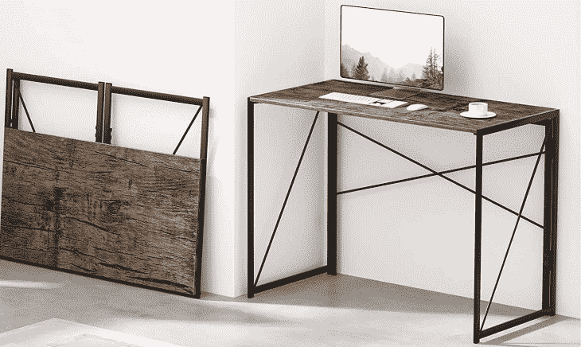
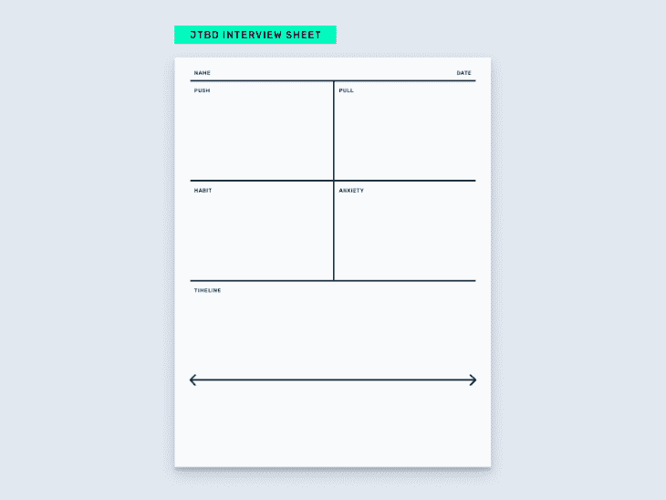
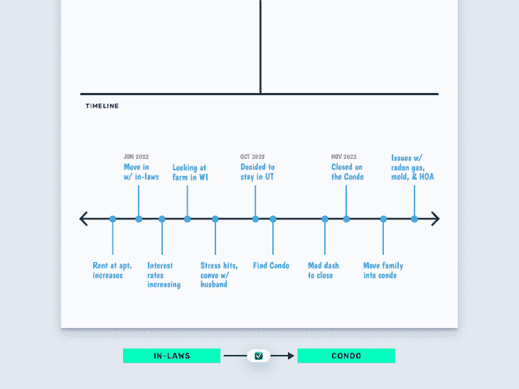
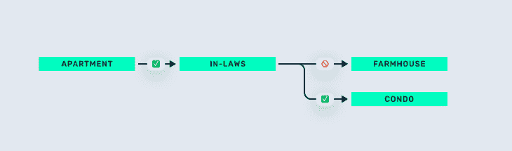
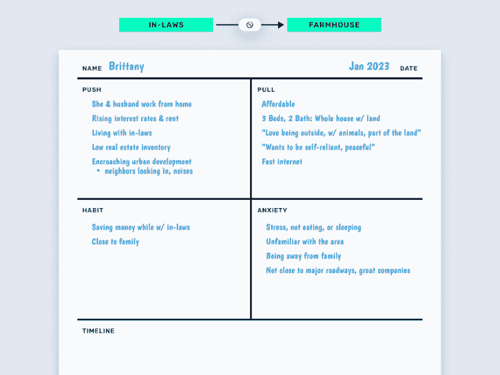
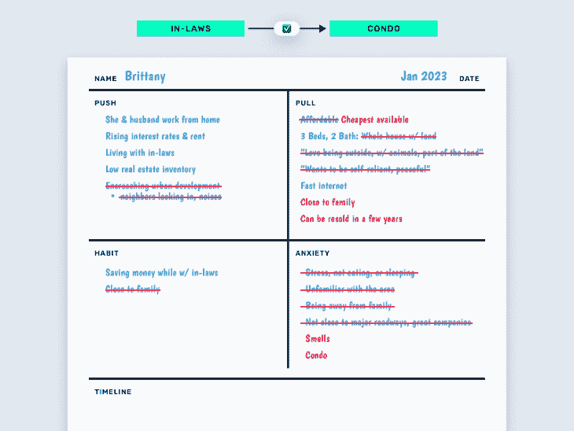
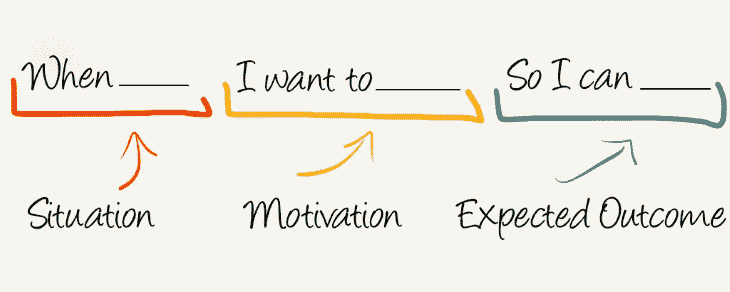

# UX 团队如何使用待完成工作框架

> 原文：<https://blog.logrocket.com/ux-design/how-ux-teams-can-use-jtbd-framework/>

UX 的研究人员利用许多研究技术和产品开发框架来了解他们的用户。在我尝试过的所有方法中，JTBD 是我最喜欢的。这是一个理论，帮助 UX 专业人士发现真正的客户需求，并保持团队专注于解决正确的问题。

在这篇文章中，我将简要介绍 JTBD 框架，并提供一个采访的例子，我在两家金融科技公司担任设计主管时，将这个采访融入了我在 UX 的研究过程，让你更好地了解如何应用这个框架。

## 什么是要做的工作？

JTBD 的核心理论是，顾客不买产品或服务；他们雇佣他们来完成他们需要完成的工作。JTBD 寻找客户决定购买产品背后的原因，这往往与公司的想法不同。了解这些原因会使产品创新更容易，也更有可能成功。

JTBD 不同于 UX 常用的人物角色法。虽然两者都旨在对用户的需求和目标产生深刻的共鸣，但人物角色侧重于人口统计和心理数据，以创建目标客户的聚合视图，而客户工作侧重于分析客户的实际购买行为及其背后的原因。这是相关性和因果性的区别。

在过去的三十年里，JTBD 已经被不同的个人开发和实践。尽管对框架的基本原则存在不同的观点(有时实践者[对这些原则有不同意见](https://jobs-to-be-done.com/alan-klements-war-on-jobs-to-be-done-dad8eaed567c)，我还是喜欢哈佛商学院的 Clayton Christensen 和 Re-Wired Group 的 Bob Moesta 的工作，他们分别在他们的书[和](https://www.amazon.com/Competing-Against-Luck-Innovation-Customer/dp/0062435612)[中描述了与运气竞争](https://www.amazon.com/Demand-Side-Sales-101-Customers-Progress/dp/1544509987)和需求端销售。

对于要做的工作理论的出色概述，我推荐 [LogRocket 对 JTBD](https://blog.logrocket.com/product-management/what-is-jobs-to-be-done-framework-examples/) 的概述。

## 了解工作环境

JTBD 指出了客户在生活中的挣扎时刻，即在给定的环境下，如何理解满足其需求的正确解决方案。例如，我正在为我的家庭办公室买一张桌子。书桌制造商可能想向我推销他们惊人的特性，如坚固性、材料、尺寸和价格。但这不是我在这种情况下购买的原因。

我正在寻找一张吸引人的可折叠桌子，可以用来邀请同样是远程工作者的朋友来家里玩一天。在这种情况下，办公桌的 JTBD 是“帮助我与其他当地设计师保持联系”和“让在家工作不那么孤立，更有创意。”

在这种情况下，我看重桌子的折叠和存放功能以及相对较低的价格。相反，如果我要更换我日常使用的 WFH 办公桌，我会优先考虑一套完全不同的功能:坐/站、美学、强度等。

工作是与环境相关的，因此了解用户的环境以创新合适的解决方案是很重要的。

Image source: [Amazon](https://www.amazon.com/dp/B08G8KV3VR/ref=sspa_dk_detail_1?psc=1&pd_rd_i=B08G8KV3VR&pd_rd_w=uSTuz&content-id=amzn1.sym.9f074495-da4d-4e1c-b407-69e85fa47fdb&pf_rd_p=9f074495-da4d-4e1c-b407-69e85fa47fdb&pf_rd_r=K7SASCBBSRKH9873CN4Z&pd_rd_wg=FjcNK&pd_rd_r=c2b5af52-d1ef-42f9-956e-8227c4eae03c&s=kitchen&sp_csd=d2lkZ2V0TmFtZT1zcF9kZXRhaWxfdGhlbWF0aWM&spLa=ZW5jcnlwdGVkUXVhbGlmaWVyPUFKSlAzTlRDNjFHMiZlbmNyeXB0ZWRJZD1BMDE1MzM0OEtNOVdHMlVWRllPVCZlbmNyeXB0ZWRBZElkPUEwNjI0MDY1QjFFTTUwVzUyRE9XJndpZGdldE5hbWU9c3BfZGV0YWlsX3RoZW1hdGljJmFjdGlvbj1jbGlja1JlZGlyZWN0JmRvTm90TG9nQ2xpY2s9dHJ1ZQ==)

## 如何发现待完成的工作:JTBD 开关面试

发现客户需要完成的工作的最佳方式是与他们交谈。这听起来很简单，但你会惊讶有多少公司不这样做。JTBD 转换访谈是一种研究方法，旨在揭示客户在雇佣你的产品时的工作，也就是说，采用或转换到你的产品。不要等太久，否则他们可能会对自己真正的决策标准记忆模糊。

一旦你安排了与新用户的面谈，你将要求他们讲述他们的购买经历。你在倾听他们的挣扎时刻(他们的 JTBD)，找出影响他们招聘决定的四种力量。你还将构建一个事件的时间表，最终导致他们雇佣你的产品或服务。这段来自 HBS 的[视频包括进行面试的概述和技巧。你还可以看到一些关于消费者购买](https://www.youtube.com/watch?v=HSyC7M6u4zQ)[新车](https://vimeo.com/81153746)或 [Peloton 自行车](https://www.youtube.com/watch?v=ek0yAdEkbgA)的采访示例。

对于面试本身，我准备了如下所示的笔记工作表。下半部分用于记录时间线事件，上半部分分为四个象限，分别代表四种发展力量。

前两种力量推动前进，并鼓励改变完成客户工作的方式:

*   推动是所有与现状相关的烦恼、烦恼和外部压力。推动促使用户寻找新的工作解决方案
*   拉力是新事物的诱惑。拉动通过在用户脑海中创建一个更好的自己的形象来激励用户改变

底层的两种力量抵制变革，鼓励坚持现状。如果这些力量超过了前两种力量，客户将坚持使用他们当前的解决方案来完成工作:

*   习惯(在 JTBD 也称为惯性)是用户习惯于现状的东西。即使一个新的解决方案看起来更有吸引力，什么也不做通常更容易
*   焦虑是怀疑新解决方案能否帮助用户完成工作的理由。这一类包括因不想做出改变而产生的犹豫或不确定

## 一个 JTBD 采访的例子

作为本文的演示，我联系了我的社交网络，采访了一个最近进行了一次大采购的人。我和一位我称之为布里特妮的女士聊过，她最近和丈夫在犹他州买了一套公寓。我将带你经历这次采访，就好像我是公寓开发商的 UX 研究员一样，来说明在发现客户工作时应该寻找什么。(巧合的是，鲍勃·默斯塔曾为一名真正的公寓开发商表演过《JTBD》。请阅读他的书[需求侧销售](https://www.amazon.com/Demand-Side-Sales-101-Customers-Progress/dp/1544509987)。)

为了开始采访，我先问一些初步的问题或开玩笑，让布里特妮和我交谈时感到舒服。然后，我让 Brittany 讲述她的购物之旅，从她买了什么和什么时候开始。我发现这对夫妇的旅程花了大约六个月的时间，开始于他们的公寓租金突然大幅上涨，导致他们搬进了布列塔尼的姻亲家。

房租的上涨是引发一系列事件的关键因素，最终导致了公寓的购买。

*注意，当你面试时，寻找这些重要的触发因素来解释你的购买者的行为。在许多面试过程中，倾听模式。*

以下是我采访笔记中的事件时间表。为了购买公寓，这些是“必须倒下的多米诺骨牌”。

*注意，虽然我注意到了购买后发生的事件，如氡气、霉菌及其 HOA 引起的问题，但这些并不是 Brittany 在选择公寓以完成其工作时使用的招聘标准的一部分。在考虑为什么雇佣你的产品时，你应该忽略这些事件。*

《布列塔尼的采访》很吸引人，因为里面包含了一次失败的切换和一次成功的切换。在成交犹他公寓之前，布列塔尼和她的丈夫曾出价购买威斯康星州的一个农场，但在交易完成前退出了。起初我对此感到困惑，因为这个农场似乎拥有这对夫妇所寻找的一切——比公寓多得多。那么，为什么第二个关闭了，而第一个却没有？

让我们仔细看看起作用的力量。

## 当习惯和焦虑超过推力和拉力时

下面是填写好的 JTBD 工作表，用于尝试在与姻亲同住和在威斯康辛州购买农舍之间进行转换。布列塔尼将这座农舍描述为他们“梦想中的家”她描述了他们是如何“喜欢呆在外面，和动物在一起，成为土地的一部分。”如果你检查一下这些拉力——布里特妮对自己更好版本的想象——农舍检查了所有的盒子。

也有很多推动力，形势的挣扎时刻使布列塔尼准备好了转变。她和丈夫都是远程工作者，可以住在他们想住的任何地方。在 2022 年利率上升和房地产库存低的环境下，布列塔尼感受到了迅速做出决定的压力和紧迫感。

有这么多前进的力量，为什么没有一个开关？

尽管前两个象限的力量非常强大，但他们无法克服习惯和焦虑的力量来打破现状。一想到要搬离州外，远离大家庭，尤其是这对夫妇正计划组建自己的家庭时，就会产生很多压力和不眠之夜。这种焦虑最终占据了我的心头，布里特妮撤回了对这座农舍的出价。

在产品设计中，我们经常想尽一切办法让我们的产品对潜在客户更具吸引力；我们考虑可以添加的功能和优势。然而，我们经常忽略阻碍人们采用我们的摩擦和转换成本。如果摩擦太大，客户将不会采用或使用我们的产品，无论它多适合他们的工作。

这次面试的另一个收获是提醒你并不是所有的工作都是功能性的。从功能上来说，这座农舍满足了布列塔尼对室内/室外空间、远程友好性和可负担性的所有需求。然而，工作也可以是社交和情感的。住得离家人近的社会习惯和这种接近所提供的情感联系是另一个州的大片土地无法克服的强大反作用力。

## 当推力和拉力超过习惯和焦虑时

退出农舍交易一个月后，布列塔尼和她的丈夫购买了一套公寓。我已经更新了下面的 JTBD 工作表，以反映四种力量是如何从农舍的情况中变化的。理论上，这套公寓缺乏吸引这对夫妇来到农舍的大部分吸引力，比如隐私和一大片土地。然而，公寓将一块巨大的石头从习惯象限移到了吸引力象限:与家人的接近。

在我和布列塔尼的谈话中，很明显他们后悔失去了农舍。他们指责形势的压力影响了他们的判断，迫使他们达成妥协，但对这些力量的进一步研究表明，真正的交易破坏者正在远离所爱的人。

来自推动力量的时间紧迫的感觉也产生了一种强烈的冲动，要求迅速做出权衡取舍的决定。这对夫妇选择将公寓视为一种临时解决方案，而不是他们的长期家园。

## 将乔布斯思维应用于 UX

在与最近的采用者进行 7-10 次工作面试后，你可以形成一个简洁的陈述，称为[工作故事](https://jtbd.info/replacing-the-user-story-with-the-job-story-af7cdee10c27)，来阐述你的产品解决的最常见的工作。在 Brittany 的案例中，工作可以概括为:

“在利率上升的环境下，我想为我未来的家庭找到一个接近大家庭的临时住所，并在市场条件改善时可以转售。”

A Job Story format. ([Source](https://jtbd.info/replacing-the-user-story-with-the-job-story-af7cdee10c27))

JTBD 访谈可以成为你的 UX 研究武库中的一个有价值的工具，用于理解用户需求和发现他们最看重的好处。与产品管理人员和公司领导层分享这些见解，可以引导路线图优先考虑为您的产品或服务创造最大需求的计划，并帮助您设计解决方案，解决客户真正需要完成的工作。

*标题图片来源:* [图标侦察](https://iconscout.com/icon/to-do-list-1605647)

## [LogRocket](https://lp.logrocket.com/blg/signup) :无需采访即可获得 UX 洞察的分析

[LogRocket](https://lp.logrocket.com/blg/signup) 让您可以回放用户的产品体验，以可视化竞争，了解影响采用的问题，并结合定性和定量数据，以便您可以创建令人惊叹的数字体验。

查看设计选择、交互和问题如何影响您的用户— [立即尝试 LogRocket】。](hhttps://lp.logrocket.com/blg/signup)