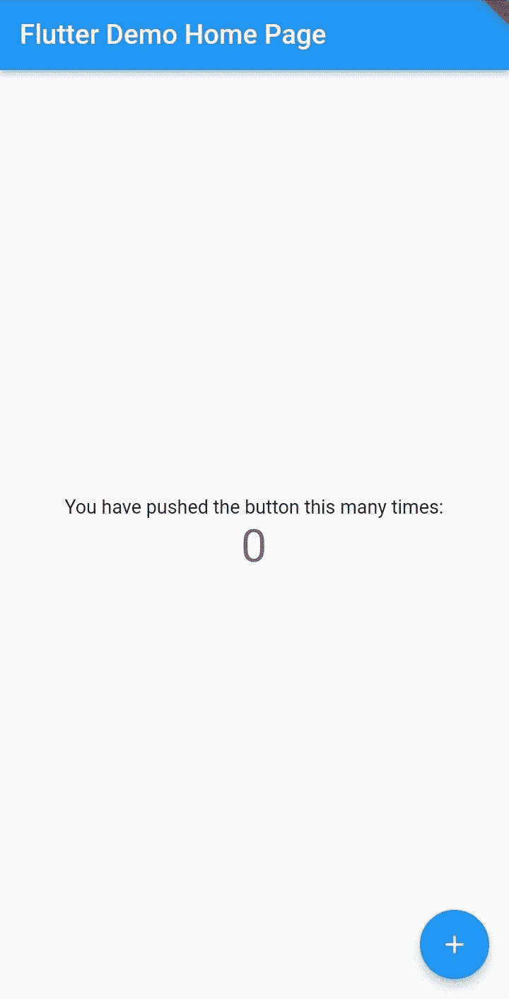
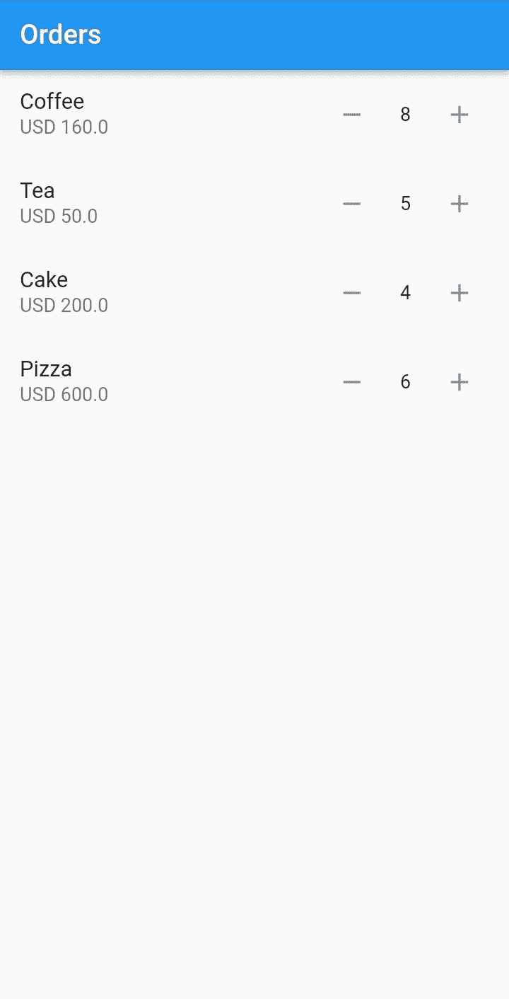
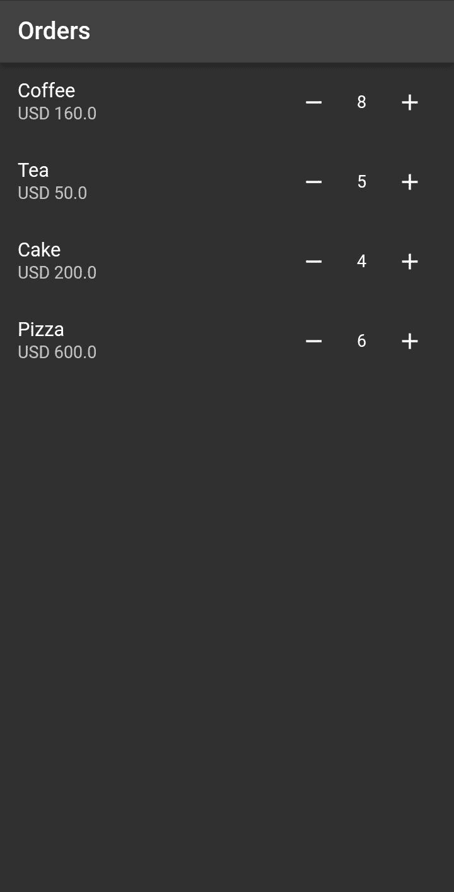

# 如何以及何时强制 Flutter 小部件重建

> 原文：<https://blog.logrocket.com/how-when-force-flutter-widget-rebuild/>

在 Flutter 中，状态被用来描述应用程序在任何给定时间点的行为。状态管理的概念允许您在应用程序中的屏幕和小部件之间共享数据，Flutter 将所有东西都描述为以树形结构组织的小部件。

你需要理解的主要事情是你如何将数据注入到颤振树中。在这种情况下，Flutter 会检查一个小部件的当前状态，并与树中的其他小部件进行比较。如果它发现任何数据变化，它将重新构建它的小部件，并将新数据设置到当前的小部件树。

这样，Flutter 将重绘它的 UI 并显示应用程序的当前状态。在抖动中改变状态总是会导致 UI 重新构建自己。

然而，这种情况并不总是百分之百有效。Flutter 可能无法将此状态显示到当前的小部件树中。这意味着 Flutter 不会重绘自己，当前的小部件也不会在适当的时候重新构建。因此，您需要强制该特定小部件进行重建。

在本文中，我们将研究如何以及何时强制 Flutter 小部件进行重建。在这种情况下，我们将创建一个简单的订单应用程序来指导我们。

### 内容

## 设置应用程序

在工作目录中打开终端，运行以下命令来初始化应用程序:

```
Flutter create orders_app

```

安装过程完成后，导航到新创建的目录:

```
cd orders_app

```

通过运行以下命令启动开发服务器:

```
Flutter run

```

您的应用程序应该可以从模拟器或电话设备上成功启动。



### 实现订单的列表视图

让我们从更改应用程序名称开始。导航到`lib/main.dart`文件，在`MyApp`类中，编辑`MaterialApp`小部件，如下所示:

```
MaterialApp(
    title: 'Orders',
    theme: ThemeData(
        primarySwatch: Colors.blue,
    ),
    debugShowCheckedModeBanner: false,
    // remove the debug banner
    home: const MyHomePage(title: 'Orders'),
);

```

接下来，创建一个`Order`类来定义订单的结构:

```
class Order {
  Order(this.id, this.name, this.price, this.quantity, this.date);
  int id;
  String name;
  int quantity;
  double price;
  DateTime date;
}

```

在`_MyHomePageState`类中，创建一个虚拟订单列表:

```
final List<Order> _orders = [
  Order(1, 'Coffee', 20.00, 1, DateTime(2020, 1, 1)),
  Order(2, 'Tea', 10.00, 1, DateTime(2020, 1, 2)),
  Order(3, 'Cake', 50.00, 1, DateTime(2020, 1, 3)),
  Order(4, 'Pizza', 100.00, 1, DateTime(2020, 1, 4)),
];

```

然后，删除`Column`小部件的当前子小部件，并使用`ListView`小部件呈现一个`Expanded`小部件来显示订单:

```
Expanded(
    child: ListView.builder(
    itemCount: _orders.length,
    itemBuilder: (context, index) {
        final order = _orders[index];
        return ListTile(
        title: Text(order.name),
        subtitle: Text('USD ${order.price}'),
        trailing: Row(
            mainAxisSize: MainAxisSize.min,
            children: <Widget>[
            const IconButton(
                onPressed: null,
                icon: Icon(Icons.remove)),
            const SizedBox(width: 15),
            Text('${order.quantity}'),
            const SizedBox(width: 15),
            const IconButton(
                onPressed: null,
                icon: Icon(Icons.add)),
            ],
        ),);
    },),
)

```

在您的终端上按下`R`重新加载您的开发服务器。您的应用程序现在应该呈现如下图所示的订单。


### 更新订单

为了更新订单，我们将更新订单的数量，这也将更新其价格。这里有两个实例:增量和减量。

在 rendering 类中，创建一个增加订单数量的`void`函数:

```
void incrementQuantity(Order order) {
  double initialPrice = order.price / order.quantity;
  // the original price
  order.quantity++;
  // increment the quantity
  order.price = initialPrice * order.quantity;
  // change the price.
}

```

类似地，创建一个减少订单数量的`void`函数:

```
void decrementQuantity(Order order) {
  if (order.quantity > 1) {
    // Check if the quantity is greater than one
    double initialPrice = order.price / order.quantity;
    // orginal price
    order.quantity--;
    // decrement the quantity
    order.price = initialPrice * order.quantity;
    // change the price
  }
}

```

将函数分别追加到`onPressed`事件处理程序中:

```
return ListTile(
    title: Text(order.name),
    subtitle: Text('USD ${order.price}'),
    trailing: Row(
        mainAxisSize: MainAxisSize.min,
        children: <Widget>[
        IconButton(
            onPressed: () => decrementQuantity(order),
            icon: const Icon(Icons.remove)),
        const SizedBox(width: 15),
        Text('${order.quantity}'),
        const SizedBox(width: 15),
        IconButton(
            onPressed: () => incrementQuantity(order),
            icon: const Icon(Icons.add)),
        ],
    ),
);

```

重新加载您的开发服务器并测试功能。

按下 **+** 和**–**图标，您会发现数量没有变化，价格也没有变化。这是因为我们没有更新保存数据的应用程序的当前状态。

更新状态将强制一个`ListTile`小部件重新构建并显示新的数量和价格。

Flutter 让你进入`setState()`。在这种情况下，我们必须确保`setState()`有新的值。当`setState()`被调用时，Flutter 将知道获取这些新值，并标记需要重建的小部件。

为了确保我们正在更新状态，我们将对增量和减量函数进行以下更改:

```
void incrementQuantity(Order order) {
  double initialPrice = order.price / order.quantity;
  setState(() {
    // updating the state
    order.quantity++;
    order.price = initialPrice * order.quantity;
  });
}

void decrementQuantity(Order order) {
  if (order.quantity > 1) {
    double initialPrice = order.price / order.quantity;
    setState(() {
      // updating the state
      order.quantity--;
      order.price = initialPrice * order.quantity;
    });
  }
}

```

这确保了`setState()`方法中的所有内容都将与旧值进行比较。Flutter 将看到一些值已经改变，然后将它们显示到相应的小部件中。

为了测试这一点，重新加载开发服务器并进行测试。这次，当您按下 **+** 和**–**图标时，数量和价格会相应更新。



让我们设置一个有状态的小部件，看看如何使用键来重建小部件。有时，Flutter `setState()`可以被调用，但是不能在屏幕上显示变化。在这种情况下，小部件的内部状态已经改变。

这意味着新状态被保留下来，并且可以被访问。颤振小部件的状态是有状态的。当生成新值时，将在小部件树中生成一个新的小部件。这样，每个新生成的小部件都会生成一个新的密钥。因为它的状态已经被保留，所以我们可以使用一个键来访问新的小部件，并强制重新构建以在屏幕上显示新的状态。

Flutter UI 使用不同的键，如唯一键、值键和对象键。让我们看看如何在 Flutter 中使用它们并强制小部件重新构建。

我们需要做以下修改，以便在我们现有的应用程序中使用键。将呈现每个订单的现有`ListTile`小部件分离为有状态小部件，如下所示:

```
class OrderCard extends StatefulWidget {
  final Order order;
  // Order
  final Key orderKey;
  // key
  const OrderCard(this.order, this.orderKey) : super(key: orderKey);

  @override
  State<OrderCard> createState() => OrderCardState();
}

class OrderCardState extends State<OrderCard> {
  late Order order;
  @override
  void initState() {
    super.initState();
    order = widget.order;
    // Get the order
  }

  void incrementQuantity(Order order) {
    double initialPrice = order.price / order.quantity;
    setState(() {
      order.quantity++;
      order.price = initialPrice * order.quantity;
    });
  }

  void decrementQuantity(Order order) {
    if (order.quantity > 1) {
      double initialPrice = order.price / order.quantity;
      setState(() {
        order.quantity--;
        order.price = initialPrice * order.quantity;
      });
    }
  }

  @override
  Widget build(BuildContext context) {
    return ListTile(
      title: Text(order.name),
      subtitle: Text('USD ${order.price}'),
      trailing: Row(mainAxisSize: MainAxisSize.min, children: <Widget>[
        Row(mainAxisSize: MainAxisSize.min, children: <Widget>[
          IconButton(
              onPressed: () => decrementQuantity(order),
              icon: const Icon(Icons.remove)),
          const SizedBox(width: 15),
          Text('${order.quantity}'),
          const SizedBox(width: 15),
          IconButton(
              onPressed: () => incrementQuantity(order),
              icon: const Icon(Icons.add)),
        ])
      ]),
    );
  }
}

```

当您想要将数据从父部件传递到子部件时，设置一个构建方法来比较返回的前一个部件(父部件)和新部件(子部件)。这里的一个重要部分是我们如何更新这些新的数量和价格值。

* * *

### 更多来自 LogRocket 的精彩文章:

* * *

当您运行应用程序时，`setState()`将无法重新构建小部件。在这个例子中，`initState()`只被调用一次。这意味着点击 **+** 或**–**图标的结果不会显示在屏幕上。

然而，这种点击总是会执行`setState()`并将新值传递给小部件树。结果没有显示出来，但是调用`setState()`已经触发了变化。新的状态被保留下来，可以用每个新部件生成的密钥来访问。

### 使用唯一的密钥

将父部件上的`_orders`更新为部件列表，如下所示:

```
final List<Widget> _orders = [
  OrderCard(Order(1, 'Coffee', 20.00, 1, DateTime(2020, 1, 1)), UniqueKey()),
  OrderCard(Order(2, 'Tea', 10.00, 1, DateTime(2020, 1, 2)), UniqueKey()),
  OrderCard(Order(3, 'Cake', 50.00, 1, DateTime(2020, 1, 3)), UniqueKey()),
  OrderCard(Order(4, 'Pizza', 100.00, 1, DateTime(2020, 1, 4)), UniqueKey()),
];

```

对于上面的例子，我们传递一个`UniqueKey`作为关键道具。这将更新返回的新状态。

现在，改变`orders`在构建函数上的呈现方式:

```
body: Center(
    child: Column(
      mainAxisAlignment: MainAxisAlignment.start,
      children: _orders,
    ),
)

```

在上面的代码中，我们没有使用`ListView Builder`，因为我们已经有了一个小部件列表。

重新加载开发服务器以加载应用程序。您的应用程序应该对新的变化做出响应。每次点击图标，Flutter 都会刷新按键，强制小部件重新构建。

### 使用数值键

要从值键更改为唯一键，请更新小部件的`_orders`列表，如下所示:

```
final List<Widget> _orders = [
  OrderCard(Order(1, 'Coffee', 20.00, 1, DateTime(2020, 1, 1)),
      const ValueKey('coffee')),
  OrderCard(
      Order(2, 'Tea', 10.00, 1, DateTime(2020, 1, 2)), const ValueKey('Tea')),
  OrderCard(
      Order(3, 'Cake', 50.00, 1, DateTime(2020, 1, 3)), const ValueKey('Cake')),
  OrderCard(Order(4, 'Pizza', 100.00, 1, DateTime(2020, 1, 4)),
      const ValueKey('Pizza')),
];

```

从上面开始，我们向`ValueKey`构造函数提供一个特定的值来标识订单。
重新加载您的应用程序以反映更改。体验应该和之前的类似。

### 使用对象键

要使用对象键代替值键，将`ValueKey`构造函数更改为`ObjectKey`，如下所示:

```
final List<Widget> _orders = [
  OrderCard(Order(1, 'Coffee', 20.00, 1, DateTime(2020, 1, 1)),
      const ObjectKey('Coffee')),
  OrderCard(
      Order(2, 'Tea', 10.00, 1, DateTime(2020, 1, 2)), const ObjectKey('Tea')),
  OrderCard(Order(3, 'Cake', 50.00, 1, DateTime(2020, 1, 3)),
      const ObjectKey('Cake')),
  OrderCard(Order(4, 'Pizza', 100.00, 1, DateTime(2020, 1, 4)),
      const ObjectKey('Pizza')),
];

```

在上面的代码中，我们为`ObjectKey`提供了该项目的唯一标识符。

刷新开发服务器进行测试。行为应该类似于前面的实例，即使用唯一的值键。

在某些情况下，您可能需要您的应用程序重新绘制所有的小部件。这主要适用于设置带有本地或主题设置的应用程序。让我们使用主题案例，看看 Flutter 是如何重建所有小部件的。

在`MyApp`类中，向返回的`MaterialApp`小部件添加以下主题属性:

```
return MaterialApp(
    title: 'Orders',
    theme: ThemeData(brightness: Brightness.light), 
    // light theme
    darkTheme: ThemeData(brightness: Brightness.dark), 
    //dark theme
    debugShowCheckedModeBanner: false,
    home: const MyHomePage(title: 'Orders'),
);

```

以上，我们针对的是`light theme`和`dark theme`的亮度等级。

要显示这两个主题中的任何一个，向`MaterialApp`小部件添加`themeMode`属性:

```
return MaterialApp(
    title: 'Orders',
    theme: ThemeData(brightness: Brightness.light),
    // light theme
    darkTheme: ThemeData(brightness: Brightness.dark),
    // dark theme
    themeMode: ThemeMode.dark,
    // dark mode
    debugShowCheckedModeBanner: false,
    home: const MyHomePage(title: 'Orders'),
);

```

重新加载您的开发服务器并观察变化。



属性将导致应用程序的完全重建，以符合指定的主题，如上所示。

## 结论

恭喜你！你现在可以重建一个小部件，即使 Flutter 无法重建。

Flutter 使用`setState()`来引用状态对象并识别状态的任何变化。这样，您可以跟踪这些更改并重新构建您的应用程序。如果失败，密钥将在强制重建任何保存的状态中扮演重要角色。

当涉及到跨窗口小部件树保存状态时，键是理想的。这个用例通常在更新一组相同的小部件时应用，例如在一个列表上。我们已经演示了如何使用顺序列表来实现预期的目标。

## 使用 [LogRocket](https://lp.logrocket.com/blg/signup) 消除传统错误报告的干扰

[](https://lp.logrocket.com/blg/signup)

[LogRocket](https://lp.logrocket.com/blg/signup) 是一个数字体验分析解决方案，它可以保护您免受数百个假阳性错误警报的影响，只针对几个真正重要的项目。LogRocket 会告诉您应用程序中实际影响用户的最具影响力的 bug 和 UX 问题。

然后，使用具有深层技术遥测的会话重放来确切地查看用户看到了什么以及是什么导致了问题，就像你在他们身后看一样。

LogRocket 自动聚合客户端错误、JS 异常、前端性能指标和用户交互。然后 LogRocket 使用机器学习来告诉你哪些问题正在影响大多数用户，并提供你需要修复它的上下文。

关注重要的 bug—[今天就试试 LogRocket】。](https://lp.logrocket.com/blg/signup-issue-free)