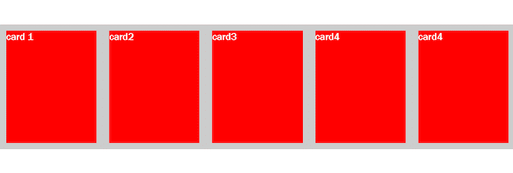
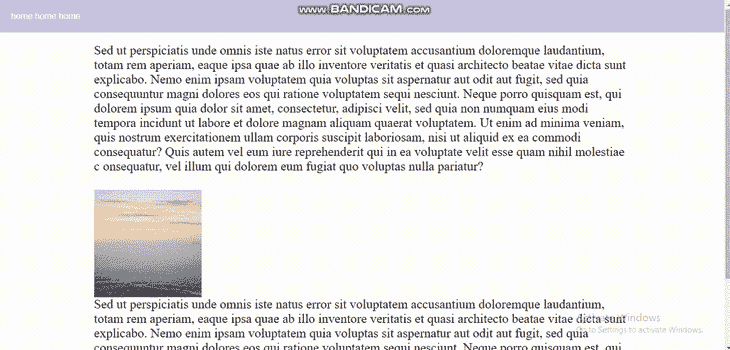
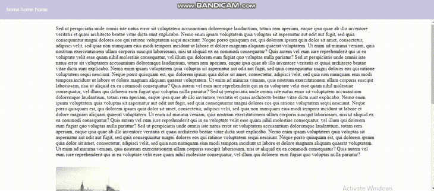
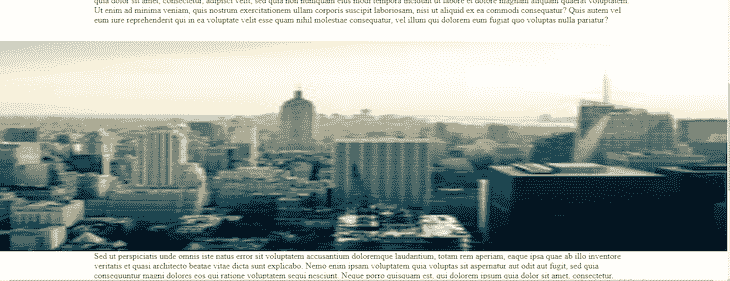
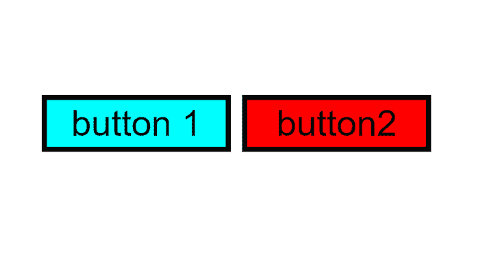
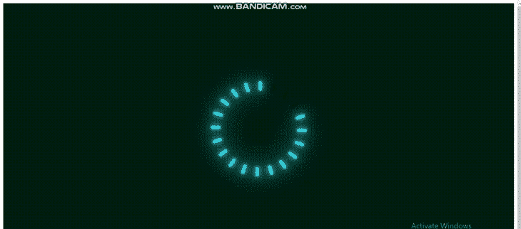

# 如何以及何时使用 CSS calc():示例教程

> 原文：<https://blog.logrocket.com/how-when-use-css-calc-tutorial-examples/>

你听说过或者用过 CSS `calc()`函数吗？也许您听说过它，但从未尝试过，或者尝试过使用它，但在使用过程中遇到了一些问题。这本指南可以帮助你。

CSS `calc()`是帮助你优化网页的好工具。在本教程中，我们将看看 CSS `calc()`函数，为什么它有用，以及如何在您的项目中使用它。我们将讨论以下内容:

让我们开始吧。

## CSS `calc()`函数是什么？

`calc()`函数允许您在指定 CSS 属性值时执行计算。它对于计算[长度](https://developer.mozilla.org/en-US/docs/Web/CSS/length)、[百分比](https://developer.mozilla.org/en-US/docs/Web/CSS/percentage)、[时间](https://developer.mozilla.org/en-US/docs/Web/CSS/time)、[数字](https://developer.mozilla.org/en-US/docs/Web/CSS/number)、[整数](https://developer.mozilla.org/en-US/docs/Web/CSS/integer)、[频率](https://developer.mozilla.org/en-US/docs/Web/CSS/frequency)、[角度](https://developer.mozilla.org/en-US/docs/Web/CSS/angle)等特别有用。

CSS `calc()`函数的超能力之一是能够组合不同的单元。这个函数可以执行预处理程序不能执行的数学计算。

[CSS 中的预处理器](https://blog.logrocket.com/how-to-write-reusable-css-with-sass/)只能组合有固定关系的单位，比如角度单位、时间单位、频率单位、分辨率单位、特定长度单位。

现在让我们检查 CSS `calc()`语法:

```
calc( Expression)

```

`calc()`函数将单个表达式作为其参数。然后将表达式的结果用作值。它可以采用任何形式，并使用以下任何运算符，遵循标准的运算符优先级规则。

`calc()`函数使用了四个基本运算符:

添加`+`:

```
calc(50px + 50px)

```

减法`–`:

```
calc(100% - 30px)

```

分部`/`:

```
calc(100% / 2)

```

乘法运算`*`:

```
calc(100vh * 2)

```

让我们看一些使用 CSS `calc()`函数的基本例子。然后，我们将探索关于这个函数的一些需要注意的事情，之后我们将深入一些更复杂的例子。

## 使用`calc()`在 CSS 中进行单位转换的示例

使用 CSS `calc()`函数，我们可以将一个没有单位的值乘以您想要转换成的单位类型，从而转换成一个有单位的值。这对于 CSS 变量很有用，如下例所示:

```
.class {
  --fav-num: 3;
  width: calc(var(--fav-num) * 1px); // 3px
}

```

在这个例子中，我们给数字`3`——它没有附加单元——分配了 CSS 变量`--fav-num`。然后我们用它来得到一个新的单位的`width`值，通过乘以`1px`得到`3px`。

## 用`calc()`转换字体大小的例子

假设我们有一个场景，我们希望段落的字体在桌面上很大，但在移动屏幕上很小。当然， [CSS 媒体查询可以帮助](https://blog.logrocket.com/using-css-media-queries-react-fresnel/)，但是`calc()`函数也等于任务，所以我们不会需要使用媒体查询。

让我们看看进展如何:

```
p {
    font-family: Arial, Helvetica, sans-serif;
    font-size: calc(10px + 5vw);
}

```

这将允许我们的字体在移动视图中变小，并在我们增加屏幕尺寸或在桌面视图中恢复正常。

请注意，如果您的字体对于桌面视图来说已经很小了，就不应该使用这种方法；在这种情况下，让移动视图的字体变得更小是没有意义的。

## 关于 CSS `calc()`函数需要注意的一些事情

现在让我们来看看使用 CSS `calc()`函数时需要注意的一些事情。

首先，当编写`calc()`函数语法时，我们必须在每个操作之间包含一个空格——尤其是在使用`+`和`–`操作符时——否则我们的表达式将无效。考虑下面的例子:

```
calc(50% -4px)

```

上面的表达式是无效的，因为我们没有在操作符和长度之间包含一个空格，使得长度看起来是负数。要更正该表达式，我们需要将它写成如下形式:

```
calc(50% - 4px)

```

注意，尽管`*`和`/`操作符不需要空格，但是包含空格是允许的。因此，建议包含空格以保持一致。

关于 CSS `calc()`函数，还有一些事情需要注意:

*   它不适用于媒体查询
*   当您除以零时，HTML 解析器会生成一个错误
*   可以嵌套`calc()`功能

让我们深入一些例子。

## 使用`calc()`在 CSS 中调整位置和长度的示例

为了理解如何使用 CSS `calc()`函数调整位置和长度，让我们从制作几张卡片并把它们放入一个容器开始。

对于 HTML，您将需要以下内容:

```
 <div class="container">
       <div class="card"><p>card 1</p></div>
       <div class="card"><p>card2</p></div>
       <div class="card"><p>card3</p></div>
       <div class="card"><p>card4</p></div>
       <div class="card"><p>card4</p></div>
    </div>

```

您的 CSS 代码应该如下所示:

```
*{
    margin: 0;
   padding: 0;
   box-sizing: border-box;
}
body{
    display: flex;
    justify-content: center;
    align-items: center;
    min-height: 100vh;
}
.container{
    position: relative;
    display: flex;
    width: 1000px;
    height: 200px;
    background:#ccc
}
 .card{
    position: relative; 
    min-width: 200px;
    height: 200px;
    background:#FF0000;
    margin: 10px 10px 10px 10px;
    color: white;
    font-family: 'Franklin Gothic Medium', 'Arial Narrow', Arial, sans-serif;
}

```

结果是:


你注意到我们的红色卡片与灰色容器不一致了吗？现在让我们通过在我们的卡内的`min-width`和`height`上使用 CSS `calc()`函数来介绍它:

```
 min-width: calc(calc(100% / 5) - 20px);
 height: calc(100% - 20px);

```

对于我们的`min-width`，我们将一个`calc()`函数嵌套在另一个`calc()`函数中。[嵌套的 CSS 函数](https://blog.logrocket.com/native-css-nesting/)用于将屏幕的全宽(`100%`)除以`5`，然后将结果乘以`20px`以获得我们的`min-width`的最终值。

对于我们的高度，我们从 100%的高度中减去顶部和底部边距的总值(即`20px`)，得到一个完美对齐的框。

结果是:



如您所见，红色卡片现在已经完美地放置在我们的容器中！

我们也可以偷偷摸摸地使用 CSS `calc()`函数。让我们在下一个例子中看看如何实现，我们将在一个示例博客中探索使用这个函数的两种情况。

## 在示例博客中使用 CSS `calc()`的不同方式

对于我们的下一个例子，我创建了一个简单的示例博客，带有一个滚动条、一些虚拟段落和一个图像。我们将使用这个示例博客来解释我们可以使用 CSS `calc()`函数的情况。

要设置我们的示例博客，我们的 HTML 应该如下所示:

```
<header>
      <nav>
        <span>home</span>
        <span>about</span>
        <span>contact</span>
      </nav>
    </header>
    <div class="container">
      <div class="blog-container">
        <section class="section">
          Sed ut perspiciatis unde omnis iste natus error sit voluptate
          accusantium doloremque laudantium, totam rem aperiam, eaque 
          ab illo inventore veritatis et quasi architecto beatae vitae 
          dsunt explicabo. Nemo enim ipsam voluptatem quia voluptas sit
          aspernatur aut odit aut fugit, sed quia consequuntur magni do
          qui ratione voluptatem sequi nesciunt. Neque porro quisquam e
          dolorem ipsum quia dolor sit amet, consectetur, adipisci veli
          quia non numquam eius modi tempora incidunt ut labore et dolo
          aliquam quaerat voluptatem. Ut enim ad minima veniam, quis n
          exercitationem ullam corporis suscipit laboriosam, nisi ut al
          ea commodi consequatur? Quis autem vel eum iure reprehenderit
          ea voluptate velit esse quam nihil molestiae c onsequatur, ve
          qui dolorem eum fugiat quo voluptas nulla pariatur?
          
        </section>
        <section>
          Sed ut perspiciatis unde omnis iste natus error sit voluptat
          accusantium doloremque laudantium, totam rem aperiam, eaque i
          ab illo inventore veritatis et quasi architecto beatae vitae 
          sunt explicabo. Nemo enim ipsam voluptatem quia voluptas sit
          aspernatur aut odit aut fugit, sed quia consequuntur magni do
          qui ratione voluptatem sequi nesciunt. Neque porro quisquam e
          dolorem ipsum quia dolor sit amet, consectetur, adipisci veli
          quia non numquam eius modi tempora incidunt ut labore et dolo
          aliquam quaerat voluptatem. Ut enim ad minima veniam, quis n
          exercitationem ullam corporis suscipit laboriosam, nisi ut a
          ea commodi consequatur? Quis autem vel eum iure reprehenderit
          ea voluptate velit esse quam nihil molestiae consequatur, vel
          qui dolorem eum fugiat quo voluptas nulla pariatur? Sed ut
        </section>
      </div>
    </div>

```

我们的 CSS 代码应该是这样的:

```
*,
*::before,
*::after{ 
  margin: 0;
  padding: 0;
    box-sizing: border-box;
}
header{
  width: 100%;
  height: 60px;
  padding: 20px;
  background: #CBC3E3;
  color: white;
  font-family: Arial, Helvetica, sans-serif;
  display: flex;
  align-items: center;
  box-sizing: border-box;
}
.blog-container{
 font-size: 1.5rem;
  max-width: 1000px;
  width: calc(90vw -20px) ;
margin: 20px auto;
}

  img{
    display: block;
    max-width: 100%;
  padding-top:30px;
  }

```

既然我们的示例博客已经建立，我们可以开始探索 CSS `calc()`函数的用例。

### 使用 CSS `calc()`来固定导航条的位置

我们在博客上有一个导航条，但是正如你在下面看到的，右边的滚动条和它重叠了:



如果我们希望导航条的位置是固定的，这样滚动条就不会和它重叠，该怎么办？有多种方法可以实现这一点，包括使用 CSS `calc()`函数:

```
.container{
  height: calc(100vh - 60px) ;
overflow-y: auto;
}

```

结果是:



在上面的代码中，我们在 CSS 中创建了一个容器选择器，并赋予它一个视图高度`100`——我们整个窗口的视口——然后从中减去我们的标题高度。除非设置溢出值，否则我们的更改不会生效。

### 使用 CSS `calc()`添加全幅图像

假设我们希望博客中的图像填满博客内容两边的空间，而不是停留在博客容器的边缘。同样，我们可以使用 CSS `calc()`函数来实现:

```
.my-image{
  max-width: 100vw;
  width: 100vw;
  margin: 0 calc(-50vw + 50%);
  height: 70vh;
}

```

结果是:



在上面的代码中，我们将顶部和底部的边距设置为`0`。然而，在左边和右边，我们做了一些不寻常的事情:我们使用`calc()`函数给它一个负的视口宽度(`- 50vw`)，然后添加 50%回来。

结果，我们的图像充满了整个视口。尽管它与我们的部分位于同一个容器中，但我们的图像现在占据了屏幕的整个宽度。

## CSS 变量使用`calc()`函数的例子

使用 CSS 变量的`calc()`,我们可以定义一个值，然后用数学方法修改它，从而得到一个对我们有用的新值。让我们看一个例子。

假设我们有两个按钮，每个按钮都有自己的类，如下所示:

```
 <div class="container">
   <button class="success">button 1</button> 
   <button class="danger">button2</button>
   </div>

```

我们可以使用 CSS 变量定义一种颜色，然后使用 CSS `calc()`函数派生另一种颜色。让我们为按钮创建一个颜色变量。我们将使用`hsl`符号，它采用变量`(hue, saturation, lightness)`来指定一个颜色值:

```
:root{
    --hue:180;
}
.success{
 background-color: hsl(calc(var(--hue)), 100%, 50%);
}
.danger{
    background-color: hsl(calc(var(--hue) - 180), 100%, 50%);
}

```

结果:



通过给我们的根色调一个特定的值，你可以看到我们可以在我们的`hsl`符号中使用`calc()`函数来为第二个按钮派生另一种颜色。如果我们改变我们的根色调的值，第二个按钮就会产生另一种颜色。

## 动画可以用 CSS `calc()`吗？

我们当然可以使用 CSS `calc()`函数来制作动画。让我们创造一个例子！从下面的 HTML 开始:

```
<section>
      <div class="animate-loading">
        <div class="block" style="--i: 1"></div>
        <div class="block" style="--i: 2"></div>
        <div class="block" style="--i: 3"></div>
        <div class="block" style="--i: 4"></div>
        <div class="block" style="--i: 5"></div>
        <div class="block" style="--i: 6"></div>
        <div class="block" style="--i: 7"></div>
        <div class="block" style="--i: 8"></div>
        <div class="block" style="--i: 9"></div>
        <div class="block" style="--i: 10"></div>
        <div class="block" style="--i: 11"></div>
        <div class="block" style="--i: 12"></div>
        <div class="block" style="--i: 13"></div>
        <div class="block" style="--i: 14"></div>
        <div class="block" style="--i: 15"></div>
        <div class="block" style="--i: 16"></div>
        <div class="block" style="--i: 17"></div>
        <div class="block" style="--i: 18"></div>
        <div class="block" style="--i: 19"></div>
        <div class="block" style="--i: 20"></div>
      </div>
    </section>

```

我们的 CSS 应该是这样的:

```
root
*{
    margin: 0;
    padding: 0;
    box-sizing: border-box;
    font-family: 'Courier New', Courier, monospace;
}
section{
    display: flex;
    justify-content: center;
    align-items: center;
    min-height: 100vh;
    background: #001d10;
}
.animate-loading{
     position: relative;
     width: 250px;
     height: 250px;
}
.animate-loading .block{
    position: absolute;
    width: 8px;
    height: 25px;
    background: #050c09;
    left: 50%;
    border-radius: 8px;
    transform: rotate(calc(18deg * var(--i)));
    transform-origin: 0 125px ;
    animation: animate 1.9s ease-in-out infinite;
    animation-delay: calc(0.05s * var(--i));
}
@keyframes animate {
    0%,50%{
         background: #050c09;
         box-shadow: none;
    }
    50.1%,100%{
        background: #38d2dd;
        box-shadow: 0 0 5px #38d2dd,
                    0 0 15px #38d2dd,
                    0 0 30px #38d2dd,
                    0 0 60px #38d2dd,
                    0 0 90px #38d2dd;

    }
}

```

结果是:



正如我们在代码中看到的，CSS `calc()`函数在两个方面派上了用场:动画我们的旋转，以及我们的动画延迟。让我们仔细看看这两个区域。

```
transform: rotate(calc(18deg * var(--i)));

```

`18deg`的值来自于 360 度除以我们在 HTML 中创建的块数。然后，通过将`18deg`乘以变量的值，我们得到了`transform`的旋转值。

```
animation-delay: calc(0.05s * var(--i));

```

我们还在我们的`animation-delay`中使用了 CSS `calc()`函数，将`0.05s`乘以我们的变量。这用于指定动画开始前的延迟。

## `CSS calc()`的浏览器兼容性

虽然`calc()`在 CSS 中是一个有用的函数，但它只有在与我们的浏览器兼容时才有用。查看下表，了解该功能的浏览器兼容性:


你可以[查看 CanIUse](https://caniuse.com/calc) 了解 CSS `calc()`功能的浏览器兼容性的更多细节。

## 什么时候应该使用 CSS `calc()`函数？

很多时候我们需要 CSS `calc()`函数来拯救我们。它们包括:

*   当我们使用 CSS 变量时
*   为了导出新的值
*   对于不同单位之间的计算，这是预处理器做不到的
*   用于定位
*   对我们网站的结构和其他元素的调整
*   当我们想避免重复做同样的计算时

我们在本文中讨论的大多数例子都属于上述类别。

## 结论

有很多方法可以使用 CSS `calc()`函数。你甚至可以提出你的用例。CSS `calc()`函数确实是您应该尝试的东西。它是 web 开发人员工具箱中的一个重要工具。

如果你觉得这篇文章有帮助，请分享！

## 你的前端是否占用了用户的 CPU？

随着 web 前端变得越来越复杂，资源贪婪的特性对浏览器的要求越来越高。如果您对监控和跟踪生产环境中所有用户的客户端 CPU 使用、内存使用等感兴趣，

[try LogRocket](https://lp.logrocket.com/blg/css-signup)

.

[](https://lp.logrocket.com/blg/css-signup)[https://logrocket.com/signup/](https://lp.logrocket.com/blg/css-signup)

LogRocket 就像是网络和移动应用的 DVR，记录你的网络应用或网站上发生的一切。您可以汇总和报告关键的前端性能指标，重放用户会话和应用程序状态，记录网络请求，并自动显示所有错误，而不是猜测问题发生的原因。

现代化您调试 web 和移动应用的方式— [开始免费监控](https://lp.logrocket.com/blg/css-signup)。