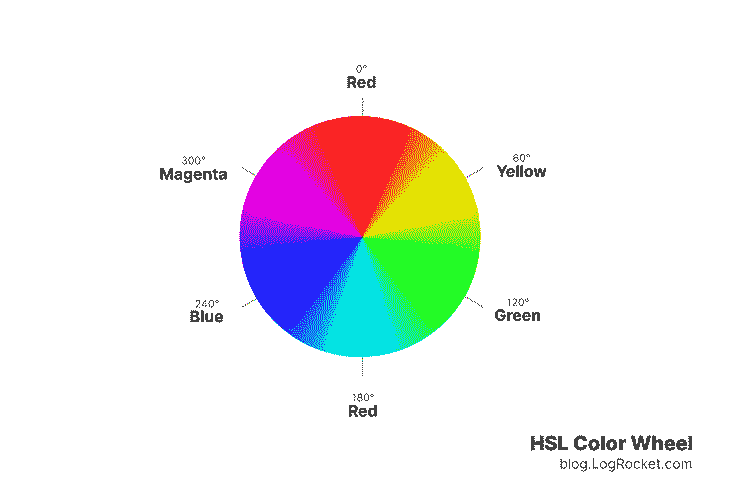
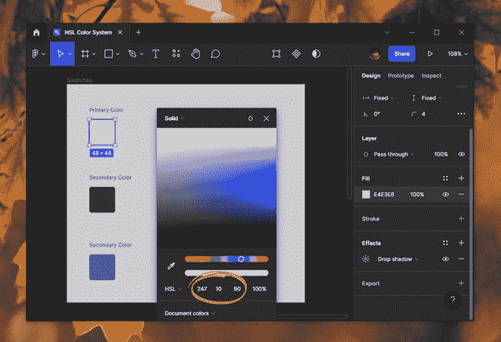
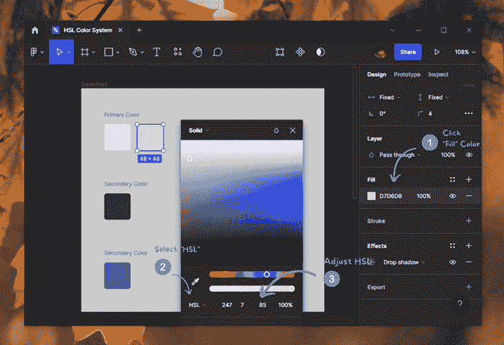
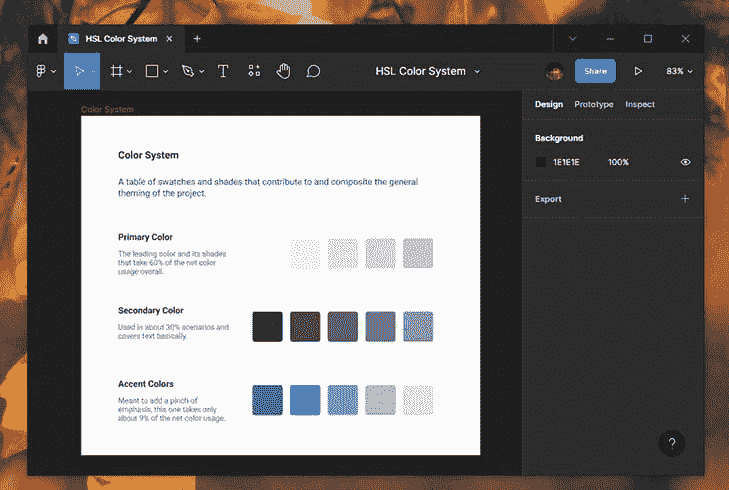
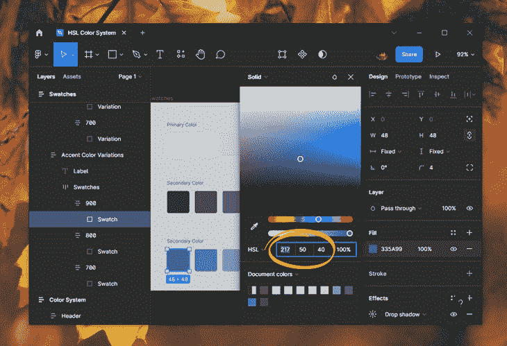

# HSL 和 HSLA vs. RGB 和 RGBA

> 原文：<https://blog.logrocket.com/hsl-hsla-vs-rgb-rgba-css/>

CSS 中的 HSL 颜色已经存在十多年了，但是我发现它们仍然经常没有被充分利用。尽管 HSL CSS 函数非常有用，但由于其有限的浏览器支持，许多开发人员都避免使用它。

随着浏览器对 HSL 颜色模型的支持越来越强，它在开发人员和设计人员中也越来越受欢迎。前端开发人员可能会发现熟悉 HSL 很有帮助，特别是在 Figma 和 CSS 中创建快速灵活的颜色变化。

本文解释了 CSS 中 HSL 和 RGB 之间的区别，以及如何使用 CSS HSL 函数来创建灵活的颜色系统。

## CSS 中的颜色概述

如果你知道 CSS 是如何工作的，你可能也知道命名颜色、十六进制颜色和 RGB 颜色。[这三个都代表 CSS 中的颜色及其用法](https://blog.logrocket.com/advanced-guide-setting-colors-css/)。

命名颜色是预定义的颜色值，如`black`、`white`、`red`、`green`等。命名颜色的问题是它们是有限的，没有办法调整它们来获得各种颜色。

十六进制模型没有这种义务，允许您使用十六进制代码选择颜色。然而，该模型本身缺乏颜色处理的灵活性。这就是 RGB 和 HSL 介入的地方。

## RGB 和 HSL 的区别

命名的颜色易于阅读，但不够灵活，无法产生变化。十六进制值的颜色更差，可读性差，几乎不可能有颜色变化。

下面的例子说明了命名颜色和十六进制颜色之间的快速比较。它还显示了通过读取相应的十六进制颜色代码来预测颜色是多么困难。

参见 [CodePen](https://codepen.io) 上 Rahul ( [@_rahul](https://codepen.io/_rahul) )
在 CSS 中命名并十六进制颜色的笔[。](https://codepen.io/_rahul/pen/OJvqJvp)

这些问题很容易用 CSS 中的 RGB 和 HSL 函数来解决，但是在我们开始实现它们之前，让我们看看它们提供了什么。

## RGB 和 RGBA

[CSS](https://blog.logrocket.com/exploring-css-color-module-level-5/)中的 RGB 颜色函数允许你指定红、绿、蓝参数值来生成颜色。结果将是所有这三个值的混合。

所有这三个值可能在 0-255 之间变化，如果不参考色轮工具，很难预测结果。

CSS 中的 RGB 函数还有一个可选的第四个参数，负责最终颜色的不透明性。它通常使用 RGBA 函数来指定，但现代浏览器允许您在 RGB 函数本身中添加 alpha 值。

```
.selector {
  color: rgb(255, 0, 0); // Red or #ff0000
  color: rgba(255, 0, 0, .75); // Red with a 75% fill
  color: rgb(255 0 0 / 75%); // A shorthand to the `rgba()` function
}

```

前端开发人员经常匆忙使用 RGBA 来创建边框和更浅的颜色变化。这是为了避免计算红色、绿色和蓝色值以获得特定阴影或色调的繁琐任务。

下面的例子通过在深色之上实现白色的透明版本来演示这一点。这里的问题是颜色不纯，因为我们必须依靠填充不透明度来生成它们。

参见 [CodePen](https://codepen.io) 上 Rahul ( [@_rahul](https://codepen.io/_rahul) )
的笔 [颜色随 RGB Alpha](https://codepen.io/_rahul/pen/oNqVWVQ) 变化。

有些情况下，不透明的彩色版本可能不符合可访问性要求，总体上看起来不太好。例如，不透明的颜色很容易使元素的分层变得混乱。

另一个这样的用例可能是背景颜色的变化，需要许多其他调整，例如不透明的前景和文本颜色。

除此之外，你还需要使用色轮工具来获取合适的 RGB 值，以适应更暗的变化。

## 高铁和 HSLA

HSL color 函数允许您控制特定色调的饱和度和亮度，而不是像 RGB 那样处理不同的颜色值。

HSL 代表色调、饱和度和亮度。让我们通过检查它的三个主要组件来更深入地了解它。

色调是颜色的同义词，饱和度是指色调的强度或纯度。明度衡量给定色调中混合了多少黑色或白色。

使用 HSL，您可以通过角度(即度数)指定色调，通过百分比指定饱和度和亮度。带有饱和度和亮度的色调会给我们红色。类似地，一个`240°`色调与`50%`饱和度和亮度将产生一个紫蓝色的阴影。



在上面图表的帮助下，您可以记住 HSL 颜色模型的六个不同颜色区域，并通过相应地调整色调、饱和度和亮度来轻松创建颜色变化。我们将在下一节讨论这个问题。

下面是 HSL 颜色模型如何在 CSS 中使用`hsl`和`hsla`函数:

```
.selector {
  color: hsl(120, 50, 50); // A shade of green
  color: hsla(120, 50, 50, .45); // Green with a 75% fill
  color: hsl(120 50% 20% / 45%); // A shorthand to the `hsla()` function
}

```

## 为什么在 CSS 中使用 HSL？

正如上面所讨论的，web 上通常使用十六进制和 RGB 来表示颜色，但这两种颜色都不是最好的方式。

很难通过查看十六进制或 RGB 代码来预测颜色，因此很难用它们来创建颜色变化。HSL 通过将颜色表示为色调、饱和度和亮度来解决这个问题。这三者都是人类直觉感知的属性。

最棒的是，你可以在任何现代设计工具中使用 HSL，比如 Figma、Adobe XD 和 Sketch。在下一部分中，我们将使用 CSS 和一点 Figma 来体验使用 HSL 颜色模型创建和调整颜色值的简易性。

## 具有 HSL 的灵活颜色系统

对于 HSL，我们只需要一个值，就可以创建许多阴影或色调。诀窍在于调整给定色调的饱和度和亮度值。

让我们在 Figma 中挑选三种颜色样本，分别称为原色、次色和强调色。



原色是在我们的用户界面中占净颜色使用量大部分(60 %)的颜色。第二个占据了 30%的净面积，通常是文本。剩下的 10%可以是使用强调色的突出显示部分。

我选择了我认为符合我的 UI 需求的颜色。你也可以使用网上现成的配色方案。

让我们用原色，创建它的副本，并修改它的饱和度和亮度值，同时保持色调不变。



类似地，你可以创造更多这样的变化；下图描绘了相同的五种不同的阴影和色调。作为练习，你可以为给定的色调尝试更深和更浅的变化。



快速提示:总是用颜色对比检查插件检查你的颜色的对比和可访问性标准。

### CSS HSL 函数的颜色变化

确定色样的 HSL 值后，我们可以使用 CSS 自定义属性来不断地维护和重复选定的色调，即使我们修改饱和度和亮度来获得不同的阴影和色调。

从上面的 Figma 示例中，让我们选择强调色的色调，并使用 CSS HSL 函数创建一些颜色样本。



色调值为`217`，我们的强调色的饱和度为`50%`，亮度为`40%`。下面是我们如何在 CSS 中使用这些信息，并创建我们的主要原色样本:

```
:root {
  --accent-color-hue: 217;
  --accent-color-900: hsl(var(--accent-color-hue) 50% 40%);
}

```

类似地，我们可以像在 Figma 示例中那样，通过添加适当的饱和度和亮度值来添加更多变化:

```
:root {
  --accent-color-hue: 217;
  --accent-color-900: hsl(var(--accent-color-hue) 50% 40%);

  --accent-color-800: hsl(var(--accent-color-hue) 40% 50%);
  --accent-color-700: hsl(var(--accent-color-hue) 30% 60%);
}

```

如果你不喜欢设计，你仍然可以很容易地修改饱和度和亮度参数，并提出新的调色板。通过参考上一节分享的 HSL 色轮图，你可以更好地记住色彩色调区域。

所有这些变化都是纯粹的纯色。对于不透明的颜色，您总是可以指定 CSS HSL 函数的第四个参数。下面是使用 CSS HSL 函数和自定义属性创建和使用调色板的简单实现:

参见 [CodePen](https://codepen.io) 上的 Rahul ( [@_rahul](https://codepen.io/_rahul) )
的 Pen [带有 CSS HSL 函数和自定义属性](https://codepen.io/_rahul/pen/GRxLgax)的无时间调色板。

对颜色有敏锐眼光的人会自动挑选出好颜色。实现这一点的唯一方法是经常观察和使用颜色。如果你没有艺术或设计背景，我建议你在专业从事色彩工作之前，多读一些关于[色彩理论](https://en.wikipedia.org/wiki/Color_theory)的基础知识。

## 结论

就是这样！我们从简单的介绍开始，然后讨论了十六进制、RGB 和命名颜色。我们还了解了每种方法的注意事项。接下来，我们讨论 HSL 相对于其他三种颜色模型的优势。

我们讨论了如何在 Figma 中使用 HSL 来创建颜色变化，并学习了如何在 CSS 中使用它们。我们现在可以生成永恒的调色板，并将其纳入用户界面！

我希望你通过这篇教程学到了一些新的东西。如果你遇到困难，请在评论中告诉我。

## 你的前端是否占用了用户的 CPU？

随着 web 前端变得越来越复杂，资源贪婪的特性对浏览器的要求越来越高。如果您对监控和跟踪生产环境中所有用户的客户端 CPU 使用、内存使用等感兴趣，

[try LogRocket](https://lp.logrocket.com/blg/css-signup)

.

[](https://lp.logrocket.com/blg/css-signup)[https://logrocket.com/signup/](https://lp.logrocket.com/blg/css-signup)

LogRocket 就像是网络和移动应用的 DVR，记录你的网络应用或网站上发生的一切。您可以汇总和报告关键的前端性能指标，重放用户会话和应用程序状态，记录网络请求，并自动显示所有错误，而不是猜测问题发生的原因。

现代化您调试 web 和移动应用的方式— [开始免费监控](https://lp.logrocket.com/blg/css-signup)。