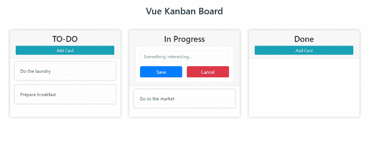
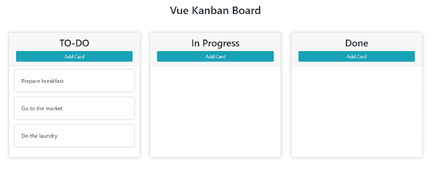

# HTML 5 拖放 API:教程

> 原文：<https://blog.logrocket.com/html-5-drag-and-drop-api-a-tutorial/>

在本教程中，我们将学习 [HTML 5 拖放 API](https://developer.mozilla.org/en-US/docs/Web/API/HTML_Drag_and_Drop_API) 。拖放 API 为 HTML 带来了可拖动的元素，使开发人员能够构建包含丰富 UI 元素的应用程序，这些元素可以从一个地方拖动到另一个地方。

为了了解 HTML 5 的拖放功能，我们将使用 [Vue.js](https://vuejs.org/) 构建一个简单的看板。

看板是一种项目管理工具，允许用户从开始到结束可视化地管理项目。像 Trello、Pivotal Tracker 和吉拉这样的工具就是看板。

## 先决条件

对于本教程，您需要以下内容:

1.  HTML 和 JavaScript 的基础知识
2.  Vue.js 2.x 的基础知识
3.  您机器上安装的 Vue CLI 4(或更高版本)
4.  您机器上安装的 [Node.js](https://nodejs.org/en/) 8.0.0 和 [npm](https://www.npmjs.com/)

## 设置看板板

看板将是一个 Vue CLI 应用程序。要创建新的应用程序，请运行以下命令:

```
vue create kanban-board

```

当提示选择预设时，选择仅包含[巴别](https://babeljs.io/)和[埃斯林特](https://eslint.org/)的默认预设。

安装完成后，删除默认组件`HelloWorld`，它是 Vue 在安装过程中创建的。另外，将`App`组件修改为空，只包含裸组件模板:

```
<template> <div></div> </template>
<script>
export default {
  name: 'App',
  components: {},
};
</script>
<style></style>

```

我们将使用 [Bootstrap](https://getbootstrap.com/) 进行造型，但是我们只需要 [Bootstrap CSS CDN](https://getbootstrap.com/docs/4.3/getting-started/introduction/) 。添加到 **public/index.html** 的`head`部分。

```
<head>
    <meta charset="utf-8">
    <meta http-equiv="X-UA-Compatible" content="IE=edge">
    <meta name="viewport" content="width=device-width,initial-scale=1.0">
    <link rel="icon" href="<%= BASE_URL %>favicon.ico">
    <link rel="stylesheet" href="https://stackpath.bootstrapcdn.com/bootstrap/4.5.2/css/bootstrap.min.css"
    integrity="sha384-JcKb8q3iqJ61gNV9KGb8thSsNjpSL0n8PARn9HuZOnIxN0hoP+VmmDGMN5t9UJ0Z" crossorigin="anonymous">
    <title><%= htmlWebpackPlugin.options.title %></title>
  </head>

```

## 在看板中构建 UI 组件

下面是看板板建成后的样子:



通常，看板有列和卡片。卡片是要执行的单个项目或任务，列显示特定卡片的状态。

我们将创建三个 Vue 组件:一个用于列，一个用于卡片，另一个用于创建新卡片。

### 创建卡组件

我们将创建的第一个组件是卡组件。首先，在`/component`目录中创建一个新文件`Card.vue`。

将以下内容添加到新创建的组件中:

```
<template>
  <div class="card">
    <div class="card-body">A Sample Card</div>
  </div>
</template>
<script>
export default {};
</script>
<style scoped>
div.card {
  margin-bottom: 15px;
  box-shadow: 0 0 5px #cccccc;
  transition: all ease 300ms;
  background: #fdfdfd;
}
div.card:hover {
  box-shadow: 0 0 10px #aaaaaa;
  background: #ffffff;
}
</style>

```

这将创建并样式化卡组件。我们还没有给这个组件添加任何可拖动的功能，因为这只是组件的框架。

### 添加卡组件

顾名思义，这个组件将负责创建新的卡片并将它们添加到列中。

在`/components`目录中创建一个`AddCard.vue`文件，并将以下内容添加到其中:

```
<template>
  <div class="">
    <button
      class="btn btn-sm btn-info w-100"
      v-if="!inAddMode"
      @click="inAddMode = true"
    >
      Add Card
    </button>
    <form action="#" class="card p-3" ref="form" v-else>
      <div class="form-group">
        <input
          type="text"
          name="title"
          id="title"
          class="form-control"
          placeholder="Something interesting..."
          v-model="cardData"
        />
      </div>
      <div class="d-flex justify-content-center">
        <button type="submit" class="btn w-50 btn-primary mr-3">Save</button>
        <button type="reset" class="btn w-50 btn-danger">
          Cancel
        </button>
      </div>
    </form>
  </div>
</template>
<script>
export default {
  data() {
    return {
      inAddMode: false,
      cardData: '',
    };
  },
  methods: {},
};
</script>
<style></style>

```

这方面的功能将在下一节中构建。

### 创建柱构件

这是我们将创建的最后一个组件。该组件将显示一个卡片列表，还将包含“添加卡片组件”,以便可以直接在列中创建新的卡片。

在组件目录中创建一个`Column.vue`文件，并添加以下代码:

```
<template>
  <div class="col-md-3 card column" ref="column">
    <header class="card-header">
      <h3 class="col">Column Name</h3>
    </header>
    <div class="card-list"></div>
  </div>
</template>
<script>
export default {};
</script>
<style scoped>
div.column {
  padding: 0;
  padding-bottom: 15px;
  margin: 0 15px;
  box-shadow: 0 0 10px #cccccc;
}
div.card-list {
  padding: 0 15px;
}
header {
  margin-bottom: 10px;
}
header h3 {
  text-align: center;
}
</style>

```

在添加功能和组合组件工作之前，这里有一个关于拖放功能在浏览器中如何工作的概述。

## 什么是 HTML 5 拖放 API？

当用户将鼠标移动到可拖动的元素上时，拖动操作开始，然后将该元素移动到可拖放的元素上。

默认情况下，可拖动的 HTML 元素只有图像和链接。要使其他元素可拖动，您需要显式地创建功能，或者通过向元素添加 draggable 属性，或者通过在 JavaScript 中选择元素并将 draggable 属性设置为`true`。

> 在元素上将 draggable 设置为`true`之后，您会注意到 draggable 属性已经被添加到元素中。

```
<!-- Making an element draggable in HTML -->
<div draggable="true">This is a draggable div in HTML</div>

<script>
// Making an element draggable in javascript
const div = document.querySelector('div');
div.draggable = true;
</script>

```

拖动元素的目的是将数据从页面的一部分转移到另一部分。

对于图像，传输的数据是图像 URL 或图像的 base 64 表示。对于链接，传输的数据是 URL。可以将链接移动到浏览器的 URL 栏，以便浏览器导航到该 URL。

同样，如果没有传输数据的能力，拖动元素将毫无用处。将通过拖动操作传输的数据存储在拖动数据存储中。可以通过`[DataTransfer](https://developer.mozilla.org/en-US/docs/Web/API/DataTransfer)` API 访问它，它提供了一种在拖放操作中存储和访问数据的方法。

`[DataTransfer](https://developer.mozilla.org/en-US/docs/Web/API/DataTransfer)`对象用于此目的，因为它提供了一个添加要通过拖放传输的项目的地方。

当拖动操作开始时(当调度`dragstart`事件时)，可以将数据添加到拖动数据存储中，并且只有在放下操作完成后(当调度`drop`事件时)，才可以接收数据。

从元素被拖动到被放下，在元素被放下后，被拖动的元素会触发两个事件:`dragstart`和`dragend`。

可拖动元素不能放在任何地方。正如我们需要显式地使一个元素可拖动一样，为了允许一个元素被删除，它需要支持删除。

要使一个元素支持下拉，我们需要监听`dragover`事件并阻止默认的浏览器动作。

```
<!-- Make a section drop-enabled -->
<section class="section"></section>
<script>
const section = document.querySelector('.section');
section.addEventListener('dragover', (e) => {
  e.preventDefault();
});
</script>

```

当元素被拖动到已启用拖放功能的元素上时，将在已启用拖放功能的元素上触发以下事件:

`Dragenter`:当一个元素被拖动到允许拖放的元素
`Dragover`上时触发一次:只要一个元素停留在允许拖放的元素
`Drop`上，就会连续触发:当被拖动的元素被放到允许拖放的元素上时触发。

> 重要的是要注意，存储在`DataTransfer`对象中的数据只能在 drop 事件被触发时访问，而不能在`dragenter`或`dragover`上访问。关于这方面的更多信息可以在找到[。](https://html.spec.whatwg.org/multipage/dnd.html#the-drag-data-store)

## 组成组件

在向组件添加拖放功能之前，让我们讨论一下`app state`。

这里的应用程序状态将存储在`App`组件中，然后可以作为 props 传递给`Column`组件。另一方面，`Column`组件在渲染时会将所需的道具传递给`Card`组件。

* * *

### 更多来自 LogRocket 的精彩文章:

* * *

修改`App.vue`以反映状态和组件组成:

```
// App.vue
<template>
  <div class="container-fluid">
    <h2 class="m-5">
      Vue Kanban Board
    </h2>
    <div class="row justify-content-center">
      <Column
        v-for="(column, index) in columns"
        :column="column"
        :key="index"
      />
    </div>
  </div>
</template>
<script>
import Column from './components/Column';
export default {
  name: 'App',
  components: {
    Column,
  },
  data() {
    return {
      columns: [
        {
          name: 'TO-DO',
          cards: [
            {
              value: 'Prepare breakfast',
            },
            {
              value: 'Go to the market',
            },
            {
              value: 'Do the laundry',
            },
          ],
        },
        {
          name: 'In Progress',
          cards: [],
        },
        {
          name: 'Done',
          cards: [],
        },
      ],
    };
  },
};
</script>
<style>
h2 {
  text-align: center;
}
</style>

```

在这里，我们导入了`Column`组件，并且，当使用存储在 state 中的数据作为`columns`对其进行循环时，我们将每一列的数据传递给`column`组件。在这种情况下，只有三列:“待办事项”、“进行中”和“完成”，每一列都有一组卡片。

接下来，更新`Column`组件以接收道具并正确显示:

```
// Column.vue
<template>
  <div class="col-md-3 card column" ref="column">
    <header class="card-header">
      <h3 class="col">{{ column.name }}</h3>
      <AddCard />
    </header>
    <div class="card-list">
      <Card v-for="(card, index) in column.cards" :key="index" :card="card" />
    </div>
  </div>
</template>
<script>
import Card from './Card';
import AddCard from './AddCard';
export default {
  name: 'Column',
  components: {
    Card,
    AddCard,
  },
  props: {
    column: {
      type: Object,
      required: true,
    },
  },
};
</script>

...

```

`Column`组件从`App`组件接收道具，并用道具呈现一个`Card`组件的列表。我们在这里还使用了`AddCard`组件，因为新卡应该能够被直接添加到一个列中。

最后，我们更新`Card`组件来显示从`Column`接收的数据。

```
// Card.vue
<template>
  <div class="card" ref="card">
    <div class="card-body">{{ card.value }}</div>
  </div>
</template>
<script>
export default {
  name: 'Card',
  props: {
    card: {
      type: Object,
      required: true,
    },
  },
};
</script>

```

`Card`组件只是从`Column`接收所有需要的数据并显示出来。我们还在这里添加了对 card 元素的引用。这在通过 JavaScript 访问 card 元素时非常有用。

完成上述操作后，您的应用程序应该是这样的:



## 添加拖放功能

添加拖放功能的第一步是识别可拖动组件和拖放目标。

用户应该能够将卡片从一列拖动到另一列，跟踪卡片中活动的进度。因此，这里的可拖动组件应该是`Card`组件，而这里的放置目标是`Column`组件。

### 使卡片可拖动

要使卡组件可拖动，我们需要做以下工作:

1.  将`draggable`属性设置为`true`
2.  使用`DataTransfer`对象设置要传输的数据

将`draggable`设置为`true`应该尽可能早，根据 Vue lifecylce hook，一个安全的地方是在安装的钩子中。在`Card`组件的安装钩上增加以下内容:

```
// Card.vue
<script>
export default {
  name: 'Card',
  props: {...},

  mounted() {
    this.setDraggable();
  },

  methods: {
    setDraggable() {
      // Get Card element.
      const card = this.$refs.card;
      card.draggable = true;
      // Setup event listeners.
      card.addEventListener('dragstart', this.handleDragStart);
      card.addEventListener('dragend', this.handleDragEnd);
    },
  },
</script>

```

上面，我们创建了一个方法`setDraggable`来处理卡片组件的可拖动性。

在`setDraggable`中，我们从上一节添加的引用中获取卡片，并将 draggable 属性设置为`true`。

我们还设置了事件监听器，这对于使用`DataTransfer`对象向拖动数据存储添加数据非常有用。

让我们创建事件侦听器来完成这一任务。

```
// Card.vue
<script>
export const CardDataType = 'text/x-kanban-card';

export default {
...
  methods: {
    setDraggable() {...},
    handleDragStart(event) {
      const dataTransfer = event.dataTransfer;
      // Set the data to the value of the card which is gotten from props.
      dataTransfer.setData(CardDataType, this.card.value);
      dataTransfer.effectAllowed = 'move';
      // Add visual cues to show that the card is no longer in it's position.
      event.target.style.opacity = 0.2;
    },
    handleDragEnd(event) {
      // Return the opacity to normal when the card is dropped.
      event.target.style.opacity = 1;
    }
  }
}
</script>

```

回想一下拖放 API 概述部分，数据只能在调度`dragstart`事件时添加到拖动数据存储中。因此，我们需要在`handleDragStart`方法中添加数据。

从被调度的拖动事件中接收到了`dataTransfer`对象，并且使用`setData`，我们将在拖动操作期间要移动的数据设置为从 props 接收到的卡片的值。

设置数据时需要的一条重要信息是格式。这可以是任何字符串。在我们的例子中，它被设置为`text/x-kanban-card`。我们存储这种数据格式并将其导出，因为当我们在卡片掉落后获取数据时，在`Column`组件中需要它。

最后，将卡片的不透明度降低到`0.2`，以便给用户一些反馈，即卡片实际上正被拖出其原始位置。拖动完成后，我们将不透明度恢复为`1`。

卡片现在是可拖动的。但是，它们不能放在任何地方，因为我们没有添加放置目标。让我们这样做吧。

### 使柱子落下来

从拖放 API 的概述来看，我们需要监听`dragover`事件来使列被拖放。当一张卡片被拖过一列时，将触发`dragover`事件。

当卡片进入列组件时会立即触发`dragenter`事件，当卡片被放入列后会触发 drop 事件。

因此，要将卡片放入列中，我们需要监听这些事件。

首先，更新`Column`组件以启用 drop。

```
// Column.vue
<template>...</template>
<script>
import Card { CardDataType } from './Card';
import AddCard from './AddCard';
export default {
  name: 'Column',
  components: {...},
  props: {...},
  mounted() {
    this.enableDrop();
  },
  methods: {
    enableDrop() {
      const column = this.$refs.column;
      column.addEventListener('dragenter', this.handleDragEnter);
      column.addEventListener('dragover', this.handleDragOver);
      column.addEventListener('drop', this.handleDrop);
    },
    /**
     * @param {DragEvent} event
     */
    handleDragEnter(event) {
      if (event.dataTransfer.types.includes[CardDataType]) {
        // Only handle cards.
        event.preventDefault();
      }
    },
    handleDragOver(event) {
      // Create a move effect.
      event.dataTransfer.dropEffect = 'move';
      event.preventDefault();
    },
    /**
     * @param {DragEvent} event
     */
    handleDrop(event) {
      const data = event.dataTransfer.getData(CardDataType);
      // Emit a card moved event.
      this.$emit('cardMoved', data);
    },
  },
};
</script>

```

在这里，我们设置了在安装了`Column`组件后启用 drop 所需的所有事件监听器。

在这三个事件中，第一个被触发的是`dragenter` *，*，当任何可拖动的元素被拖动到列中时，该事件立即被触发。对于我们的应用程序，我们只希望卡片被放入一个列中，因此，在`dragenter`事件中，我们只防止数据类型的默认，这包括在卡片组件中定义的卡片数据类型。

在`dragover`事件中，我们将 drop 效果设置为`move`。

> Move 表示一个项目(一张卡片)正在从一个地方移动到另一个地方(从一列移动到另一列)。其他效果包括复制、链接和无。关于这些的更多信息可以从 [MDN](https://developer.mozilla.org/en-US/docs/Web/API/DataTransfer/dropEffect) 中找到。

在 drop 事件中，我们获取从`dataTransfer`对象传输的数据。如果我们没有检查`dragenter`事件的数据类型，这里的数据可能是任意的，这取决于被拖动的是什么。

但是在这里，我们确定正在传输的数据是在`Card`组件的`dragstart`事件中指定的卡的内容。

接下来，我们需要更新状态并将卡片移动到当前列。因为我们的应用程序状态驻留在`App`组件中，所以我们在 drop 监听器中发出一个`cardMoved`事件，传递被传输的数据并监听`App`组件中的`cardMoved`事件。

要了解如何在 Vue 中调度自定义事件，请查看[Vue 官方文档](https://vuejs.org/v2/guide/components-custom-events.html)。

现在，更新`App.vue`来监听`cardMoved`事件:

```
// App.vue

<template>
  <div class="container-fluid">
    ...
    <div class="row justify-content-center">
      <Column
        v-for="(column, index) in columns"
        :column="column"
        :key="index"
        @cardMoved="moveCardToColumn($event, column)"
      />
    </div>
  </div>
</template>

<script>
import Column from './components/Column';
export default {
  name: 'App',
  components: {...},
  data() {
    return {...}
  },
  methods: {
    moveCardToColumn(data, newColumn) {
      const formerColumn = this.columns.find(column => {
        // Get all the card values in a column.
        const cardValues = column.cards.map((card) => card.value);
        return cardValues.includes(data);
      })
      // Remove card from former column.
      formerColumn.cards = formerColumn.cards.filter(
        (card) => card.value !== data
      );
      // Add card to the new column.
      newColumn.cards.push({ value: data });
    },
  },
}
</script>

```

这里，我们通过`@cardMoved`监听`cardMoved`事件，并调用`moveCardToColumn`方法。`cardMoved`事件发出一个值(卡片数据)，可以通过`$event`访问，我们还传递卡片被丢弃的当前列(这是事件被调度的地方)。

`moveCardToColumn`函数做三件事:找到卡片之前所在的列，从该列中移除卡片，并将卡片添加到新列中。

## 完成看板

祝贺你在教程中走到这一步！现在已经添加了拖放功能，剩下的唯一任务是创建“添加卡片”功能。

更新`AddCard.vue`如下所示:

```
<template>
  <div class="">
    <button
      class="btn btn-sm btn-info w-100"
      v-if="!inAddMode"
      @click="inAddMode = true"
    >
      Add Card
    </button>
    <form
      action="#"
      class="card p-3"
      @submit.prevent="handleSubmit"
      @reset="handleReset"
      ref="form"
      v-else
    >
      ...
    </form>
  </div>
</template>
<script>
export default {
  data() {
    return {...};
  },
  methods: {
    handleSubmit() {
      if (this.cardData.trim()) {
        this.cardData = '';
        this.inAddMode = false;
        this.$emit('newcard', this.cardData.trim());
      }
    },
    handleReset() {
      this.cardData = '';
      this.inAddMode = false;
    },
  },
};
</script>

```

我们创建了在“添加卡片”表单被提交或重置时运行的函数。

复位后，我们清除`cardData`(输入域中输入的当前数据)，并将`inAddMode`设置为`false`。

当提交表单时，我们还清除了`cardData`，这样当添加新的条目时，以前的数据就不存在了，我们还将`inAddMode`设置为`false`并发出一个`newcard`事件。

记住状态存储在`App`组件中，不知何故，我们需要通知`App`组件卡片的添加；因此，我们需要发出一个到达`App`组件的事件。

在`Column`组件中使用了`AddCard`组件，所以我们需要监听`Column`组件中的`newcard`事件。

更新`Column`组件来监听`newcard`事件。

```
<template>
  <div class="col-md-3 card column" ref="column">
    <header class="card-header">
      <h3 class="col">{{ column.name }}</h3>
      <AddCard @newcard="$emit('newcard', $event)"></AddCard>
    </header>
    ...
</template>
...

```

这里，我们重新发出了`newcard`事件，这样它就可以到达`App`组件，在那里实际的动作将要发生。

> 自定义 Vue 事件不会冒泡，因此`App`组件不能监听在`AddCard`组件中发出的`newcard`事件，因为它不是直接的子组件。

现在，更新`App`组件来处理`newcard`事件:

```
// App.vue

<template>
  <div class="container-fluid">
    ...
    <div class="row justify-content-center">
      <Column
        v-for="(column, index) in columns"
        :column="column"
        :key="index"
        @cardMoved="moveCardToColumn($event, column)"
        @newcard="handleNewCard($event, column)"
      />
    </div>
  </div>
</template>

<script>
import Column from './components/Column';
export default {
  name: 'App',
  components: {...},
  data() {
    return {...}
  },
  methods: {
    moveCardToColumn(data, newColumn) {...},
    handleNewCard(data, column) {
      // Add new card to column.
      column.cards.unshift({ value: data });
    },
  },
};
</script>

```

这里，我们监听从`Column`组件发送的`newcard`事件，并获取数据，我们创建一个新卡，并将其添加到创建它的列中。

## 结论

在本文中，我们介绍了什么是 HTML 5 拖放 API，如何使用它，以及如何在 Vue.js 应用程序中实现它。

然而，拖放功能和本教程都可以在任何其他前端框架和普通 JavaScript 中使用。

你可以在这里找到这篇文章的代码。

## 像用户一样体验您的 Vue 应用

调试 Vue.js 应用程序可能会很困难，尤其是当用户会话期间有几十个(如果不是几百个)突变时。如果您对监视和跟踪生产中所有用户的 Vue 突变感兴趣，

[try LogRocket](https://lp.logrocket.com/blg/vue-signup)

.

[](https://lp.logrocket.com/blg/vue-signup)[https://logrocket.com/signup/](https://lp.logrocket.com/blg/vue-signup)

LogRocket 就像是网络和移动应用程序的 DVR，记录你的 Vue 应用程序中发生的一切，包括网络请求、JavaScript 错误、性能问题等等。您可以汇总并报告问题发生时应用程序的状态，而不是猜测问题发生的原因。

LogRocket Vuex 插件将 Vuex 突变记录到 LogRocket 控制台，为您提供导致错误的环境，以及出现问题时应用程序的状态。

现代化您调试 Vue 应用的方式- [开始免费监控](https://lp.logrocket.com/blg/vue-signup)。