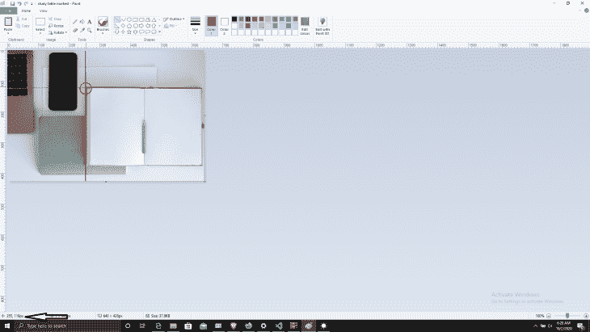
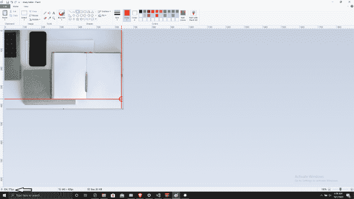
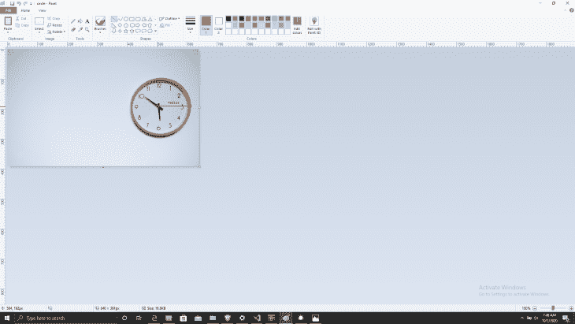
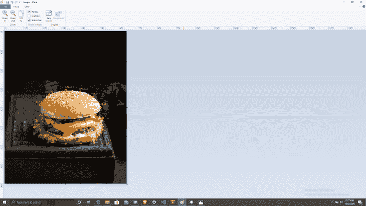

# 每个前端开发人员都应该知道的 HTML 标签

> 原文：<https://blog.logrocket.com/html-tags-every-frontend-developer-should-know/>

随着人们越来越关注 JavaScript 框架和库，许多开发人员不再优先考虑 HTML。因此，我们没有充分利用内置的 HTML 功能，这些功能可以在[可访问性](https://blog.logrocket.com/a-guide-to-improving-web-accessibility-with-css/)(屏幕阅读器)、网络爬虫、机器人甚至 SEO 方面改善您网站的功能。此外，编写语义 HTML 可以为站点内容添加合适的上下文，从而显著改善用户体验。

在本指南中，我们将描述一些你可能忽略的最有用的 HTML 标签。我们将向您展示每个标签的作用，以及您如何使用 HTML 来简化开发过程并增强您的应用程序或网站的用户体验。

我们将详细介绍以下内容:

我们开始吧！

## `<base>`

标签允许您创建一个场景，其中有一个基本 URL 作为文档中所有相对 URL 的前缀。标签必须有一个保存基本 URL 的`href`和/或一个`target`属性。

```
<!DOCTYPE html>
<html>
<head>
  <base href="https://www.google.com/" target="_blank">
</head>
<body>

<h1>The base element(Google As a case study)</h1>

<p> <a href="gmail">Gmail</a> - Used to send emails; which are messages distributed by electronic means from one computer user to one or more recipients via a network.</p>

<p><a href="hangouts">Hangouts</a> - It's used for Messaging, Voice and Video Calls</p>
</body>
</html>

```

您不必为每个请求重复 URL 的前缀，这允许您抽象代码以防止一遍又一遍地重复。

一个文档中只能有一个`<base>`元素，并且必须在`<head>`元素内部。

## 图像地图

图像地图是具有特定可点击区域的图像，它是用`map`标签定义的。这些区域使用`<area>`标签进行设置。基本上，这允许你在图片的不同部分嵌入链接，这些链接可以指向其他页面，这对于描述图片中的事物非常有用。

让我们看一个例子:

第一步是像平常一样使用``标签插入图像，但是这次我们将使用一个`usemap`属性。

```


```

接下来，单独创建一个`<map>`标签，并使用与标签中的`usemap`属性具有相同值的`name`属性。这将`<image>`标签与地图标签链接起来。

```
  <map name="workmap">

  </map>

```

现在是有趣的部分:创建可点击区域本身。我们需要定义如何绘制每个区域——这通常是通过形状和坐标来描绘出来的。

## `<area>`

```
<map name="workmap">
  <area shape="rect" coords="255,119,634,373" alt="book" href="book.html">
</map>

```

使用一个`<area>`元素定义图像上的一个可点击区域。它被添加到`map`元素中。

这些属性包括:

*   `shape`用于在有问题的区域上绘制矩形。你可以有不同的形状，如矩形、圆形、多边形或默认(整个图像)
*   `alt`指定当区域元素由于某种原因无法呈现时要呈现的替代文本
*   保存将可点击区域链接到另一个页面的 URL
*   `coords`使用坐标(以像素为单位)精确裁剪出形状。你可以用各种软件得到你照片的精确坐标；我们将使用微软画图作为一个简单的例子。不同的形状有不同的坐标书写方式。对于矩形，是`left, top, right, bottom`。

这里我们有`top, left`坐标:



The coordinate of your cursor on the picture can be read at the bottom left or we can just use the ruler on the horizontal and vertical sides. Photo by [Tatiana Syrikova](https://www.pexels.com/@tatianasyrikova?utm_content=attributionCopyText&utm_medium=referral&utm_source=pexels) from [Pexels](https://www.pexels.com/photo/opened-notepad-near-netbook-keyboard-and-mobile-phone-on-white-table-3975575/?utm_content=attributionCopyText&utm_medium=referral&utm_source=pexels).

以下截图为`right, bottom`坐标:



您最终会得到:

```


<map name="workmap">
  <area shape="rect" coords="255,119,634,373" alt="book" href="book.html">
</map>

```

您可以使用其他形状，但是每个形状的坐标书写方式不同。

对于一个`circle`,你会得到圆心的坐标，然后加上半径:

```
<map name="workmap">
  <area shape="circle" coords="504,192,504" alt="clock" href="clock.html">
</map>

```



The coordinates of the center of our circle is at the corner left bottom as usual, the horizontal distance between the center of the circle to the end is the radius. Photo by [Buenosia Carol](https://www.pexels.com/@buenosia-carol-116286?utm_content=attributionCopyText&utm_medium=referral&utm_source=pexels) from [Pexels](https://www.pexels.com/photo/wall-clock-at-5-50-707582/?utm_content=attributionCopyText&utm_medium=referral&utm_source=pexels).

创建一个`poly`更像是手绘；你只要把图像上不同的点连接起来，它们就连接起来了:

```
<map name="workmap">
  <area shape="poly" coords="154,506,168,477,252,429,187,388,235,332,321,310,394,322,465,347,504,402,510,469512,532,454,581,423,585,319,593,255,589,240,536" alt="clock" href="clock.html">
</map>

```



Photo by [Anna Tukhfatullina Food Photographer/Stylist](https://www.pexels.com/@myfoodie?utm_content=attributionCopyText&utm_medium=referral&utm_source=pexels) from [Pexels](https://www.pexels.com/photo/burger-with-sliced-vegetables-close-up-photography-2702674/?utm_content=attributionCopyText&utm_medium=referral&utm_source=pexels).

这里有一个用 HTML 创建形状的快速备忘单:

| 形状 | 协调 |
| --- | --- |
| 矩形 | 左、上、右、下 |
| 圆 | x 轴中心，y 轴中心，半径 |
| 聚酯纤维（polyester 的简称） | x1，y1，x2，y2，.…. |
| 系统默认值 | 整个地区 |

## `<abbr>`和`<dfn>`

标签指定了一个要在父元素中定义的术语。它代表“定义元素”标签`<dfn>`的父标签包含术语的定义/解释，而术语在`<dfn>`中。您还可以添加:

```
<p><dfn title="HyperText Markup Language">HTML</dfn> 
  Is the standard markup language for creating web pages.
</p>

```

这也可以与`<abbr>`结合使用:

```
<!DOCTYPE html>
<html>
<body>

<p><dfn><abbr title="HyperText Markup Language">HTML</abbr></dfn> 
  It's the standard markup language for creating web pages.</p>
</body>
</html>

```

这对于可访问性非常好，因为像这样编写语义 HTML 可以让屏幕阅读器和浏览器在正确的上下文中为用户解释页面上的内容。

可以独立使用`<abbr>`:

```
 <abbr title="Cascading Stylesheet">CSS</abbr>

```

## `<pre>``<code>`

预格式化的文本，或`<pre>`标签，用于显示书写的文本(通常是代码)。它显示所有空格、制表符，并完全按照块中的格式显示。

```
 <pre>
    <code>
      p {
          color: black;
          font-family: Helvetica, sans-serif;
          font-size: 1rem;
      }
    </code>
  </pre>
```

## `<fig>`和`<figcaption>`

这两个通常一起出现的标签。一个`<figcaption>`元素作为`<fig>`的标题。

```
 <fig>
  
  <figcaption>basketball<figcaption/>
<fig>

```

这些标签也可以用于代码块、视频和音频片段，如下所示。

**代码块**:

```
 <figure>
  <pre>
    <code>
      p {
          color: black;
          font-family: Helvetica, sans-serif;
          font-size: 1rem;
      }
    </code>
  </pre>
   <figcaption>The code block</figcaption>
</figure>
```

**视频**:

```
 <figure>
 <video src="ex-b.mov"></video>
 <figcaption>Exhibit B. The <cite>Rough Copy</cite> trailer.</figcaption>
</figure>

```

**音频**:

```
 <figure>
    <audio controls>
  <source src="audio.ogg" type="audio/ogg">
  <source src="audio.mp3" type="audio/mpeg">
</audio>
  <figcaption>An audio file</figcaption>
</figure>

```

## `<details>`和`<summary>`

`<details>`和`<summary>`创建一个可切换部分。`<summary>`标签进入`<details>`标签内部，点击会自动显示隐藏的内容。

最棒的是，你可以用 CSS 对元素进行[样式化，即使没有 JavaScript，它也能完美地工作。](https://blog.logrocket.com/web-animation-with-html-css-and-javascript/)

```
 <details>
    <summary>
        <span>I am an introvert</span>
    </summary>

    <div>An introvert is a person with qualities of a personality type known as introversion, which means that they feel more comfortable focusing on their inner thoughts and ideas, rather than what's happening externally. They enjoy spending time with just one or two people, rather than large groups or crowds</div>
    <div>        
</details>

```

## `<cite>`和`<blockquote>`

`<blockquote>`基本上是从其他来源引用的部分。添加了`<cite>`属性来指示来源。

```
<blockquote cite="https://en.wikipedia.org/wiki/History_of_Nigeria">
The history of Nigeria can be traced to settlers trading across the middle East and Africa as early as 1100 BC. Numerous ancient African civilizations settled in the region that is known today as Nigeria, such as the Kingdom of Nri, the Benin Empire, and the Oyo Empire. Islam reached Nigeria through the Borno Empire between (1068 AD) and Hausa States around (1385 AD) during the 11th century,[1][2][3][4] while Christianity came to Nigeria in the 15th century through Augustinian and Capuchin monks from Portugal. The Songhai Empire also occupied part of the region.[5]
</blockquote>

```

如果使用了`[cite](https://html.spec.whatwg.org/multipage/grouping-content.html#attr-blockquote-cite)`属性，它必须是一个指向源的有效 URL。为了获得相应的引用链接，属性的值必须相对于元素的节点文档进行解析。有时，它们是供私人使用的——例如，服务器端脚本收集关于网站使用报价的统计数据，通常不用于客户端。

## `<cite>`

`[cite](https://html.spec.whatwg.org/multipage/text-level-semantics.html#the-cite-element)`元素表示作品或知识产权的标题，例如书、论文、散文、诗歌、歌曲等。这可以是被详细引用的作品(即引文)，也可以只是一笔带过的参考文献。

```
<p>The best movie ever made is <cite>The Godfather</cite> by
Francis Ford Coppola . My favorite song is <cite>Monsters You Made</cite> by the Burna boy.</p>

```

## 结论

我们开发人员应该更加关注这些不太受欢迎的标签，并编写更多的语义代码来改进我们网站的功能。

你可以在 w3schools 和 T2 HTML 标准的官方网站上了解更多关于这些 HTML 标签的信息。