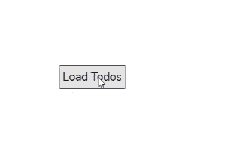
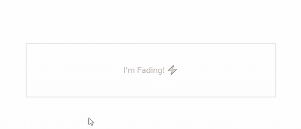

# Htmx:制作网络应用的最新老方法——LogRocket Blog

> 原文：<https://blog.logrocket.com/htmx-the-newest-old-way-to-make-web-apps/>

## 介绍

Htmx 是一个 JavaScript 库，用于执行 AJAX 请求、触发 CSS 转换以及直接从 HTML 元素调用 WebSocket 和服务器发送的事件。Htmx 让你用简单的标记构建现代的强大的用户界面。

这个库重约 10KB (min.gz'd)，它是独立的(即，它不需要任何其他 JavaScript 包来运行)，并且它也与 IE11 兼容。

在本教程中，我们将探索 htmx 的强大功能，同时涵盖以下部分:

*   安装 htmx
*   用 htmx 发送 AJAX 请求
*   自定义 htmx 输入验证
*   用 htmx 触发 CSS 动画

## 安装 htmx

您可以通过[下载 htmx 源文件](https://unpkg.com/browse/htmx.org@1.3.3/dist/)或者直接在您的标记中包含它的 CDN 来开始使用 htmx，如下所示:

```
<script src="https://unpkg.com/[email protected]"></script>

```

上面的脚本在您的网页上加载了 htmx 的当前稳定版本，在撰写本文时是版本 1.3.3。完成后，您就可以在网页上实现 htmx 功能了。

## 用 htmx 发送 AJAX 请求

Htmx 提供了一组属性，允许您直接从 HTML 元素发送 AJAX 请求。可用属性包括:

*   `hx-get` —向提供的 URL 发送`GET`请求
*   `hx-post` —向提供的 URL 发送`POST`请求
*   `hx-put` —向提供的 URL 发送`PUT`请求
*   `hx-patch` —向提供的 URL 发送`PATCH`请求
*   `hx-delete` —向提供的 URL 发送`DELETE`请求

#### **代码示例**

```
<button hx-get="http://localhost/todos">Load Todos</button>

```

上面的代码示例告诉浏览器，当用户单击按钮时，它向提供的 URL 发送一个`GET`请求(`hx-get`)，在本例中是`[http://localhost/todos](http://localhost/todos)`。



默认情况下，从任何 htmx 请求返回的响应将被加载到发送请求的当前元素中。在 AJAX 请求的目标元素一节中，我们将探讨如何在另一个 HTML 元素中加载响应。

在 AJAX 请求的目标元素一节中，我们将探讨如何在另一个 HTML 元素中加载响应。

### 触发请求

您应该注意到，htmx 中的 AJAX 请求是由元素的自然事件触发的。比如`input`、`select**,**`、`textarea`是由`onchange`事件触发的，`form`是由`onsubmit`事件触发的，其他的都是由`onclick`事件触发的。

在您想要修改触发请求的事件的情况下，htmx 为此提供了一个特殊的`hx-trigger`属性:

```
<div hx-get="http://localhost/todos" hx-trigger="mouseenter">
    Mouse over me!
</div>

```

在上面的例子中，当且仅当用户的鼠标停留在 div 上时，`GET`请求才会被发送到提供的 URL。

### 触发修改器

上一节提到的`hx-trigger`属性接受一个额外的修饰符来改变触发器的行为。可用的触发修饰符包括:

*   `once` —确保请求只会发生一次
*   `changed` —如果 HTML 元素的值已更改，则发出请求
*   `delay:<time interval>` —在发出请求之前等待给定的时间量(例如`delay-1s`)。如果事件再次触发，倒计时将被重置
*   `throttle:<time interval>` —在发送请求之前等待给定的时间量(例如`throttle:1s`)。但是与 delay 不同，如果一个新事件在到达时间限制之前发生，那么该事件将会在一个队列中，这样它将会在前一个事件结束时触发
*   `from:<CSS Selector>` —监听不同元素上的事件

#### **代码示例**

```
<input
    type="text"
    hx-get="http://localhost/search"
    hx-trigger="keyup changed delay:500ms" />

```

在上面提供的代码示例中，一旦用户在输入元素上执行`keyup`事件(即用户在输入框中键入任何文本)并且其先前的值发生变化，浏览器将在 500 毫秒后自动向`[http://localhost/search](http://localhost/search)`发送`GET`请求。

### 使用`htmx-trigger`属性进行轮询

在 htmx-trigger 属性中，您还可以指定每隔 ***n*** 秒，而不是等待触发请求的事件。使用此选项，您可以每隔 *n* 秒向特定的 URL 发送一次请求:

```
  <div hx-get="/history" hx-trigger="every 2s">
  </div>

```

上面的代码示例告诉浏览器每隔 2 秒向`/history`端点发出一个 GET 请求，并将响应加载到 div 中。

### AJAX 请求的目标元素

在前面的章节中，我们提到了来自 htmx 中 AJAX 请求的响应将被加载到发出请求的元素中。如果需要将响应加载到不同的元素中，可以使用`hx-target`属性来完成。该属性接受一个 [CSS 选择器](https://blog.logrocket.com/advanced-css-selectors-for-common-scenarios/)，并使用指定的选择器自动将 AJAX 响应注入 HTML 元素。

我们可以修改我们的待办事项示例来适应这种情况:

```
<button hx-get="http://localhost/todos" hx-target="#result">
    Load Todos
</button>
<div id="result"></div>

```

与前面的例子不同，这个新的代码样本向`[http://localhost/todos](http://localhost/todos)`发送一个请求，并用`id=result`在我们的 div 中加载响应。

### 将返回的 HTML 交换到 DOM 中

与`hx-target`类似，`hx-swap`属性用于定义返回的 AJAX 响应将如何加载到 DOM 中。支持的值包括:

*   `innerHTML` —默认值，该选项将在发送请求的当前元素中加载 AJAX 响应
*   `outerHTML` —此选项用返回的响应替换发送请求的整个元素
*   `afterbegin` —加载响应，作为发送请求的元素的第一个子元素
*   `beforebegin` —加载响应作为触发请求的实际元素的父元素
*   `beforeend` —在发送请求的元素的最后一个子元素之后加载并追加 AJAX 响应
*   `afterend` —与前面的不同，这将 AJAX 响应附加在发送请求的元素之后
*   `none` —此选项不会附加或预先考虑来自 AJAX 请求的响应

### 请求指示器

当发送 AJAX 请求时，让用户知道后台正在发生一些事情通常是一个好的做法，因为默认情况下浏览器不会自动这样做。在 htmx 中，您可以使用`htmx-indicator`类轻松实现这一点。

考虑下面的代码示例:

```
<div hx-get="http://path/to/api">
     <button>Click Me!</button>
     
</div>

```

默认情况下，用`htmx-indicator`类定义的任何 HTML 元素的不透明度都设置为 0，因此使元素不可见，但存在于 DOM 中。

而且，当您发出一个 AJAX 请求时，htmx 会自动向发送请求的元素添加一个新的`htmx-request`类。这个新的`htmx-request`类将导致带有`htmx-indicator`类的子元素转变为不透明度 1，从而显示指示器。


### 请求数据

如果 AJAX 请求是由表单或输入元素触发的，默认情况下，htmx 会自动将所有输入字段的值包含在请求中。

但是在您想要包含其他元素的值的情况下，您可以将`hx-include`属性与您想要在请求中包含其值的所有元素的 CSS 选择器一起使用。

#### 代码示例

```
<div>
    <button hx-post="http://path/to/api/register" hx-include="[name=username]">
        Register!
    </button>
    Enter Username: <input name="username" type="text"/>
</div>

```

就像上面的代码示例一样，当您向 */register* 端点发出请求时，您的 AJAX 请求将自动在其主体中包含 email 字段。

#### 过滤掉参数

Htmx 还提供了另一个`htmx-params`属性，用它可以过滤出发送 AJAX 请求时提交的唯一参数。

```
<div hx-get="http://path/to/api/example" hx-params="*">
    Send Request
</div>

```

上面的代码示例将包含页面上的所有输入元素作为请求参数。

所有可能的值包括:

*   `*` —将包含网页中的所有参数，并在 AJAX 请求中发送
*   `none` —不会在您的请求中包含任何参数
*   `not <param-list>`-包括所有其他参数，不包括逗号分隔的参数名称列表
*   `<param-list>` —将只包括列表中所有逗号分隔的参数名

#### 上传文件

使用 htmx，您可以轻松发送图像、视频、pdf 等文件。通过将值为`multipart/form-data`的`hx-encoding` 属性添加到发送请求的实际元素的父元素中:

```
<form hx-encoding="multipart/form-data">
    Select File:
    <input type="file" name="myFile" />
    <button
      hx-post="http://path/to/api/register"
      hx-include="[name='myFile']"
    >
      Upload File!
    </button>
</form>

```

## 自定义 htmx 输入验证

默认情况下，Htmx 与 HTML5 验证 API 集成在一起，如果可验证的输入无效，它不会发出请求。这个特性适用于 AJAX 请求和 [WebSocket 事件](https://blog.logrocket.com/websockets-tutorial-how-to-go-real-time-with-node-and-react-8e4693fbf843/)。

除此之外，htmx 还围绕验证触发事件，这在自定义输入验证和错误处理中非常有用。

可用的验证事件包括:

*   `htmx:validation:validate` —此事件在添加自定义验证登录时非常有用，因为它在验证元素之前被调用
*   `htmx:validation:failed` —当元素验证返回 false 时，即表示输入无效时，触发此事件
*   `htmx:validation:halted` —当元素由于输入验证错误而无法发出请求时，调用此事件

## 用 htmx 触发 CSS 动画

Htmx 提供了一种方法，可以轻松地将平滑的 CSS 过渡附加到 AJAX 事件中，也可以附加到网页中。

### 使用`class-tool`

htmx `class-tool`是一个扩展，您可以轻松地使用它来*切换*、*添加*，或者*从 HTML 元素中移除*特定的类名，而无需编写任何 JavaScript 代码。

您可以通过将`classes`属性添加到您的元素中，然后指定 action，后跟您想要添加或删除的类名来利用这个扩展:

```
<div classes="add sample-class:1s"></div>

```

就像上面的代码示例一样，一旦浏览器内容被加载，htmx 会在 1s 后自动向 div 添加一个新类(`sample-class`)。

还要注意，您可以通过用逗号(`,`)分隔每个动作来创建动作队列，或者通过用“与”符号(`&`)分隔多个动作来使它们同时运行:

```
<!-- class tool queue -->

<div classes="add sample-class:1s, remove another-class:2s, toggle 3rd-class:1s"></div>

<!-- simultaneous actions -->

<div classes="add sample-class:1s & remove another-class:2s & toggle 3rd-class:1s"></div>

```

下面是一个切换元素可见性的示例:

```
    <style>
      .demo.faded {
        opacity: 0.3;
      }
      .demo {
        opacity: 1;
        transition: opacity ease-in 900ms;
      }
    </style>
    <div class="demo" classes="toggle faded:1s">I'm Fading! ⚡</div>

```



## 摘要

在本文中，我们探索了 htmx 安装过程、如何发送 AJAX 请求、表单验证，以及在不编写任何 JavaScript 代码的情况下触发 CSS 动画。

Htmx 为 WebSocket 和服务器发送的事件提供了实验性的支持，本文没有涉及这些事件，因为它们仍在开发中。你可以从 htmx 文档中了解更多关于 WebSocket 和 SSE 支持的信息。

[在 GitHub 上贡献 htmx](https://github.com/bigskysoftware/htmx)。

## 使用 [LogRocket](https://lp.logrocket.com/blg/signup) 消除传统错误报告的干扰

[](https://lp.logrocket.com/blg/signup)

[LogRocket](https://lp.logrocket.com/blg/signup) 是一个数字体验分析解决方案，它可以保护您免受数百个假阳性错误警报的影响，只针对几个真正重要的项目。LogRocket 会告诉您应用程序中实际影响用户的最具影响力的 bug 和 UX 问题。

然后，使用具有深层技术遥测的会话重放来确切地查看用户看到了什么以及是什么导致了问题，就像你在他们身后看一样。

LogRocket 自动聚合客户端错误、JS 异常、前端性能指标和用户交互。然后 LogRocket 使用机器学习来告诉你哪些问题正在影响大多数用户，并提供你需要修复它的上下文。

关注重要的 bug—[今天就试试 LogRocket】。](https://lp.logrocket.com/blg/signup-issue-free)