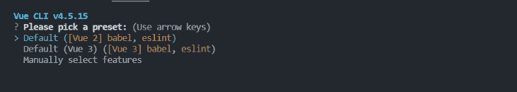
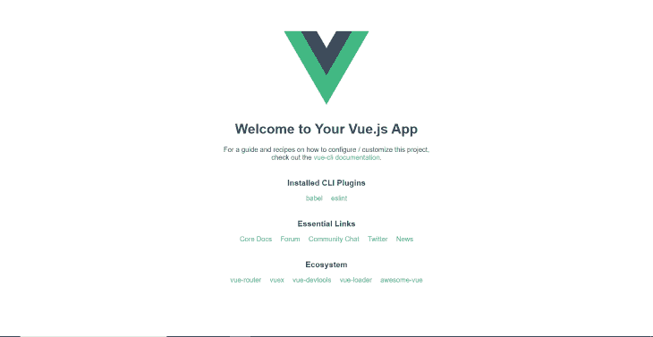
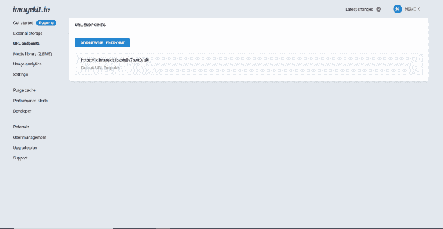
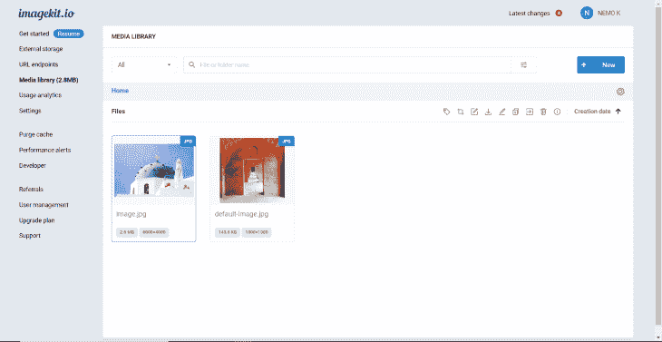
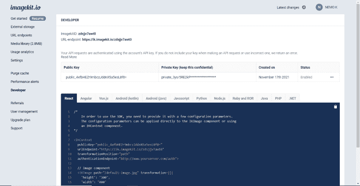
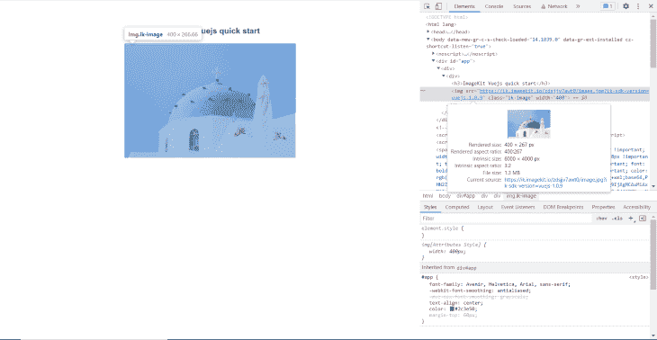
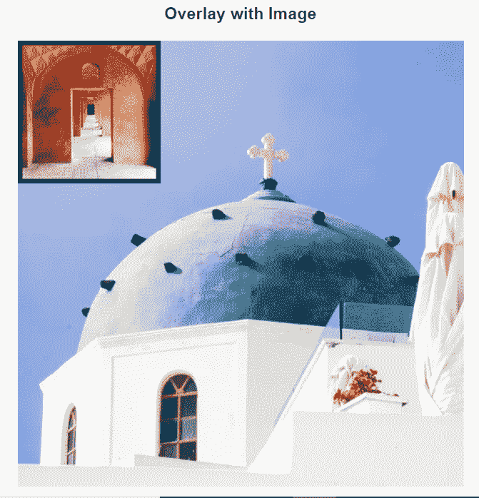

# 使用 ImageKit 和 Vue.js 进行图像品牌推广

> 原文：<https://blog.logrocket.com/image-branding-imagekit-vuejs/>

[ImageKit](https://imagekit.io/) 是一项图像 CDN 服务，具有实时图像优化功能。使用 ImageKit，您可以对图像执行许多操作，如转换图片或添加覆盖图。

在本文中，您将学习如何将 ImageKit 集成到 Vue.js 应用程序中，以及如何执行该服务提供的转换。

## 什么是 ImageKit？

如前所述，Imagekit 是一种具有实时优化功能的映像管理服务。它提供了优化、调整大小、裁剪和 CDN 交付等功能。

ImageKit 是一项出色的服务，可以通过减少图像大小和通过 CDN 提供图像来帮助您提高应用程序性能。

以下是 ImageKit 提供的一些服务:

*   调整大小和图像变换
*   传送压缩图像
*   使用 [AWS CloudFront](https://imagekit.io/features/cdn-and-processing-infrastructure/) CDN 更快地显示图像

## 将 Vue.js 与 ImageKit 集成

在本教程中，我们将把 ImageKit 与 Vue.js 应用程序集成在一起。通过这样做，您将了解 ImageKit 的各种用例，以及如何使用 Vue.js SDK 来实现这一点。

目前对带有 Vue.js 的 ImageKit 的支持仅限于 Vue 2。对 Vue 3 的支持还不稳定，有[个已知问题](https://github.com/imagekit-developer/imagekit-vuejs/issues/34)。因此，我们将在本文中介绍如何将 ImageKit 与 Vue 2 集成。

本教程的主要目的很简单；您将只探索 SDK。我们不会建立一个特定的项目；相反，我们将回顾不同的用例。

## 安装 Vue CLI

[Vue CLI](https://cli.vuejs.org/) 是搭建 Vue.js 项目的命令行界面。如果您已经使用了 Vue.js 并安装了 Vue CLI，则可以跳过这一步。

Vue CLI 是一个 npm 软件包，需要使用以下命令进行全局安装:

```
npm install -g @vue/cli
# OR
yarn global add @vue/cli

```

## 创建 Vue 项目

成功安装 CLI 后，在您喜欢的代码编辑器中打开一个文件夹，您要在其中创建 Vue 项目。现在打开终端，将终端定位到该目录。在终端中，键入以下命令:

```
vue create project-name

```

`project-name`是您要为项目指定的名称:



选择`Default ([Vue 2] babel, eslint)`或者手动选择特性并使用 Vue 2(对于本教程，Vue 2 默认就足够了)。选择此项将使用您提供的名称创建一个项目。

一旦项目设置完成，使用带有`cd project-name`的终端进入目录并键入`npm run serve`。它将在端口`8080`启动本地服务器，您将看到类似这样的内容:



默认 Vue.js 应用程序的组件结构是最基本的。它在顶部的`src\assets`文件夹中有一个名为`logo.png`的图像。

注意，下面所有的文本和链接都是从`HelloWorld.vue`组件生成的。

## 创建和配置图像工具包

要使用 ImageKit，您必须创建一个 ImageKit 帐户。访问[此链接](https://imagekit.io/registration?code=zdsj8571)创建账户。从侧边栏中，打开 **URL 端点**选项并复制 URL。稍后您将需要此 URL 端点。



从**媒体库**，你可以上传图片来探索功能。对于本文，一张图片已经上传到 ImageKit 仪表板，并被重命名为`image`。



即使你不想上传图像，你仍然可以使用`default-image`来工作。

从菜单中的**开发者**部分，可以获得客户端上传图片所需的私有 API 密匙。图片上传部分就不在本文讨论了。



您还可以从这里获得不同语言的样板代码。

## 安装和初始化图像工具包

要安装 ImageKit 包，您必须在终端中运行以下命令:

```
npm install imagekitio-vue
# OR
yarn add imagekitio-vue

```

软件包安装完成后，通过打开`main.js`文件并粘贴以下代码来初始化 ImageKit:

```
import ImageKit from 'imagekitio-vue';
Vue.use(ImageKit, {
  urlEndpoint: 'YOUR_URL_ENDPOINT',
});

```

在`YOUR_URL_ENDPOINT`中，粘贴 ImageKit 菜单中的 URL，或者您可以通过[这个链接](https://imagekit.io/dashboard#url-endpoints)来获得您的 URL 端点。您还可以在这里粘贴两个可选参数:`publicKey`和`authenticationEndpoint`。

但是只有在处理上传时才需要这些。因为本文不会涉及上传，所以您不需要这些参数。

`urlEndpoint`参数在所有情况下都是必需的参数。这是初始化 SDK 的唯一必要步骤。

## 探索图像工具包

对我们来说，一切都在`HelloWorld.vue`组件下。打开`HelloWorld.vue`组件，删除`template`标签中的所有内容。

打开`App.vue`文件并删除`img`标签，这样我们就有了一个空白页面。

ImageKit 包提供了一个名为`ik-image`的组件，用于渲染所有的图像。

## 使用 ImageKit 渲染图像

要渲染图像而不进行任何转换或修改，可以在`HelloWorld.vue`组件的`template`标记中使用以下代码:

```
<div>
    <h3>ImageKit Vuejs quick start</h3>
    <ik-image width="400" path="/image.jpg"> </ik-image>
</div>

```

`width`属性将图像的宽度设置为 400 像素。请记住，`/image.jpg`不是您本地目录中的映像。这是 ImageKit 仪表板中的图像。



您可以在上面的图像中看到组件是如何渲染的。以这种方式渲染照片不会大大减小文件大小。

## 变换图像的高度和宽度

另一种控制高度和宽度的方法是使用`:transformation`属性。`:transformation`大量用于转换图像，您将在后面的示例中看到。

```
<div>
    <h3>Resizing Images in Vue.js</h3>
    <ik-image path="/image.jpg" :transformation="[{ w: 450, h: 450 }]" />
</div>

```

在这里，`:transformation="[{ w: 450, h: 450 }]"`调整图像的大小。`w`代表宽度，`h`代表高度。你也可以使用`width`和`height`来代替速记。

上面的代码将图像的高度和宽度调整为 450 像素。您可以在这里找到完整转换的列表[。](https://docs.imagekit.io/features/image-transformations)

在进入下一个转换之前，让我们理解一下[链式转换](https://docs.imagekit.io/features/image-transformations/chained-transformations)属性，它指的是当不止一个对象被传递到`transformation` prop 内部时，将转换顺序地链接起来。

## 处理图像质量

我们将讨论的下一个转换是质量控制，您可以控制 CDN 提供的图像质量。

```
<div>
    <h3>Quality Manipulation</h3>
        <ik-image
            path="/image.jpg"
            :transformation="[{ quality: 50 }, { width: 500 }]"
        />
</div>

```

上面的代码还向您展示了链式转换。首先，质量设置为 50%，然后宽度设置为 500 像素。

## 用图像或文本覆盖

这个令人兴奋。您可以使用图像的叠加来创建水印，或者在另一个图像上显示另一个图像。在`transformation`道具内，使用`overlayImage`键应用该变换。查看下面的示例，了解它是如何工作的。

```
<div>
    <h3>Overlay with Image</h3>
    <ik-image
        path="/image.jpg"
        :transformation="[
            {
                width: 500,
                height: 500,
            },
            {
                overlayImage: 'default-image.jpg',
                overlayWidth: 150,
                overlayX: 0,
                overlayImageBorder: '5_000000', // 5px border of color 000000
            },
        ]"
    />
</div>

```

`overlayImage: 'default-image.jpg'`是用作叠加的图像。`overlayWidth: 150`为叠加图像的宽度，`overlayX`为图像的 x 轴位置。最后，`overlayImageBorder: 5_000000`代表 5px 的黑色边框。输出如下:



使用文本也可以实现叠加。`overlayText`键用于创建:

```
<div>
    <h3>Overlay with Text</h3>
    <ik-image
        path="/image.jpg"
        :transformation="[
            {
                width: 500,
                height: 500,
            },
            {
                overlayText: 'This is an Overlay',
                overlayTextFontFamily: 'exo',
                overlayFocus: 'top',
                overlayTextFontSize: 30,
            },
        ]"
    />
</div> 

```

在上面的代码中，`overlayText`代表将要被覆盖的文本。`overlayTextFontFamily`是用来显示它的字体。这里可以使用[列表](https://docs.imagekit.io/features/image-transformations/supported-text-font-list#in-built-fonts)中的任何字体，但是你也可以使用自定义字体。

`overlayFocus`是您想要放置文本的位置。它可以有这些可能的值，`center`、`top`、`left`、`bottom`、`right`、`top_left`、`top_right`、`bottom_left`和`bottom_right`。默认值为`center`。除了使用`overlayFocus`之外，您还可以使用`overlayX`和`overlayY`来定位您的文本或图像。


## 在 ImageKit 中使用模糊图像占位符

您还可以使用 ImageKit 在图像完全加载之前显示模糊的图像占位符。这是如何实现的。

```
<div>
    <h3>Blurred Image Placeholder</h3>
    <ik-image
        path="/image.jpg"
        :lqip="{ active: true, quality: 40, blur: 5 }"
        :transformation="[{ height: 500, width: 500 }]"
    />
</div>

```

使用`lqip`道具，你可以添加一个模糊的图像占位符。

## 延迟加载 ImageKit 中的图像

延迟加载是另一个重要的用例，因为它可以极大地优化性能。以下是如何使用 ImageKit 延迟加载图像:

```
<div>
    <h3>Lazy Loading</h3>

    <ik-image
        path="/image.jpg"
        :transformation="[{ height: 500, width: 500 }]"
        loading="lazy"
        height="500"
        width="500"
    />
</div>

```

只需添加`loading="lazy"`，您就可以开始了。简单吧？

## 结论

在这篇文章中，我们讨论了 ImageKit 的常见用例。ImageKit 文档非常好，无论何时遇到任何问题，你都应该参考它。您还可以自行探索 ImageKit SDK，以便找到您的最佳使用案例！

## 像用户一样体验您的 Vue 应用

调试 Vue.js 应用程序可能会很困难，尤其是当用户会话期间有几十个(如果不是几百个)突变时。如果您对监视和跟踪生产中所有用户的 Vue 突变感兴趣，

[try LogRocket](https://lp.logrocket.com/blg/vue-signup)

.

[](https://lp.logrocket.com/blg/vue-signup)[https://logrocket.com/signup/](https://lp.logrocket.com/blg/vue-signup)

LogRocket 就像是网络和移动应用程序的 DVR，记录你的 Vue 应用程序中发生的一切，包括网络请求、JavaScript 错误、性能问题等等。您可以汇总并报告问题发生时应用程序的状态，而不是猜测问题发生的原因。

LogRocket Vuex 插件将 Vuex 突变记录到 LogRocket 控制台，为您提供导致错误的环境，以及出现问题时应用程序的状态。

现代化您调试 Vue 应用的方式- [开始免费监控](https://lp.logrocket.com/blg/vue-signup)。