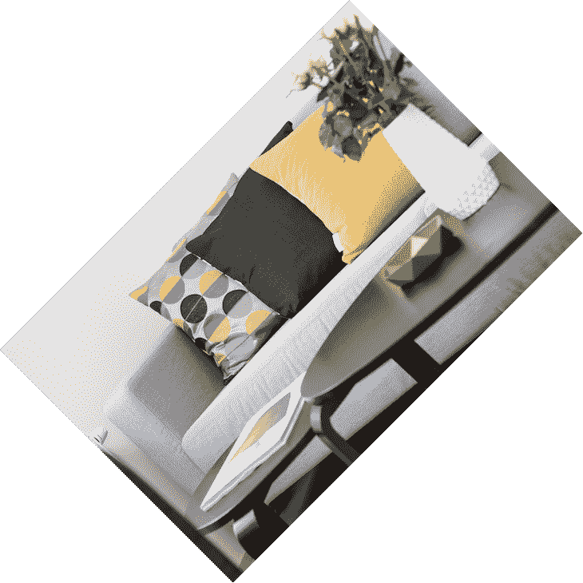

# 基于节点和跳转日志博客的图像处理

> 原文：<https://blog.logrocket.com/image-processing-with-node-and-jimp/>

如果您的 web 应用程序支持用户上传的图像，您可能需要转换它们以适应您的应用程序的设计规范。

[JavaScript 图像处理程序(Jimp)](https://github.com/oliver-moran/jimp) 可让您轻松处理图像，并将其转换成任何所需的格式、样式或尺寸。它还可以优化图像以最小化文件大小，确保高视觉质量以改善用户体验，并减少带宽。

使用 Jimp，您可以调整图像大小和裁剪图像，将它们转换为适合您需要的图像格式，以及应用滤镜和效果。在本教程中，我们将回顾这个库是如何工作的，并描述一些 Jimp 图像操作的常见用例。

## 装置

`npm install --save jimp`

Jimp 只能用于有限范围的图像格式。在开始使用该库之前，您需要确保它支持您计划在应用程序中包含的格式。

支持的类型包括:

*   `@jimp/jpeg`
*   `@jimp/png`
*   `@jimp/bmp`
*   `@jimp/tiff`
*   `@jimp/gif`

## 基本用途

Jimp 提供了基于回调和基于承诺的 API 来操作图像。出于本文的目的，我们将使用 Jimp 的 Promise API。

静态的`Jimp.read`方法接受一个图像作为输入。输入可以是文件系统中图像文件的位置、网址(URL)、维度(宽度和高度)、Jimp 实例或缓冲区。然后，它返回一个承诺。

```
Jimp.read('http://www.example.com/path/to/lenna.jpg')
  .then(image => {
    // Do stuff with the image.
  })
  .catch(err => {
    // Handle an exception.
  });

```

## 调整图像大小和裁剪图像

### 调整大小

Jimp 的`resize()`方法通过两遍双线性算法改变图像的高度和/或宽度。

语法:

```
resize( w, h[, mode] )

```

示例:

```
const Jimp = require('jimp');
async function resize() {
  // Read the image.
  const image = await Jimp.read('https://images.pexels.com/photos/298842/pexels-photo-298842.jpeg');
  // Resize the image to width 150 and heigth 150.
  await image.resize(150, 150);
  // Save and overwrite the image
  await image.writeAsync(`test/${Date.now()}_150x150.png`);
}
resize();

```

原始图像:


已调整大小的图像:


`Jimp.AUTO`可以作为高度或宽度的值传递，图像将相应地调整大小，同时保持纵横比。您不能将`Jimp.AUTO`作为高度和宽度的值进行传递。

如果没有通过调整大小算法，Jimp 使用`Jimp.RESIZE_BILINEAR`作为默认的调整大小算法。Jimp 允许的其他调整大小算法包括:

*   `Jimp.RESIZE_NEAREST_NEIGHBOR;`
*   `Jimp.RESIZE_BILINEAR;`
*   `Jimp.RESIZE_BICUBIC;`
*   `Jimp.RESIZE_HERMITE;`
*   `Jimp.RESIZE_BEZIER;`

### 农作物

`crop()`功能用于将图像裁剪到指定的`x`和`y`坐标和尺寸。

语法:

```
crop( x, y, w, h)

```

示例:

```
async function crop() {
  // Read the image.
  const image = await Jimp.read('https://images.pexels.com/photos/298842/pexels-photo-298842.jpeg');
  await image.crop(500, 500, 150, 150);
  // Save and overwrite the image
  await image.writeAsync(`test/${Date.now()}_crop_150x150.png`);
}
crop()

```

裁剪的图像:


## 修改图像形状和样式

### 辐状的

`rotate()`方法将图像顺时针旋转给定的度数。图像的尺寸保持不变。

语法:

```
rotate( deg[, mode] );

```

示例:

```
async function rotate() {
  // Read the image.
  const image = await Jimp.read('https://images.pexels.com/photos/298842/pexels-photo-298842.jpeg');
  await image.rotate(45);
  // Save and overwrite the image
  await image.writeAsync(`test/${Date.now()}_rotate_150x150.png`);
}
rotate()

```

输出:



### 翻转

`flip()`方法可以水平或垂直翻转图像。默认设置是水平翻转图像。

语法:

```
image.flip( horz, vert )

```

示例:

```
async function flip() {
  // Read the image.
  const image = await Jimp.read('https://images.pexels.com/photos/298842/pexels-photo-298842.jpeg');
  await image.flip(true, false);
  // Save and overwrite the image
  await image.writeAsync(`test/${Date.now()}_flip_150x150.png`);
  console.log("flipped")
}
flip()

```

输出:


### 不透明

`opacity()`方法将每个像素的不透明度乘以 0 到 1 范围内的系数。

语法:

```
opacity( f );

```

示例:

```
async function opacity() {
  // Read the image.
  const image = await Jimp.read('https://images.pexels.com/photos/298842/pexels-photo-298842.jpeg');
  await image.opacity(.5);
  // Save and overwrite the image
  await image.writeAsync(`test/${Date.now()}_opacity_150x150.png`);
}

```

输出:


## 应用图像效果和滤镜

### 灰度等级

灰度修改器将图像中的颜色去饱和或删除，并将其转换为灰度。

语法:

```
greyscale();
>
```

示例:

```
async function greyscale() {
  // Read the image.
  const image = await Jimp.read('https://images.pexels.com/photos/298842/pexels-photo-298842.jpeg');
  await image.greyscale();
  // Save and overwrite the image
  await image.writeAsync(`test/${Date.now()}_greyscale_150x150.png`);
}
greyscale()

```

输出:


### 虚化

`blur()`方法使用模糊算法将图像模糊`r`个像素，产生类似高斯模糊的效果，只是速度更快。

语法:

```
blur(r) // fast blur the image by r pixels

```

示例:

```
async function blur() {
  // Read the image.
  const image = await Jimp.read('https://images.pexels.com/photos/298842/pexels-photo-298842.jpeg');
  await image.blur(20);
  // Save and overwrite the image
  await image.writeAsync(`test/${Date.now()}_blur_150x150.png`);
}
blur()

```

输出:


## 图像和文本覆盖

### 图像叠加

`composite()`方法在`x`、`y`将一幅图像叠加在另一幅 Jimp 图像上。

语法:

```
composite( src, x, y, [{ mode, opacitySource, opacityDest }] );  

```

示例:

```
async function waterMark(waterMarkImage) {
  let  watermark = await Jimp.read(waterMarkImage);
  watermark = watermark.resize(300,300);
  const image = await Jimp.read('https://images.pexels.com/photos/298842/pexels-photo-298842.jpeg');
 watermark = await watermark
  image.composite(watermark, 0, 0, {
    mode: Jimp.BLEND_SOURCE_OVER,
    opacityDest: 1,
    opacitySource: 0.5
  })
  await image.writeAsync(`test/${Date.now()}_waterMark_150x150.png`);
}
waterMark('https://destatic.blob.core.windows.net/images/nodejs-logo.png');

```

输出:


### 文本覆盖

你可以用`print()` API 在图像上写文本。Jimp 仅支持位图字体格式(。fnt)。其他格式的字体必须转换为。fnt 与 Jimp 兼容。

示例:

```
async function textOverlay() {
  const font = await Jimp.loadFont(Jimp.FONT_SANS_32_BLACK);
  const image = await Jimp.read(1000, 1000, 0x0000ffff);

  image.print(font, 10, 10, 'Hello World!');
}

textOverlay();

```

输出:


## 了解有关跳转的更多信息

我们只是触及了 Jimp 用例的表面。如果你正在考虑使用 Jimp 作为你的主要图像处理器，请查看官方 [GitHub](https://github.com/oliver-moran/jimp) 和 [npm](https://www.npmjs.com/package/jimp) 页面上的完整文档。

## 200 只显示器出现故障，生产中网络请求缓慢

部署基于节点的 web 应用程序或网站是容易的部分。确保您的节点实例继续为您的应用程序提供资源是事情变得更加困难的地方。如果您对确保对后端或第三方服务的请求成功感兴趣，

[try LogRocket](https://lp.logrocket.com/blg/node-signup)

.

[](https://lp.logrocket.com/blg/node-signup)[https://logrocket.com/signup/](https://lp.logrocket.com/blg/node-signup)

LogRocket 就像是网络和移动应用程序的 DVR，记录下用户与你的应用程序交互时发生的一切。您可以汇总并报告有问题的网络请求，以快速了解根本原因，而不是猜测问题发生的原因。

LogRocket 检测您的应用程序以记录基线性能计时，如页面加载时间、到达第一个字节的时间、慢速网络请求，还记录 Redux、NgRx 和 Vuex 操作/状态。

[Start monitoring for free](https://lp.logrocket.com/blg/node-signup)

.