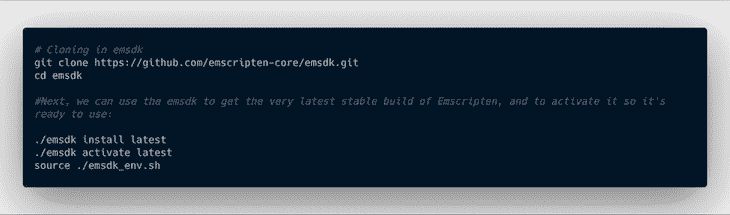
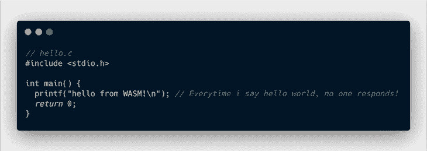
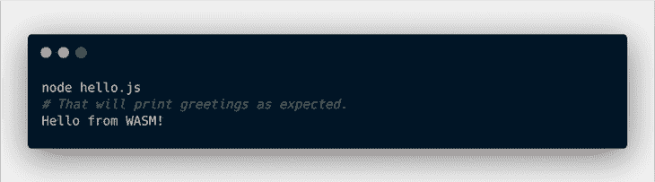

# 使用 WebAssembly 的图像样式和过滤器

> 原文：<https://blog.logrocket.com/image-styling-and-filters-using-webassembly/>

WebAssembly、WebGL 和 WebGPU 等 Web 解决方案的存在是为了充分利用用户目前拥有的强大计算能力。

WebAssembly (Wasm)是一种运行在 web 上的通用、低级字节码。作为低级二进制代码，它比今天浏览器附带的 JavaScript 引擎执行的代码更小，性能更好。

Wasm 允许开发人员使用 Rust、[类类型脚本编译器 AssemblyScript](https://blog.logrocket.com/the-introductory-guide-to-assemblyscript/) 和 Emscripten (C/C++)等语言进行编码，并向下编译为 Wasm 格式。Wasm 提供了一种紧凑的二进制格式，具有可预测的性能，可以与 JavaScript 一起运行。它目前可以在所有主流浏览器中使用，也可以在服务器上运行。

如果您已经熟悉 WebAssembly，请随意跳过下一节，在这一节中，我们将学习在浏览器中使用它的基础知识。

## 热身:Wasm 的你好！

从我们的 JavaScript 执行 Wasm 二进制文件(反之亦然)需要一些样板代码。幸运的是，我们有 [Emscripten 编译器](https://github.com/emscripten-core/emscripten)，它为我们完成了所有繁重的工作，并为我们提供了一个 JavaScript 文件。

### 设置脚本

我们将使用 C/C++来编写我们的 Wasm 代码，因此我们需要`emsdk`，它是 Emscripten 的工具，可以获得编译器和所有其他您需要的工具。



最后一个命令设置了路径，这样它就可以找到`emcc`、Emscripten 编译器工具以及我们需要的所有东西。

### 怀旧场景:写一些 C

一旦编译器设置完成，让我们开始编写 C 代码并把它编译成 Wasm。这是一个用 c 语言编写的 hello world 的小例子。



这里将为我们完成所有繁重的编译和转换工作。一个简单的`emcc`命令将返回 Wasm 就绪代码，用于我们的 web 应用程序。这是:


输出文件`hello.js`可以通过使用 Node:



因为我们的目标是一个 web 平台，所以让它在我们的 web 应用程序中运行。

## 行动时间:在我们的网络应用中执行

我们写的 C 代码只是为了检查我们的设置是否正确。在这里，对于我们的 web 应用程序，让我们尝试使用 Wasm 计算一个给定数字的平方根。下面是我们的 C 代码的样子:

```
#include <math.h>
#include <stdlib.h>
#include <stdio.h>

extern "C" {
  float getSqrt (float num) {
    return sqrt(num);
  }

  float getSqr (float num) {
    return num * num;
  }
}

```

这里，`extern "C"`块中定义的方法是可以从 JS 代码中访问的方法。除了将这些方法放在那个块中，我们将在编译器选项中把它们称为`EXPORTED_FUNCTIONS`。

我们还将在编译命令中添加一个优化级别。优化级别越高，编译代码所需的时间越长，但生成的代码性能会更好。你可以在这里阅读这些优化[。](https://emscripten.org/docs/optimizing/Optimizing-Code.html#how-to-optimize-code)

因此，我们的新编译命令将如下所示:

```
emcc -o hello.js hello.cpp -Os \
-s WASM=1 \
-s EXPORTED_FUNCTIONS="['_getSqrt','_getSqr']";

```

由于我们将使用用所有现代 JS 工具构建的 React 应用程序，我们将调整由`emcc`生成的 JS 文件。我们将在 JS 文件的末尾发送一个`DoneEvent`,以了解 Wasm 和 JS 文件何时对我们的应用程序可用。下面是如何做到这一点:

```
sed -i .bak 's/else{doRun()}/&window.wasmScript.dispatchEvent(window.wasmDoneEvent);/' hello.js

```

请注意，我们已经将事件`wasmDoneEvent`添加到了 `wasmScript`中。

现在我们的 Wasm 和 JS 包装器已经准备好了，我们可以将它们导入到 React 应用程序中来看看它的运行情况。这是我们加载 Wasm 模块的代码的样子:

```
const WASM_URL = "./hello.wasm";
const WASM_JS_URL = "./hello.js";

const getWASMModule = () => {
  return new Promise((resolve, reject) => {
    if (!("WebAssembly" in window)) {
    console.warn("Your Browser doesn't support WASM");
        reject("Your Browser doesn't support WASM");
    }
    fetch(WASM_URL).then(response => {
      return response.arrayBuffer();
    }).then(buffer => {
      const wasmModule = new WebAssembly.Module(buffer);
      const script = document.createElement("script");

        // Adding event listener with callback
        script.addEventListener("wasmDone", buildWam);
       script.src = WASM_JS_URL;

        // Adding global script instance
       window.wasmScript = script;

       // Adding global event 
        window.wasmDoneEvent = new Event("wasmDone");
       document.body.appendChild(script);

        function buildWam() {
         Module.wasmBinary = buffer;
        console.log("Emscripten boilerplate loaded.");
        const wasmMethods = {};
        wasmMethods["getSqrt"] = function(number) {
          return _getSqrt(number);
        };
          wasmMethods["getSqr"] = function(number) {
           return _getSqr(number);
         };
         resolve(wasmMethods);
       }
    });
  });
};

```

正如我们所看到的，这个函数将解析为一个带有 Wasm 方法包装的对象。这就结束了我们在 React 应用程序中使用 WebAssembly 的基本介绍。现在让我们开始着手手头的任务。

## 使用 WebAssembly 的图像过滤器

让我们进入今天的焦点:使用 Wasm 对图像应用滤镜。我们将把我们的图像转换成一个线性数组，因为 Wasm 工作在线性内存上。由于每个像素的颜色都可以用 RGB 格式来表示，因此我们将每个像素视为一个四维 RGBA(红色、绿色、蓝色和 alpha)颜色空间。每个维度的范围从 0 到 255，假设 24 位颜色。

### 从 JavaScript 开始:获取图像数据

我们将通过将图像渲染到 HTML 画布中来提取图像数据。看看从提供的 URL 获取图像数据的实用函数。

```
function toCanvas(source) {
    if (source instanceof HTMLCanvasElement) {
        return source;
    }
    const canvas = document.createElement("canvas");
    canvas.width = source.videoWidth || source.naturalWidth || source.width;
    canvas.height = source.videoHeight || source.naturalHeight || source.height;
    canvas.getContext("2d").drawImage(source, 0, 0, canvas.width, canvas.height);
    return canvas;
}

export function getImageData({ url, width = 244, height = 224 }) {
    console.assert(url);
    return new Promise((resolve, reject) => {
        const img = new Image();
        img.crossOrigin = "anonymous";
        img.src = url;
        img.width = width;
        img.height = height;
        img.onload = function() {
            var canvas = toCanvas(img);
            resolve(
                canvas.getContext("2d").getImageData(0, 0, canvas.width, canvas.height)
            );
        };
        img.onerror = function(e) {
            reject(e);
        };
    });
}

```

这个方法创建一个新的`Image`对象，一旦图像被加载，它将在画布上绘制图像。从 canvas 中，它返回线性数组的图像数据，其中数组的每四个元素代表一个像素的红色、绿色、蓝色和 alpha 通道。

### 大众

在 Wasm 端，我们将收到一个从 canvas 中提取的线性数组形式的图像。Wasm 代码将对图像的每个像素进行更改，以应用不同的滤镜。让我们来看看一个灰度效果的实现。

```
void grayScale (unsigned char* data, int len) {
  for (int i = 0; i < len; i += 4) {
    int r = data[i];
    int g = data[i+1];
    int b = data[i+2];
    int a = data[i+3];
    data[i] = r;
    data[i+1] = r;
    data[i+2] = r;
    data[i+3] = a;
  }
}

```

上面的方法以数组的形式接收图像及其长度。它遍历所有像素，并将其绿色和蓝色通道设置为与红色相同，以创建灰度效果。

### 进出 Wasm 的图像数据

跨 WebAssembly 和 JavaScript 共享内存不是一件容易的事情。谢天谢地，Emscripten 为我们做了所有繁重的工作。它公开了为 Wasm 分配和释放内存的`_malloc` 和`_free`方法。我们将把 JS 数组转换成无符号整数数组，并将其复制到为 Wasm 分配的内存中。下面是我们的代码在 JS 端的样子:

```
function(imageData) {
  const { length } = imageData;
  const memory = _malloc(length); // Allocating WASM memory
  HEAPU8.set(imageData, memory); // Copying JS image data to WASM memory
  _grayScale(memory, length); // Calling WASM method
  const filteredImageData = HEAPU8.subarray(memory, memory + length); // Converting WASM data to JS Image data
  _free(memory); // Freeing WASM memory
  return filteredImageData;
};

```

### 渲染带效果的图像

答对了。该图像数据可用于渲染具有该效果的图像。这是如何做到的:

```
function writeImageDataToCanvas(canvas, data, width, height) {
    canvas.width = width;
    canvas.height = height;
    var context = canvas.getContext("2d");
    var imageData = context.createImageData(width, height);
    imageData.data.set(data);
    context.putImageData(imageData, 0, 0);
    return canvas;
}

```

## 多一些效果

为了更好的理解上下文，这里有更多的效果。

### 转化的

反转效果与 JS 侧的灰度效果相同。它将遵循相同的步骤，但是 Wasm 方法的`_grayscale`调用将被替换为`_invert`。下面是这种效果的 Wasm 实现:

```
void invert (unsigned char* data, int len) {
  for (int i = 0; i < len; i += 4) {
    data[i] = 255 - data[i]; //r
    data[i+1] = 255 - data[i+1]; //g
    data[i+2] = 255 - data[i+2]; //b
  }
}

```

### 噪音

很少有图像过滤器需要将通道处理为浮点值，但噪声是其中之一。对于这种过滤器，我们将转换我们的图像数据阵列以及其他所需的变化。该过滤器的 JS 端将是:

```
function(imageData) {
  const { length } = imageData;
  const memory = _malloc(length * Float32Array.BYTES_PER_ELEMENT);
  HEAPF32.set(imageData, memory / Float32Array.BYTES_PER_ELEMENT);
  _noise(memory, length);
  const filtered = HEAPF32.subarray(
    memory / Float32Array.BYTES_PER_ELEMENT,
    memory / Float32Array.BYTES_PER_ELEMENT + length
  );
  _free(memory);
  return filtered;
};

```

而 Wasm 部分看起来像这样:

```
  void noise (float* data, int len) {
    int random; 
    for (int i = 0; i < len; i += 4) {
      random = (rand() % 70) - 35;
      data[i] = data[i] + random; //r
      data[i+1] = data[i+1] + random; //g
      data[i+2] = data[i+2] + random; //b
    }
  }

```

### 使变亮

这个滤镜类似于反转和灰度，除了它需要一个额外的亮度参数。以下是 Wasm 的实现:

```
void brighten (unsigned char* data, int len, int brightness) {
    for (int i = 0; i < len; i += 4) {
      data[i]   + brightness > 255 ? 255 : data[i]   += brightness;
      data[i+1] + brightness > 255 ? 255 : data[i+1] += brightness;
      data[i+2] + brightness > 255 ? 255 : data[i+2] += brightness;
    }
}

```

## 包装它

如果充分利用其潜力，WebAssembly 毫无疑问可以彻底改变现代前端。通过使用线性内存和适当的数据结构，Wasm 可以以比 JS 更高效的方式执行 CPU 密集型任务。

尽管 Wasm 还很不成熟，但它最近已经取得了一些重大进展。像 Emscripten 这样的工具做了很多繁重的工作，使 Wasm 更容易，更容易被许多前端开发人员使用。

* * *

### 更多来自 LogRocket 的精彩文章:

* * *

虽然 Wasm 在 Go、Rust 和 AssemblyScript 中也可用，但我们在用例中使用了 C++。对于许多开发人员来说，这种多种多样的选项使其更加直观。在 Wasm 和 WebGL 等技术的帮助下，这十年将会看到更强大的前端和复杂的体验，这些技术让网络变得伟大！