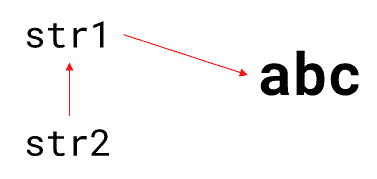
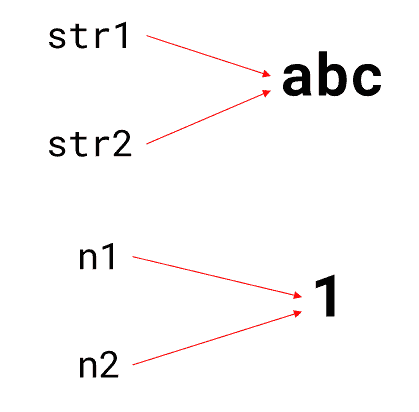
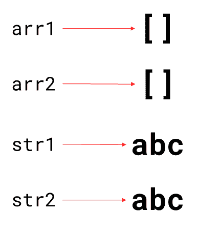
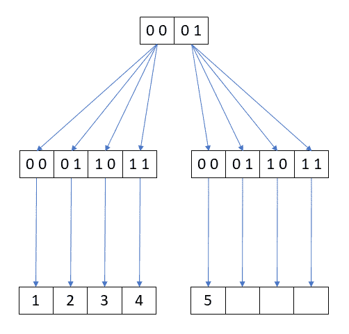
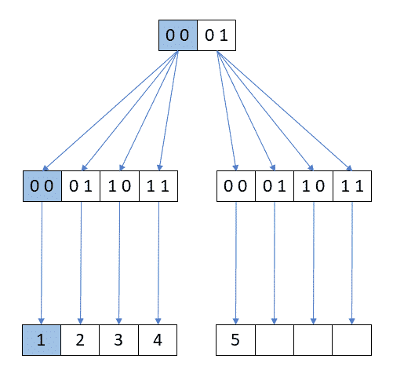
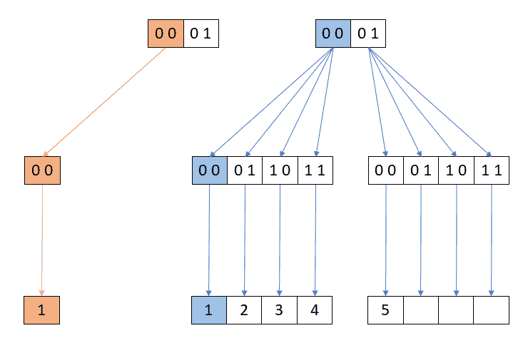
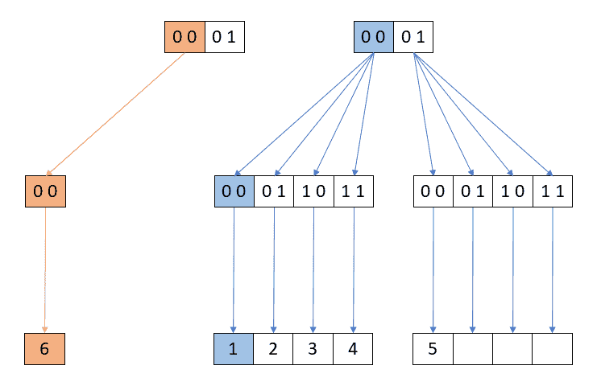

# React 中的不变性:应该改变对象吗？

> 原文：<https://blog.logrocket.com/immutability-react-should-you-mutate-objects/>

***编者按**:这篇文章最后一次更新是在 2022 年 10 月 14 日，包括了关于 React 钩子的附加信息。*

当您开始使用 React 时，您学到的第一件事就是不应该改变或修改列表:

```
// This is bad, push modifies the original array
items.push(newItem);
// This is good, concat doesn’t modify the original array
const newItems = items.concat([newItem]);

```

尽管普遍认为，变异的对象实际上没有任何问题。在某些情况下，比如并发，这可能会成为一个问题，但是，改变对象是最简单的开发方法。就像编程中的大多数事情一样，这是一种权衡。

函数式编程和不变性等概念是热门话题。但是对于 React 来说，不变性不仅仅是时髦，它还有一些真正的好处。在本文中，我们将探索 React 中的不变性，包括它是什么以及如何工作。我们开始吧！

## 目录

## 什么是不变性？

如果某样东西是不可变的，我们就不能改变它的价值或状态。虽然这看起来是一个简单的概念，但通常情况下，细节决定成败。

你可以在 JavaScript 本身找到不可变的类型；`String`值类型就是一个很好的例子。如果按如下方式定义字符串，则不能直接更改字符串中的某个字符:

```
var str = 'abc';

```

在 JavaScript 中，字符串不是数组，因此可以如下定义一个数组:

```
str[2] = 'd';

```

使用下面的方法定义一个字符串，给`str`分配一个不同的字符串:

```
str = 'abd';

```

您甚至可以将`str`引用定义为一个常量:

```
const str = 'abc'

```

因此，分配新字符串会产生错误。然而，这与不变性无关。如果你想修改字符串值，你必须使用像 [replace()](https://developer.mozilla.org/en-US/docs/Web/JavaScript/Reference/Global_Objects/String/replace) 、 [`toUpperCase()`](https://developer.mozilla.org/en-US/docs/Web/JavaScript/Reference/Global_Objects/String/toUpperCase) 或`[trim()](https://developer.mozilla.org/en-US/docs/Web/JavaScript/Reference/Global_Objects/String/trim)`这样的操作方法。所有这些方法都返回新的字符串；他们不会修改原始版本。

## 值类型

注意值类型很重要。字符串值是不可变的，但字符串对象不是。

如果一个对象是不可变的，你不能改变它的状态或属性值。但是，这也意味着您不能向对象添加新属性。

例如，试试下面的小提琴:

如果您运行它，您将看到一个带有消息`undefined`的警告窗口。新属性未添加。现在，试试这个:

字符串是不可变的。最后一个例子用封装了不可变字符串值的`String()`构造函数创建了一个对象。您可以向这个包装器添加新的属性，因为它是一个对象，并且不是[冻结的](https://stackoverflow.com/questions/33124058/object-freeze-vs-const)。这个例子引导我们理解一个重要的概念；引用和值相等的区别。

## 引用相等与值相等

使用引用相等，您可以用`===`和`!==`操作符或者`==`和`!=`操作符来比较对象引用。如果引用指向同一个对象，则认为它们是相等的:

```
var str1 = ‘abc’;
var str2 = str1;
str1 === str2 // true

```

在上面的例子中，`str1`和`str2`引用是相等的，因为它们指向同一个对象，`'abc'`:



如果该值是不可变的，当两个引用引用相同的值时，它们也是相等的:

```
var str1 = ‘abc’;
var str2 = ‘abc’;
str1 === str2 // true
var n1 = 1;
var n2 = 1;
n1 === n2 // also true

```



但是，当谈到对象时，这不再适用:

```
var str1 =  new String(‘abc’);
var str2 = new String(‘abc’);
str1 === str2 // false
var arr1 = [];
var arr2 = [];
arr1 === arr2 // false

```

在每种情况下，都会创建两个不同的对象，因此它们的引用不相等:



如果要检查两个对象是否包含相同的值，必须使用值相等，比较对象的属性值。

在 JavaScript 中，没有直接的方法对对象和数组执行值相等。如果您正在处理字符串对象，您可以使用`valueOf`或`trim`方法，它们返回一个字符串值:

```
var str1 =  new String(‘abc’);
var str2 = new String(‘abc’);
str1.valueOf() === str2.valueOf() // true
str1.trim() === str2.trim() // true

```

对于任何其他类型的对象，要么实现自己的 equals 方法，要么使用第三方库。如果两个对象是不可变的，那么测试它们是否相等就更容易了。React 利用这个概念进行了一些性能优化；让我们详细探讨这些。

## React 中的不变性性能优化

React 维护 UI 的内部表示，称为虚拟 DOM。当组件的属性或状态发生变化时，虚拟 DOM 会更新以反映这些变化。操纵虚拟 DOM 更加容易和快速，因为 UI 中没有任何改变。然后，React 将虚拟 DOM 与更新前的版本进行比较，以了解发生了什么变化，这就是所谓的[协调](https://reactjs.org/docs/reconciliation.html)过程。

因此，在真正的 DOM 中，只有发生变化的元素才会被更新。然而，有时，DOM 的某些部分会被重新渲染，即使它们没有改变。在这种情况下，它们是其他部分发生变化的副作用。您可以实现`[shouldComponentUpdate()](https://reactjs.org/docs/react-component.html#shouldcomponentupdate)`函数来检查属性或状态是否真的改变了，然后返回`true`让 React 执行更新:

```
class MyComponent extends Component {
// ...
shouldComponentUpdate(nextProps, nextState) {
    if (this.props.myProp !== nextProps.color) {
      return true;
    }
    return false;
  }
// ...
}

```

如果组件的属性和状态是不可变的对象或值，您可以用一个简单的等式操作符检查它们是否改变了。

从这个角度来看，不变性消除了复杂性，因为有时很难确切知道什么发生了变化。例如，考虑深层领域:

```
myPackage.sender.address.country.id = 1;

```

如何有效地跟踪哪个嵌套对象发生了变化？想想数组。对于两个大小相同的数组，知道它们是否相等的唯一方法是比较每个元素，对于大型数组来说，这是一个开销很大的操作。

最简单的解决方案是使用不可变对象。如果对象需要更新，您必须用新值创建一个新对象，因为原始值是不可变的，不能更改。您可以使用引用相等来知道它发生了变化。

React 文档还建议将状态视为不可变的。直接操纵状态会使 React 的状态管理失效，从而导致性能问题。React `useState`钩子在性能优化中起着至关重要的作用，它允许您避免直接操纵功能组件中的状态。

对于一些人来说，这个概念可能看起来有点不一致，或者与性能和简单性的想法相反。因此，让我们回顾一下创建新对象和实现不变性的选项。

## 在 React 中实现不变性

在大多数真实世界的应用程序中，您的状态和属性将是对象和数组。JavaScript 提供了一些方法来创建它们的新版本。

### `Object.assign`

您可以使用 [`Object.assign`](https://developer.mozilla.org/en-US/docs/Web/JavaScript/Reference/Global_Objects/Object/assign) 来避免定义未修改的属性，而不是手动创建具有新属性的对象:

```
const modifyShirt = (shirt, newColor, newSize) => {
  return {
    id: shirt.id,
    desc: shirt.desc,
    color: newColor,
    size: newSize
  };
}

const modifyShirt = (shirt, newColor, newSize) => {
  return Object.assign( {}, shirt, {
    color: newColor,
    size: newSize
  });
}

```

`Object.assign`将复制作为参数传递的对象的所有属性，从第二个参数开始到第一个参数中指定的对象。

### 传播算子

您可以使用[扩展运算符](https://developer.mozilla.org/en-US/docs/Web/JavaScript/Reference/Operators/Spread_syntax)，效果相同；不同之处在于`Object.assign()`使用 setter 方法来分配新值，而 spread 运算符不这样做:

```
const modifyShirt = (shirt, newColor, newSize) => {
  return {
    ...shirt,
    color: newColor,
    size: newSize
  };
}

```

您还可以使用 spread 运算符创建具有新值的数组:

```
const addValue = (arr) => {
  return [...arr, 1];
};

```

### `concat`和`slice`方法

或者，您可以使用类似于`concat`或`slice`的方法，它们返回一个新数组，而不修改原来的数组:

```
const addValue = (arr) => {
  return arr.concat([1]);
};
const removeValue = (arr, index) => {
  return arr.slice(0, index)
    .concat(
        arr.slice(index+1)
    );
};

```

在这个[要点](https://gist.github.com/JoeNoPhoto/329f002ef4f92f1fcc21280dc2f4aa71)中，您将看到如何将 spread 操作符与这些方法结合起来，以避免在执行常见操作时改变数组。

然而，使用这些本地方法有两个主要缺点。首先，它们将属性或元素从一个对象或数组复制到另一个对象或数组，对于较大的对象和数组来说，这可能是一个缓慢的操作。此外，默认情况下，对象和数组是可变的。没有任何东西强制不变性。你必须记住使用这些方法中的一种。

由于这些原因，最好使用处理不变性的外部库。

* * *

### 更多来自 LogRocket 的精彩文章:

* * *

## 不变性库

React 团队推荐 [Immutable.js](https://immutable-js.com/) 和[immutanbility-helper](https://github.com/kolodny/immutability-helper)，但是[可以找到许多具有类似功能的库](https://github.com/markerikson/redux-ecosystem-links/blob/master/immutable-data.md)。有三种主要类型:

*   使用专用数据结构的库
*   通过冻结对象来工作的库
*   具有执行不可变操作的助手函数的库

这些库中的大多数都使用持久数据结构。

## 持久数据结构

无论什么时候修改，持久数据结构都会创建一个新版本，使得数据不可变，同时提供对所有版本的访问。

如果数据结构是部分持久的，您可以访问所有版本，但是，您只能修改最新的版本。如果数据结构是完全持久的，您可以访问和修改每个版本。

持久数据结构基于两个概念，树和共享，以有效的方式实现新版本。

数据结构充当列表或映射，但在幕后，它是作为一种树来实现的，称为 [trie](https://en.wikipedia.org/wiki/Trie) ，具体来说是[位图向量 trie](https://stackoverflow.com/a/29121204/3593852) 。只有叶子保存值，键的二进制表示是树的内部节点。

例如，假设我们有下面的数组:

```
[1, 2, 3, 4, 5]

```

我们可以将索引转换为 4 位二进制数:

```
0: 0000
1: 0001
2: 0010
3: 0011
4: 0100

```

我们可以将数组表示为一棵树，如下所示:



每个级别都有两个字节，它们构成了到达某个值的路径。现在，假设您想要将值`1`更新为`6`:



不是直接更新树中的值，而是复制从根到您正在更改的值的路径上的节点:


该值在新节点上更新:



剩余的节点被重用:



换句话说，未修改的节点由两个版本共享。当然，这种 4 位分支通常不用于这些数据结构，但是，这是结构共享的基本概念。

我就不赘述了，但是如果你想了解更多关于持久数据结构和结构共享的知识，我推荐[阅读这篇文章](https://medium.com/@dtinth/immutable-js-persistent-data-structures-and-structural-sharing-6d163fbd73d2)或者[观看这篇演讲](https://www.youtube.com/watch?v=Wo0qiGPSV-s)。

## 不变性的好处

总的来说，不变性提高了应用程序的性能，并促进了简单的调试。它允许简单而廉价地实现检测变化的复杂技术，并确保仅在绝对必要时才执行更新 DOM 的计算开销很大的过程。

## 不变性的缺点

然而，不变性并不是没有自身的问题。正如我前面提到的，当处理对象和数组时，您要么必须记住使用方法而不是强制不变性，要么使用第三方库。

许多这些库使用它们自己的数据类型。尽管它们提供了兼容的 API 和将这些类型转换为原生 JavaScript 类型的方法，但在设计应用程序时，您必须小心避免高度耦合或使用类似`[toJs()](https://twitter.com/leeb/status/746733697093668864)`的方法损害性能。

如果库不实现新的数据结构，例如，通过冻结对象工作的库，就不会有任何结构共享的好处。最有可能的是，对象在更新时会被复制，在某些情况下性能会受到影响。

此外，在较大的团队中实现不变性概念可能会很耗时，因为个体开发人员必须遵守纪律，尤其是在使用具有陡峭学习曲线的第三方库时。您还必须考虑与这些库相关的学习曲线。

Redux 中可以看到不可变性的另一个[缺点，这使得组件在 Redux 的`combineReducers`功能旁边的 reducers 中使用时会出现不必要的渲染。要深入了解 Redux 的不变性，请查看 Redux](https://blog.logrocket.com/redux-immutable-update-patterns/) 中的[不可变数据。](https://redux.js.org/faq/immutable-data)

由于这些原因，在决定使用哪种方法来增强不变性时，您必须小心。

## 结论

理解不变性对于 React 开发人员来说至关重要。不可变的值或对象不能被改变，所以每次更新都会创建新的值，旧的值保持不变。例如，如果您的应用程序状态是不可变的，您可以将所有状态对象保存在一个存储中，以便轻松实现撤消和重做功能。

像 Git 这样的版本控制系统以类似的方式工作。Redux 也是基于那个[原理](https://redux.js.org/introduction/three-principles)。然而，对 Redux 的关注更多的是在纯函数和应用程序状态的快照方面。这个 [StackOverflow 答案](https://stackoverflow.com/a/34962065/3593852)很好的解释了 Redux 和不变性的关系。

不变性还有其他优点，比如避免意外的副作用或者减少耦合，但是它也有缺点。请记住，与编程中的许多事情一样，这是一种权衡。

## [LogRocket](https://lp.logrocket.com/blg/react-signup-general) :全面了解您的生产 React 应用

调试 React 应用程序可能很困难，尤其是当用户遇到难以重现的问题时。如果您对监视和跟踪 Redux 状态、自动显示 JavaScript 错误以及跟踪缓慢的网络请求和组件加载时间感兴趣，

[try LogRocket](https://lp.logrocket.com/blg/react-signup-general)

.

[ ](https://lp.logrocket.com/blg/react-signup-general) [](https://lp.logrocket.com/blg/react-signup-general) 

LogRocket 结合了会话回放、产品分析和错误跟踪，使软件团队能够创建理想的 web 和移动产品体验。这对你来说意味着什么？

LogRocket 不是猜测错误发生的原因，也不是要求用户提供截图和日志转储，而是让您回放问题，就像它们发生在您自己的浏览器中一样，以快速了解哪里出错了。

不再有嘈杂的警报。智能错误跟踪允许您对问题进行分类，然后从中学习。获得有影响的用户问题的通知，而不是误报。警报越少，有用的信号越多。

LogRocket Redux 中间件包为您的用户会话增加了一层额外的可见性。LogRocket 记录 Redux 存储中的所有操作和状态。

现代化您调试 React 应用的方式— [开始免费监控](https://lp.logrocket.com/blg/react-signup-general)。