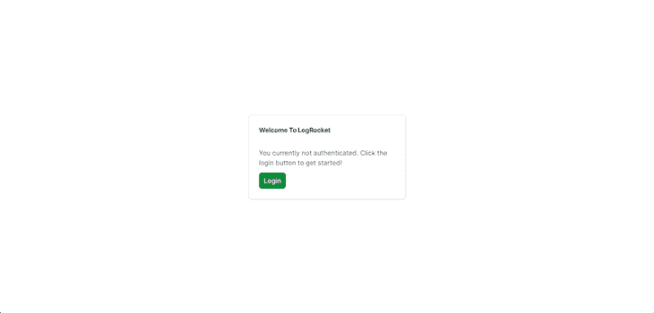
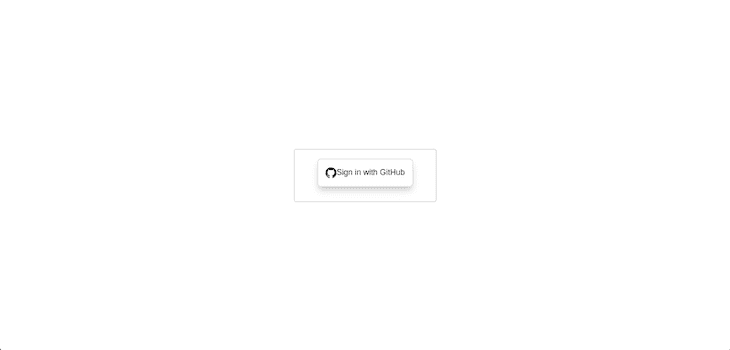
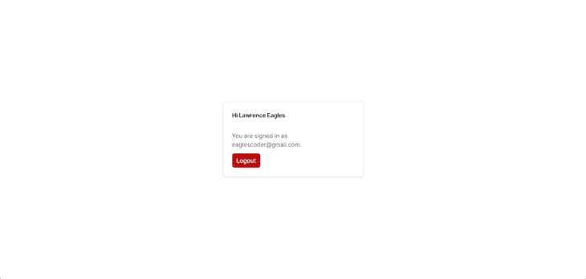
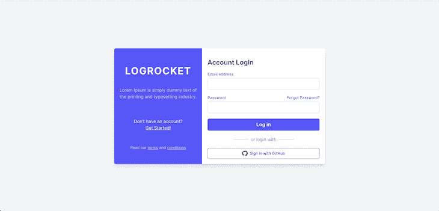
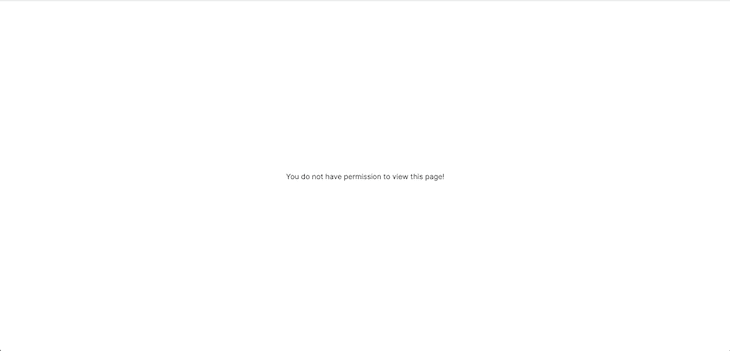
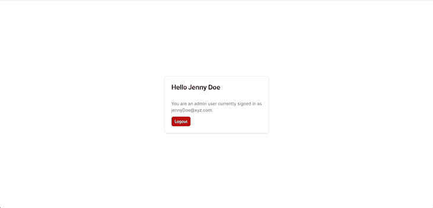

# 如何在 Next.js 中实现认证和授权

> 原文：<https://blog.logrocket.com/implement-authentication-authorization-next-js/>

身份验证和授权是保护用户最有价值信息的两个重要步骤，然而，开发人员经常混淆这两者。

在本教程中，我们将学习如何在 Next.js 中实现一些不同的认证策略，例如，使用电子邮件和密码等凭据，以及第三方服务 GitHub。我们还将在 Next.js 中介绍使用基于角色的授权系统实现授权。让我们开始吧！

*向前跳转*

## Next.js 中的身份验证与授权

身份验证是确认用户就是他们所声称的那个人的行为。用户名和密码是最常见的身份验证因素。

对用户进行身份验证时，如果用户输入了正确的数据，服务器会认为该身份有效，并授予用户对服务器资源的访问权限。

另一方面，安全系统中的授权是允许用户访问服务器上特定资源或功能的过程。该术语通常与访问控制或客户端权限互换使用。

通常，认证先于授权；在后端管理员授权用户访问所请求的资源之前，用户应该首先证明他们的身份是真实的。

在本文中，我们将使用 NextAuth.js 实现认证和[授权策略。开箱即用，](https://blog.logrocket.com/nextauth-js-for-next-js-client-side-authentication/) [NextAuth.js](https://next-auth.js.org) 支持几种不同的身份验证提供者，包括 Atlassian、Auth0 和 GitHub。你可以查看[完整列表](https://next-auth.js.org/providers/)的文档。

由于本文涵盖了身份验证和授权，我们将从了解身份验证开始，这通常是第一位的。基于这些知识，我们将学习如何使用 NextAuth.js 实现授权。

## 先决条件

要阅读本文，您需要以下内容:

*   您的系统上安装的 Node.js 的最新版本或 LTS 版本，在编写本文时是 Node.js v18
*   JavaScript 的基础知识
*   React 的基础知识
*   Next.js 基础知识；熟悉 Next.js API 路径是一个额外的好处
*   熟悉构建 API

## 使用 NextAuth.js 进行 Next.js 身份验证

如前所述，NextAuth.js 是针对 Next.js 的一个健壮且功能丰富的身份验证包。在本节中，我们将使用两种独立的方法来实现身份验证，GitHub 和电子邮件及密码凭证。

首先，克隆这个库以获得启动文件。现在，从 app 目录中，运行以下代码来引导应用程序:

```
// install dependencies 
npm install

// start dev-server
npm run dev

```

如果一切顺利，您应该会看到以下内容:


上面的应用程序样板是一个简单的 [Next.js 和 Tailwind CSS 应用程序](https://blog.logrocket.com/debugging-tailwind-css-next-js/)。接下来，我们将在这个模板的基础上进行构建。

## 使用 GitHub OAuth 进行身份验证

首先，通过运行以下代码安装 NextAuth.js:

```
npm i next-auth

```

要将 NextAuth.js 添加到您的应用程序中，请在`pages/api/auth`目录中创建一个`[...nextauth].js`文件，并添加以下代码:

```
import NextAuth from "next-auth"
import GithubProvider from "next-auth/providers/github"

export const authOptions = {
  secret: process.env.NextAuth_SECRET,
  // Configure one or more authentication providers
  providers: [
    GithubProvider({
      clientId: process.env.GITHUB_ID,
      clientSecret: process.env.GITHUB_SECRET,
    }),
    // ...add more providers here
  ],
}

export default NextAuth(authOptions);

```

上面的代码用 GitHub 提供者配置 NextAuth.js。因此，要获得您的客户端 ID 和客户端密码，您需要[创建一个新的 GitHub OAuth 应用程序](https://docs.github.com/en/developers/apps/building-oauth-apps/creating-an-oauth-app)。

完成后，使用以下代码在根目录中创建一个`.env.local`文件:

```
GITHUB_ID=<!-- Your client ID -->
GITHUB_SECRET=<!-- Your client secret -->
NextAuth_SECRET=<!-- any text -->

```

现在，NextAuth.js 会自动处理所有对`/api/auth/*`的请求，包括`signIn`、`callback`、`signOut`等。

### 配置共享状态

为了配置共享状态，我们需要在应用程序的顶层公开会话上下文`[<SessionProvider />](https://next-auth.js.org/getting-started/client#sessionprovider)`。这样做将允许使用 React 中的`useSection()`钩子。

`<SessionProvider />`保持会话在浏览器标签和窗口之间更新和同步。因此，要公开会话上下文，请更新`page/_api`组件，如下所示:

```
import '../styles/globals.css'
import { SessionProvider } from "next-auth/react"
export default function App({
  Component,
  pageProps: { session, ...pageProps },
}) {
  return (
    <SessionProvider session={session}>
      <Component {...pageProps} />
    </SessionProvider>
  )
}

```

通过上面的设置，`useSession`的实例将可以访问会话`data`和`status`。因此，我们可以从会话中检查用户是否经过了身份验证或授权，并动态地将`jsx`呈现给用户；稍后我们将看到这一点。

接下来，更新`page/index.js`组件，如下所示:

```
import { useSession, signIn, signOut } from "next-auth/react"

export default function Home() {
  const { data: session, status } = useSession()
  if (status === "authenticated") {
    return (
      <section className="grid h-screen place-items-center">
        <div className="max-w-sm p-6 bg-white border border-gray-200 rounded-lg shadow dark:bg-gray-800 dark:border-gray-700">
          <h2 className="mb-2 text-2xl font-bold tracking-tight text-gray-900 dark:text-white">Hi {session?.user?.name}</h2><br />
          <p className="mb-3 font-normal text-gray-700 dark:text-gray-400">You are signed in as {session?.user?.email}.</p>
          <button
            type="button"
            onClick={() => signOut()}
            className="inline-flex items-center px-3 py-2 text-sm font-medium text-center text-white bg-red-700 rounded-lg hover:bg-red-800 focus:ring-4 focus:outline-none focus:ring-red-300 dark:bg-red-600 dark:hover:bg-red-700 dark:focus:ring-red-800">
            Logout
          </button>
        </div>
      </section>
    )
  }
  return (
    <section className="grid h-screen place-items-center">
      <div className="max-w-sm p-6 bg-white border border-gray-200 rounded-lg shadow dark:bg-gray-800 dark:border-gray-700">
        <h2 className="mb-2 text-2xl font-bold tracking-tight text-gray-900 dark:text-white">Welcome To LogRocket</h2><br />
        <p className="mb-3 font-normal text-gray-700 dark:text-gray-400">You currently not authenticated. Click the login button to get started!</p>
        <button
          type="button"
          onClick={() => signIn()}
          className="inline-flex items-center px-3 py-2 text-sm font-medium text-center text-white bg-green-700 rounded-lg hover:bg-green-800 focus:ring-4 focus:outline-none focus:ring-green-300 dark:bg-green-600 dark:hover:bg-green-700 dark:focus:ring-green-800">
          Login
        </button>
      </div>
    </section>
  );
}

```

在上面的代码中，我们析构了`data`，并从`useSession()`的返回值中将其重命名为`session`和`status`。使用`status`值，我们根据用户的身份验证状态呈现适当的 UI。

现在，如果您重启`dev-server`，您将在浏览器中看到以下内容:



显示上面的 UI 是因为您当前没有通过身份验证。要获得认证，单击**登录**按钮，您将看到由 NextAuth.js 创建的默认登录页面，该页面仅包含 GitHub 提供者:



点击按钮后，GitHub 可能会要求您授权该应用程序。最后，如果一切顺利，您将看到以下内容:



## 使用凭据的身份验证

在本节中，我们将了解如何使用电子邮件和密码凭证实现身份验证。为此，我们需要一个数据库和一些后端逻辑来处理我们的登录请求。但是，这超出了本文的范围，所以我们将临时使用 Next.js API 路由。

在根目录中，创建一个数据文件夹，并在其中创建一个包含以下代码的`users.js`文件:

```
const Users = [
    { id: "111", name: "John Doe", email: "[email protected]", password: 1232, role: "user" },
    { id: "112", name: "Jane Doe", email: "[email protected]", password: 1234, role: "user" },
    { id: "113", name: "Jenny Doe", email: "[email protected]", password: 1235, role: "admin" },
    { id: "114", name: "Jude Doe", email: "[email protected]", password: 2222, role: "admin" },
];
export { Users };

```

在上面的代码中，我们导出了一个数组`users`，它将作为我们的数据库。现在，在`page/api`文件夹中，用下面的代码创建一个`login.js`文件:

```
 import { Users } from "../../data/users";
export default function handler(req, res) {
    try {
        if (req.method !== 'POST') {
            res.status(405).send({ message: 'Only POST requests allowed' })
            return
        }
        const body = JSON.parse(JSON.stringify(req.body))
        const user = Users.find((user) => user.email === body.email && user.password === parseInt(body.password));
        if (!user) {
            res.status(404).send({ message: 'User does not exit!' })
            return
        }

        res.status(200).json(user);
    } catch (error) {
        res.status(405).send({ message: `{error.message}` })
        return
    }
};

```

上面的 Node.js 代码表示 Next.js API，这是处理我们的登录请求的后端代码。它使用提供的凭证从`users`数组中查找并返回一个用户。

接下来，更新`[...nextauth].js`文件，如下所示:

```
import NextAuth from "next-auth"
import GithubProvider from "next-auth/providers/github"
import CredentialsProvider from "next-auth/providers/credentials";
export const authOptions = {
    secret: process.env.NextAuth_SECRET,
    // Configure one or more authentication providers
    providers: [
        GithubProvider({
            clientId: process.env.GITHUB_ID,
            clientSecret: process.env.GITHUB_SECRET,
        }),
        CredentialsProvider({
            // The name to display on the sign in form (e.g. "Sign in with...")
            name: "Credentials",
            // `credentials` is used to generate a form on the sign in page.
            // You can specify which fields should be submitted, by adding keys to the `credentials` object.
            // e.g. domain, username, password, 2FA token, etc.
            // You can pass any HTML attribute to the <input> tag through the object.
            credentials: {
                email: {
                    label: "Email",
                    type: "text",
                    placeholder: "Enter email",
                },
                password: {
                    label: "Password",
                    type: "password",
                    placeholder: "Enter Password",
                },
            },

            async authorize(credentials, req) {
                const { email, password } = credentials
                const res = await fetch("http://localhost:3000/api/login", {
                    method: "POST",
                    headers: {
                        "Content-Type": "application/json",
                    },
                    body: JSON.stringify({
                        email,
                        password,
                    }),
                });
                const user = await res.json();
                if (res.ok && user) {
                    return user;
                } else return null;
            },
        }),
        // ...add more providers here
    ],
    callbacks: {
        async jwt({ token, user }) {
            return { ...token, ...user };
        },
        async session({ session, token, user }) {
            // Send properties to the client, like an access_token from a provider.
            session.user = token;
            return session;
        },
    },
    pages: {
        signIn: '/auth/signin',
    }
}
export default NextAuth(authOptions)

```

在上面的`[...nextauth].js`代码中，我们添加了`CredentialsProvider`，并将其配置为使用`email`和`password`对用户进行身份验证。在`authorize async`函数中，我们使用指定的用户凭证处理了对之前创建的 Next.js API 路由的`POST`请求。然后，如果找到用户，我们返回用户，如果没有找到用户，则返回`null`。

然后，我们使用回调处理特定的动作。在 NextAuth.js 中，回调是强大的异步函数，使我们能够控制一个动作发生时会发生什么。回调使我们能够在不使用数据库时实现访问控制，就像我们当前的情况一样。它们还使我们能够与外部数据库或 API 集成。

在上面的代码中，我们使用了一个 [JWT 回调](https://next-auth.js.org/configuration/callbacks#jwt-callback)来返回一个带有令牌的新的经过身份验证的用户对象，并使用了一个[会话回调](https://next-auth.js.org/configuration/callbacks#session-callback)来使带有 JWT 令牌的新用户对客户端可用。

最后，我们使用 [`pages`](https://next-auth.js.org/configuration/pages) 属性，通过用`/auth/signin`值指定一个`signin`属性来覆盖 Next.js 默认登录页面。

现在，在`pages`文件夹中，创建一个名为`auth`的新文件夹。在`auth`文件夹中，用下面的代码创建一个名为`signin.js`的新文件:

```
import { useRef } from "react";
import { getProviders, getSession, signIn } from "next-auth/react"

const Signin = ({ providers }) => {
    const email = useRef("");
    const password = useRef("");
    return (
        <div className="flex items-center min-h-screen p-4 bg-gray-100 lg:justify-center">
            <div
                className="flex flex-col overflow-hidden bg-white rounded-md shadow-lg max md:flex-row md:flex-1 lg:max-w-screen-md"
            >
                <div
                    className="p-4 py-6 text-white bg-blue-500 md:w-80 md:flex-shrink-0 md:flex md:flex-col md:items-center md:justify-evenly"
                >
                    <div className="my-3 text-4xl font-bold tracking-wider text-center">
                        <a href="#">LOGROCKET</a>
                    </div>
                    <p className="mt-6 font-normal text-center text-gray-300 md:mt-0">
                        Lorem Ipsum is simply dummy text of the printing and typesetting industry.
                    </p>
                    <p className="flex flex-col items-center justify-center mt-10 text-center">
                        <span>Don't have an account?</span>
                        <a href="#" className="underline">Get Started!</a>
                    </p>
                    <p className="mt-6 text-sm text-center text-gray-300">
                        Read our <a href="#" className="underline">terms</a> and <a href="#" className="underline">conditions</a>
                    </p>
                </div>
                <div className="p-5 bg-white md:flex-1">
                    <h3 className="my-4 text-2xl font-semibold text-gray-700">Account Login</h3>
                    <form action="#" className="flex flex-col space-y-5">
                        <div className="flex flex-col space-y-1">
                            <label htmlFor="email" className="text-sm font-semibold text-gray-500">Email address</label>
                            <input
                                type="email"
                                id="email"
                                autoFocus
                                className="px-4 py-2 transition duration-300 border border-gray-300 rounded focus:border-transparent focus:outline-none focus:ring-4 focus:ring-blue-200"
                                onChange={(e) => (email.current = e.target.value)}
                            />
                        </div>
                        <div className="flex flex-col space-y-1">
                            <div className="flex items-center justify-between">
                                <label htmlFor="password" className="text-sm font-semibold text-gray-500">Password</label>
                                <a href="#" className="text-sm text-blue-600 hover:underline focus:text-blue-800">Forgot Password?</a>
                            </div>
                            <input
                                type="password"
                                id="password"
                                className="px-4 py-2 transition duration-300 border border-gray-300 rounded focus:border-transparent focus:outline-none focus:ring-4 focus:ring-blue-200"
                                onChange={(e) => (password.current = e.target.value)}
                            />
                        </div>
                        <div>
                            <button
                                type="button"
                                className="w-full px-4 py-2 text-lg font-semibold text-white transition-colors duration-300 bg-blue-500 rounded-md shadow hover:bg-blue-600 focus:outline-none focus:ring-blue-200 focus:ring-4"
                                onClick={() => signIn("credentials", {
                                    email: email.current, password: password.current,
                                })}
                            >
                                Log in
                            </button>
                        </div>
                        <div className="flex flex-col space-y-5">
                            <span className="flex items-center justify-center space-x-2">
                                <span className="h-px bg-gray-400 w-14"></span>
                                <span className="font-normal text-gray-500">or login with</span>
                                <span className="h-px bg-gray-400 w-14"></span>
                            </span>
                            <div className="flex flex-col space-y-4">
                                {providers &&
                                    Object.values(providers).map(provider => {
                                        if (provider.name !== "Credentials") {
                                            return (
                                                <div key={provider.name} style={{ marginBottom: 0 }}>
                                                    <a
                                                        href="#"
                                                        className="flex items-center justify-center px-4 py-2 space-x-2 transition-colors duration-300 border border-gray-800 rounded-md group hover:bg-gray-800 focus:outline-none"
                                                        onClick={() => signIn(provider.id)}
                                                    >
                                                        <span>
                                                            <svg
                                                                className="w-5 h-5 text-gray-800 fill-current group-hover:text-white"
                                                                viewBox="0 0 16 16"
                                                                version="1.1"
                                                                aria-hidden="true"
                                                            >
                                                                <path
                                                                    d="M8 0C3.58 0 0 3.58 0 8c0 3.54 2.29 6.53 5.47 7.59.4.07.55-.17.55-.38 0-.19-.01-.82-.01-1.49-2.01.37-2.53-.49-2.69-.94-.09-.23-.48-.94-.82-1.13-.28-.15-.68-.52-.01-.53.63-.01 1.08.58 1.23.82.72 1.21 1.87.87 2.33.66.07-.52.28-.87.51-1.07-1.78-.2-3.64-.89-3.64-3.95 0-.87.31-1.59.82-2.15-.08-.2-.36-1.02.08-2.12 0 0 .67-.21 2.2.82.64-.18 1.32-.27 2-.27.68 0 1.36.09 2 .27 1.53-1.04 2.2-.82 2.2-.82.44 1.1.16 1.92.08 2.12.51.56.82 1.27.82 2.15 0 3.07-1.87 3.75-3.65 3.95.29.25.54.73.54 1.48 0 1.07-.01 1.93-.01 2.2 0 .21.15.46.55.38A8.013 8.013 0 0016 8c0-4.42-3.58-8-8-8z"
                                                                ></path>
                                                            </svg>
                                                        </span>
                                                        <span className="text-sm font-medium text-gray-800 group-hover:text-white">Sign in with{' '} {provider.name}</span>
                                                    </a>
                                                </div>
                                            )
                                        }
                                    })}
                            </div>
                        </div>
                    </form>
                </div>
            </div>
        </div>
    )
}
export default Signin
export async function getServerSideProps(context) {
    const { req } = context;
    const session = await getSession({ req });
    const providers = await getProviders()
    if (session) {
        return {
            redirect: { destination: "/" },
        };
    }
    return {
        props: {
            providers,
        },
    }
}

```

上面的代码只是显示了一个登录表单，允许使用凭证登录。在该表单下面，显示了其他提供者的列表。目前，我们只有 GitHub 提供商。

如果登录尝试成功，用户将被重定向到主页。现在，如果您重启`dev-server`，您应该会看到以下内容:



您可以通过使用来自数据数组的用户名和密码登录来测试凭证提供者实现，结果将与 GitHub 提供者相同。这样，我们的认证就完成了！

在下一节中，我们将学习如何实现授权。

## 使用 NextAuth.js 进行 Next.js 授权

授权检查通过身份验证的用户是否有权查看 UI 或使用某项功能。在本节中，我们将实现[基于角色的授权系统](https://next-auth.js.org/tutorials/role-based-login-strategy)。为此，我们需要创建一个需要管理员权限才能查看的页面。在`page`文件夹中，用以下代码创建一个`dashboard.js`文件:

```
import { signOut, useSession } from "next-auth/react"

export default function Dashboard() {
    const { data: session } = useSession()
    const user = session?.user;
    if (user?.role !== "admin") {
        return (
            <section className="grid h-screen place-items-center">
                <div className="w-25">
                    <p>You do not have permission to view this page!</p>
                </div>
            </section>
        );
    }
    return (
        <section className="grid h-screen place-items-center">
            <div className="max-w-sm p-6 bg-white border border-gray-200 rounded-lg shadow dark:bg-gray-800 dark:border-gray-700">
                <h2 className="mb-2 text-2xl font-bold tracking-tight text-gray-900 dark:text-white">Hello {session?.user?.name}</h2><br />
                <p className="mb-3 font-normal text-gray-700 dark:text-gray-400">You are an admin user currently signed in as {session?.user?.email}.</p>
                <button
                    type="button"
                    onClick={() => signOut()}
                    className="inline-flex items-center px-3 py-2 text-sm font-medium text-center text-white bg-red-700 rounded-lg hover:bg-red-800 focus:ring-4 focus:outline-none focus:ring-red-300 dark:bg-red-600 dark:hover:bg-red-700 dark:focus:ring-red-800">
                    Logout
                </button>
            </div>
        </section>
    )
}

```

上面的代码从会话中获取当前登录并通过身份验证的用户，并检查用户角色是否为`admin`。如果是，它将呈现页面。否则，它会呈现一个 UI 读数`you do not have permission to view this page!`。

您可以通过使用非管理员用户登录并导航到`localhost:3000/dashboard`来测试这一点。您将看到以下内容:



现在，以管理员用户身份登录并访问仪表板。您将看到以下内容:



## 结论

NextAuth.js 库为许多流行的登录服务提供了内置支持，使得 API 集成过程变得快速而简单。在本文中，我们探索了使用 NextAuth.js 来配置 Next.js 应用程序，以使用 OAuth 流进行用户授权。我们还探索了使用 NextAuth.js 中的电子邮件和密码凭证来验证和授权用户。

我希望你喜欢这篇文章。如果有任何问题，一定要留下评论。编码快乐！

## [LogRocket](https://lp.logrocket.com/blg/nextjs-signup) :全面了解生产 Next.js 应用

调试下一个应用程序可能会很困难，尤其是当用户遇到难以重现的问题时。如果您对监视和跟踪状态、自动显示 JavaScript 错误、跟踪缓慢的网络请求和组件加载时间感兴趣，

[try LogRocket](https://lp.logrocket.com/blg/nextjs-signup)

.

[](https://lp.logrocket.com/blg/nextjs-signup)[](https://lp.logrocket.com/blg/nextjs-signup)

LogRocket 就像是网络和移动应用的 DVR，记录下你的 Next.js 应用上发生的一切。您可以汇总并报告问题发生时应用程序的状态，而不是猜测问题发生的原因。LogRocket 还可以监控应用程序的性能，报告客户端 CPU 负载、客户端内存使用等指标。

LogRocket Redux 中间件包为您的用户会话增加了一层额外的可见性。LogRocket 记录 Redux 存储中的所有操作和状态。

让您调试 Next.js 应用的方式现代化— [开始免费监控](https://lp.logrocket.com/blg/nextjs-signup)。