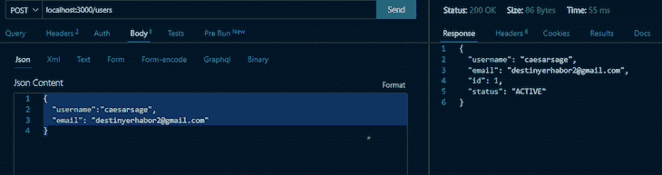
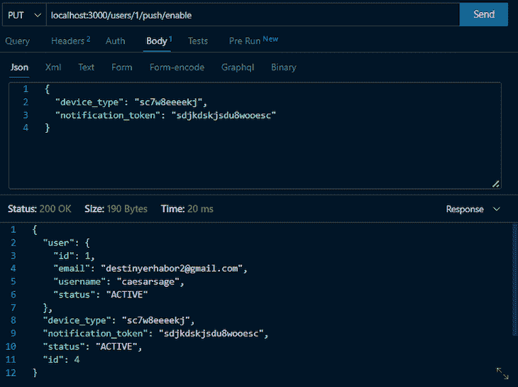
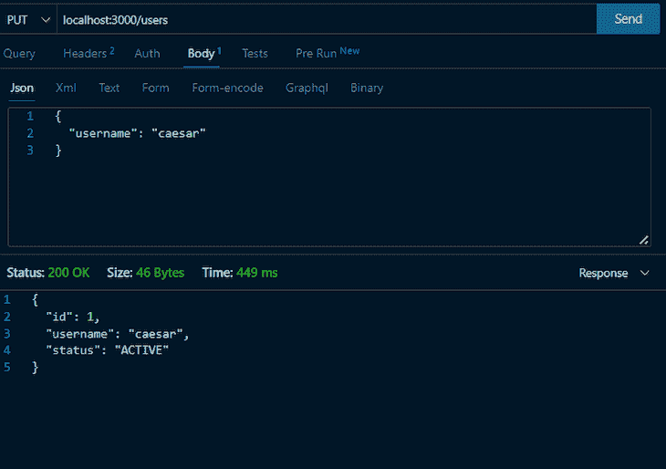
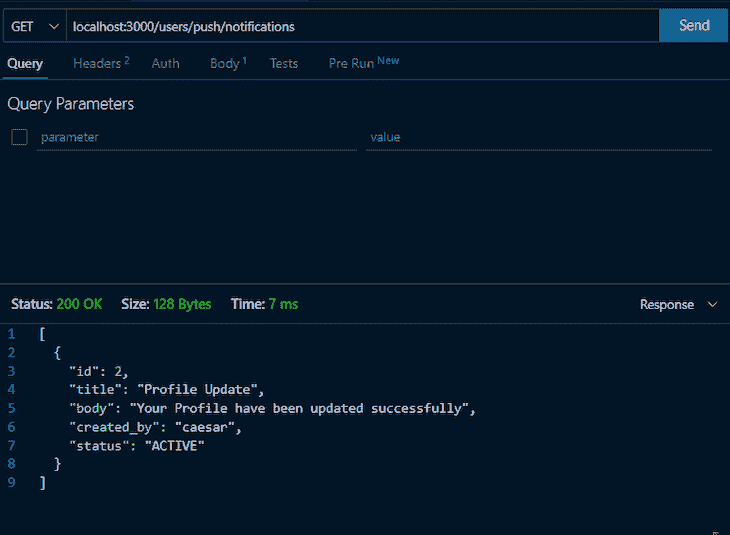

# 使用 NestJS、MySQL 和 Firebase 实现应用内通知

> 原文：<https://blog.logrocket.com/implement-in-app-notifications-nestjs-mysql-firebase/>

应用内提醒是为你的应用用户提供实时信息的好方法。 [Firebase Cloud Messaging (FCM)是一个跨平台的消息系统](https://blog.logrocket.com/react-native-push-notifications-firebase-cloud-messaging/),是向您的客户端应用发送推送通知的绝佳工具。

在本文中，我们将介绍在 NestJS 项目中设置 Firebase 云消息传递。我们将使用 MySQL 数据库来存储和检索通知数据，并根据数据库信息向用户发送推送通知。

*向前跳转:*

## 先决条件

开始之前，请确保您具备以下条件:

*   全球安装 NestJS CLI
*   启用了云消息服务的 Firebase 项目

要跟进，您可以[查看 GitHub repo](https://github.com/Caesarsage/inapp-notification-with-nestJS) 。我们开始吧！

## 设置 Firebase 云消息传递

要开始使用 NestJS 中的 FCM，您需要建立一个 Firebase 项目并启用 FCM API。为此，请遵循 [Firebase 文档](https://firebase.google.com/docs/cloud-messaging/js/client)中的说明。

设置好 Firebase 项目后，您需要创建一个服务帐户并下载私钥文件，该文件是一个 JSON 文件，包含认证 Firebase Admin SDK 所需的凭证。

将私钥文件移动到应用程序的根目录；对于本教程，我们将重命名文件`firebase-admin-sdk.json`。用下面的命令安装 [`firebase-admin`](https://www.npmjs.com/package/firebase-admin) 包:

```
npm install --save firebase-admin

```

## 创建 NestJS 用户和通知资源

在使用推送通知的系统中，用户资源是指为每个用户存储和管理的信息；这可能包括用户的设备类型、推送通知偏好和联系信息等信息。通常，此信息用于根据每个用户的偏好和历史来定制推送通知的内容和传送。

另一方面，通知资源指的是用于启用、禁用和发送推送通知的逻辑和功能。这可能包括安排通知、创建和管理通知组以及自定义通知的内容和外观的能力。这可能还包括跟踪通知的交付和参与，例如，通过使用打开率、点击率等。

我们将使用下面的代码片段生成这些新的 NestJS 资源:

```
 nest g res notification --no-spec
```

```
 nest g res users --no-spec

```

## 设置 MySQL

在处理通知资源之前，让我们设置 MySQL 数据库来存储通知数据。首先，安装 [MySQL2](https://www.npmjs.com/package/mysql2) 和 [TypeORM](https://typeorm.io/) 包:

```
npm install --save mysql2 typeorm @nestjs/typeorm @nestjs/config

```

现在，让我们更新一下`app.module.ts`:

```
import { Module } from '@nestjs/common';
import { TypeOrmModule } from '@nestjs/typeorm';
import { AppService } from './app.service';
import { Notification } from './notification/entities/notification.entity';
import { NotificationModule } from './notification/notification.module';

@Module({
  imports: [
    TypeOrmModule.forRoot({
      type: "mysql",
      host: process.env.DB_HOST,
      port: 3306,
      username: procees.env.DB_NAME,
      password: process.env.DB_PASSWORD,
      database: "in_app_notification",
      entities: [Notification],
      synchronize: true,
  }),
    NotificationModule
  ],
  controllers: [],
  providers: [AppService],
})

export class AppModule {}

```

首先，`TypeOrmModule.forRoot({...})`导入`TypeOrmModule`。然后，它使用`.forRoot()`方法为模块提供一个配置对象，该对象建立到 MySQL 数据库的连接，指定`host`、`port`、`username`、`password`、`database name`、`database`的类型、用于表的`entities`和`synchronization`状态。

我们在位于应用程序根目录的`.env`文件中定义环境变量。请记住，在生产环境中，建议使用`migrations`并将`synchronization`设置为`false`。

## 用户资源

我们将使用`TypeOrmModule`来建立 MySQL 连接并创建`User`实体。将以下代码添加到`user.module.ts`:

```
import { Module } from '@nestjs/common';
import { UsersService } from './users.service';
import { UsersController } from './users.controller';
import { NotificationModule } from 'src/notification/notification.module';
import { TypeOrmModule } from '@nestjs/typeorm';
import { User } from './entities/user.entity';

@Module({
  imports: [
    TypeOrmModule.forFeature([User]),
    NotificationModule
  ],
  controllers: [UsersController],
  providers: [UsersService]
})

export class UsersModule {}

```

## 创建`User`实体

实体帮助我们定义数据库表模式；默认情况下，`User`实体将`ID`、`email`、`username`、`status`定义为`ACTIVE`:

```
import { Entity, Column, PrimaryGeneratedColumn } from 'typeorm';

@Entity({ name: 'users' })
export class User {
  @PrimaryGeneratedColumn()
  id: number;

  @Column()
  email: string;

  @Column()
  username: string;

  @Column({
    default: 'ACTIVE',
  })
  status: string;
}

```

目前，这些都将存储在`user`模块中。我们稍后将再次讨论这个模块，以利用推送通知。

## 通知资源

在该模块中，我们将使用`TypeOrmModule`来建立 MySQL 连接，创建`Notification`实体，并导出服务。将下面的代码添加到`notification.module.ts`:

```
import { Module } from '@nestjs/common';
import { NotificationService } from './notification.service';
import { NotificationController } from './notification.controller';
import { TypeOrmModule } from '@nestjs/typeorm';
import { Notifications } from './entities/notification.entity';
import { NotificationToken } from './entities/notification-token.entity';

@Module({
  imports: [
    TypeOrmModule.forFeature([Notifications, NotificationToken])
  ],
  controllers: [NotificationController],
  providers: [NotificationService],
  exports: [NotificationService]
})

export class NotificationModule {}

```

## 创建通知和`NotificationToken`实体

将以下代码添加到`notification.entity.ts`:

```
import { Entity, Column, PrimaryGeneratedColumn, JoinColumn, ManyToOne } from 'typeorm';
import { NotificationToken } from './notification-token.entity';

@Entity({ name: 'notifications' })
export class Notifications {
  @PrimaryGeneratedColumn()
  id: number;

  @JoinColumn({ name: 'notification_token_id', referencedColumnName: 'id' })
  @ManyToOne(() => NotificationToken)
  notification_token: NotificationToken;

  @Column()
  title: string;

  @Column({ type: 'longtext', nullable: true })
  body: any;

  @Column()
  created_by: string;

  @Column({
    default: 'ACTIVE',
  })
  status: string;
}

```

`Notification`实体有以下几列:`id`、`title`、`body`、`status`和`created_by`。

`id`列是主键，由数据库自动生成。`notification_token`与`NoticationToken`表有一个`ManyToOne`关系，其他列存储通知的数据。

接下来，将以下代码添加到`notification-token.entity.ts`文件中:

```
import { User } from 'src/users/entities/user.entity';
import { Entity, Column, JoinColumn, ManyToOne, PrimaryGeneratedColumn } from 'typeorm';

@Entity({ name: 'notification_tokens' })
export class NotificationToken {
  @PrimaryGeneratedColumn()
  id: number;

  @JoinColumn({ name: 'user_id', referencedColumnName: 'id' })
  @ManyToOne(() => User)
  user: User;

  @Column()
  device_type: string;

  @Column()
  notification_token: string;

  @Column({
    default: 'ACTIVE',
  })
  status: string;
}

```

`NotificationToken`实体有`id`、`user`、`device_type`、`status`和`notification_token`列；`notification_token`是在注册的 FCM 设备上生成的唯一字符串。

`id`列是主键，由数据库自动生成。`notification_token`与`User`表有一个`ManyToOne`关系，而其他列存储通知的数据。

## 服务器上的 FCM 通知令牌用例

移动应用程序或浏览器向 FCM 注册，然后 FCM 给该设备一个唯一的令牌。设备将这个令牌发送给我们的 NestJS 服务器，我们将这个 FCM 令牌存储在数据库中。

当用户获得推送通知时，注册到用户设备的唯一令牌将负责使用 Firebase Admin SDK 发送推送通知。

### `notification.service.ts`

```
import { Injectable } from '@nestjs/common';
import { InjectRepository } from '@nestjs/typeorm';
import { Notifications } from './entities/notification.entity';
import { Repository } from 'typeorm';
import * as firebase from 'firebase-admin';
import * as path from 'path';
import { NotificationToken } from './entities/notification-token.entity';
import { NotificationDto } from './dto/create-notification.dto';
import { UpdateNotificationDto } from './dto/update-notification.dto';

firebase.initializeApp({
  credential: firebase.credential.cert(
    path.join(__dirname, '..', '..', 'firebase-adminsdk.json'),
  ),
});

@Injectable()
export class NotificationService {
  constructor(
    @InjectRepository(Notifications) private readonly notificationsRepo: Repository<Notifications>,
    @InjectRepository(NotificationToken) private readonly notificationTokenRepo: Repository<NotificationToken>,
  ) {}

  acceptPushNotification = async (
    user: any,
    notification_dto: NotificationDto ,
  ): Promise<NotificationToken> => {};

  disablePushNotification = async (
    user: any,
    update_dto: UpdateNotificationDto,
  ): Promise<void> => {};

  getNotifications = async (): Promise<any> => {};

  sendPush = async (user: any, title: string, body: string): Promise<void> => {};
}

```

上面的代码首先导入必要的模块和依赖项，包括 nestj`Injectable`和`InjectRepository`装饰器，TypeORM `Repository`、`Notifications`和`NotificationToken`实体，以及 Firebase `firebase-admin`模块。然后，它使用存储在`firebase-adminsdk.json`文件中的服务帐户密钥初始化 Firebase 应用程序。

然后用`Injectable`装饰器定义并装饰`NotificationService`类。它有三个存储库作为私有属性，分别为`Notifications`和`NotificationToken`实体的`notificationsRepo`和`notificationTokenRepo`。

`NotificationService`类有四个方法:

### `acceptPushNotification`

```
acceptPushNotification = async (
    user: any,
    notification_dto: NotificationDto ,
  ): Promise<NotificationToken> => {
    await this.notificationTokenRepo.update(
      { user: { id: user.id } },
      {
        status: 'INACTIVE',
      },
    );
    // save to db
    const notification_token = await this.notificationTokenRepo.save({
      user: user,
      device_type: notification_dto.device_type,
      notification_token: notification_dto.notification_token,
      status: 'ACTIVE',
    });
    return notification_token;
  };

```

`acceptPushNotification`使用`notificationTokenRepo.update`方法将用户的所有现有通知令牌的状态更新为`INACTIVE`。它使用提供的用户对象、令牌和设备类型创建一个新的通知令牌对象，并将状态设置为`ACTIVE`。

最后，它使用`notificationTokenRepo.save`方法将新的通知令牌保存到数据库。

### `disablePushNotification`

```
disablePushNotification = async (
    user: any,
    update_dto: UpdateNotificationDto,
  ): Promise<void> => {
    try {
      await this.notificationTokenRepo.update(
        { user: { id: user.id }, device_type: update_dto.device_type },
        {
          status: 'INACTIVE',
        },
      );
    } catch (error) {
      return error;
    }
  };

```

`disablePushNotification`根据更新 DTO 中提供的用户 ID 和设备类型，使用`notificationTokenRepo.update`方法将用户的特定通知令牌的状态更新为`INACTIVE`。

* * *

### 更多来自 LogRocket 的精彩文章:

* * *

### `getNotifications`

```
getNotifications = async (): Promise<any> => {
    return await this.notificationsRepo.find();
  };
```

`getNotifications`使用`notificationsRepo.find()`方法从数据库中检索所有通知。

### `sendPush`

```
sendPush = async (user: any, title: string, body: string): Promise<void> => {
    try {
      const notification = await this.notificationTokenRepo.findOne({
        where: { user: { id: user.id }, status: 'ACTIVE' },
      });
      if (notification) {
        await this.notificationsRepo.save({
          notification_token: notification,
          title,
          body,
          status: 'ACTIVE',
          created_by: user.username,
        });
        await firebase
          .messaging()
          .send({
            notification: { title, body },
            token: notification.notification_token,
            android: { priority: 'high' },
          })
          .catch((error: any) => {
            console.error(error);
          });
      }
    } catch (error) {
      return error;
    }
  };

```

`sendPush`使用`notificationTokenRepo.findOne`方法为用户找到一个活动的通知令牌；它搜索用户 ID 和状态为`ACTIVE`的令牌。

如果找到通知令牌，它会使用`notificationsRepo.save`方法将通知保存到数据库，其中`title`、`body`和`status`由用户创建。

它使用 FCM `firebase.messaging().send()`方法将通知发送到用户的设备，传入通知的`title`、`body`、用户的通知令牌以及为 Android 设置的优先级`high`。

*   `token`:应该向其发送通知的设备的 FCM 注册令牌
*   `title`:通知的标题
*   `body`:通知的正文
*   `android`:设置设备类型优先级

值得注意的是，`sendPush`方法使用`firebase-admin`包发送推送通知，这是 Node.js 的官方 Firebase Admin SDK，允许您从服务器环境与 Firebase 服务进行交互。

## 对用户使用推送通知

现在我们已经设置了 FCM 和 MySQL，我们可以使用它们根据 MySQL 数据库中的数据向用户发送推送通知。使用 Firebase 服务，我们可以更新用户服务以启用、从数据库中检索通知并发送它们。

为了演示这一点，让我们使用一个更新端点。只要用户启用了通知，每次他们更新配置文件时，我们都会调用通知服务中的`sendPush`方法，向用户发送推送通知，并将通知保存在数据库中。

## 配置用户服务

首先，将`NotificationService`注入用户服务:

```
import { Injectable } from '@nestjs/common';
import { NotificationService } from 'src/notification/notification.service';

@Injectable()
export class UsersService {
  constructor(
    @InjectRepository(User) private readonly userRepository: Repository<User>,
    private readonly notificationService: NotificationService,
  ) {}

  create(user: CreateUserDto): Promise<User> {}

  updateProfile = async (user_id: number, update_dto: any): Promise<any> => {}

  enablePush = async (
   user_id: number,
    update_dto: NotificationDto,
  ): Promise<any> => {};

  disablePush = async (
    user_id: number,
    update_dto: UpdateNotificationDto,
  ): Promise<any> => {};

  getPushNotifications = async (): Promise<any> => {};

}

```

`UsersService`类有五个方法:

### `create`

```
create(user: CreateUserDto): Promise<User> {
    return this.userRepository.save(user);
  }

```

`create`创建一个新的用户帐户并保存到数据库。

### `updateProfile`

```
updateProfile = async (user_id: number, update_dto: any): Promise<any> => {
    try {
      const user = await this.userRepository.findOne({
        where: { id: user_id },
      });
      const updated_user = {
        ...user,
        username: update_dto.username,
        email: update_dto.email,
      }
      const saved_user = await this.userRepository.save(updated_user);
      if (saved_user) {
        // send push notification
        await this.notificationService.sendPush(
          updated_user,
          'Profiie update',
          'Your Profile have been updated successfully',
        )
        .catch((e) => {
          console.log('Error sending push notification', e);
        }); 
      }
      return saved_user;
    } catch (error) {
      return error;
    }
  }

```

`updateProfile`使用提供的用户对象创建新的用户对象，从更新 DTO 更新用户名和电子邮件。

它使用`userRepository.save`方法将更新的用户对象保存到数据库中。如果用户保存成功，它使用`notificationService.sendPush`方法向用户发送推送通知，传入更新后的用户对象、标题`Profile update`和正文阅读信息`Your Profile have been updated successfully`。

它有一个`try...catch`块来处理在执行该方法时可能出现的任何错误，如果有错误就返回错误。

### `enablePush`

```
enablePush = async (
   user_id: number,
    update_dto: NotificationDto,
  ): Promise<any> => {
    const user = await this.userRepository.findOne({
      where: { id: user_id },
    });
    return await this.notificationService.acceptPushNotification(
      user,
      update_dto,
    );
  };

```

通过搜索 ID 与提供的用户 ID 相匹配的用户，`enablePush`使用`userRepository.findOne`方法在数据库中找到该用户。

然后，它调用`notificationService.acceptPushNotification`方法并传递用户和更新 DTO 作为参数。这允许用户接受任何发送的推送通知，或者在我们的例子中，当用户配置文件更新时接受推送通知。

### `disablePush`

```
disablePush = async (
    user_id: number,
    update_dto: UpdateNotificationDto,
  ): Promise<any> => {
    const user = await this.userRepository.findOne({
      where: { id: user_id },
    });
    return await this.notificationService.disablePushNotification(
      user,
      update_dto,
    );
  };

```

通过搜索 ID 与提供的用户 ID 相匹配的用户，`disablePush`使用`userRepository.findOne`方法在数据库中找到该用户。然后它调用`notificationService.disablePushNotification`方法，传递用户和更新 DTO 作为参数。

### `getPushNotifications`

```
getPushNotifications = async (): Promise<any> => {
    return await this.notificationService.getNotifications();
  };

```

`getPushNotifications`调用`notificationService.getNotifications()`方法并返回结果。

值得注意的是，这些方法分别使用`userRepository`和`notificationService`与数据库交互和处理推送通知。它可以被认为是使用特定服务来分别处理推送通知和用户简档的更高级服务。

## 配置用户控制器

既然我们的用户服务配置了上面提到的五种方法，我们将通过初始化`UsersService`类的私有实例来创建不同的端点作为控制器，它负责执行实际的用户操作:

```
import { Controller, Get, Post, Body, Patch, Param, Delete, HttpStatus, HttpCode, Put } from '@nestjs/common';
import { NotificationDto } from 'src/notification/dto/create-notification.dto';
import { UpdateNotificationDto } from 'src/notification/dto/update-notification.dto';
import { UsersService } from './users.service';

@Controller('users')
export class UsersController {
  constructor(
    private readonly usersService: UsersService,
  ) {}

  @Post()
  @HttpCode(HttpStatus.OK)
  async CreateUser(@Body() user: CreateUserDto) {
    return await this.usersService.create(user);
  }

  @Put()
  @HttpCode(HttpStatus.OK)
  async updateProfile(
    @Body() update_dto: any,
    @Param('id') user_id: number,
  ) {
    return await this.usersService.updateProfile(user_id ,update_dto);
  }

  @Put('push/enable')
  @HttpCode(HttpStatus.OK)
  async enablePush(
    @Body() update_dto: NotificationDto,
    @Param('id') user_id: number,
  ) {
    return await this.usersService.enablePush(user_id, update_dto)  
  }

  @Put('push/disable')
  @HttpCode(HttpStatus.OK)
  async disablePush(
    @Param('id') user_id: number,
    @Body() update_dto: UpdateNotificationDto,
  ) {
    return await this.usersService.disablePush(user_id, update_dto)
  }

  @Get('push/notifications')
  @HttpCode(HttpStatus.OK)
  async fetchPusNotifications() {
    return await this.usersService.getPushNotifications();
  }
}

```

`@Controller('users')`定义了基本端点。`@Post`装饰器处理 HTTP `POST`请求，用于创建新用户。创建一个新用户，调用`UsersService`的`create`方法，用户信息作为`@Body`传递。

`@Put`装饰器处理 HTTP `PUT`请求，更新用户的档案。然后调用`UsersService`的`updateProfile`方法，用用户 ID 作为请求`@Param`和更新的用户信息来更新用户的配置文件。

类似地，`@Put('push/enable')`和`@Put('push/disable')`方法处理为用户启用或禁用推送通知。`@Param`装饰器用于从 URL 中提取用户 ID，而`@Body`装饰器用于提取启用或禁用推送通知所需的信息。

然后用用户 ID 和必要的信息调用`UsersService`的`enablePush`和`disablePush`方法，为用户启用或禁用推送通知。最后，`@Get('push/notifications')`方法处理获取推送通知。然后调用`UsersService`的`getPushNotifications`方法来获取推送通知。

`@HttpCode`装饰器用于为每个方法设置 HTTP 响应代码，默认为所有方法的`200 (OK)`。

## 测试控制器端点

为了测试我们的用户控制器，我们将使用 [VS Code Thunder Client](https://marketplace.visualstudio.com/items?itemName=rangav.vscode-thunder-client) 。首先，让我们创建一个用户:



用户必须启用推送通知才能接收它们。因此，我们将发送我们的`device_type`和唯一的 FCM 令牌。请记住，特定设备上您的客户端应用程序的 FCM 标识由`notification token`表示。

当它第一次向 FCM 注册时，您的应用程序在设备或浏览器上运行时会获得一个注册令牌；注册令牌在运行时创建。

`notification_token`:



用户接受了推送通知，其从前端生成的`notification token`被存储。因此，用户可以更新其配置文件和通知首选项，保存并在前端处理时获得有关其配置文件更新的通知:



最后，您可以查看所有通知:



在客户端，您需要使用 Firebase JavaScript SDK 来请求显示推送通知和处理传入推送通知的权限。

## 结论

在本文中，我们学习了如何使用 Firebase 和 MySQL 在 NestJS 应用程序中实现应用程序内通知。首先，我们设置 Firebase Admin SDK 来发送推送通知。然后，我们设置了一个 MySQL 数据库来存储通知数据，并创建了一个服务来基于数据库中的数据检索和发送通知。

我希望你喜欢这篇文章。有问题就留言吧，编码愉快！

## 使用 [LogRocket](https://lp.logrocket.com/blg/signup) 消除传统错误报告的干扰

[](https://lp.logrocket.com/blg/signup)

[LogRocket](https://lp.logrocket.com/blg/signup) 是一个数字体验分析解决方案，它可以保护您免受数百个假阳性错误警报的影响，只针对几个真正重要的项目。LogRocket 会告诉您应用程序中实际影响用户的最具影响力的 bug 和 UX 问题。

然后，使用具有深层技术遥测的会话重放来确切地查看用户看到了什么以及是什么导致了问题，就像你在他们身后看一样。

LogRocket 自动聚合客户端错误、JS 异常、前端性能指标和用户交互。然后 LogRocket 使用机器学习来告诉你哪些问题正在影响大多数用户，并提供你需要修复它的上下文。

关注重要的 bug—[今天就试试 LogRocket】。](https://lp.logrocket.com/blg/signup-issue-free)