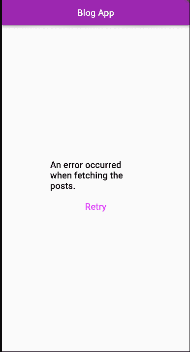
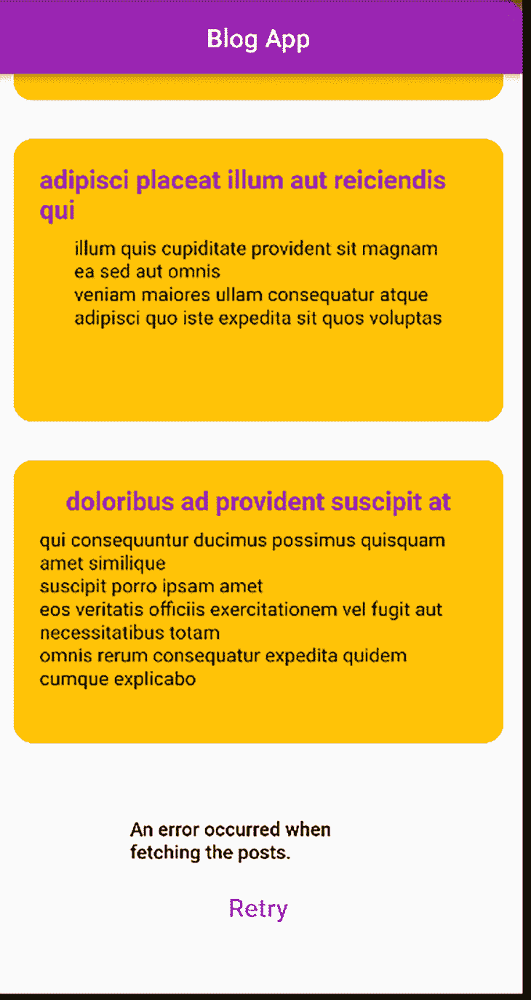
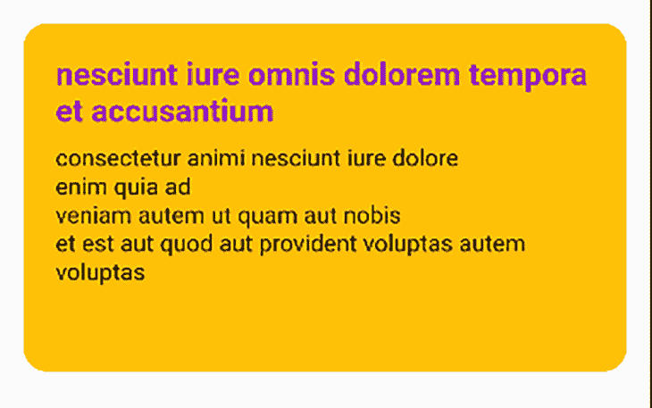
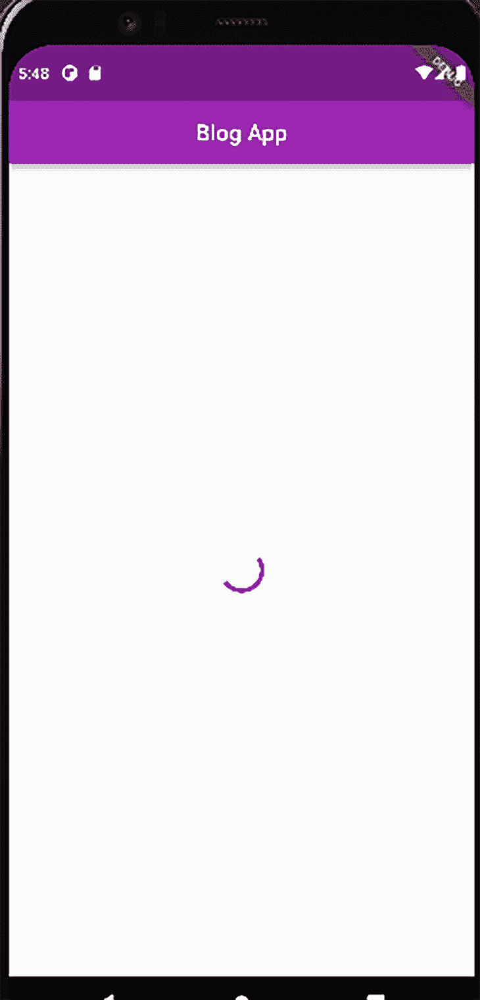
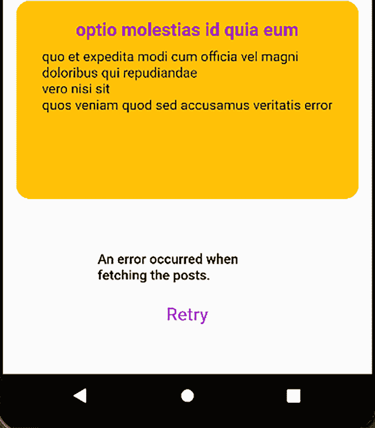
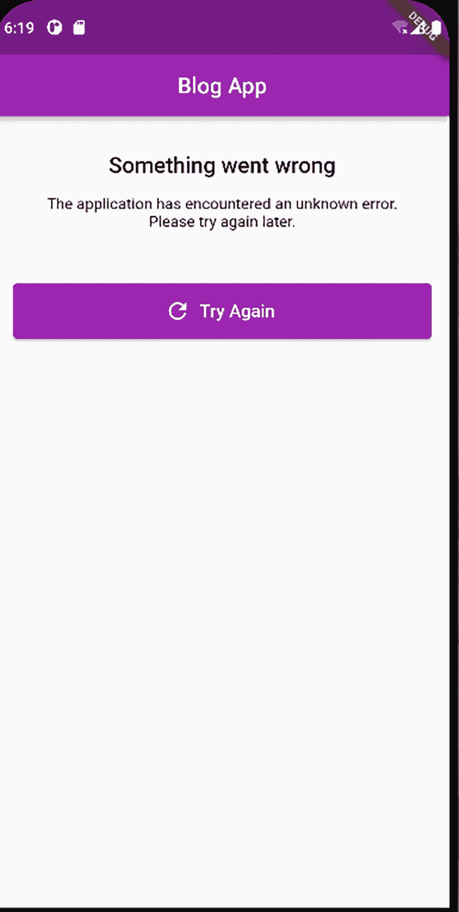
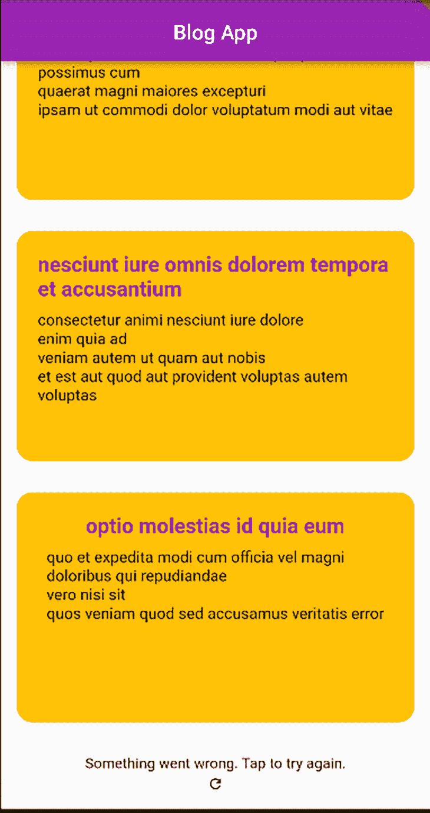

# 如何在 Flutter - LogRocket 博客中实现无限滚动分页

> 原文：<https://blog.logrocket.com/implement-infinite-scroll-pagination-flutter/>

你有没有想过 Instagram 和 Twitter 这样的社交媒体平台如何在用户滚动应用程序时不断向他们提供帖子？感觉这些页面永远不会结束，即使你可能也注意到了屏幕上周期性出现的加载指示器。

这是无限滚动分页的可视化实现的一个例子。它有时也被称为无限滚动分页、自动分页、延迟加载分页或渐进加载分页。

在软件开发中，分页是将数据分成连续段的过程，从而允许用户以他们期望的速度使用数据位。当您的应用程序提供大量有序的数据时，这非常有用，就像用户在浏览 Instagram 或 Twitter 时的体验一样。这也是有益的，因为一次加载所有数据可能会降低应用程序的性能，并且用户可能不会消耗掉您提供的所有数据。

在本教程中，您将学习如何使用 [ListView](https://api.flutter.dev/flutter/widgets/ListView-class.html) 、 [ScrollController](https://api.flutter.dev/flutter/widgets/ScrollController-class.html) 和[infinite _ scroll _ pagination](https://pub.dev/packages/infinite_scroll_pagination)包对您的 Flutter 小部件进行分页，并给用户一种无限滚动的感觉。

我们将具体介绍以下几个部分:

## 入门指南

### 先决条件

本教程将演示如何通过构建一个基本的博客应用程序来实现无限滚动分页。应用程序利用 [JSONPlaceholder API](https://jsonplaceholder.typicode.com/) 的`Post`资源作为其数据源。屏幕上显示的每个帖子都将提供其标题和正文，如下所示:


应用程序从获取前十篇文章开始。当用户向下滚动页面时，它会获取更多的帖子。

请注意出现在屏幕上加载的帖子之前的圆形进度指示器的位置。同样，屏幕底部的第二个指示器指示更多的帖子正在被获取。

应用程序获取下一组文章的时间点取决于您的偏好。当用户到达屏幕上最后一个可用的帖子时，您可以选择获取更多数据，因为此时，您可以确定用户有兴趣查看更多帖子。

然而，等待这么长时间也会迫使用户每次到达屏幕底部时都要等待应用程序获取帖子；你应该知道这个指标的位置会影响你的应用程序的 UX。用户等待你的帖子越多，他们对你的应用程序就越不感兴趣。

通常建议您在用户看到时间线上 60-80%的数据后获取新的或额外的数据。这样，当您推断用户对查看更多数据感兴趣时，您也在获取和准备数据。在用户查看完文章的当前部分之前获取附加数据需要更短的等待时间。

另一方面，当用户还没有到达时间线的一半时获取更多的数据可能会导致应用程序用尽不必要的资源来获取用户可能不感兴趣或不想看到的数据。

错误通信是另一个要考虑的事情。在获取数据时，有两个要点可能会出现错误:

1.  当应用程序正在获取第一个分页数据时:此时，屏幕上没有帖子，当出现错误时，错误显示在屏幕的中央，如下所示:
    
2.  当应用程序获取更多分页数据时:这里，应用程序已经在屏幕上呈现了帖子。此时出现的错误应显示一条消息，表明用户仍可访问先前加载的数据，并可请求重试:
    

[`ListView`](https://api.flutter.dev/flutter/widgets/ListView-class.html) 是一个给你可滚动功能的抖动窗口小部件。这允许您拥有一个小部件集合，这些小部件不必完全适合屏幕，但可以在您滚动屏幕时单独查看。让我们从零开始，用`ListView`来看看无限卷轴的上述特性的实现。

在终端中运行以下命令创建项目文件夹，然后用您喜欢的代码编辑器打开它:

```
flutter create infinite_scroll

```

创建一个名为`post`的 Dart 文件来包含`Post`模型的代码，然后将以下代码添加到该文件中:

```
class Post {
  final String title;
  final String body;
  Post(this.title, this.body);

}

```

接下来，创建一个名为`post_item`的小部件文件，包含 post 小部件所需的代码。该文件应包含以下内容:

```
import 'package:flutter/material.dart';

class PostItem extends StatelessWidget {

  final String title;
  final String body;

  PostItem(this.title, this.body);

  @override
  Widget build(BuildContext context) {
    return Container(
      height: 220,
      width: 200,
      decoration: const BoxDecoration(
          borderRadius: BorderRadius.all(Radius.circular(15)),
          color: Colors.amber
      ),
      child: Padding(
        padding: const EdgeInsets.all(20.0),
        child: Column(
          crossAxisAlignment: CrossAxisAlignment.center,
          children: <Widget>[
            Text(title,
              style: const TextStyle(
                  color: Colors.purple,
                  fontSize: 20,
                  fontWeight: FontWeight.bold
              ),),
            const SizedBox(height: 10,),
            Text(body,
              style: const TextStyle(
                  fontSize: 15
              ),)
          ],
        ),
      ),
    );
  }
}

```

上面的代码片段呈现了一个包含文章标题和正文的`Container`小部件。一个 [`BoxDecoration`](https://api.flutter.dev/flutter/painting/BoxDecoration-class.html) 小部件样式化容器，给出如下输出:



下一步是创建一个名为`post-overview_screen`的 Dart 文件，该文件将使用一个`ListView`以可滚动的格式呈现文章。将以下代码添加到文件中:

```
import 'dart:convert';

import 'package:flutter/material.dart';
import 'package:http/http.dart';

import '../model/post.dart';
import '../widgets/post_item.dart';

class PostsOverviewScreen extends StatefulWidget {

  @override
  _PostsOverviewScreenState createState() => _PostsOverviewScreenState();
}
class _PostsOverviewScreenState extends State<PostsOverviewScreen> {
  late bool _isLastPage;
  late int _pageNumber;
  late bool _error;
  late bool _loading;
  final int _numberOfPostsPerRequest = 10;
  late List<Post> _posts;
  final int _nextPageTrigger = 3;

  @override
  void initState() {
    super.initState();
    _pageNumber = 0;
    _posts = [];
    _isLastPage = false;
    _loading = true;
    _error = false;
    fetchData();
  }

}

```

上面的代码片段包含了构建页面所必需的属性的初始化。其中包括:

*   `_isLastPage`:一个`boolean`变量，指示是否有更多数据要提取
*   `_pageNumber`:一个`int`变量，决定要取的分页数据的段。它的初始值为零，因为来自 JSONPlaceholder API 的分页数据是从零开始的
*   `_error`:一个`boolean`变量，指示在获取数据时是否发生了错误
*   `_loading`:另一个`boolean`变量，取决于应用程序当前是否正在请求数据
*   `_numberOfPostsPerRequest`:确定每个请求要获取的元素数量
*   `_posts`:保存所有提取的帖子的变量
*   `_nextPageTrigger`:确定下一次请求获取更多数据的时间点。将值初始化为`3`意味着当用户在当前页面上还有三篇文章需要查看时，应用程序将请求更多的数据；您可以用不同的值测试应用程序，并比较体验

接下来，将下面的方法添加到`_PostsOverviewScreenState`类中。该方法执行从 API 获取数据的逻辑，并使用响应创建一个存储在`_posts`变量中的`Post`对象列表。

```
Future<void> fetchData() async {
    try {
      final response = await get(Uri.parse(
          "https://jsonplaceholder.typicode.com/posts?_page=$_pageNumber&_limit=$_numberOfPostsPerRequest"));
      List responseList = json.decode(response.body);
      List<Post> postList = responseList.map((data) => Post(data['title'], data['body'])).toList();

      setState(() {
        _isLastPage = postList.length < _numberOfPostsPerRequest;
        _loading = false;
        _pageNumber = _pageNumber + 1;
        _posts.addAll(postList);
      });
    } catch (e) {
      print("error --> $e");
      setState(() {
        _loading = false;
        _error = true;
      });
    }
  }

```

上面的`fetchData`方法使用`_pageNumber`和`_numberOfPostsPerRequest`变量作为参数，向 API 的 post 资源发送 GET 请求。接收的数据是包含不同帖子值的 JSON 对象列表。下面是从 API 接收的一个数据示例:

```
{
    "userId": 1,
    "id": 1,
    "title": "sunt aut facere repellat provident occaecati excepturi optio reprehenderit",
    "body": "quia et suscipit\nsuscipit recusandae consequuntur expedita et cum\nreprehenderit molestiae ut ut quas totam\nnostrum rerum est autem sunt rem eveniet architecto"
  }

```

当对 API 的请求成功时，`json.decode`对响应进行解码。每个提取的标题和主体用于创建`Post`对象的列表。使用`setState`，变量接收更新。

`_isLastPage`的值取决于新接收的数据量是否小于请求的数据量。例如，如果应用程序请求了 10 个帖子，但收到了 7 个，这意味着它已经耗尽了帖子的来源。

`_pageNumber`的值也增加，以便应用程序可以在下一次请求时请求下一个分页数据。

接下来，仍然在同一个类中，添加以下代码来处理错误:

```
Widget errorDialog({required double size}){
    return SizedBox(
      height: 180,
      width: 200,
      child:  Column(
        mainAxisAlignment: MainAxisAlignment.center,
        children: [
          Text('An error occurred when fetching the posts.',
            style: TextStyle(
                fontSize: size,
                fontWeight: FontWeight.w500,
                color: Colors.black
            ),
          ),
          const SizedBox(height: 10,),
          FlatButton(
              onPressed:  ()  {
                setState(() {
                  _loading = true;
                  _error = false;
                  fetchData();
                });
              },
              child: const Text("Retry", style: TextStyle(fontSize: 20, color: Colors.purpleAccent),)),
        ],
      ),
    );
  }

```

上面的小部件包含一列传达错误的文本和一个允许用户重试加载帖子的按钮。

将下面的`build`方法添加到文件中:

```
@override
  Widget build(BuildContext context) {
    return Scaffold(
      appBar: AppBar(title: const Text("Blog App"), centerTitle: true,),
      body: buildPostsView(),
    );
  }

  Widget buildPostsView() {
    if (_posts.isEmpty) {
      if (_loading) {
        return const Center(
            child: Padding(
              padding: EdgeInsets.all(8),
              child: CircularProgressIndicator(),
            ));
      } else if (_error) {
        return Center(
            child: errorDialog(size: 20)
        );
      }
    }
      return ListView.builder(
          itemCount: _posts.length + (_isLastPage ? 0 : 1),
          itemBuilder: (context, index) {

            if (index == _posts.length - _nextPageTrigger) {
              fetchData();
            }
            if (index == _posts.length) {
              if (_error) {
                return Center(
                    child: errorDialog(size: 15)
                );
              } else {
                return const Center(
                    child: Padding(
                      padding: EdgeInsets.all(8),
                      child: CircularProgressIndicator(),
                    ));
              }
            }
            final Post post = _posts[index];
            return Padding(
              padding: const EdgeInsets.all(15.0),
              child: PostItem(post.title, post.body)
            );
          });
    }

```

上面的`build`方法检查 post 列表是否为空，然后进一步检查应用程序当前是否正在加载或者是否发生了错误。如果是前者，它会在屏幕中央呈现进度指示器；否则，它会显示`errorDialog`小部件。



如果应用程序当前没有加载，并且在向 API 发出第一个请求时没有发生错误，那么应用程序将使用`PostItem`小部件呈现`Post`对象列表中的数据。

此时，它会进一步检查当前是否正在请求更多数据，为此，它会在屏幕底部显示加载指示器。如果加载更多数据时出现错误，它会在屏幕底部显示`errorDialog`。



如果两者都不是，那么成功获取的数据将呈现在屏幕上。

最后，这里是`main.dart`文件:

```
import 'package:flutter/material.dart';
import 'package:infinte_scroll/base_infinite_scroll/post_overview_screen.dart';

void main() {
  runApp(const MyApp());
}

class MyApp extends StatelessWidget {
  const MyApp({Key? key}) : super(key: key);

  // This widget is the root of your application.
  @override
  Widget build(BuildContext context) {
    return MaterialApp(
      title: 'Flutter Demo',
      theme: ThemeData(

        primarySwatch: Colors.purple,
      ),
      home:  MyHomePage(),
    );
  }
}

class MyHomePage extends StatefulWidget {
  @override
  State<MyHomePage> createState() => _MyHomePageState();
}

class _MyHomePageState extends State<MyHomePage> {

  @override
  Widget build(BuildContext context) {
    return Scaffold(
      body: PostsOverviewScreen()
    );
  }
}

```

Flutter [`ScrollController`](https://api.flutter.dev/flutter/widgets/ScrollController-class.html) 是 [`Listenable abstract`类](https://api.flutter.dev/flutter/foundation/Listenable-class.html)的后代，它允许您在客户端正在监听的小部件有更新时通知客户端。您可以使用`ScrollController`来收听类似于[`ListView`](https://api.flutter.dev/flutter/widgets/ListView-class.html)[`GridView`](https://api.flutter.dev/flutter/widgets/GridView-class.html)和 [`CustomScrollView`](https://api.flutter.dev/flutter/widgets/CustomScrollView-class.html) 的可滚动小工具。

在我们的 tutorial 应用程序的上下文中，`ScrollController`将负责监控用户向下滚动页面的距离。基于这些信息和您为`nextPageTrigger`值设置的阈值，它触发从 API 获取数据的方法。

在`post_overview_screen`文件中声明并初始化一个`ScrollController`对象，如下所示:

```
class ScrollControllerDemo extends StatefulWidget {

  @override
  _ScrollControllerDemoState createState() => _ScrollControllerDemoState();
}
class _ScrollControllerDemoState extends State<ScrollControllerDemo> {
  late bool _isLastPage;
  late int _pageNumber;
  late bool _error;
  late bool _loading;
  late int _numberOfPostsPerRequest;
  late List<Post> _posts;
  late ScrollController _scrollController;

  @override
  void initState() {
    super.initState();
    _pageNumber = 0;
    _posts = [];
    _isLastPage = false;
    _loading = true;
    _error = false;
    _numberOfPostsPerRequest = 10;
    _scrollController = ScrollController();
    fetchData();
  }

  @override
  void dispose() {
    super.dispose();
    _scrollController.dispose();
  }

}

```

然后用以下内容替换`build`方法:

```
@override
  Widget build(BuildContext context) {
    _scrollController.addListener(() {
// nextPageTrigger will have a value equivalent to 80% of the list size.
      var nextPageTrigger = 0.8 * _scrollController.position.maxScrollExtent;

// _scrollController fetches the next paginated data when the current postion of the user on the screen has surpassed 
      if (_scrollController.position.pixels > nextPageTrigger) {
        _loading = true;
        fetchData();
      }
    });

    return Scaffold(
      appBar: AppBar(title: const Text("Blog App"), centerTitle: true,),
      body: buildPostsView(),
    );
  }

  Widget buildPostsView() {
    if (_posts.isEmpty) {
      if (_loading) {
        return const Center(
            child: Padding(
              padding: EdgeInsets.all(8),
              child: CircularProgressIndicator(),
            ));
      } else if (_error) {
        return Center(
            child: errorDialog(size: 20)
        );
      }
    }
    return ListView.builder(
        controller: _scrollController,
        itemCount: _posts.length + (_isLastPage ? 0 : 1),
        itemBuilder: (context, index) {

          if (index == _posts.length) {
            if (_error) {
              return Center(
                  child: errorDialog(size: 15)
              );
            }
            else {
              return const Center(
                  child: Padding(
                    padding: EdgeInsets.all(8),
                    child: CircularProgressIndicator(),
                  ));
            }
          }

            final Post post = _posts[index];
            return Padding(
                padding: const EdgeInsets.all(15.0),
                child: PostItem(post.title, post.body)
            );
        }
        );
  }

```

在 build 方法中，`scrollController`对象添加了一个监听器来监视`ListView`的滚动。然后，当用户使用了帖子列表中 80%以上的数据时，它会调用`fetchData`方法。

有时，您可能不想从头开始构建和配置分页滚动。`[infinite scroll pagination package](https://pub.dev/packages/infinite_scroll_pagination)`是一个外部包，您可以安装它来处理无限滚动操作的数据分页。当请求第一个或额外的分页数据时，这个包抽象了错误和进度处理的过程。

负责构建无限卷轴的包有三个基本组件，都是泛型类:

1.  `PagingController`:监视分页数据的状态，并在监听器通知时请求额外的数据
2.  `PagedListView`:负责接收所需控制器的页面上呈现的数据的视图；在这种情况下，负责分页的`pagingController`
3.  `PagedChildBuilderDelegate`:负责构建视图中的每一项，并为错误和进度处理构建默认或定制的小部件

下面是使用这个包构建基本博客应用程序的实现，在前面的章节中已经演示过了:

在您的终端中运行以下命令，将包添加到您的`pubspec.yaml`文件中:

```
flutter pub add infinite_scroll_pagination

```

下载依赖关系:

```
flutter pub get

```

创建一个新的 Dart 文件，并向其中添加以下代码:

```
import 'dart:convert';
import 'package:flutter/material.dart';
import 'package:http/http.dart';
import 'package:infinite_scroll_pagination/infinite_scroll_pagination.dart';

import '../model/post.dart';
import '../widgets/post_item.dart';

class InfiniteScrollPaginatorDemo extends StatefulWidget {
  @override
  _InfiniteScrollPaginatorDemoState createState() => _InfiniteScrollPaginatorDemoState();
}

class _InfiniteScrollPaginatorDemoState extends State<InfiniteScrollPaginatorDemo> {
  final _numberOfPostsPerRequest = 10;

  final PagingController<int, Post> _pagingController =
  PagingController(firstPageKey: 0);

  @override
  void initState() {
    _pagingController.addPageRequestListener((pageKey) {
      _fetchPage(pageKey);
    });
    super.initState();
  }

 @override
  void dispose() {
    _pagingController.dispose();
    super.dispose();
  }

}

```

回想一下，`PagingController`是一个接收两个泛型类型参数的泛型类，如上所示。第一个参数`int`，表示您想要消费的 API 的页码的数据类型。JSONPlaceholder 使用`int`值来表示每个页面。这个值可能因 API 而异，因此从您想要使用的 API 中找出这个值是很重要的。

`firstPageKey`参数表示您想要请求的第一个页面的索引。该参数的初始值为零，因为 JSONPlacholder 中的页面有一个从零开始的索引，即第一页的页码是`0`而不是`1`。

在`initState`，`_pagingController`设置一个监听器，根据`pageKey`的当前值获取页面。

下面是获取页面的实现。在类中添加此方法:

```
Future<void> _fetchPage(int pageKey) async {
    try {
      final response = await get(Uri.parse(
          "https://jsonplaceholder.typicode.com/posts?_page=$pageKey&_limit=$_numberOfPostsPerRequest"));
      List responseList = json.decode(response.body);
      List<Post> postList = responseList.map((data) =>
          Post(data['title'], data['body'])).toList();
      final isLastPage = postList.length < _numberOfPostsPerRequest;
      if (isLastPage) {
        _pagingController.appendLastPage(postList);
      } else {
        final nextPageKey = pageKey + 1;
        _pagingController.appendPage(postList, nextPageKey);
      }
    } catch (e) {
      print("error --> $e");
      _pagingController.error = e;
    }
  }

```

`fetchPage`方法接收`pageKey`作为其参数，并使用其值和数据的首选大小从 API 获取页面。它使用来自 API 响应的数据创建一个`Post`对象列表。控制器然后使用`appendLastPage`或`appendPage`方法保存创建的列表，这取决于新获取的数据是否在最后一页。如果在获取数据时出现错误，控制器使用其`error`属性来处理它。

下面是屏幕的`build`方法:

```
 @override
  Widget build(BuildContext context) {
      return Scaffold(
        appBar:
          AppBar(title: const Text("Blog App"), centerTitle: true,),
        body: RefreshIndicator(
          onRefresh: () => Future.sync(() => _pagingController.refresh()),
          child: PagedListView<int, Post>(
            pagingController: _pagingController,
            builderDelegate: PagedChildBuilderDelegate<Post>(
              itemBuilder: (context, item, index) =>
                  Padding(
                    padding: const EdgeInsets.all(15.0),
                    child: PostItem(
                        item.title, item.body
                    ),
                  ),

            ),

          ),
        ),
      );
}

```

[`infinite scroll pagination`](https://pub.dev/packages/infinite_scroll_pagination/install) 包让你可以灵活地将你的小部件包裹在[刷新指示器](https://api.flutter.dev/flutter/material/RefreshIndicator-class.html)周围。这允许您向下拖动屏幕来触发刷新。刷新实现调用控制器的`refresh`方法来清除其数据。

`PageListView`也接收您在创建控制器时分配的相同类型的通用类。通过分配给其`builderDelegate`参数的`PageChildBuilderDelegate`实例，它构建每个`PostItem`小部件。

### 定制您的进度指示器和错误处理

请注意，您不需要像在前面几节中那样配置进度指示器或错误处理操作。这是因为软件包使用其默认值为您处理所有这些。




`PageChildBuilderDelegate`对象还通过以下可选参数为您提供了定制错误处理和进度操作的灵活性:

*   `newPageErrorIndicatorBuilder`:处理更多数据请求时出现的错误。它接收一个小部件，当发生错误时，该部件将在已经加载的数据下面呈现
*   `firstPageErrorIndicatorBuilder`:处理第一次请求数据时出现的错误。分配给该操作的小部件呈现在屏幕的中央，因为此时屏幕是空的
*   `firstPageProgressIndicatorBuilder`:当应用程序请求它的第一个分页数据时，它接收一个出现在屏幕中央的小部件
*   `newPageProgressIndicatorBuilder`:当应用程序请求更多数据时，它会接收一个出现在已有数据下方的小部件
*   `noItemsFoundIndicatorBuilder`:当 API 返回一个空的数据集合时，它接收一个小部件。这不被认为是一个错误，因为从技术上讲，API 调用是成功的，但是没有找到数据
*   `noMoreItemsIndicatorBuilder`:当用户用尽 API 返回的所有数据时，它接收要呈现的小部件

## 结论

在本教程中，您了解了对提供给用户的数据进行分页的必要性，以及在构建分页无限滚动时需要考虑的事项。您还构建了一个基本的博客应用程序，该应用程序从头开始使用 [`ListView`](https://api.flutter.dev/flutter/widgets/ListView-class.html) 、 [`ScrollController`](https://api.flutter.dev/flutter/widgets/ScrollController-class.html) 来跟踪分页，并使用 [`>infinite_scroll_pagination`](https://pub.dev/packages/infinite_scroll_pagination) 外部包来执行无限滚动操作。

该应用可从 [GitHub](https://github.com/olu-damilare/infinite_scroll_pagination) 获取更多信息。干杯！