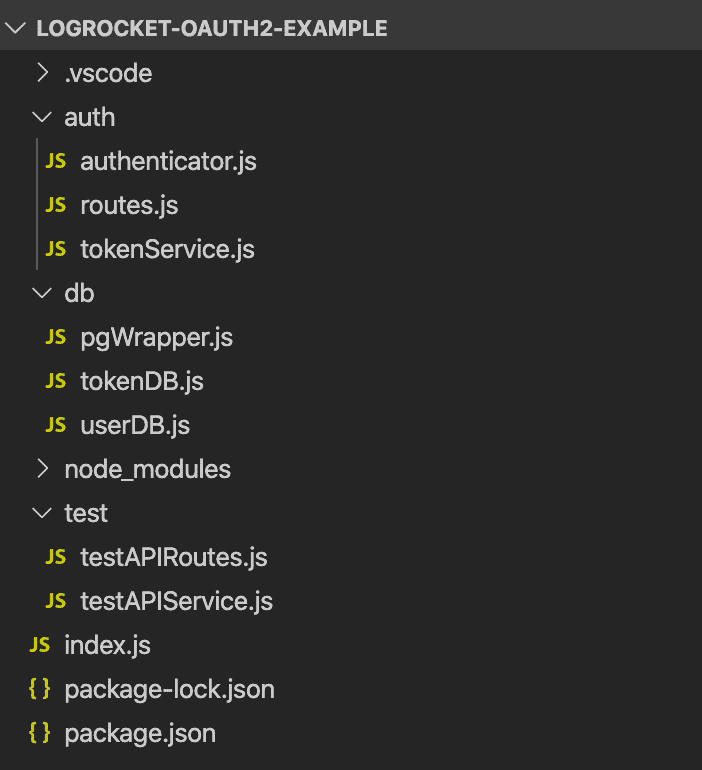
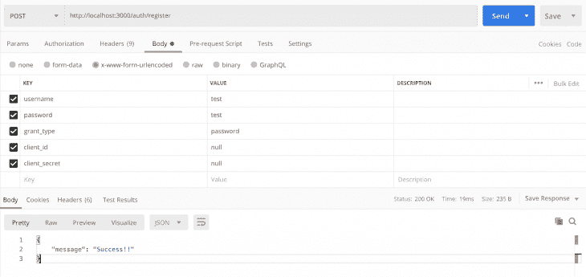
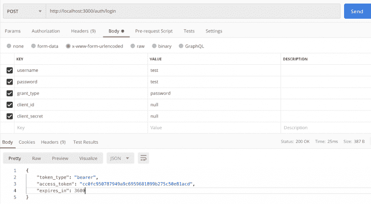
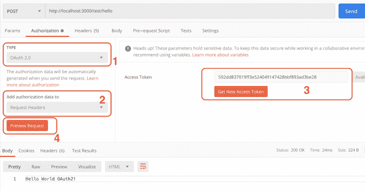

# 如何在 Node.js - LogRocket 博客中实现 OAuth 2.0

> 原文：<https://blog.logrocket.com/implement-oauth-2-0-node-js/>

***编者按**:本文最后更新于 2022 年 4 月 6 日，以反映 Express 和 Node.js 的最新版本*

大家都在谈论 [OAuth 2.0](https://oauth.net/2/) 。不管你工作的公司规模有多大，或者你在后台运行的服务和 API 有多少，如果你还没有使用 OAuth 2.0，那么你很有可能需要它。

考虑到大量的信息、工具和可用的框架，很难理解并轻松地将协议应用到您的项目中。对于 JavaScript，更具体地说，Node.js，它还取决于一些因素，比如您选择的服务器以及它是否已经提供了 OAuth 2.0 支持。考虑项目、文档和社区的成熟度也很重要。

我们可以使用 [node-oauth2-server](https://github.com/oauthjs/node-oauth2-server) 来简化这个问题，这是一个框架无关的模块，用于在 Node.js 中实现 oauth2 服务器。node-oauth2-server 是开源的，简单，易于与您的节点应用程序集成，即使它们已经运行了一段时间。

虽然 repo 已经有一段时间没有更新了，但在撰写本文时，它仍然完全兼容最新的 Node.js 标准。

在本文中，我们将通过开发我们自己的覆盖实现并通过一个真实的 API 测试来探索 OAuth 2 框架。我们还将它与 Postgres 数据库集成，以查看项目的运行情况，阻止和允许对特定端点的访问。

为了简单起见，我们的例子将探索 OAuth 2 的[密码授权类型](https://oauth.net/2/grant-types/password/)。基于这个示例，您可以调整实现以适应其他类型。你可以查看[中这个例子](https://github.com/atharvadeosthale/logrocket-oauth2-article)的完整源代码。我们开始吧！

## 关于 OAuth 2.0

在其文档中，您可以找到官方的[模型规范](https://oauth2-server.readthedocs.io/en/latest/model/spec.html)，它描述了您的 JavaScript 代码必须如何覆盖默认的 OAuth 2 函数来提供您定制的身份验证体验:

```
const model = {
  // We support returning promises.
  getAccessToken: function() {
    return new Promise('works!');
  },

  // Or, calling a Node-style callback.
  getAuthorizationCode: function(done) {
    done(null, 'works!');
  },

  // Or, using generators.
  getClient: function*() {
    yield somethingAsync();
    return 'works!';
  },

  // Or, async/wait (using Babel).
  getUser: async function() {
    await somethingAsync();
    return 'works!';
  }
};

const OAuth2Server = require('oauth2-server');
let oauth = new OAuth2Server({model: model});

```

有了 OAuth2Server 对象，就可以覆盖 Express 服务器的缺省 OAuth 2 提供者，从而提供自己的身份验证体验。关于框架如何在幕后工作的更多信息，请参考[官方文档](https://oauth2-server.readthedocs.io/en/latest/docs/getting-started.html)。

## 设置我们的项目

首先，让我们安装项目所需的所有工具和依赖项。确保你已经在各自的操作系统上安装了[Postgres](https://www.postgresql.org/)。成功安装 Postgres 后，使用以下命令创建一个名为`logrocket_oauth2`的新数据库:

```
CREATE DATABASE logrocket_oauth2;

```

要创建我们的用户和访问令牌表，请运行以下 SQL 命令:

```
CREATE TABLE public.users
(
    id serial,
    username text,
    user_password text,
    PRIMARY KEY (id)
)
WITH (
    OIDS = FALSE
);

ALTER TABLE public.users
    OWNER to postgres;

CREATE TABLE public.access_tokens
(
    id serial,
    access_token text,
    user_id integer,
    PRIMARY KEY (id)
)
WITH (
    OIDS = FALSE
);

ALTER TABLE public.access_tokens
    OWNER to postgres;

```

确保用自己的 Postgres 用户名替换`postgres`。我们已经简化了大部分表格，所以在本文中，我们不会讨论与创建和更新日期时间相关的列。

接下来，在您选择的目录中创建一个名为`logrocket-oauth2-example`的新文件夹，并运行`npm init -y`命令用您的`package.json`文件初始化它。然后，运行以下命令安装所需的依赖项:

```
npm install express pg node-oauth2-server

```

我们使用 Express 创建 REST APIs，pg，node-postgres 的缩写，将我们的 Node.js 服务器连接到 PostgreSQL，最后，`node-oauth2-server`提供帮助我们制作 OAuth 2 服务器的相关实用程序。

如果您愿意，也可以使用 Yarn 运行这些命令，代码如下:

```
yarn add express pg node-oauth2-server

```

最后，确保复制以下文件夹结构:



## 数据库层

现在，让我们继续进行数据库设置。在您成功地创建了数据库和表之后，我们将需要一个 Postgres 包装器来封装我们将在`db`文件夹中进行的查询。在`db`文件夹中，将以下代码添加到`pgWrapper.js`文件中:

```
const Pool = require("pg").Pool;
function query(queryString, cbFunc) {
  const pool = new Pool({
    user: "postgres",
    host: "localhost",
    database: "logrocket_oauth2",
    password: "postgres",
    port: 5432,
  });
  pool.query(queryString, (error, results) => {
    cbFunc(setResponse(error, results));
  });
}
function setResponse(error, results) {
  return {
    error: error,
    results: results ? results : null,
  };
}
module.exports = {
  query,
};

```

这段代码最重要的部分是`query()`函数。我们将把 Postgres 连接池对象集中在这个文件中并导出函数，而不是到处扔。

这很简单。`query()`函数由一个新的 pg `Pool`实例和一个回调函数组成，反过来，回调函数将总是接收一个由`error`和`results`属性组成的 JSON 对象。为了简单起见，让我们将`results`作为一个数组。

> 注意:确保将数据库属性更改为您自己的属性。

接下来，我们需要两个存储库来处理用户和令牌的数据库操作。第一个是`userDB.js`文件:

```
let pgPool;

module.exports = (injectedPgPool) => {
    pgPool = injectedPgPool;

    return {
        register,
        getUser,
        isValidUser,
    };
};

var crypto = require("crypto");

function register(username, password, cbFunc) {
    var shaPass = crypto.createHash("sha256").update(password).digest("hex");

    const query = `INSERT INTO users (username, user_password) VALUES ('${username}', '${shaPass}')`;

    pgPool.query(query, cbFunc);
}

function getUser(username, password, cbFunc) {
    var shaPass = crypto.createHash("sha256").update(password).digest("hex");

    const getUserQuery = `SELECT * FROM users WHERE username = '${username}' AND user_password = '${shaPass}'`;

    pgPool.query(getUserQuery, (response) => {
        cbFunc(
            false,
            response.results && response.results.rowCount === 1
                ? response.results.rows[0]
                : null
        );
    });
}

function isValidUser(username, cbFunc) {
    const query = `SELECT * FROM users WHERE username = '${username}'`;

    const checkUsrcbFunc = (response) => {
        const isValidUser = response.results
            ? !(response.results.rowCount > 0)
            : null;

        cbFunc(response.error, isValidUser);
    };

    pgPool.query(query, checkUsrcbFunc);
}

```

我们的数据库模型将恢复三个操作，用户的注册、搜索和验证。

注意，我们在之前创建的文件的开头注入了`pgPool`。为了让这段代码工作，我们仍然需要将参数传递给`index.js`文件中的构造函数。

每个函数处理我们之前创建的`query`函数。[NPM pg 包](https://www.npmjs.com/package/pg)接收查询本身作为第一个参数。`error-results`组合是第二个参数，它包含我们执行的结果。

我们通过`${}`操作符注入参数来简化连接。然而，您也可以通过在`query`函数的第二个可选参数中将值作为数组传递来使用[参数化查询](https://node-postgres.com/features/queries)。

最后，pg 包返回`results`对象中的值，但是没有任何`length`属性，这与 MySQL 等其他数据库不同。

为了查看是否有结果，我们需要访问`rowCount`属性。请注意，我们传递了许多回调函数，以避免函数返回下的控制，使整个架构异步。请随意根据自己的风格进行调整。

现在，让我们转到`tokenDB.js`实现:

```
let pgPool;

module.exports = (injectedPgPool) => {
    pgPool = injectedPgPool;

    return {
        saveAccessToken,
        getUserIDFromBearerToken,
    };
};

function saveAccessToken(accessToken, userID, cbFunc) {
    const getUserQuery = `INSERT INTO access_tokens (access_token, user_id) VALUES ('${accessToken}', ${userID});`;

    pgPool.query(getUserQuery, (response) => {
        cbFunc(response.error);
    });
}

function getUserIDFromBearerToken(bearerToken, cbFunc) {
    const getUserIDQuery = `SELECT * FROM access_tokens WHERE access_token = '${bearerToken}';`;

    pgPool.query(getUserIDQuery, (response) => {
        const userID =
            response.results && response.results.rowCount == 1
                ? response.results.rows[0].user_id
                : null;

        cbFunc(userID);
    });
}

```

就像我们之前的 JavaScript 文件一样，我们在构造函数中注入 pg `Pool`并调用相应的查询。

特别注意`getUserIDFromBearerToken`功能。注意默认的`node-oauth2-server`模型契约，我们需要提供一个函数来评估给定的承载令牌是否真的有效，这意味着令牌确实存在于数据库中。

感谢前面来自`userDB.js`的`isValidUser`，它在插入新用户时检查用户名是否重复，我们的令牌将工作。

## OAuth 2.0 服务和路由

既然数据库层已经准备好被调用，让我们实现我们需要的服务和路由，从`tokenService.js`文件开始:

```
let userDB;
let tokenDB;

module.exports = (injectedUserDB, injectedTokenDB) => {
    userDB = injectedUserDB;
    tokenDB = injectedTokenDB;

    return {
        getClient,
        saveAccessToken,
        getUser,
        grantTypeAllowed,
        getAccessToken,
    };
};

function getClient(clientID, clientSecret, cbFunc) {
    const client = {
        clientID,
        clientSecret,
        grants: null,
        redirectUris: null,
    };

    cbFunc(false, client);
}

function grantTypeAllowed(clientID, grantType, cbFunc) {
    cbFunc(false, true);
}

function getUser(username, password, cbFunc) {
    userDB.getUser(username, password, cbFunc);
}

function saveAccessToken(accessToken, clientID, expires, user, cbFunc) {
    tokenDB.saveAccessToken(accessToken, user.id, cbFunc);
}

function getAccessToken(bearerToken, cbFunc) {
    tokenDB.getUserIDFromBearerToken(bearerToken, (userID) => {
        const accessToken = {
            user: {
                id: userID,
            },
            expires: null,
        };

        cbFunc(userID === null, userID === null ? null : accessToken);
    });
}

```

这听起来比实际情况要复杂一些。所有这些功能都是我们前面看到的模型规范契约的简单覆盖版本。

对于它的每个默认动作，我们需要提供自己的实现，调用我们的数据库存储库来保存新用户，以及新的访问令牌来检索它们或获取客户端应用程序。

对于`grantTypeAllowed`函数，我们实际上只是调用回调函数作为第三个参数，由`node-oauth2-server`框架传递。

* * *

### 更多来自 LogRocket 的精彩文章:

* * *

我们验证给定的客户端 ID 是否具有对该授权类型的实际访问权限，仅设置为密码。您可以添加任意数量的验证。我们还可以将它与您或您的公司可能拥有的其他私有验证 API 集成。

现在，让我们回顾一下`authenticator.js`文件代码:

```
let userDB;

module.exports = (injectedUserDB) => {
    userDB = injectedUserDB;

    return {
        registerUser,
        login,
    };
};

function registerUser(req, res) {
    userDB.isValidUser(req.body.username, (error, isValidUser) => {
        if (error || !isValidUser) {
            const message = error
                ? "Something went wrong!"
                : "This user already exists!";

            sendResponse(res, message, error);

            return;
        }

        userDB.register(req.body.username, req.body.password, (response) => {
            sendResponse(
                res,
                response.error === undefined ? "Success!!" : "Something went wrong!",
                response.error
            );
        });
    });
}

function login(query, res) {}

function sendResponse(res, message, error) {
    res.status(error !== undefined ? 400 : 200).json({
        message: message,
        error: error,
    });
}

```

在上面的代码中，我们有两个主要的身份验证方法，一个用于用户注册，另一个用于用户登录。每当试图注册一个用户时，我们首先需要确保它是有效的，这意味着它不是重复的，然后注册它。

我们已经看到了验证和保存功能。现在，这只是一个电话。反过来，`login`函数不需要任何实现，因为它将调用框架默认流。最后，检查每个请求是错误还是成功，这样我们就可以设置正确的 HTTP 响应代码。

最后，我们需要在`routes.js`文件中设置我们的快速路线:

```
module.exports = (router, app, authenticator) => {
    router.post("/register", authenticator.registerUser);
    router.post("/login", app.oauth.grant(), authenticator.login);

    return router;
};

```

很简单，不是吗？唯一的区别是我们调用 Express `oauth`函数`grant()`来确保这个用户正确登录。为了确保实现完全工作，我们还需要一个安全的测试端点。它将像任何其他端点一样被创建，但受到保护，这意味着只有授权用户才能通过发送有效的承载令牌来访问它。

将以下代码添加到我们的`testAPIService.js`中:

```
module.exports = {
    helloWorld: helloWorld,
};

function helloWorld(req, res) {
    res.send("Hello World OAuth2!");
}

```

现在，将下面的代码添加到`testAPIRoutes.js`:

```
module.exports = (router, app, testAPIService) => {
    router.post("/hello", app.oauth.authorise(), testAPIService.helloWorld);

    return router;
};

```

最后但同样重要的是，我们需要设置`index.js`映射:

```
// Database imports
const pgPool = require("./db/pgWrapper");
const tokenDB = require("./db/tokenDB")(pgPool);
const userDB = require("./db/userDB")(pgPool);
// OAuth imports
const oAuthService = require("./auth/tokenService")(userDB, tokenDB);
const oAuth2Server = require("node-oauth2-server");
// Express
const express = require("express");
const app = express();
app.oauth = oAuth2Server({
    model: oAuthService,
    grants: ["password"],
    debug: true,
});
const testAPIService = require("./test/testAPIService.js");
const testAPIRoutes = require("./test/testAPIRoutes.js")(
    express.Router(),
    app,
    testAPIService
);
// Auth and routes
const authenticator = require("./auth/authenticator")(userDB);
const routes = require("./auth/routes")(
    express.Router(),
    app,
    authenticator
);
app.use(express.json())
app.use(express.urlencoded({ extended: true }));
app.use(app.oauth.errorHandler());
app.use("/auth", routes);
app.use("/test", testAPIRoutes);
const port = 3000;
app.listen(port, () => {
    console.log(`listening on port ${port}`);
});

```

我们基本上是导入所有需要的模块，以及将相应的模块相互注入。

请特别注意快速设置。注意，我们用自己的实现覆盖了 Express 的默认`oauth`对象，并定义了授权类型和模型服务。

然后，我们必须将验证器和测试的路由分配给 Express 路由器，以便 Express 了解如何重定向每个接近的请求。

现在，让我们测试我们的端点。我们将使用 [Postman 工具](https://www.postman.com/),因为它简单实用，不过，你可以随意选择使用。然后，通过运行以下代码启动服务器:

```
node index.js

```

首先，我们需要创建一个新用户。为此，使用编码为`x-www-form-urlencoded`的以下主体参数对`[http://localhost:3000/auth/register/](http://localhost:3000/auth/register/)`执行`POST`请求:



### 通过邮递员创建新用户

继续检查是否在您的数据库中成功创建了用户。

有了一个有效的用户，您现在可以通过向`[http://localhost:3000/auth/login/](http://localhost:3000/auth/login/)`发送另一个`POST`请求来登录，请求的主体参数如下:



### 通过邮递员登录创建的用户

如果您将凭证更改为无效凭证，您将得到一条消息，显示为`OAuth2Error: User credentials are invalid`。

现在，随着 OAuth 2 的实现和运行，我们可以运行我们最重要的测试，验证我们的安全端点。Postman 为我们提供了特殊的功能来测试这一点，即授权选项卡:



### 邮递员授权标签

通过选择 **Authorization** 选项卡，您可以访问一些有趣的测试特性，比如您的 API 正在使用的授权流类型，在我们的例子中是`OAuth 2.0`。

您还可以选择 Postman 应该将授权数据放在哪里。例如，选择**头**选项将授权数据放入请求头或请求体。

此外，您有两种选择来获取访问令牌。您可以显式地将令牌文本拖放到可用的`textarea`中，或者单击 **Get NewAccess Token** 按钮，这将依次打开一个包含更多字段的对话框。这些字段将要求访问令牌 URL 端点获取新的令牌、TTL、授权类型等。

在这里，您可以预览请求。单击该按钮后，输入的值将自动转换为当前请求的标题和正文配置。这样，您不必在每次需要运行新请求时手动更改每个头。

点击**发送按钮**，结果会出现`Hello World OAuth2`。

## 结论

这个框架只是现有的选择之一。你可以去 OAuth.net 项目查看 Node.js 的最新建议以及你喜欢的语言。当然，有很多可看的。

OAuth 2.0 是一个庞大的协议，在阅读和应用它的规范时，应该花更多的时间和精力。然而，这个简单的介绍会让你理解这个框架是如何与 Express 和 Postgres 一起工作的。

您还可以更改服务器和数据库来满足您的需求。只要确保使用我们到目前为止建立的同一个合同。我希望你喜欢这篇文章。编码快乐！

## 200 只显示器出现故障，生产中网络请求缓慢

部署基于节点的 web 应用程序或网站是容易的部分。确保您的节点实例继续为您的应用程序提供资源是事情变得更加困难的地方。如果您对确保对后端或第三方服务的请求成功感兴趣，

[try LogRocket](https://lp.logrocket.com/blg/node-signup)

.

[](https://lp.logrocket.com/blg/node-signup)[https://logrocket.com/signup/](https://lp.logrocket.com/blg/node-signup)

LogRocket 就像是网络和移动应用程序的 DVR，记录下用户与你的应用程序交互时发生的一切。您可以汇总并报告有问题的网络请求，以快速了解根本原因，而不是猜测问题发生的原因。

LogRocket 检测您的应用程序以记录基线性能计时，如页面加载时间、到达第一个字节的时间、慢速网络请求，还记录 Redux、NgRx 和 Vuex 操作/状态。

[Start monitoring for free](https://lp.logrocket.com/blg/node-signup)

.