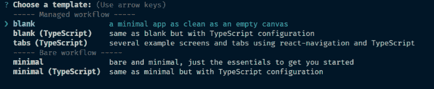

# React Native carousel 与 react-Native-snap-carousel-log rocket 博客

> 原文：<https://blog.logrocket.com/implement-react-native-snap-carousel/>

***编者按**:本文最后更新于 2022 年 4 月 27 日，以反映 react-native-snap-carousel 的最新版本 4.0.0-beta.6+。*

利用 UI 上水平空间的最佳方式之一是使用旋转木马。旋转木马允许用户垂直或水平地循环浏览一系列内容，如视频或照片，而不必滚动到页面底部。特别是在移动应用程序中，传送带对于最大化可用空间非常有用。

在本教程中，我们将使用 Tinder 风格的滑动动画在 React 原生移动应用程序中创建一个旋转木马。我们将使用[react-native-snap-carousel](https://github.com/meliorence/react-native-snap-carousel)包，它使得实现复杂的传送带变得容易。要跟随本教程，您需要以下内容:

*   JavaScript ES6 知识
*   熟悉 React ≥v16.x
*   反应本土知识
*   代码编辑器
*   终端的基本知识
*   npm 和/或纱线
*   Node.js ≥v10.x

您也可以[查看源代码](https://github.com/philipszdavido/react-native-carousel-tut)来跟进。我们开始吧！

## React Native 和 Expo 入门

首先，我们将用 Expo 来[引导我们的应用程序。如果您尚未安装 Expo CLI，请打开您的终端并键入以下代码进行安装:](https://blog.logrocket.com/getting-started-with-react-native-and-expo-sdk/)

```
npm install expo-cli --global

```

安装 Expo 后，我们可以用它来初始化 React Native。导航到要添加项目的目录，并键入以下命令:

```
expo init ReactNativeCarouselTutorial

```

在管理工作流部分，选择一个空白模板:



模板安装完所有必需的依赖项后，在终端中导航到项目目录，并使用以下代码启动项目:

```
expo start

```

上面的命令在您的浏览器中启动 [Metro Bundler](https://docs.expo.dev/guides/customizing-metro/) ，让您选择在您选择的仿真器上运行应用程序。您应该会看到一个类似于下图的屏幕截图:


## 使用 react-native-snap-carousel 创建转盘

要创建 carousel，请打开您的终端，导航到项目目录，并运行以下命令:

```
npm install --save [email protected]

```

上面的命令安装了[react-native-snap-carousel](https://github.com/archriss/react-native-snap-carousel)，这是我们将用来创建 carousel 的包。安装后，在根目录下创建一个`data.js`文件，并粘贴下面的代码:

```
const data = [
  {
    title: "Aenean leo",
    body: "Ut tincidunt tincidunt erat. Sed cursus turpis vitae tortor. Quisque malesuada placerat nisl. Donec quam felis, ultricies nec, pellentesque eu, pretium quis, sem.",
    imgUrl: "https://picsum.photos/id/11/200/300",
  },
  {
    title: "In turpis",
    body: "Aenean ut eros et nisl sagittis vestibulum. Donec posuere vulputate arcu. Proin faucibus arcu quis ante. Curabitur at lacus ac velit ornare lobortis. ",
    imgUrl: "https://picsum.photos/id/10/200/300",
  },
  {
    title: "Lorem Ipsum",
    body: "Phasellus ullamcorper ipsum rutrum nunc. Nullam quis ante. Etiam ultricies nisi vel augue. Aenean tellus metus, bibendum sed, posuere ac, mattis non, nunc.",
    imgUrl: "https://picsum.photos/id/12/200/300",
  },
];

export default data;

```

数据文件是一个包含模拟数据的数组，我们将用它来填充我们的 carousel。接下来，创建一个名为`CarouselCardItem.js`的文件，打开它，并插入以下代码:

```
import React from 'react'
import { View, Text, StyleSheet, Dimensions, Image } from "react-native"

export const SLIDER_WIDTH = Dimensions.get('window').width + 80
export const ITEM_WIDTH = Math.round(SLIDER_WIDTH * 0.7)

const CarouselCardItem = ({ item, index }) => {
  return (
    <View style={styles.container} key={index}>
      <Image
        source={{ uri: item.imgUrl }}
        style={styles.image}
      />
      <Text style={styles.header}>{item.title}</Text>
      <Text style={styles.body}>{item.body}</Text>
    </View>
  )
}

const styles = StyleSheet.create({
  container: {
    backgroundColor: 'white',
    borderRadius: 8,
    width: ITEM_WIDTH,
    paddingBottom: 40,
    shadowColor: "#000",
    shadowOffset: {
      width: 0,
      height: 3,
    },
    shadowOpacity: 0.29,
    shadowRadius: 4.65,
    elevation: 7,
  },
  image: {
    width: ITEM_WIDTH,
    height: 300,
  },
  header: {
    color: "#222",
    fontSize: 28,
    fontWeight: "bold",
    paddingLeft: 20,
    paddingTop: 20
  },
  body: {
    color: "#222",
    fontSize: 18,
    paddingLeft: 20,
    paddingLeft: 20,
    paddingRight: 20
  }
})

export default CarouselCardItem

```

`CarouselCardItem`实现了转盘中卡片的外观。它返回一个组件，该组件将显示作为道具传递的项目。现在，让我们创建一个负责显示 carousel 的组件。创建一个名为`CarouselCards.js`的文件，打开它，输入以下代码:

```
import React from 'react'
import { View } from "react-native"
import Carousel from 'react-native-snap-carousel'
import CarouselCardItem, { SLIDER_WIDTH, ITEM_WIDTH } from './CarouselCardItem'
import data from './data'

const CarouselCards = () => {
  const isCarousel = React.useRef(null)

  return (
    <View>
      <Carousel
        layout="tinder"
        layoutCardOffset={9}
        ref={isCarousel}
        data={data}
        renderItem={CarouselCardItem}
        sliderWidth={SLIDER_WIDTH}
        itemWidth={ITEM_WIDTH}
        inactiveSlideShift={0}
        useScrollView={true}
      />
    </View>
  )
}

export default CarouselCards

```

我们使用 react-native-snap-carousel 包中的`Carousel`组件来实现 carousel。组件接受的属性包括:

*   `layout`:定义项目的渲染方式。选项包括默认、堆栈和 Tinder
*   `layoutCardOffset`:用于增加或减少 stack 和 Tinder 布局中的默认卡片偏移量
*   `ref`:创建对转盘实例的引用
*   `data`:要循环的项目数组
*   `renderItem`:从数据中取出一个项目，并将其渲染到列表中
*   `sliderWidth`:以像素为单位的转盘宽度
*   `itemWidth`:以像素为单位的转盘项目宽度
*   `useScrollView`:出于性能原因，使用了一个 [ScrollView 组件，而不是一个平面列表组件](https://blog.logrocket.com/common-bugs-react-native-scrollview/)
*   `onSnapToItem`:以编程方式捕捉到一个圆盘传送带项目

我们可以添加分页，这样用户就可以跳到转盘中的某个项目，而不必连续滑动。首先，我们必须导入组件。为此，转到我们导入 carousel 组件的那一行:

```
import Carousel from 'react-native-snap-carousel'

```

将其重构为如下所示的代码:

```
import Carousel, { Pagination } from 'react-native-snap-carousel'

```

接下来，创建一个状态来存储当前的分页索引:

```
const [index, setIndex] = React.useState(0)

```

之后，将以下代码粘贴到 carousel 组件下:

```
<Pagination
  dotsLength={data.length}
  activeDotIndex={index}
  carouselRef={isCarousel}
  dotStyle={{
    width: 10,
    height: 10,
    borderRadius: 5,
    marginHorizontal: 0,
    backgroundColor: 'rgba(0, 0, 0, 0.92)'
  }}
  inactiveDotOpacity={0.4}
  inactiveDotScale={0.6}
  tappableDots={true}
/>

```

上面的代码呈现了分页组件，默认情况下，它是一个点列表。分页组件接受以下属性:

*   `dotsLength`:要显示的点数
*   `activeDotIndex`:当前活动点的索引
*   `carouselRef`:对分页链接到的`Carousel`组件的引用
*   `dotStyle`:与默认合并的点样式
*   `inactiveDotOpacity`:应用于非活动点的不透明度值
*   `inactiveDotScale`:应用于无效点的`scale`变换值
*   `tappableDots`:使默认点可点击。当点击一个点时，转盘将滑动到相应的项目

将此`onSnapToItem={(index) *=>** setIndex(index)}`添加到`Carousel`组件中。当导航到一个项目时触发此回调:

```
<Carousel
  layout="tinder"
  layoutCardOffset={9}
  ref={isCarousel}
  data={data}
  renderItem={CarouselCardItem}
  sliderWidth={SLIDER_WIDTH}
  itemWidth={ITEM_WIDTH}
  onSnapToItem={(index) => setIndex(index)}
  useScrollView={true}
/>

```

修改后的`CarouselCards`组件应该类似于下面的代码:

```
import React from 'react'
import { View } from "react-native"
import Carousel, { Pagination } from 'react-native-snap-carousel'
import CarouselCardItem, { SLIDER_WIDTH, ITEM_WIDTH } from './CarouselCardItem'
import data from './data'

const CarouselCards = () => {
  const [index, setIndex] = React.useState(0)
  const isCarousel = React.useRef(null)

  return (
    <View>
      <Carousel
        layout="tinder"
        layoutCardOffset={9}
        ref={isCarousel}
        data={data}
        renderItem={CarouselCardItem}
        sliderWidth={SLIDER_WIDTH}
        itemWidth={ITEM_WIDTH}
        onSnapToItem={(index) => setIndex(index)}
        useScrollView={true}
      />
      <Pagination
        dotsLength={data.length}
        activeDotIndex={index}
        carouselRef={isCarousel}
        dotStyle={{
          width: 10,
          height: 10,
          borderRadius: 5,
          marginHorizontal: 0,
          backgroundColor: 'rgba(0, 0, 0, 0.92)'
        }}
        inactiveDotOpacity={0.4}
        inactiveDotScale={0.6}
        tappableDots={true}
      />
    </View>
  )
}

export default CarouselCards

```

转到您的`App.js`文件并重构代码，如下所示:

```
import React from 'react'
import { SafeAreaView, StyleSheet } from 'react-native'
import CarouselCards from './CarouselCards'

export default function App() {
  return (
    <SafeAreaView style={styles.container}>
      <CarouselCards />
    </SafeAreaView>
  );
}

const styles = StyleSheet.create({
  container: {
    backgroundColor: '#fff',
    alignItems: 'center',
    justifyContent: 'center',
    padding: 50
  },
});

```

保存后，您应该会看到一个类似于下图的屏幕截图:


恭喜你！你完成了你的旋转木马。

## 结论

在本教程中，我们学习了如何使用 react-native-snap-carousel 在 React Native 中实现轮播，它提供了许多创建轮播的选项。我们还添加了分页组件，让用户可以快速移动到某个页面，而不必连续滑动。你也可以[看看本教程的小吃展柜](https://snack.expo.dev/@git/github.com/sa-ma/react-native-carousel-tutorial)。

## [LogRocket](https://lp.logrocket.com/blg/react-native-signup) :即时重现 React 原生应用中的问题。

[](https://lp.logrocket.com/blg/react-native-signup)

[LogRocket](https://lp.logrocket.com/blg/react-native-signup) 是一款 React 原生监控解决方案，可帮助您即时重现问题、确定 bug 的优先级并了解 React 原生应用的性能。

LogRocket 还可以向你展示用户是如何与你的应用程序互动的，从而帮助你提高转化率和产品使用率。LogRocket 的产品分析功能揭示了用户不完成特定流程或不采用新功能的原因。

开始主动监控您的 React 原生应用— [免费试用 LogRocket】。](https://lp.logrocket.com/blg/react-native-signup)