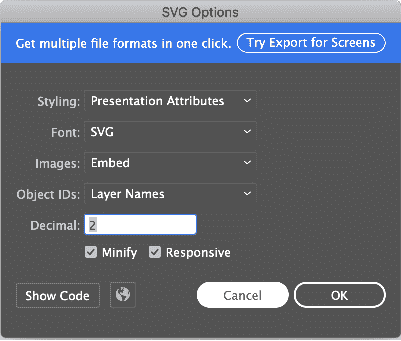

# 用 flutter_svg 在 Flutter 中实现 SVG

> 原文：<https://blog.logrocket.com/implement-svg-flutter-apps/>

[可缩放矢量图形(SVG)](https://developer.mozilla.org/en-US/docs/Web/SVG) 是应用中最广泛使用的文件图像格式之一。因为它比位图文件有几个优点，特别是在缩放时保持图像质量，如果不首先考虑使用 SVG，很难开始构建一个 [Flutter 应用程序](https://blog.logrocket.com/tag/flutter/)。

在本文中，您将了解如何以及何时在 Flutter 应用程序中使用 SVG 文件。

## SVG 在颤振中的应用

[Skia](https://skia.org/) 是 2D 图形库，也是 Flutter 的核心组件，只能将图像序列化为 SVG 文件。因此，用 Skia 对 SVG 图像进行[解码或渲染是不可能的。幸运的是，社区提供了一个奇妙的](https://github.com/flutter/flutter/issues/1831?spm=a2c65.11461447.0.0.2c7e5eaceB070w) [Dart 原生包，名为 flutter_svg](https://pub.dev/packages/flutter_svg) ，可以快速渲染和解码 svg。

## 什么是 flutter_svg？

flutter_svg 包实现了一个图片缓存，存储了一个`ui:Picture`类。这是 Skia 图形引擎的`SkPicture`包装器，它以二进制模式记录特定的 SVG 渲染命令。

`ui.Picture`类不消耗太多内存，并且被缓存以避免重复解析 XML 文件。我们来看看`SvgPicture.asset`构造函数:

```
SvgPicture.asset(
  String assetName, {
  Key? key,
  this.matchTextDirection = false,
  AssetBundle? bundle,
  String? package,
  this.width,
  this.height,
  this.fit = BoxFit.contain,
  this.alignment = Alignment.center,
  this.allowDrawingOutsideViewBox = false,
  this.placeholderBuilder,
  Color? color,
  BlendMode colorBlendMode = BlendMode.srcIn,
  this.semanticsLabel,
  this.excludeFromSemantics = false,
  this.clipBehavior = Clip.hardEdge,
  this.cacheColorFilter = false,
})  : pictureProvider = ExactAssetPicture(
        allowDrawingOutsideViewBox == true
            ? svgStringDecoderOutsideViewBox
            : svgStringDecoder,
        assetName,
        bundle: bundle,
        package: package,
        colorFilter: svg.cacheColorFilterOverride ?? cacheColorFilter
            ? _getColorFilter(color, colorBlendMode)
            : null,
      ),
      colorFilter = _getColorFilter(color, colorBlendMode),
      super(key: key);

```

通过查看实现，您会注意到来自`pictureProvider`的流通知更新了`SvgPicture`的图片。

```
 void _resolveImage() {
final PictureStream newStream = widget.pictureProvider
.resolve(createLocalPictureConfiguration(context));
assert(newStream != null); // ignore: unnecessary_null_comparison
_updateSourceStream(newStream);
}

```

在这个代码块中，来自`pictureProvider`的流由图片缓存的完成器用`ui.Picture`填充。

```
PictureStream resolve(PictureConfiguration picture,
    {PictureErrorListener? onError}) {
  // ignore: unnecessary_null_comparison
  assert(picture != null);
  final PictureStream stream = PictureStream();
  T? obtainedKey;
  obtainKey(picture).then<void>(
    (T key) {
      obtainedKey = key;
      stream.setCompleter(
        cache.putIfAbsent(
          key!,
          () => load(key, onError: onError),
        ),
      );
    },
  ).catchError((Object exception, StackTrace stack) async {
    if (onError != null) {
      onError(exception, stack);
      return;
    }
    FlutterError.reportError(FlutterErrorDetails(
        exception: exception,
        stack: stack,
        library: 'SVG',
        context: ErrorDescription('while resolving a picture'),
        silent: true, // could be a network error or whatnot
        informationCollector: () sync* {
          yield DiagnosticsProperty<PictureProvider>(
              'Picture provider', this);
          yield DiagnosticsProperty<T>('Picture key', obtainedKey,
              defaultValue: null);
        }));
  });
  return stream;
}

```

## 添加 flutter_svg 插件

要将这个包添加到您的 Flutter 依赖项中，您可以运行:

```
flutter pub add flutter_svg

```

或者，您可以将 flutter_svg 添加到您的`pubspec.yaml`文件中:

```
dependencies:
  flutter_svg: ^0.22.0

```

确保在终端或使用编辑器运行`flutter pub get`。安装完成后，在您想要使用该软件包的 Dart 代码中导入该软件包:

```
import 'package:flutter_svg/flutter_svg.dart';

```

## 在你的 flutter 应用中使用 flutter_svg

有几种方法可以使用这个包，但是我们将讨论最常见的用例。

一种选择是从内部 SVG 文件加载 SVG，该文件通常存储在`asset`文件夹中:

```
// example
final String assetName = 'assets/image.svg';
final Widget svg = SvgPicture.asset(
assetName,
);
```

您也可以从 URL 加载 SVG 文件，如下所示:

```
// example
final Widget networkSvg = SvgPicture.network(
  'https://site-that-takes-a-while.com/image.svg',
);
```

最后，您可以从 SVG 代码加载 SVG:

```
// example
SvgPicture.string(
  '''<svg viewBox="...">...</svg>'''
);
```

## 在 Flutter 中扩展 SVG 功能

载入 SVG 文件后，第一步是更改图像的颜色或色调:

```
// example
final String assetName = 'assets/up_arrow.svg';
final Widget svgIcon = SvgPicture.asset(
  assetName,
  color: Colors.red,
);

```

使用语义标签有助于描述图像的目的并增强可访问性。要实现这一点，您可以添加`semanticsLabel`参数。语义标签不会显示在 UI 中。

```
// example
final String assetName = 'assets/up_arrow.svg';
final Widget svgIcon = SvgPicture.asset(
  assetName,
  color: Colors.red,
  semanticsLabel: 'A red up arrow'
);

```

如果在`SvgPicture`上没有`height`或`width`赋值，那么 flutter_svg 包将呈现一个空框`LimitedBox`，作为默认占位符。但是，如果在`SvgPicture`上指定了`height`或`width`，则会渲染一个`SizedBox`以确保更好的布局体验。

不过，占位符可以被替换，这对于改善用户体验很有好处，特别是当通过网络请求加载资产时，可能会有延迟。

```
// example
final Widget networkSvg = SvgPicture.network(
  'https://site-that-takes-a-while.com/image.svg',
  semanticsLabel: 'A shark?!',
  placeholderBuilder: (BuildContext context) => Container(
      padding: const EdgeInsets.all(30.0),
      child: const CircularProgressIndicator()),
);

```

在这个例子中，我选择了`CircularProgressIndicator`在图像加载时显示进度指示器。你可以添加任何你想要的其他部件。例如，您可以使用一个定制的加载小部件来替换`CircularProgressIndicator`。

## 检查 SVG 与 flutter_svg 的兼容性

要知道 flutter_svg 库并不支持所有的 svg 特性。然而，这个包确实提供了一个助手方法来确保你不会因为缺少支持的特性而渲染一个损坏的图像。

```
// example 
final SvgParser parser = SvgParser();
try {
  parser.parse(svgString, warningsAsErrors: true);
  print('SVG is supported');
} catch (e) {
  print('SVG contains unsupported features');
}

```

请注意，该库目前只检测不支持的元素，如`<style>`标签，但不识别不支持的属性。

## 推荐的 Adobe Illustrator SVG 配置

要在 Adobe Illustrator 中充分利用 flutter_svg，您需要遵循以下具体建议:

1.  1.  *   样式:选择表示属性而不是内联 CSS，因为 CSS 不被完全支持
        *   图像:选择嵌入而不是链接到另一个文件，以获得不依赖于其他文件的单个 SVG
        *   对象 id:选择图层名称以便为 SVG 标签的每个图层添加一个名称，或者使用最少的图层名称——这是您的选择！

## 

## 在另一个画布中渲染 SVG 文件

有时，您可能希望将 SVG 渲染到另一个画布中。`SVGPicture`帮助您轻松实现这一目标:

```
// example
final String rawSvg = '''<svg viewBox="...">...</svg>''';
final DrawableRoot svgRoot = await svg.fromSvgString(rawSvg, rawSvg);
final Picture picture = svgRoot.toPicture();
svgRoot.scaleCanvasToViewBox(canvas);
svgRoot.clipCanvasToViewBox(canvas);
svgRoot.draw(canvas, size);

```

## 结论

使用 SVG 文件可以极大地增加你的 Flutter 应用程序，但是 SVG 并不总是解决所有图像问题的正确答案。观察您的用例并持续测量您的应用程序和 SVG 性能至关重要，因为您可能需要用另一种标准图像格式来替换 SVG，如 PNG 或 JPEG。

虽然 Flutter 本身并不支持 svg，但 Dart 原生的 flutter_svg 包对 SVG 文件有着出色的性能和快速的支持。该软件包使用起来也相对简单。

请记住，包版本仍然低于 1.0.0，这可能会破坏 API 中的更改。然而，作者已经尽可能地保持了 API 的稳定性。当使用 flutter_svg 时，确保您总是在 [pub.dev](https://pub.dev/) 上检查软件包的最新版本，以保持最新。感谢阅读！