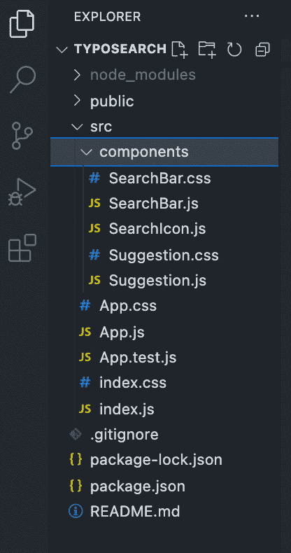
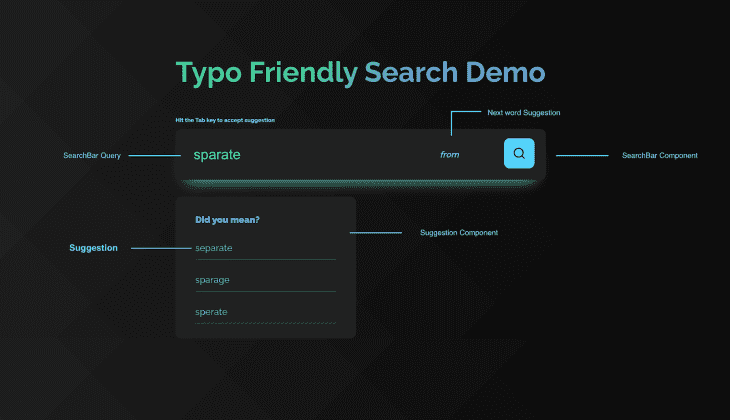

# 如何在 React app 中实现输入友好的搜索组件

> 原文：<https://blog.logrocket.com/implement-typo-friendly-search-react/>

搜索组件是一种在应用程序中轻松查找和访问数据的方法。用户将搜索组件视为与应用程序通信的界面。它使他们能够通过输入字段查找、排序和过滤应用程序内容的各个部分，他们可以在输入字段中指定搜索关键字和/或过滤选项来过滤结果。

向 web 应用程序添加搜索功能有多种方法，例如从头开始创建搜索组件，或者使用搜索工具来节省时间并提高准确性和生产率。在这篇博文中，你将一步一步地学习如何使用一个简单的 API 在 React 应用中实现一个输入友好的搜索组件。

本文还将比较两个搜索引擎(Algolia 和 Typesense ),并查看它们之间的优势，根据您的应用程序需求，为您提供关于哪一个是搜索功能的更好选择的基本知识。

## 先决条件

本文假设您熟悉以下内容:

*   反应
*   API 的基本使用
*   基本 CSS

### 目录

## 在 React 中构建输入友好的搜索组件时需要考虑什么

拥有一个输入友好的搜索组件将为用户在浏览应用程序时提供更好的用户体验。当创建一个搜索组件时，重要的是要注意你应该考虑哪些特性来提供一个有效的搜索组件和一个总体上令人满意的用户体验。

### 自动完成功能

该功能会在用户开始键入单词时自动提供完成单词的预测。它节省时间，因为它帮助用户快速完成他们想要的搜索查询。

### 自动更正功能

此功能提供了纠正拼写错误、拼写错误和大小写错误的建议。这使得用户在搜索应用程序时，无需确保术语是否准确无误。

### 建议相关结果功能

该功能为用户提供了与他们正在搜索的术语相关的建议单词列表。

## **演示** **应用****:****排版搜索**

本演示教程将介绍如何使用 React 构建一个简单的搜索应用程序，以及如何添加一些对输入友好的特性，比如更正建议和下一个单词预测。

该应用程序由三个主要组件组成:组件`SearchBar.js`、组件`Suggestion.js`和包装所有其他组件的整体组件`App.js`。

当您键入关键字时，该组件会做两件事:

*   它试图预测下一个可能的单词——例如，单词“separate”最有可能跟在“from”后面
*   当你打错一个单词时，它会提示一些单词。例如，当您键入“poople”时，它会建议将“people”作为修复输入错误的建议选项之一

这些功能将使用免费的 [Datamuse API](https://www.datamuse.com/api/) 来实现，该 API 的每日 API 调用限制为 100，000 次。

### 装置

首先，从 [GitHub](https://github.com/IkehAkinyemi/react_search_component) 克隆项目。通过在终端中运行以下命令来安装依赖项:

```
npm install

```

您的文件夹结构应该如下所示:



运行以下命令启动本地服务器以预览应用程序:

```
npm run start

```

### 构建组件

如上所述，这个项目有三个组成部分。

首先是`SearchBar`组件。这是一个简单的搜索字段，您可以在其中键入搜索关键字。

```
import React from 'react';
import './SearchBar.css';
import SearchIcon from './SearchIcon';
function SearchBar({ handleSearch, nextWord, searchValue, selectSug }) {
  const handleKeyDown = (e) => {
    if (e.key === 'Tab') selectSug(false, nextWord);
  }
  return (
    <>
    { searchValue && <p className="tip">Hit the <span>Tab</span> key to accept suggestion</p> }
    <div className="search-bar" tabIndex="0">
        <input 
          className="search-bar__input" 
          type="text" 
          name="search" 
          placeholder="Enter search keyword..." 
          onChange={handleSearch}
          value={searchValue}
          spellCheck={true}
          onKeyDown={handleKeyDown}
        />
        { searchValue && nextWord && <span className="search-bar__suggestion"><i>{nextWord}</i></span> }
        <span className="search-bar__icon" onClick={() => alert(searchValue)}>
          <SearchIcon />
        </span>
    </div>
    </>
  )
}
export default SearchBar;

```

第二个是`Suggestion`组件。该组件基本上包含三个单词的建议，旨在纠正输入到`SearchBar`组件中的输入错误。

```
import React from 'react';
import './Suggestion.css';
function Suggestion({ correctionSugs, searchValue, selectSug }) {
  return (
    <>
    {
      searchValue && correctionSugs.length > 1 &&
      <div className="suggestion">
          <h4 className="suggestion__header">Did you mean?</h4>
          {
            correctionSugs.map(item => {
              return <p className="suggestion__sug" key={item} onClick={() => selectSug(item)}>{item}</p>
            })
          }
      </div>
    }
    </>
  )
}
export default Suggestion;
```

最后，我们有了`App`组件。这是封装所有其他组件的 home 组件。它执行计算，并在必要时将道具传递给其他组件。



### 它是如何工作的

当您在输入字段中键入内容时，应用程序会进行两次 API 调用。第一个调用用于预测搜索关键字最常见的下一个单词。当这个数据从 API 返回时，它被存储在一个状态变量`nextWordSug`中，并作为一个道具传递给呈现它的`SearchBar.js`组件。您可以点击**标签**按钮，自动将下一个单词建议添加到您的搜索关键词中。

```
try {
  const res = await fetch(`https://api.datamuse.com/words?lc=${word}`);
  const data = await res.json();
  if (data.length > 1) setNextWordSug(data[0].word);
} catch (err) {
  alert('Error occured while getting susggestions!');
}

```

另一个是对一个打错的单词的建议更正。当数据从 API 返回时，前三个建议被提取出来，存储在`correctionSugs`状态变量中，并作为一个道具传递给`Suggestion.js`组件。您可以点击任何建议来接受建议——这会用接受的建议替换您的打字错误。

```
try {
  const res = await fetch(`https://api.datamuse.com/words?sp=${word}`);
  const data = await res.json();
  let _data = [];
  for (let i = 0; i < 3; i++) {
    if (data.length >= 3) {
      if (data[0].word !== word.toLowerCase()) _data.push(data[i].word);
    }
    setCorrectionSugs(_data);
  }
} catch (err) {
  alert('Error occured while getting susggestions!');
  console.log(err);
}

```

这就是全部了！可以参考[源代码](https://github.com/IkehAkinyemi/react_search_component)进行深入复习。

## Algolia vs. Typesense

虽然您可以使用上面的方法在 React 应用程序中构建搜索组件，但是您也可以利用搜索工具在 React 应用程序中快速启动搜索组件。本文的这一部分比较了两种高效的搜索工具——Algolia 和 Typesense，您可以轻松地将它们集成到 React 应用程序中，以改善最终用户的搜索体验。

与自己创建自定义搜索组件不同，这些搜索工具更易于使用、更直观，并提供了一些内置功能，如自动完成和自动更正，因此您不必自己手动编写这些功能。

### 什么是 Algolia？

Algolia 是一个搜索引擎产品，它提供了一组构建模块，为您的用户创建快速、直观和全面的惊人搜索体验。它为您提供自动更正和自动完成搜索功能，帮助您的用户更快地找到答案。

* * *

### 更多来自 LogRocket 的精彩文章:

* * *

它提供了一个开发人员友好的 API 客户端、直观的 UX 工具和几个集成来帮助您在应用程序中快速创建搜索组件。它为开发人员提供了一个仪表板来管理他们的搜索分析，并允许您集成自己的分析工具来查看用户如何搜索。

#### 全球语言支持

Algolia 是语言无关的，它支持基于符号的语言，包括中文、日文、阿拉伯文和其他不需要额外配置的语言。这意味着它支持从左到右(LTR)和从右到左(RTL)脚本 ***。***

#### 错别字公差

错别字容忍是一种容忍用户拼写错误的功能，并为他们提供他们搜索的项目。Algolia 通过匹配与搜索单词拼写最接近的单词来提供这一功能。

### 什么是 Typesense？

Typesense 是一个允许输入错误的搜索引擎，它使用最先进的搜索算法构建，优化了即时搜索体验。

它通过自动完成、过滤器、查询建议和特性增强了搜索体验。与 Algolia 不同，Typesense 是开源的，这意味着你可以自己托管它，但他们确实提供了一个基于云的解决方案:Typesense Cloud。

#### 没有运行时依赖性

Typesense 是一个不需要运行时依赖的单一二进制文件。这意味着您可以在本地或在生产环境中用一个命令运行 Typsense。

#### 设置简单

Typesense 易于设置、管理、集成、操作和扩展。

### 主要差异和相似之处

*   Algolia 提供个性化和基于服务器的搜索分析。另一方面，Typesense 允许您在客户端创建搜索，并将搜索指标发送到您首选的 web 分析工具
*   Typesense 是完全开源的，这意味着你可以自己托管它(免费)或者使用它的托管 SaaS 产品 Typesense Cloud。Algolia 是一个专有的闭源选项
*   Typesense 和 Algolia 都提供了一个仪表板，你可以使用它来访问你的数据和索引配置，并监控你的搜索分析
*   Typesense 为可容纳在高达 24TB RAM 中的数据集提供即时搜索体验，而 Algolia 为最大 128GB 的数据集提供即时搜索体验
*   它们都提供自动完成、自动更正、允许输入错误、分面等功能

## 结论

搜索是一个重要的功能，在几乎每个现代应用程序中都很有用，尤其是在电子商务应用程序、文档、数据库和聊天应用程序中。

在 React 中创建一个输入友好的组件可能是一项非常困难的任务，尤其是如果您必须自己构建功能的话。然而，利用像 Algolia 和 Typesense 这样的搜索引擎服务可以减轻你的麻烦。

React 应用的最佳选择取决于您的使用案例。如果成本不是问题，Algolia 是一个很好的选择，而 Typesense 提供了一个开源版本，你可以免费自己托管。Algolia 和 Typesense 都被归类为搜索即服务工具，具有几个内置功能来改善整体用户体验。

## 使用 LogRocket 消除传统反应错误报告的噪音

[LogRocket](https://lp.logrocket.com/blg/react-signup-issue-free)

是一款 React analytics 解决方案，可保护您免受数百个误报错误警报的影响，只针对少数真正重要的项目。LogRocket 告诉您 React 应用程序中实际影响用户的最具影响力的 bug 和 UX 问题。

[ ](https://lp.logrocket.com/blg/react-signup-general) [  ](https://lp.logrocket.com/blg/react-signup-general) [LogRocket](https://lp.logrocket.com/blg/react-signup-issue-free)

自动聚合客户端错误、反应错误边界、还原状态、缓慢的组件加载时间、JS 异常、前端性能指标和用户交互。然后，LogRocket 使用机器学习来通知您影响大多数用户的最具影响力的问题，并提供您修复它所需的上下文。

关注重要的 React bug—[今天就试试 LogRocket】。](https://lp.logrocket.com/blg/react-signup-issue-free)