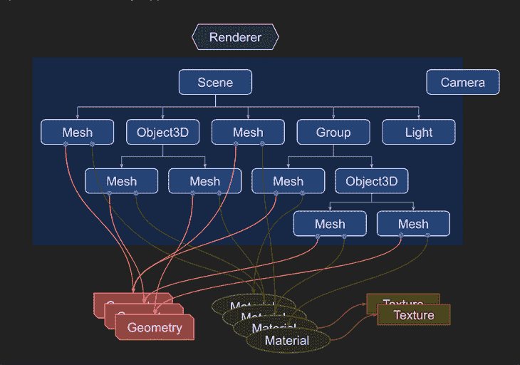
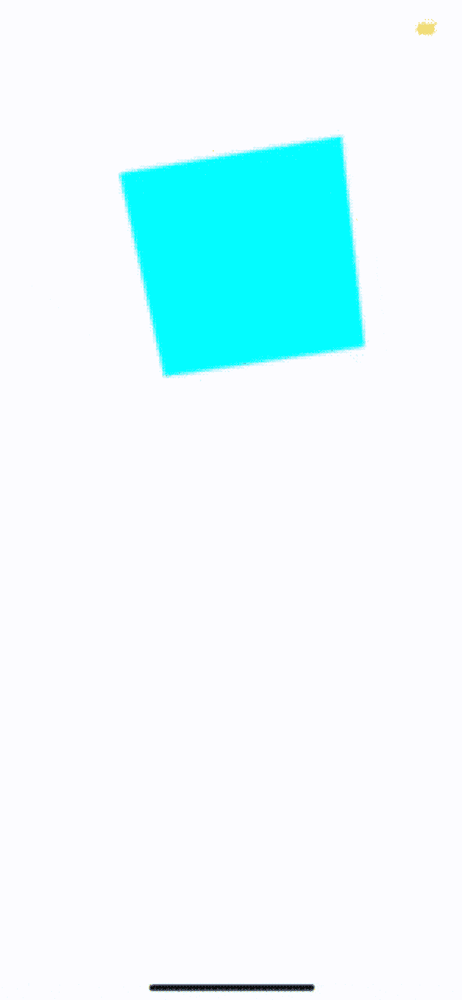
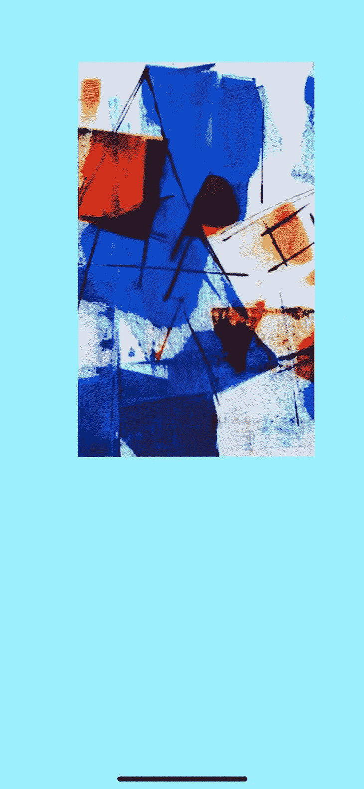
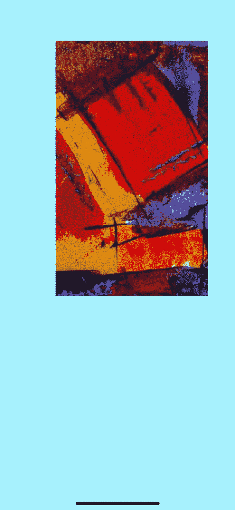
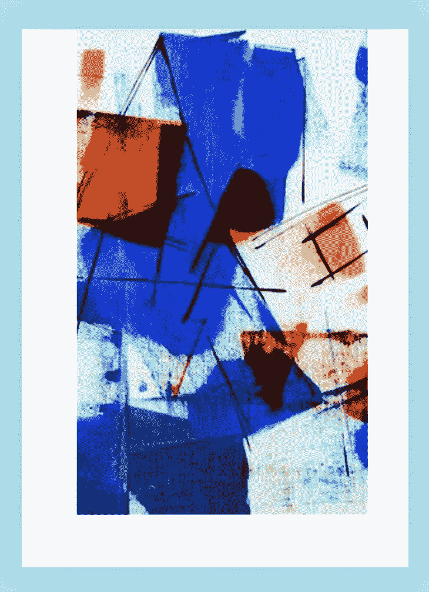
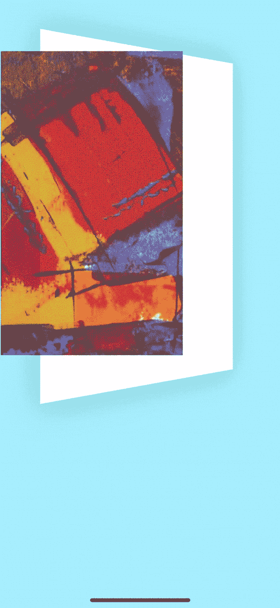

# 在 React Native 中实现 3D 动画

> 原文：<https://blog.logrocket.com/implementing-3d-animations-react-native/>

本文的范围将涵盖对 [Three.js](https://threejs.org/) 库和[动画 API](https://reactnative.dev/docs/animated) 的探索。你应该对 JavaScript 有基本的了解，并能自然地理解它；要了解更多关于 React Native 的精彩内容，LogRocket 博客上的 [React Native archives](https://blog.logrocket.com/tag/react-native/) 是一个复习的好地方。

我们将把这篇文章一分为二。在第一部分中，我们探索在 React Native 中创建高级 3D 动画。我们将依赖于 [Three.js](https://threejs.org/) 库，这是一个跨平台的 JavaScript 3D 库，用于在 web 环境中创建 3D 内容，如图形和动画。Three.js 整合了 [WebGL](https://get.webgl.org/) 增强行为以在网络上渲染 3D 模型，以及 [TweenMax](https://greensock.com/tweenmax/) 以增强动画质量。

文章的第二部分将探索动画 API ，它让我们的动画更加流畅。

*向前跳转:*

## 安装和先决条件

首先，我们需要创建 React 本地应用程序。安装 [Expo CLI](https://docs.expo.dev/workflow/expo-cli/) 为我们的项目服务；它与 [Expo GO](https://docs.expo.dev/get-started/installation/#2-expo-go-app-for-ios-and) library 携手合作，后者是一个移动客户端应用程序，我们将使用它在 iOS 或 Android 平台上打开我们的项目。

安装 Expo CLI 后，继续在终端中运行以下命令。此应用程序将使用 TypeScript 模板。

```
expo init reactNative3D
cd reactNative3D
yarn start
```

在继续之前，我们需要安装一些核心依赖项。打开终端窗口，运行以下命令。

```
yarn add three expo-three expo-gl
yarn add --dev @types/three
```

让我们回顾一下这些依赖关系:

*   [expo-gl](https://docs.expo.dev/versions/latest/sdk/gl-view/) :这提供了一个`View`作为 [OpenGL](https://www.opengl.org/) ES 渲染目标，这对于渲染 2D 和 3D 图形都很有用。一旦挂载，就会创建一个接受`[onContextCreate prop](https://docs.expo.dev/versions/latest/sdk/gl-view/#oncontextcreate)`的 OpenGL 上下文，它有一个 [WebGL RenderingContext 接口](https://www.khronos.org/registry/webgl/specs/latest/1.0/#5.14)
*   [expo-three](https://github.com/expo/expo-three) :充当 Three.js 与 ExpoGL 之间的桥梁；它还为 React Native 中的原生 OpenGL-ES 提供了一个 WebGL 接口，这有助于将 DOM 从 Three.js 中抽象出来
*   [三个](https://threejs.org/manual/#en/fundamentals):用于在网页上创建 3D 内容的 3D 库

## 如何使用 Three.js 渲染 3D 模型

当使用 Three.js 渲染 3D 模型时，我们首先创建一个场景作为模型渲染的场景。下图说明了一个 Three.js 应用程序的基本结构，在这里需要创建对象并将它们连接在一起。



Source: [Three.js](https://threejs.org)

让我们研究一下上面的图表。

*   关键部分是 Three.js 的主要对象`renderer`，我们创建的`scene`和`camera`被传递给渲染器，渲染器渲染(绘制)3D 场景的一部分
*   `scene`是一个对象，它定义了`[scenegraph](https://threejs.org/)`的根，并包含一些属性，比如背景颜色
*   `Mesh`是代表具有特定`[Material](https://threejs.org/docs/#api/en/materials/Material)`类的特定`Geometry`的绘图的对象
*   一块`Geometry`(球体，立方体)的顶点数据用`Geometry`对象表示。Three.js 提供了内置的几何图元
*   用于绘制几何图形的表面属性由`[Material](https://threejs.org/docs/#api/en/materials/Material)`对象表示。它接受诸如`color`和`texture`这样的值
*   `[Texture](https://threejs.org/docs/#api/en/textures/Texture)`对象代表从图像文件加载的图像

在下面的章节中，我们将使用这些结构来创建一个 3D 动画。

## 使用 3D 立方体创建场景

在项目目录根目录下的`App.tsx`组件中，我们将创建一个基本的 React 本地组件。将所需的包导入到`App.tsx`组件中。

```
code App.tsx
```

```
import React from 'react';
import { View } from 'react-native';
import Expo from 'expo';
import {Scene, Mesh, MeshBasicMaterial, PerspectiveCamera} from 'three';
import ExpoTHREE, {Renderer} from 'expo-three';
import { ExpoWebGLRenderingContext, GLView } from 'expo-gl';

```

继续创建场景，从`expo-gl`导出的`GLView`提供了一个充当 OpenGL ES 渲染目标的视图。这对于渲染我们正在创建的 3D 对象非常有用。

在`App.tsx`组件中，创建一个功能组件。

```
const App = () => {
  const onContextCreate = async (gl: Object) => {}
  return (
    <View>
      <GLView
      onContextCreate={onContextCreate}
      />
    </View>
  )
}

export default App;

```

我们的应用程序的基本框架已经完成。`onContextCreate`属性通过一个参数`gl`传递给`[GLView](https://docs.expo.dev/versions/latest/sdk/gl-view/#oncontextcreate)`，后者有一个 [WebGL RenderingContext](https://www.khronos.org/registry/webgl/specs/latest/1.0/#5.14) 接口。

转移我们的焦点，让我们创建`onContextCreate`函数。

```
  const onContextCreate = async (gl: any) => {
    // three.js implementation.
    const scene = new Scene();
    const camera = new PerspectiveCamera(
      75,
      gl.drawingBufferWidth / gl.drawingBufferHeight,
      0.1,
      1000
    );
    gl.canvas = {
      width: gl.drawingBufferWidth,
      height: gl.drawingBufferHeight,
    };

    // set camera position away from cube
    camera.position.z = 2;

    const renderer = new Renderer({ gl });
    // set size of buffer to be equal to drawing buffer width
    renderer.setSize(gl.drawingBufferWidth, gl.drawingBufferHeight);

    // create cube
    // define geometry
    const geometry = new BoxBufferGeometry(1, 1, 1);
    const material = new MeshBasicMaterial({
      color: "cyan",
    });

    const cube = new Mesh(geometry, material);

    // add cube to scene
    scene.add(cube);

    // create render function
    const render = () => {
      requestAnimationFrame(render);
      // create rotate functionality
      // rotate around x axis
      cube.rotation.x += 0.01;

      // rotate around y axis
      cube.rotation.y += 0.01;

      renderer.render(scene, camera);
      gl.endFrameEXP();
    };

    // call render
    render();
  };

```

随着`onContextCreate`功能的完成，我们的 3D 立方体就完成了。

您的`App.tsx`文件应该如下所示:

```
import React from "react";
import { View } from "react-native";
import Expo from "expo";
import {
  Scene,
  Mesh,
  MeshBasicMaterial,
  PerspectiveCamera,
  BoxBufferGeometry,
} from "three";
import ExpoTHREE, { Renderer } from "expo-three";
import { ExpoWebGLRenderingContext, GLView } from "expo-gl";
import { StatusBar } from "expo-status-bar";

const App = () => {

  const onContextCreate = async (gl: any) => {
    // three.js implementation.
    const scene = new Scene();
    const camera = new PerspectiveCamera(
      75,
      gl.drawingBufferWidth / gl.drawingBufferHeight,
      0.1,
      1000
    );
    gl.canvas = {
      width: gl.drawingBufferWidth,
      height: gl.drawingBufferHeight,
    };

    // set camera position away from cube
    camera.position.z = 2;

    const renderer = new Renderer({ gl });
    // set size of buffer to be equal to drawing buffer width
    renderer.setSize(gl.drawingBufferWidth, gl.drawingBufferHeight);

    // create cube
    // define geometry
    const geometry = new BoxBufferGeometry(1, 1, 1);
    const material = new MeshBasicMaterial({
      color: "cyan",
    });

    const cube = new Mesh(geometry, material);

    // add cube to scene
    scene.add(cube);

    // create render function
    const render = () => {
      requestAnimationFrame(render);
      // create rotate functionality
      // rotate around x axis
      cube.rotation.x += 0.01;

      // rotate around y axis
      cube.rotation.y += 0.01;

      renderer.render(scene, camera);
      gl.endFrameEXP();
    };

    // call render
    render();
  };

  return (
    <View>
      <GLView
        onContextCreate={onContextCreate}
        // set height and width of GLView
        style={{ width: 400, height: 400 }}
      />
    </View>
  );
};

export default App;

```

停止 Metro 服务器以确保所有新文件都已添加，然后再次启动它。

```
ctrl c
yarn start
```

用 Expo app 打开应用。



## 探索动画 API

在这一节中，我们将使用`FlatList`和动画 API 创建一个 3D 旋转木马。让我们首先创建没有 3D 效果的旋转木马。

在`App.tsx`中，注释掉之前的代码，从头开始新的实现。我们从安装项目中需要的依赖项开始。

安装 [react-native-uuid](https://www.npmjs.com/package/react-native-uuid) 库和 [@expo/vector-icons](https://docs.expo.dev/guides/icons/) 。

```
yarn add react-native-uuid @expo/vector-icons
```

现在，将所需的库导入组件。

```
import * as React from "react";
import {
  FlatList,
  Image,
  Text,
  View,
  Dimensions,
  TouchableOpacity,
  StyleSheet,
  Animated,
} from "react-native";
import { SafeAreaView } from "react-native";
import { AntDesign } from "@expo/vector-icons";
import uuid from "react-native-uuid";
import { StatusBar } from "expo-status-bar";
const { width, height } = Dimensions.get("screen");

```

创建图像轮播时，指定轮播中图像的`width`和`height`属性可以获得更好的视图。`Spacing`变量支持跨不同样式需求的可重用性。

```
const IMAGE_WIDTH = width * 0.65;
const IMAGE_HEIGHT = height * 0.7;
const SPACING = 20;

```

使用 [Pexels Images API](https://www.pexels.com/api/documentation/#photos-overview) ，我们可以生成一组图像来填充我们的应用程序。

```
const images = [
  "https://images.pexels.com/photos/1799912/pexels-photo-1799912.jpeg?auto=compress&cs=tinysrgb&dpr=1&w=500",
  "https://images.pexels.com/photos/1769524/pexels-photo-1769524.jpeg?auto=compress&cs=tinysrgb&dpr=1&w=500",
  "https://images.pexels.com/photos/1758101/pexels-photo-1758101.jpeg?auto=compress&cs=tinysrgb&dpr=1&w=500",
  "https://images.pexels.com/photos/1738434/pexels-photo-1738434.jpeg?auto=compress&cs=tinysrgb&dpr=1&w=500",
  "https://images.pexels.com/photos/1698394/pexels-photo-1698394.jpeg?auto=compress&cs=tinysrgb&dpr=1&w=500",
  "https://images.pexels.com/photos/1684429/pexels-photo-1684429.jpeg?auto=compress&cs=tinysrgb&dpr=1&w=500",
  "https://images.pexels.com/photos/1690351/pexels-photo-1690351.jpeg?auto=compress&cs=tinysrgb&dpr=1&w=500",
  "https://images.pexels.com/photos/1668211/pexels-photo-1668211.jpeg?auto=compress&cs=tinysrgb&dpr=1&w=500",
  "https://images.pexels.com/photos/1647372/pexels-photo-1647372.jpeg?auto=compress&cs=tinysrgb&dpr=1&w=500",
  "https://images.pexels.com/photos/1616164/pexels-photo-1616164.jpeg?auto=compress&cs=tinysrgb&dpr=1&w=500",
  "https://images.pexels.com/photos/1799901/pexels-photo-1799901.jpeg?auto=compress&cs=tinysrgb&dpr=1&w=500",
  "https://images.pexels.com/photos/1789968/pexels-photo-1789968.jpeg?auto=compress&cs=tinysrgb&dpr=1&w=500",
  "https://images.pexels.com/photos/1774301/pexels-photo-1774301.jpeg?auto=compress&cs=tinysrgb&dpr=1&w=500",
  "https://images.pexels.com/photos/1734364/pexels-photo-1734364.jpeg?auto=compress&cs=tinysrgb&dpr=1&w=500",
  "https://images.pexels.com/photos/1724888/pexels-photo-1724888.jpeg?auto=compress&cs=tinysrgb&dpr=1&w=500",
];

```

我们将使用 [react-native-uuid 库](https://www.npmjs.com/package/react-native-uuid)将随机数据植入应用程序。

```
const DATA = [...Array(images.length).keys()].map((_, i) => {
  return {
    key: uuid.v4(),
    image: images[i],
  };
});

```

现在是时候实现我们的旋转视图了。

```
export default () => {
  return (
    <View style={{ backgroundColor: "#A5F1FA", flex: 1 }}>
      <StatusBar hidden />
      <SafeAreaView style={{ marginTop: SPACING * 1 }}>
        <View style={{ height: IMAGE_HEIGHT * 2.1 }}>
          <FlatList
            data={DATA}
            keyExtractor={(item) => item.key}
            horizontal
            pagingEnabled
            bounces={false}
            style={{ flexGrow: 0, zIndex: 9999 }}
            contentContainerStyle={{
              height: IMAGE_HEIGHT + SPACING * 2,
              paddingHorizontal: SPACING * 4,
            }}
            showsHorizontalScrollIndicator={false}
            renderItem={({ item, index }) => {
              return (
                <View
                  style={{
                    width,
                    paddingVertical: SPACING,
                  }}
                >
                  <Image
                    source={{ uri: item.image }}
                    style={{
                      width: IMAGE_WIDTH,
                      height: IMAGE_HEIGHT,
                      resizeMode: "cover",
                    }}
                  />
                </View>
              );
            }}
          />
        </View>
      </SafeAreaView>
    </View>
  );
};

```



图像轮播已成功创建。

## 使用动画 API 创建 3D 效果

下一步是使用动画 API 来创建 3D 效果。为了利用这个动画 API，我们需要将我们的`FlatList`改为`Animated.FlatList`，并添加一个`onScroll`事件，在这个事件中，我们将传入一个`NativeEvent`。

变量`scrollX`将被定义为 x 轴的值。我们将传入一个`useRef()`钩子来让 React 跟踪动画。即使在重新渲染后，这也能保持`scrollX`值。

```
export default () => {
  const scrollX = React.useRef(new Animated.Value(0)).current;
  return (
    <View style={{ backgroundColor: "#A5F1FA", flex: 1 }}>
      <StatusBar hidden />
      <SafeAreaView style={{ marginTop: SPACING * 1 }}>
        <View style={{ height: IMAGE_HEIGHT * 2.1 }}>
          <Animated.FlatList
            data={DATA}
            keyExtractor={(item) => item.key}
            horizontal
            pagingEnabled
            onScroll={Animated.event(
              [
                {
                  nativeEvent: { contentOffset: { x: scrollX } },
                },
              ],
              {
                useNativeDriver: true,
              }
            )}

```

现在我们可以在依靠`scrollX`创建动画的同时插值。在我们的`FlatList`的`renderItem`中，创建一个`inputRange`。我们将使用输入范围数字进行插值。然后，在`renderItem`中创建一个`opacity`变量。

```
           renderItem={({ item, index }) => {
              const inputRange = [
                (index - 1) * width, // next slide
                index * width, // current slide
                (index + 1) * width, // previous slide
              ];
              const opacity = scrollX.interpolate({
                inputRange,
                outputRange: [0, 1, 0],
              });
         const translateY = scrollX.interpolate({
                inputRange,
                outputRange: [50, 0, 20] // create a wave
              })

```

接下来，我们已经将项目中的视图转换为一个`Animated.View`，我们之前创建的`opacity`变量将作为样式传入。

```
             return (
                <Animated.View
                  style={{
                    width,
                    paddingVertical: SPACING,
                    opacity,
                    transform: [{ translateY }]
                  }}
                >
                  <Image
                    source={{ uri: item.image }}
                    style={{
                      width: IMAGE_WIDTH,
                      height: IMAGE_HEIGHT,
                      resizeMode: "cover",
                    }}
                  />
                </Animated.View>
              );

```



现在，当滑动时，不透明度是基于输入范围应用的。

### 添加背景

让我们添加一个白色背景，以便在滑动图像时突出 3D 动画。

在`View`下面，粘贴下面的代码块。

```
 <View
            style={{
              width: IMAGE_WIDTH + SPACING * 4,
              height: 450,
              position: "absolute",
              backgroundColor: "white",
              backfaceVisibility: true,
              zIndex: -1,
              top: SPACING * 1,
              left: SPACING * 1.7,
              bottom: 0,
              shadowColor: "#000",
              shadowOpacity: 0.2,
              shadowRadius: 24,
              shadowOffset: {
                width: 0,
                height: 0,
              },
            }}
          />
        </View>

```



下一步是制作白色背景的动画，使其在 3D 视图中旋转。但在此之前，让我们想出一种方法来查看`0`和`1`之间的`inputRange`。

在我们的`Carousel`组件的顶部，使用来自动画 API 的方法`divide()`和`modulo()`创建一个进度变量，让我们修改并获得`0`和`1`之间的值。`progress`变量使我们能够将值固定在`0`和`1`之间。

```
export default () => {
  const scrollX = React.useRef(new Animated.Value(0)).current;
  const progress = Animated.modulo(Animated.divide(scrollX, width), width);

```

我们现在准备开始修改保存白色背景的`View`组件。正如我们之前所做的，将`View`组件转换成一个`Animated.View`。

一个`transform`输入被传递到`Animated.View`组件；`transform`收到一个`perspective`和一个`rotateY`。

```
          <Animated.View
            style={{
              width: IMAGE_WIDTH + SPACING * 4,
              height: 450,
              position: "absolute",
              backgroundColor: "white",
              backfaceVisibility: true,
              zIndex: -1,
              top: SPACING * 1,
              left: SPACING * 1.7,
              bottom: 0,
              shadowColor: "#000",
              shadowOpacity: 0.2,
              shadowRadius: 24,
              shadowOffset: {
                width: 0,
                height: 0,
              },
              transform: [
                {
                  perspective: IMAGE_WIDTH * 4,
                },
                {
                  rotateY: progress.interpolate({
                    inputRange: [0, 0.5, 1],
                    outputRange: ["0deg", "90deg", "180deg"],
                  }),
                },

              ],
            }}
          />

```



该项目的[回购可在 GitHub 上](https://github.com/dueka/react-native-3d-animation)获得。

## 结论

在本文中，我们探索了如何使用 Three.js 在 React Native 中创建 3D 内容。Three.js 支持在 React 本地环境中渲染 3D 模型。当与动画 API 结合使用时，这些工具可以为我们提供额外的灵活性，使我们能够为用户构建更流畅、更吸引人的视图。这仅仅是可以用动画 API 实现的令人惊奇的动画的一个例子。

希望这篇文章能为未来的开发人员提供一个探索性的指南，帮助他们创造更好的用户体验。

## [LogRocket](https://lp.logrocket.com/blg/react-native-signup) :即时重现 React 原生应用中的问题。

[](https://lp.logrocket.com/blg/react-native-signup)

[LogRocket](https://lp.logrocket.com/blg/react-native-signup) 是一款 React 原生监控解决方案，可帮助您即时重现问题、确定 bug 的优先级并了解 React 原生应用的性能。

LogRocket 还可以向你展示用户是如何与你的应用程序互动的，从而帮助你提高转化率和产品使用率。LogRocket 的产品分析功能揭示了用户不完成特定流程或不采用新功能的原因。

开始主动监控您的 React 原生应用— [免费试用 LogRocket】。](https://lp.logrocket.com/blg/react-native-signup)