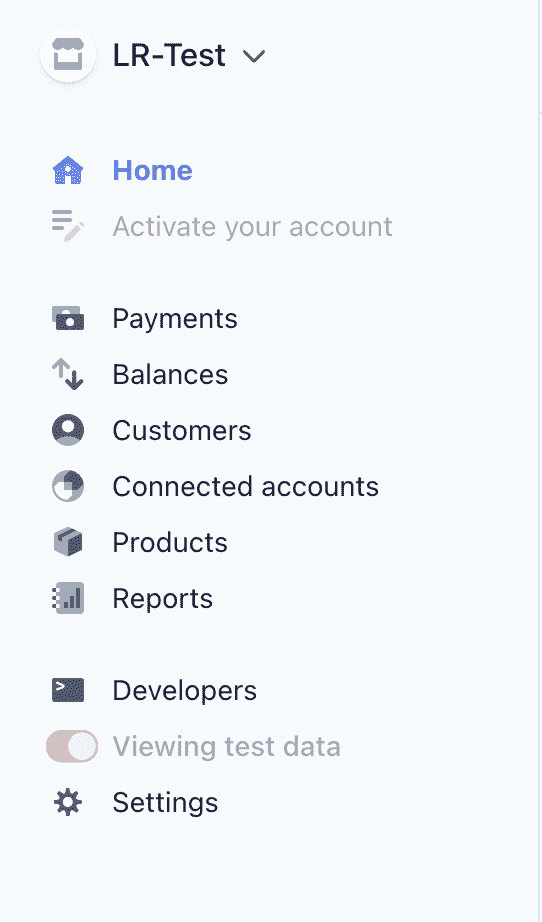

# 在 Stripe 中实现 3D 安全

> 原文：<https://blog.logrocket.com/implementing-3d-secure-in-stripe/>

在我们生活的世界中，我们与许多在线服务进行交互，并通过在线支付网关向这些服务进行支付。作为开发者，我们有责任以一种对用户和收款方都安全的方式集成这些支付网关。

在本文中，我们将介绍如何使用 Stripe 实现在线支付的 3D 安全保护。

## 什么是 3D 安全？

3D Secure 是 Stripe 在实际处理支付之前验证用户身份的一种方式。当用户输入他的卡的详细信息时，他会得到一个弹出或重定向的提示来验证支付。

它通常通过 OTP 来验证身份，但也可能取决于发行该卡的银行。在某些国家/地区，3D Secure 不是必需的，但在印度等国家/地区，3D Secure 是必需的。

你可以在你的 Stripe 帐户中设置你的雷达规则以要求 3D 安全认证，但是如果你的支付表单中没有代码来使 3D 安全弹出窗口工作，那么这是没有用的。

在本文中，我们将使用 NodeJS、React 和 Stripe 创建一个简单的捐赠 web 应用程序。我们将讨论以下主题:

*   设置条带并获取 API 密钥
*   设置 NodeJS 后端和 React 前端
*   在前端创建一个结帐表单
*   以通常的方式处理付款
*   如果需要身份验证，使用 3D Secure 作为后备方案
*   确认付款
*   添加定期付款(订阅)
*   测试我们的集成

## 你需要什么？

*   代码编辑器——我更喜欢使用 VSCode，但是你可以使用任何你选择的代码编辑器
*   已安装的节点
*   一个[条纹](https://stripe.com)账户
*   命令行的基本知识
*   ReactJS 和 NodeJS 的基本知识

## 我们开始吧！

首先，我们将在后端工作。我更喜欢“API 优先的方法”,这意味着你首先创建一个 API，然后处理前端的其余部分。

我们将使用 NodeJS、Express 和 Stripe 包来创建我们的后端，以获取与支付相关的内容。

### 启动后端

让我们创建我们的后端。为此，请打开终端/命令提示符并键入以下命令，在所需的文件夹中启动 NodeJS 项目:

```
npm init -y

```

运行该命令将在文件夹中生成一个`package.json`文件。

现在，使用以下命令打开文件夹中的 VSCode，以便我们可以开始编辑:

```
code .

```

现在开放了 VSCode，可以使用集成终端了，生活会更轻松。只需在 Windows 上点击 **Ctrl + J** 或在 Mac 上点击 **Command + J** 即可在 VSCode 中打开终端。

让我们安装几个软件包，这将有助于我们进一步的项目。在终端中键入以下命令，我们将会看到这些包会做什么:

```
npm install express cors stripe dotenv

```

这些是正在安装的软件包:

*   `Express`用于轻松创建 HTTP 服务器
*   帮助我们消除客户应用程序中的交叉起源错误
*   `Stripe`是到条带的实际连接。我们可以获取付款细节，并使用这个包创建付款
*   `Dotenv`帮助我们启用环境变量来存储敏感数据

### 向环境变量添加条带密钥

在进一步讨论这个支付系统之前，让我们在环境变量中设置 Stripe 密钥。

所有秘密的 API 密钥和凭证都必须存储在环境变量中，以便在实际代码被盗时数据不会被盗。

要获取您的条纹密钥，请打开您的[条纹仪表板](https://dashboard.stripe.com/login)，您将看到类似下图的侧边菜单:



现在，点击**开发者**，然后点击 **API 键**。在那里你应该可以看到你的条纹可公开密钥。

现在，我们需要秘钥。请注意，您不应该与任何人共享您的密钥。共享您的密钥将允许其他人访问您的 Stripe 帐户。

另一方面，可发布密钥是我们在前端使用的密钥，是否有人可以访问并不重要，因为它是公开的。

现在，复制您的条带密钥并转到 VSCode，创建一个名为`.env`的新文件，并将密钥粘贴为以下格式:

```
STRIPE_SECRET_KEY=(secret key here)

```

`.env`文件用于存储环境变量。`dotenv`包将搜索这个文件来加载环境变量。既然`.env`文件已经完成，我们不需要在本教程中再次接触环境变量。

### 安装 Nodemon

按照教程操作时，您可能需要多次重新启动服务器。为了避免这种情况，我们可以安装一个名为`nodemon`的全局包，它会在我们保存文件时自动重启我们的服务器。[你可以在这里](https://blog.logrocket.com/nodemon-tutorial-automatically-restart-node-js-apps-with-nodemon/)阅读更多关于 Nodemon 的内容。

在终端中键入以下命令:

```
npm install -g nodemon

```

如果需要，使用`sudo`,因为 Nodemon 应该是全局安装的，所以它需要 root 权限。

### 设置 Express 服务器

让我们创建将运行我们的服务器的文件。我们可以将其命名为`index.js`,因为在`package.json`文件中它被默认指定为`main`。如果你愿意，你可以改变名字，但是在本教程中我们将坚持使用`index.js`。

让我们首先创建一个快速服务器和一个简单的路由:

```
const express = require("express");
const app = express();
const PORT = process.env.PORT || 5000;
const cors = require("cors");

app.use(cors());
app.use(express.json());
app.use(express.urlencoded({ extended: true }));

app.get("/", (req, res) => res.json({ status: 200, message: "API Works" }));

app.listen(PORT, () => console.log(`Server running on port ${PORT}`));

```

这创建了一个简单的 Express 服务器，有一个 home route，它简单地返回一个 JSON，说明 API 工作了。

在这里，我们将端口设置为`process.env.PORT || 5000`,因为如果您决定将此服务器部署到 Heroku 这样的服务，他们将在自己的端口上托管它，这些端口存储在他们的环境变量中，所以我们让他们决定端口。如果`process.env.PORT`未定义，则 app 在本地运行，将使用端口 5000。

我们使用`cors`包作为一个快速中间件，这样客户端应用程序可以正确地与我们的服务器交互，而不会出现任何跨源错误。您可以根据需要配置`cors`包，但是对于本教程，我们将只允许任何流量。

在中间件部分，我们还允许 JSON 和 url 编码的数据通过请求体，Express 会自动为我们解析它。

现在，如果您转到 Postman 或任何其他 HTTP 客户端并在`[http://localhost:5000](http://localhost:5000)`上执行 GET 请求，您将获得以下 JSON 响应:

```
{
  "status": 200,
  "message": "API Works"
}

```

如果您看到此消息，您的 Express 服务器设置正确。现在让我们进入下一步。

### 设置`dotenv`

现在让我们配置`dotenv`包，以便它可以正确识别来自`.env`文件的环境变量。在顶部编写以下代码:

```
require("dotenv").config();

```

### 初始化条带

现在让我们建立到 Stripe 的连接。在之前的教程中，我们已经安装了一个名为`stripe`的包，它将帮助我们与 Stripe 进行通信。但首先，我们需要向它提供我们的 Stripe 密钥，以便它可以与我们的 Stripe 帐户进行交互。

在我们之前创建的文件的顶部包含以下代码片段:

```
const Stripe = require("stripe");
const stripe = Stripe(process.env.STRIPE_SECRET_KEY);

```

前面我们处理了环境变量，这里是我们使用存储的`STRIPE_SECRET_KEY`的地方。现在，Stripe 可以识别您的帐户，我们可以与 Stripe 进一步互动。

整个代码现在应该显示如下内容:

```
require("dotenv").config();
const express = require("express");
const app = express();
const PORT = process.env.PORT || 5000;
const cors = require("cors");
const Stripe = require("stripe");
const stripe = Stripe(process.env.STRIPE_SECRET_KEY);

app.use(cors());
app.use(express.json());
app.use(express.urlencoded({ extended: true }));

app.get("/", (req, res) => res.json({ status: 200, message: "API Works" }));

app.listen(PORT, () => console.log(`Server running on port ${PORT}`));

```

### 收集支付数据

让我们想一想，我们需要从用户那里收集哪些数据来启动支付。为了本教程，我们将保持简单:

*   电子邮件地址
*   付款金额
*   `paymentMethod`，由前端条纹生成的 ID，代表一张特定的卡
*   订阅，不是`onetime`就是`monthly`。如果订阅设置为`monthly`，我们将设置定期付款

由于我们正在“创建”付款，我们将使用 POST 请求。使用 POST 请求的另一个原因是，我们发送给服务器的数据不像 GET 请求那样显示在 URL 本身中。另外，GET 请求可以通过浏览器直接访问，这不是我们想要的。

因此，让我们创建一个 POST 请求监听器并收集数据:

```
app.post("/donate", async (req, res) => {
  try {
    let { email, amount, paymentMethod, subscription } = req.body;
    if (!email || !amount || !paymentMethod || !subscription) 
      return res.status(400).json({ status: 400, message: "All fields are required!" });
    amount = parseInt(amount);

    if (subscription === "onetime") {
      // One time payment code here
    }

    if (subscription === "monthly") {
      // Recurring payment code here
    }

    res.status(400).json({ status: 400, message: "Invalid type" });
  } catch(err) {
    console.error(err);
    res.status(500).json({ status: 200, message: "Internal server error" });
  }
});

```

在上面的代码中，我们执行了以下操作:

*   当然是在`/donate`路线上设置一个 POST 监听器
*   从用户处收集`email`、`amount`和`paymentMethod`
*   验证字段，以便如果任何字段缺失，将会发送一条错误消息
*   有时，客户端应用程序可能会将`amount`作为字符串发送，在这种情况下，我们使用`parseInt()`函数将金额转换为整数值

首先，我们将处理一次性付款。

### 尝试简单的 HTTP 支付

我们仅在需要时使用 3D secure，或者根据条纹仪表板中的雷达规则使用 3D secure。我们必须在使用 3D Secure 之前尝试 HTTP 支付，因为有些卡不支持 3D Secure。

现在该联系条纹了:

```
const paymentIntent = await stripe.paymentIntents.create({
  amount: Math.round(amount * 100),
  currency: "INR",
  receipt_email: email,
  description: "Payment for donation",
  payment_method: paymentMethod,
  confirm: true
});

```

这将立即启动支付。`confirm`字段告诉 Stripe 在收到付款后立即确认。如果您不指定`confirm`，它不会向用户收费，并且您需要在再次请求条带化之前手动确认订单。

在`amount`字段中，指定辅助货币单位(例如，USD 是美分，INR 是 paisa)。`Math.round()`这里用来去掉任何小数，因为 Stripe 不喜欢小数。

根据您的 Stripe 帐户位置指定货币。对我来说是印度，所以我用`INR`作为货币。

一旦付款完成，收据将发送到指定的电子邮件。在这种情况下，我们提到我们从用户那里收集的电子邮件。

现在让我们检查一下这个简单的 HTTP 支付是否成功。为此，我们可以检查`paymentIntent`的状态属性:

```
if (paymentIntent.status === "succeeded") {
  // Payment successful!
  return res.json({
    status: 200,
    message: "Payment Successful!",
    id: paymentIntent.id
  });
}
>
```

简单的 HTTP 支付就这么多。这里，`paymentIntent.id`可以作为支付 ID。我们使用`return`立即停止进一步的执行，这样就不会出现意外的错误。

但是，如果状态不是`succeeded`而是`requires_action`，则意味着需要 3D 安全。下面是我们如何应对 3D 安全:

*   我们将获得付款意向的`client_secret`
*   我们将把`client_secret`发送到前端
*   前端将使用 3D secure 通过`client_secret`进行认证
*   我们将在后端制定一个路线，以再次检查支付状态

### 获取`client_secret`并发送到前端

让我们检查我们创建的支付意图是否需要 3D secure，然后向客户发送密码:

```
if (paymentIntent.status === "requires_action") {
  return res.json({ 
    status: 200,
    message: "3D secure required",
    actionRequired: true,
    clientSecret: paymentIntent.client_secret
  });
}

```

这样，我们将客户端机密发送到前端。一旦我们完成了后端部分，我们将在本文的后面处理前端。

最后，如果状态既不是`succeeded`也不是`requires_action`，我们将通知用户支付失败。我们在之前的案例中使用了`return`，所以我们不需要使用`else`:

```
return res.status(400).json({
  status: 400,
  message: "Payment failed!"
});

```

## 处理经常性付款

我们不会在经常性付款中直接使用付款意向。创建定期付款的流程略有不同:

*   首先，我们创建一个价格，这将是我们的捐赠金额
*   接下来，我们用用户的电子邮件创建一个 Stripe 客户
*   然后我们创建一个订阅并向客户收取费用。如果需要身份验证，Stripe 将每月向客户发送一封电子邮件，要求付款
*   最后，我们让用户在我们的网站上支付第一张发票

之前，我们为`monthly`订阅类型创建了一个`if`语句。所有的定期支付代码都在里面。

### 创建价格

让我们进入第一步，创建价格:

```
const price = await stripe.prices.create({
  unit_amount: Math.round(amount * 100),
  recurring: { interval: "month" },
  currency: "INR",
  product_data: {
    name: "Recurring donation"
  }
});

```

这里的`unit_amount`是实际数量——我们已经讨论过如何将其发送到条带。

我们还为`recurring`提供了一个`interval`。在这种情况下，我们将其设置为`month`。`product_data`对象包含一些关于产品本身的信息。在这种情况下，它只是一个捐赠，所以我们只指定它。

### 创建客户

现在，让我们创建客户:

```
const customer = await stripe.customers.create({
  email, 
  description: "Donation customer",
  payment_method: paymentMethod,
  invoice_settings: {
    default_payment_method: paymentMethod
  }
});

```

在这里，我们指定了`paymentMethod`，这样我们就可以在需要时立即向客户收费，而不会有任何麻烦。

### 创建订阅

这是客户实际收费的地方。当启动订阅时，会生成一张用户可以支付的发票，但我们会让用户立即支付发票以开始订阅。

我们可以从订阅中获取`paymentIntent`,然后我们可以像以前一样进行检查:

```
const subscribe = await stripe.subscriptions.create({
  customer: customer.id,
  items: [{ price: price.id }],
  expand: ["latest_invoice.payment_intent"]
});

```

我们传入客户 ID 和价格，将所有东西连接在一起。此外，为了访问最新发票的`paymentIntent`，我们使用了`expand`属性。

当我们尝试创建订阅时，Stripe 已经尝试了基于 HTTP 的支付。现在，我们需要像以前一样关注 3D 安全支付:

```
if (
  subscribe.latest_invoice.payment_intent.status === "requires_action"
) {
  // proceed to 3ds
  return res.status(200).json({
    status: 200,
    message: "3D Secure required",
    actionRequired: true,
    clientSecret: subscribe.latest_invoice.payment_intent.client_secret,
    id: subscribe.latest_invoice.payment_intent.id,
  });
}
if (subscribe.latest_invoice.payment_intent.status === "succeeded") {
  return res.json({
    status: 200,
    message: "Payment successful!",
  });
}
return res.status(400).json({ status: 400, message: "Payment failed!" });

```

这和我们一次性付款的方法一样。我们已经完成了后端的支付路线。

还有一条路要走——检查路。在前端进行身份验证后，我们需要一个路由来检查和验证后端的状态:

```
app.get("/check/:id", async (req, res) => {
  try {
    const id = req.params.id;
    const paymentIntent = await stripe.paymentIntents.retrieve(id);
    if (paymentIntent?.status === "succeeded") {
      return res.json({
        status: 200,
        message: "Payment successful!",
        id,
      });
    }
    res
      .status(400)
      .json({
        status: 200,
        message: "Payment failed! Please try again later.",
      });
  } catch (err) {
    console.error(err);
    res.status(500).json({ status: 500, message: "Internal server error" });
  }
});

```

这一次我们使用 GET 请求并检查支付是否真正完成。如果你不想使用 webhook，而想马上为用户提供虚拟服务，这是可以做到的。

这将是你的应用程序知道支付成功和用户可以使用的地方。但在这种情况下，这是一个捐赠网站，我们不需要在这里做任何特殊的事情。

### 完成`index.js`代码

您的`index.js`文件现在应该是这样的:

```
require("dotenv").config();
const express = require("express");
const app = express();
const PORT = process.env.PORT || 5000;
const cors = require("cors");
const Stripe = require("stripe");
const stripe = Stripe(process.env.STRIPE_SECRET_KEY);

app.use(cors());
app.use(express.json());
app.use(express.urlencoded({ extended: true }));

app.get("/", (req, res) => res.json({ status: 200, message: "API Works" }));

app.post("/donate", async (req, res) => {
  try {
    let { email, amount, paymentMethod, subscription } = req.body;
    if (!email || !amount || !paymentMethod || !subscription) 
      return res.status(400).json({ status: 400, message: "All fields are required!" });
    amount = parseInt(amount);

    if (subscription === "onetime") {
      // One time payment code here
      const paymentIntent = await stripe.paymentIntents.create({
        amount: Math.round(amount * 100),
        currency: "INR",
        receipt_email: email,
        description: "Payment for donation",
        payment_method: paymentMethod,
        confirm: true
      });
      if (paymentIntent.status === "succeeded") {
        // Payment successful!
        return res.json({
          status: 200,
          message: "Payment Successful!",
          id: paymentIntent.id
        });
      }
      if (paymentIntent.status === "requires_action") {
        return res.json({ 
          status: 200,
          message: "3D secure required",
          actionRequired: true,
          clientSecret: paymentIntent.client_secret
        });
      }
      return res.status(400).json({
        status: 400,
        message: "Payment failed!"
      });
    }

    if (subscription === "monthly") {
      // Recurring payment code here
      const price = await stripe.prices.create({
        unit_amount: Math.round(amount * 100),
        recurring: { interval: "month" },
        currency: "INR",
        product_data: {
          name: "Recurring donation"
        }
      });

      const customer = await stripe.customers.create({
        email, 
        description: "Donation customer",
        payment_method: paymentMethod,
        invoice_settings: {
          default_payment_method: paymentMethod
        }
      });

      const subscribe = await stripe.subscriptions.create({
        customer: customer.id,
        items: [{ price: price.id }],
        expand: ["latest_invoice.payment_intent"]
      });

      if (
        subscribe.latest_invoice.payment_intent.status === "requires_action"
      ) {
        // proceed to 3ds
        return res.status(200).json({
          status: 200,
          message: "3D Secure required",
          actionRequired: true,
          clientSecret: subscribe.latest_invoice.payment_intent.client_secret,
          id: subscribe.latest_invoice.payment_intent.id,
        });
      }
      if (subscribe.latest_invoice.payment_intent.status === "succeeded") {
        return res.json({
          status: 200,
          message: "Payment successful!",
        });
      }
      return res.status(400).json({ status: 400, message: "Payment failed!" });
    }

    res.status(400).json({ status: 400, message: "Invalid type" });
  } catch(err) {
    console.error(err);
    res.status(500).json({ status: 200, message: "Internal server error" });
  }
});

app.listen(PORT, () => console.log(`Server running on port ${PORT}`));

```

## 创建前端

现在让我们转到前端，了解如何触发 3D 安全认证以及如何发起支付。

我们不会在前端做任何花哨的造型。让我们保持简单，把重点放在支付方面的事情。

我们将在前端使用 React。创建一个名为`frontend`的新文件夹，在该文件夹中打开终端，并键入以下命令:

```
npx create-react-app .

```

`.`指定我们正在当前文件夹中创建一个 React 应用程序。

现在让我们安装一些制作这个应用程序时需要的包:

```
npm install axios @stripe/react-stripe-js @stripe/stripe-js

```

*   `axios`是一个库，可以轻松地发出 HTTP 请求，而不会干扰`fetch` API
*   这两个条带包对于创建[条带元素](https://stripe.com/payments/elements)和与条带通信都很有用

现在，使用以下命令在 React 应用程序中打开 VSCode:

```
code .

```

进入集成终端后，键入以下命令启动 React 应用程序:

```
npm start

```

应该会打开一个新的浏览器选项卡，您应该会看到以下屏幕:


如果您看到这个屏幕，您已经成功地启动了一个 React 应用程序。现在让我们做一些清理工作。

删除`src`中以下我们不需要的文件:

*   `App.test.js`
*   `setupTests.js`
*   `logo.svg`

一旦你删除这些文件，你会看到一个错误弹出。那是因为我们打碎了一些东西。

转到`App.js`并删除顶部的徽标导入和第一个`div`下的内容。移除`App.css`中的一切。

您的`App.js`应该是这样的:

```
import "./App.css";
function App() {
  return <div className="app"></div>;
}
export default App;

```

接下来，让我们创建一个名为`Checkout`的新组件。在`src`中创建两个文件:`Checkout.js`和`Checkout.css`。

由于我们在本教程中没有关注样式，所以我提供了一个 CSS 文件的内容，但是我们不会在`Checkout.css`中讲述实际发生的事情:

```
.checkout {
  display: flex;
  align-items: center;
  justify-content: center;
  height: 100vh;
  width: 100%;
}
.checkout__container {
  background-color: #f5f5f5;
  padding: 20px;
  width: 25%;
  display: flex;
  flex-direction: column;
}
.checkout__textBox {
  padding: 10px;
  font-size: 18px;
  margin-bottom: 10px;
}
.checkout__radio {
  margin-bottom: 10px;
}
.checkout__btn {
  margin-top: 10px;
  padding: 10px;
  font-size: 18px;
  border: none;
  background-color: #0984e3;
  color: white;
}

```

现在，打开`Checkout.js`并创建一个 React 功能组件:

```
import React from "react";
function Checkout() {
  return <div className="checkout"></div>;
}
export default Checkout;

```

现在让我们导入这个组件并在`App.js`中使用它:

```
import { Elements } from "@stripe/react-stripe-js";
import { loadStripe } from "@stripe/stripe-js";
import "./App.css";
import Checkout from "./Checkout";
const stripePromise = loadStripe("(publishable key here)");
function App() {
  return (
    <div className="app">
      <Elements stripe={stripePromise}>
        <Checkout />
      </Elements>
    </div>
  );
}
export default App;

```

我们将我们的`Checkout`组件包装在 Stripe 提供给我们的`Elements`中。该组件充当我们需要的所有条带元素和服务的包装器。

我们使用`loadStripe()`函数并传入可发布的密钥，然后传入`stripePromise`作为`Elements`组件中的`stripe`作为道具。

现在让我们转到`Checkout.js`并制作表单的基本布局:

```
import { CardElement } from "@stripe/react-stripe-js";
import React, { useState } from "react";
function Checkout() {
  const [email, setEmail] = useState("");
  const [amount, setAmount] = useState("");
  const [subscription, setSubscription] = useState("onetime");
  const handleSubmit = async (e) => {
    try {
      e.preventDefault();
    } catch (error) {
      console.error(error);
      alert("Payment failed!");
    }
  };
  return (
    <div className="checkout">
      <form className="checkout__container" onSubmit={handleSubmit}>
        <input
          type="email"
          value={email}
          className="checkout__textBox"
          onChange={(e) => setEmail(e.target.value)}
          placeholder="E-mail Address"
        />
        <input
          type="number"
          value={amount}
          className="checkout__textBox"
          onChange={(e) => setAmount(e.target.value)}
          placeholder="Amount"
        />
        <div className="checkout__radio">
          <input
            type="radio"
            onChange={(e) => setSubscription("onetime")}
            checked={subscription === "onetime"}
          />
          Onetime
        </div>
        <div className="checkout__radio">
          <input
            type="radio"
            onChange={(e) => setSubscription("monthly")}
            checked={subscription === "monthly"}
          />
          Monthly
        </div>
        <CardElement
          options={{
            style: {
              base: {
                fontSize: "16px",
                color: "#424770",
                "::placeholder": {
                  color: "#aab7c4",
                },
              },
              invalid: {
                color: "#9e2146",
              },
            },
          }}
        />
        <button className="checkout__btn" type="submit">
          Donate
        </button>
      </form>
    </div>
  );
}
export default Checkout;

```

我们创建了一个基本的形式，要求电子邮件和所需的金额。`CardElement`组件用于显示一个小元素，供用户输入卡的详细信息。

现在让我们来处理用户提交表单时的事件:

```
const handleSubmit = async (e) => {
  try {
    e.preventDefault();
    if (!elements || !stripe) return;
    const cardElement = elements.getElement(CardElement);
    const { error, paymentMethod } = await stripe.createPaymentMethod({
      type: "card",
      card: cardElement,
    });
  } catch (error) {
    console.error(error);
    alert("Payment failed!");
  }
};

```

首先，我们将检查条带和元素是否已加载。如果没有，那么表单将什么也不做。如何在不加载 Stripe 的情况下处理支付？

然后我们到了`cardElement`。它太容易被发现的原因是因为在整个表单中只能有一个`CardElement`。

接下来，我们从在`cardElement`中输入的细节创建一个`paymentMethod`，它将返回一个包含付款方式 ID 的对象，这是我们在后端需要的。

现在让我们打我们的后端和处理付款。

首先让我们导入`axios`:

```
import axios from "axios"

```

然后，让我们向后端发出请求，提供有关付款的信息:

```
const res = await axios.post("http://localhost:5000/donate", {
  amount,
  email,
  subscription,
  stripeToken: paymentMethod.id,
});

```

如果请求中有错误或者响应代码指向错误，代码将停止执行并转到`catch`块来处理错误。

现在后端将尝试执行简单的 HTTP 支付，我们将得到一个响应。如果我们需要 3D 安全，`actionRequired`将会是`true`:

```
if (res.data.actionRequired) {
  // We perform 3D Secure authentication
  const { paymentIntent, error } = await stripe.confirmCardPayment(
    res.data.clientSecret
  );
  if (error) return alert("Error in payment, please try again later");
  if (paymentIntent.status === "succeeded")
    return alert(`Payment successful, payment ID - ${res.data.id}`);
  const res2 = await axios.get(`http://localhost:5000/check/${res.data.id}`);
  alert(`Payment successful, payment ID - ${res.data.id}`);
} else {
  // Simple HTTP Payment was successful
  alert(`Payment successful, payment ID - ${res.data.id}`);
}

```

这里，我们检查`actionRequired`是否为`true`。如果是，我们需要触发一个 3D 安全认证弹出窗口。我们通过将从服务器获得的 T2 传递给来自 T4 的 T3 函数来实现。

然后，我们取回`paymentIntent`,并通过将付款意向 ID 发送到我们的 Express 服务器的`/check`路线来检查来自我们的服务器的付款。如果支付成功，该路径返回 200 状态代码，否则我们的代码将通过前面解释的`catch`块。

这就是触发 3D 安全的方法。下面是`Checkout.js`的完整代码:

```
import { CardElement } from "@stripe/react-stripe-js";
import React, { useState } from "react";
import axios from "axios";

function Checkout() {
  const [email, setEmail] = useState("");
  const [amount, setAmount] = useState("");
  const [subscription, setSubscription] = useState("onetime");
  const handleSubmit = async (e) => {
    try {
      e.preventDefault();
      if (!elements || !stripe) return;
      const cardElement = elements.getElement(CardElement);
      const { error, paymentMethod } = await stripe.createPaymentMethod({
        type: "card",
        card: cardElement,
      });
      const res = await axios.post("http://localhost:5000/donate", {
        amount,
        email,
        subscription,
        stripeToken: paymentMethod.id,
      });
      if (res.data.actionRequired) {
        // We perform 3D Secure authentication
        const { paymentIntent, error } = await stripe.confirmCardPayment(
          res.data.clientSecret
        );
        if (error) return alert("Error in payment, please try again later");
        if (paymentIntent.status === "succeeded")
          return alert(`Payment successful, payment ID - ${res.data.id}`);
        const res2 = await axios.get(`http://localhost:5000/check/${res.data.id}`);
        alert(`Payment successful, payment ID - ${res.data.id}`);
      } else {
        // Simple HTTP Payment was successful
        alert(`Payment successful, payment ID - ${res.data.id}`);
      }
    } catch (error) {
      console.error(error);
      alert("Payment failed!");
    }
  };

  return (
    <div className="checkout">
      <form className="checkout__container" onSubmit={handleSubmit}>
        <input
          type="email"
          value={email}
          className="checkout__textBox"
          onChange={(e) => setEmail(e.target.value)}
          placeholder="E-mail Address"
        />
        <input
          type="number"
          value={amount}
          className="checkout__textBox"
          onChange={(e) => setAmount(e.target.value)}
          placeholder="Amount"
        />
        <div className="checkout__radio">
          <input
            type="radio"
            onChange={(e) => setSubscription("onetime")}
            checked={subscription === "onetime"}
          />
          Onetime
        </div>
        <div className="checkout__radio">
          <input
            type="radio"
            onChange={(e) => setSubscription("monthly")}
            checked={subscription === "monthly"}
          />
          Monthly
        </div>
        <CardElement
          options={{
            style: {
              base: {
                fontSize: "16px",
                color: "#424770",
                "::placeholder": {
                  color: "#aab7c4",
                },
              },
              invalid: {
                color: "#9e2146",
              },
            },
          }}
        />
        <button className="checkout__btn" type="submit">
          Donate
        </button>
      </form>
    </div>
  );
}
export default Checkout;

```

为了测试您的条带集成，这里有一些由 Stripe 提供的[卡细节](https://stripe.com/docs/testing)以供测试。你需要在测试模式下使用这些卡，你不会被收费。

当您使用 3D Secure 进入卡时，将会打开一个弹出窗口。在生产环境中，将向用户的电话号码发送一条短信，以验证支付。

您可以将您的雷达规则设置为强制支持卡的 3D 安全，但请注意，雷达规则并非适用于所有国家。

## 下一步是什么？

我建议从 Stripe 中查看更多信息，如 Apple Pay、Google Pay、储值卡、非工作时间支付以及其他多种支付方式。

您也可以查看 Stripe Checkout，您只需传入产品，付款将由 Stripe 处理。

## [LogRocket](https://lp.logrocket.com/blg/ecommerce-signup) :看看用户为什么不完成你的电子商务流程中的一个步骤的技术和 UX 原因。

[](https://lp.logrocket.com/blg/ecommerce-signup)

LogRocket 就像是一个网络和移动应用程序和网站的 DVR，记录你的电子商务应用程序上发生的一切。LogRocket 没有猜测用户不转化的原因，而是主动揭示了阻止你转化的根本原因，比如 JavaScript 错误或死点击。LogRocket 还可以监控应用的性能，报告客户端 CPU 负载、客户端内存使用等指标。

开始主动监控您的电子商务应用程序— [免费试用](https://lp.logrocket.com/blg/ecommerce-signup)。