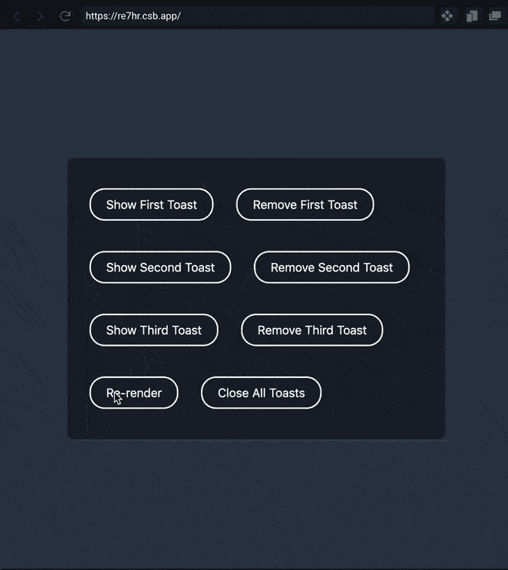

# 在 React - LogRocket 博客中实现动画祝酒

> 原文：<https://blog.logrocket.com/implementing-animated-toasts-in-react/>

toast 是一个 UI 元素，它以不中断的方式向用户提供消息。它们通常从屏幕底部弹出，过一会儿就消失了。

出于本文的目的，假设我们想要构建祝酒词，这样，在挂载时，它们会淡入屏幕的右下方。当我们添加另一个吐司时，前一个吐司应该会活跃起来，新的吐司在最后淡入。为此，我们将使用帧运动和反应门户。

我们还希望有一个功能，关闭所有的祝酒词在一起。为此，最好有一个专门负责祝酒的中央政府管理机构。我们将使用 Zustand。

它还能让我们做一些高级的事情，比如设置屏幕上可以显示多少祝酒词的限制，以及设置祝酒词应该消失的默认持续时间。然而，实现高级的东西留给读者作为练习。

这将是成品:



你可以在这个代码沙箱中玩[演示。](https://codesandbox.io/s/simple-toast-with-zustand-framer-motion-re7hr?file=/src/App.js:572-678)

## React toast 实现的结构

对于我们的动画祝酒词，我们将像制作图书馆一样对待它。该库可以有许多部分，但只有一部分向用户公开。我们将创建一个包含三个部分的`Toasts.js`文件:

1.  **我们的 Zustand 存储的一个钩子**:我们通过向它传递初始状态和更新方法来初始化一个 Zustand 存储。然后它返回一个[定制钩子](https://blog.logrocket.com/react-custom-hooks-and-the-death-of-render-props-a0ce5cba387f/)，我们将在`Toast`组件和`useToastControls`钩子中使用它。
2.  **`Toast`组件**:该组件从 Zustand 定制钩子中获取商店状态，并决定是否应该呈现 toast 内容。
3.  **`useToastControls`自定义挂钩**:我们不能让用户完全访问 Zustand 商店，所以我们将导出这个自定义挂钩。

## 我们烤面包的用法

在我们开始实现上述每一项之前，让我们看看它将如何被典型地使用:

```
import { Toast, useToastControls } from "./Toasts";
function App() {
 const { show, closeAll } = useToastControls();
 return (
   <div className="app">
     <button onClick={() => show('toast-first')}>Show Toast</button>
     <button onClick={closeAll}>Close all</button>
     <Toast uniqueId="toast-first" className="toast-blue">
       Hey! I'm a toast
     </Toast>
   </div>
 );
}

```

我们可以渲染任意数量的`Toast`组件，但是每个组件都应该有一个`uniqueId`道具。

我们还可以选择给 toast 一些类或内容来呈现在里面。`useToastsControl`定制钩子将会给我们类似于`show`、`close`和`closeAll`的方法。为了显示一个祝酒词，我们必须将这个祝酒词的`uniqueId`传递给`show`方法。

因为我们需要使用 React portals 来呈现 toast，所以我们需要一个已经存在于页面中的 DOM 节点。为此，我们将把`index.html`(在 CRA 应用程序中)改为:

```
 <div id="root"></div>
 <div id="toasts-portal"></div>

```

我们还将添加一些 CSS 来定位右下角的`#toasts-portal`容器。然后我们将把它做成一个 flexbox，这样烤面包片就可以堆叠在一起，中间留有空隙。

```
#toasts-portal {  
  position: absolute;
  bottom: 20px;
  right: 20px;
  display: flex;
  flex-direction: column;
  align-items: flex-end;
  gap: 30px;
}
```

## 实施时间！

现在我们知道了它将如何被使用，让我们继续实现`Toasts.js`文件的三个部分。

### 祖斯坦德商店

Zustand 是一个小型的(~700B)状态管理库。它的工作方式是我们用回调函数调用`create`方法。这个函数返回一个存储对象。我们可以在存储中保存各种状态，以及可以更新状态的方法。

然后，`create`方法返回一个定制钩子，在我们的例子中，我们将其命名为`useToastStore`。我们可以在任何 React 组件中调用这个自定义钩子来访问保存在 Zustand 存储中的状态和方法。

> **side note:**Zustand 的伟大之处在于，我们并不局限于一个商店，我们可以针对不同的使用情况创建多个商店。就像吐司一样，模态可以有自己的存储，API 缓存可以有不同的存储，用户会话管理也可以有不同的存储，等等。如果一个存储中的某些状态发生变化，则只有使用该存储的组件才会重新呈现，而无需任何额外的比较。

在`Toasts.js`中，Zustand 店是这样做的。请记住，它不是导出的:

```
const useToastStore = create((set, get) => ({
 toastList: new Set(),
 show(toastId) {
   const { toastList } = get();
   const newToastList = new Set(toastList);
   newToastList.add(toastId);
   set({
     toastList: newToastList
   });
 },
 close(toastId) {
   const { toastList } = get();
   const newToastList = new Set(toastList);
   newToastList.delete(toastId);
   set({
     toastList: newToastList
   });
 },
 closeAll() {
   const newToastList = new Set();
   set({
     toastList: newToastList
   });
 }
}));

```

回调函数返回一个状态名为`toastList`的对象和三个方法:`show`、`close`和`closeAll`。

`toastList`状态是一个 [`Set`对象](https://developer.mozilla.org/en-US/docs/Web/JavaScript/Reference/Global_Objects/Set)，我们将在其中存储当前显示在屏幕上的 toast IDs 列表。为什么我选择了`Set`？因为它确保了其中的每个 ID 都是唯一的。此外，我厌倦了对所有事情都使用数组。

然后，这些方法负责从`toastList`添加或删除 toast IDs。`show`方法接受一个`toastId`作为参数。它通过调用`get`方法获得`toastList`状态，然后用现有`toastList`的值创建一个新的`Set`实例。

之后，`toastId`被加到`newToastList`上。最后，我们使用`set`方法将`toastList`状态设置为`newToastList`。

`closeAll`方法只是将`toastList`设置为一个空的`Set`实例。我们需要在每个方法中创建一个新的`Set`实例的原因是，就像在 React 中一样，Zustand 中的状态更新需要是不可变的。

此外，如果您想知道这些`get`和`set`方法来自哪里，请检查回调函数的开头——它接收这些方法作为参数。

### `Toast`组件

`Toast`组件完成了大部分繁重的工作，所以我们将一步一步地实现它:

1.  访问商店并检查它是否应该呈现任何内容
2.  如果内容呈现，则制作动画
3.  声明一段时间后自动关闭的效果

#### 步骤 1:进入商店

在组件内部，我们称之为`useToastStore`定制钩子。默认情况下，它会返回存储中的所有内容。这意味着如果存储中有任何变化，那么`Toast`组件将重新呈现。

如果你有小商店，那么这不是一个问题。但是当它成为一个问题时，你可以这样做:

```
import shallow from "zustand/shallow";
export function Toast(props) {
 const { uniqueId, config = {}, className, children } = props;
 const { duration = 3500, role = "status" } = config;
 const { toastList, close } = useToastStore(
   (store) => ({
     toastList: store.toastList,
     close: store.close
   }),
   shallow
 );
 const isShown = toastList.has(uniqueId);
 return (); // will be expanded in the next step
}

```

因为我们只需要`toastList`状态和`close`方法，所以我们可以有选择地从商店中只挑选这两个。这是通过将一个选择器函数传递给`useToastStore`来完成的。选择器返回一个对象，所以我们也会告诉`useToastStore`对选择器返回的数据进行浅层比较。这与新的 Redux 挂钩的使用方式类似。

现在我们已经有了来自商店的`toastList`和来自`Toast`组件道具的`uniqueId`，我们可以用`toastList.has`方法检查`uniqueId`是否属于`toastList`。我们将它的结果存储在`isShown`变量中，我们将在下一步中使用它。

* * *

### 更多来自 LogRocket 的精彩文章:

* * *

#### 步骤 2:制作内容动画

我们需要在`"#toasts-portal"` DOM 节点中呈现 toast 的内容，以便它总是从屏幕底部进入。为此，我们将使用门户。

为了让输入动画工作，我们将使用来自 Framer Motion 的`motion`实用程序。当`isShown`为真时，`motion.div`组件将挂载，它将从`initial`属性中提供的值转换为`animate`属性的值。

但是当`isShown`变为 false 并且`motion.div`组件卸载时，我们也想要一个退出动画。为此，我们需要将所有东西包装在`AnimatePresence`组件中，并将一个惟一的键传递给`motion.div`组件。然后我们可以使用`exit`道具指定退出动画。注意`AnimatePresence`将保持安装状态，与`isShown`无关。

另一件有趣的事情是，我们将一个布局道具传递给了`motion.div`，这确保了一个祝酒词的向上移动也是动画的。除此之外，它只是一个简单的 div，包含类、相关的 ARIA 角色和子元素。

```
import { AnimatePresence, motion } from "framer-motion";
export function Toast(props) {
 // stuff from previous step
 return createPortal(
   <AnimatePresence>
     {isShown && (
       <motion.div
         key={uniqueId}
         layout
         initial={{ opacity: 0, y: 50, scale: 0.3 }}
         animate={{ opacity: 1, y: 0, scale: 1 }}
         exit={{ opacity: 0, y: 20, scale: 0.5 }}
         className={cn("toast", className)}
         role={role}
       >
         {children}
       </motion.div>
     )}
   </AnimatePresence>,
   document.querySelector("#toasts-portal")
 );
}

```

#### 步骤 3:声明关闭自身的效果

组件的最后一部分是声明一个关闭 toast 的效果。在给定的持续时间之后，我们调用 Zustand 商店的`close`方法，并将`uniqueId`道具作为其参数。

```
import { useEffect } from "react";
export function Toast(props) {
 const isShown = toastList.has(uniqueId);
 useEffect(() => {
   if (!duration || !isShown) {
     return;
   }
   const timeoutId = setTimeout(() => {
     close(uniqueId);
   }, duration);
   return () => {
     clearTimeout(timeoutId);
   };
 }, [uniqueId, isShown, duration, close]);
}

```

至此，我们已经完成了`Toast`组件的实现。下一部分是我添加的一点额外的东西，只是为了展示一个库如何隐藏内部实现细节。

### `useToastControls`定制挂钩

我们的 toast 实现封装了向用户显示消息的逻辑。好处是内部实现可以在不破坏任何用户代码的情况下改变。

在`Toasts.js`中，Zustand 商店是一个实现细节。它包含了`toastList`集合。如果用户获得了`toastList`的访问权限，他们可能会随心所欲地修改它，从而导致错误。因此，我们希望添加约束，这样用户可以调用`show`、`close`和`closeAll`方法，但不能直接修改`toastList`状态。

为此，我们定制了一个钩子来选择`show`、`close`和`closeAll` 方法并返回它们。现在我们可以导出这个定制钩子。

```
export function useToastControls() {
 const controls = useToastStore(
   (store) => ({
     show: store.show,
     close: store.close,
     closeAll: store.closeAll
   }),
   shallow
 );
 return controls;
}

```

## 结论

把所有东西放在一起，你可以看到我们完成的`Toasts.js`在这个[代码沙箱](https://codesandbox.io/s/simple-toast-with-zustand-framer-motion-re7hr?file=/src/Toasts.js:1005-1035)中是什么样子。

我希望你喜欢这篇文章，并且至少学到了一个新东西。您可以[在 Twitter](https://twitter.com/dev__adi) 上关注我，获取关于新文章的更新，并讨论各种 web 开发主题。

## [LogRocket](https://lp.logrocket.com/blg/react-signup-general) :全面了解您的生产 React 应用

调试 React 应用程序可能很困难，尤其是当用户遇到难以重现的问题时。如果您对监视和跟踪 Redux 状态、自动显示 JavaScript 错误以及跟踪缓慢的网络请求和组件加载时间感兴趣，

[try LogRocket](https://lp.logrocket.com/blg/react-signup-general)

.

[ ](https://lp.logrocket.com/blg/react-signup-general) [](https://lp.logrocket.com/blg/react-signup-general) 

LogRocket 结合了会话回放、产品分析和错误跟踪，使软件团队能够创建理想的 web 和移动产品体验。这对你来说意味着什么？

LogRocket 不是猜测错误发生的原因，也不是要求用户提供截图和日志转储，而是让您回放问题，就像它们发生在您自己的浏览器中一样，以快速了解哪里出错了。

不再有嘈杂的警报。智能错误跟踪允许您对问题进行分类，然后从中学习。获得有影响的用户问题的通知，而不是误报。警报越少，有用的信号越多。

LogRocket Redux 中间件包为您的用户会话增加了一层额外的可见性。LogRocket 记录 Redux 存储中的所有操作和状态。

现代化您调试 React 应用的方式— [开始免费监控](https://lp.logrocket.com/blg/react-signup-general)。