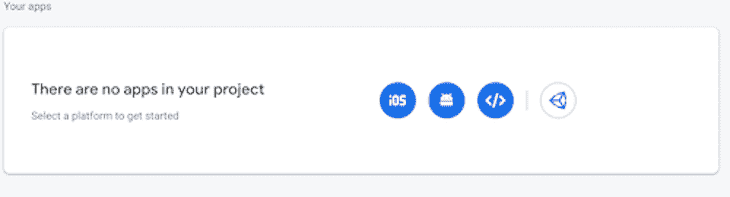
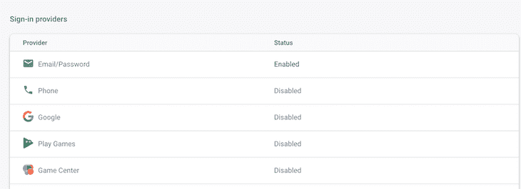

# 用 Firebase - LogRocket 博客在 Next.js 中实现认证

> 原文：<https://blog.logrocket.com/implementing-authentication-in-next-js-with-firebase/>

身份验证在当今的 web 应用程序中至关重要。这是许多开发人员过去不得不实现的一个特性。幸运的是，许多图书馆通过提供许多内置功能使这项工作变得更加容易。特别是，Firebase 是处理用户管理和认证的优秀工具。

在本教程中，我们将介绍如何使用 Firebase 实现身份验证。

## 什么是 Firebase？

[Firebase](https://firebase.google.com/) 于 2014 年被谷歌收购，是一个提供一系列产品的平台，包括但不限于:

*   实时数据库
*   证明
*   云消息传递

这些产品允许开发人员轻松快速地创建和运行应用程序。

## 创建 Firebase 帐户

在编写一行代码之前，您需要一个 Firebase 帐户。头[此处](https://firebase.google.com/)创建一个。

在 Firebase 中，如果您想要 API 密钥，您将需要创建应用程序。这些应用程序必须属于项目。因此，如果您还没有建立项目，您需要创建一个。一旦你这样做了，创建一个应用程序来获取你的钥匙。



iOS, Android, and web are some of the formats available.

现在，点击项目概述右侧的**设置图标**(在屏幕的左上方)。在**项目设置**和**常规**下，你应该看到你的应用及其配置。

在开始编写代码之前，您需要启用想要使用的登录方法。为此，点击**认证**，然后**登录方法**。每一个都有不同的配置，但是为了这个教程，我将把重点放在传统的电子邮件/密码方法上。



Enable your sign-in providers.

## 将本地环境添加到 Next.js

现在您已经有了自己的键，是时候将它们添加到您的 Next.js 项目中了。

提示:如果你还没有创建一个，不要着急。这个命令将使您开始:

```
npx create-next-app
# or
yarn create next-app

```

由于有了`.gitignore`文件，Next.js 项目会自动忽略`.env.local`,因此您可以复制/粘贴您的密钥，而不用担心它们会被意外提交到 GitHub。

```
NEXT_PUBLIC_FIREBASE_PUBLIC_API_KEY=<YOUR_API_KEY>
NEXT_PUBLIC_FIREBASE_AUTH_DOMAIN=<YOUR_DOMAIN>
NEXT_PUBLIC_FIREBASE_PROJECT_ID=<YOUR_PROJECT_ID>

```

不要忘记:在 Next.js 中，命名环境变量的惯例是它们必须以 NEXT_PUBLIC 开头。

## 安装 Firebase

继续安装 Firebase 库。

```
npm install --save Firebase
# or
yarn add Firebase

```

## 在 Next.js 中创建 Firebase 实例

太好了！安装了库并设置了 API 密钥。是时候使用这些键创建一个 Firebase 实例了。当然，Firebase 附带了许多有用的工具，但是出于本文的考虑，我们将只关注身份验证。因此，您只需要`Firebase/auth`和`apiKey`、`authDomain`和`projectId`凭证。

```
import Firebase from 'Firebase/app';
import 'Firebase/auth';

const FirebaseCredentials = {
  apiKey: process.env.NEXT_PUBLIC_FIREBASE_PUBLIC_API_KEY,
  authDomain: process.env.NEXT_PUBLIC_FIREBASE_AUTH_DOMAIN,
  projectId: process.env.NEXT_PUBLIC_FIREBASE_PROJECT_ID
}
// if a Firebase instance doesn't exist, create one
if (!Firebase.apps.length) {
  Firebase.initializeApp(FirebaseCredentials)
}

export default Firebase;

```

## 监听 Firebase 的变化

你首先需要的是一个可以在整个应用程序中访问的`authUser`。该变量不仅有助于用户管理，也有助于相应地重定向路由。

例如，如果`authUser`为空，意味着用户没有登录，当这个人试图访问一个受保护的路由(比如一个仪表板)时，您应该将他们重定向到登录页面。

幸运的是，`Firebase.auth`跟踪状态，并带有一个名为`onAuthStateChanged`的内置函数，允许您监听状态变化。

当状态改变时，根据您的需要格式化用户，最后，将其设置为您的`authUser`变量。使用`loading`变量来指示 Firebase 是否正在获取数据。

```
import { useState, useEffect } from 'react'
import Firebase from './Firebase';

const formatAuthUser = (user) => ({
  uid: user.uid,
  email: user.email
});

export default function useFirebaseAuth() {
  const [authUser, setAuthUser] = useState(null);
  const [loading, setLoading] = useState(true);

  const authStateChanged = async (authState) => {
    if (!authState) {
      setAuthUser(null)
      setLoading(false)
      return;
    }

    setLoading(true)
    var formattedUser = formatAuthUser(authState);
    setAuthUser(formattedUser);    
    setLoading(false);
  };

// listen for Firebase state change
  useEffect(() => {
    const unsubscribe = Firebase.auth().onAuthStateChanged(authStateChanged);
    return () => unsubscribe();
  }, []);

  return {
    authUser,
    loading
  };
}

```

## 创建用户上下文

要在整个应用程序中访问`authUser`和加载变量，您将使用上下文 API。

提示:不熟悉 React 上下文？不要犹豫去查看[官方文件](https://reactjs.org/docs/context.html)。

首先，用带有默认值的`createContext`创建上下文对象(`authUser`作为`null`，加载作为`true`)。然后，从`useFirebaseAuth`中获取实际的`authUser`和`loading`变量，并将其传递给提供者组件。

您还应该添加一个定制钩子，在本例中是`useAuth`，来访问当前的上下文值。

* * *

### 更多来自 LogRocket 的精彩文章:

* * *

```
import { createContext, useContext, Context } from 'react'
import useFirebaseAuth from '../lib/useFirebaseAuth';

const authUserContext = createContext({
  authUser: null,
  loading: true
});

export function AuthUserProvider({ children }) {
  const auth = useFirebaseAuth();
  return <authUserContext.Provider value={auth}>{children}</authUserContext.Provider>;
}
// custom hook to use the authUserContext and access authUser and loading
export const useAuth = () => useContext(authUserContext);

```

然后，在我们的`_app.js`中，将这个提供者包装到您的应用程序中。这确保了子组件能够访问您的用户上下文。

```
import { AuthUserProvider } from '../context/AuthUserContext';

function MyApp({ Component, pageProps }) {
  return <AuthUserProvider><Component {...pageProps} /></AuthUserProvider>
}

export default MyApp

```

## 创建受保护的路由

受保护的路径是应用程序的页面或部分，只应由特定用户访问。在这种情况下，只有登录的用户才能访问这些内容。要设置这个，从你的自定义`useAuth()`钩子中获取`authUser`和`loading`。

有了这些变量，检查 Firebase 是否还在获取数据(即，loading 是`true`)，如果不是，检查`authUser`是否是`null`。如果是这种情况，那么用户没有登录，您应该将他们重定向到登录页面。

在你的应用中测试它，并确保重定向正确发生。

```
import { useEffect } from 'react';
import { useRouter } from 'next/router';
import { useAuth } from '../context/AuthUserContext';

import {Container, Row, Col} from 'reactstrap';

const LoggedIn = () => {
  const { authUser, loading } = useAuth();
  const router = useRouter();

  // Listen for changes on loading and authUser, redirect if needed
  useEffect(() => {
    if (!loading && !authUser)
      router.push('/')
  }, [authUser, loading])

  return (
    //Your logged in page
  )
}

export default LoggedIn;

```

## 在 Next.js 中添加登录、注册和注销功能

现在，让我们进入有趣的部分。Firebase 的一个优点是，它带有许多用于登录、创建用户和注销的内置功能。

因此，让我们将它们添加到 useFirebaseAuth 函数中。使用`Firebase.auth()`进入不同的功能(`signInWithEmailAndPassword`、`createUserWithEmailAndPassword`和`signOut`):

```
export default function useFirebaseAuth() {
  // ...
  const clear = () => {
    setAuthUser(null);
    setLoading(true);
  };

  const signInWithEmailAndPassword = (email, password) =>
    Firebase.auth().signInWithEmailAndPassword(email, password);

  const createUserWithEmailAndPassword = (email, password) =>
    Firebase.auth().createUserWithEmailAndPassword(email, password);

  const signOut = () =>
    Firebase.auth().signOut().then(clear);

  useEffect(() => {
    const unsubscribe = Firebase.auth().onAuthStateChanged(authStateChanged);
    return () => unsubscribe();
  }, []);

  return {
    authUser,
    loading,
    signInWithEmailAndPassword,
    createUserWithEmailAndPassword,
    signOut
  };
}

```

不要忘记更新上下文文件中的默认值。

```
const authUserContext = createContext({
  authUser: null,
  loading: true,
  signInWithEmailAndPassword: async () => {},
  createUserWithEmailAndPassword: async () => {},
  signOut: async () => {}
});

export function AuthUserProvider({ children }) {
  const auth = useFirebaseAuth();
  return <authUserContext.Provider value={auth}>{children}</authUserContext.Provider>;
}

```

## 创建注册页面

在您的注册页面中，使用您的`useAuth hook`来检索您的函数，以便再次创建用户。`createUserWithEmailAndPassword`带两个参数:邮箱和密码。

完成表单验证后，调用该函数。如果它成功返回一个`authUser`，那么您可以相应地重定向用户。

```
import { useState } from 'react';
import { useRouter } from 'next/router';

import { useAuth } from '../context/AuthUserContext';

import {Container, Row, Col, Button, Form, FormGroup, Label, Input, Alert} from 'reactstrap';

const SignUp = () => {
  const [email, setEmail] = useState("");
  const [passwordOne, setPasswordOne] = useState("");
  const [passwordTwo, setPasswordTwo] = useState("");
  const router = useRouter();
  const [error, setError] = useState(null);

  const { createUserWithEmailAndPassword } = useAuth();

  const onSubmit = event => {
    setError(null)
    //check if passwords match. If they do, create user in Firebase
    // and redirect to your logged in page.
    if(passwordOne === passwordTwo)
      createUserWithEmailAndPassword(email, passwordOne)
      .then(authUser => {
        console.log("Success. The user is created in Firebase")
        router.push("/logged_in");
      })
      .catch(error => {
        // An error occurred. Set error message to be displayed to user
        setError(error.message)
      });
    else
      setError("Password do not match")
    event.preventDefault();
  };

  return (
    <Container className="text-center custom-container">
      <Row>
        <Col>
          <Form 
            className="custom-form"
            onSubmit={onSubmit}>
          { error && <Alert color="danger">{error}</Alert>}
            <FormGroup row>
              <Label for="signUpEmail" sm={4}>Email</Label>
              <Col sm={8}>
                <Input
                  type="email"
                  value={email}
                  onChange={(event) => setEmail(event.target.value)}
                  name="email"
                  id="signUpEmail"
                  placeholder="Email" />
              </Col>
            </FormGroup>
            <FormGroup row>
              <Label for="signUpPassword" sm={4}>Password</Label>
              <Col sm={8}>
                <Input
                  type="password"
                  name="passwordOne"
                  value={passwordOne}
                  onChange={(event) => setPasswordOne(event.target.value)}
                  id="signUpPassword"
                  placeholder="Password" />
              </Col>
            </FormGroup>
            <FormGroup row>
              <Label for="signUpPassword2" sm={4}>Confirm Password</Label>
              <Col sm={8}>
                <Input
                  type="password"
                  name="password"
                  value={passwordTwo}
                  onChange={(event) => setPasswordTwo(event.target.value)}
                  id="signUpPassword2"
                  placeholder="Password" />
              </Col>
            </FormGroup>
            <FormGroup row>
             <Col>
               <Button>Sign Up</Button>
             </Col>
           </FormGroup>
          </Form>
        </Col>
      </Row>
    </Container>
  )
}

export default SignUp;

```

## 添加注销按钮

注销也很简单。从`useAuth()`中抓取`signOut()`函数，并将其添加到按钮或链接中。

```
import { useEffect } from 'react';
import { useRouter } from 'next/router';
import { useAuth } from '../context/AuthUserContext';

import {Container, Row, Col, Button} from 'reactstrap';

const LoggedIn = () => {
  const { authUser, loading, signOut } = useAuth();
  const router = useRouter();

  // Listen for changes on loading and authUser, redirect if needed
  useEffect(() => {
    if (!loading && !authUser)
      router.push('/')
  }, [authUser, loading])

  return (
    <Container>
      // ...
      <Button onClick={signOut}>Sign out</Button>
      // ...
    </Container>
  )
}

export default LoggedIn;

```

## 创建登录页面

最后，登录功能！和前面两个一模一样。从`useAuth()`中检索`signInWithEmailAndPassword()`，并传入用户的电子邮件和密码。如果正确，则重定向用户，如果不正确，则显示正确的错误消息。

```
import { useState } from 'react';
import Link from 'next/link';
import { useRouter } from 'next/router';

import { useAuth } from '../context/AuthUserContext';

import {Container, Row, Col, Button, Form, FormGroup, Label, Input, Alert} from 'reactstrap';

export default function Home() {
  const [email, setEmail] = useState("");
  const [password, setPassword] = useState("");
  const [error, setError] = useState(null);
  const router = useRouter();
  const { signInWithEmailAndPassword } = useAuth();

  const onSubmit = event => {
    setError(null)
    signInWithEmailAndPassword(email, password)
    .then(authUser => {
      router.push('/logged_in');
    })
    .catch(error => {
      setError(error.message)
    });
    event.preventDefault();
  };

  return (
    <Container className="text-center" style={{ padding: '40px 0px'}}>
      <Row>
        <Col>
          <h2>Login</h2>
        </Col>
      </Row>
      <Row style={{maxWidth: '400px', margin: 'auto'}}>
        <Col>
          <Form onSubmit={onSubmit}>
          { error && <Alert color="danger">{error}</Alert>}
            <FormGroup row>
              <Label for="loginEmail" sm={4}>Email</Label>
              <Col sm={8}>
                <Input
                  type="email"
                  value={email}
                  onChange={(event) => setEmail(event.target.value)}
                  name="email"
                  id="loginEmail"
                  placeholder="Email" />
              </Col>
            </FormGroup>
            <FormGroup row>
              <Label for="loginPassword" sm={4}>Password</Label>
              <Col sm={8}>
                <Input
                  type="password"
                  name="password"
                  value={password}
                  onChange={(event) => setPassword(event.target.value)}
                  id="loginPassword"
                  placeholder="Password" />
              </Col>
            </FormGroup>
            <FormGroup row>
             <Col>
               <Button>Login</Button>
             </Col>
           </FormGroup>
           <FormGroup row>
            <Col>
              No account? <Link href="/sign_up">Create one</Link>
            </Col>
          </FormGroup>
          </Form>
        </Col>
      </Row>
    </Container>
  )
}

```

## 结论

在本教程中，我们介绍了如何创建 Firebase 帐户、项目和应用程序。然后，我们学习了如何使用 React 上下文来创建用户上下文。在这个上下文中，我们添加了用户和加载变量以及登录、注册和注销功能。最后，多亏了 Firebase，我们使用这些函数在 Next.js 应用程序中实现了身份验证。

本教程的完整代码可以在 GitHub 上找到。

## [LogRocket](https://lp.logrocket.com/blg/nextjs-signup) :全面了解生产 Next.js 应用

调试下一个应用程序可能会很困难，尤其是当用户遇到难以重现的问题时。如果您对监视和跟踪状态、自动显示 JavaScript 错误、跟踪缓慢的网络请求和组件加载时间感兴趣，

[try LogRocket](https://lp.logrocket.com/blg/nextjs-signup)

.

[](https://lp.logrocket.com/blg/nextjs-signup)[](https://lp.logrocket.com/blg/nextjs-signup)

LogRocket 就像是网络和移动应用的 DVR，记录下你的 Next.js 应用上发生的一切。您可以汇总并报告问题发生时应用程序的状态，而不是猜测问题发生的原因。LogRocket 还可以监控应用程序的性能，报告客户端 CPU 负载、客户端内存使用等指标。

LogRocket Redux 中间件包为您的用户会话增加了一层额外的可见性。LogRocket 记录 Redux 存储中的所有操作和状态。

让您调试 Next.js 应用的方式现代化— [开始免费监控](https://lp.logrocket.com/blg/nextjs-signup)。