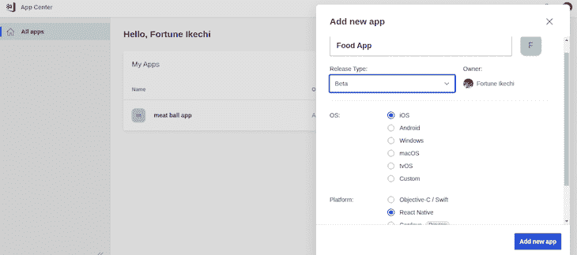
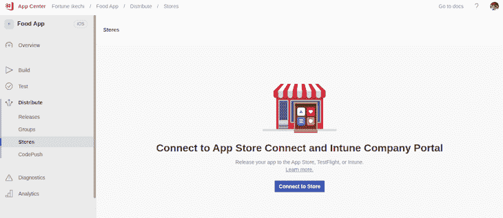
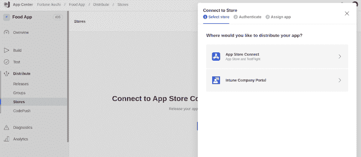
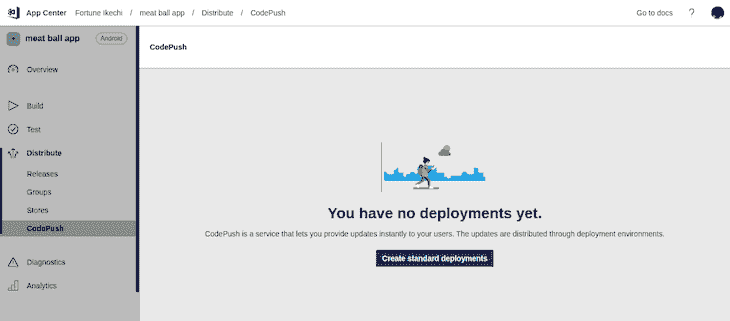
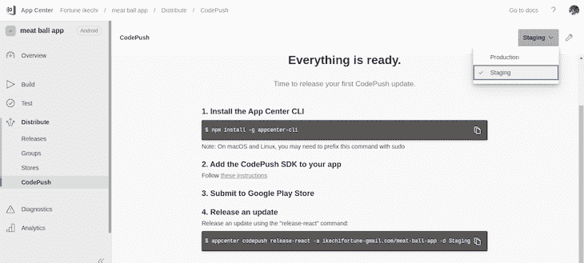
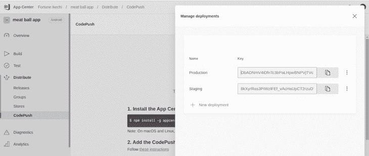

# 在 React Native 中实现 CodePush

> 原文：<https://blog.logrocket.com/implementing-codepush-react-native/>

实时和热重新加载是 React Native 的两个显著特性。然而，移动开发者表达了在生产中直接向最终用户推送更新的愿望，这将是在 Google Play 商店和 iOS 应用商店更新应用程序的更快、更有效的替代方法。

在本教程中，我们将使用 [react-native-code-push](https://github.com/microsoft/react-native-code-push) ，一个用于 CodePush 的 react 本机模块，来直接为用户部署应用更新。我们将提供一步一步的指导来开始，甚至进行详细的演示。首先，让我们了解一下什么是 CodePush，它的好处是什么。

## 什么是代码推送？

在移动应用程序中，修复 bug 会破坏整个应用程序。一旦应用程序发布，任何代码更新都必须重新编译，并在推送给用户之前由移动应用商店审查。

由微软 AppCenter 管理的云服务 CodePush ，允许开发者即时向最终用户部署移动更新。CodePush 会将 JavaScript 代码与发布到 CodePush 服务器的任何更新进行同步，这意味着您不必在任一应用商店中更新您的应用。

在新更新的情况下，Codepush 提供回滚，并且它包括许多设备和平台的测试配置。

## 设置代码推送

要将 CodePush 添加到应用程序，该应用程序必须已经部署到移动商店。对于本教程，您可以遵循我下面的示例，或者在您现有的应用程序中实现 CodePush。我们将从在 AppCenter 上创建一个标准部署开始。

如果您还没有，请在 [AppCenter](https://appcenter.ms/apps) 上创建一个帐户。创建一个新应用程序并选择**添加新应用程序**按钮。您应该会看到以下页面:



我们为我们的应用程序添加了一个名称，肉丸应用程序。然后，我们从生产、测试和存储中选择我们的发布类型。接下来，选择您正在开发的操作系统和平台。添加完这些细节后，您可以选择**创建新应用**按钮。

### 配置选项

有三个不同的选项来为不同的平台配置应用程序。

首先，构建频率可以让您在分支发生变化时自动运行不同平台的构建。分发版本允许您将应用程序分发到移动应用程序商店。检查 AppCenter 仪表板的**分发**部分以启用此功能。最后，您可以将构建脚本添加到您的`package.json`中，运行后克隆、预构建和后构建，并表示应用程序开发的各个阶段。

### 分发选项

要在 iOS 应用商店或 Android Google Play 商店分发 React 原生应用程序，您首先需要连接您的应用程序。导航到 AppCenter 仪表盘的 **Distribute** 部分，点击**商店、**并将您的应用程序连接到商店:



若要在 iOS 上启动您的应用程序，您需要注册 Apple developer:



## 创建标准部署

现在我们已经设置和配置了 CodePush，从您的应用程序仪表板导航到 CodePush，然后单击**创建标准部署:**



在 AppCenter 仪表板的右上角，选择 **Staging** 作为您的应用程序环境:



选择应用环境后，点击仪表盘右侧的**设置**图标，显示应用的私钥:



现在我们已经建立了标准部署，让我们使用 react-native-code-push 将 CodePush 集成到 React 本机应用程序中。

## 将 CodePush 集成到 React Native 中

首先，我们将使用下面的命令之一安装 react-native-code-push

纱线:

```
yarn add react-native-code-push

```

npm:

```
npm i --save react-native-code-push

```

集成 CodePush 对于 iOS 和 Android 是不同的。让我们仔细看看。

### iOS 设置

要将 CodePush 插件添加到一个本地 iOS 项目中，首先，使用下面的命令安装 pod:

```
cd ios
pod install 
cd ..

```

接下来，我们将安装 cocoa pods 依赖项。导航到您的`AppDelegate.m`文件并将代码推送头导入到您的文件中:

```
import <CodePush/CodePush.h>

```

### Android 设置

要在原生 Android 项目中集成 react-native-code-push，请导航到 Android 文件夹中的`settings.gradle`文件，并添加以下代码块:

```
include ':app', ':react-native-code-push'
project(':react-native-code-push').projectDir = new File(rootProject.projectDir, '../node_modules/react-native-code-push/android/app')

```

接下来，我们将把新导入的`codepush.gradle`文件作为构建任务添加到我们的`react.gradle`文件中:

```
apply from: "../../node_modules/react-native/react.gradle"
apply from: "../../node_modules/react-native-code-push/android/codepush.gradle"

```

在上面的代码片段中，我们将 CodePush 应用于 React 原生 Android Gradle，从应用程序的节点模块导入它。

接下来，我们将更新我们的`MainApplication.java`文件，在我们的应用程序中包含 CodePush:

```
import com.microsoft.codepush.react.CodePush;

public class MainApplication extends Application implements ReactApplication {
    private final ReactNativeHost mReactNativeHost = new ReactNativeHost(this) {
        @Override
        protected String getJSBundleFile() {
            return CodePush.getJSBundleFile();
        }
    };
}

```

首先，我们从包列表中将 CodePush 插件类导入到我们的应用程序中。接下来，我们为 CodePush 创建了一个覆盖，以确定应用程序启动时 JavaScript 包应该呈现在哪里。

## 正在 React Native 中初始化代码推送

为了初始化 CodePush，我们将用 CodePush 提供的高阶组件包装我们的根组件。我们还将添加一些代码推送选项，比如向用户显示实时更新的标题标签:

```
import CodePush from 'react-native-code-push';

let CodePushOptions = {
  checkFrequency: CodePush.CheckFrequency.ON_APP_RESUME,
  mandatoryInstallMode: CodePush.InstallMode.IMMEDIATE,
  updateDialog: {
    appendReleaseDescription: true,
    title: "a new update is available!
}

class MeatBallApp extends Component {
    ...
}

export default CodePush(CodePushOptions)(meatBallApp);  

```

在上面的代码块中，我们从包中导入了`CodePush`，然后为我们的应用程序列出了几个选项。首先，`checkFrequency`定义了我们希望应用程序检查新更新的时间。在我们的例子中，我们将它设置为`ON_APP_START`，然而，还有[其他选项可用](https://docs.microsoft.com/en-gb/appcenter/distribution/codepush/rn-api-ref#installmode)。`mandatoryInstallMode`定义我们希望安装强制更新的时间。在我们的申请中，我们把它标为`ON_APP_START.`

`updateDialog`确定当更新可用时，是否向用户呈现确认文本或屏幕，以及呈现何种文本或对象。如果设置为`true`，我们将在 Android 和 iOS 上呈现默认的更新字符串。最后，我们使用`updateDialog: title`和一个`string` 类型的`title`来给一个 `updateDialog` 添加标题。

根据您的应用程序的性质，您可能还想添加更多的选项，比如`minimumBackgroundDuration`，它用于设置应用程序在重新启动之前应该在后台运行的最短时间(以秒为单位)。

## 使用代码推送部署应用更新

要使用 CodePush 发布 React 本地应用程序的更新，首先，我们需要安装 [App Center CLI](https://github.com/microsoft/appcenter-cli) 包:

纱线:

```
yarn global add appcenter-cli

```

npm:

```
npm install -g appcenter-cli

```

一旦我们安装了 App Center CLI 软件包，我们将使用以下命令登录到我们的 App Center:

```
appcenter login

```

现在，我们可以使用以下格式通过 CodePush 发布应用程序的更新:

```
appcenter CodePush release-react -a {user}/{app name} -d {environment}

```

为了向我们的应用程序推送更新，我们将使用下面的代码:

```
appcenter CodePush release-react -a Fortune-Ikechi/MeatBallApp -d Production

```

在 React 本机应用程序上使用 CodePush 推送更新的另一种方法是使用以下格式将命令作为脚本添加到我们的应用程序的`package.json`上:

```
"scripts: {
  "CodePush:ios": "appcenter CodePush release-react -a Fortune-Ikechi/MeatBallApp -d Production",
  "CodePush:android": "appcenter CodePush release-react -a Fortune-Ikechi/MeatBallApp-Android -d Production"
}

```

添加更新后，请重新加载 AppCenter 仪表板以确保您的版本已发布。当您重新运行应用程序时，您应该能够下载应用程序的最新版本。

## 结论

现在，您知道如何将 CodePush 添加到 React 本机应用程序中了！react-native-code-push 模块允许您直接向最终用户部署应用更新，而不是通过移动商店。我们创建了标准部署，为 iOS 和 Android 应用程序设置了 react-native-code-push，最后，部署了我们的更新。

你可以在[代码推送文档](https://github.com/microsoft/react-native-code-push#releasing-updates)和[微软应用中心文档](https://microsoft.github.io/code-push/)中了解更多信息。我希望你喜欢这个教程！

## [LogRocket](https://lp.logrocket.com/blg/react-native-signup) :即时重现 React 原生应用中的问题。

[](https://lp.logrocket.com/blg/react-native-signup)

[LogRocket](https://lp.logrocket.com/blg/react-native-signup) 是一款 React 原生监控解决方案，可帮助您即时重现问题、确定 bug 的优先级并了解 React 原生应用的性能。

LogRocket 还可以向你展示用户是如何与你的应用程序互动的，从而帮助你提高转化率和产品使用率。LogRocket 的产品分析功能揭示了用户不完成特定流程或不采用新功能的原因。

开始主动监控您的 React 原生应用— [免费试用 LogRocket】。](https://lp.logrocket.com/blg/react-native-signup)