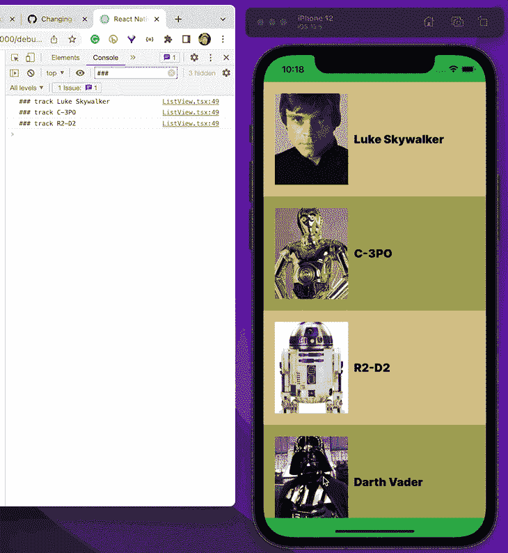
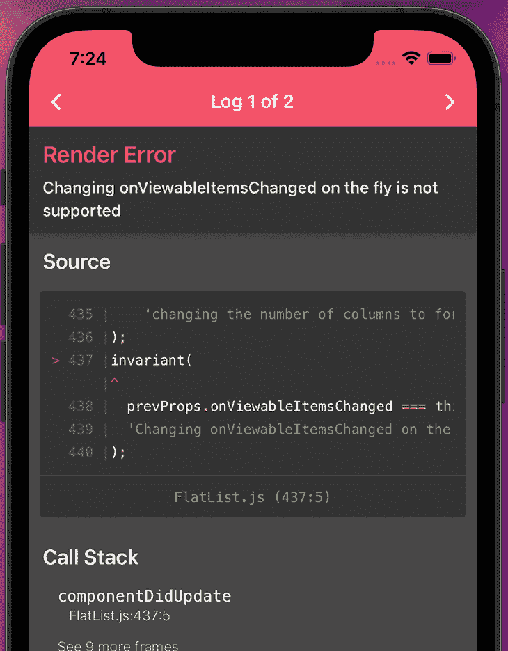
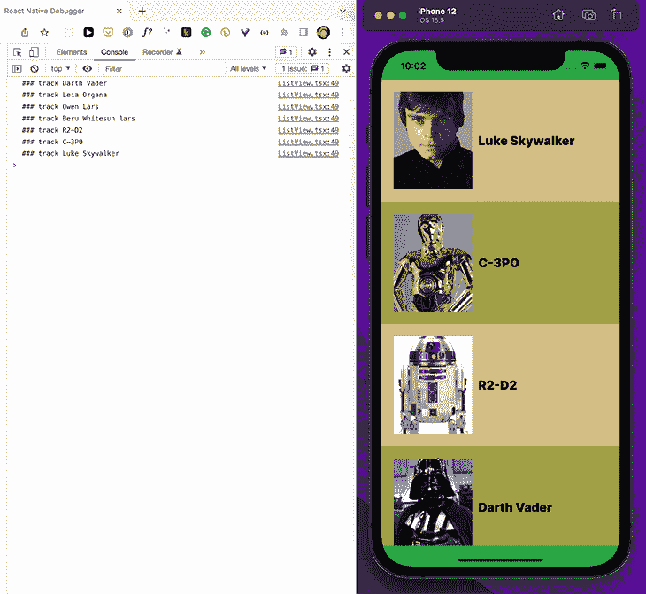
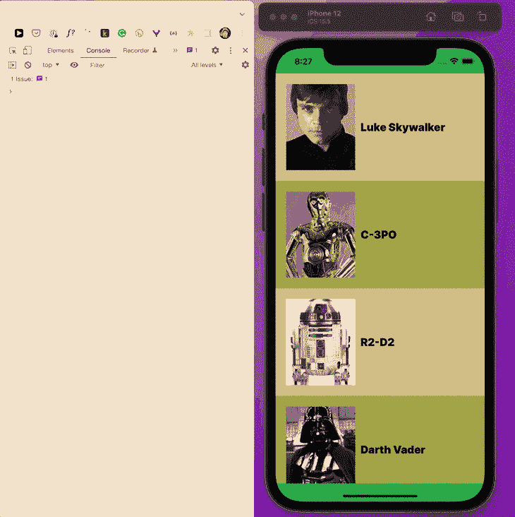

# 用 React Native 实现组件可见性传感器

> 原文：<https://blog.logrocket.com/implementing-component-visibility-sensor-react-native/>

这篇文章是关于如何在 React 本地应用程序中实现组件的可见性传感器。在垂直或水平`[FlatList](https://reactnative.dev/docs/flatlist)`及其[道具](https://reactnative.dev/docs/flatlist#onviewableitemschanged)的帮助下，无论何时列表项在视窗中出现或消失，都可以观察事件。使用这个概念，您可以对这些事件做出反应，例如，开始自动播放视频或出于营销目的跟踪“组件可见事件”。

在本帖中，我们将讨论如何使用一个示例项目在 React Native 中实现组件可见性传感器，并通过以下部分逐步构建解决方案:

每个“临时解决方案”都包含对解决方案不完整的原因的解释(即，由于 React 本机渲染错误，正如您将看到的)。我想解释事物不工作的不同原因；在我们的`FlatList`回调的限制(必须是稳定的)和这些如何反应记忆挂钩(`useCallback`、`useEffect`等)之间存在相互作用。)工作。

## 示例项目的范围

本文给出的代码示例是 GitHub 伙伴项目的一部分。这是一个使用打字稿的[世博项目](https://expo.dev/)，用 [create-expo-app](https://docs.expo.dev/get-started/create-a-new-app/) 搭建。

演示用例有意保持简单，只关注使用`FlatList` API。它显示《星球大战》中的角色，并追踪那些出现在屏幕上的角色至少两秒钟。如果它们出现多次，将只被跟踪一次。因此，示例应用程序并没有在可见性事件上展示花哨的动画，因为这超出了范围。

相比之下，当`FlatList`触发可见性变化事件时调用的逻辑只是一个跟踪功能，以保持简单。这与在常见的业务应用程序中跟踪用户事件是一致的。

下面的截屏展示了示例应用程序。



## 看一看`FlatList`的 API

在我深入到示例项目的实现细节之前，让我们看一下实现列表项可见性检测器的关键 [`FlatList`道具](https://github.com/facebook/react-native/blob/main/Libraries/Lists/FlatList.js)。

原则上，你必须使用两个`FlatList`道具:

通过`viewabilityConfig`，你可以决定“可视”对你的应用意味着什么。我最常用的配置是检测在最短时间(`y`毫秒)内至少有`x`个百分比可见的列表项。

```
viewabilityConfig={{
  itemVisiblePercentThreshold: 75,
  minimumViewTime: 2000,
}}

```

在这个示例配置中，当列表项在至少`2`秒内至少有`75`个百分比在视口内时，它们被认为是可见的。

看看 [`ViewabilityHelper`](https://github.com/facebook/react-native/blob/main/Libraries/Lists/ViewabilityHelper.js#L34) 的`ViewabilityConfig`部分，找出其他有效的设置，以及它们的类型定义。

您需要另一个`FlatList`属性`onViewableItemsChanged`，根据我们的`viewabilityConfig`类型定义的设置，每当列表项的可见性改变时，就会调用这个属性。

```
// ...
  <FlatList
      data={listItems}
      renderItem={renderItem}
      onViewableItemsChanged={info => {
        // access info and do sth with viewable items
      })}
      viewabilityConfig={{
        itemVisiblePercentThreshold: 100,
        minimumViewTime: 2000,
      }}
      // ...
  />
  // ...

```

让我们仔细看看 [`onViewabilityItemsChanged`](https://github.com/facebook/react-native/blob/main/Libraries/Lists/VirtualizedList.js) 的签名，定义在`VirtualizedList`中，是`FlatList`内部使用的。`info`参数有以下[流程类型定义](https://github.com/facebook/react-native/blob/main/Libraries/Lists/VirtualizedList.js#L247):

```
// flow definition part of VirtualizedList.js

onViewableItemsChanged?: ?(info: {
    viewableItems: Array<ViewToken>,
    changed: Array<ViewToken>,
    ...
  }) => void

```

一个 [`ViewToken`对象](https://github.com/facebook/react-native/blob/main/Libraries/Lists/ViewabilityHelper.js#L15)保存了关于列表项可见性状态的信息。

```
// flow definition part of ViewabilityHelper.js

type ViewToken = {
  item: any,
  key: string,
  index: ?number,
  isViewable: boolean,
  section?: any,
  ...
};

```

我们如何利用这一点？让我们看看下一个 TypeScript 片段。

```
const onViewableItemsChanged = (info: { viewableItems: ViewToken[]; changed: ViewToken[] }): void => {      
      const visibleItems = info.changed.filter((entry) => entry.isViewable);
      visibleItems.forEach((visible) => console.log(visible.item));
  }  

```

在这个例子中，我们只对可以用`info.changed`访问的已更改的`ViewToken`感兴趣。这里，我们想要记录符合`viewabilityConfig`标准的列表项。从`ViewToken`定义中可以看出，实际的列表项存储在`item`中。

### `viewableItems`和`changed`有什么区别？

在`viewabilityConfig`调用`onViewableItemsChanged`后，`viewableItems`存储每一个符合我们`viewabilityConfig`标准的列表项。然而，`changed`只保存最后一次`onViewableItemsChanged`调用的增量(即最后一次迭代)。

如果你必须对 200 毫秒内可见的列表项和 500 毫秒内可见的列表项做不同的事情，你可以使用`FlatList`的 [`viewabilityConfigCallbackPairs` prop](https://reactnative.dev/docs/flatlist#viewabilityconfigcallbackpairs) ，它接受一个`ViewabilityConfigCallbackPair`对象的数组。

这是`viewabilityConfigCallbackPairs`的流类型定义，是 [`VirtualizedList`](https://github.com/facebook/react-native/blob/main/Libraries/Lists/VirtualizedList.js#L290) 的一部分。

```
// VirtualizedList.js

  viewabilityConfigCallbackPairs?: Array<ViewabilityConfigCallbackPair>

```

`ViewabilityConfigCallbackPair`的流类型定义是 [`ViewabilityHelper`](https://github.com/facebook/react-native/blob/main/Libraries/Lists/ViewabilityHelper.js#L24) 的一部分。

```
// ViewabilityHelper.js
export type ViewabilityConfigCallbackPair = {
  viewabilityConfig: ViewabilityConfig,
  onViewableItemsChanged: (info: {
    viewableItems: Array<ViewToken>,
    changed: Array<ViewToken>,
    ...
  }) => void,
  ...
};

```

这里有一个例子:

```
<FlatList
    data={listItems}
    renderItem={renderItem}
    viewabilityConfigCallbackPairs={[
      {
        viewabilityConfig: {
          minimumViewTime: 200,
          itemVisiblePercentThreshold: 100,
        },
        onViewableItemsChanged: onViewableItemsChanged100
      },
      {
        viewabilityConfig: {
          minimumViewTime: 500,
          itemVisiblePercentThreshold: 75
        },
        onViewableItemsChanged: onViewableItemsChanged75
      }
    ]}
    // ...
/>

```

如果你对列表项检测算法的实现细节感兴趣，可以[在这里](https://suelan.github.io/2020/01/21/onViewableItemsChanged/#How-does-onViewableItemsChanged-works)了解一下。

## `FlatList`的 API 蒸馏(`onViewableItemsChanged`，`viewabilityConfig`)

根据我们目前对相关 API 部分的了解，创建一个可见性传感器似乎很简单。然而，传递给`onViewableItemsChanged` prop 的函数的实现涉及到一些陷阱。

因此，我将把不同的版本作为例子，直到我们得到最终的解决方案。由于`FlatList` API 的实现方式和 React 的工作方式，每个中间解决方案都有缺陷。

我们将讨论两种不同的用例。第一个是一个简单的例子，每当一个列表元素出现在屏幕上时触发一个事件。第二个到第四个更复杂的例子是在彼此的基础上构建的，用来演示当一个列表项在视图中时如何触发事件，但是只触发一次。

我们正在讨论第二个用例，因为它需要管理状态，这也是这个`FlatList`呈现错误的丑陋之处。

以下是我们将尝试的解决方案，以及每种方案的缺点:

1.  跟踪每一次*星球大战*人物(即列表元素)出现在屏幕上
2.  通过引入状态，每个字符只跟踪一次
3.  尝试修复导致陈旧闭包问题的`useCallback`解决方案(参见配套项目[分支陈旧闭包](https://github.com/doppelmutzi/companion-project-rn-visibility-sensor/tree/stale-closure)
4.  通过使用状态更新函数访问先前的状态来解决问题(参见配套项目[分支主管](https://github.com/doppelmutzi/companion-project-rn-visibility-sensor/tree/master)

## 临时解决方案 1:每次列表元素出现在屏幕上时进行跟踪

这个`onViewableItemsChanged`的第一个实现跟踪每一个可见的项目，无论它何时出现在屏幕上。

```
const trackItem = (item: StarWarsCharacter) =>
    console.log("### track " + item.name);
const onViewableItemsChanged =
  (info: { changed: ViewToken[] }): void => {
    const visibleItems = info.changed.filter((entry) => entry.isViewable);
    visibleItems.forEach((visible) => {
      trackItem(visible.item);
    });
  };

```

我们使用传递给函数的`info`参数的`changed`对象。我们遍历这个`ViewToken`数组，只将当前在屏幕上可见的列表项存储在`visibleItems`变量中。然后，我们只需调用简化的`trackItem`函数，通过将列表项的名称打印到控制台来模拟跟踪调用。

这应该可以，对吧？不幸的是，没有。我们得到一个渲染错误。



`FlatList` [的实现不允许传递给`onViewableItemsChanged`属性的函数的](https://github.com/facebook/react-native/issues/30171)在应用程序的生命周期中被重新创建。

为了解决这个问题，我们必须确保函数在最初创建后不会改变；它需要在渲染周期中保持稳定。

我们如何做到这一点？我们可以使用 [`useCallback`挂钩](https://reactjs.org/docs/hooks-reference.html#usecallback)。

```
const onViewableItemsChanged = useCallback(
    (info: { changed: ViewToken[] }): void => {
      const visibleItems = info.changed.filter((entry) => entry.isViewable);
      visibleItems.forEach((visible) => {
        trackItem(visible.item);
      });
    },
    []
  );

```

有了`useCallback`,我们的函数被记忆，并且不会被重新创建，因为没有可以改变的依赖关系。渲染问题消失，跟踪按预期工作。



## 临时解决方案 2:通过引入状态只跟踪一次列表元素

接下来，我们想跟踪每个星球大战角色一次。因此，我们可以引入一个反应状态`alreadySeen`，来跟踪用户已经看到的字符。

如您所见，`useState`钩子存储了一个`SeenItem`数组。传递给`onViewableItemsChanged`的函数被包装到一个`useCallback`钩子中，并带有一个依赖项`alreadySeen`。这是因为我们使用这个状态变量来计算传递给`setAlreadySeen`的下一个状态。

```
// TypeScript definitions
interface StarWarsCharacter {
  name: string;
  picture: string;
}
type SeenItem = {
  [key: string]: StarWarsCharacter;
};
interface ListViewProps {
  characters: StarWarsCharacter[];
}
export function ListView({
  characters,
}: ListViewProps) {
const [alreadySeen, setAlreadySeen] = useState<SeenItem[]>([]);
const onViewableItemsChanged = useCallback(
    (info: { changed: ViewToken[] }): void => {
      const visibleItems = info.changed.filter((entry) => entry.isViewable);
      // perform side effect
      visibleItems.forEach((visible) => {
        const exists = alreadySeen.find((prev) => visible.item.name in prev);
        if (!exists) trackItem(visible.item);
      });
      // calculate new state
      setAlreadySeen([
        ...alreadySeen,
        ...visibleItems.map((visible) => ({
          [visible.item.name]: visible.item,
        })),
      ]);
    },
    [alreadySeen]
  );
  // return JSX
}

```

同样，我们有一个问题。由于依赖关系`alreadySeen`，函数被创建了不止一次，因此，我们再次为我们的渲染错误感到高兴。

我们*可以*通过用 ESLint `ignore`注释省略依赖性来消除渲染错误。

```
const onViewableItemsChanged = useCallback(
    (info: { changed: ViewToken[] }): void => {
        // ...
    },
    // bad fix
    // eslint-disable-next-line react-hooks/exhaustive-deps
    []
  );

```

但是，正如我在关于`useEffect`钩子的文章中指出的，你永远不应该省略钩子内部使用的依赖。ESLint react-hooks 插件告诉你缺少依赖是有原因的。

在我们的例子中，我们得到了一个[陈旧闭包](https://dmitripavlutin.com/react-hooks-stale-closures/)问题，我们的`alreadySeen`状态变量不再更新。该值仍然是初始值，是一个空数组。



但是如果我们按照 ESLint 插件告诉我们的去做，我们又会遇到烦人的渲染错误。我们走进了死胡同。

不知何故，由于`FlatList`实现的限制，我们需要找到一个具有空依赖数组的解决方案。

## 临时解决方案 3:尝试修复陈旧的闭包问题，并返回到一个空的依赖数组

我们如何回到一个空的依赖数组？我们可以使用 state updater 函数，它可以接受一个带有前一状态的函数作为参数。你可以在我的关于`useState`和`useRef`的区别的[日志文章](https://blog.logrocket.com/usestate-vs-useref/)中找到更多关于状态更新函数的信息。

```
  const onViewableItemsChanged = useCallback(
    (info: { changed: ViewToken[] }): void => {
      const visibleItems = info.changed.filter((entry) => entry.isViewable);
      setAlreadySeen((prevState: SeenItem[]) => {
        // perform side effect
        visibleItems.forEach((visible) => {
          const exists = prevState.find((prev) => visible.item.name in prev);
          if (!exists) trackItem(visible.item);
        });
        // calculate new state
        return [
          ...prevState,
          ...visibleItems.map((visible) => ({
            [visible.item.name]: visible.item,
          })),
        ];
      });
    },
    []
  );

```

它们之间的主要区别是状态更新函数可以访问以前的状态，因此，我们不必直接访问状态变量`alreadySeen`。这样，我们就有了一个空的依赖数组，函数就像预期的那样工作(参见上一节中关于配套项目的截屏)。

下一节将进一步讨论呈现错误和陈旧闭包问题。

## 用`onViewableItemsChanged`仔细看看这个问题

React 的记忆挂钩，比如`useEffect`和`useCallback`，是以这样一种方式构建的，即每个组件上下文变量都被添加到依赖数组中。这样做的原因是，只有当这些依赖关系中至少有一个相对于上次运行发生了变化时，才会调用挂钩。

为了帮助你完成这个麻烦且容易出错的任务，React 团队已经构建了一个 ESLint 插件。然而，即使你知道依赖关系在运行时不会再改变，作为一个好的开发人员，你也必须将它添加到依赖数组中。插件作者知道，例如，状态更新器函数是稳定的，所以插件在数组中不需要它，这与其他(非纯)函数不同。

如果您从自定义钩子返回这样一个状态更新函数，并在 React 组件中使用它，插件会错误地声明将它添加为依赖项。在这种情况下，您必须添加一个 ESLint `disable`注释来屏蔽插件(或者接受警告)。

然而，这是不好的做法。尽管将它添加到依赖数组应该不成问题，但是钩子的使用变得更加健壮，因为这个变量可能会随着时间而改变，例如在重构之后。如果它给你制造了一个问题，你很可能在你的项目中有一个 bug。

来自`FlatList`的这个`onViewableItemsChanged`属性的问题是，您根本不能向依赖数组添加任何依赖。这是`FlatList`实现的一个限制，与内存化钩子的概念相矛盾。

因此，你必须找到一个解决方案来摆脱依赖。您很可能想要使用我上面描述的方法，使用一个状态更新函数，该函数接受一个回调函数来访问以前的状态。

如果您想要重构`onViewableItemsChanged`函数的实现——通过将它放入一个自定义钩子中来降低复杂性或提高可测试性——就不可能防止依赖。目前还没有办法告诉 React 定制钩子像内置的`useRef`钩子或者状态更新函数那样返回一个稳定的依赖关系。

在我目前工作的项目中，我选择添加一个 ESLint `disable`注释，因为我知道来自我的自定义钩子的依赖性是稳定的。此外，您可以忽略作为定制挂钩结果的[纯函数](https://www.geeksforgeeks.org/pure-functions-in-javascript/)，或者从另一个文件导入它们，因为它们本身不使用任何依赖关系。

```
useCallback(
    () => {
      /* 
        Uses state updater functions from a custom hook or imported pure functions.
        The ESLint plugin does not know that the functions are stable / do not use any dependencies. It does not know that they can be omitted from the array list.
      /*      
    }, 
    // eslint-disable-next-line react-hooks/exhaustive-deps
    []
)

```

过去已经有[多次](https://github.com/facebook/react/issues/22539) [讨论](https://github.com/facebook/react/issues/16873) [关于将自定义钩子的返回值标记为稳定，但是还没有官方的解决方案。](https://github.com/facebook/react/pull/20513)

## 摘要

`FlatList`的`onViewableItemsChanged` API 提供了检测屏幕上出现或消失的组件的能力。一个`FlatList`可以垂直和水平使用。因此，这可以在大多数用例中使用，因为屏幕组件通常组织在一个列表中。

这种方法的问题是，首先，视口检测逻辑的实现是有限的、乏味的，并且容易出错。这是因为被分配的函数在初始创建后不得重新创建。这意味着你根本不能依赖任何依赖！否则，您会得到一个渲染错误。

总而言之，您可以选择以下方法来解决这个问题:

*   用一个空的依赖数组将分配给`onViewableItemsChanged`的函数包装到一个`useCallback`钩子中
*   如果您在函数中使用一个或多个组件状态变量，那么您必须使用状态更新器函数，该函数接受一个可以访问先前状态的回调，这样您就可以摆脱状态依赖
*   如果你依赖一个状态更新函数或者来自另一个文件的纯函数(比如一个导入的或者定制的钩子)，你可以保留空的依赖数组，忽略 ESLint 插件的警告
*   如果您依赖于任何其他依赖项(例如，属性、上下文、自定义钩子的状态变量等)。)，你必须找到一个不使用它们的解决方案

如果你想在可见性改变事件上执行复杂的任务，你必须设计你的事件，用状态更新函数更新你的状态变量，为`useCallback`钩子保留一个空的依赖数组。然后，您可以响应状态变化，例如用一个`useEffect`钩子，来执行依赖于依赖关系的逻辑。这样的场景可能会变得复杂，但是使用我们在这里讨论的变通方法，您应该可以更容易地找到并实现适合您的解决方案。

## [LogRocket](https://lp.logrocket.com/blg/react-native-signup) :即时重现 React 原生应用中的问题。

[](https://lp.logrocket.com/blg/react-native-signup)

[LogRocket](https://lp.logrocket.com/blg/react-native-signup) 是一款 React 原生监控解决方案，可帮助您即时重现问题、确定 bug 的优先级并了解 React 原生应用的性能。

LogRocket 还可以向你展示用户是如何与你的应用程序互动的，从而帮助你提高转化率和产品使用率。LogRocket 的产品分析功能揭示了用户不完成特定流程或不采用新功能的原因。

开始主动监控您的 React 原生应用— [免费试用 LogRocket】。](https://lp.logrocket.com/blg/react-native-signup)