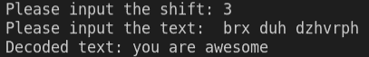
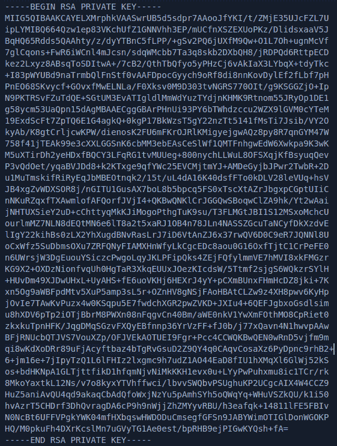

# 用 Python 实现密码学

> 原文：<https://blog.logrocket.com/implementing-cryptography-python/>

## 什么是密码学？

密码术是通过使用代码加密和解密数据来创建安全通信信道的艺术，这意味着除了指定的人之外，没有人能够看到传输的数据。

密码术主要使用数学原理和一系列公式和算法来加密消息，使得解密这些消息变得不可能。它在当今世界无处不在，从保护社交媒体平台的日常通信到保护在线电子商务的银行交易活动。

## 有哪些不同类型的加密技术？

有三种主要的加密类型:

1.  对称密钥加密
2.  非对称密钥加密
3.  散列法

让我们深入看看每一个！

## 对称密钥加密

[对称密钥加密](https://doubleoctopus.com/security-wiki/encryption-and-cryptography/symmetric-key-cryptography/)是解密和加密消息的最快和最简单的方法之一。它主要涉及使用一个密钥，称为秘密密钥，用于加密和解密数据。它也被称为私钥加密，以及秘密密钥、共享密钥、一键和私钥加密。

数据被转换成任何人都无法理解的形式，从而使数据免受攻击者的攻击。它主要用于加密大量数据。对称密钥加密有两种方法类型，用于将明文转换为密文:分组密码和流密码。

分组密码采用[电子码组](https://techdifferences.com/difference-between-block-cipher-and-stream-cipher.html) ( [ECB](https://techdifferences.com/difference-between-block-cipher-and-stream-cipher.html) )和[密码码组](https://techdifferences.com/difference-between-block-cipher-and-stream-cipher.html) ( [CBC](https://techdifferences.com/difference-between-block-cipher-and-stream-cipher.html) )的算法模式。它们接受文本输入，并通过获取一个文本块并生成一个相同大小的密文来将它们转换成密文。块密码比流密码相对较慢，因为文本块需要被覆盖、加密和解密。

另一方面，流密码使用密文反馈(CFB)和输出反馈(OFB)模式，通过一次输入 1 个字节将明文转换为密文，使流密码比块密码更快。流密码使用 XOR 将明文转换为密文。

对称密钥算法的一些例子是:

### 用 Python 实现的凯撒密码

凯撒密码是对称密钥加密的一个例子，它是实现加密的最古老和最简单的方法之一。凯撒密码是一种替代密码，在这种密码中，字母按固定的位置数移动它们的顺序。

加密和解密凯撒密码很容易，因为方法是固定的，不需要密钥。因此，任何知道该方法的人都能够很容易地解密该消息。

例如，如果您将字母表中的每个字母移动三个字母，像“cat”这样的简单单词将被加密为“fdw”。如果你不知道“猫”这个词是如何被加密的，那么这个词就很难理解。

现在，让我们创建一个简单的加密和解密密文的 Python 程序:

```
alphabets = 'abcdefghijklmnopqrstuvwxyz'
def encrypt_caesar(num, text):
 result = ' '
 for k in text.lower():
  try:
    i = (alphabets.index(k) + num) % 26
    results += alphabets[i]
  except ValueError:
   results+= k
 return results.lower()
num =int(input("please input the shift:\t"))
text=input("please input the text: \t")
ciphertext = encrypt_caesar(num, text)
print(“Encoded text:”,ciphertext)
```

结果如下:


首先，我们创建了一个名为`alphabets`的变量，在其中我们写了所有的字母表字母。然后，我们创建了一个名为`encrypt_ceaser(num, text)`的函数，我们将在其中放置 shift 键和需要加密的文本。

```
for k in text.lower():
```

通过使用一个`for`循环，我们将以小写形式插入输入字符串。

```
for k in text.lower():
 try:
    i = (alphabets.index(k) - num) % 26
     results += key[i]
   except ValueError:
    results += k
  return results.lower()
```

`try`方法和`except`方法，`ValueError`，用于捕捉程序间的错误。在`try`之后，我们用`index` *对字符串中的字母进行计数。*

文本中的所有字母用 shift 键相加，然后除以 26。一旦循环完成，字母将按照移位值移位。

```
num =int(input("Please input the shift:\t"))
text=input("Please input the text: \t")
ciphertext = decrypt_caesar(num, text)
print ("Decoded text:",ciphertext)

```

使用`input()`方法，我们为程序获取用户输入。然后，在密文中创建一个变量，我们称之为`encrypt_caesar( num, text)`。`print`语句用于打印编码后的密文。

现在，为了解密文本，我们将减去相同的密钥值:`3`

```
alphabets= 'abcdefghijklmnopqrstuvwxyz'
def decrypt_caesar(num, text):
 results = ''
 for k in text.lower():
  try:
    i = (alphabets.index(k) - num) % 26
    results +=alphabets[i]
  except ValueError:
   results += k
 return results.lower()
num =int(input("please input the shift:\t"))
text=input("please input the text: \t")
ciphertext = decrypt_caesar(num, text)
print(“Decoded text:”,ciphertext)
```

这是解密文本的结果。



尽管这个程序与我们之前创建的程序非常相似，但我们还是做了一些小的改动来解密文本。

我们没有使用`i = (alphabets.index(k) + num)` % 26，而是在`i = (alphabets.index(k) - num) % 26`中使用了一个`-`来解码密文。

## 非对称密钥加密

非对称密钥加密比对称加密更复杂、更慢。也称为公钥加密，它涉及使用两个不同的密钥(有时更多)来加密和解密数据。

本质上，公钥将用于加密数据，只有相应的私钥才能解密数据，从而使非对称密钥更加安全。

* * *

### 更多来自 LogRocket 的精彩文章:

* * *

例如，在阅读这篇博文时，你正在使用非对称加密技术。您的 HTTPS 网站 URL 旁边的锁状符号表示您已使用 SSL/TLS 证书安全地连接到该网站。

非对称密钥加密验证服务器的身份并创建非对称加密。

[非对称密钥算法](https://cheapsslsecurity.com/blog/what-is-asymmetric-encryption-understand-with-simple-examples/)的一些例子有:

*   里维斯特-沙米尔-阿德曼(RSA)
*   数字签名算法(DSA)
*   椭圆曲线密码(ECC)

让我们使用名为 [Cryptodome](https://pycryptodome.readthedocs.io/en/latest/src/introduction.html) 的 Python 包用 Python 生成一个 RSA 密钥:

```
from Crypto.PublicKey import RSA
key = RSA.generate(3072)
file= open('Rsakey.pem','wb')
file.write(key.exportKey('PEM'))
file.close()
```

让我们安装 Cryptodome:

```
pip install cryptodome
```

为了生成一个密钥，我们将使用`key.generate(bit size)`。`bit size`必须在 2048-4096 之间，以确保密钥的安全和长度。

```
file = open('Rsakey.pem','wb')
```

这里，`wb`* *的意思是“用二进制写。”

接下来，让我们创建一个`.pem` ( [隐私增强邮件](https://en.wikipedia.org/wiki/Privacy-Enhanced_Mail))，一种用于存储密钥和证书的文件格式

```
file.write(key.exportkey('PEM'))
```

我们将使用`.write`函数打印文件中的密钥，并使用`.exportkey`以 PEM 格式导出文件。最后，我们将使用`file.close`关闭文件。

打开`Rsakey.pem file`:



## 散列法

哈希是使用数学算法将任意长度的输入转换为固定大小的文本字符串的过程。这意味着任何大小的文本，不管有多长，都可以通过算法转换成数字和字母的数组。

用于转换文本的数学算法称为哈希函数，输出称为哈希值。散列算法被设计成不可逆的，使它们免受攻击者的攻击。

哈希用于用户验证和存储密码。MD5 和 SHA-1 散列法早期用于身份验证和存储密码，但后来因为不安全而被弃用。目前最安全的算法有 [Argon2](https://en.wikipedia.org/wiki/Argon2) 、 [bycrpt](https://auth0.com/blog/hashing-in-action-understanding-bcrypt/) 和 [scrypt](https://cryptobook.nakov.com/mac-and-key-derivation/scrypt) 以及 [PBKDF2](https://cryptobook.nakov.com/mac-and-key-derivation/pbkdf2) 。

现在，让我们创建一个简单的散列程序，这样我们就可以加密一个字符串。首先，通过编写以下代码，让我们看看 Python 中有多少种散列算法可用:

```
import hashlib
Hash_Algorithms_available = hashlib.algorithms_available
print(Hash_Algorithms_available)

Output: {'sha256', 'md4', 'whirlpool', 'sha384', 'sha224', 'sm3', 'blake2s', 'blake2b', 'ripemd160', 'sha512_256', 'md5', 'sha512_224', 'shake_128', 'sha512', 'sha1', 'sha3_384', 'sha3_256', 'sha3_512', 'md5-sha1', 'shake_256', 'sha3_224'}
```

首先，让我们来看一个简单的 MD5 Python 散列程序，因为它是最常见的 Python 散列示例之一:

```
import hashlib #importing libraries
module = hashlib.md5() #selecting the hashing module 
module.update(b"You are Awesome ") #inputting the text and b implies bytecode
print(module.hexdigest())
```

生成的十六进制为:

```
83d38079ecb05b2b0ad97ffa50a951eb
```

这里，我们导入了 Python 中可用的模块`hashlib`，并创建了一个名为`module`的变量，在这里我们选择了散列时要使用的 Python 散列算法。

`.update`是 hashlib 中的一个内置函数，它将数据作为输入并生成散列。字母`b`表示该字符串是一个字节字符串，`.digest`给出了从数据中生成的散列字符串:

现在，让我们看看一个简单的 bcrypt Python 散列程序的运行情况。

```
import bcrypt #importing libraries
input_password = b"YouareAwesome!" #inputting the text and b implies bytecode 
hashed_password = bcrypt.hashpw(input_password, bcrypt.gensalt())
print(hashed_password)
```

生成的十六进制为:`b'$2b$12$ZVMHgLah4CtGM1FGIXeEWusNA23wz1dqEc27a3rwwm9Fa4XVPLVLG'</code`

[Bcrypt](https://pypi.org/project/bcrypt/) 是 Python 中可用的一个包，可以通过一个简单的 pip 语句安装:

```
pip install bcrypt
```

然后我们可以导入包`import bcrypt`并使用`bcrypt.hashpw()`函数，该函数有两个参数:`byte`和`salt`。

`Salt`是散列函数中使用的随机数据，它创建随机字符串并使每个散列不可预测。

## 结论

在本文中，您了解了加密技术以及加密数据的各种方法。我们还为加密和解密创建了一个简单的 Python 程序。

实现加密是非常重要的。当您在数据库中存储密码时，请确保您使用的是最新、最强的加密和哈希标准。