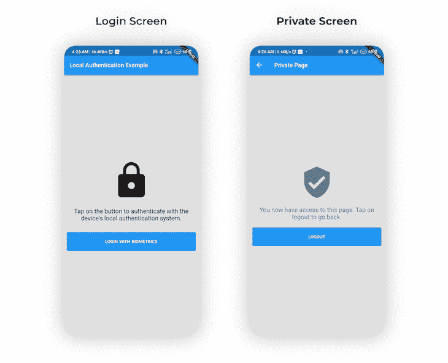
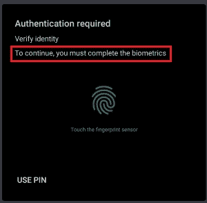
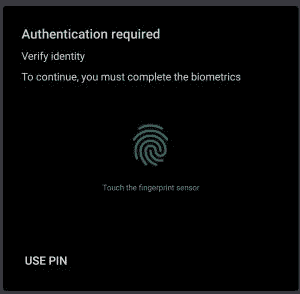
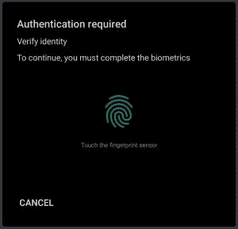
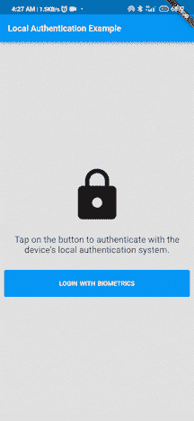

# 在 Flutter - LogRocket 博客中实现人脸识别和认证

> 原文：<https://blog.logrocket.com/implementing-face-recognition-authentication-flutter/>

在本文中，我们将描述如何在 Flutter 应用中使用面部识别和触控 ID 实现生物认证。

为此，我们将使用一个名为 [`local_auth`](https://pub.dev/packages/local_auth) 的插件，它是由 Flutter 团队开发的。该插件提供了对用户执行本地、设备上身份验证的方法。有了这个插件，我们将在我们的 Flutter 应用程序中实现本地认证，使用面部识别和指纹扫描。

在本教程中，我们将涵盖:

*   什么是生物认证
*   `local_auth`插件及其使用方法
*   在 Flutter 应用中实现生物认证
*   设置应用权限

## 内容

## 什么是生物认证？

生物识别身份认证是一种多因素身份认证(MFA ),它使用从设备用户的生物特征(如面部特征、声音识别和指纹)中获得的数据来促进访问并更好地保护个人信息和敏感资产。

在应用程序中采用生物认证的一个优势是，用户验证完全在物理设备上本地进行，消除了敏感信息通过第三方服务器传输和暴露的可能性。

除了有效地验证用户的身份，它还可以作为传统登录方法(如密码凭证)的额外安全层。

## 先决条件

如果您希望遵循本教程，我建议您进行以下设置:

*   任何安装了 Flutter SDK 的 IDE(即 Android Studio、VSCode)
*   对省道和扑动的基本理解

本教程已通过颤振 2.5.1 和 Android Studio v3.5 验证。

好了，一切就绪，让我们开始吧。

## 项目设置

为了开始我们的教程，让我们创建一个新的 Flutter 项目。为此，请在您的终端上运行以下命令:

```
$ flutter create local_auth_example

```

接下来，我们需要将`local_auth`插件作为依赖项添加到我们的项目中。在您的终端中运行以下命令，在您的项目中获取并安装`local_auth`插件。

```
$ flutter pub add local_auth
$ flutter pub get

```

现在我们已经安装了所需的依赖项，让我们继续构建应用程序的 UI。

## 构建用户界面

我们的应用程序将由两个屏幕组成:一个是`LoginScreen`，在这里我们将对用户进行身份验证，另一个是`PrivateScreen`，在成功的身份验证之后，用户将能够查看它。



让我们从构建`LoginScreen`开始。

### **登录**屏幕

如下面的代码片段所示，`LoginScreen`由一个`Icon`、一个`Text`和一个`Button`组成，我们将在其中实现我们的生物识别功能。

```
//...

class LoginScreen extends StatelessWidget {
  const LoginScreen({Key? key}) : super(key: key);
  @override
  Widget build(BuildContext context) {
    var size = MediaQuery.of(context).size;
    return Scaffold(
      backgroundColor: Colors.grey.shade300,
      appBar: AppBar(title: const Text('Local Authentication Example')),
      body: Center(
        child: Padding(
          padding: const EdgeInsets.all(8.0),
          child: Column(
            mainAxisAlignment: MainAxisAlignment.center,
            children: <Widget>[
              Icon(Icons.lock, size: size.width * 0.3),
              const SizedBox(height: 20),
              const Text(
                  'Tap on the button to authenticate with the device\'s local authentication system.',
                  textAlign: TextAlign.center,
                  style: TextStyle(
                    fontSize: 21,
                    color: Colors.black,
                  )),
              const SizedBox(height: 30),
              SizedBox(
                width: size.width,
                child: TextButton(
                  onPressed: () {
                   //implement biometric auth here
                  },
                  style: TextButton.styleFrom(
                    padding: const EdgeInsets.all(20),
                    backgroundColor: Colors.blue,
                    shadowColor: const Color(0xFF323247),
                  ),
                  child: Row(
                    mainAxisAlignment: MainAxisAlignment.center,
                    children: const [
                      Text(
                        'LOGIN WITH BIOMETRICS',
                        style: TextStyle(
                          fontSize: 15,
                          color: Colors.white,
                          fontWeight: FontWeight.w600,
                          wordSpacing: 1.2,
                        ),
                      ),
                    ],
                  ),
                ),
              )
            ],
          ),
        ),
      ),
    );
  }
}

```

### **私人屏幕**

`PrivateScreen`还包括一个`Icon`、一个`Text`和一个`Button`，用于处理用户注销，如下面的代码片段所示。

```
//...

class PrivateScreen extends StatelessWidget {
  const PrivateScreen({Key? key}) : super(key: key);
  @override
  Widget build(BuildContext context) {
    return Scaffold(
      backgroundColor: Colors.grey.shade300,
      appBar: AppBar(title: const Text('Private Page')),
      body: Center(
        child: Padding(
          padding: const EdgeInsets.all(8.0),
          child: Column(
            mainAxisAlignment: MainAxisAlignment.center,
            children: <Widget>[
              const Icon(Icons.verified_user,
                  size: 100, color: Colors.blueGrey),
              const SizedBox(height: 20),
              const Text(
                  'You now have access to this page. Tap on logout to go back.',
                  textAlign: TextAlign.center,
                  style: TextStyle(
                    fontSize: 21,
                    color: Colors.blueGrey,
                  )),
              const SizedBox(height: 20),
              SizedBox(
                width: MediaQuery.of(context).size.width,
                child: TextButton(
                  onPressed: () {
                    Navigator.pop(context);
                  },
                  style: TextButton.styleFrom(
                    padding: const EdgeInsets.all(20),
                    backgroundColor: Colors.blue,
                    shadowColor: const Color(0xFF323247),
                  ),
                  child: Row(
                    mainAxisAlignment: MainAxisAlignment.center,
                    children: const [
                      Text(
                        'LOGOUT',
                        style: TextStyle(
                          fontSize: 15,
                          color: Colors.white,
                          fontWeight: FontWeight.w600,
                          wordSpacing: 1.2,
                        ),
                      ),
                    ],
                  ),
                ),
              )
            ],
          ),
        ),
      ),
    );
  }
}

```

## `local_auth`插件概述

在我们继续在我们的应用中实现生物认证之前，让我们来看看`local_auth`插件提供的主要特性，包括以下内容:

*   检查设备兼容性
*   列出了支持的生物识别类型，可供查看
*   使用生物特征或 PIN 的用户认证

### 检查设备兼容性

我们可以检查设备硬件是否支持生物认证。为此，我们将使用由`local_auth`插件提供的`isDeviceSupported`方法。

```
//initialize the Local Authentication plugin 
LocalAuthentication _localAuthentication = LocalAuthentication();
//check if device supports biometrics authentication.
bool isBiometricSupported = await _localAuthentication.isDeviceSupported();

```

`isDeviceSupported` async 方法返回一个`bool`，表示用户的设备是否支持生物认证。如果用户的设备不支持生物识别，您应该考虑启用其他身份验证方法，如 PIN。

### 获取支持的生物特征类型列表

`local_auth`插件提供的`getAvailableBiometrics`方法可用于检索用户设备支持的生物特征类型列表。

```
List<BiometricType> biometricTypes =
      await _localAuthentication.getAvailableBiometrics();

```

该插件当前支持以下生物特征类型:

*   生物计量学. face
*   生物计量学.指纹
*   生物计量学

### 使用生物特征或 PIN 认证用户

为了使用生物特征或 PIN 认证用户，我们使用插件提供的`authenticate`方法。

```
await _localAuthentication.authenticate(
     localizedReason: 'To continue, you must complete the biometrics',
);

```

`authenticate`方法有一些可选参数，用于改变一些特定的设置，例如:

```
Future<bool> authenticate({
  required String localizedReason,
  bool useErrorDialogs,
  bool stickyAuth,
  bool biometricOnly ,
})

```

### `String localizedReason`

这是在提示用户进行身份验证时向用户显示的消息。

(注意:本地化原因信息以红色突出显示。)



### `bool biometricOnly`

设定为 true 时，将停用 PIN 和密码等非生物特征本地鉴定方法。



(注意:当该选项设置为 false 时，图像显示“使用 PIN”按钮存在。)

(注意:当该选项设置为 false 时，图像显示“使用 PIN”按钮已被移除。)

### `bool useErrorDialogs`

当该参数设置为`true`时，插件会检查设备上是否存在用户指纹记录。如果没有注册指纹，插件将尝试引导用户创建一个。

### `stickyAuth`

正常情况下，当应用最小化或移动到后台时，身份验证过程终止。如果`stickyAuth`设置为`true`，当应用程序重新成为焦点时，认证过程将继续。

## 在 Flutter 应用中实现生物认证

在我们的实现中，我们将首先检查设备是否支持生物认证，然后限制用户只能使用生物认证；身份验证成功后，我们将授权用户访问下一个屏幕。

首先，创建一个名为`auth.dart`的新文件，并在其中粘贴以下代码:

```
import 'package:flutter/services.dart';
import 'package:local_auth/local_auth.dart';

class AuthService {
  static Future<bool> authenticateUser() async {
    //initialize Local Authentication plugin.
    final LocalAuthentication _localAuthentication = LocalAuthentication();
    //status of authentication.
    bool isAuthenticated = false;
    //check if device supports biometrics authentication.
    bool isBiometricSupported = await _localAuthentication.isDeviceSupported();
    //check if user has enabled biometrics.
    //check  
    bool canCheckBiometrics = await _localAuthentication.canCheckBiometrics;

  //if device supports biometrics and user has enabled biometrics, then authenticate.
    if (isBiometricSupported && canCheckBiometrics) {
      try {
        isAuthenticated = await _localAuthentication.authenticate(
            localizedReason: 'Scan your fingerprint to authenticate',
            biometricOnly: true,
            useErrorDialogs: true,
            stickyAuth: true);
      } on PlatformException catch (e) {
        print(e);
      }
    }
    return isAuthenticated;
  }
}

```

在上面的代码中，我们创建了一个类`AuthService`并定义了一个静态方法`authenticateUser`。这个方法处理所有的生物认证逻辑，并返回一个`bool`,指示生物认证是否成功。

现在，在`LoginScreen`中，我们需要调用`TextButton`小部件的`onPressed`属性中的`authenticateUser`方法，如下面的代码片段所示。

```
TextButton(
  onPressed: () async {
      bool isAuthenticated = await AuthService.authenticateUser();
      if (isAuthenticated) {
          Navigator.push(
            context,
            MaterialPageRoute(
              builder: (context) => const PrivateScreen()),
            );
      } else {
          ScaffoldMessenger.of(context).showSnackBar(
              const SnackBar(
                content: Text('Authentication failed.'),
                ),
          );
        }
  //...
  },

```

从上面的代码片段中—如果认证成功—我们将导航用户到`PrivateScreen`；否则，我们将显示一个带有错误消息的 Snackbar。

## 设置应用权限

### **安卓系统**

要包含`USE_FINGERPRINT`权限，将下面一行代码添加到您的`AndroidManifest.xml`文件中，该文件位于目录`android/app/src/main`中:

```
<uses-permission android:name="android.permission.USE_FINGERPRINT"/>

```

然后，更新`MainActivity.kt`文件，用`FlutterFragmentActivity`代替`FlutterActivity`:

```
import io.flutter.embedding.android.FlutterFragmentActivity
import io.flutter.embedding.engine.FlutterEngine
import io.flutter.plugins.GeneratedPluginRegistrant

class MainActivity: FlutterFragmentActivity() {
    override fun configureFlutterEngine(flutterEngine: FlutterEngine) {
        GeneratedPluginRegistrant.registerWith(flutterEngine)
    }
}

```

或者，如果您使用 Java 而不是 Kotlin，用下面的代码更新您的`MainActivity.java`文件:

```
import android.os.Bundle;
import io.flutter.app.FlutterFragmentActivity;
import io.flutter.plugins.flutter_plugin_android_lifecycle.FlutterAndroidLifecyclePlugin;
import io.flutter.plugins.localauth.LocalAuthPlugin;

public class MainActivity extends FlutterFragmentActivity {
    @Override
    protected void onCreate(Bundle savedInstanceState) {
        super.onCreate(savedInstanceState);
        FlutterAndroidLifecyclePlugin.registerWith(
                registrarFor(
                        "io.flutter.plugins.flutter_plugin_android_lifecycle.FlutterAndroidLifecyclePlugin"));
        LocalAuthPlugin.registerWith(registrarFor("io.flutter.plugins.localauth.LocalAuthPlugin"));
    }
}

```

### **对于 iOS**

为了让 FaceID 在 iOS 上工作，在`Info.plist`文件中添加下面一行。这定义了一条消息，告诉用户为什么应用程序正在寻求许可以通过 Face ID 认证。

```
<key>NSFaceIDUsageDescription</key>
<string>Why is my app authenticating using face id?</string>

```



## 结论

在本教程中，我们已经了解了什么是生物认证，以及我们如何使用`local_auth`插件在 Flutter 应用中实现生物认证。

这个项目的完整源代码可以在 [GitHub](https://github.com/iloveteajay/Local_Authentication) 上找到。

## 使用 [LogRocket](https://lp.logrocket.com/blg/signup) 消除传统错误报告的干扰

[](https://lp.logrocket.com/blg/signup)

[LogRocket](https://lp.logrocket.com/blg/signup) 是一个数字体验分析解决方案，它可以保护您免受数百个假阳性错误警报的影响，只针对几个真正重要的项目。LogRocket 会告诉您应用程序中实际影响用户的最具影响力的 bug 和 UX 问题。

然后，使用具有深层技术遥测的会话重放来确切地查看用户看到了什么以及是什么导致了问题，就像你在他们身后看一样。

LogRocket 自动聚合客户端错误、JS 异常、前端性能指标和用户交互。然后 LogRocket 使用机器学习来告诉你哪些问题正在影响大多数用户，并提供你需要修复它的上下文。

关注重要的 bug—[今天就试试 LogRocket】。](https://lp.logrocket.com/blg/signup-issue-free)