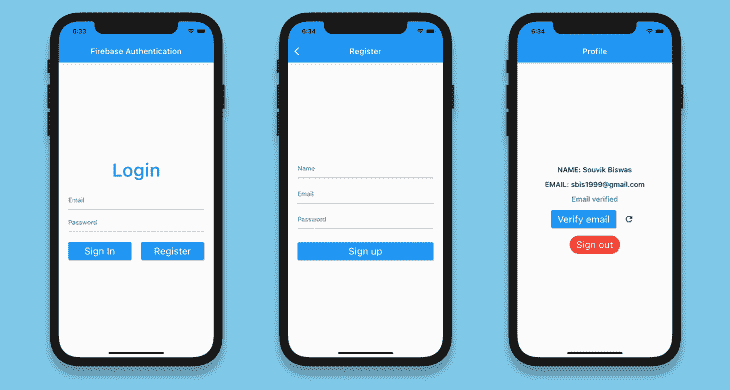
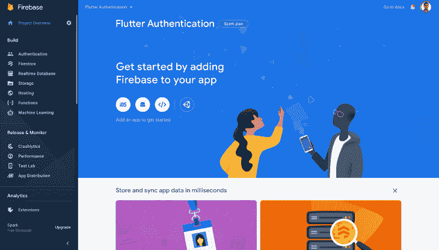
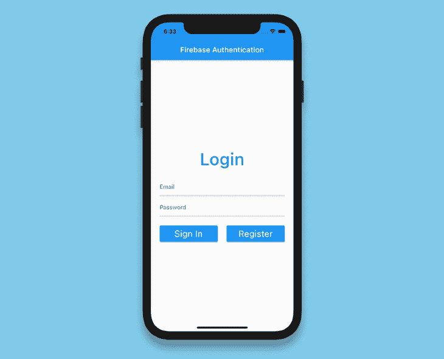
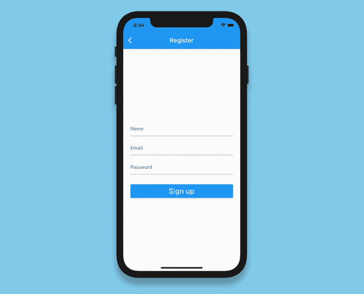
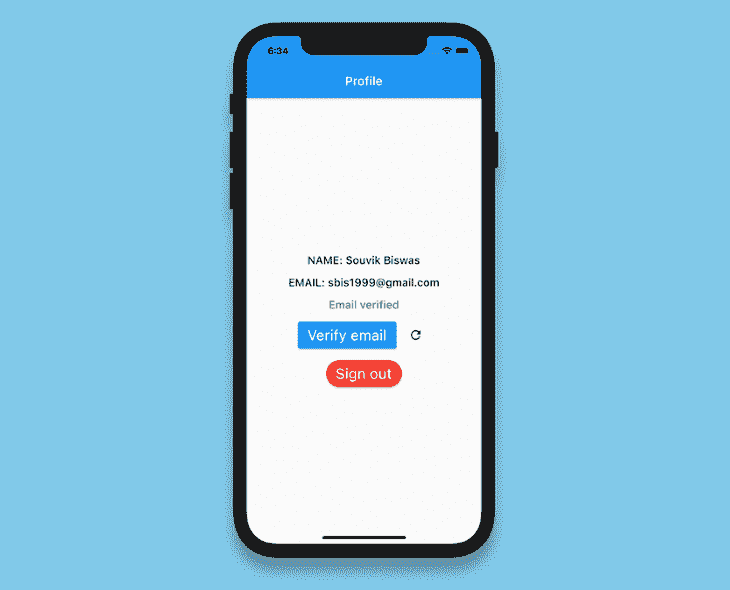

# 在 Flutter 应用程序中实现 Firebase 认证

> 原文：<https://blog.logrocket.com/implementing-firebase-authentication-in-a-flutter-app/>

无论您是在运行一个简单的待办应用程序，还是构建您梦想中的应用程序，身份验证都可以帮助您使用用户特定的信息来个性化体验。这也是隐私和安全的重要组成部分。

[Firebase Authentication](https://firebase.google.com/docs/auth) 是一种预配置的后端服务，使用 SDK 可以轻松集成移动应用。您不必为身份验证过程维护任何后端基础设施，Firebase 支持与流行的身份提供商(如谷歌、脸书和 GitHub)集成。

在本教程中，我们将向您展示如何将 Firebase 认证与您的 [Flutter 应用](https://blog.logrocket.com/pros-and-cons-of-flutter-app-development/)集成。为了用一个实际的例子来演示，我们将引导您完成构建电子邮件密码注册和登录流程的过程。

我们将完成以下步骤:

完成后的应用程序将如下所示:



## 创建一个颤振和火灾基地项目

使用以下命令创建一个新的颤振项目:

```
flutter create flutter_authentication

```

在您喜欢的代码编辑器中打开项目。下面是如何使用 VS 代码打开它:

```
code flutter_authentication

```

要将 Firebase 与您的 Flutter 项目集成，您必须通过进入[控制台](https://console.firebase.google.com/)创建一个新的 Firebase 项目。

添加一个新项目并给它命名。对于这个示例项目，我们不需要 Google Analytics，所以您可以禁用它。一旦你创建了你的项目，你将被引导到你的 Firebase 项目仪表板。



## 为 Android、iOS 和 web 设置 Firebase

要在 Android、iOS 或 web 上使用 Firebase，你必须为每个平台完成一些配置。请参见下面的完整配置指南:

现在我们已经有了使用 Firebase 的基本设置，让我们开始研究我们的 Flutter 应用程序。

## 导入 Firebase 插件

在开始实现身份验证逻辑之前，您需要导入以下插件:

*   `[firebase_core](https://pub.dev/packages/firebase_core)`，在 Flutter app 中使用任何 Firebase 服务都需要它
*   `[firebase_auth](https://pub.dev/packages/firebase_auth)`访问 Firebase 认证服务

将这些插件添加到您的`pubspec.yaml`文件中:

```
dependencies:
  firebase_core: ^1.0.4
  firebase_auth: ^1.1.1

```

## 初始化 Firebase 应用程序

在使用 Flutter app 内的任何 Firebase 服务之前，需要初始化 [Firebase App](https://firebase.google.com/docs/reference/js/firebase.app.App) 。

将`main.dart`文件修改如下:

```
import 'package:flutter/material.dart';
import 'screens/login_page.dart';
void main() {
  runApp(MyApp());
}
class MyApp extends StatelessWidget {
  @override
  Widget build(BuildContext context) {
    return MaterialApp(
      title: 'Flutter Authentication',
      debugShowCheckedModeBanner: false,
      theme: ThemeData(
        primarySwatch: Colors.cyan,
      ),
      home: LoginPage(),
    );
  }
}

```

定义`LoginPage`:

```
import 'package:flutter/material.dart';
class LoginPage extends StatelessWidget {
  @override
  Widget build(BuildContext context) {
    return Scaffold(
      appBar: AppBar(
        title: Text('Firebase Authentication'),
      ),
    );
  }
}

```

添加初始化 Firebase 应用程序的新方法:

```
Future<FirebaseApp> _initializeFirebase() async {
    FirebaseApp firebaseApp = await Firebase.initializeApp();
    return firebaseApp;
}

```

因为这个方法是异步的，所以您必须在构建方法中使用`FutureBuilder`:

```
class LoginPage extends StatelessWidget {
  Future<FirebaseApp> _initializeFirebase() async {
    FirebaseApp firebaseApp = await Firebase.initializeApp();
    return firebaseApp;
  }
  @override
  Widget build(BuildContext context) {
    return Scaffold(
      appBar: AppBar(
        title: Text('Firebase Authentication'),
      ),
      body: FutureBuilder(
        future: _initializeFirebase(),
        builder: (context, snapshot) {
          if (snapshot.connectionState == ConnectionState.done) {
            return Column(
              children: [
                Text('Login'),
              ],
            );
          }
          return Center(
            child: CircularProgressIndicator(),
          );
        },
      ),
    );
  }
}

```

现在，我们只是在异步任务完成时显示一个简单的`Text`小部件，否则只是一个`CircularProgressIndicator`。

## 注册新用户

当新用户到来时，在登录之前，他们必须注册到 Firebase 身份验证。

创建一个名为`fire_auth.dart`的新 dart 文件，并定义一个名为`registerUsingEmailPassword()`的新方法:

```
class FireAuth {
  static Future<User?> registerUsingEmailPassword({
    required String name,
    required String email,
    required String password,
  }) async {
    FirebaseAuth auth = FirebaseAuth.instance;
    User? user;
    try {
      UserCredential userCredential = await auth.createUserWithEmailAndPassword(
        email: email,
        password: password,
      );
      user = userCredential.user;
      await user!.updateProfile(displayName: name);
      await user.reload();
      user = auth.currentUser;
    } on FirebaseAuthException catch (e) {
      if (e.code == 'weak-password') {
        print('The password provided is too weak.');
      } else if (e.code == 'email-already-in-use') {
        print('The account already exists for that email.');
      }
    } catch (e) {
      print(e);
    }
    return user;
  }
}

```

在这里，我们使用提供的电子邮件和密码注册一个新用户，并将用户名与此配置文件相关联。

可能有各种各样的`FirebaseAuthException`错误，我们已经在上面的代码片段中处理过了。

## 用户登录和注销

要登录已经在我们的应用程序中注册的用户，定义一个名为`signInUsingEmailPassword()`的新方法，传递用户电子邮件和密码:

```
static Future<User?> signInUsingEmailPassword({
  required String email,
  required String password,
  required BuildContext context,
}) async {
  FirebaseAuth auth = FirebaseAuth.instance;
  User? user;

  try {
    UserCredential userCredential = await auth.signInWithEmailAndPassword(
      email: email,
      password: password,
    );
    user = userCredential.user;
  } on FirebaseAuthException catch (e) {
    if (e.code == 'user-not-found') {
      print('No user found for that email.');
    } else if (e.code == 'wrong-password') {
      print('Wrong password provided.');
    }
  }

  return user;
}

```

email 和密码用于生成 Firebase 提供的`User`对象。`User`稍后可用于检索任何附加数据(例如，用户名、个人资料图片等。)存在那个账户里。

您可以使用`signOut()`方法注销用户。没有必要创建一个单独的注销方法，因为它只有一行代码:

```
FirebaseAuth.instance.signOut();

```

## 发送电子邮件验证

假设您想在继续之前验证用户是否输入了正确的电子邮件地址。要发送电子邮件验证，您可以对`User`对象使用`sendEmailVerification()`方法:

```
user.sendEmailVerification();

```

## 刷新用户

我们将在`FireAuth`类中再定义一个方法来刷新`User`:

```
static Future<User?> refreshUser(User user) async {
  FirebaseAuth auth = FirebaseAuth.instance;

  await user.reload();
  User? refreshedUser = auth.currentUser;

  return refreshedUser;
}

```

## 定义验证器

我们的应用程序将有三个表单字段，名称，电子邮件，密码。我们将为每一个创建一个验证器。验证器将帮助检查用户是否在特定字段中输入了任何不适当的值，并相应地显示错误。

创建一个名为`validator.dart`的新文件，定义一个类`Validator`，并在其中指定三个方法(每个方法都将一个`String`作为参数):

*   `validateName()`检查名称字段是否为空
*   `validateEmail()`检查电子邮件地址字段是否为空，并使用正则表达式验证其格式是否正确
*   `validatePassword()`检查密码字段是否为空，并验证长度是否超过六个字符

```
class Validator {
  static String? validateName({required String name}) {
    if (name == null) {
      return null;
    }
    if (name.isEmpty) {
      return 'Name can\'t be empty';
    }

    return null;
  }

  static String? validateEmail({required String email}) {
    if (email == null) {
      return null;
    }
    RegExp emailRegExp = RegExp(
        r"^[a-zA-Z0-9.!#$%&'*+/=?^_`{|}~-][email protected][a-zA-Z0-9](?:[a-zA-Z0-9-]{0,253}[a-zA-Z0-9])?(?:\.[a-zA-Z0-9](?:[a-zA-Z0-9-]{0,253}[a-zA-Z0-9])?)*$");

    if (email.isEmpty) {
      return 'Email can\'t be empty';
    } else if (!emailRegExp.hasMatch(email)) {
      return 'Enter a correct email';
    }

    return null;
  }

  static String? validatePassword({required String password}) {
    if (password == null) {
      return null;
    }
    if (password.isEmpty) {
      return 'Password can\'t be empty';
    } else if (password.length < 6) {
      return 'Enter a password with length at least 6';
    }

    return null;
  }
}
```

## 构建登录表单

让我们向`LoginPage`添加一个表单，用于接受用户的电子邮件地址和密码:



定义一个`GlobalKey`:

```
final _formKey = GlobalKey<FormState>();

```

添加表单并指定键:

```
Form(
  key: _formKey,
  child: Column(
    children: <Widget>[
      // Add widgets
    ],
  ),
)

```

接下来，添加两个`TextFormField`来接受电子邮件和密码:

```
Form(
  key: _formKey,
  child: Column(
    children: <Widget>[
      TextFormField(
        controller: _emailTextController,
        focusNode: _focusEmail,
        validator: (value) => Validator.validateEmail(email: value),
      ),
      SizedBox(height: 8.0),
      TextFormField(
        controller: _passwordTextController,
        focusNode: _focusPassword,
        obscureText: true,
        validator: (value) => Validator.validatePassword(password: value),
      ),
    ],
  ),
)

```

在`Form`内增加两个按钮:一个用于登录，另一个用于导航到`RegisterPage`；

```
Row(
  mainAxisAlignment: MainAxisAlignment.spaceBetween,
  children: [
    Expanded(
      child: ElevatedButton(
        onPressed: () async {
          if (_formKey.currentState!.validate()) {
            User? user = await FireAuth.signInUsingEmailPassword(
              email: _emailTextController.text,
              password: _passwordTextController.text,
            );
            if (user != null) {
              Navigator.of(context)
                  .pushReplacement(
                MaterialPageRoute(builder: (context) => ProfilePage(user: user)),
              );
            }
          }
        },
        child: Text(
          'Sign In',
          style: TextStyle(color: Colors.white),
        ),
      ),
    ),
    Expanded(
      child: ElevatedButton(
        onPressed: () {
          Navigator.of(context).push(
            MaterialPageRoute(builder: (context) => RegisterPage()),
          );
        },
        child: Text(
          'Register',
          style: TextStyle(color: Colors.white),
        ),
      ),
    ),
  ],
)

```

在**登录**按钮中，我们调用了`FireAuth.signInUsingEmailPassword()`来使用 Firebase 身份验证执行登录过程。

`RegisterPage`也将包含一个与此类似的`Form`，只是多了一个字段，用于在用户第一次注册时接受他们的名字。



你可以在这里查看`RegisterPage` [的 UI 代码。](https://github.com/sbis04/flutter-authentication/blob/master/lib/screens/register_page.dart)

## 构建个人资料页面

在`ProfilePage`上，我们将传递`User`对象并显示以下详细信息:姓名、电子邮件以及用户是否完成了电子邮件验证。



该页面还将包含两个按钮:一个用于发送电子邮件验证，另一个用于注销用户。

```
class ProfilePage extends StatefulWidget {
  final User user;
  const ProfilePage({required this.user});
  @override
  _ProfilePageState createState() => _ProfilePageState();
}
class _ProfilePageState extends State<ProfilePage> {
  bool _isSendingVerification = false;
  bool _isSigningOut = false;
  late User _currentUser;

  @override
  void initState() {
    _currentUser = widget.user;
    super.initState();
  }

  @override
  Widget build(BuildContext context) {
    return Scaffold(
      appBar: AppBar(
        title: Text('Profile'),
      ),
      body: Center(
        child: Column(
          mainAxisAlignment: MainAxisAlignment.center,
          children: [
            Text(
              'NAME: ${_currentUser.displayName}',
              style: Theme.of(context).textTheme.bodyText1,
            ),
            SizedBox(height: 16.0),
            Text(
              'EMAIL: ${_currentUser.email}',
              style: Theme.of(context).textTheme.bodyText1,
            ),
            SizedBox(height: 16.0),
            _currentUser.emailVerified
                ? Text(
                    'Email verified',
                    style: Theme.of(context)
                        .textTheme
                        .bodyText1!
                        .copyWith(color: Colors.green),
                  )
                : Text(
                    'Email not verified',
                    style: Theme.of(context)
                        .textTheme
                        .bodyText1!
                        .copyWith(color: Colors.red),
                  ),
              // Add widgets for verifying email
              // and, signing out the user
          ],
        ),
      ),
    );
  }
}

```

发送电子邮件验证的按钮如下:

```
ElevatedButton(
  onPressed: () async {
    await _currentUser.sendEmailVerification();
  },
  child: Text('Verify email'),
)

```

我们还将添加一个`IconButton`，它可以用来在电子邮件通过验证时刷新用户。

```
IconButton(
  icon: Icon(Icons.refresh),
  onPressed: () async {
    User? user = await FireAuth.refreshUser(_currentUser);
    if (user != null) {
      setState(() {
        _currentUser = user;
      });
    }
  },
)

```

最后，注销用户的按钮:

```
ElevatedButton(
  onPressed: () async {
    await FirebaseAuth.instance.signOut();

    Navigator.of(context).pushReplacement(
      MaterialPageRoute(
        builder: (context) => LoginPage(),
      ),
    );
  },
  child: Text('Sign out')
)

```

## 保持登录状态

还有一件更重要的事要做。在大多数应用程序中，你只需登录一次，它就会记住后续访问的状态，也就是说，它会自动让你登录应用程序，这样你就不必每次都提供凭据。

在`_LoginPageState`类中，修改`_initializeFirebase()`方法来检索当前用户。如果`User`不为空，这意味着用户已经登录到应用程序，所以只需导航到检索到的用户的`UserInfoScreen`。

```
Future<FirebaseApp> _initializeFirebase() async {
    FirebaseApp firebaseApp = await Firebase.initializeApp();
    User? user = FirebaseAuth.instance.currentUser;
    if (user != null) {
      Navigator.of(context).pushReplacement(
        MaterialPageRoute(
          builder: (context) => ProfilePage(
            user: user,
          ),
        ),
      );
    }
    return firebaseApp;
}

```

## 结论

恭喜你！您已经成功地将 Firebase 身份验证与您的 Flutter 应用程序集成在一起。您可能已经注意到，Firebase Authentication 不仅提供了用于轻松认证用户的后端基础设施，还提供了用于自动登录和电子邮件验证的预定义方法。还有很多东西需要探索。Firebase Authentication 还支持与许多身份提供商的集成，包括 Google、脸书、Twitter、Apple 等。

您可以在 [GitHub](https://github.com/sbis04/flutter-authentication) 上找到示例项目中使用的代码。

如果你对这个 Flutter 和 Firebase 认证教程有任何建议或问题，请随时在 [Twitter](https://twitter.com/sbis04) 或 [LinkedIn](https://www.linkedin.com/in/sbis04/) 上与我联系。

## 使用 [LogRocket](https://lp.logrocket.com/blg/signup) 消除传统错误报告的干扰

[](https://lp.logrocket.com/blg/signup)

[LogRocket](https://lp.logrocket.com/blg/signup) 是一个数字体验分析解决方案，它可以保护您免受数百个假阳性错误警报的影响，只针对几个真正重要的项目。LogRocket 会告诉您应用程序中实际影响用户的最具影响力的 bug 和 UX 问题。

然后，使用具有深层技术遥测的会话重放来确切地查看用户看到了什么以及是什么导致了问题，就像你在他们身后看一样。

LogRocket 自动聚合客户端错误、JS 异常、前端性能指标和用户交互。然后 LogRocket 使用机器学习来告诉你哪些问题正在影响大多数用户，并提供你需要修复它的上下文。

关注重要的 bug—[今天就试试 LogRocket】。](https://lp.logrocket.com/blg/signup-issue-free)