# 在 React Native 中实现应用内购买

> 原文：<https://blog.logrocket.com/implementing-in-app-purchases-in-react-native/>

应用内购买是移动应用从用户那里收取费用的一种方式。它可以是订阅或一次性付款的形式，以解锁应用程序中的特定功能或内容。

在本教程中，我们将了解如何在 React Native 中实现应用内购买。除了前端，我们还将实现后端，以便我们可以验证购买并相应地更新用户数据。

## 先决条件

学习本教程需要 React、React Native 和任何编程语言的知识。在本教程的后端部分，我们将特别使用 PHP 和 Laravel，但是它也应该很容易被翻译成另一种后端语言。

对于软件方面，您需要在您的机器上安装 React 本地开发环境和 PHP 开发环境。如果您的主要后端语言不同，您可以简单地将代码翻译成您选择的编程语言。

如果你打算在 Android 中使用应用内购买，你需要有一个 Google Play 开发者账户。你还需要有一个[谷歌云平台账号](https://console.cloud.google.com/)。

如果你打算在 iOS 中使用应用内购买，你需要有一个[苹果开发者账户](https://developer.apple.com/)。这可以是你自己的个人苹果账户，也可以是团队的一员。

## 应用概述

我们将要开发的应用是一个基于订阅的应用。基本上，用户必须使用应用内购买来解锁应用的付费功能。这是它在 Android 上的样子:

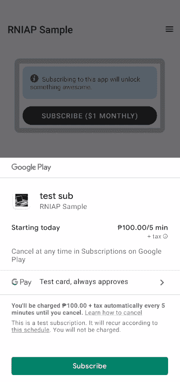

这是它在 iOS 中的样子:

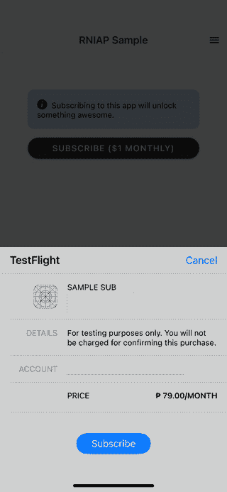

一旦用户订阅，锁定页面中的内容将对用户可用。

你可以在 [GitHub repo](https://github.com/anchetaWern/React-Native-In-App-Purchases-Sample) 上找到 React 原生应用和服务器的代码。

## 初始化 React 本机项目

创建一个新的 bare Expo 项目，并将其名称设置为`RNIAPSample`:

```
expo init --template bare-minimum

```

创建项目后，安装所有依赖项:

```
npm install --save [email protected] react-native-restart react-native-simple-toast react-native-paper axios

```

> 注意，在撰写本教程时，Expo 内购的最新版本是 10.1.0。但是它有一个问题，唯一可用的最新版本是 9.1.0。当您阅读本文时，请先尝试安装最新版本，因为问题可能已经在那时得到解决。

接下来，安装 React 导航先决条件:

```
expo install react-native-gesture-handler react-native-reanimated react-native-screens react-native-safe-area-context @react-native-community/masked-view

```

然后安装 React Navigation 及其几个导航器——堆栈和抽屉导航:

```
npm install --save @react-navigation/native @react-navigation/stack @react-navigation/drawer

```

接下来，安装`expo-secure-store`:

```
expo install expo-secure-store

```

或者，您可以安装`expo-device`来确定用户的设备名称。我们不会在项目中使用它，我们只是简单地使用一个硬编码的值:

```
expo install expo-device

```

最后，安装所有相应的 iOS 依赖项:

```
npx pod-install

```

这是我们刚刚安装的所有软件包的明细:

*   `expo-in-app-purchases` —用于实现[应用内购买](https://docs.expo.io/versions/latest/sdk/in-app-purchases/)
*   `react-native-start` —用于在购买完成后重新加载应用
*   `react-native-simple-toast` —用于在购买完成后向用户发出祝酒通知
*   `react-native-paper` —用于实现物料界面设计
*   `axios` —用于向服务器提交 HTTP 请求
*   `@react-navigation/native` —用于在应用内实现导航
*   `expo-secure-store` —用于存储应用程序中的敏感信息
*   `expo-device` —用于确定设备信息，如设备名称或制造商

## 设置服务器

让我们继续设置服务器。首先，创建一个新的 Laravel 项目。这将安装最新版本的 Laravel。在写这篇文章的时候，是 8:

```
composer create-project laravel/laravel rniapserver

```

完成后，在项目目录中导航。这将作为我们将要执行的所有命令的根目录:

```
cd rniapserver

```

接下来，安装依赖项。首先，我们有[拉勒维尔圣地](https://github.com/laravel/sanctum)。这为移动应用用户和 spa 提供了一个认证系统:

```
composer require laravel/sanctum

```

如果由于内存问题失败，将 PHP 的内存限制设置为 unlimited:

```
php -d memory_limit=-1 /usr/local/bin/composer require laravel/sanctum

```

一旦圣所安装完毕，发布它的配置文件。这将创建一个`config/sanctum.php`文件:

```
php artisan vendor:publish --provider="Laravel\Sanctum\SanctumServiceProvider"

```

接下来，安装 [Google Cloud PubSub](https://github.com/googleapis/google-cloud-php-pubsub) 库。这将允许服务器使用发布订阅通知。每当用户在 Android 版本的应用程序中订阅时，我们都会收到这些通知:

```
composer require google/cloud-pubsub

```

接下来，创建数据库。我们将使用该数据库存储用户及其订阅信息:

```
mysql -u root -p
CREATE DATABASE rniap;

```

更新项目根目录下的`.env`文件，以包含您的数据库凭证:

```
DB_DATABASE=rniap
DB_USERNAME=your_db_user
DB_PASSWORD=your_db_password

```

迁移数据库:

```
php artisan migrate

```

接下来，安装前端依赖项并编译它们:

```
npm install
npm run production

```

此时，您现在可以尝试运行服务器以确保它正常工作。如果你在苹果电脑上，你可以使用 [Laravel Valet](https://laravel.com/docs/8.x/valet) 来快速服务这个项目。一旦安装了 Valet，您所要做的就是在项目的根目录下执行以下命令:

```
valet link
valet secure

```

这将把它分配到本地域`rnniapserver.test`并通过 HTTPS 保护它。

如果你不在 Mac 上，你可以简单地使用`artisan`来服务这个项目:

```
php artisan serve

```

如果你得到了默认的 Laravel 欢迎界面，那么你就可以开始了。否则，确保`storage`目录有正确的权限，因为这通常是项目无法工作的原因。

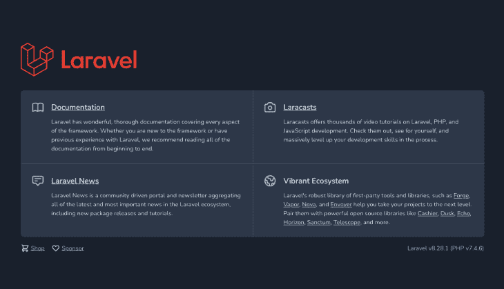

## 为 Android 设置应用内购买

在这一部分，我们将为 Android 设置应用内购买。

本节假设如下:

### 创建订阅

在 Google Play 控制台上，进入**货币化→产品→订阅**。你也可以搜索“应用内产品”，点击第一个结果，在页面中，点击**应用内产品**菜单正下方的**订阅**链接:

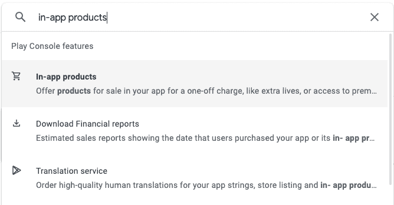

在那里，点击**创建订阅**。为以下字段提供值:

*   产品 ID
*   名字
*   描述
*   计费周期
*   默认价格

完成后，应该会列出您刚刚创建的订阅。记下**产品 ID** ，因为我们稍后创建应用程序时会用到它:

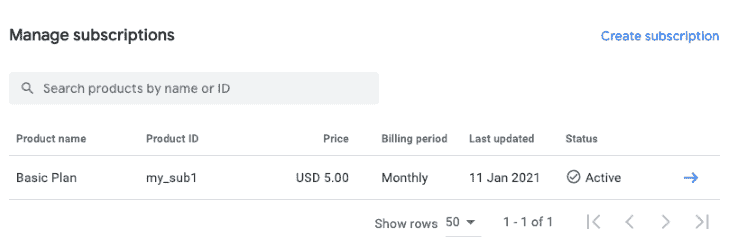

### 设置通知

下一步是为订阅设置通知。这就是我们使用 Google Cloud PubSub 的地方，这样当用户订阅你的应用程序时，你的服务器可以收到通知。本节假设您已经有一个现有的 [Google Cloud](https://console.cloud.google.com/) 项目。如果没有，可以直接点击左上方当前选中的 Google Cloud 项目。这将打开允许您创建一个新的模态。

一旦你有了谷歌云项目，第一步就是创建一个新的服务账户。点击 **IAM & Admin** → **服务账户**，进入服务账户页面:

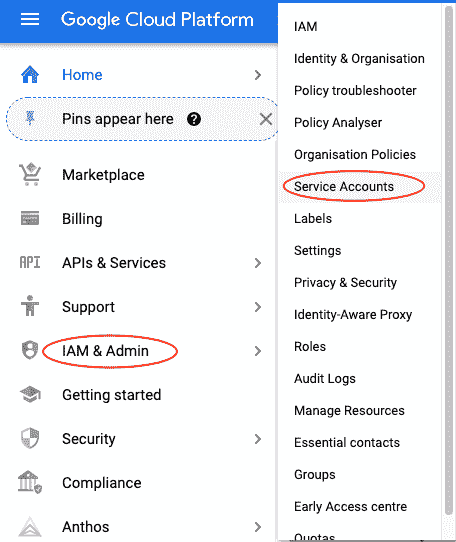

输入服务帐户的名称和唯一 ID:

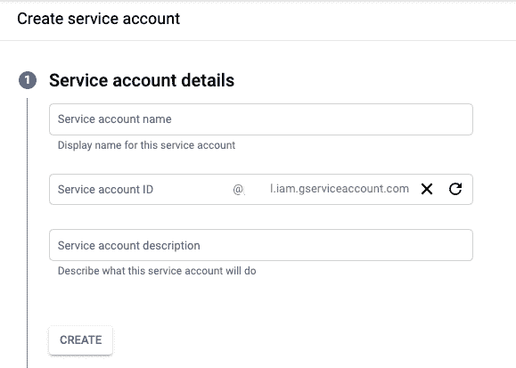

它还会要求您添加一个角色。我们并不真的需要它，所以只需点击**继续**。接下来，它将要求授予用户访问权限。授予它并点击**完成**。

创建服务帐户后，选择它并创建一个新的密钥。选择 **JSON** 作为密钥类型。这将下载一个 JSON 文件。这将作为您的服务器连接到 Google Cloud 项目的身份验证方法:

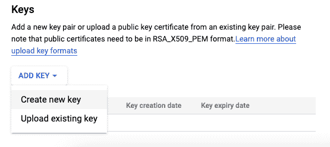

将下载的文件复制到服务器中的`storage/app`目录。我们稍后将使用它，以便我们可以连接到 Google Cloud PubSub。

接下来搜索“pubsub”。一旦你在那里，点击**创建主题**，并提供一个独特的主题名称。这将作为您要创建的订阅的容器:

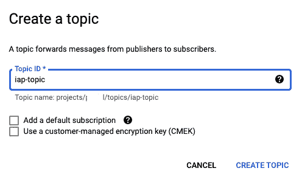

接下来，创建订阅。提供一个唯一的 ID 并选择您刚刚创建的主题。交付类型是 **Push** ，因为我们希望每当有人订阅应用程序时，PubSub 服务自动通知我们的服务器。输入通知将发送到的 URL 端点。您可以保留所有其他选项的默认值:

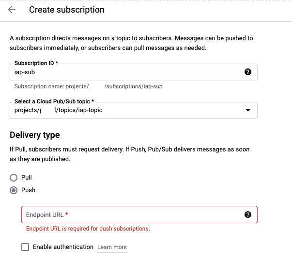

接下来，转到主题页面，点击您之前创建的主题旁边的三点图标，并选择**查看权限**:

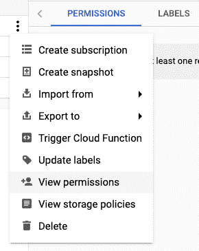

添加服务帐户`[[email protected]](/cdn-cgi/l/email-protection)`，并授予其**发布/订阅发布者**的角色。请务必保存更改:

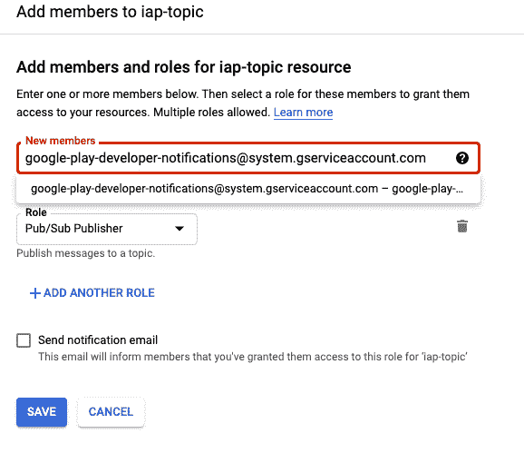

完成后，返回 Google Play 控制台，搜索“货币化设置”并点击第一个结果。你也可以滚动到侧边菜单的最底部，寻找相同的文本。

在主题名称字段中，以格式`projects/{project_id}/topics/{topic_id}`输入主题名称。点击当前选中的项目，可以看到`project_id`。而`topic_id`就是你之前进入的那个。

要进行测试，点击**发送测试通知**按钮发送样品通知。如果你没有得到任何错误，这意味着它的工作。请注意，从 Google Play 控制台发送测试通知不会向您在 Google Cloud PubSub 设置中指定的推送 URL 发送请求。因为只有当它是从应用程序触发的真实通知时，才会被触发。基本上，它的工作方式是这样的:

1.  用户通过应用程序订阅
2.  Google Play 会向您在货币化设置中指定的主题发送通知
3.  Google Cloud PubSub 收到通知，并向您指定的 URL 端点发送一个`POST`请求
4.  您的服务器接收它并相应地处理订阅(我们将在后面实现)

如果不管用，确保你没有错过任何一步。如果之后还是不行，可以在这里阅读完整文档— [配置实时开发者通知](https://developer.android.com/google/play/billing/getting-ready#configure-rtdn)。

### 添加许可证测试员

最后一步是添加许可证测试员。这使您可以在应用的测试版本中测试应用内购买，而不必支付您之前添加的订阅或一次性费用。

为此，请返回 Google Play 控制台，搜索“许可证测试”或在侧边菜单中查找。请注意，该菜单不在特定的应用程序内，因此您必须单击左上角的 Google Play 控制台徽标，然后在最底部附近查找“许可证测试”。

在该页面上，只需添加您用于测试的 Google 帐户的电子邮件:

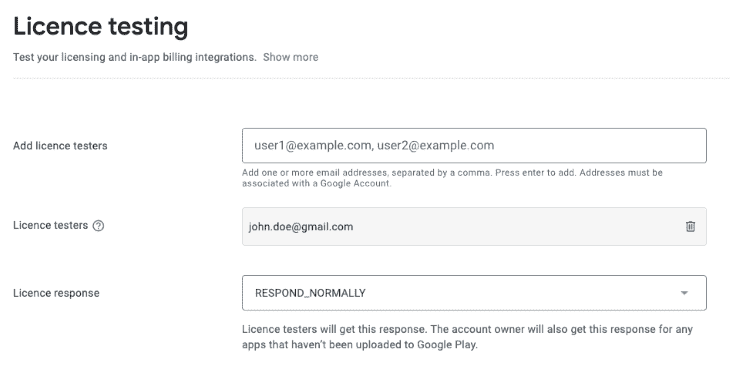

## 为 iOS 设置应用内购买

本节假设您具备以下条件:

一旦你进入应用的仪表盘，点击**应用内购买**菜单下的**管理**链接。

滚动到页面底部，直到找到“应用内购买”部分。单击 add 按钮，将显示以下模式。选择您想要的类型。在这种情况下，我们希望用户每月订阅一次，因此我们选择了**自动续费订阅**:

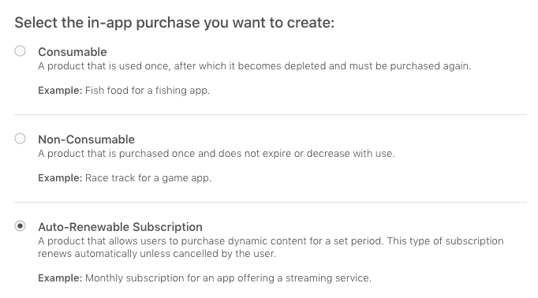

接下来，输入订阅计划的描述性名称及其唯一 ID。记下这个 ID，因为我们将在应用程序中引用它:

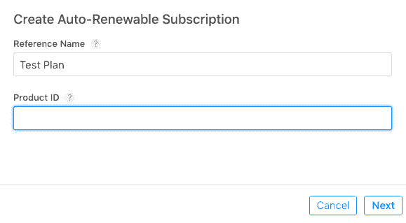

它也可能要求你把计划放在一个小组里。这样，所有相关的计划都可以组合在一起。只需输入该组的描述性名称。

一旦创建，当它的状态为“缺少元数据”时，您仍然不能使用它。要使其消失，您需要输入以下详细信息:

*   **订购期限** —订购在续订前持续多长时间？每次续订时，用户都必须支付相应的订购价格
*   **订阅价格** —订阅费用是多少？
*   **本地化** —订阅的描述性文本。如果您选择了订阅组，您还需要添加本地化来描述它
*   **审核信息** —当您将应用程序提交到 App Store 进行列表时，审核者将使用这些信息。它包括截图和一些描述订阅内容的文字。对于屏幕截图，他们要求应用程序中订阅屏幕的图像为 640 x 920

填写完以上内容后，应用内购买的状态将更新为“准备提交”。您现在应该能够使用它进行测试了。

最后一步是在 Xcode 上打开`ios/RNIAPSample.xcworkspace`文件，并添加**应用内购买**功能。为此，只需点击项目导航器(位于屏幕左上方关闭按钮的正下方)。点击项目然后选择**签约&能力**选项卡。然后点击 **+能力**按钮。在弹出的模态窗口中，搜索“应用内购买”并双击它。一旦添加，它应该被列为一项功能:

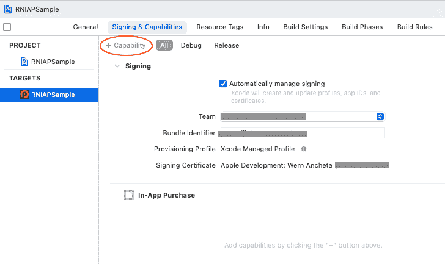

## 设置数据库模式

现在我们已经完成了所有的应用内购买设置，是时候继续进行一些服务器设置了。这一次，我们正在设置数据库和数据播种器。

更新默认用户迁移文件，删除所有不必要的字段，并添加我们将使用的字段:

```
// database/migrations/<timestamp>_create_users_table.php
Schema::create('users', function (Blueprint $table) {
    $table->id();
    $table->string('name');
    $table->string('email')->unique();
    $table->string('password');

    // $table->timestamp('email_verified_at')->nullable(); // remove this

    // add these:
    $table->string('gplay_order_token')->nullable();
    $table->string('gplay_order_id')->nullable();
    $table->string('apple_order_id')->nullable();

    $table->dateTime('datetime_subscribed')->nullable();
    $table->dateTime('lastpayment_datetime')->nullable();

    $table->rememberToken();
    $table->timestamps();
});

```

运行迁移:

```
php artisan migrate

```

这将创建`users`表和`personal_access_tokens`表。后者是我们存储移动认证的访问令牌的地方。移动应用中没有会话的概念，这就是我们使用令牌来验证用户身份的原因:

> 请注意，在本教程中，我们不需要密码重置表和失败的作业表。我们只是让它们保持原样，因为它们是默认迁移。

## 设置用户模型

现在让我们更新用户模型，以包含我们之前添加的新字段。当我们在这里的时候，你也可以从圣所添加特性，允许我们创建用户令牌。稍后我们将看到它的运行，但基本上它所做的是将`createToken()`方法添加到用户模型中:

```
// app/Models/User.php
<?php
// ..

use Illuminate\Notifications\Notifiable;
use Laravel\Sanctum\HasApiTokens;

class User extends Authenticatable
{
  use HasFactory, Notifiable, HasApiTokens; // add HasApiTokens trait

  protected $fillable = [
    // ...

    // add these:
    'gplay_order_token',
    'gplay_order_id',
    'apple_order_id',
    'datetime_subscribed',
    'lastpayment_datetime',
  ];

}

```

接下来，更新用户工厂，用以下内容替换其当前内容:

```
// database/factories/UserFactory.php

public function definition()
{
  return [
    'name' => $this->faker->name,
    'email' => $this->faker->unique()->safeEmail,
    'password' => '$2y$10$92IXUNpkjO0rOQ5byMi.Ye4oKoEa3Ro9llC/.og/at2.uheWG/igi', // password
    'remember_token' => Str::random(10),
  ];
}

```

取消注释数据库种子中的用户工厂:

```
// database/seeders/DatabaseSeeder.php
public function run()
{
    \App\Models\User::factory(10)->create(); // uncomment this
}

```

用用户记录填充数据库。这些人现在将作为我们的测试用户，我们可以使用他们登录应用程序并测试订阅:

```
php artisan db:seed

```

## 构建应用程序

现在我们终于准备好开始构建应用程序了。我们将首先构建登录屏幕，然后进入用户专用屏幕，如用户帐户屏幕和锁定屏幕。

### 登录屏幕

让我们从登录屏幕开始:

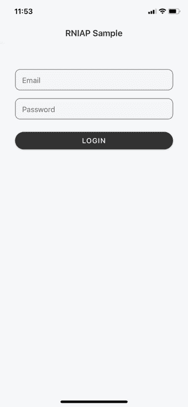

```
// src/screens/LoginScreen.js
import React, { useState, useCallback, useContext } from "react";
import { View, Text, StyleSheet, TouchableOpacity } from "react-native";

import { Button, TextInput, withTheme } from "react-native-paper";
import { SafeAreaView } from "react-native-safe-area-context";

import axios from "axios";
import * as SecureStore from "expo-secure-store";

import { AuthContext } from "../context/AuthContext";

import config from "../config";

const LoginScreen = ({ navigation, theme }) => {
  const [email, setEmail] = useState("");
  const [password, setPassword] = useState("");
  const [buttonloading, setButtonLoading] = useState(false);

  const { colors } = theme;

  const loginText = buttonloading ? "Logging in.." : "Login";

  const { signIn } = useContext(AuthContext);

  // next: add code for logging in     
};

export default withTheme(LoginScreen);

```

接下来，添加当用户单击登录按钮时执行的函数。在这里，我们执行以下操作:

1.  向服务器发送请求以获取用户令牌。我们将使用这个用户令牌来验证对服务器的进一步请求
2.  一旦我们得到响应，我们就使用`expo-secure-store`模块将令牌安全地存储在本地。这将允许我们在以后需要向服务器发出进一步请求时取回它
3.  从减速器发出`signIn`动作。这允许我们相应地更新用户界面:

    ```
    const login = useCallback(async () => {   const device_name = "some device"; // note: you can use Expo device here   setButtonLoading(true);    try {     const res = await axios.post(       `${config.BASE_URL}/api/sanctum/token`,       {         email,         password,         device_name,       }     );      if (res.data) {       const ok = await SecureStore.isAvailableAsync();       if (ok) {         const { token, is_subscribed } = res.data;         await SecureStore.setItemAsync("user_token", token);          signIn({           token,           is_subscribed,         });       }        setButtonLoading(false);     }   } catch (err) {     setButtonLoading(false);     alert(`Error occurred while trying to logins: ${err}`);   } }, [email, password]);
    ```

接下来，返回登录屏幕的 UI。这包括电子邮件和密码字段以及登录按钮:

```
return (
  <SafeAreaView
    style={[styles.container, { backgroundColor: colors.background }]}
  >
    <TextInput
      mode="outlined"
      style={styles.input}
      onChangeText={(text) => setEmail(text)}
      value={email}
      placeholder="Email"
      keyboardType="email-address"
    />

    <TextInput
      mode="outlined"
      style={styles.input}
      onChangeText={(text) => setPassword(text)}
      value={password}
      placeholder="Password"
      secureTextEntry
    />

    <Button
      mode="contained"
      onPress={login}
      style={styles.button}
      loading={buttonloading}
    >
      {loginText}
    </Button>
  </SafeAreaView>
);

```

添加样式:

```
const styles = StyleSheet.create({
  container: {
    flex: 1,
    paddingRight: 30,
    paddingLeft: 30,
    flexDirection: "column",
    alignItems: "center",
  },
  input: {
    fontSize: 15,
    height: 40,
    width: "100%",
    marginBottom: 10,
    backgroundColor: "#F5F5F7",
  },
  button: {
    padding: 0,
    marginTop: 15,
    width: "100%",
    borderRadius: 20,
  },
});

```

以下是`config.js`文件的内容:

```
// src/config.js
const config = {
  APP_TITLE: "RNIAP Sample",
  BASE_URL: "YOUR NGROK URL",
  IOS_SUBSCRIPTION_ID: "YOUR IOS SUBSCRIPTION ID",
  ANDROID_SUBSCRIPTION_ID: "YOUR GOOGLE PLAY SUBSCRIPTION ID",
};

export default config;

```

我们之前还导入了 AuthContext:

```
// src/context/AuthContext.js
import React from "react";
export const AuthContext = React.createContext();

```

这里实际上什么也没有，因为我们稍后会用`src/Root.js`文件中的方法填充它。

### 帐户屏幕

用户可以在帐户屏幕上订阅应用程序，以解锁高级功能。

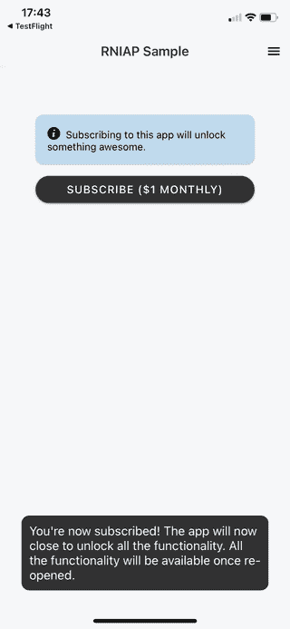

从导入我们需要的模块开始。这里最重要的是`expo-in-app-purchases`。这允许我们在 React 本地应用中实现 InApp 购买。没有这个模块，这个教程就不会存在。还有 [React 原生 IAP 库](https://github.com/dooboolab/react-native-iap)，不过我还没试过:

```
// src/screens/AccountScreen.js
import React, { useState, useEffect } from "react";
import { StyleSheet, Platform } from "react-native";
import { Button, Card, withTheme } from "react-native-paper";
import { SafeAreaView } from "react-native-safe-area-context";

import * as SecureStore from "expo-secure-store";
import { getProductsAsync, purchaseItemAsync } from "expo-in-app-purchases";
import axios from "axios";

import AlertBox from "../components/AlertBox";

import config from "../config";

const defaultAlertMessage = "Subscribing to this app will unlock something awesome.";

```

在我们继续之前，继续为`AlertBox`组件添加代码。这是唯一一个不包括在订阅流程中的，所以最好现在就添加:

```
// src/components/AlertBox.js
import React from "react";
import { View, Text, StyleSheet } from "react-native";
import { withTheme } from "react-native-paper";
import { Entypo } from "@expo/vector-icons";

const AlertBox = ({ text, theme }) => {
  const { colors } = theme;

  return (
    <View
      style={[
        styles.alert,
        {
          backgroundColor: colors.info,
        },
      ]}
    >
      <Text style={[styles.alertText, { color: colors.white }]}>
        <Entypo
          name="info-with-circle"
          size={17}
          color={colors.white}
        />
        {"  "}
        {text}
      </Text>
    </View>
  );
};

export default withTheme(AlertBox);

const styles = StyleSheet.create({
  alert: {
    padding: 15,
    marginBottom: 15,
    borderRadius: 10,
  },
  alertText: {
    fontSize: 13,
  },
});

```

回到帐户屏幕，我们通过向服务器发出请求来检查用户的订阅状态。这是我们使用之前从登录屏幕获得的用户令牌的地方:

```
// src/screens/AccountScreen.js
const AccountScreen = ({ navigation, theme }) => {
  const { colors } = theme;

  const [alertMessage, setAlertMessage] = useState(defaultAlertMessage);
  const [subscribed, setSubscribed] = useState(false);

  const [subscribeButtonLoading, setSubscribeButtonLoading] = useState(false);

  const subscribeText = subscribeButtonLoading ? "Subscribing..." : "Subscribe ($1 monthly)";

  useEffect(() => {
    (async () => {
      try {
        const token = await SecureStore.getItemAsync("user_token");

        const instance = axios.create({
          baseURL: `${config.BASE_URL}/api`,
          timeout: 5000,
          headers: { Authorization: `Bearer ${token}` },
        });

        const res = await instance.get("/user");
        if (res.data.is_subscribed === "yes") {
          setSubscribed(true);
          setAlertMessage(" You are subscribed for $1/month.");
        }
      } catch (err) {
        alert("Problem ocurred while getting user info." + err);
      }
    })();
  }, []);

  // next: add code for subscribing user
}

```

接下来，添加订阅用户的代码。这是我们使用`expo-in-app-purchases`模块接受用户付款的地方。在 Android 上，这使用了 [Google Play 计费](https://developer.android.com/google/play/billing/integrate)库。而在 iOS 上，它使用的是 [Storekit](https://developer.apple.com/documentation/storekit) 框架。

首先，我们获取您之前在 Google Play 开发者仪表盘和 Apple Store Connect 仪表盘上创建的订阅计划。我们使用`getProductsAsync()`来做这件事。在`Platform.select()`的帮助下，我们能够根据设备的操作系统选择正确的订阅计划。如果您的计划在两个平台上有相同的 ID，就没有必要这样做。下面的代码也在做类似的事情。在这种情况下，我们使用`Platform.OS`来确定当前平台。一旦我们获取了订阅计划并且知道它存在，我们就调用`purchaseItemAsync()`方法来初始化购买。

> 注意，调用`getProductsAsync()`方法是购买/订阅产品的先决条件。即使事先已经知道了订阅 ID，还是要做。在实际操作之前，把它想象成与苹果/谷歌服务器的握手。

```
const subscribe = async () => {
  setSubscribeButtonLoading(true);

  try {
    const items = Platform.select({
      ios: [config.IOS_SUBSCRIPTION_ID],
      android: [config.ANDROID_SUBSCRIPTION_ID],
    });

    const subscription_plan = Platform.OS === "android" ? config.ANDROID_SUBSCRIPTION_ID : config.IOS_SUBSCRIPTION_ID;

    const products = await getProductsAsync(items);

    if (products.results.length > 0) {
      setSubscribeButtonLoading(false);
      await purchaseItemAsync(subscription_plan);
    } else {
      setSubscribeButtonLoading(false);
    }
  } catch (err) {
    setSubscribeButtonLoading(false);
    alert("error occured while trying to purchase: " + err);
  }
};

```

下一步是倾听购买。我们不能从帐户屏幕上这样做，因为在它到达那个屏幕之前，它必须通过许多其他代码。到那时，交易将已经被标记为“完成”。我们需要监听未完成的事务，这样我们就可以向服务器发出请求及其详细信息。

监听购买交易的最佳位置是入口点文件。首先导入我们需要的所有模块:

```
// index.js
import { registerRootComponent } from "expo";

import {
  connectAsync,
  setPurchaseListener,
  finishTransactionAsync,
  IAPResponseCode,
} from "expo-in-app-purchases";

import RNRestart from "react-native-restart";
import Toast from "react-native-simple-toast";
import * as SecureStore from "expo-secure-store";

import { Platform } from "react-native";
import axios from "axios";

import App from "./App";

import config from "./src/config";

```

接下来，创建一个[立即调用的函数表达式(life)](https://developer.mozilla.org/en-US/docs/Glossary/IIFE)。这是我们:

1.  调用`connectAsync()` —这连接到应用程序商店或谷歌 Play 商店来初始化应用程序，以便它能够接受支付。如果不调用这个函数，前面帐户屏幕中的所有代码都将不起作用
2.  使用`setPurchaseListener()`监听购买——每次有新的购买交易时，都会执行您传递给它的回调函数。如果我们得到的响应代码是成功的(例如，支付交易是成功的)，我们才进一步处理它。否则，我们通知用户它失败了。发生这种情况有两个常见原因，用户取消或支付失败
3.  如果响应代码是成功的，我们将遍历结果并检查尚未被确认的代码
4.  在特定的`purchase`上调用`finishTransactionAsync()`方法——该方法还需要第二个参数，即`consumeItem`。这里传递的内容将取决于当前的平台。在安卓系统中，需要设置为`false`。而在 iOS 中，应该设置为`true`。这是因为在 Android 中，有一个“消费”购买的概念。这是一次性付款的事情，以解锁特定的功能或项目，如你在游戏中看到的。将`consumeItem`设置为`false`意味着它是订阅而不是消耗品。而在 iOS 中，这是不必要的，所以`consumeItem`有不同的含义。您需要将其设置为`true`,以便将事务标记为“完成”,防止它再次触发购买监听器回调
5.  由于我们没有能力从索引文件导航到特定的屏幕，我们所能做的就是重新加载应用程序。这也允许我们用用户的新订阅状态来刷新它。在你这样做之前，一定要用类似祝酒词的信息通知用户:

    ```
    (async function init() {   try {     await connectAsync();      setPurchaseListener(async ({ responseCode, results, errorCode }) => {       if (responseCode === IAPResponseCode.OK) {          results.forEach(async (purchase) => {           if (!purchase.acknowledged) {             const {               orderId,               purchaseToken,               acknowledged,               transactionReceipt,               productId,             } = purchase;              const consumeItem = Platform.OS === "ios";             await finishTransactionAsync(purchase, consumeItem);              const token = await SecureStore.getItemAsync(               "user_token"             );              const instance = axios.create({               baseURL: `${config.BASE_URL}/api`,               timeout: 5000,               headers: { Authorization: `Bearer ${token}` },             });              instance.post("/subscribe", {               orderId,               purchaseToken,               transactionReceipt,               platform: Platform.OS,             });                          Toast.show(               "You're now subscribed! The app will now close to unlock all the functionality. All the functionality will be available once re-opened.",               Toast.LONG             );              setTimeout(() => {               RNRestart.Restart();             }, 5000);           }         });       } else {         alert(generalErrorMessage);       }        if (responseCode === IAPResponseCode.USER_CANCELED) {         alert("You cancelled. Please try again.");       } else if (responseCode === IAPResponseCode.DEFERRED) {         alert(           "You don't have permission to subscribe. Please use a different account."         );       }     });   } catch (err) {     alert("Error occurred: " + JSON.stringify(err));   } })();
    ```

稍后我们将在服务器中添加处理订阅的代码。现在，让我们继续把所有的代码放在一起，这样我们就有了一个功能应用程序。

### 将这一切结合在一起

是时候把所有东西都集中起来了。创建一个`App.js`文件并添加以下内容:

```
// App.js
import { StatusBar } from "expo-status-bar";
import React from "react";
import { StyleSheet, View } from "react-native";
import Root from "./src/Root";

export default function App() {
  return (
    <View style={styles.container}>
      <StatusBar style="auto" />
      <Root />
    </View>
  );
}

const styles = StyleSheet.create({
  container: {
    flex: 1,
    justifyContent: "center",
  },
});

```

接下来，创建一个`Root.js`文件。这就是我们实际上把所有东西集合在一起的地方。因为这是我们设置导航的地方，所以所有的屏幕都必须导入。默认情况下，我们显示一个闪屏。这将作为应用程序确定用户是否登录时的临时屏幕。如果用户当前已登录，我们将显示锁定屏幕(该屏幕的内容在用户订阅之前是锁定的)。否则，我们将显示登录屏幕:

```
// Root.js
import React, { useEffect, useState, useReducer, useMemo } from "react";
import { createStackNavigator } from "@react-navigation/stack";
import { createDrawerNavigator } from "@react-navigation/drawer";
import { View, Text } from "react-native";
import { DefaultTheme, Provider as PaperProvider } from "react-native-paper";

import * as SecureStore from "expo-secure-store";
import axios from "axios";

import config from "./config";

import {
  NavigationContainer,
  DefaultTheme as NavigationDefaultTheme,
} from "@react-navigation/native";

import { DrawerContent } from "./components/DrawerContent";

import SplashScreen from "./screens/SplashScreen";

import HomeStackScreen from "./screens/HomeStackScreen";

import MainStackScreen from "./screens/MainStackScreen";
import AccountStackScreen from "./screens/AccountStackScreen";

import { AuthContext } from "./context/AuthContext";

const theme = {
  ...DefaultTheme,
  dark: true,
  roundness: 10,
  colors: {
    ...DefaultTheme.colors,
    background: "#F6F8FA",
    primary: "#333",
    info: "#BFD9EC",
  },
  fonts: {
    ...DefaultTheme.fonts,
    regular: 15,
  },
};

const MainStack = createStackNavigator();
const Drawer = createDrawerNavigator();

```

接下来，我们使用`useReducer()`钩子来描述基于当前动作的状态。在这种情况下，我们有三种状态:

1.  `RESTORE_TOKEN`–这是用户登录时的状态
2.  `SIGN_IN`–用户登录时的状态。这是未登录和已登录之间的转换状态
3.  `LOGOUT`–用户注销时的状态。这会将状态更新为默认值，从而显示登录屏幕:

    ```
    const App = () => {   const [loading, setLoading] = useState(true);    const [state, dispatch] = useReducer(     (prevState, action) => {       switch (action.type) {         case "RESTORE_TOKEN":           return {             ...prevState,             userToken: action.token,             isLoading: false,             isSubscribed: action.is_subscribed,           };          case "SIGN_IN":           return {             ...prevState,             userToken: action.token,             isSubscribed: action.is_subscribed,           };          case "LOGOUT":           return {             ...prevState,             userToken: null,             isLoading: false,           };       }     },     {       isLoading: true,       userToken: null,     }   ); }
    ```

接下来，我们使用`useEffect()`来检查用户是否在服务器中订阅。这是我们分派`RESTORE_TOKEN`动作的地方，这样锁定的屏幕将被显示，而不是登录屏幕:

```
useEffect(() => {
  (async () => {
    try {
      const token = await SecureStore.getItemAsync("user_token");

      if (token) {
        const instance = axios.create({
          baseURL: `${config.BASE_URL}/api/`,
          timeout: 60000,
          headers: { Authorization: `Bearer ${token}` },
        });

        const res = await instance.get("/user");
        const is_subscribed = res.data.is_subscribed == "yes";

        dispatch({ type: "RESTORE_TOKEN", token, is_subscribed });
      }

      setLoading(false);
    } catch (err) {
      setLoading(false);
    }
  })();
}, []);

```

接下来，在`useMemo()`钩子中，声明我们之前创建的 reducer 将使用的动作。对于`signOut`动作，我们请求服务器让用户退出。这将撤销用户登录时颁发的令牌。它还负责从本地存储中删除用户令牌。最后，它分派了`SIGN_OUT`动作，因此用户看到的是登录屏幕:

```
const authContext = useMemo(
  () => ({
    signIn: (data) => {
      dispatch({
        type: "SIGN_IN",
        token: data.token,
        is_subscribed: data.is_subscribed,
      });
    },
    signOut: async () => {
      try {
        const token = await SecureStore.getItemAsync("user_token");

        const instance = axios.create({
          baseURL: `${config.BASE_URL}/api`,
          timeout: 60000,
          headers: { Authorization: `Bearer ${token}` },
        });

        const signout_res = await instance.post("/signout");
        await SecureStore.deleteItemAsync("user_token");

        dispatch({ type: "LOGOUT" });
      } catch (err) {
        console.log("error: ", err);
      }
    },
  }),
  []
);

```

最后，添加返回 UI 的代码。这使用一个`DrawerNavigator`作为根导航器，一个`StackNavigator`用于每个单独的屏幕:

```
if (loading) {
  return (
    <SplashScreen
      bgColor={theme.colors.background}
      color={theme.colors.primary}
    />
  );
}

return (
  <PaperProvider theme={theme}>
    <AuthContext.Provider value={authContext}>
      <NavigationContainer theme={theme}>
        <Drawer.Navigator
          title="app-drawer"
          drawerPosition="right"
          edgeWidth={-1}
          drawerContent={(props) => {
            if (state.userToken) {
              return <DrawerContent {...props} />;
            }
            return null;
          }}
        >
          {state.userToken === null && (
            <Drawer.Screen
              name="HomeStack"
              component={HomeStackScreen}
            />
          )}

          <React.Fragment>
            {state.userToken !== null && (
              <React.Fragment>
                <Drawer.Screen
                  name="MainStack"
                  component={MainStackScreen}
                />
                <Drawer.Screen
                  name="AccountStack"
                  component={AccountStackScreen}
                />
              </React.Fragment>
            )}
          </React.Fragment>
        </Drawer.Navigator>
      </NavigationContainer>
    </AuthContext.Provider>
  </PaperProvider>
);

```

现在让我们为之前在`Root.js`文件中导入的组件和屏幕添加代码。

下面是`SplashScreen`的代码:

```
// src/screens/SplashScreen.js
import React from "react";
import { View, ActivityIndicator, StyleSheet } from "react-native";

const SplashScreen = ({ bgColor, color }) => {
  return (
    <View style={[styles.container, { backgroundColor: bgColor }]}>
      <ActivityIndicator size="large" color={color} />
    </View>
  );
};

export default SplashScreen;

const styles = StyleSheet.create({
  container: {
    flex: 1,
    alignItems: "center",
    justifyContent: "center",
  },
});

```

这里是`HomeStackScreen`的代码。这是登录屏幕的堆栈导航器:

```
// src/screens/HomeStackScreen.js
import React from "react";
import { createStackNavigator } from "@react-navigation/stack";
import { withTheme } from "react-native-paper";

import LoginScreen from "./LoginScreen";

import config from "../config";

const HomeStack = createStackNavigator();

const HomeStackScreen = ({ navigation, theme }) => {
  const { colors } = theme;
  return (
    <HomeStack.Navigator>
      <HomeStack.Screen
        name="Login"
        component={LoginScreen}
        options={{
          title: config.APP_TITLE,
          headerLeft: null,
          headerTitleStyle: {
            color: colors.primary,
          },
        }}
      />
    </HomeStack.Navigator>
  );
};

export default withTheme(HomeStackScreen);

```

下面是`DrawerContent`组件的代码。它负责呈现抽屉导航器的内容，并导航到应用程序的特定屏幕。它还负责调度`signOut`动作:

```
// src/components/DrawerContent.js
import React, { useCallback, useContext } from "react";
import { View, StyleSheet } from "react-native";
import { useTheme, Drawer } from "react-native-paper";
import { DrawerContentScrollView, DrawerItem } from "@react-navigation/drawer";

import { MaterialCommunityIcons } from "@expo/vector-icons";
import { MaterialIcons } from "@expo/vector-icons";

import { AuthContext } from "../context/AuthContext";

const icon_color = "#FFF";

export const DrawerContent = (props) => {
  const { signOut } = useContext(AuthContext);

  const logout = useCallback(() => {
    try {
      props.navigation.closeDrawer();
      signOut();
    } catch (err) {
      alert(
        "An error ocurred while trying to sign out. Please try again."
      );
    }
  }, []);

  return (
    <View style={styles.container}>
      <DrawerContentScrollView {...props}>
        <View style={styles.drawerContent}>
          <Drawer.Section style={styles.drawerSection}>
            <DrawerItem
              icon={({ color, size }) => (
                <MaterialCommunityIcons
                  name="lock"
                  size={24}
                  color={icon_color}
                />
              )}
              label="Locked"
              labelStyle={styles.label}
              onPress={() => {
                props.navigation.navigate("Locked");
              }}
            />
            <DrawerItem
              icon={({ color, size }) => (
                <MaterialIcons
                  name="person"
                  size={24}
                  color={icon_color}
                />
              )}
              label="Account"
              labelStyle={styles.label}
              onPress={() => {
                props.navigation.navigate("AccountStack");
              }}
            />

            <DrawerItem
              icon={({ color, size }) => (
                <MaterialCommunityIcons
                  name="logout"
                  size={24}
                  color={icon_color}
                />
              )}
              label="Sign Out"
              labelStyle={styles.label}
              onPress={logout}
            />
          </Drawer.Section>
        </View>
      </DrawerContentScrollView>
    </View>
  );
};

const styles = StyleSheet.create({
  container: {
    flex: 1,
    backgroundColor: "#333",
  },
  drawerContent: {
    flex: 1,
  },
  drawerSection: {
    marginTop: 15,
  },
  label: {
    fontSize: 16,
    color: "#FFF",
  },
});

```

这里是`MainStackScreen`的代码。这是`LockedStackScreen`的抽屉导航器:

```
// src/screens/MainStackScreen.js
import React from "react";
import { createStackNavigator } from "@react-navigation/stack";
import { IconButton, withTheme } from "react-native-paper";

import LockedStackScreen from "./LockedStackScreen";

const MainStack = createStackNavigator();

import config from "../config";

const MainStackScreen = ({ navigation, theme }) => {
  const { colors } = theme;

  return (
    <MainStack.Navigator>
      <MainStack.Screen
        name="MainStack"
        component={LockedStackScreen}
        options={{
          title: config.APP_TITLE,
          headerTitleStyle: {
            color: colors.primary,
          },
          headerRight: () => (
            <IconButton
              icon="menu"
              size={20}
              color={colors.white}
              onPress={() => navigation.openDrawer()}
            />
          ),
        }}
      />
    </MainStack.Navigator>
  );
};

export default withTheme(MainStackScreen);

```

这里是`LockedStackScreen`的代码。这是`LockedScreen`的堆栈导航器:

```
// src/screens/LockedStackScreen.js
import React from "react";
import { createStackNavigator } from "@react-navigation/stack";

const LockedStack = createStackNavigator();

import LockedScreen from "./LockedScreen";

const CalcStackScreen = ({ navigation }) => {
  return (
    <LockedStack.Navigator headerMode="none">
      <LockedStack.Screen name="Locked" component={LockedScreen} />
    </LockedStack.Navigator>
  );
};

export default CalcStackScreen;

```

最后，我们有`LockedScreen`。用户可以从抽屉导航访问该屏幕，但如果他们没有订阅，则无法看到其内容。如果用户订阅了，这是它唯一一次向服务器请求获取锁定的内容:

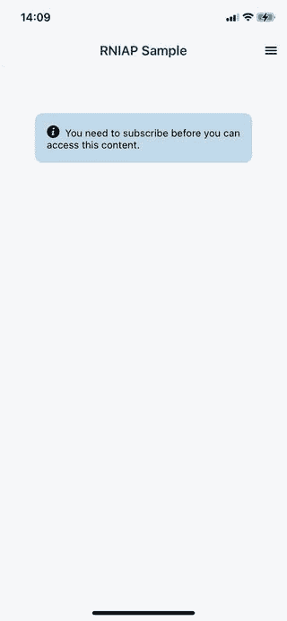

下面是`LockedScreen`的代码:

```
// src/screens/LockedScreen.js
import React, { useState, useEffect } from "react";
import { Image, StyleSheet } from "react-native";
import { Card, Button, withTheme } from "react-native-paper";
import { SafeAreaView } from "react-native-safe-area-context";

import * as SecureStore from "expo-secure-store";
import axios from "axios";
import { Entypo } from "@expo/vector-icons";

import AlertBox from "../components/AlertBox";

import config from "../config";

const LockedScreen = ({ navigation, theme }) => {
  const { colors } = theme;

  const [subscribed, setSubscribed] = useState(false);
  const [content, setContent] = useState(null);

  useEffect(() => {
    (async () => {
      try {
        const token = await SecureStore.getItemAsync("user_token");
        const instance = axios.create({
          baseURL: `${config.BASE_URL}/api`,
          timeout: 5000,
          headers: { Authorization: `Bearer ${token}` },
        });

        const res = await instance.get("/user");

        if (res.data.is_subscribed === "yes") {
          setSubscribed(true);
          const content_res = await instance.get("/locked");
          setContent(content_res.data);
        }
      } catch (err) {
        alert("Problem ocurred while getting user info.");
      }
    })();
  }, []);

  return (
    <SafeAreaView style={styles.container}>
      <Card style={[styles.card, { backgroundColor: colors.card }]}>
        <Card.Content>
          {subscribed && (
            <Image
              resizeMode="contain"
              style={styles.image}
              source={{
                uri: content,
              }}
            />
          )}
          {!subscribed && (
            <AlertBox text="You need to subscribe before you can access this content." />
          )}
        </Card.Content>
      </Card>
    </SafeAreaView>
  );
};

export default withTheme(LockedScreen);

const styles = StyleSheet.create({
  container: {
    flex: 1,
    paddingRight: 30,
    paddingLeft: 30,
    flexDirection: "column",
  },
  card: {
    marginBottom: 20,
  },
  image: {
    width: "100%", 
    height: 200
  }
});

```

## 添加服务器代码

现在是继续服务器端工作的时候了。我们之前只做了一点设置，但是我们还没有实现以下内容:

*   用户认证
*   Android 订阅
*   iOS 订阅
*   提供锁定的内容数据

### 处理用户授权

首先让我们实现用户认证。将以下代码添加到 API 路由文件中:

```
<?php
// routes/api.php

use Illuminate\Http\Request;
use Illuminate\Support\Facades\Route;

use App\Http\Controllers\AccountController;
use App\Http\Controllers\TokenController;

Route::middleware('auth:sanctum')->group(function () {
    Route::get('/user', [AccountController::class, 'get']);
    Route::post('/signout', [AccountController::class, 'signout']);
});

Route::post('/sanctum/token', [TokenController::class, 'get']);

```

创建控制器:

```
php artisan make:controller AccountController
php artisan make:controller TokenController

```

这里是`TokenController`的代码。它负责根据请求中提供的电子邮件和密码返回用户令牌。它利用了我们之前在用户模型中添加的`createToken()`方法。该令牌保存在数据库中，因此在一段时间内有效:

```
<?php
// app/Http/Controllers/TokenController.php

namespace App\Http\Controllers;

use Illuminate\Http\Request;
use Illuminate\Support\Facades\Hash;
use Illuminate\Validation\ValidationException;
use App\Models\User;

class TokenController extends Controller
{
    public function get(Request $request)
    {
        $request->validate([
            'email' => 'required|email',
            'password' => 'required',
            'device_name' => 'required',
        ]);

        $user = User::where('email', $request->email)->first();

        if (!$user || ! Hash::check($request->password, $user->password)) {
            throw ValidationException::withMessages([
                'email' => ['The provided credentials are incorrect.'],
            ]);
        }

        return [
            'is_subscribed' => $user->isSubscribed() ? "yes" : "no",
            'token' => $user->createToken($request->device_name)->plainTextToken,
            'email' => $user->email,
            'name' => $user->name,
        ];
    }
}

```

接下来，我们实现获取用户数据和注销。它们都包含在`auth:sanctum`中间件中，所以它们期望用户令牌被传入。如果令牌有效，则执行方法中的代码。中间件修改请求数据，这样我们可以调用`Request`对象中的`user()`方法来访问用户的数据:

```
<?php

namespace App\Http\Controllers;

use Illuminate\Http\Request;

class AccountController extends Controller
{
    public function get(Request $request)
    {
        $user = $request->user();
        $user->is_subscribed = $user->isSubscribed() ? 'yes' : 'no';
        return $user;
    }

    // next: add signout method
}

```

为了注销用户，我们在用户对象上调用`tokens()→delete()`方法。这将从`personal_access_tokens`表中删除该用户的所有令牌条目:

```
public function signout(Request $request)
{
    $request->user()->tokens()->delete();
    return 'ok';
}

```

### 在 Android 中处理订阅

在 Android 中处理订阅有两个步骤:

1.  当应用程序向`/subscribe`路线发出请求时，将购买令牌和订单 ID 保存在数据库中
2.  侦听 Google Cloud PubSub 发送的通知，并更新上一步中创建的数据。这是我们将用户标记为已订阅的地方

第一步添加第二步所需的数据。而第二步验证来自第一步的数据。我们将使用之前安装的`google/cloud-pubsub`包来处理 Google Cloud PubSub 发送的通知。

首先，将`/subscribe`路由添加到 API 路由中:

```
// routes/api.php

// ..
use App\Http\Controllers\TokenController;
use App\Http\Controllers\SubscriptionController; // add this

Route::middleware('auth:sanctum')->group(function () {
  // ..
  Route::post('/signout', [AccountController::class, 'signout']);
  Route::post('/subscribe', [SubscriptionController::class, 'subscribe']); // add this
});

```

接下来，创建订阅控制器:

```
php artisan make:controller SubscriptionController

```

添加处理订阅请求的代码。这将捕获应用程序传递的`purchaseToken`和`orderId`:

```
<?php
// app/Http/Controllers/SubscriptionController.php

namespace App\Http\Controllers;

use Illuminate\Http\Request;
use Illuminate\Support\Facades\Http;

class SubscriptionController extends Controller
{
    public function subscribe(Request $request) {
        $platform = request('platform');
        $receipt = null;
        $purchase_token = request('purchaseToken');
        $order_id = request('orderId');

        $user = $request->user();
        $this->verifySubscription($user, $platform, $purchase_token, $order_id, $receipt);
        return 'ok';
    }

    // next: add verifySubscription()
}

```

接下来，添加用于更新用户订阅数据的代码。上面写着`verifySubscription()`,因为我们稍后会更新它，以便处理 iOS 订阅:

```
private function verifySubscription($user, $platform, $purchase_token, $order_id, $receipt = null) {

    $gplay_data = [
        'gplay_order_token' => $purchase_token,
        'gplay_order_id' => $order_id,
    ];

    $user->update($gplay_data);

}

```

接下来是第二步。这是我们监听 Google Cloud PubSub 请求的地方。打开`routes/web.php`文件并更新将处理它的路线:

```
// routes/web.php
use Illuminate\Support\Facades\Route;
use App\Http\Controllers\PubsubController;

Route::post('/pubsub', [PubsubController::class, 'subscribe']);

```

创建控制器:

```
php artisan make:controller PubsubController

```

向其中添加以下代码:

```
<?php
// app/Http/Controllers/PubsubController.php
namespace App\Http\Controllers;

use Illuminate\Http\Request;
use Google\Cloud\PubSub\PubSubClient;
use App\Jobs\SubscribeUser;

class PubsubController extends Controller
{
    public function subscribe()
    {
        $project_id = config('services.google_cloud.project_id');
        $config_path = config('service.google_cloud.config_path');

        $key_file = file_get_contents(storage_path($config_path)); 
        $pubsub = new PubSubClient([
            'projectId' => $project_id,
            'keyFile' => json_decode($key_file, true)
        ]);

        $req_body = file_get_contents('php://input');
        $req_data = json_decode($req_body, true);

        $data = json_decode(base64_decode($req_data\['message'\]['data']), true);

        $purchase_token = $data\['subscriptionNotification'\]['purchaseToken'];

        $pubsub->consume($req_data);

        SubscribeUser::dispatch($purchase_token)->delay(now()->addSeconds(5));

        return 'ok';
    }
}

```

上面的代码可以总结为三个步骤:

1.  获取通知中传递的数据。我们需要使用`base64_decode()`来理解数据，因为它已经被编码了
2.  通过向通知传递请求数据来使用通知
3.  将负责更新用户现在订阅的数据库的作业排队。我们增加了 5 秒钟的延迟，以确保移动应用程序已经完成初始化需要更新的记录。在这种情况下，它是用户的订阅记录

我们还没有创建`SubscribeUser`任务。继续这样做:

```
php artisan make:job SubscribeUser

```

向其中添加以下代码:

```
<?php
// app/Jobs/SubscribeUser.php

namespace App\Jobs;

use Illuminate\Bus\Queueable;
use Illuminate\Contracts\Queue\ShouldQueue;
use Illuminate\Foundation\Bus\Dispatchable;
use Illuminate\Queue\InteractsWithQueue;
use Illuminate\Queue\SerializesModels;

use App\Models\User;

class SubscribeUser implements ShouldQueue
{
    use Dispatchable, InteractsWithQueue, Queueable, SerializesModels;

    private $notification_type;
    private $purchase_token;

    public function __construct($notification_type, $purchase_token)
    {
        $this->notification_type = $notification_type;
        $this->purchase_token = $purchase_token;
    }

    public function handle()
    {
        $subscribe_codes = [1, 2, 4, 7];
        $unsubscribe_codes = [3, 5, 10, 12, 13];

        $user = User::where('gplay_order_token', $this->purchase_token)
            ->first();

        if ($user) {
            if (in_array($this->notification_type, $subscribe_codes)) {
                $user->setSubscribed()->save();
            }

            if (in_array($this->notification_type, $unsubscribe_codes)) {
                $user->setUnsubscribed()->save();
            }
        }
    }
}

```

在上面的代码中，当作业被执行时，`handle()`方法被调用。这是我们检查通知类型的地方。为了简单起见，我们只处理订阅和取消通知类型。这允许我们切换用户状态，无论他们当前是订阅还是未订阅。

对于我们的订购代码:

*   (1)订阅 _ 恢复
*   (2)订阅 _ 续订
*   (4)订阅 _ 已购买
*   (7)订阅 _ 重启

对于退订代码，我们有:

*   (3)订阅 _ 取消
*   (5)在暂停的认购
**   (10)订阅 _ 暂停*   (12)认购 _ 撤销*   (13)订阅 _ 过期*

 *您可以在文档[实时开发人员通知参考指南](https://developer.android.com/google/play/billing/rtdn-reference#sub)中了解有关各种通知类型的更多信息。

更新用户模型以包含`setSubscribed()`方法。这会将`lastpayment_datetime`字段更新为当前日期时间。每次更新用户的订阅时，都需要更新该字段。这将允许我们使用该字段作为确定用户是否仍然订阅的基础。值得庆幸的是，Google PubSub 会在每次用户的订阅更新时发送通知，所以不需要编写额外的代码来处理这一点:

```
// app/Models/User.php
protected $fillable = [
  // ..
];

public function setSubscribed()
{
    $this->datetime_subscribed = now();
    $this->lastpayment_datetime = now()->toDateTimeString();

    return $this;
}

```

接下来，添加将用户设置为取消订阅的方法。这里，我们简单地将`datetime_subscribed`和`last_payment_date`设置为`null`。这将有效地停用用户的高级功能。注意，我们没有更新`gplay_order_id`和`gplay_order_token`，因为它们被用作通知的基础。没有它，服务器就不知道该更新哪个用户。它们不会在重新订阅或续订现有订阅时发生变化，因此非常适合我们的目的:

```
public function setUnsubscribe()
{
    $this->datetime_subscribed = null;
    $this->last_payment_date = null;
    return $this;
}

```

最后，添加 Google 项目的配置。`project_id`是你在谷歌云控制台仪表盘上看到的 URL 中的`project`值。而`config_path`是您之前保存服务帐户配置文件的路径。它在`storage/app`目录中，所以你可以简单地称它为`app/filename.json`，因为`storage_path()`返回到`storage`目录的路径:

```
// config/services.php
'google_cloud' => [
  'project_id' => env('GOOGLE_PROJECT_ID'),
  'config_path' => 'app/filename.json',
],

// .env
GOOGLE_PROJECT_ID="YOUR GOOGLE PROJECT ID"

```

### 在 iOS 中处理订阅

为了处理 iOS 订阅，我们需要处理之前从应用程序传递的`transactionReceipt`。请求也将被发送到`/subscribe`路由，因此它使用我们之前创建的相同的`verifySubsription()`方法。继续使用以下代码更新现有代码:

```
// app/Http/Controllers/SubscriptionController.php

private function verifySubscription($user, $platform, $purchase_token, $order_id, $receipt = null) {
    $apple_iap_shared_secret = config('services.apple_iap.shared_secret');
    $apple_iap_live_url = config('services.apple_iap.live_url');
    $apple_iap_sandbox_url = config('services.apple_iap.sandbox_url');

    if ($platform === 'ios') {

        $req_body = json_encode([
            'receipt-data' => $receipt,
            'password' => $apple_iap_shared_secret,
            'exclude-old-transactions' => true
        ]);

        $response_data = $this->sendRequest($apple_iap_live_url, $req_body);
        if ($response_data['status'] === 21007) {
            $response_data = $this->sendRequest($apple_iap_sandbox_url, $req_body);
        }

        $latest_receipt_info = $response_data\['latest_receipt_info'\][0];
        $expire_in_ms = (int) $latest_receipt_info['expires_date_ms'];
        $expire = $expire_in_ms / 1000;
        $current_timestamp = now()->timestamp;

        if ($current_timestamp < $expire) {
            $user->update([
                'datetime_subscribed' => now(),
                'lastpayment_datetime' => now()->toDateTimeString(),
                'apple_order_id' => $latest_receipt_info['transaction_id']
            ]);
        }

    } else if ($platform === 'android') {
        $gplay_data = [
            'gplay_order_token' => $purchase_token,
            'gplay_order_id' => $order_id,
        ];

        $user->update($gplay_data);
    }
}

// next: add sendRequest() method

```

在上面的代码中，我们正在用苹果的服务器验证收据数据确实有效并且还没有过期。这要求我们传递一个包含以下内容的 JSON 字符串:

*   `receipt-data` —从应用程序传递的`transactionReceipt`值
*   `password` —应用内购买的密码。您可以从 App Store Connect 获得此信息。从您的应用程序页面，选择有问题的应用程序。然后在应用内购买下，点击**管理**。点击**特定于应用程序的共享秘密**，生成您可以提供给该字段的密码
*   `exclude-old-transactions` —将其设置为`true`，这样您就不会得到任何旧的事务

我们验证实时和沙盒 URL 上的`transactionReceipt`。通过这种方式，我们可以只使用一个处理程序来验证 iOS 订阅。我们先用真实的验证，如果失败了，我们就用沙盒 URL。如果我们得到一个响应代码`21007`，我们就知道这个请求是无效的。

对于有效的响应，您将得到一个`latest_receipt_info`字段。从中提取第一个项目，以获取该特定购买的最新收据的数据。

然后，我们提取`expires_date_ms`并除以`1000`以获得实际的时间戳值，我们可以将其与选择的日期库的当前时间戳值进行比较(例如[碳](https://carbon.nesbot.com/))。如果结果值大于当前时间戳，这意味着它仍然有效。

下面是`sendRequest()`方法:

```
private function sendRequest($url, $req_body) {
    $response = Http::withBody($req_body, 'application/json')->post($url);
    $response_data = $response->json();

    return $response_data;
}

```

最后，添加 iOS 的配置:

```
// config/services.php
'apple_iap' => [
  'shared_secret' => env('APPLE_IAP_SECRET'),
  'live_url' => 'https://buy.itunes.apple.com/verifyReceipt',
  'sandbox_url' => 'https://sandbox.itunes.apple.com/verifyReceipt',
],

// .env
APPLE_IAP_SECRET="YOUR IN APP PURCHASES SHARED SECRET"

```

### 返回锁定内容的数据

难题的最后一部分是为锁定的内容添加控制器。这是可选的，因为我们已经实现了应用内购买所需的所有部分:

```
// routes/api.php
// ...
use App\Http\Controllers\AccountController;
use App\Http\Controllers\LockedContentController; // add this

Route::middleware('auth:sanctum')->group(function () {
  // ..
  Route::post('/signout', [AccountController::class, 'signout']);
  Route::get('/locked', [LockedContentController::class, 'get']); // add this
});

```

接下来，创建控制器:

```
php artisan make:controller LockedContentController

```

添加以下代码:

```
<?php
// app/Http/Controllers/LockedContentController.php
namespace App\Http\Controllers;

use Illuminate\Http\Request;

class LockedContentController extends Controller
{
    public function get(Request $request)
    {
        if ($request->user()->is_subscribed) {
          return asset('images/doge-meme.jpg');
        }
    }
}

```

对于图像，只需将任何图像保存在您的`public/images`目录中。

## 运行应用程序

没有运行应用程序并看到它的工作，任何教程都是不完整的。首先，我们需要让服务器可以访问互联网。这样，即使你在手机上运行它，也可以从应用程序中访问它。我们无法在 Android 模拟器或 iOS 模拟器中测试应用内购买，这就是为什么我们需要使用真实的设备。

如果您在 Mac 上，您可以再次使用 Valet 将服务器共享到互联网。这在幕后使用了 [ngrok](https://ngrok.com/) :

```
valet share

```

否则，您可以只使用 ngrok 目录。为此，您需要在您的计算机上下载并设置可执行文件:

```
cd ~/directory_where_ngrok_is
./ngrok http -host-header=rniapserver.test 80

```

完成后，用您的 HTTPS ngrok URL 更新 React 原生项目中的`src/config.js`文件:

```
const config = {
  APP_TITLE: "RNIAP Sample",
  BASE_URL: "https://your.ngrok.io", // update this
  // ..
};

```

保存并在您的设备上运行应用程序:

```
npx react-native run-android
npx react-native run-ios

```

在这一点上，你应该会看到一个类似于我之前在**应用概述**中展示的输出。

## 结论和下一步措施

在本教程中，我们学习了如何在 React 原生应用中实现应用内购买。我们还研究了如何在服务器中处理订阅。但是我们开发的应用程序还不能真正投入生产。还有一些事情我们没有涉及到:

*   **恢复订阅**——有时用户会更换设备。这意味着您需要提供一种在新设备上恢复他们现有订阅的方法。世博会应用内购买为此提供了`getPurchaseHistoryAsync()` [方法](https://docs.expo.io/versions/latest/sdk/in-app-purchases/#inapppurchasesgetpurchasehistoryasyncrefresh-boolean)
*   **App store 服务器通知**–我们目前可以在 iOS 中订阅。但我们实际上并不处理取消或暂停订阅之类的事情。为此，苹果提供了 [App store 服务器通知](https://developer.apple.com/documentation/storekit/in-app_purchase/subscriptions_and_offers/enabling_app_store_server_notifications)
*   **测试**–为了确保我们的实现在现实世界中工作，我们需要测试用户订阅是否在我们指定的持续时间过去后真正更新。这里有几份文件可以帮助你:

你可以在这个 [GitHub repo](https://github.com/anchetaWern/React-Native-In-App-Purchases-Sample) 中找到项目源代码。

## [LogRocket](https://lp.logrocket.com/blg/react-native-signup) :即时重现 React 原生应用中的问题。

[](https://lp.logrocket.com/blg/react-native-signup)

[LogRocket](https://lp.logrocket.com/blg/react-native-signup) 是一款 React 原生监控解决方案，可帮助您即时重现问题、确定 bug 的优先级并了解 React 原生应用的性能。

LogRocket 还可以向你展示用户是如何与你的应用程序互动的，从而帮助你提高转化率和产品使用率。LogRocket 的产品分析功能揭示了用户不完成特定流程或不采用新功能的原因。

开始主动监控您的 React 原生应用— [免费试用 LogRocket】。](https://lp.logrocket.com/blg/react-native-signup)*