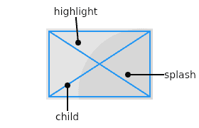
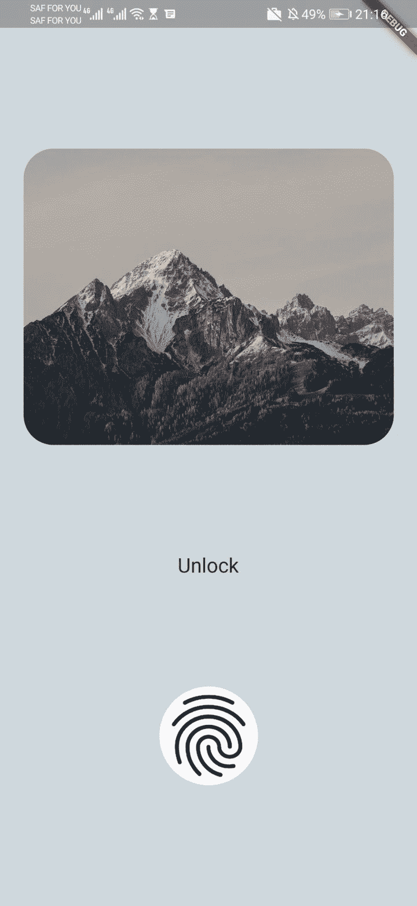

# 在 Flutter 中实现 InkWell 类

> 原文：<https://blog.logrocket.com/implementing-inkwell-class-flutter/>

增加基于触摸的交互可以增加应用程序的有用性，并增强用户体验。更进一步，提供基于用户手势的视觉反馈可以使应用程序更加引人入胜。

Flutter 提供了几个小部件，比如`GestureDetector`、[，可以用来响应用户的触摸事件](https://blog.logrocket.com/handling-gestures-flutter-gesturedetector/)。然而，它们并不都提供基于用户手势的视觉反馈。

在本文中，我们将研究 [Flutter 的`InkWell`类](https://api.flutter.dev/flutter/material/InkWell-class.html)，它可以用来提供视觉反馈和响应用户触摸事件。我们将演示如何在 Flutter 中实现`InkWell`类，以及如何使用`InkWell`来定制一个应用。

## 扑扑的`InkWell`类

`InkWell`类是一个`Material`小部件的矩形区域，它通过显示一个剪辑的飞溅来响应触摸事件。`Material`小部件负责触摸事件发生时显示的墨迹效果。`Material`指的是墨水反应被绘制的区域。

点击时，墨水会绘制在矩形区域中，并且突出显示颜色会在飞溅颜色下方扩散。下面的图片，来自颤振团队的[，是一个`InkWell`被点击时的样子的代表:](https://api.flutter.dev/flutter/material/InkWell-class.html)



An InkWell has a rectangular shape and a highlight color that spreads below the splash color.

为了正确显示墨迹反应，`InkWell`类需要一个`Material`小部件作为祖先。如果`InkWell`类和不透明的小部件一起使用，比如带颜色的`Container`，那么飞溅效果将不可见。然而，我们可以通过用一个`Ink`小部件替换一个不透明的小部件来解决这个问题。

`InkWell`类不会更新它的 splashes 来匹配动画父`Material`小部件的大小。应该避免将它与改变尺寸的部件一起使用，因为飞溅不会相应地调整。`InkWell`小部件无法适应父小部件不断变化的尺寸。

`InkWell`有[几个属性](https://api.flutter.dev/flutter/material/InkWell-class.html#instance-properties)，可以用来显示对 用户触摸事件的定制响应。

## 使用`InkWell`定制应用程序

在本教程中，我们将自定义一个应用程序，该应用程序由垂直列中显示的三个小部件组成:

*   `image_widget.dart`:图像
*   `custom_button_widget.dart`:正文
*   `fingerprint_widget.dart`:指纹图标

这是我们将定制的应用程序:



### 将`InkWell`添加到应用程序的按钮、文本和图像

首先，我们将更新`fingerprint_widget.dart`文件:

```
return Material(
  shape: const RoundedRectangleBorder(
      borderRadius: BorderRadius.all(Radius.circular(50))),
  child: InkWell(
    onTap: (){},
    child: const Icon(
      Icons.fingerprint,
      size: 100,
    ),
  ),
);

```

我们添加一个`InkWell`小部件作为一个`Material`小部件的子部件。然后，我们添加一个`onTap`处理程序。`InkWell`飞溅效果仅在添加手势回调时可见，在本例中为`onTap`。使用这段代码，当点击指纹图标时，将创建飞溅效果。

接下来，我们将更新`custom_button_widget.dart`文件:

```
return InkWell(
  onTap: (){},
  child: Container(
    padding: const EdgeInsets.symmetric(vertical: 12, horizontal: 24),
     decoration: BoxDecoration(
         borderRadius: BorderRadius.circular(5),
        // adding color will hide the splash effect
       // color: Colors.blueGrey.shade200,
     ),
    child: const Text("Unlock", style: TextStyle(fontSize: 24),),
  ),
);

```

这个小部件包含一个不透明的`Container`小部件。我们用一个`InkWell`小部件包装了`Container`小部件，并添加了`onTap`处理程序。使用这段代码，点击文本时会产生飞溅效果。但是，给`Container`添加颜色会隐藏这种效果，因为`Container`是不透明的。

为了解决这个问题，我们用一个`Ink`小部件替换了`Container`小部件。这确保了应用于`Ink`的颜色或装饰也在`InkWell`中绘制，并且飞溅效果是可见的。

现在，我们将更新`image_widget.dart`文件:

```
return Ink(
  width: double.infinity,
  height: 300,
  decoration: BoxDecoration(
      borderRadius: BorderRadius.circular(30),
      image: const DecorationImage(
          image: NetworkImage(
              "https://images.unsplash.com/photo-1589405858862-2ac9cbb41321?ixlib=rb-1.2.1&ixid=MnwxMjA3fDB8MHxwaG90by1wYWdlfHx8fGVufDB8fHx8&auto=format&fit=crop&w=1170&q=80"),
          fit: BoxFit.fill)),
  child: InkWell(onTap: (){},),
);

```

我们使用`Ink`小部件来显示图像，并添加一个`InkWell`小部件作为子部件。`Ink`的图像和装饰可以在不隐藏`InkWell`的飞溅效果的情况下进行绘画。

这个视频展示了波动的连锁反应。当用户触摸交互式小部件时，会出现这种效果:

### 修改`InkWell`高光和飞溅颜色

当我们点击`InkWell`小部件时，高亮颜色会立即绘制在小部件上。然后，飞溅的颜色被涂在高光的上面，产生一种波纹效果。

我们将修改三个文件来定制高光和飞溅颜色:

```
InkWell(
  onTap: () {},
  highlightColor: Colors.blue.withOpacity(0.4),
  splashColor: Colors.green.withOpacity(0.5),
)

```

我们给`InkWell`一个蓝色的`highlightColor`和一个绿色的`splashColor`。我们还为颜色添加了不透明度，以确保当颜色覆盖在小部件上时有一定的透明度。

该视频展示了自定义高光和飞溅颜色后的应用程序:

在触摸事件中，墨水描绘出与图像或指纹区域的形状不匹配的矩形形状。接下来，我们将修改`InkWell`的矩形形状。

### 定制`InkWell`边框

一个`InkWell`呈长方形。轻按时，高亮颜色会填充矩形。我们使用`borderRadius`属性或者创建一个[自定义形状](https://blog.logrocket.com/drawing-shapes-in-flutter-with-custompaint-and-shape-maker/)，通过使用`customBorder`属性来裁剪矩形的角。

只有在没有分配`customBorder`的情况下,`borderRadius`属性才有效。

我们将使用`borderRadius`属性来修改`InkWell`框的形状。

首先，我们更新`image_widget.dart`和`custom_button_widget.dart`文件:

```
borderRadius: BorderRadius.circular(30),

```

然后，我们更新`fingerprint_widget.dart`文件:

```
borderRadius: BorderRadius.circular(50),

```

这些更新向`InkWell`小部件添加了一个循环`borderRadius`。`borderRadius`以指定的半径(在本例中为 30 度和 50 度)圆形裁剪矩形的角。

视频显示了定制`InkWell`框的边框以匹配图像的边框后的应用程序:

### 用`InkWell`响应用户手势

响应用户手势是让应用程序更具交互性的一种方式。`InkWell`提供可用于响应用户手势的属性。

下面是一些常见的用户手势和用户手势发生时触发的回调:

*   点击:用户用指尖短暂触摸屏幕。敲击回调包括`onTap`、`onTapDown`和`onTapCancel`
*   双击:用户快速连续点击屏幕上的同一个位置两次。使用了`onDoubleTap`回调
*   长按:用户长时间触摸屏幕上的一个位置。使用了`onLongPress`回调

当用户接触屏幕时会触发`onTapDown`回调。当接触导致的手势不是点击、双击或长按时，默认情况下会触发`onTapCancel`。

我们将创建一个方法`showSnackBar`，它接受一个`String gesture`。该函数创建一个带有`Text`的`SnackBar`来显示被触发的`gesture`。它隐藏以前显示的小吃店(如果有)，并显示一个新的小吃店:

```
showSnackBar(String gesture) {
  var snackBar =  SnackBar(
    content: Text('You $gesture'),
  );

  ScaffoldMessenger.of(context).hideCurrentSnackBar();
  ScaffoldMessenger.of(context).showSnackBar(snackBar);
}

```

我们将在`image_widget.dart`文件中处理手势回调:

```
InkWell(
  onTap: () {
    showSnackBar('tapped');
  },
  onDoubleTap: () {
    showSnackBar('double tapped');
  },
  onLongPress: () {
   showSnackBar('long pressed');
  },
  borderRadius: BorderRadius.circular(30),
  highlightColor: Colors.blue.withOpacity(0.4),
  splashColor: Colors.green.withOpacity(0.5),
)

```

当用户触发一个手势事件时，显示一个带有相应字符串手势的小吃店。

该视频展示了定制为响应触摸事件后的应用程序:

## 重要注意事项

这里总结了在 Flutter 应用程序中使用`InkWell`类时需要记住的重要事项:

*   `InkWell`是为矩形区域设计的。要使用具有可配置形状的变体，请参见`[InkResponse](https://api.flutter.dev/flutter/material/InkResponse-class.html)`
*   `InkWell`小部件必须有一个`Material`小部件作为其父部件
*   `InkWell`的 splash 不会自动更新以匹配其父`[Material](https://api.flutter.dev/flutter/material/Material-class.html)`小部件的大小变化
*   可以通过`Material`小部件的颜色属性来设置`InkWell`小部件的颜色
*   在`Material`部件和`InkWell`部件之间使用带有图像或装饰的不透明部件将隐藏`InkWell`的连锁反应
*   `Ink`小部件可以替换不透明的小部件。它确保图像和装饰正确显示，同时保持涟漪效果可见
*   一个`InkWell`上的涟漪效应只有在一个触摸事件处理程序后才可见，比如添加了`onTap` *、*

## 结论

Flutter 的`InkWell`类可以让应用程序更具交互性，并通知用户他们的手势已成功注册。

在本教程中，我们研究了`InkWell`类的不同属性和定制，并演示了如何在 Flutter 应用程序中实现`InkWell`类。我们还回顾了使用`InkWell`小部件时需要注意的一些重要事项。

本文中的所有代码都可以在 [GitHub](https://github.com/Ivy-Walobwa/implementing_inkwell_flutter) 上获得。我希望你喜欢这个教程！

## 使用 [LogRocket](https://lp.logrocket.com/blg/signup) 消除传统错误报告的干扰

[](https://lp.logrocket.com/blg/signup)

[LogRocket](https://lp.logrocket.com/blg/signup) 是一个数字体验分析解决方案，它可以保护您免受数百个假阳性错误警报的影响，只针对几个真正重要的项目。LogRocket 会告诉您应用程序中实际影响用户的最具影响力的 bug 和 UX 问题。

然后，使用具有深层技术遥测的会话重放来确切地查看用户看到了什么以及是什么导致了问题，就像你在他们身后看一样。

LogRocket 自动聚合客户端错误、JS 异常、前端性能指标和用户交互。然后 LogRocket 使用机器学习来告诉你哪些问题正在影响大多数用户，并提供你需要修复它的上下文。

关注重要的 bug—[今天就试试 LogRocket】。](https://lp.logrocket.com/blg/signup-issue-free)