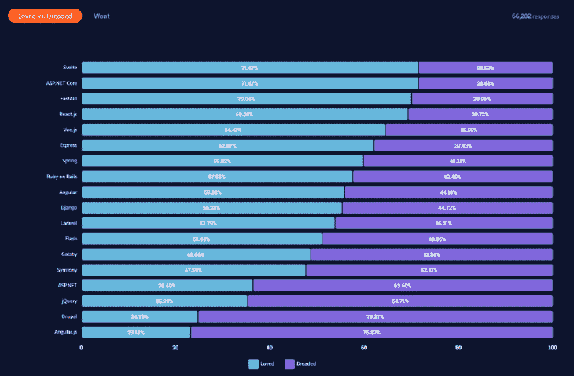
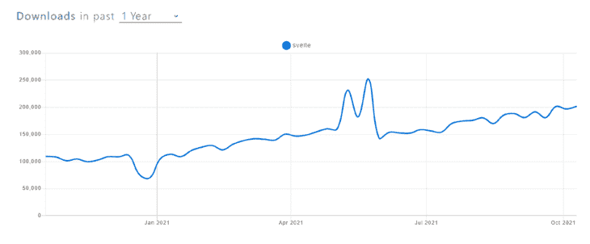
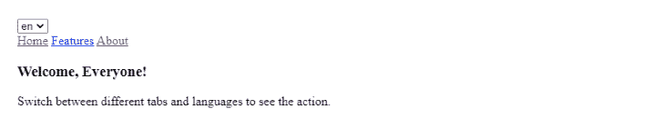
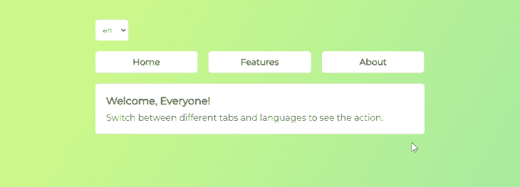

# 在 Svelte 中实现本地化

> 原文：<https://blog.logrocket.com/implementing-localization-svelte/>

在本教程中，我们将在一个细长的应用程序中实现本地化。该应用程序将包括路由，所以你可以在应用程序的多个页面上划分内容。

我们将首先建立一个新项目，然后为本地化内容创建字典，配置本地化包，创建布局，最后设计应用程序的样式。

最终，我们将有一个本地化的应用程序，其中默认语言由浏览器检测。此外，用户将能够使用下拉菜单手动切换语言。

作为参考，源代码和完整的演示应用程序可从[这里](https://codesandbox.io/s/svelte-localization-n41rt)获得。

## 什么是苗条？

使用苗条的主要优点是它的反应能力和它的重量轻。

与现有的解决方案如 [React](https://reactjs.org/) 和 [Vue](https://vuejs.org/) 相比，Svelte 在构建用户界面方面相当激进。Svelte 没有使用浏览器来完成大部分繁重的工作，而是将其转移到编译步骤，这意味着内容可以更快地显示。

根据 StackOverflow 在 2021 年的[调查](https://insights.stackoverflow.com/survey/2021#technology-most-loved-dreaded-and-wanted)，在超过 66000 名受访者中，Svelte 被选为最受喜爱的框架。



此外，如果我们看看 npm 的趋势图 T1 和 GitHub T2 库 T3，很明显这个框架值得关注，并为未来提供了巨大的潜力。



## 建立我们的苗条计划

我们将使用 Svelte 的[官方模板](https://github.com/sveltejs/template)通过 [degit](https://github.com/Rich-Harris/degit) 建立项目样板。首先，打开您的终端并运行以下命令:

```
npx degit sveltejs/template svelte-localization
```

等待安装完成，然后通过运行`cd svelte-localization`将目录更改为新创建的项目文件夹。接下来，运行`npm install`来安装项目运行所需的所有依赖项。

一旦完成，你就可以运行`npm run dev`，这将启动 [Rollup.js](https://rollupjs.org/guide/en/) 。

最后，打开你的浏览器并导航到`[http://localhost:5000/](http://localhost:5000/)`，它将呈现一个功能齐全的苗条应用，看起来像这样:


默认样板文件附带了一些我们不需要的额外代码。要清理它，导航到`src`文件夹，打开`App.svelte`文件，并删除其中的所有内容。稍后我们将从头开始编写所有内容。

## 创建苗条的字典

我们将为每种语言创建单独的地区词典:英语、西班牙语和法语。每个地区将包括导航项目(主页、功能和关于)的翻译，以及每个页面所包含的内容(标题和描述)。

为此，创建一个名为`langs`的新文件夹，并在其中创建三个文件:

您可以手动操作，也可以在终端中使用以下命令:

```
mkdir langs && cd langs && touch en.json es.json fr.json
```

要创建英语语言环境，请打开文件`en.json`并包含以下代码:

```
{
  "nav": {
    "home": "Home",
    "features": "Features",
    "about": "About"
  },
  "home": {
    "title": "Welcome, Everyone!",
    "description": "Switch between different tabs and languages to see the action."
  },
  "features": {
    "title": "Main Features",
    "description": "The default language on the launch is detected by the user's browser. If it is not supported, English is used. If the user selects the language manually from the menu, that particular language is used."
  },
  "about": {
    "title": "Stack of Technologies",
    "description": "This demo was built by Madza. I used 'Svelte', 'svelte-routing' and 'svelte-i18n' as the stack of technologies."
  }
}
```

接下来，要创建西班牙语的语言环境，打开文件`es.json`并包含以下代码:

```
{
  "nav": {
    "home": "Hogar",
    "features": "Características",
    "about": "Sobre"
  },
  "home": {
    "title": "¡Todos bienvenidos!",
    "description": "Cambie entre diferentes pestañas e idiomas para ver la acción."
  },
  "features": {
    "title": "Principales características",
    "description": "El navegador del usuario detecta el idioma predeterminado en el lanzamiento. Si no es compatible, se utiliza el inglés. Si el usuario selecciona el idioma manualmente en el menú, se utiliza ese idioma en particular."
  },
  "about": {
    "title": "Pila de tecnologías",
    "description": "Esta demostración fue construida por Madza. Usé 'Svelte', 'svelte-routing' y 'svelte-i18n' como pila de tecnologías."
  }
}
```

最后，要创建法语的语言环境，打开文件`fr.json`并包含以下代码:

```
{
  "nav": {
    "home": "Domicile",
    "features": "Caractéristiques",
    "about": "À propos"
  },
  "home": {
    "title": "Bienvenue tout le monde!",
    "description": "Basculez entre différents onglets et langues pour voir l'action."
  },
  "features": {
    "title": "Caractéristiques principales",
    "description": "La langue par défaut au lancement est détectée par le navigateur de l'utilisateur. S'il n'est pas pris en charge, l'anglais est utilisé. Si l'utilisateur sélectionne la langue manuellement dans le menu, cette langue particulière est utilisée."
  },
  "about": {
    "title": "Pile de technologies",
    "description": "Cette démo a été construite par Madza. J'ai utilisé 'Svelte', 'svelte-routing' et 'svelte-i18n' comme pile de technologies."
  }
}
```

## 安装软件包

接下来，我们将设置一些外部包，以便我们可以访问和使用以前创建的字典。为此，我们将使用 [svelte-i18n](https://www.npmjs.com/package/svelte-i18n) 和 [@rollup/plugin-json](https://www.npmjs.com/package/@rollup/plugin-json) 。

要安装这两个软件包，请打开终端并运行命令:

```
npm i svelte-i18n @rollup/plugin-json
```

Svelte-i18n 是一个简单的包，它使用存储来跟踪当前的语言环境，包括一个字典，帮助格式化文件，等等。 [@rollup/plugin-json](https://www.npmjs.com/package/@rollup/plugin-json) 是一个帮助器包，允许我们导入 json 文件来与 [Rollup](https://rollupjs.org/guide/en/) 一起工作。

让我们也实现一个简单的路由，这样我们就可以跨多个页面使用本地化。为此，我们将使用[细长路由](https://www.npmjs.com/package/svelte-routing)，由于内置的`Router`、`Link`和`Route`组件，它简化了路由过程。

要安装软件包，请打开终端并运行命令:

```
npm i svelte-routing
```

## 在苗条中初始化本地化

现在，我们已经安装了所有必需的包——我们只需要配置它们。

打开`App.svelte`文件并添加以下代码:

```
<script>
  import { Router, Route, Link } from "svelte-routing";
  import {
    _,
    getLocaleFromNavigator,
    isLoading,
    register,
    init,
    locale
  } from "svelte-i18n";

  register("en", () => import("./langs/en.json"));
  register("es", () => import("./langs/es.json"));
  register("fr", () => import("./langs/fr.json"));

  init({
    fallbackLocale: "en",
    initialLocale: getLocaleFromNavigator()
  });

  const handleLocaleChange = e => {
    e.preventDefault();
    locale.set(e.target.value);
  };
</script>
```

让我们来看看我们在这个代码块中完成了什么。首先，我们从`svelte-routing`导入了所有必需的组件(`Router`、`Route`和`Link`)，因此我们可以在以后实现页面的全功能路由机制。

然后我们从`svelte-i18n`中导入必要的方法，这样我们可以稍后使用它们来本地化应用程序。`_`将允许我们访问字典，`getLocaleFromNavigator`将从浏览器中获取默认语言环境，`isLoading`将帮助我们控制语言环境的加载状态，`init`将允许我们初始化它们，`locale`将允许我们手动设置它们。

之后，我们注册了每种语言，并设置了默认(初始)语言，以及如果默认语言不被支持时的备用语言。

最后，我们创建了`handleLocaleChange`函数来通过下拉菜单设置语言，我们将在下一节实现它。

## 构建应用布局

要使用我们刚刚初始化的本地化特性，我们必须创建一个显示字典内容的布局，并允许我们切换语言环境。

在`App.svelte`中的脚本标签下，添加以下代码:

```
// script tags..

{#if $isLoading}
  <p>Loading</p>
{:else}
  <main>
    <Router>
      <select on:change={handleLocaleChange}>
        <option value="en">en</option>
        <option value="es">es</option>
        <option value="fr">fr</option>
      </select>
      <header >
        <nav>
          <Link to="/">{$_('nav.home')}</Link>
          <Link to="features">{$_('nav.features')}</Link>
          <Link to="about">{$_('nav.about')}</Link>
        </nav>
      </header>
      <section>
        <Route path="/">
          <h3>{$_('home.title')}</h3>
          <p>{$_('home.description')}</p>
        </Route>
        <Route path="features">
          <h3>{$_('features.title')}</h3>
          <p>{$_('features.description')}</p>
        </Route>
        <Route path="about">
        <h3>{$_('about.title')}</h3>
          <p>{$_('about.description')}</p>
        </Route>
      </section>
    </Router>
  </main>
{/if}
```

首先，我们使用 if 和 else 语句来检测字典是否已经加载。为此，我们使用了`$isLoading`商店。

如果词典没有被加载，我们会返回一条消息通知用户(只有在加载时间超过 200 毫秒后才会显示，这种情况很少见)。当字典被加载后，Svelte 会显示应用程序。

整个应用程序驻留在`main`包装器中。在它的内部，有一个`Router`组件，它是路由机制的包装器。

我们还有一个`select`下拉菜单，允许我们选择应用程序的语言。我们使用输入事件`on:change`并传入之前创建的`handleLocaleChange`函数来获取选择的语言并将其设置为活动的语言环境。

在`header`内部，每个`nav`元素通过`$_`方法接收来自语言词典的输入，这是来自`svelte-i18n`的`$format`的简写别名。

每个`section`元素包括`Route`组件，该组件使用特定的路径，并通过来自`svelte-i18n`的`$_`方法包括页面的标题和描述。

让我们测试一下我们目前掌握的情况。打开您的终端，运行`npm run dev`启动汇总，然后在浏览器中导航到`[http://localhost:5000/](http://localhost:5000/)`。

您应该会看到元素的基本布局结构:



## 设计苗条的应用程序

为了设计我们的应用程序，我们将为每个元素添加一些样式规则。

打开`App.svelte`并添加以下样式规则:

```
// script tags..

// elements..

<style>
  @import url("https://fonts.googleapis.com/css2?family=Montserrat&display=swap");

  * {
    padding: 0;
    margin: 0;
    box-sizing: border-box;
    font-family: "Montserrat", sans-serif;
  }

  :global(body) {
    background-image: linear-gradient(120deg, #d4fc79 0%, #96e6a1 100%);
    min-height: 100vh;
    color: black;
    padding: 10px;
  }

  main {
    max-width: 600px;
    margin: 0 auto;
  }

  select {
    border: none;
    padding: 10px;
    margin-bottom: 20px;
    border-radius: 5px;
  }

  nav {
    margin-bottom: 20px;
    display: grid;
    grid-template-columns: 1fr 1fr 1fr;
    text-align: center;
    gap: 20px;
  }

  nav > :global(a) {
    background-color: white;
    padding: 10px 20px;
    border-radius: 5px;
    color: black;
    font-weight: bold;
    text-decoration: none;
  }

  section {
    background-color: white;
    padding: 20px;
    border-radius: 5px;
  }

  h3 {
    margin-bottom: 10px;
  }

  @media screen and (max-width: 500px) {
    nav {
      grid-template-columns: 1fr;
    }
  }
</style>
```

这里，我们首先导入了 [Montserrat](https://fonts.google.com/specimen/Montserrat) 字体，并将其设置为在所有元素中使用。我们还重置了`margin`、`padding`和`box-sizing`的规则，这样它们就不会因为使用了默认值而在不同的浏览器中有所不同。

然后，我们通过设置绿色渐变为`background`来设计`body`，设置`height`至少使用整个视口，设置文本`color`为黑色，并添加一些`padding`，这样应用程序在响应屏幕上看起来很棒。

对于`main`包装器，我们定义了一个永远不能超过的特定的`width`,并将其水平居中到视口。

我们还删除了`select`下拉列表的默认边框，添加了一些`radius`，设置了一些`padding`，并设置了一些底部的`margin`。这确保了下面的直接元素之间有一些空间。

对于`nav`，我们使用了一个有三列和一个`20px`间隔的网格布局。我们将包含的文本居中，并添加了下边距。

对于包含的链接，我们去掉了文字修饰，设置字体颜色为黑色，加粗，设置`background-color`为白色，并添加了一些`padding`和`border-radius`。

请注意，我们通过添加白色的`background`、一些`padding`和一个边框`radius`来设计`section`元素的样式，因此它更适合应用程序的整体样式。

我们还为`h3`元素添加了一些底部的`margin`，所以在部分标题和描述之间有一些空间。

最后，我们为响应屏幕添加了一个媒体规则，因此对于比`width`中的`500px`小的屏幕，`nav`元素切换为一列布局，这意味着每个导航项目将直接显示在彼此下方。

如果我们现在检查浏览器，输出应该是一个功能齐全的应用程序。



## 结论

如果您知道您的目标受众是国际客户，他们的母语不同于您的应用程序中使用的默认语言，您应该实现本地化。通过这种方式，用户知道你关心他们，总体来说，这极大地改善了整体 UI/UX。

您可以根据需要添加任意数量的语言环境。此外，您可以随时通过添加更多页面和内容来更新这个演示应用程序。也许你甚至可以添加一个后端功能，并支持私人路线，所以用户必须登录才能看到它们。

感谢阅读，我希望你会发现这个演示的实际用途！

## 使用 [LogRocket](https://lp.logrocket.com/blg/signup) 消除传统错误报告的干扰

[](https://lp.logrocket.com/blg/signup)

[LogRocket](https://lp.logrocket.com/blg/signup) 是一个数字体验分析解决方案，它可以保护您免受数百个假阳性错误警报的影响，只针对几个真正重要的项目。LogRocket 会告诉您应用程序中实际影响用户的最具影响力的 bug 和 UX 问题。

然后，使用具有深层技术遥测的会话重放来确切地查看用户看到了什么以及是什么导致了问题，就像你在他们身后看一样。

LogRocket 自动聚合客户端错误、JS 异常、前端性能指标和用户交互。然后 LogRocket 使用机器学习来告诉你哪些问题正在影响大多数用户，并提供你需要修复它的上下文。

关注重要的 bug—[今天就试试 LogRocket】。](https://lp.logrocket.com/blg/signup-issue-free)